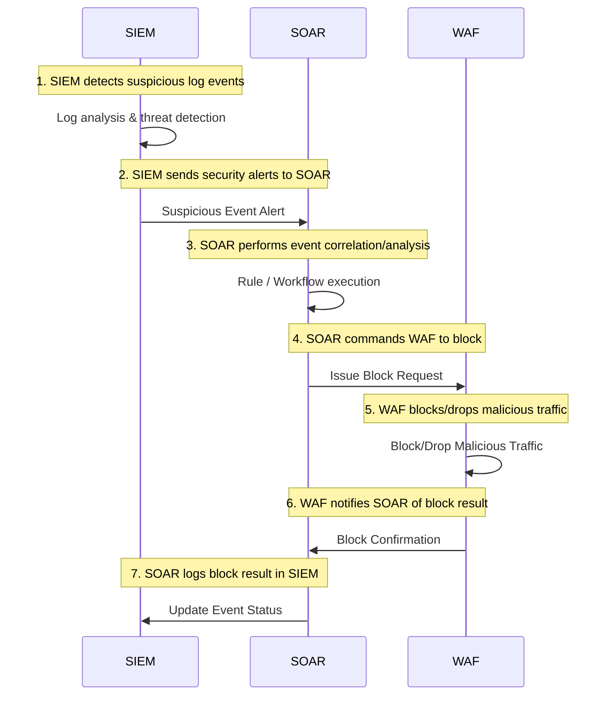

📉 **SOAR** solutions typically receive **security events** from **SIEM** and then carry out **automated responses**.
Yet many organizations report: “**We deployed SOAR but can’t really do automated response.**”

The main reason is that **SOAR does not operate in isolation**. It **completely depends on SIEM’s detection results**—and if your SIEM environment still suffers from “**incomplete log collection and analysis**,”
you **can’t realistically expect accurate automatic responses** from SOAR.

> This article references [“If You Deploy SIEM, Then What?”](https://blog.plura.io/en/column/why_siem_always_fails/) and outlines the **difficulties** in implementing **SOAR**—as well as the **root causes** behind them.

* SOAR: Security Orchestration, Automation, and Response
* SIEM: Security Information and Event Management

<!--more-->

---

## 1. Why Does SOAR Depend on SIEM?

### (1) The Basic SOAR Mechanism

* **SOAR** usually receives **security events** from **SIEM** or other monitoring solutions.
* It uses predefined **workflows** or **automation scripts** to:

  * e.g., block malicious IPs, temporarily disable related accounts, create tickets, etc.
* SOAR performs **immediate** or **semi-automatic** incident **response**.

### (2) What if “Bad Events” Come In?

* If the **SIEM** produces **too many false positives** or **misses** real threats,
* **SOAR** will act on “incorrect events” or fail to see critical incidents at all:

  * Possibly never triggering a response, or
  * Blocking/penalizing the wrong target.
* Hence, **SOAR** accuracy depends on **SIEM detection accuracy**.

### (3) If SIEM Is Weak, Automated Response Is Just a Pipe Dream

* A **flawed SIEM** means incomplete event data or unreliable detection.
* Any SOAR built on top of that will be forced to automate on “bad data,” leading to:

  * **More risk**, e.g. unneeded blocks or missed actual attacks.
* ⚡Therefore, many security pros see implementing **SOAR** without a **stable SIEM** as **premature**.

---

## 2. Why SOAR Often Can’t “Auto-Respond”

People assume “**SOAR** → automatic response,” but in many cases it fails to operate properly. The **root causes** include:

### (1) SIEM’s Log Collection & Analysis Limitations

* SIEM generally relies on **basic access logs** or standard event logs.
* If you **can’t capture key attack data** (request body, response body):

  * **SQL injection**, **data exfiltration**, etc. are **undetectable**.
* Without adequate **true positives** from SIEM, there’s no basis for SOAR to **automatically block** or respond.

### (2) No Attack Scenario Rules → No Automated Responses

* For SOAR to decide “This event is dangerous, let’s automate a response,”

  * A **rule** must confirm that the event is truly malicious.
* Many SIEM deployments have incomplete attack pattern definitions or rely on poorly tuned rules, resulting in difficulty separating false positives from real threats.
* In short: “**No rules or signatures = no job**” for SOAR.

### (3) Lacking Skilled Staff & Processes → Automation Still Needs People

* Despite the promise of “automation,” **SOAR** deployment still requires:

  * **Security teams** to carefully distinguish false positives.
* If a SIEM generates too many false positives, SOAR ends up wasting resources on unnecessary response flows.
* ✅ Ultimately, “**proper logs + accurate rules + qualified personnel**” are prerequisites.
  Without these, **SOAR** is only “**automated response**” in name but never realistically executes it.

---

### Sample Diagram: SIEM ↔ SOAR ↔ WAF Integration

---

---

## 3. How “SIEM Problems” Become “SOAR Problems”

As explained in the linked article, the biggest **SIEM** issue is “**inadequate log collection** and **lack of analysis staff**.”

> [SIEM: Then What? If Log Collection & Analysis Don’t Work](https://blog.plura.io/en/column/why_siem_always_fails/)

Those same points apply to **SOAR**:

1. Incomplete **log collection** → insufficient detection events
   → **SOAR** lacks events to respond to.
2. Limited **detection rules** & **analysis expertise** → low confidence in SIEM alerts
   → **SOAR** auto-response can block **legitimate** traffic too often.
3. **Understaffed** ops → can’t even keep up with SIEM’s false positives
   → Hard to handle false positives automatically in SOAR → eventually neglected.

✅ Inevitably, without proper SIEM operations, **SOAR** can’t reliably provide **automated response**.

---

## 4. “If You Deploy SOAR, Then What?”—Answering the Question

### (1) Address “Auto-Detection” Before “Auto-Response”

* SOAR is about **“auto-detect → auto-respond”** flow.
* But **robust detection** must come from SIEM first,
  ensuring that “**If this event fires, we can safely block**.”
* So, before implementing SOAR, invest in **SIEM** to improve:

  * **Log coverage**,
  * **Detection rules**,
  * **Trained analysts**, etc.

### (2) Build SIEM Operational Maturity First

* Once **SIEM operations** are stable and **false positives** are minimal,

  * You can trust that “This event definitely deserves automated response.”
* Deploying SOAR prematurely leads to:

  * Over-blocking that might disrupt business,
  * Forcing “semi-automated” usage of SOAR, diminishing ROI.

### (3) “It’s Never Too Late to Perfect SIEM, Then Add SOAR”

* In practice, you refine **SIEM** operations for an extended period:

  * Tuning rules, filtering benign events, reducing false positives, etc.
* Only when **SIEM** produces a “certain threshold of accurate detections”

  * **Introducing SOAR** is absolutely viable.
* 💡 That way, you get **real** automation and **better returns** on your investment.

---

## 5. When Should You Deploy SOAR?

1. **Check If You Already Have Enough Good SIEM Alerts**

   * Can your system handle expanded **log ingestion** without collapsing?
   * Is the **true-positive** rate high enough?
   * Do you have staff capable of monitoring/improving detection metrics?

2. **Assess the Maturity of Your Response Processes**

   * Is there a well-defined approach for each attack type?
   * If you know “which actions” to take for each event, you can automate them in SOAR.

3. **Perform a Thorough Risk Assessment of Potential Business Impact**

   * Could false positives block legitimate users?
   * Are there steps needing manual review before fully automated response?

Ensuring these are “**checked**” and reasonably mature before rolling out SOAR ensures real **automated response** effectiveness.

---

## 6. Conclusion: “SOAR Is the Shadow of SIEM”

* **SOAR** aims to “automate security events,” but
  those events fundamentally originate from **SIEM**.
* If SIEM can’t reliably **detect** attacks, **SOAR**’s **automation** means little.
* Anyone considering SOAR must ask, “**Is our SIEM operation advanced enough** for auto-response?”
  That’s a critical step.

---

## 7. Final Answer to “If You Deploy SOAR, Then What?”

1. **SOAR** is never a **standalone** magic solution for automated response.
2. **SIEM detection accuracy**, **staff expertise**, **rule design** must be sufficiently mature
   for **SOAR** to safely implement **automated response**.
3. If **SIEM** is **incomplete**, **SOAR** simply executes “bad events” → “bad automation,”
   becoming an even bigger **liability**.
4. Thus, it’s **not too late** to reinforce **log collection** and **analysis** first,
   and only then deploy **SOAR** for maximum benefit.

✅ Essentially, if you want **“SOAR-driven auto-response,”** you must first **mature your SIEM** operations.

---

### 📚 PLURA Blog

* [So You Deployed a SIEM—Now What? If You Can’t Collect or Analyze Logs Properly](https://blog.plura.io/en/column/why_siem_always_fails/)
* [Is Log Analysis for Hack Investigations a Myth?](https://blog.plura.io/en/column/myth/)
* [Analyzing Request Body Logs in Splunk](https://blog.plura.io/en/column/splunk_request_body_analysis/)
* [Introduction to Preventing Data Exfiltration via Web Traffic](https://blog.plura.io/en/column/dlp/)
* [Traditional SOC vs. PLURA-XDR Platform](https://blog.plura.io/en/column/traditional_soc_vs_plura_xdr/)

### 🌟 PLURA-XDR Services

* [Introduction to PLURA-XDR](https://www.plura.io/platform/xdr)

> If you aim for “**automated security**” via **SOAR**,
> ensure your **SIEM** can collect and analyze “**accurate, sufficient logs**” under a proper framework.
> **Automation** fundamentally depends on **trustworthy detection**.
> Without preparation, **SOAR** can lead to “**auto-chaos**” rather than auto-response.

> Consider adopting the **[PLURA-XDR](https://www.plura.io/platform/xdr) automated platform**.
> It integrates SIEM, WAF, and EDR, offering built-in SOAR functionality for automated response.
