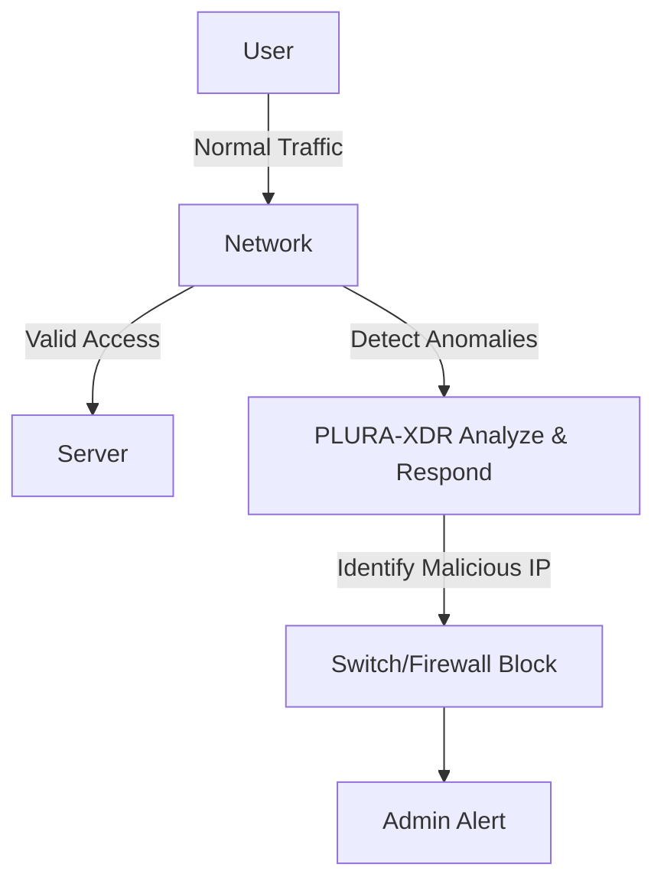

📖 **Is a NAC (Network Access Control) solution really necessary? A practical assessment**

> Objective: In information security, **proactive measures are essential**. However, **overdoing proactive controls can cause us to overlook more critical threats**. This article examines whether NAC-based preemptive IP management is absolutely required, and proposes more realistic, efficient alternative strategies.


<!--more-->

---

## 1. Issues with Traditional NAC Implementation

A NAC (Network Access Control) solution is a system proposed to preemptively control network access for administrative purposes. In practice, however, the following issues commonly arise:

### ❌ **High Initial Costs & Ongoing Operational Burden**

* Purchasing dedicated appliances and licenses
* Continuous management and maintenance staff required
* Frequent policy updates needed as corporate environments evolve

### ❌ **Unnecessary Over-Management**

* Burden of pre-registering all IP addresses
* Mandatory procedures for low-risk IPs add overhead
* Even legitimate users may face inconvenience during the authentication process

### ❌ **Uncertain Security Gains**

* IP whitelisting alone does not guarantee perfect security
* Inside users or attackers may find ways to circumvent these controls
* Separate anomaly detection and incident response are still necessary

### ❌ **Additional Software Installation Overhead**

* NAC solutions typically require agent software on each host
* Potential conflicts with existing systems
* Extra burden for user devices

---

## 2. A Practical Alternative: Optimizing Security Without NAC

### 📌 **(1) Manage IP Addresses Only When Needed (Eliminate Pre-Registration)**

Using NAC requires pre-registering every IP, which leads to unnecessary administrative overhead. A more realistic approach is to isolate the problematic IP **after** an incident occurs.

#### ✅ **Alternative: Detect Anomalies First, Then Respond**

* **EDR-based Anomaly Detection**: Automatically respond when suspicious login attempts or attacks are detected from a certain IP
* **Switch-Level Network Blocking**: Block IP addresses dynamically when an issue occurs, without prior registration
* **Event-Driven Management**: If no incident arises, there’s no need for IP pre-registration

---

### 📌 **(2) Switch-Based IP Isolation and Blocking**

Instead of NAC, you can bolster security by leveraging switches and firewalls.

#### 🔹 **Method 1: Direct IP Blocking at the Network Switch**

```bash
# Example (Cisco): Block a specific IP on the network
conf t
access-list 101 deny ip 192.168.1.100 0.0.0.255 any
```

#### 🔹 **Method 2: Blocking Suspicious IPs via Firewall (iptables)**

```bash
# Use iptables to drop traffic from a specific IP
iptables -A INPUT -s 192.168.1.100 -j DROP
```

#### ✅ **Benefits**

* Maintains security **without** pre-registering unnecessary IP addresses
* **More cost-effective** than NAC with comparable security benefits
* Real-time response (immediate isolation upon detecting an attack)

---

### 📌 **(3) Using PLURA-XDR for Anomaly Detection and Automated Blocking**

With PLURA-XDR, you can monitor network anomalies in real time and automatically block suspicious IP addresses.

#### 🔹 **Automated Response with PLURA-XDR**

* **Real-time log analysis** to detect abnormal login attempts and attacks
* **Credential stuffing, SQL injection, and other attacks** identified and blocked instantly
* **Immediate isolation** of malicious IPs with an alert sent to the administrator

#### ✅ **Benefits**

* Maintain real-time network security **without** a dedicated NAC solution
* Block IP addresses only when necessary, minimizing administrative overhead
* Automatically detect and halt abnormal network behavior, unauthorized logins, and attacks

---

## 3. Recommended Architecture




---

## 📌 Conclusion

NAC was originally implemented more for administrative convenience than for security enhancement. Under modern information security frameworks, **NAC often becomes an unnecessary element**—removing it is often more beneficial.

☑️ NAC imposes high costs and operational burden.  
☑️ Pre-registering all IP addresses is inefficient.  
☑️ Using PLURA-XDR allows for real-time anomaly detection and response.  
☑️ Security operations can proceed **without** installing extra software.

---

💡 **Alternative Approach:**

* **Minimize IP-based access controls** and only block as needed
* **Use PLURA-XDR** for automated anomaly detection and network blocking
* **Rely on switches** for isolation and traffic blocking

🚀 **You can optimize security with PLURA-XDR—without purchasing expensive NAC solutions!**
