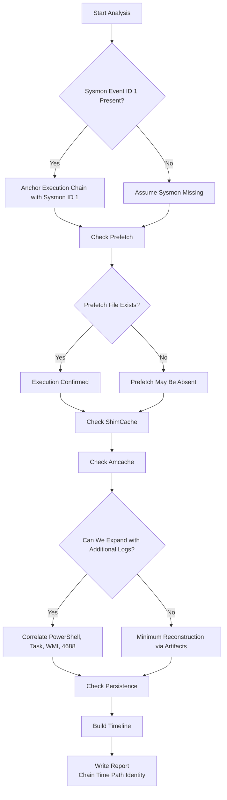

📌 **This article has one goal.**  
We don’t stop at “Was the malicious file executed?” — we go one step further:  
✅ **“Who (parent) → executed what (child) → with which arguments (CommandLine) → when → and what happened next?”**  
In other words, we focus on restoring the **Execution Chain** in a way that stands firm in a forensic report.

---

## 0) Why is this order the most intuitive?

Incident investigations often start like this:

- “We think something suspicious was executed…”
- “This file looks malicious — was it actually run?”
- “There’s no EDR, or the logs are incomplete…”

In these situations, there is an **order that minimizes confusion**:

1) **Sysmon Event ID 1**: The backbone of the execution chain (parent–child–command line–hash)  
2) **Prefetch**: The most intuitive confirmation that execution truly occurred  
3) **ShimCache**: Even if execution is unclear, confirms “that file existed at that path”  
4) **Amcache**: Even if the filename changes, confirms “this is the same file” (via metadata/hash)  
5) (If available) **PowerShell / Task / WMI logs** to connect LOLBAS activity and persistence  
6) Finally, the **report**: Present time, path, identity, and chain evidence together

---

## 1) Execution Chain Reconstruction Flow (From Sysmon ID 1 to the Final Report)

We’ll explain the full path from **Sysmon Event ID 1 → Report** in one continuous flow.

---

## 2) Why Start with Sysmon Event ID 1: Establish the “Spine” of the Execution Chain

Sysmon **Event ID 1 (Process Create)** literally records  
the moment **a process is created (executed)**.

The key point is that if Sysmon exists, you can build the execution chain based on **evidence rather than intuition**.

### ✅ Critical Fields in Sysmon Event ID 1

* **ParentImage**: “Who launched this process?”
* **Image**: “What exactly was executed (full path)?”
* **CommandLine**: “With what arguments?” (often critical for LOLBAS)
* **Hashes**: “Is this truly that file?” (identity verification)
* **Time**: The anchor point of the timeline

📌 One‑line summary

> **Sysmon ID 1 builds the chain.  
> Prefetch, ShimCache, and Amcache make that chain stable.**

---

## 3) Why Add Prefetch: The Most Intuitive Proof of Execution

Prefetch was originally designed for **performance optimization**,  
but in forensics, it becomes very simple:

> If a `.pf` file exists, **there is a very high probability that the program was executed.**

### ✅ Three Practical Artifacts from Prefetch

* **Last Run Time**: When was it executed?
* **Run Count**: How many times was it executed?
* **Referenced Files**: What files were accessed during execution?

### ❗ Why Prefetch Alone Is Not Enough

Prefetch is strong evidence of execution, but weak at telling you:

* Who executed it (parent process)
* The exact command line

That’s why **Sysmon (parent/command line) + Prefetch (execution/time/count)** is the most reliable combination.

---

## 4) Why Examine ShimCache: Locking in “The File Existed at That Path”

Attackers often:

* Self-delete after execution
* Move or rename files
* Attempt to erase traces

ShimCache (AppCompatCache) helps confirm not just execution, but:

✅ **“That file existed on the system (including path).”**

### ❌ Common Misconception About ShimCache (Important)

ShimCache timestamps are **not always execution times**.  
In many environments, they are closer to “file last modified” indicators.

Therefore, using ShimCache alone to claim “execution at this time” can distort your timeline.

📌 Best Practice

> Use **Sysmon/Prefetch to prove execution**,  
> and **ShimCache to prove presence and path**.

---

## 5) Why Use Amcache Last: Confirming “This Is That File”

Amcache can sometimes be the **decisive artifact**.

Even if:

* The filename changed
* The path changed
* The original file was deleted

Amcache preserves **identifying metadata and hashes**, allowing you to strongly assert:

✅ “This is the same file.”

### When Amcache Is Especially Valuable

* When confirming file identity via IOC hashes
* When malware masquerades as a legitimate file
* When Prefetch is missing or inconclusive

---

## 6) 🔍 At-a-Glance Comparison: Sysmon · Prefetch · ShimCache · Amcache

| Category | Sysmon (Event ID 1) | Prefetch | ShimCache | Amcache |
|----------|---------------------|----------|-----------|---------|
| Core Role | Execution chain backbone | Execution confirmation | Presence/path confirmation | File identity confirmation |
| Strengths | Parent/child, command line, hash | Run time/count, references | Path traces after deletion | Metadata & hash identity |
| Weaknesses | May not exist | Absence ≠ no execution | Timestamp confusion risk | Availability varies |
| Practical Use | Starting point | Confirm execution | Confirm presence | Confirm identity |

---

## 7) Practical Scenario: “Executed Then Deleted”

### 📌 Scenario: Attacker runs `malware.exe` then deletes it

1. **Sysmon ID 1** gives you:
   * Parent process
   * Command line
   * File hash

2. **Prefetch** confirms execution and frequency.

3. **ShimCache** confirms that `C:\Temp\malware.exe` existed.

4. **Amcache** confirms it is the same file even if renamed.

---

## 8) Expanding the Chain with Logs: LOLBAS & Persistence

Artifacts are powerful, but logs make the execution chain **longer and clearer**.

### Logs That Pair Well with Artifacts

1) Sysmon Process Create (ID 1)  
2) Security Event 4688  
3) PowerShell Script Block Logging (4104)  
4) Task Scheduler logs  
5) WMI Activity logs  

These help connect LOLBAS techniques and persistence mechanisms.

---

## 9) The Final Puzzle: “Who Brought It Back?” (Persistence)

Initial execution and re-execution triggers are often different.

Common persistence mechanisms:

* Scheduled Tasks  
* Services  
* WMI Event Subscriptions  

📌 Tip: Separate the **initial execution chain** from the **persistence chain** in your report.

---

## 10) When Prefetch Is Missing

Prefetch absence does **not** mean no execution. Reasons include:

* Prefetch disabled
* Overwritten
* Deleted by attacker
* Server environments

Then rely on ShimCache, Amcache, and logs instead.

---

## 11) How to Write an Unshakeable Report

Strong forensic reporting requires a **set of evidence**:

* **Chain**: Parent → Child
* **Time**: Log/Prefetch timestamps
* **Path**: Full path from artifacts
* **Identity**: Hash/metadata

Example statement:

> At (time), (parent process) executed (child process) with (command line).  
> Execution is confirmed by Prefetch, presence by ShimCache,  
> and identity by Amcache/Sysmon hashes.

---

## 12) Field Checklist (10 Questions)

1️⃣ Is this evidence of execution or file presence?  
2️⃣ Who executed it?  
3️⃣ What path was executed?  
4️⃣ Was it truly executed?  
5️⃣ When was it executed?  
6️⃣ How many times?  
7️⃣ Did the file exist on the system?  
8️⃣ Is it truly the same file?  
9️⃣ Any LOLBAS/script-based execution?  
🔟 Do we have chain + time + path + identity?

---

## References
- [Sysmon - Sysinternals (Microsoft Learn)](https://learn.microsoft.com/en-us/sysinternals/downloads/sysmon) 
- [4688(S) A new process has been created (Microsoft Learn)](https://learn.microsoft.com/en-us/previous-versions/windows/it-pro/windows-10/security/threat-protection/auditing/event-4688)
- [Command line process auditing (Microsoft Learn)](https://learn.microsoft.com/en-us/windows-server/identity/ad-ds/manage/component-updates/command-line-process-auditing)
- [about_Logging_Windows - PowerShell (Microsoft Learn)](https://learn.microsoft.com/en-us/powershell/module/microsoft.powershell.core/about/about_logging_windows?view=powershell-7.5)
- [WinEvent Windows Task Scheduler Event Action Started (Splunk Research)](https://research.splunk.com/endpoint/b3632472-310b-11ec-9aab-acde48001122/)
- [Windows Management Instrumentation (WMI) (NXLog Documentation)](https://docs.nxlog.co/integrate/wmi.html)
- [Windows Management Instrumentation (Red Canary)](https://redcanary.com/threat-detection-report/techniques/windows-management-instrumentation/)
- [LOLBAS Project](https://lolbas-project.github.io/)
