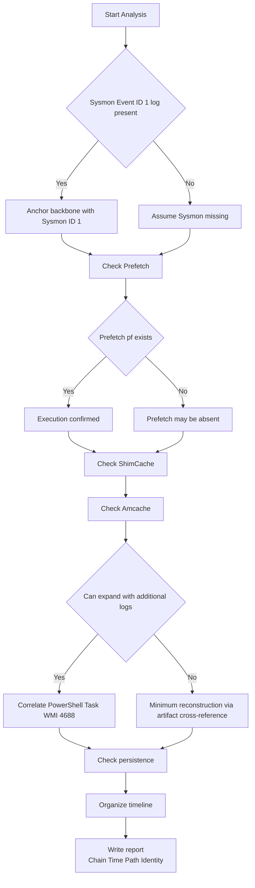

📌 **This article has one goal.**  
We don’t stop at “Was the malicious file executed?” — we go one step further:  
✅ **“Who (parent) → executed what (child) → with which arguments (CommandLine) → when → and what happened next?”**  
In other words, we aim to restore the **Execution Chain** in a way that stands firm in a forensic report.

---

## 0) Why is this order the most intuitive?

Incident analysis usually starts like this.

- “There seems to have been some suspicious execution…”  
- “This file looks malicious — was it actually executed?”  
- “There’s no EDR, or the logs are incomplete…”

In these situations, there is an **order that minimizes confusion**.

1) **Sysmon Event ID 1**: The backbone of the execution chain (parent–child–command line–hash)  
2) **Prefetch**: The most intuitive confirmation that execution truly occurred  
3) **ShimCache**: Even if execution is unclear, confirms “that file existed at that path”  
4) **Amcache**: Even if the filename changes, confirms “this is the same file” (via metadata/hash)  
5) (If available) **PowerShell/Task/WMI logs** to connect LOLBAS activity and persistence  
6) Finally, the **report**: Present time, path, identity, and chain evidence together

---

## 1) Execution Chain Reconstruction Flow (From Sysmon ID 1 to the Report)

We’ll explain the full path from **Sysmon Event ID 1 → report** in one continuous flow.

---

## 2) Why Start with Sysmon Event ID 1: Build the “Spine” of the Execution Chain First

Sysmon **Event ID 1** (Process Create) literally records  
the moment **a process is created (executed)**.

The key point is that if Sysmon exists, you can build the execution chain based on **evidence rather than intuition**.

### ✅ Especially Important Fields in Sysmon Event ID 1

* **ParentImage**: “Who launched this?”  
* **Image**: “What was executed (exact path)?”  
* **CommandLine**: “With what arguments?” (critical for LOLBAS)  
* **Hashes**: “Is this really that file?” (identity confirmation)  
* **Time**: Anchor point of the timeline  

📌 One-line summary

> **Sysmon Event 1 builds the chain,  
> Prefetch/ShimCache/Amcache make that chain stable.**

---

## 3) Why Add Prefetch: The Most Intuitive Confirmation of Execution

Prefetch was originally a **performance optimization** feature, but in forensics it’s simple:

> If a `.pf` file remains, **there is a very high probability that the program was executed.**

### ✅ Three Practical Pieces of Evidence from Prefetch

* **Last Run Time**: When was it executed?  
* **Run Count**: How many times was it executed?  
* **Referenced Traces**: What files were touched during execution?  

### ❗ Why Prefetch Alone Is Not Enough

Prefetch is strong for “execution,” but weak at telling you:

* Who executed it (parent process)  
* The exact command line  

That’s why **Sysmon (parent/command) ↔ Prefetch (execution proof/time/count)** is the most reliable combination.

---

## 4) Why Examine ShimCache: Locking in “That File Existed at That Path”

Attackers often do things like:

* Self-delete after execution  
* Move or rename files  
* Attempt to remove traces  

ShimCache (AppCompatCache) is strong at confirming, even before execution:

✅ “**That file existed on the system (including path).**”

### ❌ Common Misconception About ShimCache (Important)

* ShimCache timestamps are often **not actual execution times.**  
  (Depending on the environment, they may reflect file last-modified characteristics.)
* Therefore, concluding “it was executed at this time” using ShimCache alone can **distort the timeline.**

📌 Best Way to Use ShimCache

> **Use Prefetch/Sysmon to prove execution**,  
> **Use ShimCache to lock in existence and path.**

---

## 5) Why Use Amcache Last: Confirming “This Is That File”

Amcache can sometimes be the **decisive artifact**.

Even if:

* The filename changed  
* The path moved  
* The original file was deleted  

The **identifying information** (metadata/hash) left in Amcache  
allows you to strongly assert:

✅ “This is the same file.”

### ✅ When Amcache Is Especially Valuable

* When confirming file identity via IOC hashes  
* When malware disguises itself as a legitimate file  
* When Prefetch is missing or inconclusive and **supporting evidence** is needed  

---

## 6) 🔍 At-a-Glance Comparison: Sysmon · Prefetch · ShimCache · Amcache

| Category | Sysmon (Event ID 1) | Prefetch        | ShimCache       | Amcache          |
| -------- | ------------------- | --------------- | --------------- | ---------------- |
| One-line role | Execution chain “backbone” | Execution “confirmation” | Presence/path “fixation” | File “identity confirmation” |
| Strengths | Parent/child, command line, hash | Run time/count, referenced traces | Path traces even after deletion/move | Identity via metadata/hash |
| Weaknesses | May not exist (not installed/retention limits) | Absence ≠ no execution | Risk of misinterpreting execution time | Availability varies by environment |
| Practical position | Starting point (1st priority if possible) | 2nd “execution confirmation” | 3rd “presence fixation” | 4th “identity confirmation” |

---

## 7) Understanding Through a Real-World Scenario: “Executed Then Deleted”

### 📌 Scenario: Attacker runs `malware.exe`, then deletes it and escapes

1. If **Sysmon ID 1** exists:

* Which parent executed it (ParentImage)  
* What arguments were used (CommandLine)  
* What hash it had (Hashes)  
  → You immediately establish the backbone.

2. Strengthen with **Prefetch**

* If `MALWARE.EXE-****.pf` remains, execution is strongly confirmed  
* Execution time/count helps detect **repeated execution**

3. Nail it down with **ShimCache**

* If a path like `C:\Temp\malware.exe` remains,  
  you confirm “it actually existed at that path.”

4. Confirm identity with **Amcache**

* Even if filename/path changed,  
  identifying data reinforces “it is the same file.”

---

## 8) (If Logs Exist, Even Stronger) Expanding the Chain to LOLBAS and Persistence

Artifacts are powerful, but **logs make the chain longer and clearer**.  
Especially for LOLBAS, where **CommandLine and parent-child relationships** are key, log correlation is highly effective.

### 8.1 Five Logs That Pair Well with Artifacts (by Channel)

#### 1) Sysmon: Process Create
* **Channel**: `Applications and Services Logs > Microsoft > Windows > Sysmon > Operational`
* **Key Event ID**: **1 (Process creation)**
* **How to link**: Cross-reference `Image/CommandLine/Hashes` with Prefetch/ShimCache/Amcache

#### 2) Security Log: Process Creation (4688)
* **Channel**: `Windows Logs > Security`
* **Key Event ID**: **4688**
* **Point**: Minimum process creation evidence when Sysmon is absent  
  (Command-line logging policy affects quality)

#### 3) PowerShell: Script Block Logging (4104)
* **Channel**: `Microsoft > Windows > PowerShell > Operational`
* **Key Event ID**: **4104**
* **Point**: LOLBAS/download/execution paths often remain in scripts  
  → Fix presence via ShimCache/Amcache  
  → Confirm execution via Prefetch

#### 4) TaskScheduler: Task-based Execution
* **Channel**: `Microsoft > Windows > TaskScheduler > Operational`
* **Example Event IDs**: **200/201** (varies by environment)
* **Point**: Good for catching persistence triggers via scheduled tasks

#### 5) WMI Activity: WMI-based Execution/Persistence Clues
* **Channel**: `Microsoft > Windows > WMI-Activity > Operational`
* **Typical Event ID Range**: **5857–5861** (varies by environment)
* **Point**: WMI execution/persistence often leaves traces in logs

---

## 9) Final Puzzle: “Who Brought It Back?” (Persistence Triggers)

The initial execution file and the **re-execution (persistence) trigger** are often different.  
So the execution chain usually ends here:

* Scheduled Tasks (schtasks)  
* Services  
* WMI Event Subscriptions  

📌 Practical Tip

> Separate the **initial execution (initial compromise) chain** and the **re-execution (persistence) chain** in your report for clarity.

---

## 10) When Prefetch Is Missing or Weak: “Absent ≠ Not Executed”

There are many reasons Prefetch may be empty:

* Disabled by policy/environment  
* Overwritten due to storage limits  
* Deleted by attacker  
* Server/special configurations  

If Prefetch is missing:

* Reinforce presence/identity with ShimCache/Amcache  
* Reinforce execution with event logs (if possible)  
* If still insufficient, expand to file system artifacts like MFT/USN  

---

## 11) How to Write It in a Report So It Doesn’t Get Challenged (Evidence Set)

The most vulnerable moments in a report are:

* “It seems to have executed” → Easily challenged if evidence is weak  
* “It is malicious” → Becomes a debate if identity (hash/identifier) isn’t proven  

So report sentences should be written as a **set**:

* **Chain**: Parent → Child  
* **Time**: Execution time (log/Prefetch)  
* **Path**: Full Path (artifact cross-reference)  
* **Identity**: Hash/identifier (preferably Amcache/Sysmon)

Example sentence (template)

> At (time), (parent process) executed (child process) with (command line),  
> execution traces (count/time) are confirmed in Prefetch, the path is confirmed in ShimCache,  
> and file identity is cross-verified using Amcache/Sysmon hashes.

---

## 12) Field Checklist You Can Use Immediately (10 Q&A)

1️⃣ **Is the clue I found “execution (log)” or “file (artifact)”?**  
→ Define the starting point precisely to minimize wasted investigation effort.  
→ If log, start with Sysmon; if file, start with Prefetch/ShimCache.

2️⃣ **Who executed it (parent process)?**  
→ Sysmon ID 1 `ParentImage`

3️⃣ **What was executed (exact path)?**  
→ Sysmon `Image` ↔ Prefetch/ShimCache path cross-check

4️⃣ **Was it really executed (even if logs are incomplete)?**  
→ Strengthen execution evidence with Prefetch `.pf`

5️⃣ **When was it executed?**  
→ Combine Prefetch run time + Sysmon event time

6️⃣ **How many times was it executed (repetition/persistence)?**  
→ Prefetch `Run Count`

7️⃣ **Are we sure the file “existed” on the system?**  
→ Confirm presence/path via ShimCache

8️⃣ **Was the file just renamed? Is it truly the same file?**  
→ Confirm identity via Amcache (metadata/hash)

9️⃣ **Any signs of LOLBAS/script-based execution?**  
→ Sysmon CommandLine + PowerShell (4104)/Task/WMI log correlation

🔟 **What is the unshakable evidence set for the report?**  
→ Chain (parent→child) + time + path + identity (hash)

---

## References

- [Sysmon - Sysinternals (Microsoft Learn)](https://learn.microsoft.com/en-us/sysinternals/downloads/sysmon) 
- [4688(S) A new process has been created (Microsoft Learn)](https://learn.microsoft.com/en-us/previous-versions/windows/it-pro/windows-10/security/threat-protection/auditing/event-4688)
- [Command line process auditing (Microsoft Learn)](https://learn.microsoft.com/en-us/windows-server/identity/ad-ds/manage/component-updates/command-line-process-auditing)
- [about_Logging_Windows - PowerShell (Microsoft Learn)](https://learn.microsoft.com/en-us/powershell/module/microsoft.powershell.core/about/about_logging_windows?view=powershell-7.5)
- [WinEvent Windows Task Scheduler Event Action Started (Splunk Research)](https://research.splunk.com/endpoint/b3632472-310b-11ec-9aab-acde48001122/)
- [Windows Management Instrumentation (WMI) (NXLog Documentation)](https://docs.nxlog.co/integrate/wmi.html)
- [Windows Management Instrumentation (Red Canary)](https://redcanary.com/threat-detection-report/techniques/windows-management-instrumentation/)
- [LOLBAS Project](https://lolbas-project.github.io/)
