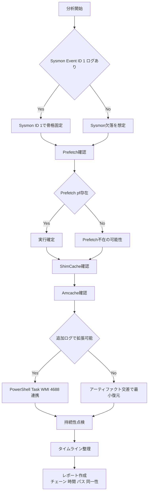

📌 **この記事の目的は一つです。**  
「悪性ファイルが実行されたのか？」で終わらせず、さらに一段踏み込んで  
✅ **「誰が(親) → 何を(子) → どんな引数(CommandLine)で → いつ実行し、その後に何をしたのか？」**  
つまり **実行チェーン**(Execution Chain) を **報告書として揺るがない形で** 復元することです。

---

## 0) なぜこの順序がいちばん親切なのか？

侵害事故分析は通常このように始まります。

- 「怪しい実行があった気がしますが…」
- 「このファイルは悪性っぽいですが実行されましたか？」
- 「EDRが無い、またはログが途中で途切れています…」

こういうとき **最も迷いにくい順序** があります。

1) **Sysmon Event ID 1**: 実行チェーンの骨格(親-子-コマンドライン-ハッシュ)  
2) **Prefetch**: 「本当に実行された」を最も直感的に確証  
3) **ShimCache**: 実行が曖昧でも「そのファイルがそのパスに存在した」を固定  
4) **Amcache**: ファイル名が変わっても「これがそのファイル」であることを(メタ/ハッシュ)で確定  
5) (あれば) **PowerShell/Task/WMIログ**でLOLBAS・持続性まで接続  
6) 最後に **レポート**: 時間/パス/同一性/チェーン根拠をセットで提示

---

## 1) 実行チェーン復元フロー図 (Sysmon 1番からレポートまで一直線)

**Sysmon 1番 → レポート** までを「途切れずに」1枚で説明します。

---

## 2) 1番(Sysmon Event ID 1)から見る理由: 「実行チェーンの背骨」を先に立てる

Sysmon **Event ID 1**(Process Create) は文字通り  
「**プロセスが生成(実行)された瞬間**」を記録します。

ここで重要なのは、Sysmonがあれば **実行チェーンを『勘』ではなく『根拠』で** 束ねられる点です。

### ✅ Sysmon ID 1で特に重要なフィールド

* **ParentImage**: 「誰がこれを実行したのか？」
* **Image**: 「何が実行されたのか(正確なパス)？」
* **CommandLine**: 「どんな引数で実行されたのか？」 (LOLBASではほぼ核心)
* **Hashes**: 「このファイルが本当にそのファイルか？」 (同一性確定)
* **Time**: タイムラインの基準点

📌 一行要約

> **Sysmon 1番は“チェーン”を作り、  
> Prefetch/ShimCache/Amcacheはそのチェーンを“揺るがないよう固定する”。**

---

## 3) 2番(Prefetch)を組み合わせる理由: 「実行された」を最も直感的に裏付ける

Prefetchは元々 **実行速度最適化** 機能ですが、フォレンジックでは単純です。

> `.pf` が残っていれば、**そのプログラムは実行された可能性が非常に高い** です。

### ✅ Prefetchが与える実務的証拠3種

* **実行時間(Last Run Time)**: 「いつ実行されたのか？」
* **実行回数(Run Count)**: 「何回実行されたのか？」
* **参照痕跡(ロード/アクセスファイルパス)**: 「実行中に何に触れたか？」

### ❗ Prefetch単独で終えると惜しい理由

Prefetchは「実行」には強いですが、

* 「誰が実行したか(親プロセス)」
* 「正確なコマンドライン」  
  を **完全に復元するのは難しい** です。

そのため **Sysmon(親/コマンド) ↔ Prefetch(実行裏付け/時間/回数)** の組み合わせが最も安定します。

---

## 4) 3番(ShimCache)を見る理由: 「そのファイルがそのパスに存在したのは確実」で固定

攻撃者はよく次のようなことを行います。

* 実行後 **self-delete**
* ファイル移動/名前変更
* 痕跡削除の試み

このときShimCache(AppCompatCache)は「実行の有無」よりも先に、  
✅ 「**そのファイルがシステムに存在していた**(パス含む)」ことを固定するのに強いです。

### ❌ ShimCacheでよくある誤解(重要)

* ShimCacheのタイムスタンプは通常 **『実行時刻』ではない可能性があります。**  
  (環境によっては「ファイル最終更新時刻の性質」等として解釈するほうが安全な場合が多いです。)
* したがってShimCacheだけで「この時間に実行された」と断定すると **タイムラインが歪む恐れがあります。**

📌 ShimCacheはこう使うとちょうど良いです

> **Prefetch/Sysmonで実行を捉え、**  
> **ShimCacheで存在/パスを釘打ちする。**

---

## 5) 4番(Amcache)を最後に付ける理由: 「これがそのファイル」であることを確定する

Amcacheは場合によって **決定打** になります。

* ファイル名が変わっていても
* パスが移動していても
* 元ファイルが削除されていても

Amcacheに残る **識別情報**(メタ/ハッシュ等)により  
✅ 「同一ファイル」かどうかを、より強く主張できます。

### ✅ Amcacheが特に輝く状況

* IOC(ハッシュ)で **同一ファイルか確定** しなければならないとき
* 正常ファイルに偽装していても、メタ/識別情報で **嘘を崩す** 必要があるとき
* Prefetchが無い/曖昧なときに **補強根拠** が必要なとき

---

## 6) 🔍 一目で比較: Sysmon · Prefetch · ShimCache · Amcache

| 区分     | Sysmon (Event ID 1) | Prefetch        | ShimCache       | Amcache          |
| ------ | ------------------- | --------------- | --------------- | ---------------- |
| 一行役割 | 実行チェーン「骨格」          | 実行「確証」         | 存在/パス「固定」      | ファイル「正体確定」       |
| 強み     | 親/子, コマンドライン, ハッシュ    | 実行時間・回数, 参照痕跡 | 削除/移動後もパス痕跡 | メタ/識別情報で同一性    |
| 弱み     | 無い可能性あり(未導入/保存期間)   | 無い=未実行ではない | 実行時刻と誤解リスク   | 環境/状況で可用性差 |
| 実務ポジション | 開始点(可能なら最優先)       | 2番手「実行確認」     | 3番手「存在固定」     | 4番手「同一性確定」     |

---

## 7) 実戦シナリオで理解する: 「実行後削除」対応

### 📌 シナリオ: 攻撃者が `malware.exe` を実行後に削除して逃走

1. **Sysmon ID 1** があれば

* どの親が実行したか(ParentImage)
* どんな引数だったか(CommandLine)
* どのハッシュだったか(Hashes)  
  まで、骨格をすぐに立てられます。

2. **Prefetch** で強化

* `MALWARE.EXE-****.pf` が残っていれば「実行」を強く確証
* 実行時間/回数で **反復実行** の有無まで掴めます。

3. **ShimCache** で釘打ち

* `C:\Temp\malware.exe` のようなパスが残っていれば  
  「そのパスに実際に存在した」ことを固定します。

4. **Amcache** で同一性確定

* ファイル名やパスが変わった痕跡があっても  
  「そのファイルである」ことを識別情報で補強します。

---

## 8) (ログがあれば最強) LOLBAS/持続性まで「チェーン拡張」する

アーティファクトは強力ですが、**ログはチェーンをより長く、より鮮明に** してくれます。  
特にLOLBASは **CommandLineと親子関係** が核心なので、ログ連携が非常に効果的です。

### 8.1 アーティファクトと「すぐ結び付けやすい」ログ5種 (チャンネル基準)

#### 1) Sysmon: Process Create

* **チャンネル**: `Applications and Services Logs > Microsoft > Windows > Sysmon > Operational`
* **主要 Event ID**: **1 (Process creation)**
* **結び付け方**: `Image/CommandLine/Hashes` ↔ Prefetch/ShimCache/Amcache を交差

#### 2) セキュリティログ: プロセス生成(4688)

* **チャンネル**: `Windows Logs > Security`
* **主要 Event ID**: **4688**
* **ポイント**: Sysmonが無いときに最低限の「プロセス生成」根拠を確保  
  (コマンドラインロギングのポリシー設定有無で品質が左右されます。)

#### 3) PowerShell: Script Block Logging(4104)

* **チャンネル**: `Microsoft > Windows > PowerShell > Operational`
* **主要 Event ID**: **4104**
* **ポイント**: LOLBAS/ダウンロード/実行パスがスクリプトにそのまま残ることが多く、  
  → そのパスをShimCache/Amcacheで存在/流入として固定  
  → 実行ファイルはPrefetchで実行確証

#### 4) TaskScheduler: タスク起点の実行

* **チャンネル**: `Microsoft > Windows > TaskScheduler > Operational`
* **例 Event ID**: **200/201** など(環境により異なる)
* **ポイント**: 持続性(スケジュールタスク)として「再実行させるトリガー」を捉えやすい

#### 5) WMI Activity: WMI起点の実行/持続性の手掛かり

* **チャンネル**: `Microsoft > Windows > WMI-Activity > Operational`
* **代表的な Event ID 群**: **5857~5861** など(環境により異なる)
* **ポイント**: WMIによる実行/持続性は痕跡が「ログ側」に残りやすく、紐付け価値が高い

---

## 9) 最後のパズル: 「誰が再び動かしたのか」 (持続性トリガー)

初回実行ファイルと **再実行(持続性)トリガー** は別であることが多いです。  
そのため実行チェーンの終点はたいていここに向かいます。

* Scheduled Tasks (schtasks)
* Services (サービス登録)
* WMIイベント購読(永続購読)

📌 実務ヒント

> 「初回実行(初期侵入)チェーン」と「再実行(持続性)チェーン」を **分離** して描くと、レポートがはるかに明確になります。

---

## 10) Prefetchが無い/弱いとき: 「無い = 実行していない」禁止

Prefetchが空になり得る理由はかなり多いです。

* ポリシー/環境によりPrefetch無効
* 保存数制限による上書き
* 攻撃者による削除
* サーバ/特殊構成

そのためPrefetchが無い場合は、

* ShimCache/Amcacheで存在・正体を補強し
* (可能なら)イベントログで実行を補強し
* それでも不足ならMFT/USNのようなファイルシステムレベルへ拡張します。

---

## 11) レポートにこう書けば揺らぎません (根拠セット)

レポートで最も揺らぐ瞬間はこれです。

* 「実行された気がします」 → 根拠が弱いとすぐ反論される
* 「悪性です」 → 同一性(ハッシュ/識別)が無いと議論に発展する

そのためレポート文は可能な限り **セット** で書きます。

* **チェーン**: Parent → Child
* **時間**: 実行時間(ログ/Prefetch)
* **パス**: Full Path(アーティファクト交差)
* **同一性**: Hash/識別(可能ならAmcache/Sysmon)

例文(テンプレート)

> (時間) に (親プロセス) が (コマンドライン) で (子プロセス) を実行し、  
> Prefetchで実行痕跡(回数/時間)が確認され、ShimCacheで当該パスの存在が確認され、  
> Amcache/Sysmonハッシュで同一ファイルであることを交差検証した。  

---

## 12) 現場でそのまま使えるチェックリスト (10問10答)

1️⃣ **今つかんだ手掛かりは「実行(ログ)」か「ファイル(アーティファクト)」か？**  
→ 分析の開始点を正確に定義してこそ、調査工程の無駄を最小化できます。  
→ ログならSysmonから、ファイルならPrefetch/ShimCacheから。

2️⃣ **誰が実行したか(親プロセス)?**   
→ Sysmon ID 1 の `ParentImage`  

3️⃣ **何が実行されたか(正確なパス)?**   
→ Sysmon `Image` ↔ Prefetch/ShimCache パス交差  

4️⃣ **本当に実行されたか(ログが不完全でも)?**   
→ Prefetch `.pf` の存在で実行根拠を強化  

5️⃣ **いつ実行されたか?**   
→ Prefetch実行時刻 + Sysmonイベント時刻でタイムライン固定  

6️⃣ **何回実行されたか(反復/持続の有無)?**   
→ Prefetch `Run Count`  

7️⃣ **そのファイルがシステムに「存在した」ことは確実か?**   
→ ShimCacheで存在/パス固定  

8️⃣ **このファイル、名前だけ変えたのでは？ 同一ファイルか?**   
→ Amcache(識別/ハッシュ)で同一性確定  

9️⃣ **LOLBAS/スクリプト回避実行の痕跡は?**   
→ Sysmon CommandLine + PowerShell(4104)/Task/WMIログ連携  

🔟 **レポートで揺らがない根拠セットは?**   
→ チェーン(親→子) + 時間 + パス + 同一性(ハッシュ)

---

## 参考リンク

[1]: https://learn.microsoft.com/en-us/sysinternals/downloads/sysmon "Sysmon - Sysinternals (Microsoft Learn)"
[2]: https://learn.microsoft.com/en-us/previous-versions/windows/it-pro/windows-10/security/threat-protection/auditing/event-4688 "4688(S) A new process has been created (Microsoft Learn)"
[3]: https://learn.microsoft.com/en-us/windows-server/identity/ad-ds/manage/component-updates/command-line-process-auditing "Command line process auditing (Microsoft Learn)"
[4]: https://learn.microsoft.com/en-us/powershell/module/microsoft.powershell.core/about/about_logging_windows?view=powershell-7.5 "about_Logging_Windows - PowerShell (Microsoft Learn)"
[5]: https://research.splunk.com/endpoint/b3632472-310b-11ec-9aab-acde48001122/ "WinEvent Windows Task Scheduler Event Action Started (Splunk Research)"
[6]: https://docs.nxlog.co/integrate/wmi.html "Windows Management Instrumentation (WMI) (NXLog Documentation)"
[7]: https://redcanary.com/threat-detection-report/techniques/windows-management-instrumentation/ "Windows Management Instrumentation (Red Canary)"
[8]: https://lolbas-project.github.io/ "LOLBAS Project"
