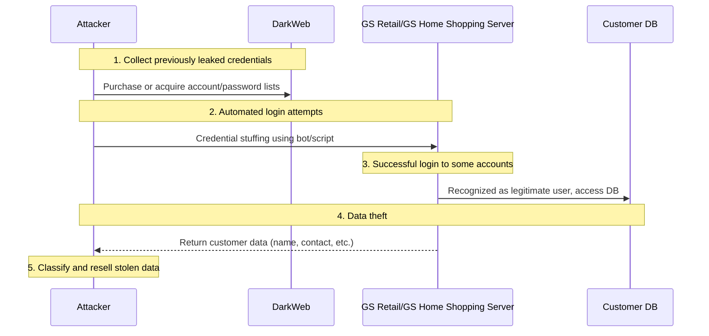

In **January–February 2025**, a **credential stuffing** attack occurred on the online services of **GS Retail** and **GS Home Shopping**, leading to the leakage of personal information of tens of thousands of customers from both companies.  
The attackers leveraged previously leaked account/password combinations to attempt mass automated logins. They exploited the vulnerability of some users reusing **the same passwords across different websites**, resulting in a breach.

<!--more-->

---

### 1. **Reconnaissance**
#### 🔍 **Obtaining leaked account information**
- Collected **already leaked account/password lists** from various online communities and the dark web.
- Focused on the possibility that **GS Retail** and **GS Home Shopping** customers reused **identical passwords** from other sites.

---

### 2. **Initial Breach**
#### 🚨 **Automated Credential Stuffing Attempts**
- Used scripts or bot programs to attempt logins with **hundreds of thousands of account credentials**.
- Exploited weak defenses such as lack of **retry limits (lockout)** or **multi-factor authentication (MFA)**.
- Successfully logged in to a small percentage of accounts (approx. **0.1% success rate**).

---

### 3. **Information Collection**
#### 🗄️ **Acquisition of personal and payment information**
- Accessed **member profile pages and payment history** through the logged-in accounts.
- Collected **personal information** such as **name, date of birth, address, phone number**.
- In some cases, **partial credit card numbers** and **loyalty points** were also exposed.

---

### 4. **Data Exfiltration**
#### 📤 **Data sent to external servers and resold**
- Transferred the harvested customer account and personal information to attacker-controlled servers and organized into **separate lists**.
- Likely to be used for **phishing, further financial fraud, and account resale**.
- It took **over two weeks** for GS Retail and GS Home Shopping to detect the attack, **increasing the scale of damage**.

---

### 5. **Attack Method Diagram**

### 🌟 PLURA-XDR Services
- [Introduction to PLURA-XDR Credential Stuffing Service](https://www.plura.io/underattack)
