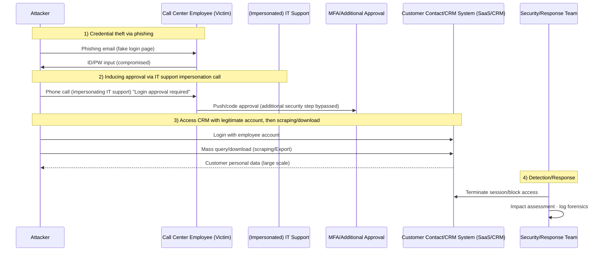

Dutch telecom operator **Odido** announced a customer personal data breach.  
The incident reportedly began with **phishing emails + IT support impersonation calls (vishing)** that compromised employee accounts,  
followed by **mass queries and downloads from the customer contact/CRM system** (scraping/collection).  
(The threat actor has not been publicly confirmed; the comparison below focuses on **tactical (TTP) similarities**.)

<!--more-->

---

## Key Summary
- **Official confirmation (ODIDO):** Personal data may have been exposed from the customer contact system. ‘Mijn Odido’ login passwords were not included.
- **Reported details (Cybernews, etc.):** Phishing targeting call center staff → approval induced via IT support impersonation calls → access to CRM (some media mention Salesforce) → mass downloads.
- **Why it appears large yet is detected late:** When “normal functions (query/export)” are executed using legitimate accounts (Valid Accounts), logs may **appear as routine business activity**.
- **PLURA Perspective (Summary):**
  - **PLURA-EDR:** Detects anomalies based on audit policy and can verify customer data files downloaded to endpoints (e.g., CSV/XLSX/ZIP) as evidence.
  - **PLURA-WAF Data Exfiltration Detection:** Real-time detection and blocking of large-scale data exfiltration through response body (Resp-body) and response size (Resp-size) analysis.

---

## Facts Overview

### ✅ Publicly Disclosed by Odido
- The incident is related to the **customer contact system**.
- Potentially exposed data examples: name, address, mobile number, email, customer number, IBAN, date of birth, ID (passport/driver’s license) number and validity period.
- **Items stated as not included:** ‘Mijn Odido’ password, call history, location data, billing/invoice information, ID scan copies.
- A field called “password_c” may have been included in the breach; however, this refers **not to a login password**, but to a historical challenge word/code word (additional verification answer) used during phone inquiries and is separate from account access.

### 🟨 Reported Circumstances (Media/Analyst Estimates)
- Attackers targeted call center/CS employees with phishing to steal login credentials.
- They then impersonated IT staff by phone, inducing login approval and bypassing additional security steps.
- Access reportedly extended into the CRM environment (some outlets mention Salesforce).

> Point  
> This article focuses less on “who did it (attribution)”  
> and more on **how it was done (TTP).**

### 🗓️ Timeline (Based on Public Information)
- **2026-02-07 ~ 2026-02-08 (Weekend):** Unauthorized access to the customer contact system reportedly occurred. (Odido notice, SecurityWeek)
- **2026-02-07:** Odido reportedly detected suspicious activity and began investigation. (Reuters)
- **2026-02-12:** Odido reportedly notified customers (web notice and email) and informed the regulatory authority (AP). (Odido notice, Reuters)

---

## 1. Reconnaissance
### 🔍 Targeting “People” and “Business Processes” First
- Attackers chose a strategy of targeting customer service/CS teams to obtain **employee login credentials**.  
  (CS teams typically have broad account access and are accustomed to external requests, making them prime social engineering targets.)
- The target was not the telecom infrastructure itself, but the **customer contact/CRM system** used for customer interactions.

---

## 2. Initial Access
### 🚨 Phishing Email + IT Support Impersonation (Vishing)
- **Phishing emails** tricked employees into entering login credentials.
- Followed by **IT support impersonation calls (vishing)** that induced approval of login attempts, bypassing additional security steps.

> ✅ Point  
> This stage attacks **trust (people)** and **process (approval)** rather than technical vulnerabilities.  
> Therefore, malware may be absent or minimal, and single-layer controls (firewall/AV) may miss it.

---

## 3. Abuse of Privileges and Internal Access (Valid Accounts / Access)
### 🔑 Once Inside with Legitimate Accounts, the Attack Begins to Look Like “Work”
- With stolen employee credentials, a **legitimate login to the customer contact/CRM system** can:
  - Appear as “normal user activity” in logs,
  - Make queries/export/downloads resemble routine customer service tasks.

In **MITRE ATT&CK**, this is categorized as **Valid Accounts** (T1078).  
In other words, “the hack ends at login,” and everything after becomes “authorized data access.”

---

## 3-1. Structural Similarities with Lapsus$ (TTP Comparison)
This stage in the Odido incident structurally resembles attack flows repeatedly observed in past **Lapsus$** (Microsoft: DEV-0537 → Strawberry Tempest) operations.

### Common Pattern 1) “Obtain Accounts Through Social Engineering, Then Open Internal/Cloud Access”
- CSRB reports describe Lapsus$ and related groups as extensively leveraging **phishing and vishing** across the attack chain.
- MITRE documents patterns where Lapsus$ impersonated legitimate users by calling help desks.

### Common Pattern 2) Bypassing MFA by Obtaining “Approval” Rather Than Breaking It Technically
- In Odido’s case, the key detail involves inducing approval through IT support impersonation calls.
- CSRB reports also describe repeated patterns of neutralizing authentication procedures through social engineering.

### Common Pattern 3) Focus on “Legitimate Access + Data Extortion” Rather Than Vulnerability Exploitation
- Microsoft described DEV-0537/Strawberry Tempest as actors pursuing data theft and destruction, disclosing characteristics such as single-account compromise and source code theft claims.
- Lapsus$ is widely characterized as focusing more on **data theft and extortion** rather than traditional ransomware encryption.

> ✅ Conclusion (Important)  
> There is no public evidence linking the Odido incident directly to Lapsus$.  
> However, the structural pattern of “**Valid Accounts-based access + social engineering-centric approach + data theft**” resembles previously documented Lapsus$ TTPs.

---

## 3-2. (Reference) Representative Cases Where Similar Patterns Were Reported in Lapsus$
The following cases are not cited to attribute responsibility, but to illustrate **why these tactics repeatedly succeed in real-world incidents**.

- **NVIDIA (February–March 2022)**
  - NVIDIA acknowledged system compromise involving leaked employee credentials and certain internal corporate information.
  - Multiple outlets reported Lapsus$ claiming responsibility and engaging in data leaks/extortion.

- **Samsung (March 2022)**
  - Samsung Electronics confirmed theft of internal data/source code related to Galaxy devices.

- **Microsoft (March 2022)**
  - Microsoft disclosed that a single compromised account led to limited access, with claims of source code theft investigated and addressed.

---

## 4. Collection
### 🗄️ Rapid Aggregation of “Field-Level Personal Data” from CRM
- Reports indicate that information was collected in the form of **mass queries and downloads (scraping/export)** from the customer contact/CRM system.

### Potentially Exposed Data (Based on Official Notice)
| Category | Examples |
|---|---|
| Personal Data | Name, address/city of residence, mobile number, email, customer number |
| Financial/Identity | IBAN (account number), date of birth |
| Identification | Passport/driver’s license number and validity period |

### Items Stated as Not Included (Official)
| Category | Examples |
|---|---|
| Account | Mijn Odido login password |
| Telecom/Sensitive | Call history, location data |
| Payment | Billing/invoice information |
| Documents | ID scan copies |

---

## 5. Exfiltration
### 📤 Even Large-Scale Exfiltration Can Appear as Routine Business Downloads
- If data was exported via standard business system functions (customer contact/CRM download/export),
  rather than large internal network transfers,
  it may appear as “normal HTTPS traffic” from a network perspective.
- As a result, the fact that it was “large-scale” may only become evident later through **post-incident log analysis** or **external disclosures**.

---

## 6. Conceptual Diagram of the Exfiltration Method (Scenario)

---

## 7. Odido’s Publicly Disclosed Response (Summary)
- The company stated that it terminated the unauthorized access, initiated an investigation (with internal and external experts), and notified the relevant authority (AP).
- Customers were advised to be cautious of phishing/scam contacts (smishing and voice phishing).

---

# PLURA Perspective Summary

## 8. PLURA-EDR Perspective: Audit Policy–Based Anomaly Detection and Verification of Exfiltrated Files
**PLURA-EDR enables anomaly detection based on audit policies and verification of downloaded customer data files.**

PLURA-EDR provides the following workflow:
1) **Generate logs through audit policy configuration**  
2) **Collect Windows Event Logs / Linux syslog·audit logs**  
3) **Analyze collected logs to detect anomalies**  
4) **Perform blocking actions according to detection policies**

Therefore, the following “evidence-based verification” is possible:
- Trace the activity at the **time of large-scale Export/download** from a specific account/endpoint through audit logs  
- Verify logs showing the creation·movement·compression traces of **customer data files** (CSV/XLSX/ZIP, etc.) downloaded to endpoints  
- Secure those files as part of the **incident response investigation and confirm their contents (forensic evidence)**  

---

## 9. PLURA-XDR Perspective: Why “Large-Scale Exfiltration” Is Easily Missed, and How Real-Time Detection Is Possible
**Large-scale data exfiltration can be detected in real time through web application firewall data breach detection.**

### 9-1) Why It Is Easily Missed
- **Legitimate accounts + legitimate functions** (query/Export) can easily be mistaken for routine business operations.  
- If downloads occur in the form of web responses (HTTPS), systems that only monitor network traffic may view them as “normal traffic.”  
- If login events and download events are separated, risk may be underestimated when evaluating single events.

### 9-2) Real-Time Detection with PLURA-WAF Data Exfiltration Detection
PLURA-WAF provides:
- **Data exfiltration detection based on response body (Resp-body) analysis**
- **Anomaly detection based on request/response body size (Resp-size)**
- **Immediate blocking upon detection of exfiltration**

In other words, when **customer data is delivered in bulk from CRM responses**,  
the moment when **“the download itself is the web response”** can be detected and blocked in real time.

---

## References (Sources)
- Odido Official Notice: https://www.odido.nl/veiligheid-eng
- Reuters (2026-02-12): https://www.reuters.com/business/media-telecom/dutch-telecom-odido-hacked-6-million-accounts-affected-2026-02-12/
- Cybernews: https://cybernews.com/security/odido-hackers-phishing-attack/
- CPO Magazine: https://www.cpomagazine.com/cyber-security/cyber-attack-on-dutch-telecom-giant-odido-exposes-customer-data-of-6-2-million/
- SecurityWeek: https://www.securityweek.com/dutch-carrier-odido-discloses-data-breach-impacting-6-million/
- Microsoft Security Blog (DEV-0537 / Strawberry Tempest): https://www.microsoft.com/en-us/security/blog/2022/03/22/dev-0537-criminal-actor-targeting-organizations-for-data-exfiltration-and-destruction/
- CSRB LAPSUS$ Report (2023): https://www.cisa.gov/sites/default/files/2023-08/CSRB_Lapsus%24_508c.pdf
- MITRE ATT&CK (LAPSUS$ Group G1004): https://attack.mitre.org/groups/G1004/
- MITRE ATT&CK (Valid Accounts T1078): https://attack.mitre.org/techniques/T1078/
- NVIDIA Related (Reference): Reuters (2022-03-01) https://www.reuters.com/technology/nvidia-says-employee-company-information-leaked-online-after-cyber-attack-2022-03-01/ / The Verge (2022-03-01) https://www.theverge.com/2022/3/1/22957212/nvidia-confirms-hack-proprietary-information-lapsus
- Samsung Related (Reference): The Verge (2022-03-07) https://www.theverge.com/2022/3/7/22965220/samsung-hack-lapsus-galaxy-source-code-confirmed-nvidia
- PLURA-WAF Overview: https://www.plura.io/en/platform_waf.html
