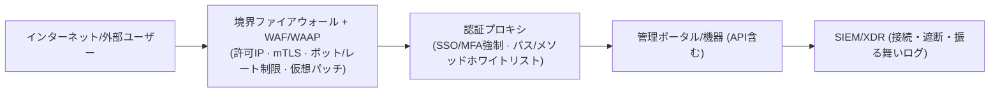

> **問題の本質**
> 「ブラウザで接続する**管理ポータル**があるなら、それはすなわち**ウェブサーバー**です。」
> しかし、多くの組織がこれを認識しないまま**ウェブアプリケーションファイアウォール(WAF)の外側**で運用しています。その結果、繰り返される**最初の侵入地点**となってしまいます。

---

## 1) なぜ「ウェブサーバーだと思われていないウェブサーバー」が危険なのか

名称がVPN、アカウント権限管理、コアネットワークシステムであったとしても、**管理ポータルのほとんどはHTTP(S)/RESTベース**です。つまり、**OWASP Top 10類のデザイン上の脆弱性や認証回避、セッション奪取、ボット・総当たり攻撃の脅威**をそのまま受けます。
ネットワークファイアウォールだけでは、**HTTPレイヤーの攻撃ベクトル**を識別・遮断することは困難です。**WAF**がなければ「仮想パッチ(virtual patch)」も適用できません（例：F5 TMUI RCEに対してWAFが即座に遮断ルールを配布し、被害を軽減した事例）。 ([The Cloudflare Blog][1])

---

## 2) 私たちがよく見落とす**代表的な3つの事例**

### 2-1. SSL VPN (ウェブUI・APIが核心)

ここ数年、**Ivanti Connect SecureなどのSSL VPNにおける重大な脆弱性**が相次いで悪用され、初期侵入経路となりました。2025年にも**リモートコード実行**(CVE‑2025‑22457)が実際の攻撃に使用され、**KEV**(悪用が確認済みの脆弱性カタログ)に登録されました。**VPN**機器であっても、ウェブ管理ポータルを公開しているなら「ウェブサーバー」として扱うべきです。 ([TechRadar][2])

### 2-2. LGU+ **アカウント権限管理システム(APPM)**

報道によると、**APPM関連サーバーを巡る侵害の痕跡と運用上の課題**が2025年の国政監査で提起されました。**特権アカウント・パスワード管理ソリューション**は本質的に**ウェブポータル・API**を持っており、突破された場合、ネットワーク全体への拡散リスクが非常に高くなります。したがって、**WAFの配下に置き**、IP制限・MFA・レート制限などを組み合わせる必要があります。 ([MBC NEWS][3])

### 2-3. SKテレコム **HSS(Home Subscriber Server)**

政府の公式調査の結果、攻撃者は**HSS管理サーバー**にマルウェアを仕込んで長期間潜伏し、広範囲なUSIM/認証データの流出につながりました。**主な要因は、管理領域の脆弱なセキュリティ監視・資格情報管理**でした。通信キャリアのコアネットワーク自体はDIAMETERなどの非ウェブプロトコルを使用していますが、**運用・管理ノードは通常ウェブベース**であるため、**WAF・アクセス制御・資格情報セキュリティ**が同時に必要です。 ([Ministry of Science and ICT][4])

---

## 3) 「ウェブサーバーだと認識されていない」その他の資産 — **追加リスト**

| 分類 | 代表例 | なぜウェブサーバーなのか / 最近のイシュー |
| -------------------- | ----------------------------------- | ----------------------------------------------------------------------------------------------------------------------------------------------------------------- |
| **ADC / VPNゲートウェイ** | Citrix NetScaler ADC/Gateway | 2025年に**CitrixBleed 2 (CVE‑2025‑5777)など、非認可セッション奪取・メモリオバーリード脆弱性が活発に悪用**。管理/AAA・Gatewayがすべて標的。**必ずWAFを前面に配置**しセッション保護が必要。 ([TechRadar][5]) |
| **バックアップ・DRコンソール** | Commvault Command Center, Veeam B&R | 2025年に**Commvault RCE**(CVE‑2025‑34028)の**活発な悪用**警告。Veeam B&Rも過去に**未認証の資格情報奪取**(CVE‑2023‑27532)により、大規模ランサムウェアの初期侵入に悪用。**管理ポータルは典型的なウェブサーバー**です。 ([Greenbone][6]) |
| **UEM/MDM(端末管理)** | Ivanti EPMM(旧 MobileIron)等 | 2025年に**EPMM認証回避→RCEチェーン**が**実際の攻撃に使用**。モバイル・ノートPC管理ポータル/APIは**WAF+レート制限+ボット遮断**が必須。 ([TechRadar][7]) |
| **仮想化コントロールプレーン** | VMware vCenter | vCenter**ウェブクライアントプラグインRCE**(例：CVE‑2021‑21972/21985)が繰り返し悪用。**運用の中枢**(ハイパーバイザ制御)であるためさらに危険。**WAF・mTLS・IPホワイトリスト**を推奨。 ([Support Portal][8]) |
| **L7スイッチ/ADC管理UI** | F5 BIG‑IP TMUI | **TMUI RCE**(CVE‑2020‑5902)が世界的に悪用された代表例。**WAFが仮想パッチとして即座に遮断ルールを配布**可能。 ([CISA][9]) |

> **ポイント**: **ブラウザで開く管理ポータル/REST API = ウェブサーバー**です。名称が何であれ、**WAFの管轄に編入**してください。

---

## 4) **WAFは「選択」ではなく「必須」です**

**WAFなし**で運用される管理ポータルは、以下を防ぐことができません：

  * **仮想パッチ**: パッチ適用が遅れても、**シグネチャ/ルールによる即時遮断**で業務を停止させることなくリスクを緩和。 ([The Cloudflare Blog][1])
  * **ボット/総当たり攻撃の遮断**: ログイン・APIエンドポイントに対する**レート制限/振る舞いベースの遮断**。
  * **セッション・クッキー保護**: セッション固定/ハイジャックの検知、**JWT・ヘッダー検証**。
  * **スキーマ/メソッドのホワイトリスト**: **許可されたパス・メソッド・コンテントタイプのみを通過**。
  * **攻撃ペイロードの検知**: インジェクション・LFI/RFI・ディレクトリトラバーサル・XSS・XXEなど、**アプリケーション階層の攻撃**。
  * **IP・地理的制御**: **許可された国/ネットワークからのみ**アクセスするように一次遮断。
  * **API保護(WAAP)**: **管理用APIもWAFポリシーでスキーマ検査・キー/トークン検証**。

> **必ず覚えておいてください。**
> **管理ポータル/コンソール/ウェブUI/管理APIは、すべてWAFの後ろにあるべきです。**

---

## 5) **標準対処アーキテクチャ** (管理ポータル保護)

  * **WAFの前段**: **固定IPホワイトリスト**が可能であれば必ず適用。
  * **WAFポリシー**: **「管理専用」ポジティブモデル**(許可パス・メソッド・MIMEのみ通過) + **レート制限**。
  * **mTLS/Device Trust**: 管理者端末証明書・端末の健全性(EDRのステータス)まで確認。
  * **内部専用ポータル**であっても、**内部WAF**(リバースプロキシ型)で保護してください。

---

## 6) 即時適用チェックリスト (運用チーム用)

| No | 点検項目                                                                                                       | 完了 |
| -- | ------------------------------------------------------------------------------------------------------------ | -- |
| 1  | **管理ポータル・API「全数識別」**: SSL VPN, APPM, HSS管理ノード, ADC, バックアップ, vCenterなど **ブラウザ接続対象** をリスト化    | ☐  |
| 2  | **WAFの後ろへ再配置**: *すべての* 管理ポータル/コンソールは **WAF/WAAP配下に** (内部用なら内部WAF)                         | ☐  |
| 3  | **許可IPの最小化**: 管理者固定ネットワーク/ジャンプホストのみ許可。在宅は専用固定回線+IAM承認                                 | ☐  |
| 4  | **MFA・SSO連動**: 管理者SSO・MFAをWAF・リバースプロキシレベルで強制                                               | ☐  |
| 5  | **レート制限/ボット遮断**: ログイン・/api/* エンドポイントに **分間リクエスト・同時セッション制限** を設定                       | ☐  |
| 6  | **定期的な仮想パッチ運用**: 新規CVE通知時に即時 **WAFルール更新→検証→遮断** | ☐  |
| 7  | **セッション・クッキーセキュリティ**: Secure/HttpOnly/SameSite, トークン寿命, 機器バインディング                            | ☐  |
| 8  | **ロギング・検知**: 遮断イベント、認証失敗の急増、異常なメソッド/パスの検知通知                                         | ☐  |
| 9  | **脆弱性/構成点検**: vCenter/NetScaler/バックアップコンソール/SSL VPN の **定期的パッチ適用** | ☐  |
| 10 | **緊急遮断手順**: 危険の兆候時に **WAFレベルでの全遮断/迂回優先順位** を確立                                          | ☐  |

---

## 7) 実際の事故・脆弱性が物語るもの

  * **SSL VPN**: 2025年に **Ivanti ICS RCE** が実際に悪用され、KEVに登録。 **エッジ機器のウェブUI** が **最初の関門** となった。 ([TechRadar][2])
  * **APPM(アカウント権限管理)**: **特権管理ポータル侵害時に全社権限奪取** へと発展する可能性。2025年 **LGU+ APPM関連の問題** が公開報道として拡散。 **ウェブポータル保護(=WAF)** なしでは危険。 ([MBC NEWS][3])
  * **HSS**: 政府調査で **HSS管理サーバー** への長期潜伏・流出が確認された。 **管理領域のセキュリティ不備** が核心的な要因であった。 ([Ministry of Science and ICT][4])
  * **ADC/Gateway**: 2025年 **Citrix NetScaler** の **CitrixBleed 2** が **活発に悪用**。 **管理/AAA・Gatewayのすべてがウェブ上の標的**。 ([TechRadar][5])
  * **バックアップコンソール**: 2025年 **Commvault RCE活発な悪用警告**。バックアップ体系が **ランサムウェアの最優先ターゲット** であることが再確認された。 ([Greenbone][6])

---

## 8) 運用チップス: **「管理専用WAFポリシー」** はこのように設定してください

  * **許可パスのみ**: `/login`, `/api/admin/*`, `/healthz` など **ホワイトリスト** 形式。
  * **許可メソッドのみ**: `GET, POST` 中心、`PUT/DELETE/PATCH` は **パス別の例外** のみ。
  * **コンテントタイプ**: `application/json`, `multipart/form-data` など **必要最小限**。
  * **レート制限**: ログイン・パスワード再設定・トークン発行は **分間/時間当たりの制限**。
  * **ボット遮断**: ヘッダー指紋・JavaScriptチャレンジ・IP評判の組み合わせ。
  * **セッション保護**: 再利用/同時ログイン制限、長時間アイドルセッションの終了。
  * **mTLS**: 管理者端末証明書がなければ **事前に遮断**。
  * **仮想パッチ**: 新規CVE通知時に **ルールパッケージを即時適用→監視→遮断**。 (実際にWAFが緊急ルールでRCE攻撃を防いだ事例が多数) ([The Cloudflare Blog][1])

---

## 9) 結論

  * **ブラウザが開けばウェブサーバー** です。名称が **VPN・APPM・HSS・ADC・バックアップコンソール・vCenter** であっても例外ではありません。
  * これらの資産を **WAFの外** に置くことは、「**パッチの空白**」と「**ボット・総当たり・API悪用**」をそのまま許容することになります。
  * **したがって、管理ポータル/管理APIは必ずWAFの後ろ** に置き、 **許可IP・MFA・レート制限・仮想パッチ** で **多層防御** を構成しなければなりません。

> **一文要約**: *「管理ポータルはすべてWAFで包め。」*
> この基本を守るだけでも、 **ほとんどの初期侵入を入念に阻止** することができます。

---

### 📖 併せて読む (事件・勧告)

  * **Ivanti Connect Secure RCE(CVE‑2025‑22457)悪用** の要約および警告。 ([TechRadar][2])
  * **CISA KEV**: Ivanti ICS脆弱性を追加(活発な悪用)。 ([Cybersecurity Dive][10])
  * **[政府発表] SKT HSS侵害の最終調査結果** (管理サーバーへの長期潜伏・資格情報管理の不備)。 ([Ministry of Science and ICT][4])
  * **LGU+ APPM関連の報道** (特権管理システム侵害の疑惑および運用の課題)。 ([MBC NEWS][3])
  * **Citrix NetScaler「CitrixBleed 2」活発な悪用警告**。 ([TechRadar][5])

### 🌟 PLURA‑Blog

  * [SKT USIM ハッキング事件の整理 – 原因、影響、対応](https://blog.plura.io/en/column/leak_of_skt_usim/) ([Plura Blog][11])

---

> (参考) 本記事は **運用観点** での最小保護体系を扱っています。 **脆弱性管理・資格情報セキュリティ・ログの精密分析**(XDR/SIEM)を組み合わせることで、 **検知・対応** の成熟度を一段階さらに引き上げることができます。

[1]: https://blog.cloudflare.com/cve-2020-5902-helping-to-protect-against-the-f5-tmui-rce-vulnerability/?utm_source=chatgpt.com "Helping to protect against the F5 TMUI RCE vulnerability"
[2]: https://www.techradar.com/pro/security/ivanti-patches-serious-connect-secure-flaw?utm_source=chatgpt.com "Ivanti patches serious Connect Secure flaw"
[3]: https://imnews.imbc.com/replay/2025/nwdesk/article/6767087_36799.html?utm_source=chatgpt.com "[단독] 해킹 당한 사실 숨기려고?‥LG유플러스도 서버 무단 ..."
[4]: https://www.msit.go.kr/eng/bbs/view.do%3Bjsessionid%3DA2aV3fQR4zqYv-G8cJpkDgnrgrACDgREHvXAqG5l.AP_msit_2?bbsSeqNo=42&mId=4&mPid=2&nttSeqNo=1139&sCode=eng&utm_source=chatgpt.com "MSIT Releases Final Investigation Results on SK Telecom ..."
[5]: https://www.techradar.com/pro/security/cisa-warns-hackers-are-actively-exploiting-critical-citrixbleed-2?utm_source=chatgpt.com "CISA warns hackers are actively exploiting critical CitrixBleed 2"
[6]: https://www.greenbone.net/en/blog/cve-2025-34028-commvault-command-center-actively-exploited-for-rce/?utm_source=chatgpt.com "CVE-2025-34028: Commvault Command Center Actively ..."
[7]: https://www.techradar.com/pro/security/cisa-flags-some-more-serious-ivanti-software-flaws-so-patch-now?utm_source=chatgpt.com "CISA flags some more serious Ivanti software flaws, so patch now"
[8]: https://support.broadcom.com/web/ecx/support-content-notification/-/external/content/SecurityAdvisories/0/23599?utm_source=chatgpt.com "VMSA-2021-0002:VMware ESXi and vCenter Server updates ..."
[9]: https://www.cisa.gov/news-events/cybersecurity-advisories/aa20-206a?utm_source=chatgpt.com "Threat Actor Exploitation of F5 BIG-IP CVE-2020-5902"
[10]: https://www.cybersecuritydive.com/news/cisa-ivanti-connect-secure-vulnerability-kev/744603/?utm_source=chatgpt.com "CISA adds Ivanti Connect Secure vulnerability to KEV catalog"
[11]: https://blog.plura.io/en/column/leak_of_skt_usim/?utm_source=chatgpt.com "Comprehensive Summary of the SKT USIM Hacking Incident"
