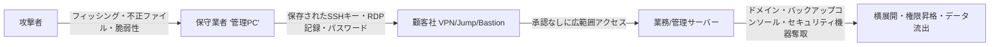

> **核心メッセージ** 
> 「保守用の**管理PC**と**遠隔接続手順**は、すなわち**組織内部へと通じる門**です。  
> この門を統制しなければ、**最も弱い環**が**最初の侵入地点**となります。」

<!--more-->

---

## 1) 背景 — なぜ保守経路が危険なのか

ほとんどの企業は規模に関係なく、**複数**（小規模で2〜3社、大企業では数十〜数百社）の保守業者と契約しています。これらの業者の多くは、定期点検や緊急措置などを理由に、**VPN, SSH, RDP, 専用ツール**を通じた**遠隔接続**を使用します。すべての保守人員のセキュリティ習熟度が高いわけではなく、**業者側の管理PCに顧客社のアクセス情報（ID/パスワード, 接続IPリスト, ターミナル履歴）が保存**されているケースが多々あります。  
その結果、**管理PCの奪取 → 保存された資格情報の盗用 → 内部ネットワークでの横展開（ラテラルムーブメント）**という攻撃が成立します。

実際の歴史的な事例もこれを裏付けています。韓国の**農協(2011)事件では、保守協力会社(IBM Korea)社員のノートPC가攻撃経路として特定され、基幹システムの実行ファイル削除命令が下されて電算網が麻痺し、一部の取引データがメイン・バックアップサーバーから同時に削除されたという報道もありました。米国のSolarWinds(2020)サプライチェーン攻撃では、複数の米連邦政府機関が影響を受け、CISAがEmergency Directive 21-01**によりOrionシステムの**即時分離・電源遮断**を命じました。 ([Korea Times][1]; [CISA ED-21-01][3])

---

## 2) 典型的な攻撃シナリオ (管理PC → 内部ネットワーク)

**脆弱なポイント**

| 番号 | 項目             | 内容説明                                                       |
| -: | ------------- | ------------------------------------------------------- |
|  1 | パスワード/キー保存      | ターミナル・RDPクライアントの**自動保存**・セッション記録による資格情報露出リスクの増大          |
|  2 | 常時電源・無人端末     | 退勤後も電源が入っている**遠隔制御可能な端末**が攻撃者に悪用される可能性がある              |
|  3 | 単一アカウント・汎用権限   | 複数の顧客社に**一つのアカウント/広範囲な権限**で接続するため、侵害時の被害が急速に拡散              |
|  4 | ログの不在          | **接続理由・セッション行為**の**証跡(log)が未収集 → 事後分析・責任追及が不可          |
|  5 | バックアップ/管理コンソール | 侵害時に全社復旧ポイント**まで無力化 (例: **Veeam**の脆弱性悪用事例) [7][6] |
|  6 | MSP/管理ツールの連鎖リスク | **Kaseya VSA**などの管理プラットフォームが悪用されると多数の顧客に**同時被害**が発生 [8]     |

-----

## 3) 保守業者の**必須内部統制** (自社遵守)

以下の項目は、現場の実務基準で直ちに**監査・点検項目**に入れられるよう整理しました。

1.  **(踏み台PC) 資格情報の保存禁止**

      * **SSH/遠隔ツール**: SSH接続の**ID/パスワード保存および自動ログインの禁止**。セッション/プロファイルへの**資格情報の保存禁止**、セッション終了時に**キャッシュ・クリップボード・転送ファイル記録を削除**。 *(キーベース使用時は秘密鍵の**平文保存を禁止**し、暗号化/エージェントによる**一時保管のみ**許容)*
      * **リモートデスクトップ(RDP)**: **資格情報の保存禁止**、セッション終了時に**キャッシュを削除**。

2.  **作業終了後直ちに電源オフ(踏み台PCを含む)**

      * **デスクトップ/踏み台PC**: 作業終了後は必ず**完全終了(Shutdown)**。
      * **ノートPC**: **省電力/スリープ/待機/カバーを閉じることを禁止**し、電源ランプの確認などで**電源オフを必ず確認**。

3.  **EDR必須 (例: PLURA-EDR)**

      * リアルタイムの**マルウェア検知/遮断**、**完全性保護・振る舞いベースの遮断**、**遠隔支援ツールの誤用・乱用検知**。

4.  **定期的な「クリーンイメージ」の再配布(四半期に1回以上)**

      * **目的**: 持続性(Persistence)・隠蔽された不正構成の除去。
      * **基準**: 標準ゴールデンイメージによる**再イメージング/再プロビジョニング**、完了後に**完全性チェックサム**・エージェント(EDR)状態確認レポートを提出。

5.  **端末のハードニング ＆ パッチ(月1回以上, 緊急パッチは随時)**

      * **権限の最小化**(ローカルAdmin禁止, 必要な場合のみ一時昇格/JIT), **アプリケーションホワイトリスト**の適用。
      * OS/ブラウザ/遠隔ツールの**月次パッチ** + **脆弱性スキャン報告**の義務化。
      * **ブート・記憶媒体のセキュリティ**(ディスク暗号化の維持, USB実行遮断・検疫)が基本。

6.  **顧客社・業務別のカウント・権현の完全分離**

      * **顧客/環境/業務単位**でアカウントを分離し、**共用アカウント・共有パスワードを禁止**。
      * **権限は最小限・期間限定(JIT)**、**作業終了後直ちに回収/パスワードを変更**。
      * アカウントの発行・回収の**証跡(log)**を中央保管。

7.  **すべての遠隔接続は「事前承認・限定範囲」の原則**

      * **チケット/作業コードなしでは接続不可**(承認時間・対象システム・許可コマンド/ポートを**事前限定**)。
      * **Jump/Bastionの単一窓口** + **MFA+mTLS+デバイス信頼**を満たす場合のみセッションを生成。
      * **セッション行為の録画・コマンド/ファイル履歴**を中央保存、**セッション終了時にキャッシュ・クリップボードの削除**を強制。

> **推奨文言(契約・SLA付属書の例)**
> 「保守業者は顧客システムへのアクセス時、**パスワード・キーを保管せず**、**MFAを適用**し、**EDRを常時正常動作**させ、**四半期に1回以上のクリーンイメージ再配布**を遵守する。**チケットベースの承認なし**には接続できず、**セッション録画・コマンド/ファイル履歴の中央保存**と**作業終了時のキャッシュ/クリップボード削除**を履行する。違反時、顧客は**直ちに接続を停止**し、**契約上の制裁**を適用する。」

---

## 4) 顧客社(発注元)側の **強制・保護統制**

### A. 接続窓口は一つに

  * **Jump/Bastionの一箇所のみを使用**(直接のVPN接続禁止)
  * **作業承認がある場合のみセッションを生成**(時間/対象/範囲がチケットにあること)
  * **MFA + 端末証明書 + 事前登録された固定IP**のみ許可

### B. 時間と範囲を絞り込む

1.  **勤務・保守時間外は自動遮断**(カレンダー/チケットと連動)
2.  **必要なリソースのみを表示**(必要なサブネット・ポートのみ開放)
3.  **アカウントは業務・業者・顧客別に分離**, **共用アカウントの禁止**

### C. ツール使用は記録と検証を重視

  * **PAM**(特権ID管理)でパスワードは **ヴォルトから貸出・自動回収**, **セッション録画**
  * **許可されたコマンド/ファイルのみ通過**(大容量アップロードは遮断または検疫)
  * **EDR必須**: 保守PCで **PLURA-EDRが正常動作**していなければ **接続不可**(デバイス状態検査)
  * **すべての行為を中央ログへ**: 接続承認, セッションキー, コマンド履歴, ファイル転送, APIコール(**POST-bodyを含む**)を収集し **事故時にタイムラインの復元を可能に**

### D. 運営ルール

  * **契約/セキュリティ付属書**に上記基準を明示, **未遵守時は接続停止・ペナルティ**
  * **四半期に1回の模擬訓練**(シナリオ: 「業者管理PCの奪取」)
  * **公式ガイドの採用**: CISA **遠隔接続セキュリティガイド**レベルで文書化

---

## 5) 何を「保守資産」とみなすか (例示・拡張)

  * **ファイアウォール / UTM / ゲートウェイ** : 外部と内部を繋ぐ境界機器 — 設定変更が直ちに全社リスクに直結
  * **スイッチ ・ ルータ ・ 無線AP(ネットワーク機器)** : ルーティング/スイッチング・無線認証などの中核インフラ — 遠隔管理アカウントが鍵となる
  * **情報セキュリティ製品 (WAF/WAAP, EDR/AV, SIEM/SOAR, DLP, IAM/PAM, プロキシなど)** : セキュリティポリシー・ログ・資格情報が集中 — 奪取されると検知/遮断が無効化される可能性
  * **バックアップ ・ DR ・ ストレージコンソール (例: Veeam/Commvault)** : 復旧の最後の砦 — コンソール侵害時に **バックアップ削除/暗号化**で全社麻痺の危険 ([Group-IB][7])
  * **ハイパーバイザ ・ 仮想化管理 (vCenter/ESXi, KVM)** : 多数のVMのライフサイクルを制御 — スナップショット/ネットワーク変更で大量の被害が拡散
  * **データベース ・ ミドルウェア管理ノード** : 運用データ・資格情報を保存 — 設定/アカウント変更だけでサービス障害・流出の可能性
  * **OT ・ スマートファクトリ設備の遠隔保守端末** : 生産/設備を制御 — 遠隔点検チャネルが危険な初期侵入経路

> **注意**: **バックアップコンソール**と **管理型ツール**(MSP/遠隔管理)が突破されると被害が **全社規模へ急拡大**します。 **Kaseya VSA**の事例を参照。 ([CISA][8])

---

## 6) 即時適用チェックリスト

| No | 項目                  | 基準                                                           |
| -: | ------------------- | ------------------------------------------------------------- |
|  1 | **すべての3rd partyの識別** | 業者・業務・接続対象・プロトコル・時間帯を **全数リスト化**(担当者・連絡先を含む)                     |
|  2 | **接続の単一化** | **Jump/Bastion 1箇所のみ**を使用, **直接のVPN禁止** |
|  3 | **承認・期間制限** | **チケット/JIT承認がなければ接続不可**, 承認された **時間・対象・範囲**のみ許可                 |
|  4 | **デバイスの信頼** | **PLURA-EDR正常動作 + mTLS(端末証明書)** 未充足時は **遮断** |
|  5 | **資格情報保存の禁止** | **SSH/RDPクライアントにID・パスワードの保存禁止**, **セッション終了時にキャッシュ・クリップボード・転送記録を削除** |
|  6 | **権限の最小化** | **顧客/業務/環境別にアカウントを分離**, **共用アカウント禁止**, **期間限定権限(JIT)** |
|  7 | **セッション録画・ロギング** | **コマンド・ファイル転送・画面・API**(POST-body)まで **中央保存** |
|  8 | **バックアップコンソールの保護** | **別ネットワーク/アカウント/PAM**を適用, **インターネット・二重化外部アクセス遮断** |
|  9 | **定期的な再イメージング** | 保守/Bastion PCの **四半期に1回クリーンイメージ再配布**, 完了 **レポート提出** |
| 10 | **ポリシー遵守の証明** | **四半期ごとの監査レポート + テーブルトップ(模擬訓練)レポート**の提出                             |

---

## 7) 運用チームのための **ログ・行為「警告信号」10選**

| No | 警告信号                           | 検知ポイント(例)                                    | 1次対応                                    |
| -: | ------------------------------ | -------------------------------------------- | ---------------------------------------- |
|  1 | 保守時間外のJump接続試行(連続失敗を含む) | Jump/Bastion認証失敗回数・時間帯, 非認可の勤務時間           | 直ちにアカウントロック(一時), 接続元IP遮断, 承認チケットの確認        |
|  2 | 新しい地理・ASNからの3rd partyログイン    | GeoIP/ASNの変化, 新規の国・通信事業者                       | Geo/IP遮断または追加認証, 担当者へ連絡後に再承認           |
|  3 | 同一アカウントの **同時** セッション(異なるIP/端末) | 同時トークン・セッションID, 異なる送信元IP                       | 全セッション強制終了, パスワード/トークンのローテーション, 原因調査               |
|  4 | SSHの異常なポートフォワーディング・多重PID   | `ssh -L/-R`, 多重トンネル, 非認可ポート                    | セッション遮断, 許可ポートポリシーの点検, ユーザーへの説明要求             |
|  5 | RDPクリップボード・ドライブマッピングによる大量持ち出し | RDP VirtualChannel, 大容量転送イベント               | セッション隔離/終了, ファイル隔離・フォレンジック保管, ユーザー遮断               |
|  6 | バックアップコンソール **保存ポリシー変更/削除** 試行 | Retention/Jobの削除・短縮, 大量Restore/Export      | 変更をロールバック, コンソールのロック, 別ネットワークの遮断, 管理者承認の必須化     |
|  7 | ドメイン管理者/サービスアカウントの権限昇格    | AD権限の変更, グループ(Schema/Enterprise Admins)追加 | 昇格の取り消し・ロールバック, PIM/PAMの再確認, 関連セッションの終了           |
|  8 | 管理ポータルAPI **異常なメソッド** の呼び出し | 異常/異例のHTTP methods, 過剰な4xx/5xx, rate spike | APIキーの破棄・ローテーション, WAF/Rate Limitの強化, ソースIPの遮断 |
|  9 | EDR回避(ドライバの無効化・サービス停止)    | EDRサービスのstop/uninstall, ドライバエラー               | ホストネットワークの隔離, EDRの再登録, 回避ツールのフォレンジック           |
| 10 | ネットワークスキャン・SMB閲覧の急増(ラテラルムーブメント) | 多数のポートスキャン, 異例のSMB閲覧/同時接続                   | スキャナーIPの隔離, アカウントロック, 共有権限の点検・不審ファイルの隔離       |

---

## 8) 事例から学ぶ教訓

  * **サードパーティの資格情報/端末 = 初期侵入の近道**
    農協(2011)のように **協力会社の端末経路** が電算麻痺に繋がる可能性があり、SolarWinds(2020)のように **サードパーティの管理チャネル** が組織全体の **ラテラルムーブメントの足がかり** になります。 *(根拠: Korea Times, CISA ED-21-01)*

  * **管理・バックアップツールが突破されれば全社被害**
    **Kaseya VSA** ・ **Veeam** 関連の脅威のように **管理レイヤー** が攻撃されると **同時多発的** な被害が発生します。解決策は **Jumpの単一化・PAM・ネットワーク分離** です。 *(根拠: CISA警告, Veeamセキュリティ告知)*

  * **公式ガイドをポリシー化せよ**
    **CISA 遠隔接続セキュリティガイド** や **ED-21-01 補完指針** レベルで **組織標準** を文書化・運用してください。

---

## 9) 結論

  * **保守経路はサプライチェーンにおいて最も薄い氷** です。
  * **管理PCのセキュリティ(PLURA-EDR等), Jumpの単一化, JIT承認, mTLS/MFA, PAM, ロギング・証跡化** が **基本の防衛線** です。
  * **ポリシー(契約) + 技術 + 運用訓練** を同時に回すことで **持続可能なセキュリティ** になります。

> **一言要約**: *「保守の門は **狭く短く**, **承認・記録・差し戻し** を基本に。」*

---

### 📖 参考/推奨資料

  * **農協 電算網麻痺(2011)**: 保守協力会社のノートPCから削除命令 → 電算麻痺 / バックアップデータの同時削除の報道。 ([Korea Times][1]; [Korea JoongAng Daily][2])
  * **SolarWinds(2020)**: CISA **Emergency Directive 21-01** によるOrionの **即時分離・電源遮断** 命令および補完指針。 ([CISA ED-21-01][3]; [CISA 補完指針][4])
  * **遠隔接続セキュリティガイド(2023)**: CISA勧告。 ([CISA Guide][5])
  * **Veeam CVE-2023-27532**: バックアップ資格情報の悪用・RCEの脅威。 ([Veeam KB][6]; [Group-IB][7])
  * **Kaseya VSA(2021)**: 管理ツールを悪用したサプライチェーンランサムウェア。 ([CISA][8])
  * **連邦政府の対応総合報告(2022)**: GAO — ED-21-01 関連の評価を含む。 ([GAO][9])

[1]: https://www.koreatimes.co.kr/business/companies/20110414/nh-blames-ibm-for-network-crash "NH blames IBM for network crash"
[2]: https://koreajoongangdaily.joins.com/2011/04/18/finance/Server-attack-purely-destructive-Nonghyup/2935041.html "'Server attack purely destructive': Nonghyup"
[3]: https://www.cisa.gov/news-events/directives/ed-21-01-mitigate-solarwinds-orion-code-compromise "ED 21-01: Mitigate SolarWinds Orion Code Compromise"
[4]: https://www.cisa.gov/news-events/alerts/2021/01/06/cisa-updates-emergency-directive-21-01-supplemental-guidance-and-activity-alert-solarwinds-orion "ED 21-01 Supplemental Guidance"
[5]: https://www.cisa.gov/sites/default/files/2023-06/Guide%20to%20Securing%20Remote%20Access%20Software_clean%20Final_508c.pdf "Guide to Securing Remote Access Software"
[6]: https://www.veeam.com/kb4424 "KB4424: CVE-2023-27532"
[7]: https://www.group-ib.com/blog/estate-ransomware/ "Patch or Peril: A Veeam vulnerability incident"
[8]: https://www.cisa.gov/news-events/alerts/2021/07/02/kaseya-vsa-supply-chain-ransomware-attack "Kaseya VSA Supply-Chain Ransomware Attack"
[9]: https://www.gao.gov/assets/gao-22-104746.pdf "Federal Response to SolarWinds and Microsoft Exchange"
