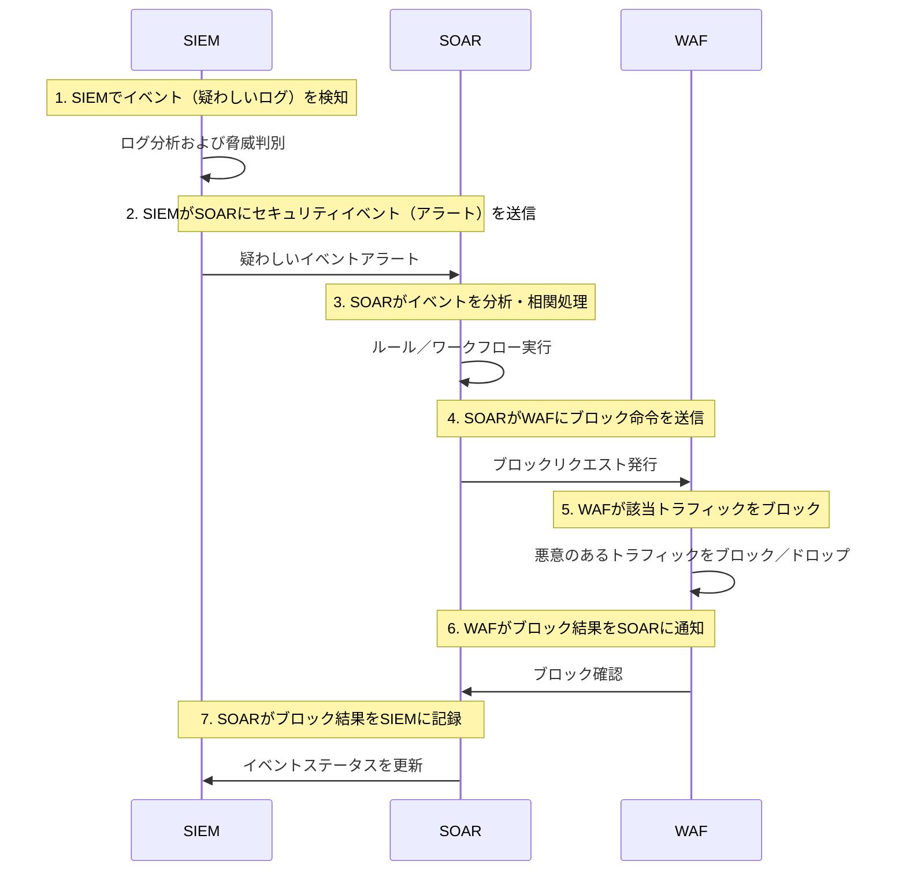

📉 **SOAR**は**SIEM**から発生したイベントを受け取り、**自動対応**を実行するソリューションとして知られています。  
しかし実際には「**SOARを導入したのに自動対応が難しい**」という声が絶えません。

最大の理由は、**SOARが単独では機能しない**うえに、**SIEMの検知結果に全面的に依存している**からです。  
そして現在の多くのSIEM運用環境が「**ログ収集・分析が不完全**」な状態であるために、  
**SOARでも正確な自動対応を期待するのが難しい**のです。

> 本記事では「[SIEM、導入してどうなるの？](https://blog.plura.io/ja/column/why_siem_always_fails/)」の文書を参考に、  
> **SOAR導入時に直面する課題**とその**根本原因**を整理します。

* SOAR: Security Orchestration, Automation, and Response  
* SIEM: Security Information and Event Management

<!--more-->

---

## 1. なぜSOARはSIEMに依存するのか？

### (1) SOARの基本メカニズム

* **SOAR**は一般的に**SIEM**やその他のモニタリングソリューションからの**セキュリティイベント**を基に、
* あらかじめ定義された**ワークフロー**や**自動化スクリプト**を実行します。

  * 例：攻撃元IPの遮断、関連アカウントの一時停止、チケットの発行など
* **即時**または**半自動**での**対応**を可能にします。

### (2) 「誤ったイベント」が入ってきたら？

* 問題なのは、**SIEM**に**誤検知**（False Positive）が多かったり、  
  正確な検知ができずに**脅威情報を見落とす**ような状況では、
* **SOAR**も「誤ったイベント」や「漏れたイベント」により、

  * **対応がまったく発動しない**、
  * **誤った対象を遮断・制限する**などの問題を引き起こす可能性があります。
* つまり、**SOARの精度**はそのまま**SIEMの検知精度**に依存しています。

### (3) SIEMが不十分なら自動対応は“絵に描いた餅”

* **SIEMが不完全**であれば、検知されるイベントが**不十分**または**信頼性に欠ける**ものになります。
* その状態で**SOAR**を適用しても、「誤ったデータ」に基づいて自動化を試みることになり、

  * **「むしろ危険」**な状況を招く可能性があります。
  * 不必要な箇所を遮断したり、本当の攻撃を見逃したりするケースが発生し得ます。

> ⚡そのため、現場では「**SIEMが安定していない状態で  
> SOARを導入するのは時期尚早だ**」という意見が多く見られます。

---

## 2. SOARが自動対応できない理由

「**SOAR**を導入すれば自動対応が可能になる」とよく期待されますが、  
実際にはうまく機能しないケースが多く、その**根本的な理由**は以下のとおりです。

### (1) SIEM自体のログ収集・分析の限界

* SIEMは基本的に**単純なアクセスログ**や基本的なイベントログに依存しています。  
* **リクエストボディ**（Request Body）、**レスポンスボディ**（Response Body）などの**重要な攻撃情報を収集**できなければ、

  * **SQLインジェクション**や**データ漏洩**のような高度な攻撃は**そもそも検知できません**。
* そのため、SIEMが適切な**正確な検知（True Positive）**を行えなければ、  
  SOARが**自動遮断・対応**する根拠も得られません。

### (2) 攻撃シナリオルールの不足 → ルールなしでは自動対応は不可能

* **SOAR**が「このイベントは危険だから自動対応しよう」と判断するには、

  * そのイベントが**本当に悪性かどうか**を判定するための**事前ルール（Rule）**が必要です。
* しかし、多くのSIEM運用環境では**攻撃パターン**に関するルール定義が不十分であったり、
  完成度が低いために**誤検知**と**正確な検知**の区別が困難です。
* 「**ルールや検知シグネチャが整っていなければ、SOARがやることもない**」という言葉が出る理由です。

### (3) 運用人員・プロセスの不在 → 自動化にも最終的に人の手が必要

* **自動化**という幻想とは裏腹に、**SOAR**を導入しても

  * **セキュリティチーム**が**誤検知かどうか**を丁寧に判断する作業が不可欠です。
* SIEMの段階で**すでに誤検知が多い**場合、SOARも誤検知イベントを受け取り、  
  無駄な自動化プロセスを延々と回すだけになります。
* ✅ 結局、「**適切なログ** + **正確な検知ルール** + **熟練した運用人材**」が揃っていなければ、  
  **SOAR**は「自動対応」という**名ばかり**で、実際には対応を開始することすら困難になります。

---

### SIEM ↔︎ SOAR ↔︎ WAF 連携構成図

---

---

## 3. なぜ「SIEMの問題」がそのまま「SOARの問題」になるのか？

以下のドキュメントでも強調されているように、**SIEMの最大の問題**は「**ログの収集すらまともにできず、分析できる人材もいない**」という点でした。

> [SIEMを導入しても意味があるのか？ログの収集も分析もできないなら](https://blog.plura.io/ja/column/why_siem_always_fails/)

この問題は少し視点を変えると、**SOAR**にもまったく同じように当てはまります。

1. **ログの収集そのもの**が不十分 → **検知イベントが不足**
   → **SOAR**が対応すべき根拠（イベント）も不足。

2. **検知ルール**や**分析能力**が不足 → **SIEMのアラートの信頼性が低い**
   → **SOAR**が**自動対応**を行って**正常なトラフィック**を遮断する事例が頻発。

3. **運用人材の不足** → **SIEMの誤検知対応も困難**
   → SOARでも**誤検知処理**の自動化が難しく → 結局放置される。

✅ 結論として、**SIEM**が正しく運用されていない状態では、
**SOAR**もまた**安定した自動対応**を実現するのは難しいというのは当然の帰結です。

---

## 4. 「SOAR、導入しても意味あるの？」に対する答え

### (1) 自動対応の前に「自動検知」から始めよう

* **SOAR**の本質は「**自動検知** → **自動対応**」という流れにあります。
* しかし、**自動検知**そのものが**SIEM**でしっかり行われて初めて、
  「**このイベントは無条件で遮断すべき**」という**安全な自動対応**が可能となります。
* つまり、**SOAR**より先に**SIEM**の**正確な検知精度**を高めるために、

  * **ログ収集範囲の拡大**、
  * **検知ルールの高度化**、
  * **分析担当者の育成と配置**
    などが先に行われるべきです。

### (2) まずはSIEM運用の実力を高めよう

* **SIEMの運用**がある程度洗練され、**誤検知率**が下がって初めて、

  * 「イベントが発生したら、自動で処理しても安全だ」と自信を持てるようになります。
* このプロセスを飛ばしていきなり**SOAR**を導入すると、

  * **誤検知が多すぎて**企業の**業務**が停止するリスクがあり、
  * 結局**SOAR**は“自動化”ではなく**半自動モード**でしか使えず、
  * 導入効果も**半減**してしまいます。

### (3) 「SIEMを完璧にしてからSOARを拡張しても遅くない」

* 現場ではまず**SIEM**を**運用**しながら、少しずつ**ルール**を精緻化し、

  * **問題のないイベント**だけをフィルタリングしていくプロセスを**長期的**に進めます。
* その後、「**ある程度の水準**で**正確に検知**できる」と判断されてから、

  * そのタイミングで**SOAR**を導入しても**決して遅くはありません**。
* 💡 むしろその方が、**SOAR**導入時に**実質的な自動化**が実現され、
  投資に見合った**高い効果**が得られる可能性が高いのです。

---

## 5. では「SOAR」はいつ導入すべきか？

1. **SIEMから正確なイベント**が十分に出ているかを確認する

   * **ログ収集**の範囲を広げてもシステムが耐えられるか？
   * **誤検知**に対する**正確な検知（True Positive）**の比率が適切か？
   * **担当者**が状況を把握し、指標を改善できるスキルを持っているか？

2. **対応プロセス**がある程度**標準化**されているか？

   * 攻撃タイプごとに「**どのような対処を行うか**」が**定義**されていなければならない。
   * その定義があることで、SOARがそのプロセスを**スマート**に自動化できる。

3. **業務影響**に対する十分な**リスク評価**が行われているか？

   * 誤検知によって**正常なユーザー**がブロックされるリスクはないか？
   * 自動対応において、**モニタリング**や**追加検証**が必要な段階はないか？

これらのプロセスを「**チェック**」して、ある程度成熟していると判断された段階で  
**SOAR**を導入すれば、**自動対応**も**実効性**を持って機能します。

---

## 6. 結論：「SOARはSIEMの影である」

* **SOAR**は「セキュリティイベントの自動対応」を掲げていますが、  
  その**イベント**は結局**SIEM**から送られてきたものです。
* **SIEM**が正しく**正確な検知**を行えなければ、  
  **SOAR**の**自動化**も**空虚な理想**に過ぎません。
* したがってSOARの導入を検討する際には、  
  「**自社のSIEM運用レベル**は**自動対応**に耐えうるか？」を  
  冷静に診断することが先決です。

---

## 7. 「SOARを導入して意味があるのか？」に対する最終的な答え

1. **SOARは**決して**単独**で自動対応を実現できる**万能ソリューション**ではない。
2. **SIEMの検知精度**、**運用人材**、**ルール設計**などが十分に成熟していて初めて、  
   **SOARも**ようやく**安全な自動対応**を実行できる。
3. **SIEM**自体が**不完全**な場合、**SOAR**はただ**誤ったイベント**を受け取り、  
   **誤った自動化**を引き起こすだけで、かえって**大きなリスク**になり得る。
4. よって、**ログ収集**から**分析能力**まで**しっかりと準備**した後で、  
   **SOAR**を導入しても**決して遅くはない**。

✅ 結局、「**SOAR**による**自動対応**を夢見るなら、まずは**その前段階のSIEM運用の高度化**が必要」という結論です。

---

### 📖 一緒に読んでみましょう
- [SIEM、導入して意味あるの？ログ収集も分析もできないなら](https://blog.plura.io/ja/column/why_siem_always_fails/)
- [ログ分析でハッキング調査？それって神話（Myth）かも](https://blog.plura.io/ja/column/myth/)
- [Splunkでリクエストボディ（request body）ログ分析をしてみよう](https://blog.plura.io/ja/column/splunk_request_body_analysis/)
- [Webを通じたデータ流出ハッキングへの対応入門](https://blog.plura.io/ja/column/dlp/)
- [ログ分析ツール、うちの会社にはどれが合う？](https://blog.plura.io/ja/column/log-analysis-tool-selection-guide/)
- [PHP WEBSHELL マルウェア](https://blog.plura.io/ja/threats/php_webshell_malware/)

### 📖 SIEM & SOAR 導入失敗事例

- [2025年4月 SKTハッキングマルウェア BPFDoor](https://blog.plura.io/ja/respond/bpfdoor/)
- [2025年1月 GSリテール ハッキング](https://blog.plura.io/ja/threats/case-gs_credential_stuffing/)
- [2018年6月 LG U+ 顧客認証システム流出](https://blog.plura.io/ja/threats/case-lg_uplus_breach/)
- [2023年5月 韓国裁判行政庁ネットワークハッキング](https://blog.plura.io/ja/threats/case-court_breach/)

### 🌟 PLURA-XDRの差別化ポイント

- [1分以内にハッキングを見抜く、PLURA-XDRの即時可視性](https://blog.plura.io/ja/respond/1-minute-detection/)
- [伝統的なSOC vs PLURA-XDRプラットフォーム](https://blog.plura.io/ja/column/traditional_soc_vs_plura_xdr/)
- [必要なときに、必要なセキュリティだけ選べる：PLURA vs. 従来型ソリューション](https://blog.plura.io/ja/column/plura_vs_traditional_security/)
- [デモ：クレデンシャルスタッフィングの検知＆遮断](https://www.youtube.com/watch?v=sDssT98NCg0)

### 🌟 PLURA-XDRのサービス

- [PLURA-XDR 紹介](https://www.plura.io/platform/xdr)
- [PLURA-DOCS：Credential Stuffing](https://docs.plura.io/ja/fn/comm/sfilter/takeover)

> **SOAR**で「**自動化されたセキュリティ**」を実現したいなら、  
> まずは **SIEM** が「**正確かつ十分なログ**」を収集・分析できるように  
> **体系的な構築**をすることが**最も重要**です。  
> **自動化**の基本は**信頼できる検知**だからです。  
> 準備もなく **SOAR** だけを導入すれば、**自動対応**どころか**自動混乱**になる可能性すらあります。

> **[PLURA-XDR](https://www.plura.io/platform/xdr) の自動化プラットフォーム**を導入してみてください。  
> SIEM、WAF、EDRと連携し、自動対応を行うSOARも内蔵されています。

