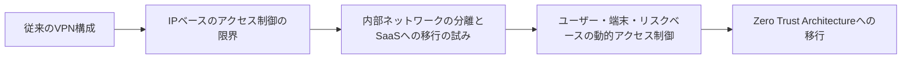

📉 多くの企業が外部勤務者と内部システムとの安全な接続のために **SSL VPN** を導入しています。しかし、本当に安全でしょうか？

近年発生した**国内外の侵害事件**を見ると、その多くの初期侵入経路が **SSL VPN機器** でした。

> **SSL VPNは今やセキュリティの入り口ではなく、侵害の入口**となっています。  
> 逆説的ですが、これが現実です。

<!--more-->

---

## 1. エッジ（Edge）機器という構造的限界 🧱

SSL VPN機器は本質的に「**内部ネットワークをインターネットに公開する出入り口**」です。つまり：

- 外部ユーザーのために常に**ポートを開放**し、
- 内部ネットワークへの**トンネリング**を許可し、
- **Web UIやSSHなどの管理インターフェース**を提供します。

> でも本当に、**誰もがインターネットからこの機器にアクセスできるようにする必要があるのでしょうか？**  
> **なぜファイアウォールで特定IPのみを許可しなかったのでしょうか？**

この構造は次のような**攻撃露出面（Attack Surface）**を形成します：

| 露出要素        | 説明                                      |
| ------------- | --------------------------------------- |
| **SSLポート**   | 常時開放されており、ゼロデイや旧TLSの脆弱性攻撃対象に |
| **Web UI**     | 認証回避、RCE、XSSなどのWeb脆弱性リスク        |
| **SSHポート**   | 管理者設定ミスにより外部ブルートフォース攻撃の対象に     |
| **管理者アカウント** | 初期ID/PWの使用、多要素認証未設定など構成不備        |
| **パッチ遅延**    | CC認証機器は認証手続きによりセキュリティ更新が遅延     |

👉 結果として、**SSL VPNは攻撃者にとって最も魅力的な初期侵入ポイント**になります。  
**「セキュリティ」のための機器が、かえって内部を露出させる出入り口となるのです。**

---

## 2. 実際の侵害事例から見たリスク 🚨

| 時期      | 組織（企業）                     | 侵害経路および原因                     | 被害内容                    |
|---------|-----------------------------|-------------------------------|--------------------------|
| 2021    | KAERI（韓国原子力研究院）         | VPNの脆弱性経由で内部侵入（北朝鮮APTの可能性） | 原子力関連データの流出の懸念        |
| 2021    | KAI（韓国航空宇宙産業）            | VPN脆弱性による侵害                   | FA-50、KF-21関連資料の流出      |
| 2023-24 | Ivanti/Pulse Secure/Fortinet | 認証回避、Web RCEなどの複数の脆弱性         | 国内通信会社・公共機関にも影響     |
| 2025.4  | SKテレコム                    | Ivanti VPN機器のゼロデイ脆弱性利用         | BPFDoorバックドア侵入           |
| 2025.7  | SGIソウル保証保険                 | SSL VPN機器へのSSHブルートフォース攻撃疑い | 内部アカウントの奪取の試み         |

👉 VPN機器が**侵害の主な経路**であることは、セキュリティ業界では常識です。

---

## 3. OpenVPNは安全ですか？ 🛡️

多くの企業がSSL VPNの代替として **OpenVPN** を検討しています。主な構造的な違いは以下の通りです：

| 項目        | SSL VPN            | OpenVPN           |
|-----------|--------------------|-------------------|
| 認証方式      | アカウントベース（ID/PW）    | **証明書ベース（PKI）**   |
| Web UI    | あり（攻撃対象となる）        | なし（CLI中心）          |
| 初期アカウント設定 | 頻繁に流出                    | 個人キーなしでは不可         |
| SSH接続     | 可能（設定ミスで外部公開されやすい） | VPN内部でのみ可能         |

✅ OpenVPNは構造的に**ブルートフォース攻撃が困難**であり、  
✅ **証明書なしでは接続ができず**、  
✅ **信頼済みIPによるファイアウォール制限の併用が必須**です。

---

## 4. VPN突破後にも必要な追加攻撃ステップ 🔐

VPNを突破しても、攻撃はまだ終わりではありません。侵害を完了させるには次のステップが必要です：

1. 内部IP資産のスキャン  
2. SSHなどへのアクセスアカウントの確保  
3. ルート/管理者権限の奪取  
4. システム拡散およびラテラルムーブメント（横展開）  
5. データ流出またはランサムウェアの実行  

👉 **VPN侵入は始まりにすぎず、内部防御がなければ急速に拡散されます。**

---

## 5. 結論：SSL VPNはもはや安全な選択肢ではない ❌

- SSL VPNは**攻撃者が最初に狙う外部公開資産**です。  
- Web UI、認証回避、SSH設定ミスなど**多様な侵入経路**が存在します。  
- 実際の侵害事例がこれを**明確に証明**しています。  
- **何よりも、ファイアウォールで「信頼されたIPからのみアクセス可能」に制限すべきです。**

> 単に認証方式を強化するのではなく、**「アクセス可能性自体を減らすこと」が核心です。**  
> 多くの事故はこの基本設定だけでも**予防可能**だったはずです。

---

## 6. リモート勤務環境でのVPN利用原則 🏠

リモートまたは在宅勤務環境では**IPアドレスが頻繁に変わったり固定されていない**ことが多いです。  
しかし、だからといってVPNアクセスを全面開放するわけにはいきません。

### 6-1️⃣ 運用管理者：固定ネットワーク + ファイアウォール制限  
- 運用サーバー、デプロイシステムなどの重要インフラには  
  **固定オフィスネットワークなどからのみ接続可能**に構成  
- ファイアウォールで当該IPのみを許可

### 6-2️⃣ 一般社員：VPN接続後もネットワーク分離  
- VPN接続のみで社内全体へアクセスできないように**DMZ構造で分離**  
- サービスごとにACL適用、二要素認証の併用

### 6-3️⃣ SaaS移行の検討  
- グループウェアやコラボレーションツールは社内ネットワークではなく**SaaSへ移行**  
- VPNなしでもセキュリティ認証（MFA）ベースで利用可能

| ユーザータイプ     | 接続対象                | セキュリティ戦略の要点                                 |
|------------------|-----------------------|----------------------------------------------------|
| 運用管理者         | 運用DB、デプロイシステム等     | 固定ネットワーク（IP）のみVPN接続許可 + ファイアウォール制限 |
| 一般社員           | 社内グループウェア、資料共有     | VPN接続後、DMZ等一部システムへのみアクセス許可             |
| 在宅・外部パートナー   | コラボツール、スケジュール管理等   | SaaS移行 + 端末認証（MFA）ベースアクセス                 |

> ✅ VPN接続後の権限を分離し、  
> ✅ SaaS中心のゼロトラスト構成へ移行しましょう。

---

## ✅ 現実的な代替案：OpenVPN

**構造的なセキュリティ性**と**証明書ベースの制御**を備えたOpenVPNは、実用的な代替案です。

### 🔒 なぜOpenVPNだけでも十分になり得るのか？

1. **攻撃対象面を最小化** – Web UIなし  
2. **証明書ベースの接続** – 証明書がなければ接続不可  
3. **シンプルで透明な構造** – 構成と運用が明確  
4. **直接的なセキュリティ制御が可能** – Linuxツールとの連携  
5. **IP制限が必須** – 指定IPからのみVPNポートにアクセス許可

> 🔺 **IP制御なしで運用されるVPNは、「内部ネットワークをインターネットに公開」しているのと同じです。**  
> 🔺 **不特定多数が接続できる構造はVPNには適していません。**

---

## 7. そして最終的にはZTAへ移行すべきです ⚡️

VPNは接続を可能にする手段であり、「その接続が適切かどうか」を判断するものではありません。  
セキュリティとは、単に接続を許可することではなく、“**誰が、いつ、どこから、どの端末で、何にアクセスしようとしているか**”まで考慮して判断すべきです。  
これこそが **ZTA（Zero Trust Architecture）** の根本的な哲学です。

### 🔄 なぜZTAを考慮すべきなのか？

| 従来のVPN中心モデル                 | ZTAベースモデル                                   |
|------------------------------|-----------------------------------------------|
| 内部ネットワークに入れば全てアクセス可能     | ユーザー・端末・行動に基づく**細分化された権限付与**が可能          |
| IPやネットワークベースの制御           | **動的ポリシーに基づく**アクセス制御（時間、場所、リスクなど）       |
| 内部資産が単一ネットワークに存在         | SaaS・サービスベースで**セグメントを分離**                    |
| 認証は一度のみで、その後は自由にアクセス可  | **継続的な検証（Continuous Verification）** が必要          |
| VPN一つで広範な権限を獲得可能           | 最小権限原則（Least Privilege）を自動で適用可能              |
| 侵害時には内部拡散が非常に速い            | 侵害拡散範囲が**ポリシーレベルで自動遮断**される                  |

> “ZTAはVPNを補完するものではなく、**VPNが不要なセキュリティ構造を設計すること**です。”

---

### 🔁 ZTA移行フロー（概念図）

ZTAはもはや「誰が接続したのか」だけを見るのではなく、  
「**この接続は今、正当なのか？**」というコンテキスト重視のセキュリティ体系です。

✅ したがってZTAは、**接続そのものを減らすのではなく、許可された接続だけを許容する構造**です。  
❌ 従来のVPNがネットワーク全体を丸ごと開放する方式だったのに対し、  
**ZTAは最小限の経路のみを開き、毎回の接続を検証します。**

> 🔐 **VPNはアクセス可能性を過度に開放する構造であり、**  
> **ZTAはアクセスの文脈に基づき可能性そのものを根本的に制御します。**

---

## ✅ 今すぐ情報セキュリティ担当者がすべきこと

| No | チェック項目                                   | 完了状況 |
|----|---------------------------------------------|----------|
| 1  | VPN機器の製品／バージョン識別および最新のセキュリティパッチ適用状況確認 | ☐        |
| 2  | 機器内のアカウント全数調査                         | ☐        |
| 3  | 外部からのSSH接続可否確認                          | ☐        |
| 4  | 外部からのWeb GUI接続に対するファイアウォールポリシー確認    | ☐        |
| 5  | 信頼できるIPアドレス以外のすべての外部アクセス遮断再検討        | ☐        |
| 6  | 最近のVPN接続ログの異常兆候確認                    | ☐        |
| 7  | VPNからアクセス可能な内部資産の範囲確認               | ☐        |
| 8  | アカウント・証明書の有効期限ポリシー確認                | ☐        |
| 9  | 脆弱性対応および侵害シナリオ別対応体制確認              | ☐        |
| 10 | リモート勤務者など外部接続利用者向け**内部ネットワーク分離およびサービスアクセス制限が適切か**確認 | ☐        |

> **SSL VPNそのものが脅威となっています。**  
> 今や「正常動作」ではなく「正常な侵入」が当たり前の時代です。

> 🏠 **在宅勤務者やモバイルワーカーが多い環境では、アクセス境界がより曖昧になります。**  
> 🔐 **もはやVPNだけでは不十分です。**  
> ✅ **アクセスそのものが「リスク」となる時代、ZTAへの移行を考慮すべき時です。**

---

### 📖 関連リンク
- セキュリティニュース記事 [SGIソウル保証のランサムウェア、最初の侵入口は「SSL-VPN」](https://www.boannews.com/media/view.asp?idx=138214)
- KBSニュース [「破られるまでパスワードを入力し続けた」…SGIソウル保証、VPNからハッキング](https://tv.kakao.com/v/456721305)

### 🌟 PLURA-Blog
- [SGIソウル保証保険のハッキング事件分析 – 侵入からランサムウェア漏洩まで](https://blog.plura.io/ja/threats/case-sgic_credential_stuffing/)
