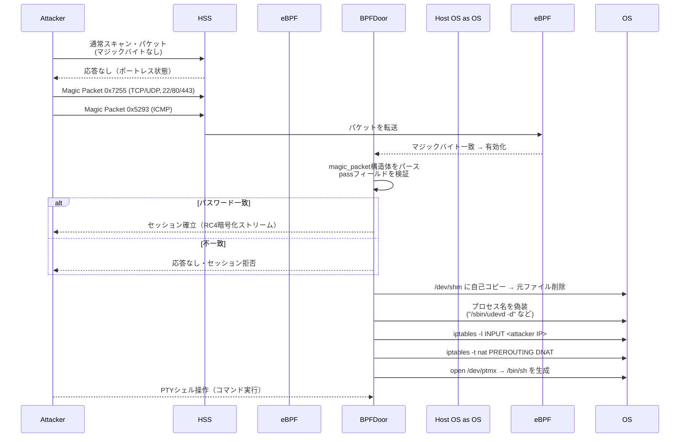

> **BPFDoor**は、eBPFフィルタ・マジックバイト・マルチプロトコルを利用して、“パケット痕跡ゼロ”に近い**ポートレス（backdoor）**状態を実現します。従来のアプローチでは検出されません。このような検出回避を破るには、**メモリ実行・AF_PACKETソケット・iptables改ざん**といった*行動シグナル*を交差分析する必要があります。

<!--more-->


---

## 1️⃣ BPFDoor概要

| 項目 | 内容 |
|------|------|
| 初公開 | PwC脅威インテリジェンスレポート（2021） |
| 主な使用組織 | 中国系APT（スピアフィッシング・通信網侵入） |
| コア技術 | eBPFフィルタリング・マジックバイト認証・RC4暗号化 |
| 検出難易度 | **非常に高い** – パターン/ポートベースIPS・NDR無力化 |

---

## 2️⃣ 動作メカニズム整理

### ① マジックバイト＆マルチプロトコル
* **トリガー** → `0x7255`（TCP/UDP）・`0x5293`（ICMP）のマジックバイト受信時のみ作動  
* **対応プロトコル** → TCP・UDP・ICMPすべて許可  
* **許可ポート** → 22/80/443など一般的サービスポートを再利用 → *ポートスキャン回避*


### ② RC4暗号化・パスワード認証
```c
struct magic_packet {
    unsigned int flag;
    in_addr_t    ip;
    unsigned short port;
    char pass[14];   // "justforfun"などハードコード
};
```

* `pass` の値が内部キーと一致する必要があり、セッションが確立される  
* RC4ストリームによって入出力がリアルタイムで暗号化・復号化される  
* SKTハッキング事件で使用されたと推定されるBPFDoorのパスワード部分  


### ③ 隠蔽・持続化手法

| 手法              | 説明                                                       |
| --------------- | -------------------------------------------------------- |
| **プロセス偽装**     | `/sbin/udevd -d`, `avahi-daemon: chroot helper` などの正規デーモン名 |
| **メモリ実行**      | `/dev/shm` にコピー後、元ファイルを削除                                 |
| **iptables改ざん** | 攻撃者IPを許可 + NAT PREROUTING リダイレクト                         |
| **PTYシェル**       | `/dev/ptmx` に接続 → 記録を防ぐための環境変数を設定                           |

### 📊 シーケンス図 — 全体フロー



---

## 3️⃣ なぜ検知が難しいのか？

| 検知回避ポイント        | 詳細                                   |
| ------------------- | ------------------------------------ |
| **パターン不在**        | マジックバイトを受信するまでパケット・ポート・ログが「0」 |
| **ファイル痕跡の最小化** | 実行直後に自己削除、メモリ常駐のみ                     |
| **正規プロセス偽装**     | SOCの目視・基本モニタリングでは識別困難               |
| **RC4暗号化**        | シグネチャベースIDS／静的解析を無効化              |

---

## 4️⃣ MITRE ATT&CKマッピング（Enterprise v17）

| 戦術 (Tactic)         | 技術・サブ技術                                           | TID           | 説明                                  |
| ------------------- | -------------------------------------------------- | ------------- | ----------------------------------- |
| Execution           | Command & Scripting Interpreter: Unix Shell        | **T1059.004** | RC4認証後にローカル／リバースシェル実行          |
|                     | Execution Guardrails: Mutual Exclusion             | **T1480.002** | PIDファイルで二重実行を防止                     |
| Defense-Evasion     | Hide Artifacts: Ignore Process Interrupts          | **T1564.011** | バックドアプロセスのシグナルを無視                |
|                     | Impair Defenses: Impair Command History Logging    | **T1562.003** | `HISTFILE=/dev/null`設定               |
|                     | Impair Defenses: Disable or Modify System Firewall | **T1562.004** | `iptables`ルールの改変                      |
|                     | Indicator Removal: File Deletion                   | **T1070.004** | 元実行ファイルの削除                        |
|                     | Indicator Removal: Timestomp                       | **T1070.006** | 実行ファイルのタイムスタンプ改ざん             |
|                     | Masquerading: Break Process Trees                  | **T1036.009** | `--init`フラグでPPIDを切断               |
|                     | Masquerading: Overwrite Process Arguments          | **T1036.011** | `argv[0]`を正規デーモン名に変更              |
|                     | Obfuscated/Encrypted File or Information           | **T1027**     | RC4トラフィックの難読化                     |
| Command & Control   | Traffic Signaling: Socket Filters                  | **T1205.002** | eBPFフィルタでマジックバイトを検出             |

> **参考:** MITRE ATT&CKソフトウェア項目 **S1161 (BPFDoor)**

---

## 5️⃣ 実戦PLURA-XDRによる検知：Sysmon for Linux

| Sysmonイベント          | 検知ポイント                                  |
| -------------------- | ------------------------------------------ |
| `ProcessCreate`      | `/dev/shm/*`パスでの実行・疑わしいデーモン名         |
| `FileDeleteDetected` | 実行直後の元ファイル削除履歴                        |
| `NetworkConnect`     | PID = 1（daemon化）+ 外部C2接続                |
| `RawAccessRead`(\*)  | `AF_PACKET`ソケットの生成試行                    |

> *\* `RawAccessRead`イベントはLinux Sysmon 5.8+ ビルドが対象  
> **TIP**：`rule_id=BPFDoor_RawSocket` のようなカスタムタグを付けてPLURA-XDRに送信すると、後続の相関分析が容易になります。

### 1. ファイル名偽装と自己削除の検知


- `/dev/shm/kdmtmpflush` ファイルの作成と削除、権限付与などが発生

### 2. プロセス初期化の検知


- メモリ実行のための `—init` フラグが出現

### 3. iptablesコマンドによるファイアウォール設定変更の検知


- バックドアによるリバースシェル接続用ポートの開放

### 4. リバースシェル接続行為の検知


- ネットワーク接続を示すSysmonのEventID 3のログ発生、iptables経由で開かれたポートからのパケット送信を検知

### 5. リバースシェル接続の成功検知


- 該当コマンド・プロセスがログに現れた場合、リバースシェルが成功したことを意味する

---

## 6️⃣ PLURA-XDR検知戦略

| カテゴリ                | ルール例                                                  |
| ------------------- | ----------------------------------------------------- |
| **メモリ実行**            | パス `/dev/shm`, `/tmp` + `ELF` 実行                        |
| **AF\_PACKET使用**     | `socket(PF_PACKET, SOCK_RAW, …)` 呼び出し               |
| **iptables改ざん**     | `iptables -I`, `-t nat -A PREROUTING` 行為               |
| **リバースシェル**         | `bash -i`, `nc -e`, `socat TCP4:`, `/bin/sh` の実行など       |
| **ハッシュ・IOC**        | BPFDoorサンプルSHA-256、C2ドメインブロック                     |

---

## 🔚 結論 & 対応チェックリスト

1. **メモリパスの実行監視** – `/dev/shm`, `/tmp` をリアルタイム監視  
2. **Raw Socketルール適用** – `AF_PACKET` 生成イベントを即時通知  
3. **iptables変更アラート** – ポリシー・NATテーブルの整合性を定期チェック  
4. **多層相関分析** – ネットワーク・ホスト・ログのグラフを連携分析  
5. **IOCの定期更新** – サンプルハッシュ・C2アドレスのブロック  

> **BPFDoorは「見えない」バックドアを志向します。**  
> **PLURA-XDR**はホスト・ネットワーク・ログの全レイヤーを観測し、その *見えない瞬間* を捉えます。

---

### 📺 関連動画を見る
* [BPFDoor攻撃、どうやって侵入するのか？｜PLURAによるリアルタイム検知デモ](https://www.youtube.com/watch?v=bzGv1AwHy9k)
* [BPFDoor、こうして捕まる！｜PLURAのAuditログベースのリアルタイム検知デモ](https://youtu.be/Rkz7vNAM0ZY)

### 📖 関連コンテンツを読む
* [SKTハッキング悪性コードBPFDoor分析および検知デモ映像（PLURA-XDR対応戦略付き）](https://blog.plura.io/ja/respond/bpfdoor/)  
* [SKT USIMハッキング事件の総まとめ：流出原因・被害規模・対応方法まで](https://blog.plura.io/ja/column/leak_of_skt_usim/)  
* [LinuxでもSysmonを使うべき理由！](https://youtu.be/bzGv1AwHy9k)

