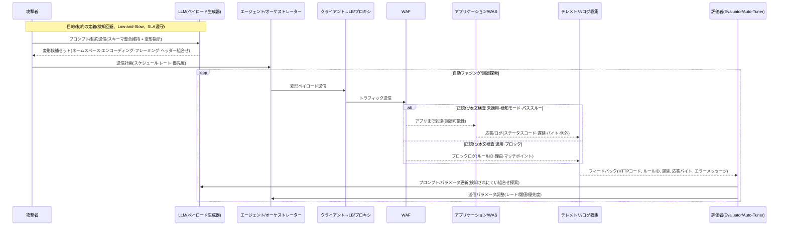

# AI補助WAFバイパス：攻撃自動化シナリオ（深化・攻撃者視点）

この記事では、**LLM/エージェントベースのバイパス戦術**が**実際の攻撃フローでどのように使用できるか**のみを説明します。
>注意：**再現可能なコードと具体的なペイロードの例は含まれていません。**目的は**現象の理解と分析基準の提示**です。

---

## 0) Executive summary

* **核心:** 攻撃者はLLM(生成機)+オーケストレータ(伝送自動化)+評価者(フィードバック最適化)を結合して**バイパスペイロード**を**大量・迅速**生成します。
* **方法:** SOAP/XMLの**スキーマ合致**を維持したまま、**ネームスペース/エンコーディング/フレーミング/ヘッダ一致性**などを体系的に変形し**正規表現・ヒューリスティックベースWAF**の隙間を狙います。
* **ループ：**（生成）→（転送）→（WAF /アプリ応答収集）→（評価/チューニング）→（再生）の**自動パージループ**で**バイパス成功率**を徐々に引き上げます。

<!--more-->

---

## LLMを利用したバイパスオートメーション — シーケンス図

> 要点: **生成→転送→判定→フィードバック**の閉ループが**バイパス成功率**をますます高めます。
> 重要なのは、**表現は違っても意味は同じ(Semantic-preserving)変形を体系化**することです。

---

## 1）脅威モデル（コンポーネント）

* **生成器(LLM)**: スキーマの合致を維持し、**意味同等**な変形を多様に算出(ラベル/シーケンス/ネームスペース/エンティティ/エンコーディングなど)。
* **オーケストレータ**: バリエーションセットを **自動転送**、転送速度・シーケンス・再試行・アイドル間隔などを **プログラム的に制御**。
* **評価者**: 応答/遮断ログを**スコアリング**して次世代の生成・伝送パラメータを**貪欲的/強化学習的**に調整。
* **テレメトリ収集**：HTTPコード、ブロック理由文字列、マッチングルールID、RTT/スローかどうか、応答バイト/ヘッダ、例外メッセージなど。

---

## 2) AIが強化する**4つのバイパス軸**

### A) 構文・セマンティック変形(Semantic-preserving)

*同じ意味を**複数の表現**に置き換えるオートメーション: **名前空間/Prefix/属性順序/コメント/CDATA/エンティティ**バリアント。
* **エンコーディングゲーム**: UTF-8/16、二重エンコーディング、Unicode 分割/同型文字などで **正規表現マッチング** を避ける。
* **ヘッダ-本文の不一致**を意図的に構成して**単一ルール依存**を振る。

### B) 伝送・フレーミング障害

* **gzip/deflate**、**chunked**、**マルチパート境界値**、**HTTP/2フレーミング**などで**本文チェック境界**をぼかし。
* **Body限度**(バイト制限)境界から**ノイズ/パディング**に**部分検査/未検査**状況誘導。

### C) 正規化部材のターゲティング

* **XML正規化/名前空間標準化/エンティティの解釈**がない場合、同じ意味バリアントが**ルール適用前**を通過。
* **通常スキーマ迷彩**で**ホワイトリスト的判断**を乱す。

### D) 運営すっきり誘発・活用

* 誤検知・遅延を誘発し **検知モード(Detect-only)** 転換や**例外政策**拡大を**間接誘導**。
* **非経由ルート**(管理網/直結/バックアップポート)存在時**優先探索・活用**。

---

## 3）自動パージループの**フィードバック信号**（例）

* **WAFレベル**: 遮断理由文字列、マッチングルールID、検査モード(Detect/Block)変動検出、要求・本文長制限に達するかどうか。
* **アプリレベル**: HTTP 2xx/4xx/5xx 分布、エラースタックの一部（禁則語漏れなし）、処理遅延/タイムアウトパターン、応答バイト量。
* **境界値ヒント**: 長さ制限近接時の挙動、圧縮/チャンク処理可否、ヘッダー-本文一貫性検査パス/失敗。

> これらの信号は**攻撃者へのバイパスの組み合わせのヒント**になります。 （文書目的のために**詳細の組み合わせ/文字列の例は省略**）

---

## 4）運用トリック（攻撃者の時点での典型的なアプローチ）

* **低速・分散伝送(Low-and-Slow)**: しきい値の下で **検出しきい値回避**。
* **タイムゾーンの分割**: 夜間/点検タイムゾーンへの**ポリシーの緩和**の可能性の狙い。
* **バージョン・トポロジースキャン**: **WAF前/後段**の配置・TLS終端位置・正規化可否を間接推定。

---

## 5) 限界・制約（攻撃者観点での現実性）

* **正規化/解析・契約基盤システム**では変形利得が急減。
* **応答/遮断情報の最小化** 環境ではフィードバック品質が低く**学習速度低下**。
* **レートリミット/行動分析**が強いと **ループ速度制約**が大きくなる。
* **政策変更履歴管理/有効期限**(TTL)が厳格であれば**例外窓口**が早く閉じられる。

---

## 6) 倫理・趣旨

本文書は、**悪用防止のため**再現可能なコード・具体的なペイロードを**意図的に除外**しました。目的は**脅威モデルの理解**と**分析基準の確立**であり、すべての研究は**合法的・責任ある環境**でのみ行わなければなりません。
