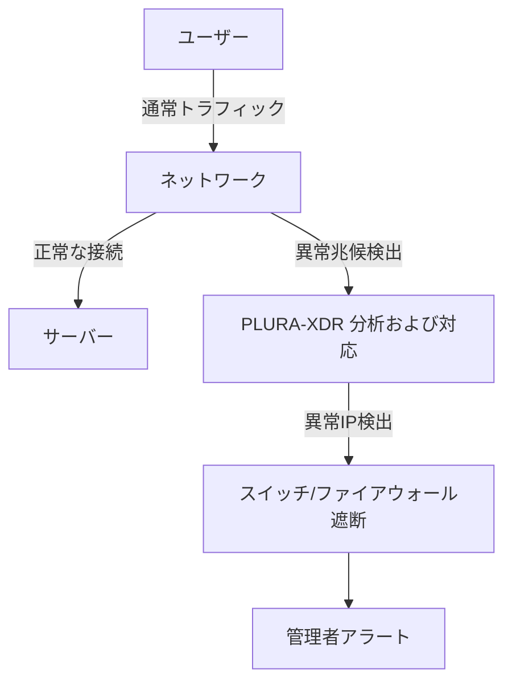

📖 **NAC(Network Access Control)ソリューションの導入は必要か？現実的な検討**

> 目標: "**情報セキュリティにおいて、先制的な対応は不可欠**です。しかし、**過度な先制的対応がかえって重要なセキュリティ脅威を見落とす**可能性もあります。本記事では、NAC導入による先制的なIP管理方式が本当に必要かを検討し、より現実的で効率的な代替アプローチを提案します。"


<!--more-->

---

## 1. 既存のNAC導入の問題点

NAC(Network Access Control)ソリューションは、ネットワークアクセスを事前に制御することで管理目的で提案されたシステムです。しかし、現実的には次のような問題が発生します。

### ❌ **高額な初期導入コストと運用負担**
- 専用機器およびライセンス購入コストの発生
- 継続的な管理および保守のための人員が必要
- 企業環境の変化に伴い、ポリシーの継続的な更新が求められる

### ❌ **不要な過剰管理**
- すべてのIPアドレスを事前に管理する必要があり負担が増加
- 危険性の低いIPアドレスまで事前登録が必要になり、不要な手続きが発生
- 正常なユーザーも認証プロセスにおいて不便を感じる可能性がある

### ❌ **不確実なセキュリティ効果**
- IPの事前登録だけでは完全なセキュリティを保証できない
- 内部ユーザーや攻撃者が回避する可能性がある
- 異常な兆候の検出と対応が別途必要

### ❌ **追加ソフトウェアのインストール負担**
- NACソリューションを使用するには、各ホストにエージェントソフトウェアをインストールする必要がある
- 既存のシステムとの競合が発生する可能性がある
- ユーザーデバイスに追加の負担をかける可能性がある

---

## 2. 現実的な代替案: NACなしでセキュリティ最適化

### 📌 **(1) 必要なときだけIP管理（事前登録方式を排除）**
NACを使用すると、すべてのIPアドレスを事前に登録する必要がありますが、これは不要な管理負担を引き起こします。その代わりに、問題が発生した後に該当するIPアドレスをネットワークから隔離し対応する方法が、より現実的なアプローチです。

#### ✅ **代替案: 異常な兆候を検出した後に対応**
- **EDRを活用した異常行動検出**: 特定のIPから異常なログイン試行や攻撃が検出された場合、自動で対応
- **スイッチベースのネットワーク遮断**: 事前登録なしでも、問題発生時にIPをブロック
- **イベントベース管理**: 問題が発生しない限り、事前登録は不要

---

### 📌 **(2) スイッチベースのIP隔離および遮断**
NACの代わりに、スイッチやファイアウォールを活用してセキュリティを強化する方法を適用できます。

#### 🔹 **方法1: ネットワークスイッチで直接IPを遮断**

```bash
# 特定のIPをネットワークから遮断（Ciscoの例）
conf t
access-list 101 deny ip 192.168.1.100 0.0.0.255 any
```

#### 🔹 **方法2: ファイアウォール(iptables)で異常IPを遮断**

```bash
# iptablesを使用して特定IPを遮断
iptables -A INPUT -s 192.168.1.100 -j DROP
```

#### ✅ **効果**
- **不要なIPの事前登録なしでも** セキュリティを維持可能
- **NACよりコスト効率が高く、同様のセキュリティ効果を提供**
- リアルタイム対応が可能（攻撃検知時に即時隔離）

---

### 📌 **(3) PLURA-XDRを活用した異常な兆候の検出および自動遮断**
PLURA-XDRを利用すると、ネットワーク上の異常な挙動をリアルタイムで検出し、異常が発生したIPを自動的に遮断できます。

#### 🔹 **PLURA-XDRを活用した自動対応**
- **ログデータをリアルタイムで分析し、異常なログイン試行や攻撃を検出**
- **クレデンシャルスタッフィング攻撃、SQLインジェクションなど、さまざまな攻撃パターンをリアルタイムで検知し自動遮断**
- **危険なIPを即座に隔離し、管理者に警告通知を送信**

#### ✅ **効果**
- 専用のNACソリューションなしでもリアルタイムのネットワークセキュリティを維持可能
- 必要なときにのみIPを遮断し、管理負担を最小化
- ネットワーク異常行動、異常な認証試行、および攻撃を自動で検出・遮断
  
---

## 3. 推奨構成図




---

📌 結論

NACはセキュリティ強化というよりも、システム管理の利便性を目的として導入された技術です。しかし、現在の情報セキュリティ管理体制では不要な要素となる可能性が高く、排除する方が望ましいと考えられます。

☑️ NACは高コストであり、管理負担が大きい
☑️ すべてのIPを事前登録する方式は非効率的
☑️ PLURA-XDRを活用すれば、リアルタイムで異常兆候を検出し対応可能
☑️ 追加のソフトウェアインストールなしでセキュリティ運用が可能 

---

💡 代替アプローチ:

- IPベースのアクセス制御を最小化し、必要な場合のみ遮断
- PLURA-XDRを活用してネットワーク異常行動を自動検出・遮断
- スイッチを活用した隔離およびネットワーク遮断を適用

🚀 高価なNAC機器なしでも、PLURA-XDRを活用すればセキュリティ最適化が可能です！

### 📖 関連資料
- [情報セキュリティ製品選定チェックリスト](https://blog.plura.io/ja/column/security_product_checklist/)
- [NAC(Network Access Control)導入自己診断](https://blog.plura.io/ja/tech/nac_evaluation_self_checklist/)
