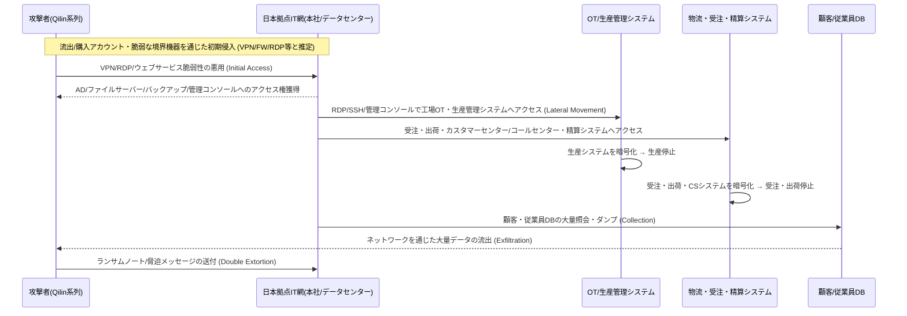

**要約:**
アサヒグループは**2025年9月29日**、「システム障害」の告知から始まり、その後**Qilinランサムウェア**による攻撃と**約190万人規模の個人情報流出の可能性**を順次認めました。この過程で**国内生産30拠点余りのビールの生産・受注・出荷システムが停止**し、コンビニやスーパーで「**アサヒビール品切れ**」が現実となりました。 ([アサヒグループホールディングス][1])

> **核心的コンテキスト:** この事件は単なる「ビール会社のハッキング」ではなく、**OT(工場・設備)とIT(受注・物流・顧客DB)が一つのランサムウェア攻撃によって同時に麻痺する、典型的な産業企業のランサムウェアシナリオ**です。
> 特に攻撃者は、**データ流出(約152万件の顧客 + 27.5万件の従業員・家族情報)**を並行して行う**二重脅迫(Encryption + Exfiltration)**パターンを活用しました。 ([Bitdefender][2])

<!--more-->

---

## 🕒 タイムライン(確定・公開された事実中心)

* **9月29日(月)**:
  * アサヒグループ、「**サイバー攻撃によるシステム障害**」を初回告知(日本およびグローバルサイトで同時告知)。 ([piyolog][3])
  * 日本国内の**受注・出荷・コールセンターシステムが停止**、生産も大部分が止まり「ビール生産オールストップ」状態に。 ([Business Insider][4])

* **10月2日(木)**:
  * アサヒビール国内6工場の**ビール生産再開**(スーパードライの一部ライン)。 ([アサヒグループホールディングス][1])

* **10月3日(金)**:
  * 「システム障害に関する第2報」 – 日本国内のIT資産に限定された障害であり、海外事業への影響は限定的であると説明。 ([アサヒグループホールディングス][1])

* **10月7日(火)**:
  * **Qilinランサムウェアグループ**、ダークウェブサイトで**アサヒへの攻撃の犯行声明**を出し、
    * 内部文書と思われる画像29枚を公開
    * **9,300個以上のファイル(約27GB)の奪取を主張**。 ([Reuters][5])

* **10月8日(水)**:
  * アサヒ、第3報にて**ランサムウェア攻撃**であることを明示し、
    * **無断転送(Exfiltration)された疑いのあるデータがインターネット上で確認**されたと発表。
    * 国内工場の生産は一部再開、スーパードライ・生ビール・ドライゼロなどの出荷を段階的に再開すると告知。 ([アサヒグループホールディングス][1])

* **10月14〜15日**:
  * 第4報にて**個人情報流出の可能性**を公式に言及。
  * サイバー攻撃の影響により**第3四半期決算発表の延期**を発表。 ([サイバートラスト株式会社][6])

* **10月〜11月**:
  * 日本のコンビニ・スーパー(ファミリーマート、セブン-イレブン、ローソン等)で**アサヒスーパードライおよび一部製品の品切れ・供給制限案内**。 ([Business Insider][4])
  * 一部の流通業者は、平時の**10〜20%水準**しか供給されない状況を訴える。 ([ElHuffPost][7])

* **11月27〜12月2日**:
  * アサヒ、フォレンジック結果に基づき**約194万人**の個人情報流出の可能性を認める
    * 約**152万人**: お客様相談室への問い合わせ履歴のある顧客
    * 約**27.5万人**: 従業員・退職者・家族および外部連絡先など
    * 含まれる情報: 氏名・住所・電話番号・メールアドレス、一部は生年月日・性別など。 ([Bitdefender][2])

* **12月現在**:
  * 日本国内の生産は**部分的に回復**。しかし受注・物流・清算システムの復旧遅延により、**決算発表の遅延・売上への打撃**が続く。 ([SecurityBrief Asia][8])

---

## 🧪 Qilinランサムウェアグループとアサヒ攻撃TTP (MITRE ATT&CK マッピング)

アサヒの件は**公式なフォレンジック報告書の全容が公開されたわけではありません。**
したがって、ここでは
1. アサヒ・報道・セキュリティ企業が明らかにした範囲
2. Qilinグループの**一般的なTTP**
を組み合わせ、**「可能性の高い攻撃チェーン」**として整理します。(仮説部分は明示)

### 1) 初期侵入(Initial Access)

Qilinは通常、以下の経路を利用することが知られています。 ([サイバートラスト株式会社][6])
* **流出/購入したアカウント情報でVPN・RDP・SaaSにログイン**
* **脆弱な境界機器の悪用**
  * 例: **FortiGate/FortiProxy RCE脆弱性(CVE-2024-21762, CVE-2024-55591)**
* **公開ウェブサービス・ポータル・OT管理コンソールの脆弱性**
* **フィッシングメール + Infostealerの連携**後
  * Chrome保存のパスワード・セッションクッキーを奪取 → VPN/ADへ迂回ログイン

> **MITREマッピング(可能性の高い組み合わせ)**
> * Initial Access – **T1078 (Valid Accounts)**, **T1190 (Exploit Public-Facing Application)**
> * External Remote Services – **T1133**
> * Phishing – **T1566**, Credential Access – **T1555/T1556**

アサヒの場合、
* **日本国内のIT資産に限定された障害**、
* 工場OTおよび受注・出荷システムが同時に影響を受けたという点を考慮すると、 ([アサヒグループホールディングス][1])
> 「**本社または日本拠点のネットワーク(VPN/境界機器)を通じたAD/ERP/生産管理網への侵入**」
> というシナリオが高い優先順位を持ちます。(正確な侵入地点は非公開)

---

### 2) 内部拡散・権限昇格・OTへの到達

Qilinの**一般的な内部拡散パターン**は以下の通りです。 ([サイバートラスト株式会社][6])
1. AD/ファイルサーバー/バックアップサーバーなどの**「核となるサーバー」へRDP・SMB・SSHで横展開**
2. 遠隔管理ツール(RMM)・OT管理コンソール・SCADA/PLCゲートウェイへ拡張
3. **バックアップ・スナップショットシステムを先に攻撃**した後、
4. 最終的に**ファイル/DB/VM/産業制御システムを暗号化**

> **MITREマッピング**
> * Lateral Movement – **T1021 (Remote Services: SMB/RDP/SSH)**
> * Privilege Escalation – **T1068, T1069 (Permission Groups Discovery)**
> * Discovery – **T1083 (File and Directory Discovery), T1046 (Network Service Scanning)**
> * Impair Defenses – **T1562 (Disable Security Tools, Tamper Backups)**

アサヒの事件において
* 受注・出荷・コールセンター・お客様相談室システム、
* 国内30拠点余りの工場の生産管理・物流システムが同時に影響を受けた点を見ると、 ([TechRadar][9])
> **ITコア(ERP/受注/物流)とOT/製造網の両方にアクセス可能なアカウント・ネットワークセグメントが侵害**された可能性が高いです。

---

### 3) 暗号化(Encryption) + データ流出(Exfiltration)

Qilinは**RaaS(サービス型ランサムウェア)**グループであり、
**暗号化**と**大規模なデータ流出**を同時に行う**二重脅迫(Double Extortion)**戦術を使用します。 ([Reuters][5])

今回のアサヒの件で公開された内容:
* Qilinの主張
  * 内部文書の画像29枚を公開
  * **9,300個のファイル(約27GB)の奪取を主張** ([Reuters][5])
* アサヒの公式発表および後続分析
  * **約152万人の顧客 + 27.5万人の従業員・家族など計190万人規模**の個人情報が攻撃の過程でアクセスされた可能性を認める ([Bitdefender][2])
  * 氏名・住所・電話番号・メールアドレス・(一部)生年月日・性別が含まれる
  * 現時点(2025-12-02)で、ダークウェブへの流出事実は確認されていないと発表 ([Bitdefender][2])

> **MITREマッピング**
> * Collection – **T1114 (Email), T1119 (Automated Collection)**
> * Exfiltration – **T1041 (Exfiltration Over C2 Channel), T1048 (Exfiltration Over Alternative Protocol)**
> * Impact – **T1486 (Data Encrypted for Impact)**

---

## 💥 影響: “ビール品切れ”から“190万人の情報流出”まで

### 1) 運用(OT/IT)への影響

  * 日本国内30拠点の **ビールおよび飲料生産の大幅縮小または停止** ([Business Insider][4])
  * 受注・出荷・カスタマーセンター・コールセンターシステムの停止 →
      * **手書き(紙・ペン・FAX)による暫定運用**を行う様子が複数のメディアで報道。 ([ElHuffPost][7])
  * 全国のコンビニ・スーパーにおいて
      * “アサヒ商品の供給制限・品切れ案内”
      * 平時に比べ **10〜20%程度の製品しか入荷しない** 店舗が多数。 ([Business Insider][4])

### 2) 財務・レピュテーションへの影響

  * 国内飲料・食品部門で **10〜40%の売上減少(2025年10月時点)** の報道があり、
  * ランサムウェアの余波による **四半期決算発表の延期**、
  * 株価・投資家からの信頼低下が伴ったという分析が多くなされています。 ([Bitdefender][2])

### 3) 個人情報・規制リスク

  * 最大190万人の個人情報が攻撃過程でアクセスされた可能性
  * 今後 **フィッシング・スミッシング・標的型スピアフィッシング** に悪用される潜在的リスク
  * 日本国内の個人情報保護法(APPI)および各国規制への対応コストの増加。 ([Bitdefender][2])

---

## 🧭 攻撃概念図 (状況に基づくシナリオ)

*(※図式は公開された状況に基づく概念図であり、実際のネットワーク構造・ログとは異なる場合があります。)*

---

## 🧩 なぜここまで拡大したのか？ — 構造的な失敗ポイント

アサヒ関連の日本国内の記事・分析を総合すると、事故の本質は **“基本は守っていたが、核心が抜けていた”** ことにあります。 ([東洋経済オンライン][10])

### 1) IT-OTネットワークの分離不足

  * 生産網と業務網が **論理的には分離されているが、運用の現実では多数の例外経路** が存在
  * “管理の利便性”を理由に
      * OT管理コンソール、生産計画システム、品質システムが **業務網のAD・アカウント・PCから直接アクセス** 可能な構造

### 2) バックアップ・DRが“物理災害”基準で設計されていた

  * 地震・停電・火災などの **物理災害** 中心のDR設計
  * ランサムウェアを想定し
      * **バックアップシステムから先制攻撃** を受けた際のシナリオが不足
  * **オフライン/エアギャップバックアップ、WORMストレージ、スナップショット隔離** の設計導入が遅れていた状況。 ([cybermagazine.com][11])

### 3) アカウント・権限・遠隔管理ツールの統合ガバナンスの欠如

  * Qilinの一般的なTTPでも明らかなように、
      * **流出アカウント + VPN/遠隔管理ツール** が最も一般的な侵入口 ([サイバートラスト株式会社][6])
  * しかし、大手製造業特有の
      * グループ会社・協力会社・外注人員・設備ベンダーのアカウント・RMMツールが **複数の部門で分散管理** されていた

### 4) 観測性(Observability)の不足

  * 攻撃初期、会社の発表は“システム障害”レベルにとどまっていた ([アサヒグループホールディングス][1])
  * **ログ・テレメトリの統合ビューが十分であれば**、
      * “内部で何が起きているのか”をより早く把握し、
      * OTシャットダウン・工場単位の‘ゼロトラストモード’への切り替えも、より迅速に行えた可能性が高い。

---

## 🛠 **即時実行**チェックリスト (製造・食品・流通企業共通)

以下はアサヒ事件を教訓に、 **韓国の製造/食品/流通企業が今すぐ点検すべき項目** です。

### A. IT-OTネットワーク・アカウント構造の再設計

1.  **IT ↔ OT 接続経路の全数調査**
      * 生産管理・SCADA・PLC・工場MESへと繋がる **すべての経路(シリアルゲートウェイ、VPN、ジャンプサーバー、RDP、ウェブコンソール)** をリスト化
2.  **“一箇所ですべて完結する”管理者アカウントの排除**
      * IT・OT・クラウドをすべて開ける **ドメイン管理者/運用者アカウント** を分離
3.  **OTアクセス専用Bastion・プロキシの導入**
      * 工場機器・コンソールへのアクセスは必ず **中央OT Bastion** を経由するよう強制
      * セッション録画・キーロギング・コマンド監査の必須化

### B. バックアップ・DRのランサムウェア耐性の強化

1.  **3-2-1+α 戦略の実装**
      * 3つ以上のコピー、2つの媒体、1つのオフサイト **+ 1つのエアギャップ/WORM**
2.  **バックアップ用アカウント・コンソールをAD/SSOから分離**
      * 一般的な業務アカウントの奪取によって **バックアップの削除が不可能** な設計に
3.  **定期的なランサムウェア模擬訓練**
      * “バックアップシステムを先に占拠された”ことを想定した復旧訓練
      * RTO/RPOの計測値と経営陣への報告

### C. Qilin TTP対応の検知・遮断ルール (MITREベース)

Qilinの一般的なTTPに基づき、SIEM/XDRで最低限以下を **事前定義ルール** として保有すべきです。 ([サイバートラスト株式会社][6])

  * **初期侵入関連**
      * 同一アカウントによる
          * 海外IP → VPNログイン試行
          * 短時間内での複数地域からのログイン(“MFA Fatigue”を含む)
      * FortiGate/FortiProxy, Citrixなど
          * 境界機器/ゲートウェイの **RCE/CVE悪用パターン**
  * **内部移動・権限昇格**
      * 信頼されていない端末 → ドメインコントローラ/バックアップサーバー・OT管理網への **急激なアクセス増加**
      * 短期間に作成された新規アカウントが
          * 高権限グループ(ドメイン管理者・バックアップ管理者)に編入されるパターン
  * **Exfiltration(データ流出)**
      * 顧客・従業員DBにおいて
          * 平時と異なる時間帯・容量・クエリパターンでのダンプ実行
      * 大量データが
          * 平時使用していないプロトコル/宛先へ送出

---

## 🌟 PLURA-XDRの観点による対応シナリオ (要約)

アサヒ事件は、実質的に“**PLURA-XDRが必要な理由を一度に示す教科書的な事例**”と見なすことができます。

### 1) IT-OT統合ログ + AI相関分析

  * **VPN/境界機器/AD/EDR/サーバーログ + OTゲートウェイログ** を一つのタイムラインに統合
  * Qilin型TTPに合わせて
      * 初期侵入の兆候(アカウントの悪用、境界機器のRCE試行)
      * 内部移動(AD・バックアップ・OTへのアクセス急増)
      * 大量照会・ダンプ・送出
        を **一度のAI/ルール相関分析で識別**

### 2) アカウント・キー・セッション単位のSOAR自動化

  * 検知後直ちに、 **SOARプレイブック** により
      * 疑わしいアカウントのロック・MFA強制
      * VPNセッションの強制終了
      * OT Bastionにおける該当ユーザーのセッション一括終了
      * バックアップコンソールのアカウント・トークン回収、新規セッションの遮断

### 3) “工場単位のゼロトラストモード”スイッチ

  * 工場網/生産網において
      * 疑わしい行為を感知した際、 **自動的に工場単位の‘隔離モード’へ移行**
      * 指定された安全なチャネル(例: OT Bastion経由)以外のすべての新規接続を遮断
  * PLURA-XDRの管理画面において
      * 工場/ラインの状態(正常/注意/隔離)をひと目で表示

---

## 📑 参考・クロスチェック出所

  * アサヒ公式告知 (システム障害、ランサムウェア、生産再開、データ無断転送の状況) ([アサヒグループホールディングス][1])
  * Qilinランサムウェアグループの一般的TTP、初期アクセス・脆弱性・水平移動の分析 ([サイバートラスト株式会社][6])
  * Qilin、アサヒへの攻撃の犯行声明および27GBのデータ奪取を主張 (Reuters) ([Reuters][5])
  * サイバー攻撃による生産・出荷・カスタマーサービスの停止、日本国内のビール品切れの報道 (AP, Business Insider, TechRadar, Cyber Magazine) ([AP News][12])
  * 約190万人規模の個人情報流出の可能性、影響分析 (Bitdefender, その他報道) ([Bitdefender][2])

---

### 最後に

アサヒ事件は“データ保護”を超え、“**物流・生産・売上・ブランド全体が同時に人質に取られた事件**”です。  
製造・食品・流通企業にとっても、

> **“ファイアウォール + バックアップがあれば大丈夫”という考え方から、  
> “IT・OT全体を一つのXDR・SOARとして設計すべきである”という観点への転換**

を図る契機とすべきです。

  * [TechRadar](https://www.techradar.com/pro/security/asahi-stops-pouring-after-cyberattack-stops-production?utm_source=chatgpt.com)
  * [Business Insider](https://www.businessinsider.com/japan-asahi-super-dry-beer-stocks-lawson-family-mart-cyberattack-2025-10?utm_source=chatgpt.com)
  * [Reuters](https://www.reuters.com/world/asia-pacific/cybercriminals-claim-hack-japans-asahi-group-2025-10-07/?utm_source=chatgpt.com)
  * [AP News](https://apnews.com/article/e8854524dcd02eee4aa9e3d65464d019?utm_source=chatgpt.com)
  * [ElHuffPost](https://www.huffingtonpost.es/sociedad/un-gigante-cervecero-volver-lapiz-papel-maquinas-fax-ataque-hackers-notando-facturacion.html?utm_source=chatgpt.com)

[1]: https://www.asahigroup-holdings.com/en/newsroom/detail/20251008-0201.html "Update on System Disruption Due to Cyberattack (3rd) | Newsroom｜ASAHI GROUP HOLDINGS"
[2]: https://www.bitdefender.com/en-us/blog/hotforsecurity/asahi-cyber-attack-spirals-into-massive-data-breach-impacting-almost-2-million-people "Asahi cyber attack spirals into massive data breach impacting almost 2 million people"
[3]: https://piyolog.hatenadiary.jp/entry/2025/10/04/023247?utm_source=chatgpt.com "アサヒグループホールディングスへのサイバー攻撃について ..."
[4]: https://www.businessinsider.com/japan-asahi-super-dry-beer-stocks-lawson-family-mart-cyberattack-2025-10?utm_source=chatgpt.com "Why Japan is about to run out of its favorite beer"
[5]: https://www.reuters.com/world/asia-pacific/cybercriminals-claim-hack-japans-asahi-group-2025-10-07/ "Japan's Asahi hack that halted beer production claimed by Qilin ransomware group | Reuters"
[6]: https://www.cybertrust.co.jp/blog/linux-oss/system-monitoring/vulnerability/security-threat-trends2509-02.html "アサヒ GHD を攻撃した Qilin ランサムウェアグループの一般的な TTP｜BLOG｜ サイバートラスト"
[7]: https://www.huffingtonpost.es/sociedad/un-gigante-cervecero-volver-lapiz-papel-maquinas-fax-ataque-hackers-notando-facturacion.html?utm_source=chatgpt.com "Un gigante cervecero tiene que volver al lápiz, papel y máquinas de fax por el ataque de unos hackers: lo están notando en su facturación"
[8]: https://securitybrief.asia/story/asahi-delays-results-as-ransomware-attack-disrupts-operations?utm_source=chatgpt.com "Asahi delays results as ransomware attack disrupts ..."
[9]: https://www.techradar.com/pro/security/asahi-stops-pouring-after-cyberattack-stops-production?utm_source=chatgpt.com "Asahi stops pouring after cyberattack stops production"
[10]: https://toyokeizai.net/articles/-/921207?display=b&utm_source=chatgpt.com "アサヒビール｢形だけのセキュリティ対策｣が招いた大混乱､\"基本 ..."
[11]: https://cybermagazine.com/news/how-asahis-breach-signals-rising-ot-security-risks?utm_source=chatgpt.com "Asahi Breach Exposes Brewing Industry OT Security Risks"
[12]: https://apnews.com/article/e8854524dcd02eee4aa9e3d65464d019?utm_source=chatgpt.com "Cyberattack hits major Japanese beverage producer, affecting its operations"
