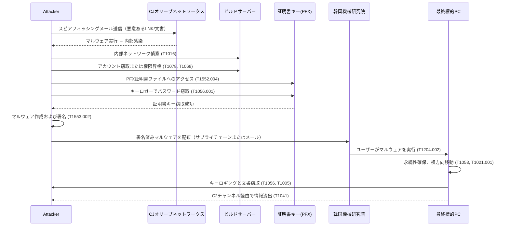

## 1. 攻撃の概要

キムスキ組織は**標的企業**（今回の場合はCJオリーブネットワークス）にまず侵入し、社内の開発サーバーやビルドサーバーから**コード署名証明書を取得**した後、この**盗まれた証明書**を用いてマルウェアを正規プログラムのように偽装・署名します。その後、**既存の信頼チェーン**を悪用して他の機関（例：韓国機械研究院）など最終標的組織にマルウェアを配布・実行させ、検知を回避しながら侵入範囲を拡大します。

<!--more-->

---

## 2. キムスキによるデジタル証明書の窃取と悪用：MITRE ATT&CKマッピング

以下は攻撃の段階を**戦術（赤）**を中心に分類し、各段階で使用された代表的な技術（Technique ID）を整理したものです。

### (1) 初期侵入 - **Initial Access (TA0001)**

| 技術 (Technique)                       | ID        | 説明                                                                                           |
| -------------------------------------- | --------- | -------------------------------------------------------------------------------------------- |
| **Spearphishing Attachment**          | T1566.001 | キムスキはPDF・HWP・LNKなどの形式のマルウェア付きメールを送信し、ターゲットに開かせることで初期アクセスを確保します。 |
| **Exploit Public-Facing Application** | T1190     | （可能性）もし標的企業のWebサーバーやVPN機器などにRCE脆弱性があれば、直接内部システムに侵入することも可能です。 |

### (2) 権限昇格＆内部探索 - **Privilege Escalation (TA0004), Discovery (TA0007), Lateral Movement (TA0008)**

| 技術 (Technique)                              | ID        | 説明                                                                                      |
| --------------------------------------------- | --------- | ----------------------------------------------------------------------------------------- |
| **Valid Accounts**                            | T1078     | 攻撃者がメール・VPN・ドメインアカウントなどの有効な資格情報を盗み、権限を拡大。過去にもキムスキはフィッシングで得たアカウントで内部ネットワークにアクセスした痕跡があります。 |
| **System Network Configuration Discovery**    | T1016     | 証明書やビルドサーバーの場所を把握するため、OS・ネットワーク・共有フォルダの情報を収集。                          |
| **Remote Services: RDP**                      | T1021.001 | RDP（リモートデスクトップ）を使って内部のサーバー間を横移動し、RDPラッパーなどを通じて永続的なアクセスを確保。         |
| **Privilege Escalation: Exploitation**        | T1068     | Windowsの脆弱性、レジストリやSUDO設定ミスを利用して管理者/システム権限を獲得し、コード署名証明書が保存されたサーバーにアクセス。 |

### (3) コード署名証明書の窃取 - **Credential Access (TA0006)**

| 技術 (Technique)                       | ID        | 説明                                                                                      |
| -------------------------------------- | --------- | ----------------------------------------------------------------------------------------- |
| **Unsecured Private Keys**            | T1552.004 | ビルドサーバーや開発者PCに保存された `.p12` や `.pfx` 形式の**コード署名秘密鍵**ファイルを直接検索・取得。      |
| **Keylogging** (またはInput Capture)  | T1056.001 | 証明書ファイルがパスワードで保護されている場合、キーロガーなどでパスフレーズ入力時に盗み取る。                      |
| **OS Credential Dumping**（一部可能性）| T1003     | （可能性）ドメイン環境に証明書管理者の認証情報が保存されている場合、lsassからのダンプで取得し、証明書サーバーへのアクセスを実現。 |

### (4) マルウェア署名とセキュリティ回避 - **Defense Evasion (TA0005)**

| 技術 (Technique)                       | ID        | 説明                                                                 |
| -------------------------------------- | --------- | ------------------------------------------------------------------ |
| **Code Signing**                       | T1553.002 | **盗まれた証明書**を使ってマルウェアにデジタル署名し、Windowsやウイルス対策ソフトに正規ソフトと誤認させて検知を回避。 |
| **Masquerading**                       | T1036     | 実行ファイルの名前やアイコン、バージョン情報を正規プログラムに偽装し、さらに署名もCJオリーブネットワークス名義で困難化。 |
| **Obfuscated Files or Information**    | T1027     | スクリプトやペイロードを難読化し、XORやBase64などで暗号化して配布し、シグネチャ検知を回避。           |
| **Disable or Modify Tools**            | T1562.001 | （可能性）EDRやウイルス対策ソフトを無効化またはロギング設定を変更してマルウェアの痕跡を隠す。              |

### (5) 追加侵入と最終標的攻撃 - **Execution (TA0002), Persistence (TA0003), Collection (TA0009), Exfiltration (TA0010)**

| 技術 (Technique)                              | ID            | 説明                                                                                             |
| --------------------------------------------- | ------------- | ------------------------------------------------------------------------------------------------ |
| **User Execution**                            | T1204.002     | CJオリーブネットワークスの署名が付いたマルウェアを、最終標的（KIMM研究員など）に「正規のアップデートファイル」と誤認させて実行させる（メール添付・USB・協力会社経由など）。 |
| **Scheduled Task/Job**                        | T1053         | マルウェアDLLやスクリプトをスケジュールタスクとして登録し、再起動後も自動実行されるよう永続性を確保。                 |
| **Screen Capture / Keylogging**               | T1113 / T1056 | キムスキが設置したバックドアから研究員PCの画面やキーボード操作を取得し、文書やアカウント情報を盗む。                   |
| **Data from Local System / Network Share**    | T1005         | 内部ファイルサーバーから文書、ソースコード、インフラ情報などを探して抜き出す。                                |
| **Exfiltration Over C2 Channel**              | T1041         | 盗んだデータ（研究員の文書やシステム情報など）をC2サーバーへ送信。HTTP/HTTPS、WebDAV、DNSトンネルなどの手法が報告されている。 |

---

## 3. 攻撃の概要フロー

以下はキムスキ組織が**証明書を窃取** → **マルウェアに署名** → **最終標的攻撃**までの全過程を段階別に整理した要約フロー図です：

1. **スピアフィッシングなどによりCJオリーブネットワークスに侵入**
   - (TA0001) 初期アクセス: T1566.001
   - 内部権限の確保、ビルドサーバーの探索: T1016など

2. **コード署名証明書（秘密鍵）の窃取**
   - (TA0006) 資格情報アクセス: T1552.004
   - キーロガーでPFXパスワード取得: T1056.001

3. **窃取した証明書でマルウェアに署名**
   - (TA0005) 防御回避: T1553.002
   - 署名済みマルウェアを外部標的に配布

4. **最終標的（韓国機械研究院など）でマルウェア実行**
   - (TA0002) ユーザー実行: T1204.002
   - (TA0003) 永続性確保、(TA0008) 横方向移動

5. **情報収集と流出**
   - (TA0009) 収集: T1056, T1113
   - (TA0010) 流出: T1041

---

### 📊 シーケンス図 — 全体フロー

---

## 4. 示唆点および防御に関する推奨事項

1. **コード署名証明書の保護**

   * **開発・ビルドサーバー**に保存された証明書（秘密鍵）へのアクセス権限を最小限にし、可能であれば **HSM**（ハードウェアセキュリティモジュール）を導入して物理的に分離・保護。
   * 証明書使用時に **多要素認証（MFA）** を要求し、「誰がいつどのコードに署名したか」という **ログの記録**を徹底的に管理。

2. **署名済みファイルも行動ベースの検知が必須**

   * コード署名の有無に関係なく、**不審なプロセスの動作**（権限昇格、任意ファイル作成、C2通信など）はセキュリティソリューション（EDR/XDR）で即時に警告・遮断。
   * 「署名＝安全」という過信を捨て、内部ネットワークでも定期的に「盗まれた証明書リスト（CRL）」を更新・検証。

3. **スピアフィッシング防御および内部偵察の検知**

   * キムスキの主要攻撃ベクトルである **スピアフィッシングメール** を遮断するために、ATPメールフィルターやURL/添付ファイルのスキャンを強化。
   * 初期侵入後に **ビルドサーバー** や **証明書管理サーバー** への不正アクセスを早期に発見するため、SIEM・XDRでアカウント窃取の兆候（ログイン履歴）やネットワークスキャンイベントを監視。

4. **脅威インテリジェンスおよびCRL（証明書失効リスト）のリアルタイム適用**

   * 盗まれた証明書の **ハッシュやシリアル番号** を脅威インテリジェンスに登録し、**署名済みマルウェア** を迅速に識別。
   * OS・アンチウイルス・ブラウザが **失効済み証明書** で署名されたプログラムを信用しないように、**CRL/OCSP** を定期的に強制アップデート。

5. **協力会社・サプライチェーンのセキュリティ**

   * キムスキは **サプライチェーン**（下請け企業、協力会社）を経由して最終標的にアクセスするため、**パートナー企業** にもセキュリティポリシー・基準の遵守を要求。
   * 協力会社との接続区間（例：VPN、ファイル共有サーバー）においてゼロトラストによるアクセス制御および平時からのログモニタリングを実施。

以下は既存のキムスキによる証明書窃取攻撃シナリオに **「CJ大韓通運の配送管理プログラムに偽装」** する可能性を加え、攻撃の範囲がどのように拡大し得るかを説明するシナリオです。

---

## 5. **仮定シナリオ**：CJ大韓通運の配送管理プログラムに偽装した広範囲なサプライチェーン攻撃

> **重要なご案内**  
> 本章は **実際に起こった事件** を記述したものではなく、もしCJオリーブネットワークスの証明書が盗まれた場合という **仮定** に基づいて作成された **想定シナリオ** です。現在のところ、このような大規模攻撃が実際に発生したという **公式な発表や確認された事実** はありません。

### 5.1 概要

もしキムスキ組織がCJオリーブネットワークスのコード署名証明書を盗み、それを **CJ大韓通運の配送管理プログラム**（例：送り状印刷ツール、ドライバー用アプリインストーラーなど）に偽装して署名した場合、その影響は単一の組織を超えて、**多数の物流・宅配業者、中小企業、自営業者** にまで広がる可能性があります。この仮想シナリオは、キムスキがこれまでに示してきた **正規証明書の悪用戦術** を鑑みて、「このような形でも攻撃が可能である」という警告を目的に作成されました。

### 5.2 仮定された攻撃シナリオ

1. **証明書流出（仮定）**

   * キムスキ組織がCJオリーブネットワークスの内部開発・ビルドネットワークに侵入し、正式なコード署名証明書を盗んだと **仮定** します。

2. **配送プログラムに偽装したマルウェアの作成**

   * 攻撃者は「CJ大韓通運の送り状印刷プログラム」または「ドライバー用アプリのアップデートファイル」のように見える **マルウェア** を作成します。
   * 例）`CJ_DeliverySetup.exe`、`送り状印刷_最新版.exe` など。アイコン・バージョン情報・デジタル署名もCJオリーブネットワークス名義に偽装。

3. **正規署名による信頼確保**

   * 盗まれた証明書で署名されたマルウェアは、Windowsやアンチウイルスに **信頼できるソフトウェア** として認識されやすくなります。
   * ユーザーから見ても「CJ大韓通運」関連のファイルなので、疑わずに実行してしまう可能性が高いです。

4. **マルウェアの配布経路（仮定）**

   * **宅配ドライバー向けスピアフィッシング**：「アップデート案内」メールに悪意あるインストーラを添付。
   * **広告・ポータルバナー等** を使って「配送プログラム最新版ダウンロード」リンクに偽装。
   * **協力会社サーバー侵害後** に正規のダウンロードリンクを攻撃者が差し替える方式など。

5. **広範囲な感染および社内ネットワークへの拡散可能性**

   * 多数の中小宅配代理店やECショップ運営者が「正規アップデート」と信じてインストールし、感染。
   * マルウェアはキーロギング、アカウント・文書の窃取、追加ペイロードのダウンロードなどを通じて **社内ネットワークへの拡散** を狙います。
   * 深刻な場合、大手オンラインプラットフォーム（クーパン・NAVERショッピングなど）と連携するシステムにまで **連鎖的に侵入** する可能性も否定できません。

> 上記のすべての段階は、「もし証明書が盗まれたなら」という前提に基づいた **仮定シナリオ** です。

---

### 5.3 拡散範囲が危険な理由（仮定の根拠）

| 項目                   | 説明                                                                                   |
|----------------------|--------------------------------------------------------------------------------------|
| **信頼に基づくサプライチェーン** | CJ大韓通運は多数の代理店・協力会社と連携しているため、たった1つの偽装ファイルによる感染でも**広範囲に感染が拡大**する可能性がある。 |
| **共用PCの使用率が高い**      | 宅配現場では複数人が使用する**共用Windows PC**が多く、キーボード入力やアカウント離脱の脆弱性が高く、一度感染すると継続的な拡散が可能。 |
| **正規署名による回避**       | CJオリーブネットワークス名義のデジタル署名が悪用されるため、アンチウイルスやEDRによるマルウェア検出が困難になる可能性がある。 |
| **メール・配送情報の悪用可能性** | 顧客名・住所・電話番号などが漏洩した場合、**二次スミッシング**やさらなる標的型攻撃のリスクが増加。                     |

---

### 5.4 マイターアタック（MITRE ATT&CK）追加マッピング（仮定の例）

| 戦術（Tactic）                   | 技術（Technique）                                                   | 説明                                               |
|-------------------------------|--------------------------------------------------------------------|--------------------------------------------------|
| **TA0001 (Initial Access)**    | T1566.002 – **Spearphishing Link**                                 | CJ大韓通運のアップデート通知メールを装い**悪意あるリンク**を配布。         |
| **TA0005 (Defense Evasion)**   | T1553.002 – **Code Signing**                                       | CJの証明書で署名されたマルウェアにより、アンチウイルスやWindowsの基本セキュリティを回避。 |
| **TA0009 (Collection)**        | T1056 – **Keylogging** T1005 – **Data from Local System**       | 送り状入力、顧客情報、管理者アカウントなどの**機密データ**を窃取。         |
| **TA0010 (Exfiltration)**      | T1041 – **Exfiltration Over C2 Channel**                           | 窃取情報を外部のC2サーバーに送信（HTTPS/TCPなど）。           |
| **TA0011 (Command and Control)**| T1071.001 – **Web Protocols**                                      | C2サーバーと**正規ポート（443）**を通じて暗号化通信し、長期潜伏を維持。    |

---

### 5.5 参考事項：キムスキ（Kimsuky）の主な特徴

* 北朝鮮の支援を受けているとされるAPTグループであり、**スピアフィッシング**や**文書型マルウェア**、そして**正規証明書の窃取**を用いた**高度な攻撃**が頻繁に報告されている。
* 多数の国内外の研究機関、防衛関連企業、報道機関が標的となったとみられ、**RDP Wrapper、バックドア、キーロギング**など様々な手法を組み合わせて、長期間にわたり内部システムを掌握・情報収集することが特徴。

---

### $まとめ：「仮定シナリオ」の警鐘として$

以上は「CJオリーブネットワークスの証明書漏洩」が**実際には確認されていない**状況のもと、万が一それが発生した場合に**サプライチェーン攻撃がどこまで拡大し得るか**を説明するために示された**仮定のシナリオ**である。実際にこのような攻撃が発生したという**公式な確認**や**証明書漏洩の証拠**は現在公開されていないことを改めて強調する。

それでもなお、過去にキムスキおよび他のAPTグループが**正規証明書の窃取**を用いた攻撃を幾度となく試みてきた事実から、**サプライチェーンのセキュリティおよび証明書管理**に対する徹底的な備えが必要であることが示唆される。

---

## 結論

キムスキ組織が**窃取したデジタル証明書**を使ってマルウェアに署名し、それによってサプライチェーン攻撃（Supply Chain Attack）を展開した事例は、信頼に基づくセキュリティ体制を根底から揺るがす**Defense Evasion**の代表的な戦術である。  
**MITRE ATT&CKフレームワーク**で分析すると、攻撃者は**Initial Access** → **Credential Access（証明書窃取）** → **Defense Evasion（署名による回避）** → **Execution / Persistence / Collection** に至るまで、**APT攻撃の全過程を体系的に実行**したと考えられる。

特に窃取された証明書を用いて**CJ大韓通運の配送プログラムに偽装**した場合、攻撃範囲は単一の組織を超えて、**何万もの物流協力会社・中小企業・個人事業主**にまで拡大する可能性があり、これは**全国規模のサプライチェーン混乱シナリオ**へとつながりうる。これらの環境の多くはセキュリティインフラが脆弱であり、**二次被害**の可能性も極めて高い。

最終的に、この事例は**デジタル証明書が単なるセキュリティ構成要素ではなく、全体の信頼体制の中核**であることを再認識させるものであり、組織は以下の事項を必ず整備すべきである：

* **署名されたファイルでも疑う**という原則に基づく**行動ベースの検知（XDR、SIEM）**
* **定期的なCRL/OCSPチェックと証明書管理のセキュリティ強化**
* **協力会社も含めたサプライチェーンのセキュリティ制御と脅威インテリジェンスの連携**

窃取された証明書は単なる内部セキュリティ事故ではなく、**全面的なサイバー作戦の引き金**となり得る。したがって、今この瞬間からでも、**予防中心のセキュリティ戦略**へと転換することが不可欠である。

---

### 📖 関連記事
* [PLURA-XDRを活用したサプライチェーンセキュリティ強化策](https://blog.plura.io/ja/column/campaign_supplychain_security/)
