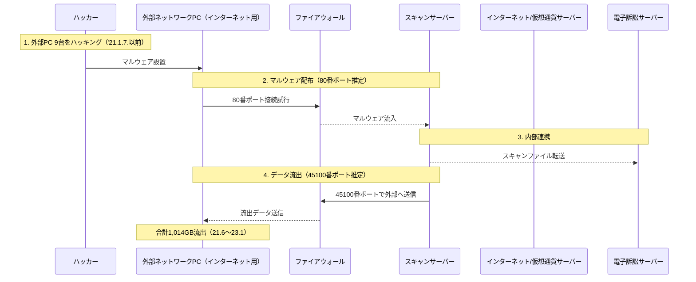

司法部の電算網が**北朝鮮のハッキング組織**「ラザルス」と推定される集団の攻撃を受け、**少なくとも17,998人**の個人情報が流出しました。  
**内部・外部ネットワーク間の「ポート」（ネットワーク通信経路）の開放**と**不十分なアカウント・パスワード管理**などのセキュリティ脆弱性を悪用し、合計で**1,014GB**におよぶ大量のデータが外部に流出したとされています。

<!--more-->
---

### 1. **偵察（Reconnaissance）**
#### 🔍 **内部・外部ネットワークの接続確認および脆弱性の把握**
- 内部ネットワークと外部ネットワークが**ポートを通じて自由に通信可能**な構成であることを確認。
- **内部・外部ネットワークの管理アカウント**が推測しやすい初期パスワードで設定されていることを把握。

---

### 2. **初期侵入**
#### 🚨 **マルウェアの配布と侵入**
- 外部ネットワーク用PC（インターネット接続用）**9台**を事前にハッキングして**マルウェア**を設置。
- これらのPCを**中継地点**として使用し、内部のスキャンサーバーにマルウェアを配布（推定**80番ポート**使用）。

---

### 3. **情報収集**
#### 🗄️ **電子訴訟サーバーへのアクセスおよび大量データの取得**
- ハッカーは内部スキャンサーバーとの連携プロセスを悪用して**電子訴訟サーバー**にアクセス。
- **PDFファイル**として保存されていた**住民登録番号、診断書、婚姻関係証明書**などの**訴訟文書**一式を入手。
- 暗号化が施されていない住民番号などのセンシティブ情報を含む**1,014GB**のデータを大量に収集。

---

### 4. **情報流出**
#### 📤 **外部へのデータ転送**
- スキャンサーバーが**45100番ポート**を通じて外部ネットワークへデータを送信するように操作。
- **8か月間**ハッキングの事実に気づかず、**遅延報告**が行われ、その間に大規模なデータ流出が発生。

---

### 5. **流出方法の概念図**

### 📑 参考資料
* [朝鮮日報 記事](https://www.chosun.com/national/2024/05/13/VFMMY3PYINEL7IKHG4KNRAHTH4/)

