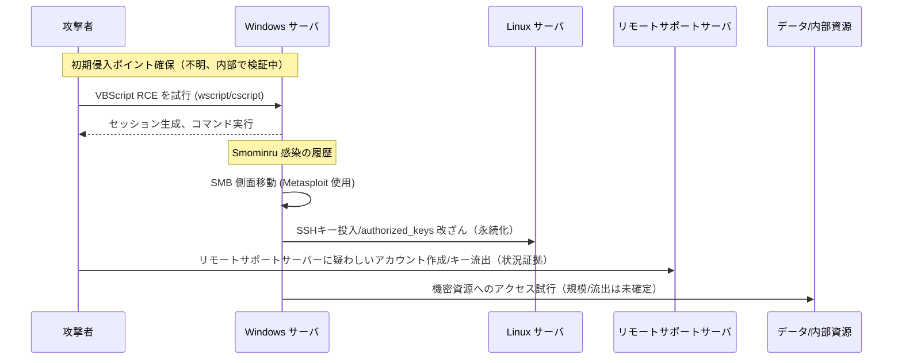

**要約一行:** KTは**2025年9月18日23:57**韓国インターネット振興院(KISA)に**サーバー侵害の兆候4件、疑いの情況2件**を申告しました。公開された項目には、**Windows サーバー侵入・SMB サイド移動、VBScript ベースの RCE、「Smominru」ボット感染、Linux アカウント・SSH キー操作、リモートサポート（アルサポート）サーバー疑わしいアカウントおよび秘密鍵流出**などが含まれます。データ漏洩の有無はまだ確認されていません。 ([韓国経済][1])

> **核心コンテキスト：**先進**ロッテカードWebLogic事件**のように、**RCE**(リモートコード実行)を踏み台に**ウェブシェル(持続性)→内部移動**につながる**典型的な攻撃パターン**が再現されています。違いは**KTガン**が**サーバー全般(Windows・Linux・遠隔支援)**の**多軸(Execution・Credential/Key・Lateral Movement)**を同時に触ったという点です。

<!--more-->

---

## 🕒タイムライン（確定事実を中心に）

- **9月15日(月)**: 外部保安業者全数点検結果報告書を受領→内部検証着手。 ([Daum][2])
- **9月18日(木) 23:57**: KISAに **侵害痕跡4件+疑い情況2件**申告。 ([韓国経済][1])
- **9月19日(金)**: 政府・KISA合同ブリーフィング―**どのサーバーなのか、流出するのか**は精密分析必要立場。 ([Daum][3])
- **9月21日(日)**:追加報道―**Windows・Linux・遠隔支援サーバーまで併せる侵害項目**詳細公開。 ([Daum][4])
- **9月22日(月)**: **廃棄されたサーバーのログバックアップが残っている状況**報道(連合ニュース)。 ([Yonhap][Y1])
- **9月24日(水、予定)**: 国会過防衛 **ハッキング事態聴聞会**(KT・ロッテカードなど証人採択)。 ([Hani][5])

> *申告遅延論議*: KTが**15日認知→18日申告**で「24時間以内申告」義務違反論議が提起される(法解釈は当局判断事案)。 ([Digital Times][6])

---

## 🧪公開された**侵害4件・疑問2件**技術分析（MITRE ATT&CKマッピング）

### 🔹 侵害の兆候(Confirmed)

1) **Windows サーバーの侵入後のサイド移動の試み**
- **MITRE**: *Lateral Movement* — **T1021.002 (SMB/Windows Admin Shares)**, **TA0008**
- **意味**: 初期侵入ポイントを確保した後、Windowsドメイン/サーバーに**SMBベースの移動**しようとする状況。 **アドミン共有（C \ $、ADMIN \ $）** アクセス、セッションの再利用、ローカル管理者アカウントの乱用の可能性。 ([Daum][4])

2) **「Smominru」ボット感染**
- **MITRE**: *Resource Hijacking* — **T1496**, *Exploitation of Remote Services* — **T1210** *(一般的な伝播特性)*
- **意味**: **モネロ採掘**で有名なボットネット。過去 **MS17-010(EternalBlue)** 悪用事例が広く報告されている。 *KT 件で同一脆弱性の悪用が確認されたわけではない（未確定）。 * ([Daum][4])

3) **VBScriptベースのリモートコード実行と機密情報の奪取**
- **MITRE**: *Execution* — **T1059.005 (Visual Basic)**, *Collection/Exfiltration* — **TA0009/TA0010**
- **意味**: **wscript/cscript** 実行、**AMSIバイパス/スクリプト難読化**可能。イベントログ4688/4104、Sysmon（1/7/11）でトレーストレースが必要です。 *「敏感情報消臭」は情況報告水準―規模/対象は未確定。* ([Daum][4])

4) **MetasploitによるSMB認証の試みとサイド移動の成功**
- **MITRE**: *Lateral Movement* — **T1021.002**, *Credential Access* — **T1110/T1550** *(認証・再使用推定)*
- **意味**: ツール・フレームワーク **アーティファクト(UA、Pipe、Named Serviceなど)**ベースの識別可能。 EDR/ネットフローで**同時間帯認証失敗→成功切り替え**パターン確認が必要。 ([Daum][4])

### 🔹 疑わしい情況(Suspected)

A) **Linux ‘sync’ アカウント操作 & `~/.ssh/authorized_keys` 作成**
- **MITRE**: *Persistence* — **T1098 (Account Manipulation)**, **T1098.004 (SSH Authorized Keys)**
- **意味**: **パスワードなしのキーログイン**ベースの**永続性**の確保シナリオ。 `PermitRootLogin no`、 `PasswordAuthentication no`などのチェック必須。 ([Daum][2])

B) **遠隔支援(アルサポート)サーバー疑わしいアカウント生成&秘密鍵流出**
- **MITRE**: *Valid Accounts* — **T1078**, *Exfiltration* — **TA0010**
- **意味**: **遠隔支援ゲートウェイ**掌握時**戦士遠隔接続経路**で悪用可能。 **サーバー側キー/トークン前面交換・回収**必要。 *(ベンダー脆弱性断定ではない: アカウント・キー管理の問題かもしれない)* ([Daum][2])

> **データ流出可否**: 政府・KISAは**侵害サーバー・流出確認に追加分析が必要**入場。 KTも「どんな情報が流出したのか未確認」と選んだ。 ([Daum][3])

---

## 🧩なぜ**デフォルトブロックルール**がありますか？

**典型的なRCE→Webシェル→Lateral Movement**パターンは、**WAF基本ルール**と**EDR標準検出**でかなりの部分**初期にブロック可能**です。それでも事故が発生した理由で、以下の**運営失敗モード**が取り上げられます（仮説）。

1. **WAF非経由経路**：LBヘルスチェック・管理ポート、代替サブドメイン、**直接IP(7001/7002)**などバイパスルート。
2. **モニタリングモード/ホワイトリスト過剰**: 検出専用操作または**SOAP/XML**に寛大な例外。
3. **正規化/復号化未適用**: GZIP/Chunked、特殊エンコーディングなど **バイパスペイロード** 通過。
4. **政策の不一致**: ブルー/グリーン・DR切り替え時 **政策未同期化**。
5. **ルール更新遅延**: テスト失敗後 **ロールバック**・放置。
6. **通知未連携**: 遮断/検出信号が **管制・EDR・チケット**につながらない。

> **即時チェック（4つのコア）**
> 1) **すべての外部ルートWAF経由の保証**、
> 2) **SOAP/XMLブロックルール適用・正規化アクティブ**,
> 3) **例外/ホワイトリストの再チェック**、
> 4) **ブルー/グリーン/DRポリシーの同期及びルールの最新化**。

---

## 🔄インシデントの更新（9月22日） - **廃棄サーバーログのバックアップの確認状況**

連合ニュースの報道によると、「廃棄されたサーバーのログバックアップが残っている状況」が確認されました。これは、初期の主張とは異なり、**デジタル証拠（ログ/バックアップイメージ）がまだ入手可能**である可能性があることを意味します。 ([Yonhap][Y1])

**Forensic & ガバナンス示唆点**
- **証拠保全(Chain of Custody)の再開可能性**: バックアップボリューム/テープ/スナップショットへの同時アーティファクト存在の開放性。
- **ログスコープの拡大**：SIEMソース、ストレージスナップショット（NFS /オブジェクトなど）、リモートサポートゲートウェイ監査ログまで**転写保存コマンド**が必要です。
- **WORM/保存ポリシー**: バックアップ/オブジェクトバケットへ **不変保存(Write-Once-Read-Many)** 一時的な強制。
- **共同ハッシュチェーン**: 捜査・監督機関と**ファイル別SHA-256/タイムスタンプ共有**。

---

## 🧭攻撃概念図（状況に基づいて）

*（スキームは公開状況に基づいた概念図であり、実際のネットワークトポロジと異なる場合があります。）*（[Daum] [4]）

---

## 🛠**即時履行**チェックリスト（優先順位）

**A。 Windows内部の移動をブロック**

* **SMB Sign/Encrypt** 強制、 **Admin Shares(C\$, ADMIN\$)** アクセス管理、 **LAPS/Entra LAPS** でローカル管理者ランダム化・周期回転。
* **wscript/cscript ブロック(アプリ制御)**、**AMSI 強制**、**PowerShell Constrained Language**、**WDAC/SR** でスクリプト実行制御。
* **異常認証(SMB/WinRM)** ルール: *同時間帯失敗→成功転換、管理者交差ログイン、非業務時間ルート移動*。

**B。 Linux 永続性の削除**

* `~/.ssh/authorized_keys` 全数検証・**キー回収/回転**, `PermitRootLogin no`, `PasswordAuthentication no`, **U2F/FIDO2** まず。
* **`sync`などのシステムアカウント**ログイン禁止/シェル削除。

**C。リモートサポート/ゲートウェイ**

* **アカウント・キー前面交換**、**MFA必須**、**許可IP/デバイス登録制**、**セッション記録・監査**。
*管理者コンソールへのアクセスは、**Bastion（プロキシ型）**バック集約、**異常アカウント・キー生成通知**必須。

**D。検知・観測強化**

* **スクリプトエンジン(4688/4104、Sysmon 1/7/11)**、**SMB/WinRM認証テレメトリ**を**セッション単位**相関分析。
* **キー/トークン/秘密情報**照会・ダウンロードイベントに**UEBA**適用。
* **戦士脆弱資産のスナップショット**: EoL/未パッチWindows、インターネット露出リモートサービス即時遮断・分離。

**E。ガバナンス・届出**

*事故認知基準・証明（タイムスタンプ・担当者）標準化、**24時間内報告** SLA/ランブック再定義、**プレスライン/技術ライン分離**。 ([Digital Times][6])

---

## ⚖️事実関係注意（不確実/未確認）

* **初期浸透技法・ルートサーバー**: 政府・KISA精密分析待機。 **流出規模/範囲**も未確定。 ([Daum][3])
* **Smominru関連の脆弱性**：一般的にEternalBlueの悪用報告が多いが、**KTは同じかどうかは確認されない**（可能性の言及）。 ([Daum][4])

---

## 🌟 PLURA-XDR視点対応

* **スクリプト/ウェブシェル/ボット行為のリアルタイムブロック**: VBScript/PowerShell/コマンドソルバー+パイレス指標相関分析 **ブロック/分離**。 *(MITRE: T1059.005、T1505/T1546)*
* **内部移動検出**: **SMB/WinRM/LDAP** 認証・セッションメトリックとEDRイベント結合、**動作ベースのLateral Movement**検出。 *（T1021、TA0008）*
* **キー・アカウントガバナンス**: **authorized\_keys 変更・新規アカウント・権限上昇** イベントをリアルタイムルールで **チューニングなしで識別**。 *（T1098、T1078）*
* **対応オーケストレーション**: IOC検知時 **アカウントロック・キー回収・ネットワーク分離・遠隔支援セッション終了**自動化。

---

## 📑参考・交差検証ソース

* **KT, 9/18 23:57 KISA申告(侵害4・疑心2)** — 韓国経済、東亜日報。 ([韓国経済][1])
* **技術項目の詳細(Windows/Smominru/VBScript/Metasploit、Linux・リモートサポートの状況)** — デジタルタイム（次のポータル）。 ([Daum][4])
* **同じ内容原文（デジタルタイム）** — dt.co.kr。 ([Digital Times][7])
* **KISA：侵害サーバー・流出「追加分析が必要」** — 次のニュース（連合/傾向報道ライン）。 ([Daum][3])
* **申告遅延(認知9/15→申告9/18) 論争・24時間規定** — デジタルタイム。 ([Digital Times][6])
* **国会過防衛聴聞会(9/24)証人採択** — ハンギョレ・連合ニュースTV。 ([Hani][5])
* **連合ニュース(9/22) — 廃棄サーバーログのバックアップ状況** — 原文: [連合ニュース記事][Y1]

---

### 最後に

今回の件は、**WAF中心の要請(Request)の観点**だけでは、**サーバー内部の移動・アカウント・キー操作・遠隔支援経路の悪用**を防ぐことが難しいという事実を再確認させました。
**実行(Execution)・認証(Authentication)・キー(Key)・セッション(Session)・移動(Movement)** 5軸を一画面に載せて**相関・遮断自動化**を設計することが再発防止の出発点です。

[1]: https://www.hankyung.com/article/2025091960441 "少額決済穴あけKT、サーバーもハッキングされた"
[2]: https://v.daum.net/v/20250919155155660 "KT、サーバー侵害の3日後に報告…“内部検証を経るのに時間がかかって”"
[3]: https://v.daum.net/v/20250919173115119 "KTサーバーハッキング・小額決済どんな関係あるのか…“100%無関係断定できない… "
[4]: https://v.daum.net/v/20250921161646480 "[企画]小額決済は氷山の一角、サーバーも突き抜け…KTハッキング「終わりがない」"
[5]: https://www.hani.co.kr/arti/politics/assembly/1219669.html "国会過防衛、24日KT・ロッテカードハッキング事態聴聞会"
[6]: https://www.dt.co.kr/article/12018938 "KT '肋間申告'論議…サーバー侵害知っても3日後当局に報告"
[7]: https://www.dt.co.kr/article/12019146 "[企画]小額決済は氷山の一角、サーバーも突き抜け…KTハッキング '終わりがない'"
[Y1]: https://www.yna.co.kr/view/AKR20250922048700017 "連合ニュース: KTハッキング関連廃棄サーバーログバックアップ確認状況"
