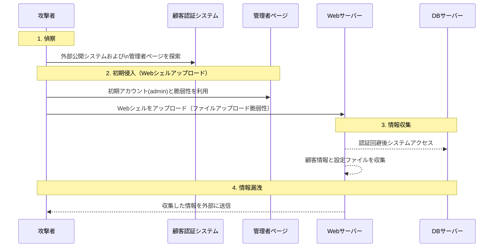

LG U+ の顧客認証システムが外部に公開されており、攻撃者によって**脆弱な管理者ページ**が特定されました。  
攻撃者は初期アカウントとファイルアップロードの脆弱性を悪用して**Webシェル**を設置し、これにより**約29万7千人**の顧客情報が漏洩しました。  
漏洩の時期は**DBの更新日である2018年6月15日前後**と推定されています。

<!--more-->
---

### 1. **偵察（Reconnaissance）**
#### 🔍 **脆弱性の把握と管理者ページの特定**
- **外部公開された顧客認証システム**に対してスキャンを実施。
- 初期アカウント名・パスワードが設定された**脆弱な管理者ページ**を確認。

---

### 2. **初期侵入（Webシェルアップロード）**
#### 🚨 **ファイルアップロード脆弱性の悪用**
- 管理者ページに**初期設定アカウント**（admin）でログイン。
- **ファイルアップロード機能**を通じて悪意あるスクリプト（Webシェル）のアップロードに成功。

---

### 3. **情報収集**
#### 🗄️ **システムアクセスとデータの取得**
- アップロードされたWebシェルを通じて**認証を回避**し、内部リソースにアクセス。
- **顧客情報、DB設定ファイル、システム設定情報**などを取得。

---

### 4. **情報漏洩**
#### 📤 **DBの直接照会とファイル転送**
- Webシェルを使って**DBに直接クエリを実行**して顧客情報を抽出、または  
- **サーバー内に保存されたファイル**を外部に送信し、漏洩を試みた。

### 5. **漏洩手法の概念図**

### 📑 参考資料
* [中央日報 記事](https://www.joongang.co.kr/article/25158501)  

