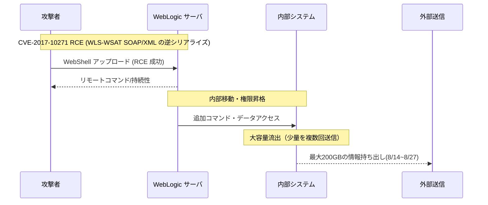

2025年 **8月14日 19:21** 最初の侵害が始まり15日まで活動が続き、調査の過程で**ウェブシェル(WebShell)のインストールが確認**されました。以後、金融当局合同調査の結果**総流出量は初期報告（1.7GB）を大きく上回る最大200GB**に訂正され、**297万人規模の顧客情報を含む**が公式化されました。 ([金融委員会][1])

> **核心:** 攻撃者は2017年に公開・パッチされた**Oracle WebLogicの脆弱性**(CVE-2017-10271)を悪用して**ウェブシェルをインストール**して長期間内部で活動しました。ロッテカードは**8月26日**でマルウェア感染を認知し、**9月1日**金融当局に申告しました。 ([次へ][2])

<!--more-->


---

# 1）初期浸透（初期アクセス）

## 🔓 WebLogic RCE(CVE-2017-10271) 悪用 *(MITRE: T1190)*

* 脆弱な**WLS-WSAT SOAP/XML逆シリアル化**パスを通じて、**リモートコード実行(RCE)**および**ウェブシェルアップロード**が行われました。パッチは**2017年10月にOracle CPU**で提供されましたが、そのアップデートがありませんでした。 ([次へ][2])

---

# 2) 内部掌握・持続性 (Persistence & Lateral Movement)

## 🚨 ウェブシェルベースの権限維持・拡張 *(MITRE: T1505.003, TA0003/TA0005)*

* Webシェルインストール後**持続性確保**と内部ナビゲーション・拡張が進められました。リアルタイム監視不十分で**2週間以上認知失敗**が報道されました。 ([次へ][2])

---

# 3) データ漏洩(Exfiltration)

## 📂最大**200GB**流出、**297万人**情報を含む

* 当初**1.7GB**と申告されたが、合同調査で**8.14～8.27期間中合計200GB**流出で確認。個人情報含む規模は**297万人**と集計されました。一部の顧客群（約28万人）は、決済情報関連の追加措置の対象です。 ([金融委員会][1])

> ロッテカードは流出方式について「**短くて小さな転送を繰り返して冶金冶金抜いた**」と説明しました。大容量シングル転送ではなく、**少量多重転送**パターンであったことを示唆しています。 ([傾向新聞][3])

---

# 4) 認知・報告及びフォローアップ

* **8月26日** マルウェア(ウェブシェル)感染初認知→ **8月31日**流出状況把握→ **9月1日** 金融当局の届出。 ([次へ][2])
*金融委員会/金監院は、**現場検査**とともに消費者保護対策（専用センター、再発行、全額補償など）を指示・点検しました。 ([金融委員会][1])

---

# 5) 攻撃概念図



---

# 6) なぜ**WAF**が妨げられなかったのか。

**WAFが「CVE-2017-10271（WLS-WSAT SOAP / XML逆シリアル化）」を妨げない一般的な理由**

1. **本文(POST body) 深層検査 未適用/制限**,
2. **SOAP/XML 解析・正規化部材**,
3. **シグネチャー未搭載/非アクティブ**,
4. **TLS 終端位置/バイパス経路問題**、
5. **運営上ホワイトリスト・例外**、
6. **WAS 未パッチ**が重複するためです。

この脆弱性は、`WLS-WSAT`の**`CoordinatorPortType`**などのエンドポイントで**`java.beans.XMLDecoder`ベースのデシリアライズ**がトリガされ、**URL/ヘッダールールだけでは見逃しやすい**タイプです。 ([金融委員会][1])

---

# 7) 運用仮説（疑わしい） — 「検出モード」・可視性欠乏

> **もしWAFが「検出モード(Detect-only)」で運用されたか、構造的に本文が見えない状態だった可能性**
> パブリックPoCレベルの10271トラフィックをデフォルトのルールとしてキャッチできるのにブロックがなかったら、
> **① 政策が遮断(Blocking)の代わりに検知専用で臨時(もしくは長期)運用**されたか、
> **② TLSがWAFの背後から終端(SSL Passthrough)**・**本文解析/正規化未適用(SOAP/XML)**・**WAF非経由バイパス経路**などで **検出自体が難しい構造**であった可能性があります。

**即時確認ポイント**：事故区間の**WAF遮断カウンタ/ログ(=0か)**、**ポリシーモード(Detect vs Block)**、**SSL可視化(サーバーキー/ブリッジ適用可否)**、**`/wls-wsat/*`に対する本文検査/正規化設定**、**LB・管理

---

# 8）（新規）**AI補助WAFバイパス**はどのように可能でしたか - 「可能性」の観点からの技術シナリオ

> **前提：**本事件で**AIの使用が「必須」だったという直接証拠は公開されない**。ただし、**可能な戦術**として、攻撃者が**LLM/エージェント**を補助手段として使用した**合理的シナリオ**は次のとおりです。

## 8-1.ペイロード自動変形・パージ（soap/xml）

* **文法ベースの生成(Grammar-guided):** SOAP Envelope/Namespace/WSDLスキーマに基づいて**合法的構造**を維持しながら**Action/Namespace/Prefix/Order**を数十～数百種類に自動変形。
* **正規表現バイパスパターン注入：** `java.beans.XMLDecoder`、 `WorkContextXmlInputAdapter`キーワードを**エンティティ/CDATA/Unicodeエスケープ/セグメント（=分割）**に変換。
* **ヘッダー/ボディ同時バリアント:** `Content-Type` ↔ `SOAPAction` 不一致、**ダブルエンコーディング**(URL-encoding in XML)、**圧縮(gzip/deflate)**、**chunked転送**などで**WAFの長さ/バイト/デコード限界**打撃。
* **境界値の狙い:** WAF **Request Body 検査限度** (例えば 8KB/1MB/8MB) 付近で **意味のないパディング/ノイズ** 挿入 → **部分検査/未検査誘導**。
* **オタム回避トークン化:** 正常サービスのSOAPAction・ネームスペース・スキーマを学習させて**「正常のように見える」**組み合わせでペイロード迷彩。

## 8-2.自動化された**フィードバックループ**

* **ブラックボックス最適化:** 応答コード(200/403/500)、ブロック理由文字列、遅延時間などを取り込み **強化学習/ベイジアン最適化**で **“バイパス成功率↑”** 組み合わせナビゲーション。
* **速度・隠蔽性調整:** **レートリミット/ウォームアップ**を適用して**検出しきい値**を超えないように自動調整(“Low-and-Slow”)。

## 8-3.インフラ・タイミング攻略

* **擾乱連携：** **DDoS・オタム誘発トラフィック**で **運営上遮断解除(Detect-only切替)** を **誘導**した後バイパスペイロード投入。
* **バイパス経路探索:** 管理網/直結経路/バックアップポートなど **WAF 非経由ルート**を自動スキャン・優先化。

> **要約:** **AIは「バイパスパターン生産性」と「探索自動化」にレバレッジ**を提供します。しかし、**未パッチ+構造的欠陥（本文未検査、TLS可視性欠乏、Detect-only）**だけでも**同じ結果**は十分に発生します。したがって、**原因究明と再発防止の1位は運営・構造の正常化**です。

---

# 9）なぜ200GBの大容量流出がわからなかったのですか？

多くの組織は、**要求（Request）中心**監視（WAF、API-GW、LB）のみを単独で運営しています。その結果、**応答(Response)本文/サイズ/エントロピー/パターン**に対する**DLP型観測**が空になり、**少量多重伝送**を見逃しやすいです。

* **応答本文未分析**: 機密データ(住民登録番号、CI、CVCなど) **キーワード/正規表現/エントロピー** 検出がなければ流出に気づきにくいです。
* **応答サイズ/レート未計測**: **セッション・URI・ユーザー単位**の **応答バイト累積、1分当たりの転送量、長期移動平均偏差**などの指標がなければ **“小さく、頻繁”**戦略を検出することは困難です。
* **出口(Egress)結合不足**: **プロキシ/ファイアウォール/DNS**と**ウェブ応答メトリック**を**相互相関**しないと、異常転送の“図”は見えません。
* **TLS内部終端**：WAFの前でTLSが終端されていない場合、応答内容は**可視化されません**（復号化位置設計問題）。

> PLURAは回答本文（DLP）・回答サイズ（行動指標）を一緒に見る方法を推奨します。
> 👉 [ウェブを介したデータ漏洩ハッキング対応の概論](https://blog.plura.io/ja/column/dlp/)

--- 
# 10）**即時措置**チェックリスト（10271特化・優先順位）

1. **エンドポイントセルフブロック/内部化** — **`/wls-wsat/*` フロントブロック**(特に `CoordinatorPortType`, `RegistrationPortType`), 可能であれば内部専用。
2. **パッチ・バージョン確認** — **2017-10 CPU以上**適用(10.3.6 / 12.1.3 / 12.2.1.xなど影響)。 **パッチが正解**。
3. **WAF 本体チェック フルオプション** — Request Body Inspection **アクティブ**, チェックバイト制限 **上向き(≥8–16MB)**, **gzip/deflate·chunked リリースチェック**, `Content-Type: text/xml, application/soap+xml` **強制解析**.
4. **カスタムルール（仮想パッチ）** - 正規化後**コアパターン検出**： `java.beans.XMLDecoder`、 `WorkContextXmlInputAdapter`、異常なSOAP Action /名前空間の組み合わせ。
5. **ホワイトリストは正のセキュリティモデル** — **通常スキーマ/メソッド**のみ許可、その他拒否。
6. **TLS終端をWAFに移動** — 復号後の検査、LB/iPlanet/OHSは**WAFの後ろ**に配置。
7. **検出のみ→遮断モード** — チューニング後の**Blocking**の切り替え、**誤検出処理手順**の確立。
8. **モニタリング指標の追加** — **応答本文DLPルール**、**セッション/ユーザー別応答累積バイト**、**1分あたりの伝送量スパイク**、**長期平均に対する偏差**、**`/wls-wsat/*`アクセスカウント**など。

---

# 11) 判定(要旨整理)

> **判定:** 現在(2025)基準で**LLM/エージェント組合せを活用したWAFバイパス用SOAP/XMLペイロードの自動生成・変形は十分に実現可能な攻撃力**です。本事件の浸透・流出は、**未パッチのWebLogic(CVE-2017-10271)**と**WAFの本文/正規化未適用・検出モード・TLS可視性欠乏**だけでも説明されるが、
> **AIがバイパスの組み合わせを迅速・大量に探索・最適化した可能性も高いです。再発防止のためには、**パッチガバナンス正規化**とともに**正規化・本文検査・遮断モード・TLSブリッジング**を前提とした**契約(ホワイトリスト)中心設計**および**応答DLP/サイズ観測常時化**が必要です。

👉 **注:** AI 補助 WAF バイパス: 攻撃自動化シナリオ — [https://blog.plura.io/ja/tech/ai-waf-bypass/](https://blog.plura.io/ja/tech/ai-waf-bypass/)

---

# 12) PLURA-XDRの対応策

* **ウェブシェルアップロード/実行リアルタイム検出・自動遮断** — 公開ウェブサービスの脆弱性の悪用・ウェブシェルアップロード/コマンド実行を捕捉すると、WAF/EDR連動で直ちに遮断・分離*(MITRE: T1190, T1505.003)*
* **権限上昇・非業務時間/異常ログイン・内部移動精密分析** — 管理者脱臭の兆候を早期検出し、アカウント・セッション・ホストを自動防御 *(MITRE: TA0004/TA0005/TA0008)*
* **応答本文(DLP)・応答サイズベースの流出早期検出** — 個人情報キーワード/エントロピー・ファイル指標と**セッション累積バイト/レート偏差**を組み合わせ、**少量多回送信**も早期摘発
* **ランサムウェア早期検出・自動遮断** — 大量暗号化/復旧妨害行為を識別してプロセス終了・分離・拡散遮断・証拠保存 *(MITRE: T1486, T1490)*

👉 **注:** PLURA DLP アプローチ — [https://blog.plura.io/ja/column/dlp/](https://blog.plura.io/ja/column/dlp/)

---

# 付録）テスト用（自己検証コマンド）

```bash
# 1) /wls-wsat ルートアクセスブロックの確認
curl -i https://target.example.com/wls-wsat/CoordinatorPortType

# 2) 疑わしいSOAPActionヘッダ
curl -i -H 'Content-Type: application/soap+xml' \
     -H 'SOAPAction: "CoordinatorPortType"' \
     --data '<soap:Envelope>...</soap:Envelope>' \
     https://target.example.com/path

# 3）XMLDecoder / WorkContext文字列を含む本文
curl -i -H 'Content-Type: text/xml' \
     --data '<!DOCTYPE x><x>java.beans.XMLDecoder</x>' \
     https://target.example.com/path
```

### 📺 一緒に見る
* [WebLogicの脆弱性（CVE-2017-10271）ハッキングデモ|リバースシェルからPLURA自動ブロックまで](https://youtu.be/blN1LoMGSAk)

---

## 参考資料

* **金融委員会ブリーフィング:** “8.14～8.27 合計200GB流出、ウェブシェル設置確認” (プレスリリース/ファイル) ([金融委員会][1])
* **傾向新聞:** “297万人・200GB確認、28万人高リスク” / “少量多回伝送説明” ([傾向新聞][4])
* **東亜日報・デジタルデイリーなど：**「初期届出の100倍」「ウェブシェル設置」後続報道 ([東亜日報][5])
* **マーブルショー:** 外国のハッカーに完全に穴を開けた韓国政府機関 ([マーブルショー][6])

---

[1]: https://www.fsc.go.kr/no010101/85319 "ロッテカード情報流出関連緊急対策会の開催"
[2]: https://v.daum.net/v/20250918190600587 "穴が開いたのにわからないし、どれくらい倒れたのか点滅…ロッテカードハッキング…"
[3]: https://www.khan.co.kr/article/202509181845001 "セキュリティ投資を増やしたところハッキング認知すらできなかったロッテカード…“被害額…"
[4]: https://www.khan.co.kr/article/202509182221005 "ロッテカード297万人情報打ち明けた"
[5]: https://www.donga.com/news/Economy/article/all/20250918/132411983/2 "[単独]ロッテカードハッキングデータ、最初の届出の100倍流出"
[6]: https://www.youtube.com/watch?v=4XwhXsUVHN0 "外国のハッカーに完全に開いた韓国政府機関"
