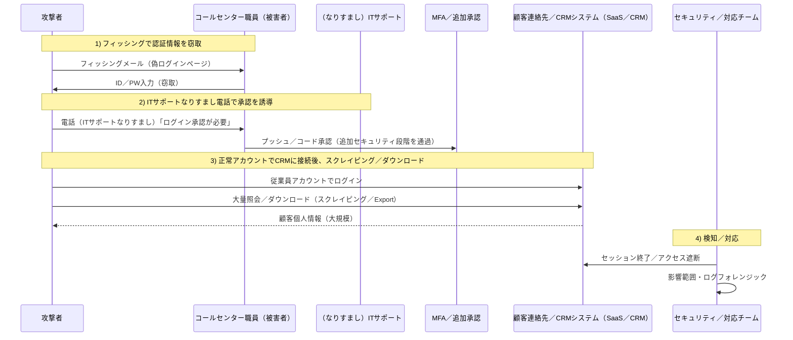

オランダの通信事業者 **Odido** が顧客個人情報の流出事案を公表しました。  
本件は **フィッシングメール + ITサポートなりすまし電話（vishing）** といった **ソーシャルエンジニアリング** により従業員アカウントが侵害され、  
その後 **顧客連絡先／CRMシステムから大量の照会・ダウンロード**（スクレイピング／収集）が発生したと報じられています。  
（攻撃主体は公的に確認されておらず、以下の比較は **「戦術（TTP）の類似性」** の観点です。）


<!--more-->

---

## 重要ポイントまとめ
- **公式確認（ODIDO）：** 顧客連絡先システム（Customer contact system）から個人情報が流出した可能性あり。『Mijn Odido』のログインパスワードは含まれていない。
- **報道内容（Cybernews など）：** コールセンター職員を標的としたフィッシング → ITサポートなりすまし電話で承認誘導 → CRM（一部メディアはSalesforceと報道）へアクセス → 大量ダウンロード。
- **なぜ規模が大きく見えるのに発覚が遅れるのか：** 正常アカウント（Valid Accounts）で「正常機能（照会／Export）」を実行すると、ログが **業務行為のように見える可能性がある**。
- **PLURAの観点（要約）：**
  - **PLURA-EDR：** 監査ポリシー基盤で異常兆候を検知し、端末にダウンロードされた顧客情報ファイル（例：CSV／XLSX／ZIPなど）を証拠として確認可能。
  - **PLURA-WAFデータ流出検知：** 応答本文（Resp-body）・応答サイズ（Resp-size）分析により、大規模データ流出を **リアルタイムで検知・遮断**。

---

## 事実関係の整理

### ✅ Odidoが公表した内容
- 本件は **顧客連絡先システム** に関連。
- 流出の可能性がある情報例：氏名、住所、携帯電話番号、メールアドレス、顧客番号、IBAN、生年月日、身分証（パスポート／運転免許証）番号および有効期限など。
- **流出に含まれていないと案内された項目：** 『Mijn Odido』パスワード、通話履歴、位置情報、請求／インボイス情報、身分証スキャン画像など。
- 「password_c」というフィールドが含まれる可能性があるが、これは **ログインパスワードではなく**、過去の電話問い合わせ時に使用された **チャレンジワード／コードワード**（追加質問の回答）であり、アカウントアクセスとは別物。

### 🟨 メディア・セキュリティ報道に基づく状況（推定）
- 攻撃者がコールセンター／CS職員を標的にフィッシングを実施し、ログイン情報を窃取。
- その後、IT部門職員を装って電話をかけ、「ログイン承認」などを誘導して追加のセキュリティ段階を通過。
- そのアクセスがCRM環境（一部報道ではSalesforceと記載）へつながったとの状況。

> ポイント  
> 本稿は「誰が実行したか（Attribution）」よりも、  
> **どのように実行されたか（TTP）** に焦点を当てます。

### 🗓️ タイムライン（公開情報基準）
- **2026-02-07 ～ 2026-02-08（週末）：** 顧客連絡先システムで不正アクセスが発生したと公表／報道。（Odido公表、SecurityWeek）
- **2026-02-07：** Odidoが侵害の疑いを確認し、調査に着手したと報道。（Reuters）
- **2026-02-12：** Odidoが顧客通知（Web告知およびメール）および規制当局（AP）への通知を実施したと報道／公表。（Odido公表、Reuters）

---

## 1. 偵察（Reconnaissance）
### 🔍 「人」と「業務フロー」を先に見る
- 攻撃者はコールセンター／CS組織を狙い、**従業員ログイン情報**を取得する戦略を選択します。  
  （CSはアカウントアクセス権限が広く、外部からの問い合わせに慣れているため、ソーシャルエンジニアリングの標的になりやすい。）
- 標的は通信インフラそのものではなく、顧客対応のための **顧客連絡先／CRMシステム** でした。

---

## 2. 初期侵入（Initial Access）
### 🚨 フィッシングメール + ITサポートなりすまし電話（vishing）
- **フィッシングメール** により、従業員にログイン情報の入力を誘導。
- 続いて **ITサポートなりすまし電話**（vishing）で「ログイン試行の承認」を誘導し、追加のセキュリティ段階を通過。

> ✅ ポイント  
> この段階は脆弱性（Exploit）よりも **信頼（人）** と **手続き（承認）** を攻撃します。  
> そのため、マルウェアが存在しない、または最小限である可能性があり、単一装置（ファイアウォール／AV）だけでは見逃されやすい。

---

## 3. 権限悪用および内部アクセス（Valid Accounts / Access）
### 🔑 正常アカウントで入ると、攻撃が「業務」のように見え始める
- 窃取された従業員アカウントで **顧客連絡先／CRMシステムに正規ログイン** すると、
  - アクセス自体が「正常ユーザー活動」として記録される可能性があり、
  - 照会／Export／ダウンロードが「顧客対応業務」のように見える可能性があります。

**MITRE ATT&CK** ではこれを **Valid Accounts**（T1078）として整理しています。  
つまり、「ハッキングはログインの瞬間に完了し」、その後は「権限に基づくデータアクセス」になる構造です。

---

## 3-1. Lapsus$手法との構造的類似性（TTP比較）
Odido事案のこの区間は、過去に **Lapsus$**（Microsoft: DEV-0537 → Strawberry Tempest）で繰り返し観測された攻撃フローと **構造が類似** しています。

### 共通点1）「人をだましてアカウントを取得（ソーシャルエンジニアリング）し、そのアカウントで内部／クラウドを開く」
- CSRB報告書は、Lapsus$および関連脅威グループが攻撃チェーン全体で **フィッシング・ビッシング（vishing）などのソーシャルエンジニアリングを広範に活用** したと説明しています。
- MITREは、Lapsus$が **ヘルプデスクに電話して正規ユーザーになりすます（impersonation）** パターンも整理しています。

### 共通点2）MFAを「技術的に突破」するよりも、「承認を得る」方式が繰り返される
- Odidoでは「ITサポートなりすまし電話による承認誘導」が重要な状況です。
- CSRB報告書でも「ソーシャルエンジニアリングで認証手続き（承認）を無効化」する流れが繰り返し言及されています。

### 共通点3）脆弱性エクスプロイトよりも「正規アクセス + データ窃取（Extortion）」に焦点
- MicrosoftはDEV-0537／Strawberry Tempestを「データ流出および破壊を狙う行為者」と説明し、
  「一部ソースコード窃取の主張」や「単一アカウント侵害」といった特性を公開しました。
- Lapsus$は従来型ランサムウェアのような「暗号化」よりも、**データ窃取後の恐喝（Extortion）** の比重が大きいと複数の報告書で説明されています。

> ✅ 結論（重要）  
> Odido事案がLapsus$によるものという証拠は公開されていません。  
> ただし、「**Valid Accountsベースのアクセス + ソーシャルエンジニアリング中心 + データ窃取**」という構造は、過去のLapsus$ TTPと類似しています。

---

## 3-2. （参考）Lapsus$で「類似パターン」が言及された代表事例
以下の事例は「同一グループ」を断定するためではなく、**なぜこの戦術が現実で繰り返されるのか** を示す参考です。

- **NVIDIA（2022年2～3月）**
  - NVIDIAは自社システム侵害後、**従業員資格情報および一部企業内部情報が流出** した事実に言及。
  - 複数メディアでLapsus$が責任を主張し、データ流出・恐喝の状況が報道されました。

- **Samsung（2022年3月）**
  - SamsungはGalaxy関連の **内部データ／ソースコード窃取** を確認。

- **Microsoft（2022年3月）**
  - Microsoftは「単一アカウントが侵害され限定的アクセスが発生し、一部ソースコードが窃取されたとの主張」に対する調査・対応内容を公表しました。

---

## 4. 情報収集（Collection）
### 🗄️ CRMから「フィールド単位の個人情報」を迅速に収集
- 顧客連絡先／CRMシステムで **大量照会・ダウンロード（スクレイピング／Export）** 形式で情報収集が行われたと報じられています。

### 流出の可能性がある項目（公式案内基準）
| 区分 | 項目（例） |
|---|---|
| 個人情報 | 氏名、住所／居住都市、携帯電話番号、メールアドレス、顧客番号 |
| 金融／識別 | IBAN（口座番号）、生年月日 |
| 身分証 | パスポート／運転免許証番号および有効期限 |

### 流出に含まれていないと案内された項目（公式）
| 区分 | 項目（例） |
|---|---|
| アカウント | Mijn Odidoログインパスワード |
| 通信／機微 | 通話履歴、位置情報 |
| 決済 | 請求／インボイス情報 |
| 文書 | 身分証スキャン画像 |

---

## 5. 情報流出（Exfiltration）
### 📤 大量流出でも「業務ダウンロード」のように見える可能性
- データの外部流出経路が「内部ネットワークでの大容量転送」ではなく、  
  **業務システム（顧客連絡先／CRM）からのダウンロード／Export** であった場合、  
  ネットワーク観点では「正常HTTPSトラフィック」に見える可能性があります。
- 結果として、「大規模」である事実は **事後ログ分析** または **外部通報／状況把握** によって遅れて確認される可能性があります。

---

## 6. 流出手法の概念図（シナリオ）



---

## 7. Odidoの公表された対応（要約）
- 不正アクセスを終了させ、調査（社内・社外専門家）および関係機関（AP）への通知を実施したと案内しています。
- 顧客に対しては、フィッシング／詐欺連絡（スミッシング・ボイスフィッシング）への注意を呼びかけました。

---

# PLURAの観点整理

## 8. PLURA-EDRの観点：監査ポリシー基盤の異常兆候検知と流出ファイルの確認
**PLURA-EDRの監査ポリシーにより異常兆候を検知し、ダウンロードされた顧客情報ファイルを確認できます。**

PLURA-EDRは次のフローを提供します。
1) **監査ポリシー設定を通じてログを生成**  
2) **Windowsイベントログ／Linux syslog・auditログを収集**  
3) 収集したログを **分析して異常兆候を検知**  
4) 検知ポリシーに基づき **遮断を実行**  

したがって、次のような「証拠ベースの確認」が可能です。
- 特定のアカウント／端末で **大量Export／ダウンロードが発生した時点** の行為を監査ログで追跡  
- 端末にダウンロードされた **顧客情報ファイル**（CSV／XLSX／ZIPなど）の生成・移動・圧縮の痕跡をログで確認  
- 事案対応過程で当該ファイルを **調査対象として確保し内容を確認（フォレンジック証拠）**  

---

## 9. PLURA-XDRの観点：「大規模流出」はなぜ見逃されやすいのか、そしてリアルタイム検知はどう可能か
**Webアプリケーションファイアウォールのデータ流出検知により、大容量データ流出をリアルタイムで検知できます。**

### 9-1) なぜ見逃されやすいのか
- **正常アカウント + 正常機能**（照会／Export）は「業務」と誤認されやすい。  
- ダウンロードがWeb応答（HTTPS）形式であれば、ネットワークのみを監視する体制では「正常トラフィック」に見える可能性があります。
- ログインイベントとダウンロードイベントが分離されている場合、単一イベントではリスクが過小評価される可能性があります。

### 9-2) PLURA-WAFデータ流出検知で「リアルタイム」に捉える方式
PLURA-WAF（ドキュメント基準）は次を提示しています。
- **応答本文（Resp-body）分析基盤のデータ流出検知**
- **リクエスト／レスポンスボディサイズ基盤の異常検知（Resp-size）**
- 流出検知時の **即時遮断**

つまり、「CRMから顧客情報が大量に返却される応答」のように、  
**『ダウンロード自体がWeb応答である瞬間』** をリアルタイムで検知・遮断するアプローチです。

---

## 参考資料（出典）
- Odido公式案内: https://www.odido.nl/veiligheid-eng
- Reuters（2026-02-12）: https://www.reuters.com/business/media-telecom/dutch-telecom-odido-hacked-6-million-accounts-affected-2026-02-12/
- Cybernews: https://cybernews.com/security/odido-hackers-phishing-attack/
- CPO Magazine: https://www.cpomagazine.com/cyber-security/cyber-attack-on-dutch-telecom-giant-odido-exposes-customer-data-of-6-2-million/
- SecurityWeek: https://www.securityweek.com/dutch-carrier-odido-discloses-data-breach-impacting-6-million/
- Microsoft Security Blog（DEV-0537 / Strawberry Tempest）: https://www.microsoft.com/en-us/security/blog/2022/03/22/dev-0537-criminal-actor-targeting-organizations-for-data-exfiltration-and-destruction/
- CSRB LAPSUS$ Report（2023）: https://www.cisa.gov/sites/default/files/2023-08/CSRB_Lapsus%24_508c.pdf
- MITRE ATT&CK（LAPSUS$ Group G1004）: https://attack.mitre.org/groups/G1004/
- MITRE ATT&CK（Valid Accounts T1078）: https://attack.mitre.org/techniques/T1078/
- NVIDIA関連（参考）: Reuters（2022-03-01） https://www.reuters.com/technology/nvidia-says-employee-company-information-leaked-online-after-cyber-attack-2022-03-01/ / The Verge（2022-03-01） https://www.theverge.com/2022/3/1/22957212/nvidia-confirms-hack-proprietary-information-lapsus
- Samsung関連（参考）: The Verge（2022-03-07） https://www.theverge.com/2022/3/7/22965220/samsung-hack-lapsus-galaxy-source-code-confirmed-nvidia
- PLURA-EDR文書: https://docs.plura.io/ja/agents/edr
- PLURA-WAF紹介: https://www.plura.io/ja/platform_waf.html
- PLURAデータ流出検知文書: https://docs.plura.io/ja/fn/comm/sdetection/breach
```
