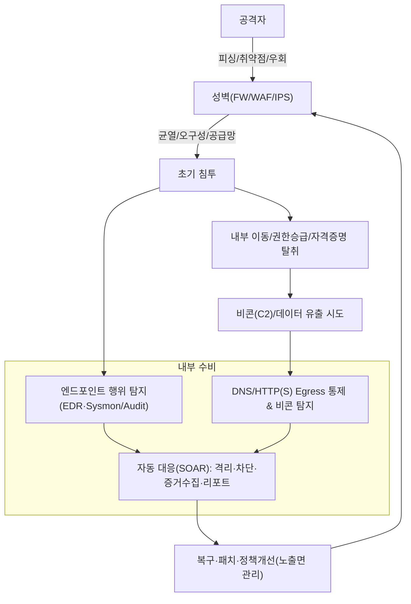

# 성을 지키는 사이버 방어 — ‘돌처럼 보낸 로봇’ 🤖

공격자는 **단 한 번만 성공**하면 되고,  
수비자는 **항상 완벽**해야 합니다.

겉에서 보면 성벽(방화벽·WAF·IPS)은 높고 두꺼워 보입니다.  
하지만 가까이 가보면 **보이지 않던 균열**이 있습니다.

적은 투석기로 돌을 던지는 척하지만,  
사실은 돌처럼 위장한 ‘로봇’을 성 안으로 떨어뜨립니다.

그 로봇은 성 안을 돌아다니며 길을 익히고  
권한을 훔치고, 옆 방으로 이동하고,  
바깥의 공성군과 **비콘**(C2 통신)으로 속삭입니다.

핵심은 ‘벽’이 아니라  
**벽을 넘은 뒤의 행위**입니다.

이 글은 공성전 비유를 통해

- 왜 기존 방어가 실패하는지
- 무엇을 바꿔야 하는지
- 실제로 무엇을 점검해야 하는지

를 실무 관점에서 정리합니다.

<!--more-->

---

## 1) 짧은 이야기: 성벽은 막았지만, 바닥의 물길은 열려 있었다

왕국은 금으로 장식된 성문,  
붉은 깃발,  
정기 점검 절차를 세웠습니다.

성벽은 높았고,  
경비병은 보고서를 잘 작성했고,  
출입 기록도 남아 있었습니다.

그런데 적은 정문으로 오지 않았습니다.

적은 **배수로**를 타고 들어왔고,  
아무도 눈여겨보지 않던 **작은 틈**을 따라 움직였고,  
보물창고는 이미 비어 있었습니다.

모두가 절차를 지켰지만,  
**현실의 공격 경로**는 절차서 안에 없었습니다.

> 교훈: **절차 준수 = 안전**이 아닙니다.  
> 실제 리스크는 종종  
> **보이지 않는 경로(노출면)** 와  
> **내부 행위의 연결성**에서 발생합니다.

---

## 2) 공성전 ↔ 사이버 방어 매핑표

| 공성 요소 | 사이버 현실(공격) | 수비 포인트(방어) |
|---|---|---|
| 성벽 | FW/WAF/IPS 우회, 포트·경로 스캐닝 | 기본은 필수. **규칙·패치·노출면 최소화** |
| 해자/바리케이드 | 동서(East-West) 네트워크 이동 | **Zero Trust·마이크로세그멘테이션** |
| 성문·열쇠 | 계정·권한·MFA | **최소권한·MFA·권한 상승 모니터링** |
| 투석기·노포 | DDoS·대량 인증 시도 | **레이트리밋·챌린지·WAF 룰** |
| 사다리·공성탑 | 피싱·드라이브바이·초기 거점 확보 | **메일 보안·EDR·애플리케이션 제어(Allowlist/WDAC)** |
| 갱도(굴착) | 공급망 취약점·웹셸 | **SBOM·무결성·행위 기반 탐지** |
| 간첩 | 자격증명 탈취·내부자 위협 | **UEBA·비정상 로그인·이상 패턴 탐지** |
| 역병 시체 | 웜·랜섬웨어 확산 | **EDR 격리·실행 차단·불변 백업** |
| 성벽의 균열 | 과오픈 보안그룹·오픈 버킷·낡은 VPN | **ASM(자산/노출면 관리)·드리프트 탐지** |
| 돌처럼 보낸 로봇 🤖 | 드로퍼·백도어·C2 비콘 | **엔드포인트 행위 탐지 + DNS/HTTP(S) Egress 통제 + 자동 대응** |

> 메모: 현대 TLS 환경, 특히 TLS 1.3과 PFS(Perfect Forward Secrecy)에서는  
> **네트워크 중간에서 내용을 수동 복호화해 보는 방식**이 점점 더 비현실적입니다.  
> 그래서 더 중요해지는 것이  
> **엔드포인트 행위 분석**, **비콘 탐지**, **목적지 기반 Egress 통제**입니다.

---

## 3) 왜 수비가 어려운가 — Defender’s Dilemma

사이버 방어가 어려운 이유는  
도구가 부족해서만이 아닙니다.  
수비 구조 자체가 공격자에게 불리하게 설계되어 있기 때문입니다.

### 1. 비대칭성
공격자는 한 번만 성공하면 됩니다.  
수비자는 매번 막아야 합니다.

### 2. 복잡성의 폭증
멀티클라우드, 컨테이너, IaC, 하이브리드 환경은  
보안 운영을 훨씬 더 어렵게 만듭니다.  
**시스템은 복잡할수록 실패하기 쉬워집니다.**

### 3. 가시성 저하
암호화, E2E, BYOD, SaaS 확산으로  
중간 구간에서 모든 것을 본다는 가정이 무너졌습니다.

### 4. 과거형 룰 의존
정적 시그니처와 고정 룰은  
변주된 공격과 정상 도구 악용에 취약합니다.

### 5. 운영 피로도
경보 홍수와 포인트 솔루션 난립은  
탐지보다 **IR 지연**을 만들어 냅니다.

---

## 4) ‘성벽 중심’ 방어가 실패하는 전형

방화벽, WAF, IPS는 여전히 중요합니다.  
문제는 그것이 **필요조건이지 충분조건은 아니라는 점**입니다.

### 1. 벽은 막아도, 안에서의 이동은 놓칠 수 있다
초기 침투를 완전히 막지 못했다면  
이후의 권한 탈취, 측면 이동, 비콘 통신을 잡아야 합니다.  
그런데 많은 조직은 여전히 벽 바깥만 보고 있습니다.

### 2. 우회 경로는 언제나 존재한다
대용량 업로드, Chunked 전송, Multipart 구조, 우회 인코딩, 압축, 분할 전송 등은  
검사 장비의 한계를 노리는 전형적인 방식입니다.

### 3. 암호화는 방어자에게도 장벽이 된다
이제 내용 자체를 네트워크 중간에서 보는 것은  
점점 더 어려워지고 있습니다.  
따라서 **목적지, 행위, 순서, 맥락**을 보는 방식으로 옮겨가야 합니다.

### 4. 운영이 분절되면 맥락이 끊긴다
WAF는 따로, EDR은 따로, SIEM은 따로, SOAR는 따로 있으면  
“누가, 어디서, 무엇을, 어떤 순서로 했는가”가 끊어집니다.

### 5. 튜닝 피로가 대응을 밀어낸다
룰 관리와 오탐 처리에 인력이 소모되면  
정작 중요한 자동 격리, 증거 수집, 사고 스토리 재구성은 뒤로 밀립니다.

---

## 5) 제대로 막는 법 — 원칙 6가지

이제 방어는  
“벽을 더 높이는 것”만으로는 부족합니다.  
핵심은 **성 안으로 들어온 뒤의 전투**를 준비하는 것입니다.

### 1️⃣ 연결된 다계층 방어
네트워크, 엔드포인트, 아이덴티티, 애플리케이션 로그를  
**하나의 흐름으로 연결**해야 합니다.

### 2️⃣ Zero Trust
성 전체를 하나로 믿는 것이 아니라  
**방과 복도 단위로 경계**를 세워야 합니다.  
마이크로세그멘테이션이 중요한 이유입니다.

### 3️⃣ 자격증명 탄력화
대부분의 침해 확산은 계정과 권한에서 시작됩니다.

- MFA
- 단기 토큰
- 권한 상승 감시
- 비정상 인증 패턴 탐지

가 반드시 필요합니다.

### 4️⃣ 비콘/Egress 통제
내부에 들어온 로봇은  
결국 밖과 통신해야 합니다.

- DNS 목적지 Allowlist
- HTTP(S) Egress 제어
- 신규·의심 도메인 탐지
- 비콘 주기성 분석

이 핵심입니다.

### 5️⃣ 즉응 IR
탐지만 하고 끝나면 늦습니다.

- 원클릭 격리
- 자동 차단
- 증거 수집
- 즉시 리포트
- SOAR 플레이북 연동

이 가능한 구조가 필요합니다.

### 6️⃣ 노출면 관리(ASM)
자산, 포트, 도메인, 클라우드 설정, 외부 노출 경로를  
**상시 인벤토리화**하고 드리프트를 감시해야 합니다.

---

## 6) 실행 체크리스트 — 현실 점검용

아래는 실제로 팀이 바로 점검할 수 있는 체크리스트입니다.

- [ ] 외부 노출 자산/포트/도메인에 대한 **자동 인벤토리 및 주기 스캔**이 있는가
- [ ] **EDR 행위 규칙 + Sysmon/Audit**를 통해 MITRE ATT&CK TTP를 추적하고 있는가
- [ ] **DNS/Egress Allowlist**를 운영하고, 신규·의심 목적지를 경고 또는 차단하고 있는가
- [ ] **비정상 로그인/권한 상승** 경보가 UEBA와 연결되어 있는가
- [ ] 해당 경보가 **자동 격리 플레이북**과 실제 연동되는가
- [ ] **대용량/Chunked/Multipart 업로드 우회** 정책을 재검토했고, 테스트로 검증했는가
- [ ] **불변(Immutable) 백업**과 격리 복구 리허설을 정례화했는가
- [ ] **SBOM/패치 파이프라인**과 공급망 취약점 SLA를 운영하고 있는가
- [ ] **MTTD/MTTR 대시보드**를 주간 단위로 점검하고 있는가
- [ ] 최근 오탐/미탐 사례를 리뷰해 **탐지 갭 리포트**로 관리하고 있는가
- [ ] **Table-top/Purple Team** 훈련으로 실제 시나리오를 반복 검증하고 있는가

---

## 7) 흐름 다이어그램 — ‘벽’ 이후의 전투

> 캡션: **현대의 방어전은 성벽이 아니라, 성 안에서 이어지는 행동의 연쇄를 얼마나 빨리 끊느냐에 달려 있습니다.**

---

## 8) 용어 정리

### IR(Incident Response)

침해사고 대응.  
탐지 이후의 **격리·차단·증거수집·보고·복구**까지 포함합니다.

### 비콘(Beacon)

내부의 악성 요소가 외부 C2와 **주기적으로 신호를 주고받는 행위**입니다.

### UEBA

사용자·엔티티 행위 기반 이상 탐지.  
정상 패턴과 다른 로그인, 이동, 권한 사용을 포착합니다.

### ASM(Attack Surface Management)

노출 자산·취약 경로를 **상시 발굴·관리**하는 체계입니다.

---

## 9) 현장 스케치(익명화)

### 사례 A — 임시 포트 하나가 연 초기 거점

외부 노출 경로가 없다고 판단했지만,  
배포 자동화 과정에서 잠시 열린 **임시 포트**가 초기 침투 경로가 되었습니다.

이후 공격자는

* 자격증명 탈취
* 측면 이동
* 외부 C2 비콘

으로 이어졌습니다.

이 사례는 MITRE ATT&CK 관점에서 보면  
초기 접근, 자격증명 접근, 측면 이동, C2의 전형적 흐름으로 볼 수 있습니다.  
실제 차단은 **EDR 행위 탐지 + DNS Egress 차단**에서 이루어졌습니다.

### 사례 B — 업로드 우회를 이용한 WAF 회피 시도

대용량 업로드 경로에서 일부 장비가  
**바디 임계 초과 시 부분 검사 또는 우회**하는 동작을 보였습니다.

공격자는 이를 이용해  
페이로드를 깊은 위치에 숨기고 WAF 우회를 시도했습니다.

이 경우 해결은 단순 룰 추가가 아니었습니다.

* 업로드 경로 재설계
* 검사 정책 분리
* 전송 구조 테스트 자동화
* 이후 호스트 측 행위 탐지 연계

까지 함께 이루어져야 했습니다.

---

## 10) 더 날카롭게 보려면 — TTP 관점에서 생각하기

이 글의 비유를 실무적으로 번역하면 결국 이런 질문으로 이어집니다.

* 초기 침투 이후 어떤 **ATT&CK TTP**가 이어질 수 있는가
* 내부 이동 전에 어떤 **권한 상승 징후**가 보이는가
* C2 이전에 어떤 **프로세스·네트워크 흐름**이 생기는가
* 단일 IoC가 아니라 **행동 체인**으로 보면 무엇이 달라지는가

즉, 방어는  
“이 파일이 악성인가?”보다  
“이 행위의 연쇄가 공격인가?”를 묻는 쪽으로 이동해야 합니다.

---

### 📖 함께 읽기

* [BPFDoor 계열 위협과 대응](https://blog.plura.io/ko/respond/bpfdoor/)
* [SKT 사건 가설과 교훈](https://blog.plura.io/ko/column/skt-hacking-hypothesis/)
* [정책 제안: 인증 제도와 보안의 괴리](https://blog.plura.io/ko/column/policy-proposal/)

---

## 마무리

오늘의 방어전은  
‘벽’이 아니라 ‘안’에서 벌어집니다.

성벽은 여전히 필요합니다.  
하지만 승패를 가르는 것은  
성을 넘은 뒤의 행위를 얼마나 빨리 보고,  
비콘을 얼마나 빨리 끊고,  
자동 대응으로 얼마나 신속히 봉쇄하느냐입니다.

**엔드포인트 행위 탐지, 비콘/Egress 통제, 자동 대응, 노출면 관리(ASM), 즉응 IR.**

이 다섯 가지가 연결될 때  
비로소 성 안으로 떨어진 ‘돌처럼 보낸 로봇’을  
멈출 수 있습니다.

공성전의 승패는  
가장 화려한 성벽이 아니라,  
**가장 먼저 균열을 발견하고 메우는 손**에 달려 있습니다.
---
