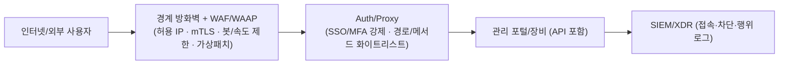

> **문제의 본질**
> “브라우저로 접속하는 **관리 포털**이 있다면, 그건 곧 **웹서버**입니다.”
> 그런데 많은 조직이 이를 인지하지 못한 채 **웹방화벽(WAF) 밖**에서 운영합니다. 결과는 반복되는 **최초 침입 지점**입니다.

<!--more-->

---

## 1) 왜 ‘웹서버인 줄 모르는 웹서버’가 위험한가

이름이 VPN, 계정권한관리, 코어망 시스템이라고 해도 **관리 포털은 대부분 HTTP(S)/REST 기반**입니다. 즉, **OWASP Top 10 류의 웹 취약점과 인증 우회, 세션 탈취, 봇·무차별 대입 공격의 위협**을 그대로 받습니다.
네트워크 방화벽만으로는 **HTTP 레이어의 공격 벡터**를 식별·차단하기 어렵습니다. **WAF** 없이는 ‘가상 패치(virtual patch)’도 적용하지 못합니다(예: F5 TMUI RCE에 대해 WAF가 즉시 차단 룰을 배포해 피해를 줄인 사례). ([The Cloudflare Blog][1])

---

## 2) 우리가 자주 놓치는 **대표 사례 3가지**

### 2-1. SSL VPN (웹 UI·API가 핵심)

지난 수년간 **Ivanti Connect Secure 등 SSL VPN의 중대 취약점**이 연이어 악용되며 초기 침입 경로가 됐습니다. 2025년에도 **원격 코드 실행**(CVE‑2025‑22457)이 실제 공격에 쓰여 **KEV**(활성 악용 목록)에 올랐습니다. **VPN** 장비라도, 웹 관리 포털을 노출한다면 ‘웹서버’로 다뤄야 합니다. ([TechRadar][2])

### 2-2. LGU+ **계정권한관리시스템(APPM)**

언론 보도에 따르면 **APPM 관련 서버를 둘러싼 침해 정황과 운영 이슈**가 2025년 국감에서 제기됐습니다. **특권계정·패스워드 관리 솔루션**은 본질적으로 **웹 포털·API**를 가지며, 뚫릴 경우 전산망 전체로의 확산 위험이 큽니다. 그러므로 **WAF 하에 두고** IP·MFA·속도 제한 등을 결합해야 합니다. ([MBC NEWS][3])

### 2-3. SK텔레콤 **HSS(Home Subscriber Server)**

정부 공식 조사 결과, 공격자는 **HSS 관리 서버**에 악성코드를 심어 장기간 잠복했고, 광범위한 USIM/인증 데이터 유출로 이어졌습니다. **핵심 요인은 관리 영역의 취약한 보안관제·자격증명 관리**였습니다. 텔코 코어망 자체는 DIAMETER 등 비웹 프로토콜을 쓰더라도, **운영·관리 노드는 대개 웹 기반**이므로 **WAF·접근통제·자격증명 보안**이 동시에 필요합니다. ([Ministry of Science and ICT][4])

---

## 3) “웹서버인지 모르는” 다른 자산들 — **추가 리스트**

| 분류                   | 대표 예시                               | 왜 웹서버인가 / 최근 이슈                                                                                                                                                   |
| -------------------- | ----------------------------------- | ----------------------------------------------------------------------------------------------------------------------------------------------------------------- |
| **ADC / VPN 게이트웨이**  | Citrix NetScaler ADC/Gateway        | 2025년 **CitrixBleed 2 (CVE‑2025‑5777)** 등 **비인가 세션 탈취**·메모리 오버리드 취약점이 **활성 악용**. 관리/AAA·Gateway가 모두 표적. **반드시 WAF 전면 배치** 및 세션 보호 필요. ([TechRadar][5])            |
| **백업·DR 콘솔**         | Commvault Command Center, Veeam B&R | 2025년 **Commvault RCE**(CVE‑2025‑34028) **활성 악용** 경고. Veeam B&R도 과거 **무인증 자격증명 탈취**(CVE‑2023‑27532)로 대규모 랜섬웨어 초기 침입에 남용. **관리 포털은 전형적인 웹서버**입니다. ([Greenbone][6]) |
| **UEM/MDM(단말관리)**    | Ivanti EPMM(구 MobileIron) 등         | 2025년 **EPMM 인증 우회→RCE 체인**이 **실제 공격에 사용**. 모바일·노트북 관리 포털/API는 **WAF+속도 제한+봇 차단**이 필수. ([TechRadar][7])                                                           |
| **가상화 컨트롤 플레인**      | VMware vCenter                      | vCenter **웹 클라이언트 플러그인 RCE**(예: CVE‑2021‑21972/21985)가 반복 악용. **운영 핵심부**(하이퍼바이저 제어)라 더 위험. **WAF·mTLS·IP 화이트리스트** 권장. ([Support Portal][8])                       |
| **L7 스위치/ADC 관리 UI** | F5 BIG‑IP TMUI                      | **TMUI RCE**(CVE‑2020‑5902)가 전 세계적으로 악용된 대표 사례. **WAF가 가상 패치로 즉시 차단 룰 배포** 가능. ([CISA][9])                                                                        |

> **요점**: **브라우저로 여는 관리 포털/REST API = 웹서버**입니다. 이름이 무엇이든 **WAF 관할로 편입**하세요.

---

## 4) **WAF는 ‘선택’이 아니라 ‘필수’입니다**

**WAF 없이** 운영되는 관리 포털은 다음을 방어하지 못합니다:

* **가상 패치**: 패치가 늦어도 **시그니처/룰 즉시 차단**으로 영업 중단 없이 위험 완화. ([The Cloudflare Blog][1])
* **봇/무차별 대입 차단**: 로그인·API 엔드포인트에 **속도 제한/행위 기반 차단**.
* **세션·쿠키 보호**: 세션 고정/하이재킹 탐지, **JWT·헤더 검증**.
* **스키마/메서드 화이트리스트**: **허용된 경로·메서드·콘텐트타입만 통과**.
* **공격 페이로드 탐지**: 인젝션·LFI/RFI·디렉터리 트래버설·XSS·XXE 등 **애플리케이션 계층 공격**.
* **IP·지리적 제어**: **허용국/허용망만** 접근하도록 1차 차단.
* **API 보호(WAAP)**: **관리형 API도 WAF 정책으로 스키마 검사·키/토큰 검증**.

> **반드시 기억하세요.**
> **관리 포털/콘솔/웹 UI/관리 API는 전부 WAF 뒤에 있어야 합니다.**

---

## 5) **표준 대처 아키텍처** (관리 포털 보호)

* **WAF 앞단**: **고정 IP 화이트리스트**가 가능하면 반드시 적용.
* **WAF 정책**: **“관리 전용” 긍정 모델**(허용 경로·메서드·MIME만 통과) + **속도 제한**.
* **mTLS/Device Trust**: 관리자 단말 인증서·단말 인감(EDR 건강상태)까지 확인.
* **내부 전용 포털**이어도 **내부 WAF**(리버스 프록시형)로 감싸세요.

---

## 6) 즉시 적용 체크리스트 (운영팀용)

| No | 점검 항목                                                                                 | 완료 |
| -- | ------------------------------------------------------------------------------------- | -- |
| 1  | **관리 포털·API ‘전수 식별’**: SSL VPN, APPM, HSS 관리노드, ADC, 백업, vCenter 등 **브라우저 접속 대상** 목록화 | ☐  |
| 2  | **WAF 뒤로 재배치**: *모든* 관리 포털/콘솔은 **WAF/WAAP 하에** (내부면 내부 WAF)                           | ☐  |
| 3  | **허용 IP 최소화**: 관리자 고정망/점프호스트만 허용. 재택은 전용 고정 회선+IAM 승인                                 | ☐  |
| 4  | **MFA·SSO 연동**: 관리자 SSO·MFA를 WAF·역프록시 레벨에서 강제                                         | ☐  |
| 5  | **속도 제한/봇 차단**: 로그인·/api/* 엔드포인트에 **분당 요청·동시 세션 제한**                                  | ☐  |
| 6  | **정기 가상 패치 운영**: 신규 CVE 공지 시 즉시 **WAF 룰 업데이트→검증→차단**                                  | ☐  |
| 7  | **세션·쿠키 보안**: Secure/HttpOnly/SameSite, 토큰 수명, 기기 바인딩                                 | ☐  |
| 8  | **로깅·탐지**: 차단 이벤트, 인증 실패 폭주, 비정상 메서드/경로 탐지 알림                                         | ☐  |
| 9  | **취약점/구성 점검**: vCenter/NetScaler/백업콘솔/SSL VPN **주기 패치**                               | ☐  |
| 10 | **비상차단 절차**: 위험 징후 시 **WAF 레벨 전체 차단/우회 우선순위** 수립                                      | ☐  |

---

## 7) 실제 사고·취약점이 말해주는 것

* **SSL VPN**: 2025년 **Ivanti ICS RCE**가 실제 악용, KEV 등재. **엣지 장비의 웹 UI**가 **첫 관문**이 됨. ([TechRadar][2])
* **APPM(계정권한관리)**: **특권관리 포털 침해 시 전사 권한 탈취**로 비화 가능. 2025년 **LGU+ APPM 관련 이슈**가 공개 보도로 확산. **웹 포털 보호(=WAF)** 없인 위험. ([MBC NEWS][3])
* **HSS**: 정부 조사에서 **HSS 관리 서버** 장기 잠복·유출이 확인됨. **관리 영역 보안 부실**이 핵심 요인이었음. ([Ministry of Science and ICT][4])
* **ADC/Gateway**: 2025년 **Citrix NetScaler**의 **CitrixBleed 2**가 **활성 악용**. **관리/AAA·Gateway 모두 웹 표면**. ([TechRadar][5])
* **백업 콘솔**: 2025년 **Commvault RCE 활성 악용 경보**, 백업 체계가 **랜섬웨어의 최우선 표적**으로 재확인. ([Greenbone][6])

---

## 8) 운영 팁: **“관리 전용 WAF 정책”** 이렇게 잡으세요

* **허용 경로만**: `/login`, `/api/admin/*`, `/healthz` 등 **화이트리스트**.
* **허용 메서드만**: `GET, POST` 중심, `PUT/DELETE/PATCH`는 **경로별 예외**만.
* **콘텐트 타입**: `application/json`, `multipart/form-data` 등 **필요 최소**.
* **속도 제한**: 로그인·비밀번호 재설정·토큰 발급은 **분당/시간당 제한**.
* **봇 차단**: 헤더 지문·자바스크립트 챌린지·IP 평판 결합.
* **세션 보호**: 재사용/동시 로그인 제한, 장시간 유휴 세션 종료.
* **mTLS**: 관리자 단말 인증서 없으면 **사전 차단**.
* **가상 패치**: 신규 CVE 공지 시 **룰 패키지 즉시 적용→모니터→차단**. (실제 WAF가 긴급 룰로 RCE 공격을 막은 사례 다수) ([The Cloudflare Blog][1])

---

## 9) 결론

* **브라우저가 열리면 웹서버**입니다. 이름이 **VPN·APPM·HSS·ADC·백업콘솔·vCenter**여도 예외가 아닙니다.
* 이들 자산을 **WAF 밖**에 두는 것은 ‘**패치 공백**’과 ‘**봇·무차별 대입·API 악용**’을 그대로 허용하는 것입니다.
* **따라서, 관리 포털/관리 API는 반드시 WAF 뒤**에 두고, **허용 IP·MFA·속도 제한·가상 패치**로 **다중 방어**를 구성해야 합니다.

> **한 문장 요약**: *“관리 포털은 전부 WAF로 감싸라.”*
> 이 기본만 지켜도 **대부분의 초기 침투를 입구에서 차단**할 수 있습니다.

---

### 📖 함께 읽기 (사건·권고)

* **Ivanti Connect Secure RCE(CVE‑2025‑22457) 악용** 요약 및 경고. ([TechRadar][2])
* **CISA KEV**: Ivanti ICS 취약점 추가(활성 악용). ([Cybersecurity Dive][10])
* **[정부 발표] SKT HSS 침해 최종 조사 결과**(관리 서버 장기 잠복·자격증명 부실). ([Ministry of Science and ICT][4])
* **LGU+ APPM 관련 보도**(특권관리 시스템 침해 의혹 및 운영 이슈). ([MBC NEWS][3])
* **Citrix NetScaler ‘CitrixBleed 2’ 활성 악용 경보**. ([TechRadar][5])

### 🌟 PLURA‑Blog

* [SKT USIM 해킹 사건 정리 – 원인, 영향, 대응](https://blog.plura.io/en/column/leak_of_skt_usim/) ([Plura Blog][11])

---

> (참고) 본 글은 **운영 관점**의 최소 보호 체계를 다룹니다. **취약점 관리·자격증명 보안·로그 정밀 분석**(XDR/SIEM)을 결합하면, **탐지·대응**의 성숙도를 한 단계 더 끌어올릴 수 있습니다.

[1]: https://blog.cloudflare.com/cve-2020-5902-helping-to-protect-against-the-f5-tmui-rce-vulnerability/?utm_source=chatgpt.com "Helping to protect against the F5 TMUI RCE vulnerability"
[2]: https://www.techradar.com/pro/security/ivanti-patches-serious-connect-secure-flaw?utm_source=chatgpt.com "Ivanti patches serious Connect Secure flaw"
[3]: https://imnews.imbc.com/replay/2025/nwdesk/article/6767087_36799.html?utm_source=chatgpt.com "[단독] 해킹 당한 사실 숨기려고?‥LG유플러스도 서버 무단 ..."
[4]: https://www.msit.go.kr/eng/bbs/view.do%3Bjsessionid%3DA2aV3fQR4zqYv-G8cJpkDgnrgrACDgREHvXAqG5l.AP_msit_2?bbsSeqNo=42&mId=4&mPid=2&nttSeqNo=1139&sCode=eng&utm_source=chatgpt.com "MSIT Releases Final Investigation Results on SK Telecom ..."
[5]: https://www.techradar.com/pro/security/cisa-warns-hackers-are-actively-exploiting-critical-citrixbleed-2?utm_source=chatgpt.com "CISA warns hackers are actively exploiting critical CitrixBleed 2"
[6]: https://www.greenbone.net/en/blog/cve-2025-34028-commvault-command-center-actively-exploited-for-rce/?utm_source=chatgpt.com "CVE-2025-34028: Commvault Command Center Actively ..."
[7]: https://www.techradar.com/pro/security/cisa-flags-some-more-serious-ivanti-software-flaws-so-patch-now?utm_source=chatgpt.com "CISA flags some more serious Ivanti software flaws, so patch now"
[8]: https://support.broadcom.com/web/ecx/support-content-notification/-/external/content/SecurityAdvisories/0/23599?utm_source=chatgpt.com "VMSA-2021-0002:VMware ESXi and vCenter Server updates ..."
[9]: https://www.cisa.gov/news-events/cybersecurity-advisories/aa20-206a?utm_source=chatgpt.com "Threat Actor Exploitation of F5 BIG-IP CVE-2020-5902"
[10]: https://www.cybersecuritydive.com/news/cisa-ivanti-connect-secure-vulnerability-kev/744603/?utm_source=chatgpt.com "CISA adds Ivanti Connect Secure vulnerability to KEV catalog"
[11]: https://blog.plura.io/en/column/leak_of_skt_usim/?utm_source=chatgpt.com "Comprehensive Summary of the SKT USIM Hacking Incident"
