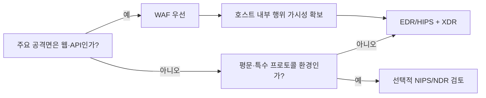

⛑️ **중소·중견 기업 환경**, 그리고 일부 **대기업의 일반 업무망 환경**을 전제로,  
네트워크 기반 보안 솔루션인 **NIPS**(Network-based Intrusion Prevention System)와 **NDR**(Network Detection & Response)이 “과연 꼭 필요한가?”라는 질문을 다시 살펴봅니다.

결론부터 말하면,  
**규제, 대규모 평문망, OT/ICS 같은 예외적 조건이 아니라면**  
굳이 NIPS/NDR까지 도입하지 않아도  
**WAF + EDR/HIPS + XDR** 조합만으로도 충분히 높은 수준의 실질적 방어력을 확보할 수 있습니다.

<!--more-->

---

## 먼저 요점만 정리하면

- 일반 기업의 외부 노출 공격면은 대부분 **웹·API** 중심입니다.
- SSH, RDP, VPN, DB 연결 등은 이미 **암호화**되어 있거나 **접근 통제**가 우선입니다.
- 이런 환경에서 NIPS/NDR은 종종 **가시성보다 비용과 운영 부담**을 더 키웁니다.
- 반대로 **WAF + EDR/HIPS + XDR**은  
  웹 본문, 호스트 행위, 계정 로그를 함께 보면서 더 직접적인 방어가 가능합니다.
- 다만 **규제, OT/ICS, 평문 프로토콜, 대규모 동서(East-West) 평문 트래픽**이 많은 환경은 예외입니다.

---

## 1. 일반 기업의 전형적인 보안 환경

많은 **중소·중견 기업**, 그리고 적지 않은 **대기업의 일반 업무망**은 대체로 다음과 같은 특성을 가집니다.

### 1) 강제적 규제 요건이 제한적
금융·공공·국방처럼 NIPS/NDR을 명시적으로 요구하는 환경이 아니라면,  
네트워크 장비의 존재 자체보다 **실제 방어 효과와 운영 가능성**이 더 중요합니다.

### 2) 외부 공격면의 중심은 웹·API
현장 체감상 일반 기업의 실제 공격 표면은 대부분 다음에 집중됩니다.

- 웹 서비스
- 관리자 페이지
- API
- 파일 업로드
- 인증/세션
- 계정 탈취

즉, 공격자는 먼저 **HTTP/HTTPS** 기반 자산을 노리는 경우가 많습니다.

### 3) 비웹 프로토콜은 암호화 또는 강한 접근 통제 하에 있음
SSH, RDP, VPN, DB 연결 등은 대개 다음과 같이 운영됩니다.

- TLS/SSL 등 암호화
- VPN 경유
- 화이트리스트
- MFA
- 점프호스트

이 경우 NIPS/NDR이 네트워크 중간에서 볼 수 있는 정보는 제한적입니다.

### 4) 전담 운영 인력이 부족
중소·중견 기업은 물론, 일부 대기업도 실제로는  
NIPS/NDR의 오탐 튜닝, SSL 복호화, 예외 관리, SIEM/SOAR 연계를  
지속적으로 운영할 인력이 부족한 경우가 많습니다.

---

## 2. 일반 환경 vs 예외 환경, 무엇이 다른가?

| 항목 | 일반 기업 환경 | NIPS/NDR 검토가 필요한 예외 환경 |
|---|---|---|
| 주요 공격면 | 웹·API 중심 | 대규모 동서(East-West) 평문 트래픽 |
| 트래픽 특성 | HTTPS, VPN, SSH, RDP 등 암호화 중심 | 산업/레거시 평문 프로토콜 존재 |
| 규제 요구 | 명시적 요구 약함 | 금융·공공·국방·특정 고객 요구 |
| 운영 인력 | 제한적 | 전담 보안 운영 인력 충분 |
| 권장 구조 | WAF + EDR/HIPS + XDR | 선택적 NIPS/NDR + WAF + EDR/XDR |
| ROI | NIPS/NDR 도입 시 낮을 수 있음 | 특정 영역에서 의미 있을 수 있음 |

즉,  
**NIPS/NDR은 기본값이 아니라 예외적 조건에서 검토할 장비**에 가깝습니다.

---

## 3. NIPS/NDR을 굳이 도입하지 않아도 되는 이유

### (1) 웹 공격은 WAF가 가장 직접적으로 막습니다
웹 기반 공격은  
SQL Injection, XSS, 파일 업로드 악용, 인증 우회, API 악용처럼  
**HTTP/HTTPS 요청 자체를 분석해야** 제대로 보입니다.

이 영역에서는  
**WAF가 가장 직접적이고 효과적인 보안 수단**입니다.

👍 [WAF가 아직 없다면 지금 즉시 도입해야 합니다](https://blog.plura.io/ko/column/web-application-firewall-is-like-a-seatbelt/)  
👍 [PLURA-WAF 서비스 소개](https://www.plura.io/platform/waf)

### (2) NIPS/NDR이 보려는 트래픽은 대부분 암호화되어 있습니다
요즘 네트워크에서 주요 프로토콜은 대부분 암호화됩니다.

- HTTPS / TLS 1.3
- SSH
- RDP
- VPN
- 각종 SaaS API
- HTTP/3 QUIC

이 구조에서는 NIPS/NDR이  
패턴은 일부 볼 수 있어도 **실제 본문(페이로드)** 은 보기 어렵습니다.

즉,  
네트워크 장비는 점점 더 **정황**을 보고,  
WAF와 호스트 보안은 **실제 내용과 행위**를 보게 됩니다.

### (3) 운영 부담이 생각보다 큽니다
NIPS/NDR은 단순 장비 비용만의 문제가 아닙니다.

- 정책 설계
- 오탐 튜닝
- SSL 복호화
- 예외 관리
- SIEM 연계
- SOAR 연동
- 인력 교육

까지 포함하면  
중소·중견 기업은 물론, 일부 대기업에도  
**과도한 운영 부담**이 될 수 있습니다.

즉,

> 보안 장비를 더 넣는 것이  
> 항상 더 강한 보안을 뜻하지는 않습니다.

오히려 **복잡성 증가가 보안 수준 저하**로 이어질 수 있습니다.

---

## 4. 대기업도 항상 예외는 아닙니다

제목에 “심지어 대기업에서도”라고 쓴 이유가 여기 있습니다.

대기업이라고 해서 무조건 NIPS/NDR이 필요한 것은 아닙니다.

대기업도 다음 조건이라면  
굳이 네트워크 기반 장비를 확대하지 않아도 되는 경우가 많습니다.

- 외부 노출 자산의 대부분이 웹·API
- 내부망도 TLS, VPN, Zero Trust 중심
- SSH/RDP는 강한 접근 통제 하에 운영
- 평문 프로토콜이 많지 않음
- 복잡망이더라도 실제 공격 표면은 웹과 계정에 집중됨

즉,  
대기업의 모든 환경이 “NDR이 꼭 필요한 복잡망”은 아닙니다.  
**복잡해 보인다고 다 평문망은 아니며, 암호화가 강한 구조라면 NIPS/NDR의 실효성은 여전히 제한적**입니다.

---

## 5. NIPS/NDR이 필요한 예외적 상황

그럼에도 다음 환경에서는 의미가 있을 수 있습니다.

### (1) 규제 또는 고객 요구
금융권, 군사, 공공, 특정 대형 고객 납품 환경에서는  
네트워크 기반 탐지/차단 체계가 **제도적으로 요구**될 수 있습니다.

### (2) 매우 크고 평문이 남아 있는 내부망
수천 대 이상의 서버와 다양한 서비스가 혼재하고,  
여전히 **평문 프로토콜**이 많다면  
네트워크 레벨 감시가 유의미할 수 있습니다.

### (3) OT/ICS / 산업제어 환경
SCADA/ICS, 일부 레거시 프로토콜처럼  
평문이거나 에이전트 설치가 어려운 환경에서는  
NIPS/NDR 또는 전용 센서가 고려될 수 있습니다.

다만 이 경우에도  
“무조건 도입”이 아니라  
**정말 네트워크에서만 볼 수 있는가?** 를 먼저 따져야 합니다.

---

## 6. 현실적인 기본값은 무엇인가?

일반 환경에서의 현실적인 기본값은 다음입니다.

### ✅ WAF
- 웹·API 공격 차단
- 요청·응답 기반 분석
- 관리자 페이지, 업로드, 인증, 세션 보호

### ✅ EDR / HIPS
- 호스트 내부 행위 감시
- 프로세스, 파일, 메모리, 권한 상승 탐지
- 암호화가 해제된 지점에서 실제 공격 행위 확인

### ✅ XDR
- 웹, 호스트, 계정, 자산 로그를 연결
- 개별 이벤트가 아니라 **공격 흐름 전체**를 파악
- 조사와 대응의 운영 효율을 높임

이 조합이 중요한 이유는  
네트워크 장비가 보기 어려운 것을  
**웹 본문 + 호스트 행위 + 계정 로그**에서 볼 수 있기 때문입니다.

---

## 7. PLURA-XDR은 여기서 어떤 역할을 하나?

PLURA-XDR은  
단순히 “WAF + EDR를 같이 쓴다”는 수준을 넘어,  
다음 데이터를 함께 연결해 분석할 수 있다는 점이 핵심입니다.

- **웹 Request / Response 본문**
- **운영체제 감사 로그**
- **호스트 행위**
- **계정·권한 이벤트**
- **WAF 차단/허용 이력**

즉, NIPS/NDR처럼  
네트워크에서 암호화된 정황만 보는 것이 아니라,

> **공격이 실제로 드러나는 지점의 내용과 행위를 함께 본다**는 점에서  
> 훨씬 더 직접적인 가시성을 제공합니다.

또한 중소·중견 기업 입장에서는  
복잡한 네트워크 기반 장비를 따로 운영하는 대신,  
**실제 공격 표면에 집중한 통합 구조**로 운영 부담을 줄일 수 있습니다.

---

## 8. 선택과 집중 체크리스트

아래 질문에 대부분 “예”라면,  
NIPS/NDR보다 **WAF + EDR/HIPS + XDR**을 먼저 고려하는 것이 더 합리적입니다.

- 외부 노출 공격면이 대부분 **웹·API** 인가?
- SSH/RDP/VPN은 이미 **MFA·화이트리스트·점프호스트**로 통제 중인가?
- 내부 주요 통신이 대부분 **암호화**되어 있는가?
- NIPS/NDR을 운영할 **전담 인력**이 부족한가?
- 규제나 고객 요구로 **반드시 NIPS/NDR이 필요한 상황은 아닌가?**
- OT/ICS 같은 **평문 특수 환경**이 아닌가?
- 보안 예산을 더 투입한다면, 먼저 **웹·호스트·계정 가시성 강화**가 필요한가?

이 질문에 “예”가 많을수록,  
NIPS/NDR은 **필수 장비**가 아니라  
**불필요한 복잡성**이 될 가능성이 높습니다.

---

## 9. 결정 흐름을 단순하게 보면

핵심은  
“네트워크 보안 장비를 더 넣을까?”가 아니라,

> **실제 공격이 어디서 가장 먼저 드러나는가**를 기준으로  
> 장비를 선택해야 한다는 점입니다.

---

## 10. 결론: 특수 환경이 아니라면, NIPS/NDR은 ‘굳이’입니다

1. **WAF + EDR/HIPS + XDR만으로도 충분한 시나리오가 많습니다**  
   일반 기업 환경에서는 외부 공격면의 대부분이 웹·API이며,  
   내부 침해 대응은 호스트와 계정 로그가 더 직접적입니다.

2. **NIPS/NDR은 예외적 상황을 위한 선택지입니다**  
   규제, 대규모 평문망, OT/ICS, 특수 프로토콜 환경이 아니라면  
   투자 대비 효과가 낮거나 운영 부담이 더 클 수 있습니다.

3. **대기업도 무조건 예외는 아닙니다**  
   복잡한 조직이라고 해서 항상 네트워크 기반 분석이 더 필요한 것은 아닙니다.  
   실제 공격면이 웹·API·계정에 집중된다면 판단은 달라집니다.

4. **핵심은 선택과 집중입니다**  
   필요한 것 이상을 덧붙이면  
   운영 포인트가 늘고, 오히려 허점이 생길 수 있습니다.

> **비유적으로**,  
> 장화(**WAF**)만으로도 빗길을 충분히 건널 수 있는데,  
> 굳이 키높이 깔창(**NIPS/NDR**)까지 덧대면  
> 비용과 불편만 늘어날 수 있습니다.  
> **제대로 걸을 수나 있을까요?**

---

## ✍️ 최종 정리

* **WAF + 호스트 보안 + XDR**만으로 대부분의 일반 기업 공격을 방어할 수 있습니다.
* **특수한 환경**(규제, 평문망, OT/ICS 등)이 아니라면, NIPS/NDR은 불필요할 수 있습니다.
* **대기업**도 예외가 아닙니다. 실제 공격 표면이 어디에 있는지 먼저 봐야 합니다.
* **PLURA-XDR**은 웹 본문 + 호스트 행위 + 계정 로그를 함께 분석해  
  네트워크 장비의 한계를 실질적으로 보완할 수 있습니다.
* **오버엔지니어링은 해악**입니다.  
  필요한 것 이상을 붙이면, 보안은 더 강해지기보다 더 복잡해질 수 있습니다.

### 📖 함께 읽기

* [IDS/IPS, 정말 코어 보안일까?](https://blog.plura.io/ko/tech/why_supplementary_security_services-ips/)
* [NDR의 한계: 해결 불가능한 미션](https://blog.plura.io/ko/column/limitations_of_ndr/)
* [IPS와 NDR 차이와 한계](https://blog.plura.io/ko/column/ips_vs_ndr/)
* [WAF vs IPS vs UTM: 웹 공격 최적의 방어 솔루션 선택하기](https://blog.plura.io/ko/column/waf_ips_utm_comparison/)
* [IPS의 진화와 보안 환경의 변화](https://blog.plura.io/ko/column/ips_classification/)
* [침입차단시스템(IPS) 이해하기](https://blog.plura.io/ko/column/ips_understanding/)

---
