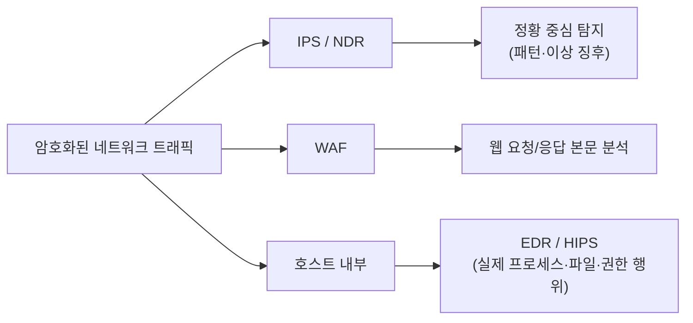

🔍 **IPS**(Intrusion Prevention System)와 **NDR**(Network Detection and Response)은 모두 **네트워크 보안** 범주에 속합니다.  
하지만 현대의 보안 환경, 특히 **TLS/SSL 암호화가 기본이 된 환경**에서는 이들 솔루션이 **제 기능을 충분히 발휘하기 어렵고**, 이미 **WAF**(Web Application Firewall)를 도입한 상황이라면 “굳이 IPS·NDR을 추가로 운영해야 하는가?”라는 질문이 자연스럽게 생깁니다.

이 글은 IPS·NDR의 목적과 한계를 정리하고,  
**WAF가 있는 상황에서 IPS·NDR이 과연 필수인지**,  
그리고 **어떤 대안이 더 실질적인가**를 설명합니다.

<!--more-->

---

## 먼저 요점만 정리하면

- **IPS**는 알려진 공격 패턴을 네트워크 경계에서 빠르게 차단하는 데 강합니다.
- **NDR**은 내부 네트워크에서 이상 행위를 탐지하려고 하지만, 암호화 환경에서 근본적 한계가 있습니다.
- **WAF**는 HTTP/HTTPS 웹 공격에 가장 직접적이고 효과적입니다.
- **EDR/HIPS**는 암호화가 해제된 지점, 즉 **호스트 내부**에서 실제 행위를 볼 수 있습니다.
- 따라서 현대 환경에서는  
  **“IPS/NDR 추가”보다 “WAF + 호스트 기반 보안 + XDR”이 더 현실적**인 경우가 많습니다.

---

## 1. IPS와 NDR: 어떤 역할인가?

### 💡 IPS
- 주로 **네트워크 경계**에 배치
- **실시간**으로 악성 트래픽 차단
- 주로 **시그니처/룰 기반**으로 동작
- 강점: 알려진 공격, 명확한 패턴, 즉시 차단

### 💡 NDR
- **네트워크 내부** 트래픽 감시·분석
- **머신러닝·행위 분석**으로 이상 징후 탐지 시도
- 강점: 내부 이동, 이상 통신 패턴, 미지 위협 추정

### 💡 WAF
- **HTTP/HTTPS 웹 트래픽**에 특화
- SQLi, XSS, 파일 업로드, API 악용 등 **애플리케이션 계층 공격** 방어

### 💡 EDR / HIPS
- **호스트 내부**의 프로세스, 파일, 메모리, 권한, 네트워크 연결을 직접 관찰
- 암호화가 해제된 후 실제 행위를 볼 수 있음

---

## 2. 한눈에 보는 비교

| 구분 | IPS | NDR | WAF | EDR / HIPS |
|---|---|---|---|---|
| 주 배치 위치 | 네트워크 경계 | 내부 네트워크 | 웹 서비스 앞단 | 서버/PC 내부 |
| 탐지 방식 | 시그니처/룰 | 이상 행위/패턴 | HTTP/HTTPS 요청 분석 | 프로세스/파일/권한 행위 분석 |
| 강점 | 알려진 공격 즉시 차단 | 내부 통신 이상 탐지 | 웹 공격 차단 | 실제 실행 행위 확인 |
| 암호화 영향 | 매우 큼 | 매우 큼 | HTTPS 종단 시 대응 가능 | 거의 없음 |
| 오탐 가능성 | 중간 | 높음 | 정책에 따라 조정 가능 | 맥락 기반으로 상대적 우위 |
| 자동 차단 현실성 | 제한적 | 매우 제한적 | 높음 | 높음 |
| 현대 환경 적합성 | 낮아짐 | 제한적 | 높음 | 높음 |

즉,

> IPS와 NDR은 점점 **정황 중심**으로 밀리고,  
> WAF와 EDR은 **실제 내용과 행위**를 볼 수 있다는 점에서 더 직접적입니다.

---

## 3. 암호화된 패킷 분석의 현실적인 한계

### 🔒 분석 불가능 구간
HTTPS, SSH, RDP, DB 연결 등  
현대의 주요 트래픽은 대부분 암호화됩니다.

이 상태에서는 IPS·NDR이 패킷의 **본문(페이로드)** 을 직접 보기 어렵습니다.

과거에는 “패킷을 보면 된다”는 가정이 어느 정도 유효했지만, 지금은 다릅니다.

- **TLS 1.3**
- **PFS(Perfect Forward Secrecy)**
- **HTTP/3 QUIC**
- **ECH(Encrypted Client Hello)**

같은 기술이 보편화될수록  
중간 네트워크 장비가 의미 있는 내용을 보는 일은 점점 더 어려워집니다.

---

## 4. SSL/TLS 복호화는 왜 현실적으로 어려운가

IPS·NDR이 제대로 동작하려면  
암호화된 트래픽을 중간에서 **복호화**해야 합니다.

하지만 이 방식에는 현실적인 부담이 큽니다.

- **성능 저하**
- **개인정보/민감정보 이슈**
- **인증서 관리 비용**
- **장비 투자 비용**
- **운영 복잡성 증가**

특히 SSH, RDP 같은 트래픽은  
원천적으로 암호화가 강하게 전제된 구조이기 때문에,  
복호화를 붙인다 해도 **실익이 낮거나 운영이 매우 번거롭습니다.**

즉,  
“암호화되었으니 복호화 장비를 더 넣자”는 방식은  
보안 강화라기보다 **중복 투자와 복잡성 증가**가 되기 쉽습니다.

---

## 5. 그럼 이미 WAF가 있다면 IPS·NDR이 꼭 필요할까?

이 질문이 핵심입니다.

### 1) 웹 공격은 이미 WAF가 가장 직접적으로 본다
WAF는 HTTPS를 종단하고  
**실제 HTTP 요청과 응답**을 분석합니다.

따라서 SQL Injection, XSS, 웹셸 업로드, API 악용 같은 공격은  
IPS·NDR보다 **WAF가 훨씬 직접적이고 정확하게** 볼 수 있습니다.

### 2) IPS·NDR이 보려는 다른 프로토콜은 대부분 암호화되어 있다
SSH, RDP, DB 연결 같은 트래픽은  
패턴은 볼 수 있어도 **실제 내용**은 보기 어렵습니다.

### 3) 결국 “같은 HTTPS를 또 복호화해서 볼 것인가?”라는 문제가 남는다
이미 WAF가 보고 있는 HTTPS를  
IPS·NDR이 다시 복호화해서 보는 것은  
실익보다 비용과 복잡성이 커질 가능성이 높습니다.

즉,

> **WAF가 웹을 보고 있다면,  
> IPS·NDR은 점점 ‘중복 감시’ 또는 ‘제한적 보조 수단’이 되기 쉽습니다.**

---

## 6. 왜 호스트 기반 보안이 더 유리한가

### 🛡️ 호스트 기반 보안의 강점

### 1) 암호화가 해제된 지점을 본다
데이터는 결국 서버·PC 내부에서 복호화되어 처리됩니다.  
EDR/HIPS는 바로 그 지점을 봅니다.

### 2) 네트워크 복호화 부담이 없다
중간 장비에서 SSL을 깨지 않아도 되므로  
성능 부담과 개인정보 이슈를 줄일 수 있습니다.

### 3) 실제 행위를 본다
- 프로세스 생성
- 파일 I/O
- 메모리 접근
- 권한 상승
- 레지스트리 변경
- 네트워크 연결

즉, 네트워크의 “정황”이 아니라  
호스트 내부의 “실행”을 볼 수 있습니다.

---

## 7. IPS/NDR vs WAF/호스트 보안의 판단 기준

이 그림이 보여주는 핵심은 하나입니다.

> **암호화가 강해질수록  
> 네트워크 장비는 정황을 보게 되고,  
> WAF와 호스트 보안은 실제 내용을 보게 됩니다.**

---

## 8. 그렇다면 대안은 무엇인가

대안은 단순히  
“IPS를 빼고 EDR만 넣자”가 아닙니다.

현대적인 구조는 다음과 같습니다.

* **WAF** → 웹 요청·응답을 직접 분석
* **EDR/HIPS** → 호스트 내부 행위를 분석
* **XDR** → 웹, 호스트, 계정, 로그를 연결해 스토리라인으로 분석

이 지점에서 **PLURA-XDR**과 같은 구조가 의미를 갖습니다.

PLURA-XDR은

* **요청·응답 본문**
* **운영체제 감사 로그**
* **호스트 행위**
* **계정/권한 로그**

를 함께 분석하여,  
네트워크 중심 장비가 놓치는 **공격의 실제 흐름**을 더 잘 복원할 수 있도록 돕습니다.

즉,  
핵심은 “네트워크를 더 많이 본다”가 아니라,

> **공격이 실제로 드러나는 지점(웹 본문 + 호스트 행위)을 함께 본다**는 것입니다.

---

## 9. 결론: IPS·NDR은 있어야 하나, 말아야 하나?

### 1) WAF를 이미 도입했다면

웹 기반 공격은 WAF에서 상당 부분 직접 방어할 수 있습니다.

### 2) IPS·NDR이 보려는 다른 프로토콜은

암호화 때문에 **실제 내용 분석이 어렵고**,  
차단 효과도 제한적일 수 있습니다.

### 3) 예산과 운영 리소스가 한정되어 있다면

“IPS·NDR로 SSL 복호화”보다  
**호스트 기반 보안 + XDR**이 실질적인 효과를 줄 가능성이 큽니다.

### 4) 일부 고급 NDR은 차별화를 시도하지만

행위 분석, 베이스라이닝 같은 강점이 있더라도  
암호화 환경에서의 **근본 한계**까지 사라지는 것은 아닙니다.

따라서 질문은 이렇게 바뀌어야 합니다.

> **“IPS·NDR이 있어야 하나?”가 아니라,  
> “이 장비가 실제로 무엇을 볼 수 있는가?”**

---

## ✅ 최종 정리

1. **WAF**는 HTTP/HTTPS 웹 공격 방어에 가장 직접적입니다.  
2. **IPS·NDR**는 웹 이외의 프로토콜도 다루려 하지만, 암호화 때문에 본문 분석이 어려워 제한적일 때가 많습니다.  
3. **EDR/HIPS**는 암호화가 해제된 호스트 내부에서 실질적인 공격 행위를 볼 수 있습니다.  
4. **PLURA-XDR**과 같은 구조는 웹 본문 + 호스트 행위를 함께 분석해, 네트워크 장비의 한계를 보완할 수 있습니다.  
5. 따라서 **이미 WAF가 있고, 예산과 운영 자원이 제한적이라면**,  
   **WAF + 호스트 보안 + XDR**을 먼저 고려하는 것이 더 합리적일 수 있습니다.

> **결과적으로**,  
> IPS·NDR이 무조건 필수라고 보기 어렵습니다.  
> 이미 WAF가 웹 영역의 공격을 막아주고,  
> 호스트 보안과 XDR이 실제 행위를 분석·차단한다면,  
> IPS·NDR을 추가로 운영하는 것은 **중복 투자**나 **제한적 특수 목적**에 가까울 수 있습니다.

---

### 📖 함께 읽기

* [IDS/IPS, 정말 코어 보안일까?](https://blog.plura.io/ko/tech/why_supplementary_security_services-ips/)
* [NDR의 한계: 해결 불가능한 미션](https://blog.plura.io/ko/column/limitations_of_ndr/)
* [중소·중견 기업 심지어 대기업에서도 NIPS/NDR, 정말로 필요할까?](https://blog.plura.io/ko/column/ips_ndr_needed/)
* [WAF vs IPS vs UTM: 웹 공격 최적의 방어 솔루션 선택하기](https://blog.plura.io/ko/column/waf_ips_utm_comparison/)
* [IPS의 진화와 보안 환경의 변화](https://blog.plura.io/ko/column/ips_classification/)
* [침입차단시스템(IPS) 이해하기](https://blog.plura.io/ko/column/ips_understanding/)

---
