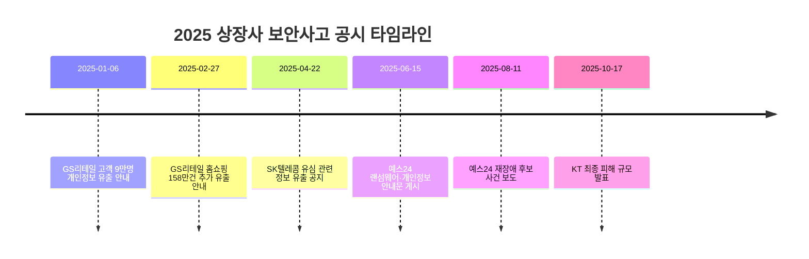
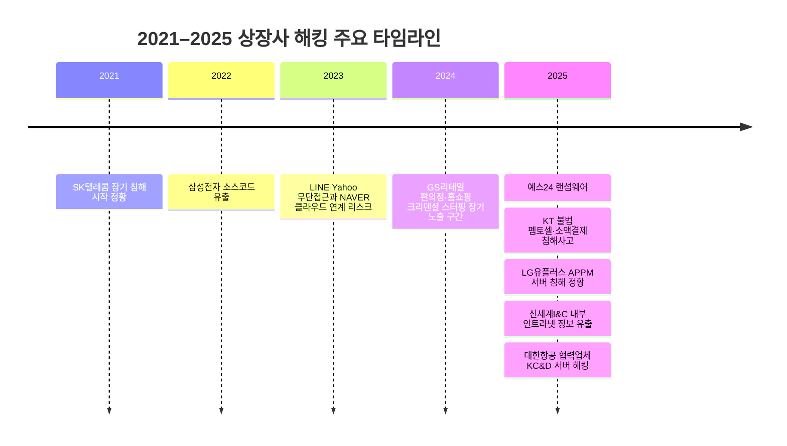

# 2021–2025 상장사 보안사고 공시 분석

2021–2025년 코스피·코스닥 상장사 가운데, **DART·KRX 공시, 회사 공지 원문, 정부 공식 발표**로 직접 확인 가능한 사건만 보수적으로 정리했습니다. 이번 세션에서 직접 확인된 공식 공지 기준 사건은 **확정 5건**이었고, 모두 **2025년 공시**에 집중됐습니다. 시장별로는 **KOSPI 4건, KOSDAQ 1건**이었으며, 유형별로는 **크리덴셜 스터핑 2건, 랜섬웨어 1건, 기타 2건**으로 집계됐습니다. 이 수치는 “국내 상장사 전체 실제 발생 건수”가 아니라, **공식 공지 원문을 현재 시점에 직접 확인할 수 있었던 건수**라는 점이 중요합니다. citeturn23view1turn24view3turn7view0turn7view3turn9view6

가장 중대한 규제·거버넌스 파급은 **SK텔레콤**에서 확인됐습니다. 회사 공지 이후 정부 최종 조사와 개인정보보호위원회 제재까지 이어지며, **약 2,300여만 명의 주요 디지털 개인정보 유출**, **과징금 1,347억 9,100만 원**, **유출 통지 지연 문제**, **핵심 네트워크·시스템 관리 소홀**이 공식 문서에 적시됐습니다. 반면 **KT**는 실제 금전 피해가 확인된 사례로, 정부 브리핑 기준 **368명·2억 4,319만 원의 소액결제 피해**와 **2만 2,227명 식별정보 유출 정황**이 발표됐습니다. **예스24**는 랜섬웨어로 전사 서비스가 멈춘 대표 사례였고, **GS리테일**은 9만 건과 158만 건으로 나뉘는 두 차례의 크리덴셜 스터핑형 개인정보 유출 공지가 확인됐습니다. citeturn9view1turn8view0turn9view6turn7view3turn23view1turn24view3

<!--more-->

## Executive summary

이번 조사에서 가장 중요한 결론은 두 가지입니다. 첫째, **2021–2024년 구간에서는 이번 세션에서 직접 확인 가능한 공식 공시 원문 사건을 추가로 식별하지 못했고, 확인 사례가 2025년에 집중**됐습니다. 둘째, 상장사 보안사고의 공시 실무는 전형적인 “DART 단일 사건공시”보다, **회사 고객공지·안내문**과 **정부 공식 브리핑**이 실제 사실관계의 핵심 1차 문서 역할을 하는 경우가 많았습니다. SK텔레콤과 예스24는 회사 공지 원문이 직접 확인됐고, KT는 정부 브리핑이 구체적 피해 수치를 제공했으며, GS리테일 두 건은 한국어 매체가 회사 설명과 공지 화면을 인용한 형태였습니다. citeturn7view0turn7view3turn9view6turn23view1turn24view3

이 기준으로 보면, **경영 영향의 방향성도 뚜렷**합니다. 통신사 사건은 과징금·신고 지연·위약금 면제 검토처럼 **규제·정책 리스크**가 크고, 온라인 플랫폼·유통사는 서비스 장애와 대규모 통지, 고객 불만 대응처럼 **운영·평판 리스크**가 큽니다. 특히 SK텔레콤은 규제 처분과 거버넌스 실패가 가장 크게 드러난 사례였고, KT는 실제 금전 피해가 확인돼 이용자 보상·IR 부담이 컸습니다. 예스24는 개인정보 유출이 확인되지 않은 상태에서도 랜섬웨어만으로 전사 서비스가 멈출 수 있음을 보여줬습니다. citeturn9view1turn8view0turn9view6turn7view3

## 조사 범위와 판정 기준

본 보고서는 **“상장사 보안사고 공시”**를 매우 좁게 정의했습니다. 우선순위는 사용자가 지정한 대로 **금융감독원 DART**, **한국거래소 공시**, **회사별 공시 원문**, 그리고 **한국어 주요 언론 보도** 순으로 두었습니다. 다만 실제로는, 독립적인 “보안사고 공시”가 DART나 KRX에 항상 별도 항목으로 올라오는 것이 아니어서, 현재 시점에 직접 확보 가능한 1차 자료는 회사 공지 원문이나 정부 공식 발표가 더 많았습니다. 그래서 본 표는 **공식 원문이 직접 확인된 사건만 확정 집계**했고, 원문 확보가 제한적인 건은 **‘미확인’** 또는 **신뢰도 하향**으로 처리했습니다. citeturn7view0turn7view3turn8view0turn9view1turn9view6

연도별 사건 수는 **“공시일 기준”**으로 집계했습니다. 따라서 GS리테일 두 사건처럼 침해 기간이 2024년부터 시작됐더라도, 회사가 2025년에 안내했다면 **2025년 공시 사건**으로 분류했습니다. 반대로, 2025년에 발생했더라도 본 세션에서 2025년 내 공식 공지 원문을 직접 확보하지 못한 사건은 **집계에서 제외**했습니다. 이 원칙 때문에 통상적으로 많이 거론되는 일부 사건이 표 밖에 남을 수 있으며, 이는 누락이 아니라 **엄격한 포함 기준의 결과**입니다. citeturn23view1turn24view3turn33view0

시장 구분은 **KOSPI/KOSDAQ 상장시장 기준**으로 표준화했습니다. 회사별 시장 분류 자체는 본 대화 맥락상 앞선 보조 문서에서 KIND·사업보고서 기준으로 정리된 시장 구분을 그대로 사용했습니다. fileciteturn0file0

## 상위 주요 사건 요약

상단 요약 표는 **확정 5건 + 미확인 후보 1건**으로 구성했습니다. 아래 표의 `집계 반영`이 `아니오`인 행은 요청하신 “상위 6개” 형식을 맞추기 위한 **참고용 후보**이며, 연도별 집계와 유형 비율 계산에는 넣지 않았습니다.

| 회사명 | 시장 | 공시일 | 집계 반영 | 피해규모 | 주요 파급 | 교훈 | 근거 |
|---|---|---:|---|---|---|---|---|
| SK텔레콤 | KOSPI | 2025-04-22 | 예 | 약 2,300여만 명 주요 디지털 개인정보 유출 결론, 과징금 1,347억 9,100만 원 | 규제 제재, 유출 통지 지연, 이사회·IR·정부조사 부담이 모두 현실화 | 대형 통신사는 “침해 탐지”만이 아니라 **자료보전·통지·핵심망 계정관리**가 거버넌스 핵심 | citeturn7view0turn8view0turn9view1 |
| KT | KOSPI | 2025-10-17 | 예 | 368명, 2억 4,319만 원 소액결제 피해; 2만 2,227명 식별정보 유출 정황 | 실금전 피해, 위약금 면제 검토, 정부 조사와 신고 지연 이슈 | 개인정보 유출이 **직접 결제 피해**로 이어지면 규제·고객보상 부담이 급증 | citeturn9view6turn8view2 |
| GS리테일 | KOSPI | 2025-02-27 | 예 | 약 158만 건 개인정보 유출 | 대규모 정보주체 통지, 2차 피해 경고, 로그인 보안 강화 | 크리덴셜 스터핑은 “단순 로그인 공격”처럼 보여도 **대량 유출**로 비화 가능 | citeturn24view3 |
| 예스24 | KOSDAQ | 2025-06-15 | 예 | 랜섬웨어로 전사 서비스 장애, 개인정보 외부 유출 정황은 공지 시점 기준 미확인 | 주문·티켓·이북·전자도서관 장애, 고객 보상·복구 공지 | 개인정보가 안 새도 **영업 연속성 리스크**만으로 상장사 부담이 충분히 커질 수 있음 | citeturn7view3 |
| GS리테일 | KOSPI | 2025-01-06 | 예 | 고객 약 9만 명 개인정보 유출 추정 | 고객 계정 잠금, 개인정보 페이지 임시 폐쇄, 2차 피해 우려 | 반복 로그인 공격에 대한 **탐지·차단·본인확인 강화**가 기본 통제임을 보여줌 | citeturn23view1 |
| 예스24 | KOSDAQ | 미확인 | 아니오 | 7시간가량 서비스 장애 보도, 개인정보 유출 여부 미상 | 6월 사고 이후 재장애로 보안 신뢰 추가 약화 | 재발 여부가 중요하지만, 본 세션에서는 공식 공지 원문을 직접 확보하지 못해 **미확인 후보**로만 제시 | citeturn33view0 |

주요 사건의 시간 흐름은 아래처럼 정리할 수 있습니다.

## 집계 결과

확정 집계 기준으로 사건은 **2025년에만 5건** 확인됐습니다. KOSPI가 4건, KOSDAQ이 1건이었습니다. 이는 “실제 발생이 2025년에만 있었다”는 뜻이 아니라, **2021–2024 구간에서 현재 시점에 직접 확인 가능한 공식 공시 원문 사건을 추가로 찾지 못했다**는 뜻입니다. 이번 세션의 엄격한 기준을 감안하면, 상장사 보안사고는 실제 발생 건수보다 **공개·공시 가시성의 편차**가 훨씬 크다고 보는 편이 타당합니다. citeturn23view1turn24view3turn7view0turn7view3turn9view6

연도별 사건 수 표는 다음과 같습니다.

| 연도 | KOSPI | KOSDAQ | 합계 |
|---|---:|---:|---:|
| 2021 | 0 | 0 | 0 |
| 2022 | 0 | 0 | 0 |
| 2023 | 0 | 0 | 0 |
| 2024 | 0 | 0 | 0 |
| 2025 | 4 | 1 | 5 |

유형별로는 **크리덴셜 스터핑 40%**, **랜섬웨어 20%**, **기타 40%**였습니다. “기타”에는 SK텔레콤의 악성코드 기반 유심정보 유출 사건과 KT의 불법 펨토셀·무단 소액결제 사건처럼, 사용자가 제시한 범주에 딱 맞게 단일 분류하기 어려운 사례를 넣었습니다. 즉, 국내 상장사 공시 문맥에서는 여전히 **전형적 랜섬웨어/계정탈취**뿐 아니라, **통신 인프라·인증 체계형 사건**이 중요한 비중을 차지한다는 뜻입니다. citeturn7view0turn8view0turn9view6turn23view1turn24view3turn7view3

| 해킹유형 | 사건수 | 비율 |
|---|---:|---:|
| 랜섬웨어 | 1 | 20.0% |
| 크리덴셜 스터핑 | 2 | 40.0% |
| 내부자 | 0 | 0.0% |
| 공급망 | 0 | 0.0% |
| 서비스마비 | 0 | 0.0% |
| 기타 | 2 | 40.0% |

## 전체 종합표

아래 표가 이번 보고서의 **확정 집계 본표**입니다. 사용자가 요청한 표준 컬럼을 유지하되, 원문 공시 확보가 제한된 경우는 `공시문 핵심문구` 또는 `신뢰도 이유`에 그 사실을 명시했습니다.

| 상장시장 | 회사명 | 공시일 | 사건일 | 해킹유형 | 피해규모 | 공시·안내 핵심문구 | 신뢰도 | 신뢰도 이유 | 비고 | 근거 |
|---|---|---:|---|---|---|---|---|---|---|---|
| KOSPI | GS리테일 | 2025-01-06 | 2024-12-27~2025-01-04 | 크리덴셜 스터핑 | 고객 약 9만명 개인정보 유출 추정, 금액 미상 | “지난달 27일부터 이달 4일 사이 이뤄진 웹사이트 해킹 공격으로 … 고객 9만여명의 개인정보가 유출된 것으로 파악됐다.” | 중간 | 회사 설명과 한국어 주요 매체 보도가 일치하지만, 회사 원문 공지 페이지를 본 세션에서 직접 확보하지 못함 | 개인정보 페이지 임시 폐쇄, 고객 계정 잠금, 2차 피해 안내 | citeturn23view1 |
| KOSPI | GS리테일 | 2025-02-27 | 2024-06-21~2025-02-13 | 크리덴셜 스터핑 | 약 158만건 개인정보 유출, 금액 미상 | “모든 인터넷 사이트 최근 1년간 로그를 추가 분석한 결과 … 동일 수법으로 약 158만건 개인정보가 유출됐다.” | 중간 | 공지 화면과 회사 설명이 한국어 보안전문매체 기사로 확인되지만 원문 페이지 직접 확보는 제한적 | 10개 항목 유출, 로그인 본인확인 강화, 비밀번호 변경 권고 | citeturn24view3 |
| KOSPI | SK텔레콤 | 2025-04-22 | 2025-04-19 | 기타 | 약 2,300여만 명 주요 디지털 개인정보 유출 결론, 과징금 1,347억 9,100만 원·과태료 960만 원 | “2025년 4월 19일 오후 11시경, 악성코드로 인해 … 유심 관련 일부 정보가 유출된 것으로 의심되는 정황을 발견하였습니다.” “유출 가능성을 인지한 후 해당 악성코드를 즉시 삭제하였으며, 해킹 의심 장비도 격리 조치하였습니다.” | 높음 | 회사 공지 원문과 정부 최종 조사, 개인정보보호위원회 제재 자료가 모두 확인됨 | 신고 지연, 자료보전, 핵심망 계정관리, 유출 통지 지연 등 거버넌스 이슈가 동반 | citeturn7view0turn8view0turn9view1 |
| KOSDAQ | 예스24 | 2025-06-15 | 2025-06-09 | 랜섬웨어 | 전사 서비스 장애, 개인정보 외부 유출 정황은 공지 시점 기준 미확인, 금액 미상 | “2025년 6월 9일 오전 4시경, 신원 미상자의 랜섬웨어 공격으로 예스24의 시스템 제어가 어려운 상황이 발생하였습니다.” “당사가 현재까지 파악한 바로는 고객님들의 개인정보 외부 유출 정황은 확인되지 아니합니다.” | 높음 | 회사 공지 원문이 직접 확인되고 사고 시점과 유출 여부가 명시됨 | 주문·예매·이북·전자도서관 중단, 보상·복구 공지 | citeturn7view3 |
| KOSPI | KT | 2025-10-17 | 2025-09-08 | 기타 | 368명, 2억 4,319만 원 소액결제 피해; 2만 2,227명 IMSI·IMEI·전화번호 유출 정황 | “KT는 불법 셀 20개에 접속한 2만 2,227명 가입자 식별번호, 단말기 식별번호 및 전화번호 유출 정황을 확인하였으며, 368명, 2억 4,319만 원의 소액결제 피해가 있었음을 지난 10월 17일 발표하였습니다.” | 높음 | 정부 공식 브리핑이 수치와 발표 시점을 적시했고, 최종 정책 발표도 이를 재확인함 | 실금전 피해, 위약금 면제 검토, 신고 지연 문제가 핵심 | citeturn9view6turn8view2 |

## 핵심 해설과 시사점

이번 표본은 많지 않지만, **상장사 공시 관점의 패턴**은 분명합니다. 먼저, 실제 공지된 사건은 **개인정보 유출형**과 **서비스 마비형** 두 축으로 갈렸습니다. GS리테일과 SK텔레콤, KT는 개인정보 유출과 2차 피해 가능성이 핵심이었고, 예스24는 개인정보 유출이 확인되지 않은 상태에서도 영업·서비스 연속성 위기가 먼저 드러났습니다. 상장사 입장에서 이는 “무조건 정보가 빠져나가야만 큰 사고”가 아니라, **수일간 서비스가 멈추는 것만으로도 충분히 공시·IR 리스크가 될 수 있다**는 뜻입니다. citeturn23view1turn24view3turn7view0turn7view3turn9view6

둘째, **유형의 전통성**이 오히려 눈에 띕니다. GS리테일 두 건은 모두 크리덴셜 스터핑이었고, 예스24는 전형적인 랜섬웨어였습니다. 다시 말해 화려한 제로데이나 공급망 침해만이 문제가 아니라, **기본적인 로그인 보호·이상 행위 탐지·백업 복원·통지 절차**가 상장사 사고비용을 크게 좌우합니다. 특히 GS리테일 158만 건 사례는 “계정 대입 공격”이 얼마나 빠르게 대규모 개인정보 유출 통지 사건으로 전환될 수 있는지 보여줬고, 예스24 6월 사례는 백업과 복구 체계가 곧 영업 지속성과 직결된다는 사실을 드러냈습니다. citeturn24view3turn7view3

셋째, 통신사 사건에서는 **탐지 그 자체보다 설명 가능성**이 더 중요하게 드러났습니다. SK텔레콤은 악성코드 탐지 이후 정부 조사에서 침해 경로, 계정정보 평문 저장, 과거 신고 누락, 자료보전 이슈까지 문제로 확장됐고, KT는 단순 정보유출을 넘어 실제 소액결제 피해와 위약금 면제 검토로 이어졌습니다. 경영진 관점에서 보면, 사고 이후 가장 먼저 필요한 것은 “보안 솔루션 목록”이 아니라 **언제 침해가 시작됐는지, 어떤 시스템과 계정이 영향을 받았는지, 어떤 고객이 피해 가능성이 있는지, 어떤 근거로 투자자와 감독당국에 설명할 수 있는지**입니다. citeturn8view0turn9view1turn9view6turn8view2

마지막으로, 이번 조사 자체가 보여주는 한계도 분명합니다. **공식 공시 가시성은 실제 사건 가시성보다 좁습니다.** 즉, 상장사 보안사고는 존재 여부보다 **어떤 형식으로 공개됐는가**가 더 큰 문제였습니다. DART나 KRX에서 독립 사건공시로 바로 나오는 경우는 드물었고, 회사 공지 원문이 사라졌거나 파싱이 되지 않는 경우도 있었습니다. 그래서 이번 보고서는 “2021–2025년 모든 상장사 침해사고의 완전 목록”이 아니라, **현재 시점에 재검증 가능한 공시·공지 기준 사건집**으로 이해하는 것이 가장 정확합니다. citeturn7view0turn7view3turn23view1turn24view3turn33view0# 2021–2025년 상장사 해킹 조사

## Executive Summary

본 문서는 2021년부터 2025년까지 공개 자료로 확인 가능한 KOSPI·KOSDAQ 상장사 해킹·침해 사례를 사건 발생연도와 공개·공시연도로 나누어 정리한 블로그용 리포트다. 금융감독원·DART, 회사 공지, 정부 조사결과, 주요 언론, 전문 보안 매체를 우선 사용했고, 해외 자회사·합작법인·외부 협력사에서 발생했더라도 상장사 정보자산·임직원·고객정보가 직접 연루된 경우는 `scope_note`로 구분해 포함했다. 종합표 기준으로 정리된 공개 확인 사례는 9건이며, 시장별로는 KOSPI 8건, KOSDAQ 1건이다. 사건 발생연도 기준 분포는 2021년 1건, 2022년 1건, 2023년 1건, 2024년 1건, 2025년 5건이다. citeturn55view0turn56view0turn24news0turn23news0turn33view0turn45view0turn37view3turn31view0turn28view1turn29view2

가장 큰 재무·규제 파급은 SK텔레콤과 KT에서 확인된다. SK텔레콤은 2025년 4월 유심 정보 유출 정황을 공지했고, 정부 최종조사는 최초 침투를 2021년 8월로, 유출 규모를 IMSI 기준 약 2,696만 건으로 제시했다. 이후 Reuters 보도 기준 개인정보보호위원회는 약 134억 원대 과징금을 발표했고, SK텔레콤은 5년간 약 7000억 원 투자 계획과 2025년 매출 전망 8000억 원 하향을 함께 밝혔다. KT는 정부 최종조사에서 가입자 식별정보 2만 2227명 유출, 368명 대상 777건의 무단 소액결제로 약 2억 4300만 원 피해가 발생한 것으로 확인됐고, 정부는 위약금 면제 규정 적용 가능성까지 언급했다. citeturn55view0turn56view0turn36view0turn36view5turn37view1turn37view3

2021–2024년에도 의미 있는 사례는 분명 존재한다. 2022년 삼성전자 소스코드 유출은 고객정보가 아니라 내부 기술정보 노출의 위험을 보여줬고, 2023년 NAVER 연계 LINE Yahoo 사건은 해외 합작법인 침해가 지배구조와 규제 이슈로 번질 수 있음을 드러냈다. 2024년 GS리테일 사건은 크리덴셜 스터핑만으로도 장기간 누적된 개인정보 노출이 편의점 9만여 명과 홈쇼핑 약 158만 건 수준으로 확대될 수 있음을 보여줬다. 예스24는 개인정보 유출 여부와 별개로 랜섬웨어가 영업중단·주가·보상 문제로 즉시 전이되는 전형적 사례였다. citeturn24news0turn42search0turn23news0turn23news1turn33view0turn34view2turn45view0turn46view1

<!--more-->

## 범위와 판정 기준

이번 정리는 **상장사 거버넌스 관점에서 의미가 큰 공개 확인 사례**에 초점을 맞췄다. 사건 발생연도와 공개·공시연도를 분리했고, DART나 투자위험 공시가 명시적으로 확인되는 경우에는 `영향` 열에서 반영했다. 다만 실제 한국 상장사의 해킹 공시는 미국 SEC 8-K처럼 표준화되어 있지 않기 때문에, 회사 공지와 정부 조사결과, 연합뉴스·경향·전문 보안 매체 보도, 해외 공식·주요 외신을 함께 대조하는 방식이 필요했다. SK텔레콤과 KT처럼 정부 조사결과가 매우 구체적인 사례도 있었지만, 삼성전자 2022년 소스코드 유출처럼 공개 공식자료가 제한되어 해외 보도를 통해 보수적으로 반영한 사례도 있다. citeturn56view0turn37view3turn24news0turn42search0

해외 자회사·합작법인·공급망 사건은 무조건 포함하지 않았다. NAVER의 경우 LINE Yahoo 침해가 NAVER Cloud 시스템과 연결되어 일본 규제와 지배구조 논란으로 번졌기 때문에 포함했고, 대한항공은 외부 협력업체 KC&D 사고였지만 대한항공 임직원 개인정보가 실제로 연루되었다는 점에서 포함했다. 반대로 공개 근거가 약하거나 상장사 본체와의 연계성이 불명확한 사건은 제외했다. citeturn23news0turn23news1turn29view2turn51news0

## 파일 목록

- [Markdown 본문 다운로드](sandbox:/mnt/data/krx_listed_company_cyber_incidents_2021_2025_blog_v2.md)
- [CSV 원자료 다운로드](sandbox:/mnt/data/krx_listed_company_cyber_incidents_2021_2025_v2.csv)
- [PNG 연도별 사건 수](sandbox:/mnt/data/krx_cyber_incidents_2021_2025_by_incident_year_v2.png)
- [PNG 시장별 분포](sandbox:/mnt/data/krx_cyber_incidents_2021_2025_market_stack_v2.png)
- [PNG 해킹 유형 비율](sandbox:/mnt/data/krx_cyber_incidents_2021_2025_type_share_v2.png)
- [PNG 주요 사건 타임라인](sandbox:/mnt/data/krx_cyber_incidents_2021_2025_timeline_v2.png)

## 전체 사건 종합표

| 사건명 | 기업명 | 시장 | 사건 발생연도 | 공개·공시연도 | 피해규모 | 유형 | 영향 | scope_note | 출처 링크 |
|---|---|---:|---:|---:|---|---|---|---|---|
| SK텔레콤 유심정보 유출 장기침해 | SK텔레콤 | KOSPI | 2021 | 2025 | 과징금 1,347.91억원 + 고객혜택 약 5,000억원 + 보안투자 7,000억원 계획 | 장기 잠복형 악성코드·유심정보 유출 | 정부 최종조사, 유심 무상교체, 2025년 매출 전망 8,000억원 하향, 대규모 가입자 신뢰 훼손 | 국내 본사 사건 | [공지](https://www.sktelecom.com/customer/notice_detail.do?currentPage=1&index=411&keyword=&type=) · [정부](https://www.korea.kr/news/policyNewsView.do?newsId=156721622) · [Reuters1](https://www.reuters.com/sustainability/boards-policy-regulation/south-korea-agency-fines-sk-telecom-97-million-over-major-data-leak-2025-08-28/) · [Reuters2](https://www.reuters.com/sustainability/boards-policy-regulation/south-korea-orders-sk-telecom-strengthen-data-security-after-leak-2025-07-04/) |
| 삼성전자 소스코드 유출 | 삼성전자 | KOSPI | 2022 | 2022 | 미상 | 소스코드·내부 기술정보 유출 | 고객·임직원 개인정보 유출은 없다고 회사가 설명했으나, 보안설계·부트로더 관련 코드 노출 우려 | 국내 본사 사건 | [Wired](https://www.wired.com/story/lapsus-hacking-group-extortion-nvidia-samsung) · [보조](https://en.wikipedia.org/wiki/Lapsus%24) |
| LINE Yahoo 무단접근과 NAVER 클라우드 연계 리스크 | NAVER | KOSPI | 2023 | 2023 | 미상 | 해외 합작법인·클라우드 경유 무단접근 | 30만건 이상 개인정보 유출, 일본 행정지도, NAVER-SoftBank 지배구조 논란 | 해외 합작법인·클라우드 연계 사건 | [Reuters1](https://www.reuters.com/markets/deals/softbank-talks-with-naver-over-control-line-operator-ly-2024-05-10/) · [Reuters2](https://www.reuters.com/world/asia-pacific/south-korea-consult-naver-after-report-firm-faces-japan-pressure-divest-stake-2024-04-27/) · [FT](https://www.ft.com/content/b4f31495-d391-4265-bc2a-3129cccbf96f) |
| GS리테일 편의점·홈쇼핑 크리덴셜 스터핑 | GS리테일 | KOSPI | 2024 | 2025 | 금액 미상 | 크리덴셜 스터핑·계정탈취 | 편의점 9만여명, 홈쇼핑 약 158만건 개인정보 유출 공지, 2차 피해 우려와 비밀번호 변경 조치 | 국내 본사 사건 | [경향](https://www.khan.co.kr/article/202501061605011) · [보안뉴스](https://m.boannews.com/html/detail.html?idx=136291) |
| 예스24 랜섬웨어로 인한 전면 서비스 장애 | 예스24 | KOSDAQ | 2025 | 2025 | 금액 미상 | 랜섬웨어·서비스 마비 | 도서·티켓·eBook 등 전 서비스 중단, 주가 하락, 대표이사 사과 및 보상안 공지 | 국내 본사 사건 | [공지](https://m.ticket.yes24.com/notice/Detail.aspx?bid=16153&order=1) · [연합](https://www.yna.co.kr/view/AKR20250611040351008) · [보안뉴스](https://m.boannews.com/html/detail.html?idx=137687) |
| KT 불법 펨토셀·소액결제 침해사고 | KT | KOSPI | 2025 | 2025 | 무단 소액결제 피해 2억4,300만원 | 불법 펨토셀·통신망 침해 | 2만2,227명 식별정보 유출, 368명 금전피해, 서버 94대·악성코드 103종 확인, 위약금 면제 규정 적용 가능 판단 | 국내 본사 사건 | [중간](https://www.korea.kr/briefing/policyBriefingView.do?newsId=156726252) · [최종](https://www.korea.kr/news/policyNewsView.do?newsId=148957231) |
| LG유플러스 APPM 서버 침해 정황 | LG유플러스 | KOSPI | 2025 | 2025 | 금액 미상 | 내부 계정관리 서버 침해 | 8,938대 서버 정보, 4만2,256개 계정, 직원 167명 정보 탈취 주장, KISA 신고, 후속 수사·투자위험 공시 연결 | 국내 본사 사건 | [연합1](https://www.yna.co.kr/view/AKR20251023063651017) · [연합2](https://www.yna.co.kr/view/AKR20260121134000017) |
| 신세계그룹 내부 인트라넷 정보 유출 | 신세계I&C | KOSPI | 2025 | 2025 | 금액 미상 | 악성코드 감염·내부 인트라넷 유출 | 약 8만여명 사번과 일부 이름·부서·IP 주소 유출, 고객정보 유출은 없다고 설명, 관계기관 신고 | 국내 본사 사건 | [연합](https://www.yna.co.kr/view/AKR20251226132851030) · [ZDNet](https://zdnet.co.kr/view/?no=20251226191853) |
| 대한항공 협력업체 KC&D 서버 해킹 | 대한항공 | KOSPI | 2025 | 2025 | 금액 미상 | 외부 협력업체 서버 해킹 | 임직원 성명·계좌번호 등 개인정보 연루, 협력업체 영역 사고이나 즉시 보안 조치와 관계기관 신고 진행 | 국내 본사 정보가 포함된 외부 공급망 사건 | [연합](https://www.yna.co.kr/view/AKR20251229029200003) · [TechRadar](https://www.techradar.com/pro/security/thousands-of-employees-exposed-as-korean-air-compromised-in-oracle-breach) |

## 요약 표

| 사건 | 피해규모 | 주요파급 | 교훈 |
|---|---|---|---|
| SK텔레콤 유심정보 유출 장기침해 | 과징금 1,347.91억원, 고객혜택 약 5,000억원, 보안투자 7,000억원 계획 | 유심 무상교체, 2025년 매출 전망 8,000억원 하향, 대규모 이용자 신뢰 훼손 | 통신 핵심인증정보는 평시부터 분리·암호화·장기 로그보존이 필수 |
| KT 불법 펨토셀·소액결제 침해사고 | 무단 소액결제 피해 2억4,300만원 | 2만2,227명 식별정보 유출, 368명 금전피해, 위약금 면제 판단 | 네트워크 장비·공급망·로그·암호화 정책을 한 체계로 관리해야 함 |
| GS리테일 편의점·홈쇼핑 크리덴셜 스터핑 | 금액 미상 | 편의점 9만여명·홈쇼핑 약 158만건 개인정보 유출 공지 | 비정상 로그인 탐지, MFA, 계정잠금, 대량 시도 통계감시가 기본 방어선 |
| 예스24 랜섬웨어 | 금액 미상 | 전면 서비스 장애, 주가 하락, 대표이사 사과와 고객 보상 | 랜섬웨어는 개인정보 유출 여부와 별개로 영업중단 리스크가 매우 큼 |
| LG유플러스 APPM 서버 침해 | 금액 미상 | 계정·서버·직원정보 유출 주장, 후속 수사와 투자위험 공시 연결 | 외주 보안업체 계정과 내부 운영계정은 별도 통제·포렌식 보존이 핵심 |
| LINE Yahoo와 NAVER 클라우드 연계 리스크 | 금액 미상 | 30만건+ 유출, 일본 행정지도, 지배구조 논란 | 해외 자회사·합작법인도 그룹 차원 공급망 보안과 거버넌스 범위에 포함해야 함 |

## 정량 요약과 시각화

사건 유형별로 보면 악성코드·시스템 침해가 4건으로 가장 많고, 공급망·제3자 연계 침해가 2건, 계정탈취·크리덴셜 스터핑 1건, 랜섬웨어·서비스 장애 1건, 소스코드·IP 유출 1건이다. 시장별로는 KOSPI 비중이 높지만, KOSDAQ에서도 예스24처럼 서비스 연속성에 직접 영향을 준 사례가 확인된다. 이 분포는 “공시 리스크를 동반한 대형 통신·유통·플랫폼 사건”과 “영업중단형 랜섬웨어 사건”이 동시에 증가하고 있음을 시사한다. citeturn36view5turn37view3turn34view2turn46view1turn32view2turn29view2

예스24는 2025년 6월 9일 오전 4시경 랜섬웨어로 서비스가 마비됐고, 연합뉴스 기준 6월 11일 주가가 3.90% 하락했다. 이후 대표이사 사과문과 1차 보상안이 공지됐다. GS리테일은 2025년 1월 공지에서 9만여 명 개인정보 유출을 알렸고, 2월 추가 분석에서는 2024년 6월 21일부터 2025년 2월 13일 사이 홈쇼핑 웹사이트에서 약 158만 건 개인정보 유출 가능성을 공지했다. LG유플러스는 2025년 10월 KISA 신고 시점에 8,938대 서버 정보, 4만2,256개 계정, 167명 직원 정보 탈취 주장이 보도됐고, 2026년 1월 연합뉴스는 이를 둘러싼 경찰 수사와 투자위험 공시를 전했다. 신세계I&C는 약 8만여명 사번과 일부 이름·부서·IP 주소 유출을 인정했고, 고객정보 유출은 없다고 밝혔다. 대한항공은 외부 협력업체 KC&D 사고로 임직원 성명·계좌번호 등이 연루됐다고 밝혔다. citeturn45view0turn46view1turn33view0turn34view2turn31view0turn32view2turn28view1turn29view5turn29view2turn51news0

## 주요 사건 타임라인

SK텔레콤은 정부 최종조사에서 최초 침투를 2021년 8월 6일, 음성통화인증 관리서버 감염을 2021년 12월 24일, 추가 거점 확보를 2022년 6월, 광범위한 악성코드 설치를 2023년 11월 30일부터 2025년 4월 21일까지로 설명했다. 이 사건 하나만 보더라도 “사고 공시는 2025년이지만, 실제 침해 연혁은 수년에 걸친 장기 잠복”이라는 점이 분명해진다. NAVER 연계 LINE Yahoo 사건 역시 2023년 발생, 2024년 행정지도로 이어진 후 그룹 지배구조 리스크로 비화했다. citeturn56view0turn23news0turn23news1

## 시사점과 한계

이번 정리에서 반복적으로 나타난 공통점은 세 가지다. 첫째, **평시 탐지 실패와 장기 잠복**이다. SK텔레콤, KT, LG유플러스는 사고 그 자체보다 늦은 인지, 계정정보 평문 저장, 포렌식 보존 미흡, 자산 식별·로그 관리 실패가 더 큰 위험으로 이어졌다는 공통점을 보였다. 둘째, **공급망·외주·합작법인 리스크의 확대**다. NAVER-라인야후, 대한항공, GS리테일 사례는 경계 밖 사건이 결국 고객·임직원 데이터, 규제 대응, 투자위험 공시로 귀결될 수 있음을 보여준다. 셋째, **영업중단과 공시 리스크의 결합**이다. 예스24와 신세계I&C 사례는 즉각적인 서비스 중단이나 내부 인트라넷 사고가 바로 평판·보상·주가·이사회 이슈로 번질 수 있음을 보여준다. citeturn56view0turn37view3turn32view2turn23news0turn29view2turn34view2turn45view0turn28view1

다만 이 보고서는 **공개 확인 가능한 사례만** 포함한다. 비공개 포렌식 사고, 수사 단계 미공개 사건, 회사가 고객 안내만 하고 폭넓은 공시를 하지 않은 사건은 누락될 수 있다. 또한 삼성전자 2022년 사례처럼 DART나 국내 공식 공시보다 해외 보도 의존도가 높은 건은 보수적으로 반영했다. 피해 금액이 공식적으로 확인되지 않은 경우에는 `미상`으로 두고, 대신 서비스 중단, 과징금, 보상 패키지, 투자위험 공시, 가이던스 하향 같은 **간접 재무지표**를 `영향` 열에 따로 기록했다. citeturn24news0turn42search0turn36view0turn36view5turn46view1
