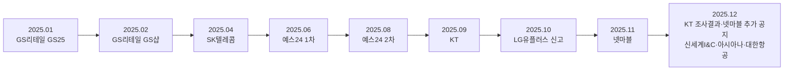

## 🧾 2025년 대한민국 상장사 해킹 피해 사례 보고서

## 📌 Executive summary

2025-01-01부터 2025-12-31까지 공개 자료를 기준으로 확인한 결과, 국내 상장사 해킹 사례는 총 **11건**으로 정리됐습니다. 시장별로는 **코스피 9건**, **코스닥 2건**이며, 통신·유통·콘텐츠·게임·항공 업종 전반에서 개인정보 유출, 서비스 중단, 결제 피해, 규제 리스크가 확인됐습니다.

직접적인 사고 공지가 전자공시시스템 DART에 별도 “침해사고 공시” 형태로 올라온 경우는 제한적이었습니다. 실무적으로는 회사 고객공지·사내 통지문·정부 브리핑·개인정보보호위원회 제재 발표가 핵심 근거가 되었으며, 사건별로 공개 경로와 확인 가능한 정보 범위에 차이가 있었습니다.

가장 중대한 재무·규제 파급은 SK텔레콤과 KT에서 확인됐습니다. SK텔레콤은 2,300만명 이상 주요 디지털 개인정보 유출, 5,000억원 고객 보상 패키지, 5년 7,000억원 정보보호 투자, 약 1,347억 원(1,347억9,100만 원) 과징금으로 이어졌고, KT는 2만2,227명 정보 유출과 368명·777건, 약 2억4,300만원의 무단 소액결제 피해가 최종 확인되었습니다.


<!--more-->


---

## 🔥 주요 사건만 먼저 보기

아래 표는 전체 사례 중 경영진·이사회·CFO·IR·준법 조직이 먼저 확인해야 할 대표 사건만 압축한 것입니다. 전체 사건과 세부 근거는 뒤의 **상세 사건 종합 표**와 CSV에서 확인할 수 있습니다.

| 기업 | 공격 유형 | 피해 규모 | 주요 파급 | 경영진이 볼 교훈 |
|---|---|---|---|---|
| SK텔레콤 | 악성코드 기반 서버 침해 / 유심정보 유출 | 2,300만명 이상 주요 디지털 개인정보 유출, 약 1,347억 원 과징금, 5,000억 원 보상 패키지, 5년 7,000억 원 정보보호 투자 | 규제 제재, 보상 비용, 가입자 신뢰 훼손, 장기 투자 부담 | 통신·인증 인프라 침해는 단순 보안 사고가 아니라 재무·규제·시장 신뢰 리스크입니다. |
| KT | 불법 초소형 기지국 악용 / 개인정보 유출·무단 소액결제 | 2만2,227명 정보 유출, 368명·777건, 약 2억4,300만 원 무단 소액결제 피해 | 실제 금전 피해, 가입자 보상, 위약금 면제 가능성 | 개인정보 유출이 결제 피해로 연결되면 사고 대응 범위가 고객 보상과 영업 리스크로 확장됩니다. |
| LG유플러스 | 계정권한관리 서버 침해 정황 / 자료 유출 | 서버 목록·서버 계정정보·임직원 성명 등 유출 확인, 전체 범위는 완전 복원 제한 | 경찰 수사 의뢰, 포렌식 가능성 상실 논란 | 사고 이후에도 원본 로그와 시스템 보존이 되지 않으면 피해 설명과 책임 방어가 어려워집니다. |
| 넷마블 | 외부 해킹 / 개인정보 유출 | 611만명 고객·임직원 정보, 휴면 ID·암호화 비밀번호 3,100만여개, 추가 8,048건 일부 주민번호 포함 | 후속 조사로 피해 범위 확대, 규제 조사와 평판 훼손 | 최초 공지보다 후속 조사에서 피해 범위가 커질 수 있으므로 사고 타임라인과 증거 관리가 중요합니다. |
| 예스24 | 랜섬웨어 | 도서 주문·티켓 예매·이북·전자도서관 등 전사 서비스 중단, 주가 약 3.9% 하락 보도 | 서비스 마비, 고객 불편, 시장 신뢰 훼손 | 랜섬웨어는 개인정보 유출이 없더라도 서비스 연속성과 매출 신뢰를 직접 흔듭니다. |
| GS리테일 | 크리덴셜 스터핑 / 개인정보 유출 | GS25 약 9만명, GS샵 약 158만건 개인정보 유출 정황 | 2차 피해 우려, 로그인 보안과 계정 보호 부담 확대 | 다크웹 유출 계정 재사용 공격은 상장사 고객 서비스에서 반복적으로 발생할 수 있습니다. |

---

## 🔎 조사 범위와 판정 기준

본 보고서는 **대한민국 상장사**를 KRX/KIND 기준의 코스피·코스닥 상장법인으로 해석해 정리했습니다. 예스24는 KIND 검색 결과 코스닥 상장법인으로, GS리테일·LG유플러스·신세계I&C·아시아나항공은 KIND 및 최근 사업·지배구조 공시에서 유가증권시장 상장법인으로, 넷마블은 지속가능보고서에서 KOSPI 상장으로 재확인했습니다.

조사 기간은 **2025-01-01~2025-12-31**입니다. 2025년에 발생·인지·공개된 상장사 해킹 사례를 대상으로 했습니다. 공격이 2024년에 시작됐더라도 2025년까지 지속되었거나 2025년에 공식 공개된 GS리테일 사례는 포함했습니다. 2026년에 발표된 후속 공시·제재·수사 결과는 2025년 사건 건수 집계에서 제외했습니다. 불명확한 항목은 “미상”으로 표기했고, 피해 규모나 금전 손실이 공개자료로 확인되지 않는 경우에는 임의 추정치를 넣지 않았습니다.

신뢰도는 다음 원칙으로 부여했습니다. **높음**은 회사 공지와 정부·규제기관 자료가 함께 있거나, 회사 원문/규제 자료에서 수치와 범위가 직접 확인되는 경우입니다. **중간**은 회사 설명·사내 통지문이 주요 매체에 일관되게 인용되지만 원문 공지 전문이나 완전한 포렌식 결과가 제한된 경우입니다. **낮음**은 본 조사 표에서는 가급적 제외했고, 반복 보도만 있고 원자료 확인이 매우 어려운 경우에만 사용할 계획이었으나 최종 표에는 포함하지 않았습니다.

---

## 📋 상세 사건 종합 표

아래 표는 전체 사건을 근거 확인용으로 정리한 상세본입니다. 

| 기업명(한글) | 상장시장 | 공시일/사건발생일 | 해킹 유형 | 피해 내용 | 영향 범위 | 대응 조치 | 신뢰도 | 신뢰도 근거 | 출처 |
|---|---|---|---|---|---|---|---|---|---|
| GS리테일 | 코스피 | 공시 2025-01-06 / 발생 2024-12-27~2025-01-04 | 크리덴셜 스터핑 / 개인정보 유출 | 고객 약 9만명, 이름·성별·생년월일·연락처·주소·아이디·이메일 7개 항목 유출 추정, 금전 손실 미상 | GS25 고객 2차 피해 우려, 개인정보 페이지 임시 폐쇄, 주가 영향 미상 | 공격 IP 차단, 계정 잠금, 개인정보 페이지 임시 폐쇄, 비밀번호 변경 권고, 사과 | 중간 | 회사 설명은 일관되지만 원문 공지 전문 확보 제한 | 회사 설명 인용·언론 보도. |
| GS리테일 | 코스피 | 공시 2025-02-27 / 발생 2024-06-21~2025-02-13 | 크리덴셜 스터핑 / 개인정보 유출 | 약 158만건, 10개 항목 유출 정황, 금융정보 유출은 없다고 회사 설명 | GS샵·통합회원 대상 스미싱 등 2차 피해 우려 | 최근 1년 로그 추가 분석, 패턴 차단, 계정 잠금, 로그인 본인확인 강화 | 높음 | 회사 공지 스니펫과 보안전문매체 보도가 일치 | 회사 공지·보안뉴스. |
| SK텔레콤 | 코스피 | 공시 2025-04-22 / 인지 2025-04-19 | 악성코드 기반 서버 침해 / 유심정보 유출 | 2,300만명 이상 주요 디지털 개인정보 유출 확인, 매출 가이던스 8,000억원 하향, 5,000억원 보상 패키지·5년 7,000억원 정보보호 투자 발표 | 전 가입자 대상 유심 교체·피해예방 조치, 가입자 이탈·실적 우려, 집단분쟁조정 진행 | 악성코드 삭제·장비 격리, 전수조사, 무료 유심보호/유심교체, 개별 통지, 보상, 재발방지 투자 | 높음 | 회사 공지와 정부 최종 조사·개인정보위 제재자료가 모두 존재 | 회사 공지·정부 조사·개인정보위. |
| 예스24 | 코스닥 | 공시 2025-06-15 / 발생 2025-06-09 | 랜섬웨어 | 전사 시스템 마비, 도서 주문·티켓 예매·이북·전자도서관 등 중단, 개인정보 외부 유출 정황은 공식 안내 시점까지 미확인 | 수일간 서비스 장애, 고객 구매·예매 차질, 2025-06-11 주가 약 3.9% 하락 | KISA 등 신고, 관리자 계정 복구, 보안 점검, 사과 및 1차 보상안 공지 | 높음 | 회사 공지 원문과 시장 반응 보도가 확인됨 | 회사 공지·연합뉴스·보상안 보도. |
| 예스24 | 코스닥 | 공시 2025-08-11 / 발생 2025-08-11 | 랜섬웨어 | 재차 랜섬웨어 공격으로 서비스 장애, 약 7시간 만에 복구, 개인정보 유출 여부 미상 | 전사 서비스 단기 중단, 보안 신뢰 추가 훼손, 주가 영향 미상 | 서비스 긴급 차단, 보안 점검·방어 조치, KISA 현장 지원, 당일 정상화 | 중간 | 보도는 일치하나 공개 공지 원문 확보 제한 | 보안뉴스·방송보도. |
| KT | 코스피 | 공시 2025-09-11 / 추가 2025-10-17 / 발생 확인 2025-09-08 | 불법 초소형 기지국 악용 / 개인정보 유출·무단 소액결제 | 최종 조사 기준 22,227명의 IMSI·IMEI·전화번호 유출, 368명 777건 약 2억4,300만원 피해 | 실제 금전 피해 발생, 가입자·알뜰폰 고객 광범위 영향, 위약금 면제 적용 가능 판단 | 비정상 결제 자동 차단, 본인인증 강화, 개별 연락·청구 면제, 조회 시스템 운영 | 높음 | KT 공지와 정부 최종 조사 수치가 일치 | KT 공지·정부 조사. |
| LG유플러스 | 코스피 | 정부 통보 2025-07-19 / 신고 2025-10-23 / 정부 조사결과 2025-12-29 | 계정권한관리 서버 침해 정황 / 자료 유출 | 정부는 서버 목록·서버 계정정보·임직원 성명 등 실제 유출을 확인, 매체는 8,938대 서버 정보·42,526개 계정·167명 직원/협력사 정보 유출 정황 보도, 고객정보 포함 여부·금전 손실 미상 | 통신 3사 보안 논란 확대, 경찰 수사 의뢰, 포렌식 가능성 상실 논란 | KISA 신고, 자체 점검, OS 재설치·서버 폐기 논란 이후 정부 수사 의뢰 | 중간 | 유출 사실 일부는 정부가 확인했지만 전체 범위는 완전 복원 실패 | 연합뉴스·정부 조사. |
| 넷마블 | 코스피 | 공시 2025-11-26 / 2025-12-03 추가 / 인지 2025-11-22 | 외부 해킹 / 개인정보 유출 | 611만명 고객·임직원 정보, 휴면 ID·암호화 비밀번호 3,100만여개, PC방 사업주 6만6천여 건, 추가 8,048건 및 일부 주민번호 포함 확인 | PC게임 포털 이용자·임직원·파트너 영향, 규제 조사 및 평판 훼손 | 공식 사과, 관계기관 신고, 대상자 개별 통지, 전사 보안 강화 | 높음 | 회사 공지와 연합뉴스 후속으로 범위 확대가 단계적으로 확인 | 회사 공지·연합뉴스 후속. |
| 신세계I&C | 코스피 | 공시 2025-12-26 / 발생 인지 2025-12-26 | 변종 악성코드 감염 / 임직원 정보 유출 | 약 8만명 사번 유출, 일부 이름·소속부서·IP주소 포함, 고객정보 유출은 없다고 회사 설명 | 그룹 내부 인트라넷 전반 영향, 임직원 대상 피싱·사칭 위험 | 관련 시스템·계정 긴급 점검·차단, 관계기관 신고, 비밀번호 변경 안내 | 높음 | 회사 배포 공지와 연합뉴스·ZDNet 보도가 일치 | 회사 배포 공지 인용·ZDNet. |
| 아시아나항공 | 코스피 | 공시 2025-12-25 / 발생 2025-12-24 | 해외 서버 경유 비인가 접근 / 인트라넷 해킹 | 임직원·협력사 직원 1만여명의 인트라넷 계정·암호화 비밀번호·사번·부서·직급·이름·전화번호·이메일 유출, 고객정보 유출 없음 | 임직원·협력사 정보 노출, 고객정보 제외, 주가 영향 미상 | 접근 경로 차단, 관리자 계정·패스워드 변경, 관계기관 신고, 사내 긴급 통지 | 중간 | 사내 통지문과 회사 설명은 확인되나 별도 공시문 공개 제한 | 사내 통지문 인용. |
| 대한항공 | 코스피 | 공시 2025-12-29 / 발생일 미상 | 협력사 해킹 경유 개인정보 유출 | KC&D 서비스 서버 침해로 임직원 개인정보 3만여 건 유출 정황, 성명·계좌번호 등 포함, 금전 손실 미상 | 임직원 대상 금융사칭·이체사기 위험, 내부 경보 확산, 주가 영향 미상 | 사내 긴급 통지, 관계기관 신고, 의심 문자·이메일 주의 안내 | 중간 | 회사 통지문이 주요 매체에 인용됐으나 별도 대외 공시 원문 확보 제한 | 사내 통지문 인용. |

### CSV 형식

```csv
기업명(한글),상장시장,공시일/사건발생일,해킹 유형,피해 내용,영향 범위,대응 조치,출처 링크,신뢰도,신뢰도 근거
GS리테일,코스피,"공시 2025-01-06 / 발생 2024-12-27~2025-01-04",크리덴셜 스터핑 / 개인정보 유출,"고객 약 9만명, 이름·성별·생년월일·연락처·주소·아이디·이메일 등 7개 항목 유출 추정, 금전 손실 미상","GS25 웹사이트 고객 2차 피해 우려, 개인정보 표시 페이지 임시 폐쇄, 주가 영향 미상","공격 IP 차단, 계정 잠금, 개인정보 페이지 임시 폐쇄, 비밀번호 변경 권고, 공식 사과","https://www.boannews.com/media/view.asp?idx=135478; https://www.khan.co.kr/article/202501061605011",중간,회사 직접 설명이 복수 주요 매체에 동일 인용됐으나 원문 공지 전문 확보가 제한됨
GS리테일,코스피,"공시 2025-02-27 / 발생 2024-06-21~2025-02-13",크리덴셜 스터핑 / 개인정보 유출,"약 158만건, 이름·성별·생년월일·연락처·주소·아이디·이메일·기혼 여부·결혼기념일·개인통관고유부호 등 10개 항목, 금융정보는 유출되지 않았다고 회사 설명","GS샵/통합회원 대상 2차 피해 우려, 주가 영향 미상","최근 1년 로그 추가 분석, 해킹 IP·패턴 차단, 계정 잠금, 로그인 본인확인 강화, 비밀번호 변경 안내","https://www.gsretail.com/gsretail/ko/media/notices-view?articleCode=8829647507046&pageNum=1; https://m.boannews.com/html/detail.html?idx=136291",높음,회사 홈페이지 공지 스니펫과 보안전문매체 보도가 상호 일치
SK텔레콤,코스피,"공시 2025-04-22 / 인지 2025-04-19",악성코드 기반 서버 침해 / 유심정보 유출,"2,300만명 이상 주요 디지털 개인정보(휴대전화번호·IMSI·유심인증키 등) 유출 확인, 유출 개인정보 4종 및 내부관리정보 21종 안내, 매출 가이던스 8,000억원 하향, 5,000억원 고객보상 패키지 및 5년 7,000억원 정보보호 투자 발표","전 가입자 대상 유심 교체·피해예방 조치, 가입자 이탈·실적 우려, 집단분쟁조정 진행","악성코드 삭제·장비 격리, 전수조사, 불법 유심기변 차단, 무료 유심보호/유심교체, 개별 통지 및 보상, 정부 제재 대응","https://www.sktelecom.com/customer/notice_detail.do?currentPage=1&index=411&keyword=&type=; https://www.korea.kr/news/policyNewsView.do?newsId=156721622; https://www.pipc.go.kr/np/cop/bbs/selectBoardArticle.do?bbsId=BS074&mCode=C020010000&nttId=11453",높음,회사 공지와 정부 최종 조사·개인정보위 제재 자료가 모두 존재
예스24,코스닥,"공시 2025-06-15 / 발생 2025-06-09",랜섬웨어,"전사 시스템 마비로 도서 주문·티켓 예매·이북·전자도서관 등 서비스 중단, 회사 공지 시점까지 개인정보 외부 유출 정황 미확인, 금전 손실 미상","수일간 서비스 장애, 고객 구매·예매 차질, 2025-06-11 주가 약 3.9% 하락","KISA 등 신고, 관리자 계정 복구, 전체 시스템 보안 점검, 복구 후 사과 및 1차 보상안 공지","https://m.ticket.yes24.com/notice/Detail.aspx?bid=16153&order=1; https://www.yna.co.kr/view/AKR20250611040351008; https://m.boannews.com/html/detail.html?idx=137687",높음,회사 공지 원문과 시장 반응 보도가 확인됨
예스24,코스닥,"공시 2025-08-11 / 발생 2025-08-11",랜섬웨어,"재차 랜섬웨어 공격으로 서비스 장애 발생, 약 7시간 만에 복구, 개인정보 유출 여부는 공개자료상 미상","전사 서비스 단기 중단, 보안 신뢰도 추가 훼손, 주가 영향 미상","서비스 긴급 차단, 보안 점검·방어 조치, KISA 현장 지원, 당일 정상화 공지","https://m.boannews.com/html/detail.html?idx=138654; https://www.youtube.com/watch?v=tBZug0SQu-E",중간,주요 보안매체와 방송 보도는 일치하나 당시 공개 공지 원문 확보가 제한됨
KT,코스피,"공시 2025-09-11 / 추가 2025-10-17 / 발생 확인 2025-09-08",불법 초소형 기지국 악용 / 개인정보 유출·무단 소액결제,"최종 조사 기준 22,227명의 IMSI·IMEI·전화번호 유출, 368명(777건) 무단 소액결제로 약 2억4,300만원 피해","실제 금전 피해 발생, 광범위한 가입자·알뜰폰 고객 영향, 위약금 면제 적용 가능 판단","비정상 결제 자동 차단, 본인인증 강화, 개별 연락 및 청구 면제, 고객 조회 시스템 운영, 정부 조사 협조","https://inside.kt.com/html/notice/notice_detail.html?bno=12901; https://inside.kt.com/html/notice/notice_detail.html?bno=12933; https://www.korea.kr/news/policyNewsView.do?newsId=148957231; https://www.korea.kr/briefing/policyBriefingView.do?newsId=156726252",높음,KT 공지와 정부 최종 조사 결과가 수치까지 일치
LG유플러스,코스피,"정부 통보 2025-07-19 / 신고 2025-10-23 / 정부 조사결과 2025-12-29",계정권한관리 서버(APPM) 침해 정황 / 자료 유출,"정부는 서버 목록·서버 계정정보·임직원 성명 등 실제 유출을 확인했고, 주요 매체는 8,938대 서버 정보·42,526개 계정·167명 직원/협력사 정보 유출 정황을 보도, 고객정보 포함 여부와 금전 손실은 미상","통신 3사 보안 논란 확대, 경찰 수사 의뢰, 포렌식 가능성 상실 논란","KISA 신고, 자체 점검, OS 재설치·서버 폐기 논란 이후 정부 수사 의뢰","https://www.yna.co.kr/view/AKR20251023063651017; https://www.yna.co.kr/view/AKR20251020158600017; https://www.korea.kr/news/policyNewsView.do?newsId=148957231",중간,유출 사실 일부는 정부가 확인했지만 서버 재설치·폐기로 전체 범위를 완전 복원하지 못함
넷마블,코스피,"공지 2025-11-26 / 2025-12-03 추가 / 인지 2025-11-22",외부 해킹 / 개인정보 유출,"611만명 고객·임직원 정보 유출, 휴면 ID·암호화 비밀번호 3,100만여개 및 6만6천여 PC방 사업주 정보 추가, 이후 8,048건 추가 유출과 일부 주민등록번호 포함 확인","PC게임 포털 이용자·임직원·파트너 영향, 규제 조사 및 평판 훼손, 주가 영향 미상","공식 사과, 관계기관 신고, 대상자 개별 통지, 원인 조사, 전사 보안 강화","https://notice.netmarble.net/main/BbsContentView.asp?seq=13416597; https://www.yna.co.kr/view/AKR20251203165300017",높음,회사 공지와 연합뉴스 후속 보도로 피해 범위 확대가 단계적으로 확인됨
신세계I&C,코스피,"공시 2025-12-26 / 발생 인지 2025-12-26",변종 악성코드 감염 / 임직원 정보 유출,"신세계그룹 임직원 및 일부 협력사 직원 약 8만명 사번 유출, 일부 이름·소속부서·IP주소 포함, 고객정보 유출은 없다고 회사 설명","그룹 내부 인트라넷 전반 영향, 임직원 대상 피싱·사칭 위험, 주가 영향 미상","관련 시스템·계정 긴급 점검 및 차단, 관계기관 신고, 비밀번호 변경 안내, 보안체계 강화 예고","https://www.yna.co.kr/view/AKR20251226132851030; https://zdnet.co.kr/view/?no=20251226191853",높음,회사 배포 공지와 연합뉴스·ZDNet 보도가 일치
아시아나항공,코스피,"공시 2025-12-25 / 발생 2025-12-24",해외 서버 경유 비인가 접근 / 인트라넷 해킹,"임직원 및 협력사 직원 1만여명의 인트라넷 계정·암호화 비밀번호·사번·부서·직급·이름·전화번호·이메일 유출, 고객정보 유출 없음","임직원·협력사 개인정보 노출, 고객정보는 제외, 주가 영향 미상","불법 접근 경로 차단, 관리자 계정·패스워드 변경, 관계기관 신고, 사내 긴급 통지","https://www.yna.co.kr/view/AKR20251225044900003",중간,사내 통지문과 회사 설명이 주요 매체에 확인되나 별도 공시문 공개는 제한적
대한항공,코스피,"공시 2025-12-29 / 발생일 미상",협력사 해킹 경유 개인정보 유출,"기내식·기내판매 납품업체 KC&D 서비스 서버 침해로 임직원 개인정보 3만여건 유출 정황, 성명·계좌번호 등 포함, 금전 손실 미상","임직원 대상 금융사칭·이체사기 위험, 조직 내부 경보 확산, 주가 영향 미상","사내 긴급 통지, 관계기관 신고, 의심 문자·이메일 주의 안내 등 긴급조치","https://www.yna.co.kr/view/AKR20251229029200003; https://www.etnews.com/20251229000099",중간,회사 통지문이 주요 통신사·경제지에 인용됐으나 별도 대외 공시 원문 확보는 제한적
```

---

## 📊 정량 요약

2025년에 공개·확인된 사례는 **총 11건**입니다. 시장별로는 **코스피 9건**, **코스닥 2건**이며, 관련 상장사는 9개사입니다.

| 구분 | 건수 |
|---|---:|
| 전체 공개 사례 | 11건 |
| 코스피 | 9건 |
| 코스닥 | 2건 |
| 관련 상장사 | 9개사 |

월별로는 12월에 3건이 확인됐고, 1월·2월·4월·6월·8월·9월·10월·11월에는 각각 1건이 공개됐습니다.


월별 사건 수 PNG: [다운로드](https://blog.plura.io/cdn/column/krx_hacking_cases_2025_by_month.png)

유형별로는 **외부 해킹·정보 유출 3건**, **크리덴셜 스터핑 2건**, **랜섬웨어 2건**, **악성코드·서버 침해 2건**, **통신 인프라 악용 1건**, **공급망·협력사 경유 1건**으로 정리됩니다.


해킹 유형 비율 PNG: [다운로드](https://blog.plura.io/cdn/column/krx_hacking_type_share_2025.png)


상장시장 비율 PNG: [다운로드](https://blog.plura.io/cdn/column/krx_hacking_market_share_2025.png)

---

## 🗓️ 주요 사건 타임라인

아래 타임라인은 사건 발생·인지·공개·후속 공시 흐름을 경영진 관점에서 빠르게 보기 위한 요약입니다. 세부 날짜와 근거는 각 사건 해설 및 상세 표를 기준으로 확인해야 합니다.



---

## 🧭 핵심 사건 해설

**SK텔레콤** 사건은 이번 기간 중 가장 큰 파급력을 가진 사례였습니다. 회사는 2025-04-19 유심 관련 일부 정보 유출 의심 정황을 인지했고, 2025-04-22 대고객 공지를 냈습니다. 이후 정부 최종 조사와 개인정보보호위원회 조사에서 2,300만명이 넘는 고객의 주요 디지털 개인정보 유출이 확인되었고, 고객 보상 패키지·대규모 정보보호 투자·과징금 부과까지 이어졌습니다. **타임라인:** 2025-04-19 인지 → 2025-04-22 공지 → 2025-07-04 정부 최종 조사 발표 → 2025-08-28 개인정보위 제재 의결.

**예스24**는 2025-06-09 랜섬웨어 공격으로 도서·티켓·이북 등 전사 서비스가 멈춘 대표적 “서비스 마비형” 사례였습니다. 회사 공지에 따르면 2025-06-11 새벽 관리자 계정 복구에 성공했고, 2025-06-15에는 개인정보 유출 정황이 아직 확인되지 않았다고 밝혔습니다. 다만 서비스 장기 중단과 초기 커뮤니케이션 지연으로 시장 신뢰가 훼손되었고, 6월 11일 주가도 약 3.9% 하락했습니다. **타임라인:** 2025-06-09 발생 → 2025-06-11 복구 착수·입장 정리 → 2025-06-15 개인정보 안내문 → 2025-06-16 1차 보상안 공지.

**KT** 사례는 단순 정보 유출을 넘어 실제 **금전 피해**가 확인된 점이 특징입니다. 초기에는 IMSI 유출 가능성 공지 수준이었지만, 정부의 최종 조사에서는 불법 펨토셀 접속 이용자 2만2,227명의 IMSI·IMEI·전화번호 유출과 368명에 대한 777건, 약 2억4,300만원의 무단 소액결제 피해가 확정되었습니다. 즉시 통지·차단 조치 외에도 정부가 “위약금 면제 규정 적용 가능” 판단을 내렸다는 점에서 소비자 보상 측면의 파장이 컸습니다. **타임라인:** 2025-09-08 침해 정황 확인 → 2025-09-11 대고객 통지 → 2025-10-17 추가 유출 통지 → 2025-12-29 정부 최종 조사 발표.

**LG유플러스** 사례는 “피해 규모보다 포렌식 가능성 상실”이 더 큰 쟁점이 된 사건이었습니다. 정부 브리핑은 서버 목록·서버 계정정보·임직원 성명 등이 실제로 유출된 것으로 확인했지만, APPM 관련 서버의 OS 재설치와 일부 서버 폐기로 인해 전체 침해 범위를 완전하게 복원하지 못했다고 밝혔습니다. 그 결과 사건은 정보 유출 자체뿐 아니라 **조사 방해 논란**과 **경찰 수사 의뢰**로 이어졌습니다. **타임라인:** 2025-07-19 KISA 통보 → 2025-10-23 LGU+ 신고 → 2025-12-29 정부 조사 결과 발표.

**넷마블** 사례는 공개 피해 범위가 시간이 지나며 더 커진 경우입니다. 1차 공개에서는 611만명 고객·임직원 정보와 3,100만여 휴면 ID·암호화 비밀번호 유출이 확인됐고, 뒤이은 조사에서 고객센터 문의자·입사지원자 등 8,048건이 추가로 드러났으며 일부 주민등록번호 포함 사실도 확인됐습니다. 즉, 첫 공지 시점보다 후속 조사에서 민감도가 더 높아진 전형적인 사례라고 볼 수 있습니다. **타임라인:** 2025-11-22 인지 → 2025-11-26/27 1차 공지 → 2025-12-03 추가 유출 공지.

**GS리테일**은 2025년 초 두 차례로 나눠 봐야 합니다. 1월에는 GS25 웹사이트를 통해 약 9만명 개인정보가, 2월에는 추가 로그 분석 결과 GS샵에서 약 158만건의 개인정보가 노출된 정황이 확인되었습니다. 두 사건 모두 다크웹 등에서 이미 유출된 계정정보를 재활용하는 **크리덴셜 스터핑** 유형으로 정리하는 것이 가장 타당합니다. **타임라인:** 2025-01-06 GS25 관련 공개 → 2025-02-27 GS샵 관련 추가 공개.

**신세계I&C·아시아나항공·대한항공**은 공통적으로 고객정보보다 **임직원·협력사 정보**가 중심이 된 사례였습니다. 신세계I&C는 그룹 내부 인트라넷에서 약 8만명 관련 정보가, 아시아나항공은 임직원·협력사 1만여명 인트라넷 계정 및 부서·직급 등이, 대한항공은 협력사 KC&D를 경유해 임직원 개인정보 3만여건이 유출된 정황이 확인되었습니다. 특히 대한항공은 전형적인 공급망·협력사 경유 침해로 분류하는 편이 적절합니다.

---

## ⚠️ 해석과 한계

이번 조사에서 가장 눈에 띄는 패턴은, **고객 대량정보 유출형 사고**는 통신·유통·게임 플랫폼에 집중되고, **임직원·협력사 중심 유출**은 항공·대기업 내부 시스템 사건에서 두드러졌다는 점입니다. 또한 크리덴셜 스터핑과 랜섬웨어처럼 비교적 “전형적인 공격 유형”도 여전히 대규모 피해를 만들었고, 통신사 사례처럼 네트워크·인증 인프라가 침해될 경우 사후 규제와 보상 부담이 훨씬 커졌습니다.

반대로, **공시 제도상 한계**도 분명합니다. 상장사라고 해도 해킹 피해가 반드시 DART에 독립 항목으로 즉시 등록되지는 않았고, 실제로는 고객 공지, 사내 통지문, 정부 브리핑, 국회·언론 보도를 종합해야 사건의 외형이 드러나는 경우가 많았습니다. 그래서 본 표는 “확인 가능한 공개자료 기준의 보수적 집계”이며, 비공개 수사 사건이나 원문 공지가 삭제·차단된 사례는 누락되었을 가능성이 있습니다.

본 보고서는 **2025년 1월 1일부터 12월 31일까지** 발생·인지·공개된 사례를 기준으로 작성했습니다. 2026년 이후 발표된 후속 공시·제재·수사 결과는 2025년 사건 건수와 정량 분석에 포함하지 않았습니다. 따라서 본 문서는 2025년 한 해의 공개자료를 기준으로 정리한 연간 사건 보고서입니다.

---

## 🧩 공통적으로 부족했던 점은 ‘통합 관제 체계’입니다

사례마다 공격 유형은 달랐습니다. 어떤 사건은 크리덴셜 스터핑이었고, 어떤 사건은 랜섬웨어였으며, 어떤 사건은 서버 침해, 통신 인프라 악용, 협력사 경유 침해였습니다.

하지만 경영진 관점에서 보면 공통점은 분명합니다. 사고 이후 회사가 가장 먼저 요구받은 것은 “어떤 보안 제품을 쓰고 있었는가”가 아니라 **언제 침해가 시작됐는지, 어떤 시스템과 계정이 관련됐는지, 어떤 데이터가 영향을 받았는지, 무엇을 차단했고 어떤 근거로 설명할 수 있는지**였습니다.

즉, 상장사에 필요한 것은 개별 보안 제품의 추가 도입만이 아닙니다. 웹, 서버, PC, 계정, 로그를 연결해 실제 공격 흐름을 보고, 피해 범위를 설명하고, 이사회·IR·준법 대응에 필요한 근거를 남기는 **통합 사이버보안관제 체계**입니다.

이 보고서가 보여주는 결론은 명확합니다. 상장사는 사고 이후 “조사 중”이라는 말만으로는 부족합니다. 사고 전부터 공격을 보고, 막고, 설명할 수 있는 구조를 갖추어야 합니다.

---

### [상장사 사이버보안관제 진단 상담하기](https://www.qubitsec.com/contact)

---

### 📚 함께 읽기

- [상장사 이사회는 사이버보안을 어떻게 보고받고 있습니까?](https://blog.plura.io/ko/column/listed-company-cybersecurity-investment/)
- [스타트업 대표가 사이버보안 투자를 미루면 안 되는 이유](https://blog.plura.io/ko/column/startup-ceo-cybersecurity-investment/)
- [VC는 포트폴리오사의 해킹까지 관리해야 할까?](https://blog.plura.io/ko/column/vc-portfolio-cyber-risk/)
- [CEO가 가장 두려워하는 문제, 사이버 해킹](https://blog.plura.io/ko/column/ceo-cyberfear/)
- [전통적인 SOC vs PLURA-XDR 플랫폼](https://blog.plura.io/ko/column/traditional_soc_vs_plura_xdr/)

---

### 참고 문헌 및 기사

- GS리테일: [boannews.com](https://www.boannews.com/media/view.asp?idx=135478), [khan.co.kr](https://www.khan.co.kr/article/202501061605011), [gsretail.com](https://www.gsretail.com/gsretail/ko/media/notices-view?articleCode=8829647507046&pageNum=1), [m.boannews.com](https://m.boannews.com/html/detail.html?idx=136291)
- SK텔레콤: [sktelecom.com](https://www.sktelecom.com/customer/notice_detail.do?currentPage=1&index=411&keyword=&type=), [korea.kr](https://www.korea.kr/news/policyNewsView.do?newsId=156721622), [pipc.go.kr](https://www.pipc.go.kr/np/cop/bbs/selectBoardArticle.do?bbsId=BS074&mCode=C020010000&nttId=11453)
- 예스24: [m.ticket.yes24.com](https://m.ticket.yes24.com/notice/Detail.aspx?bid=16153&order=1), [yna.co.kr](https://www.yna.co.kr/view/AKR20250611040351008), [m.boannews.com](https://m.boannews.com/html/detail.html?idx=137687), [m.boannews.com](https://m.boannews.com/html/detail.html?idx=138654), [youtube.com](https://www.youtube.com/watch?v=tBZug0SQu-E)
- KT: [inside.kt.com](https://inside.kt.com/html/notice/notice_detail.html?bno=12901), [inside.kt.com](https://inside.kt.com/html/notice/notice_detail.html?bno=12933), [korea.kr](https://www.korea.kr/news/policyNewsView.do?newsId=148957231), [korea.kr](https://www.korea.kr/briefing/policyBriefingView.do?newsId=156726252)
- LG유플러스: [yna.co.kr](https://www.yna.co.kr/view/AKR20251023063651017), [yna.co.kr](https://www.yna.co.kr/view/AKR20251020158600017), [korea.kr](https://www.korea.kr/news/policyNewsView.do?newsId=148957231)
- 넷마블: [notice.netmarble.net](https://notice.netmarble.net/main/BbsContentView.asp?seq=13416597), [yna.co.kr](https://www.yna.co.kr/view/AKR20251203165300017)
- 신세계I&C: [yna.co.kr](https://www.yna.co.kr/view/AKR20251226132851030), [zdnet.co.kr](https://zdnet.co.kr/view/?no=20251226191853)
- 아시아나항공: [yna.co.kr](https://www.yna.co.kr/view/AKR20251225044900003)
- 대한항공: [yna.co.kr](https://www.yna.co.kr/view/AKR20251229029200003), [etnews.com](https://www.etnews.com/20251229000099)

---
