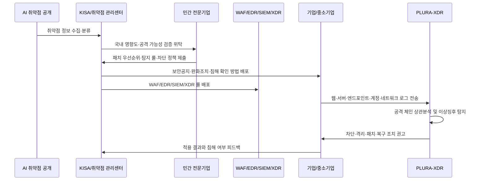

이 글의 결론은 다음과 같이 정리할 수 있습니다.

**AI 기반 사이버위협 대응 계획은 중장기 정책 선언이면서 동시에 국민과 기업을 위한 긴급 침해대응 안내서여야 합니다.**  
따라서 정부는 무엇을 당장 실행할 것인지, 무엇이 2027년 이후 중장기 과제인지, KISA가 어떤 인력과 권한으로 실제 대응을 수행할 것인지, 민간 전문기업에는 어떤 업무를 위탁할 것인지, 중소기업에는 어떤 직접 보호 서비스를 제공할 것인지, 그리고 “AI 공격은 AI로 방어한다”는 원칙을 어떤 PoC로 검증할 것인지 명확히 나누어 설명해야 합니다.

정부 발표의 방향성을 부정하자는 것이 아닙니다. 민관합동 대응체계, KISA 취약점 관리센터, 주요기업 보안대비태세 강화, 중소기업 지원, 고성능 AI 시범 적용, AI 보안주권 확립은 모두 필요한 과제입니다.

그러나 AI 취약점 대량 발굴과 공격 자동화는 이미 현실이 되었습니다. 지금 필요한 것은 새로운 협의체나 선언이 아니라, 현장에서 바로 작동하는 침해대응 체계입니다.

정책은 필요합니다.  
하지만 방어는 **탐지, 차단, 패치, 로그, 위탁, 실증**에서 시작됩니다.

<!--more-->

---

## 핵심만 보기

- 이 글은 정부 발표를 부정하거나 KISA를 비판하기 위한 글이 아닙니다. 정부 발표의 방향성은 필요하지만, AI 기반 사이버위협 대응은 정책 관리가 아니라 실제 침해대응 체계로 작동해야 한다는 문제제기입니다.
- 과학기술정보통신부는 2026년 5월 29일 제9회 과학기술관계장관회의에서 「AI 기반 사이버위협에 대응하기 위한 민간 정보보호 추진계획(안)」을 발표했습니다. 이 계획은 민간 분야의 AI 보안 위협에 대한 긴급조치와 정보보호 체계의 AI 기반 전환이라는 중장기 방향을 함께 담고 있습니다.  
  출처: [연합뉴스, AI 해킹 비상…정부, 민간 보안 총력 대응](https://www.yna.co.kr/view/AKR20260528171700017)
- 정부 계획에는 국가안보실 중심의 정보 공유, 과기정통부 총괄상황반, 소관 부처별 상황반, KISA 취약점 관리센터, KNVD 기반 취약점·패치 정보 공유, 주요기업 점검, 중소기업 지원, 고성능 AI 시범 적용, 국제협력, 2027년 AI 보안주권 확립 방향이 포함되어 있습니다.
- 문제는 긴급조치와 중장기 전환이 한 발표 안에 섞여 있다는 점입니다. 미토스급 AI 공격과 취약점 대량 발굴은 2027년을 기다려주지 않습니다.
- KISA 중심 체계가 실효성을 가지려면 센터 설치만으로는 부족합니다. 전담 인력 규모, 24시간 운영 방식, 고급 분석 인력 확보 방안, 상시 전문 리더십, 민간 위탁 범위, 긴급 대응 권한이 함께 공개되어야 합니다.
- 민간 협력은 회의체가 아니라 실행 위탁이어야 합니다. 취약점 검증, 공격 가능성 분석, 탐지 룰 생성, WAF·EDR·SIEM·XDR 차단 정책, MDR 운영, 중소기업 침해 여부 점검은 검증된 민간 전문기업과 함께 수행해야 합니다.
- 다만 민간 협력은 특정 협회나 일부 임원사 중심의 폐쇄적 구조가 되어서는 안 됩니다. 공개 모집, 실증 평가, 평가 기준 공개, 이해충돌 방지, 다수 기업 병렬 검증이 원칙이어야 합니다.
- 중소기업에는 가이드와 웹 도구만으로 부족합니다. 보안 전담 인력과 예산이 부족한 중소기업에는 정부 예산 기반 MDR, XDR, WAF, EDR, 침해 여부 점검, 긴급 차단 정책 지원이 필요합니다.
- 정부가 말한 “AI 공격은 AI로 방어한다”는 방향은 선언이 아니라 PoC로 검증되어야 합니다. 2~4주 단위의 실전형 PoC로 탐지, 차단, 분석, 자동화, 운영 가능성을 확인해야 합니다.
- 기업이 준비해야 할 것은 정부 발표 대응 문구가 아니라 실제 공격 대응 체계입니다. 자산 식별, SBOM, 취약점 우선순위, 패치 검증, WAF 가상패치, EDR 탐지, SIEM/XDR 상관분석, 로그 보존, 사고 대응 훈련이 연결되어야 합니다.

---

## 이 글의 주요 독자

이 글은 1차적으로 **CISO, 정보보호최고책임자, 보안 실무자, 취약점 관리 담당자, 침해사고 대응 담당자, MDR·XDR 운영 담당자, 법무·컴플라이언스 담당자**를 염두에 두고 작성했습니다.

동시에 정책 입안자, 감독기관, KISA 및 유관기관 담당자, 보안기업, 중소기업 경영진에게도 같은 질문을 던지고자 합니다.

> AI 기반 사이버위협 대응을 정책 문서로만 볼 것인가?  
> 아니면 오늘 당장 작동해야 하는 침해대응 체계로 볼 것인가?

---

## 1. 문제의식: AI 보안 계획은 현장 대응 안내서이기도 하다

AI 기반 사이버위협 대응 계획은 단순한 정책 방향 문서에 그쳐서는 안 됩니다.

정부는 국가 차원의 전략을 세워야 합니다. 예산도 확보해야 합니다. 관계부처와 산업계를 조정해야 합니다. 국제협력도 추진해야 합니다. 이 역할은 매우 중요합니다.

그러나 지금의 AI 사이버위협은 일반적인 정책 일정만으로 대응하기 어렵습니다. AI가 취약점을 대량으로 찾아내고, 공격자가 이를 자동화된 공격에 활용할 수 있는 환경에서는 발표와 회의체보다 빠른 탐지·차단·패치·분석 체계가 필요합니다.

정부 발표에는 적어도 세 가지 기능이 있어야 합니다.

| 기능 | 설명 | 필요한 설명 |
|---|---|---|
| 정책 기능 | 국가 차원의 방향, 예산, 조직, 제도, 국제협력을 설계하는 기능 | 2027년 이후 AI 보안주권, 독자 기술, 장기 프로젝트의 범위와 일정 |
| 긴급 대응 기능 | AI 취약점 공개와 공격 자동화에 즉시 대응하는 기능 | 취약점 영향도, 패치 우선순위, 탐지·차단 정책, 침해 여부 확인 방법 |
| 실행 연결 기능 | 정부·KISA·민간 전문기업·산업계가 실제 역할을 나누는 기능 | 누가 검증하고, 누가 룰을 만들고, 누가 중소기업을 보호하며, 예산은 어떻게 집행되는지 |

문제는 이 세 기능이 섞일 때 발생합니다.

정책 기능만 강조하면 현장은 기다리게 됩니다. 긴급 대응만 말하면서 실행 주체와 예산을 밝히지 않으면 선언에 머물 수 있습니다. 민간 협력을 말하면서 위탁 범위와 평가 기준을 밝히지 않으면 협의체 중심의 옥상옥이 될 수 있습니다.

현장 기업이 알고 싶은 것은 더 구체적입니다.

```text
우리 회사가 쓰는 제품과 오픈소스가 영향을 받는가?
공개 취약점 중 무엇을 먼저 패치해야 하는가?
패치 전에는 어떤 WAF 룰이나 완화 조치를 적용해야 하는가?
EDR, SIEM, XDR에서는 어떤 탐지 룰을 적용해야 하는가?
이미 침해되었는지는 어떤 로그로 확인해야 하는가?
중소기업은 누구에게 어떤 비용으로 도움을 받을 수 있는가?
KISA와 민간 전문기업은 어떤 역할을 나누는가?
AI 방어 기술은 실제 운영 환경에서 검증되었는가?
```

이 질문에 답해야 대응이 가능합니다.

---

## 2. 정부 발표를 읽는 기준: 긴급조치, 중장기 전환, 실행 역량, 검증 가능성

이번 계획을 제대로 읽으려면 발표 내용을 네 층위로 나누어야 합니다.

| 구분 | 의미 | 확인해야 할 질문 |
|---|---|---|
| 발표된 조치 | 정부가 실제로 하겠다고 밝힌 내용 | 상황반, 취약점 관리센터, KNVD, 주요기업 점검, 중소기업 지원, 국제협력의 구체 일정은 무엇인가 |
| 긴급 대응성 | 지금 당장 공격을 줄일 수 있는 내용 | 오늘 공개된 취약점에 대해 탐지·차단·패치 정보가 몇 시간 안에 배포되는가 |
| 실행 역량 | 해당 조치를 수행할 인력·권한·예산·기술이 있는지 | KISA와 관계부처가 24시간 분석·검증·전파를 감당할 수 있는가 |
| 검증 가능성 | 정책이 실제 효과를 내는지 측정할 수 있는지 | PoC, 모의훈련, 탐지율, 차단율, 오탐률, 패치 소요시간, 중소기업 보호 범위가 공개되는가 |

이 네 가지가 구분되지 않으면 발표의 의미가 흐려집니다.

예를 들어 “고성능 AI를 시범 적용한다”는 말은 중요합니다. 그러나 어떤 취약점 분석 업무에 적용하는지, 사람이 검증하는지, 탐지 룰 생성까지 이어지는지, 실제 기업 환경에서 과탐과 오탐을 줄일 수 있는지는 별도의 문제입니다.

또한 “중소기업 지원”이라는 표현도 중요합니다. 그러나 자산 식별 웹 도구와 보안투자 가이드 제공만으로는 AI 자동화 공격을 막기 어렵습니다. 중소기업에게 실제로 필요한 것은 MDR, XDR, WAF, EDR, 침해 여부 점검, 긴급 차단, 복구 지원입니다.

따라서 이번 계획은 다음 질문으로 읽어야 합니다.

> 이것은 정책 방향인가, 즉시 실행되는 침해대응인가?  
> 실행 주체는 누구인가, 그리고 그 주체는 실제 역량과 권한을 갖고 있는가?  
> 현장 기업은 오늘 무엇을 적용할 수 있는가?

---

## 3. 정부 계획은 중요하다. 다만 긴급조치와 중장기 계획을 분리해야 한다

정부 발표는 AI 기반 사이버위협 대응을 위해 여러 과제를 제시했습니다. 방향성 자체는 필요합니다.

| 구분 | 정부 발표 방향 | 우려 사항 | 보완 제안 |
|---|---|---|---|
| 대응 시점 | 긴급조치와 중장기 방향성 제시 | 긴급 대응과 2027년 이후 대전환 계획이 모호하게 섞여 있음 | 2027년이 아니라 즉시 작동하는 민관합동 침해대응 체계 가동 |
| AI 보안주권 | 2027년부터 독자 AI 기술 기반 대전환 | 미토스급 AI 위협은 이미 현실이며 내년이면 늦을 수 있음 | 현재 확보한 고성능 AI를 취약점 분석·패치 검증·탐지 룰 생성에 즉시 투입 |
| KISA 중심 관리 | KISA 취약점 관리센터 중심으로 취약점·패치 일원화 | 인력 유출, 보상 한계, 채용 지연, 정책부처 순환보직에 따른 전문성 축적 한계, 24시간 침해대응 역량 불명확 | KISA 실행 역량·인력 안정화 방안·상시 전문 리더십 공개 + 민간 전문기업 협력·위탁 |
| 주요기업 대응 | 파급력이 큰 주요기업 대상 보안대비태세 강화 | 주요기업 중심 점검은 가능하나 전체 산업 보호에는 한계 | 주요기업은 이행점검, 중소기업은 정부 예산 기반 직접 보호 |
| 중소기업 지원 | 자산 식별, 보안수준 진단, 보안투자 가이드, 웹 도구, SBOM 지원 | 중소기업은 인력·예산·기술이 부족해 자가진단만으로 방어 불가 | MDR/XDR/WAF/EDR 긴급 적용, 침해 여부 점검, 차단 정책 지원 |
| 민관 협력 | 협의체, 상황반, 정보 공유 | 회의체 중심의 옥상옥 또는 특정 협회·일부 임원사 중심의 폐쇄적 구조가 될 우려 | 공개 모집, 실증 평가, 이해충돌 방지, 다수 기업 병렬 검증을 전제로 즉시 사용 가능한 정보 제공 |
| AI 방어 검증 | 고성능 AI의 취약점·패치 업무 시범 적용 | ‘시범 적용’ 수준이면 공격 속도를 따라가기 어려움 | AI 공격을 AI로 방어할 수 있는지 실전형 PoC 즉시 수행 |
| 국제협력 | 글로벌 빅테크, 우방국과 협력 | 정보 획득 중심이면 국내 실행력으로 연결되기 어려움 | 글로벌 정보 → 국내 영향도 분석 → 탐지·차단 정책 배포까지 연결 |

정부가 발표한 큰 방향은 맞습니다.

그러나 현장에서 중요한 것은 순서입니다.

```text
중장기 AI 보안주권도 필요하다.
하지만 긴급 대응 체계는 지금 작동해야 한다.
```

2027년 이후의 독자 AI 기술 전환은 장기 과제입니다. 반면 공개 취약점 분석, 패치 우선순위 산정, 탐지 룰 배포, WAF 가상패치, 중소기업 침해 여부 점검은 오늘 필요한 과제입니다.

긴급 대응은 지금 작동해야 하고, 중장기 전환은 그 위에서 추진되어야 합니다.

---

## 4. AI 위협은 이미 현실이다

정부 발표는 앤트로픽 프로젝트 글래스윙과 고성능 AI 기반 취약점 발굴 흐름을 언급했습니다. 국내 보도에 따르면 프로젝트 글래스윙 1차 보고서와 관련해 참여사 소프트웨어 및 오픈소스에서 1만6천 건 이상의 취약점이 발견됐다고 소개되었습니다.  
출처: [연합뉴스, AI 해킹 비상…정부, 민간 보안 총력 대응](https://www.yna.co.kr/view/AKR20260528171700017)

앤트로픽의 공개 취약점 공개 대시보드 역시 2026년 5월 22일 기준 281개 오픈소스 프로젝트에서 1,596건의 취약점을 공개했고, 이 가운데 88건은 CVE 또는 GitHub Security Advisory로 이어졌다고 설명합니다.  
출처: [Anthropic Coordinated Vulnerability Disclosure Dashboard](https://red.anthropic.com/2026/cvd/)

숫자의 기준은 공개, 검증, 패치, 권고문 발행 단계에 따라 다를 수 있습니다. 그러나 핵심은 같습니다.

> **AI 취약점 대량 발굴은 미래가 아니라 현재입니다.**

AI 기반 취약점 발굴은 방어자에게도 기회입니다. 더 빨리 취약점을 찾고, 더 빨리 고칠 수 있기 때문입니다.

하지만 공격자에게도 기회가 됩니다. 취약점 정보가 공개되는 순간, 공격자는 이를 자동화된 스캔, 익스플로잇 생성, 우회 패턴 생성, 대량 공격에 활용할 수 있습니다.

특히 미토스급 AI 공격은 다음과 같은 특징을 가질 수 있습니다.

- 취약점 발굴 속도가 빠릅니다.
- 공격 코드 생성과 변형이 자동화됩니다.
- 기존 보안장비의 시그니처를 우회할 수 있습니다.
- 공개 취약점과 실제 공격 사이의 시간 간격이 짧아집니다.
- 중소기업과 공급망 기업을 우선 공격 대상으로 삼을 수 있습니다.
- 패치가 늦은 조직부터 자동으로 선별해 공격할 수 있습니다.

이 상황에서는 정보보호 정책 관리만으로 부족합니다.

필요한 것은 사이버보안 침해대응 체계입니다. 실제 공격을 판단하고, 공격 가능성을 검증하고, 차단 정책을 만들고, 로그를 분석하고, 현장 기업에 바로 적용 가능한 조치를 제공하는 체계가 필요합니다.

---

## 5. 2027년이 아니라 지금 당장 대응체계를 구축해야 한다

AI 보안주권과 독자 AI 기술 기반 전환은 중요합니다.

그러나 2027년부터 추진하겠다는 계획은 현재 위협에 대한 충분한 답이 될 수 없습니다. 2027년 초인지, 2027년 말인지, 예산과 조직이 언제 확정되는지도 분명하지 않다면 현장 기업은 그때까지 기다릴 수 없습니다.

중장기 전환은 필요합니다. 하지만 AI 취약점 공개와 공격 자동화는 지금 진행되고 있습니다.

### 5-1. AI 취약점 긴급 상황실을 상시 운영해야 한다

정부는 AI가 공개하거나 발굴한 취약점에 대해 다음 업무를 상시 수행해야 합니다.

| 업무 | 필요한 결과물 |
|---|---|
| 국내 영향도 분석 | 국내 사용 제품·서비스·오픈소스 영향 여부 |
| 공격 가능성 검증 | 실제 공격 가능성, 공격 난이도, 노출 조건 |
| 패치 우선순위 산정 | 즉시 패치, 단기 완화, 모니터링 대상 구분 |
| 탐지 룰 생성 | WAF, EDR, SIEM, XDR, IDS/IPS 탐지 룰 |
| 차단 정책 배포 | WAF 가상패치, EDR 격리 정책, 계정·IP·행위 기반 차단 |
| 침해 여부 확인 | 로그 검색 쿼리, IOC, YARA/Sigma/SIEM 룰, 점검 절차 |
| 조치 완료 확인 | 패치 적용 여부, 룰 적용 여부, 잔여 위험 확인 |

여기서 중요한 것은 “취약점 공지”가 아닙니다.

공지 이후 현장이 바로 쓸 수 있는 탐지·차단·점검 정보가 함께 제공되어야 합니다.

### 5-2. 고성능 AI는 시범 적용이 아니라 실전 보조 도구로 투입해야 한다

정부가 확보한 고성능 AI 모델을 단순한 시범 적용에 머물게 해서는 안 됩니다.

고성능 AI는 다음 업무에 즉시 투입될 수 있습니다.

| AI 적용 업무 | 기대 효과 | 주의할 점 |
|---|---|---|
| 취약점 설명 자동 요약 | 현장 담당자가 빠르게 위험을 이해 | 과도한 단순화로 조건을 놓치지 않아야 함 |
| 국내 영향도 1차 분류 | 국내 사용 제품·오픈소스와 연결 | 실제 사용 여부는 자산 데이터와 대조해야 함 |
| 공격 가능성 분류 | 패치 우선순위 산정 지원 | PoC 가능성과 실제 악용 가능성을 구분해야 함 |
| 패치 영향 분석 | 패치 충돌·서비스 영향 예측 | 운영 환경별 검증 필요 |
| 탐지 룰 초안 생성 | WAF·EDR·SIEM·XDR 적용 시간 단축 | 보안 전문가의 검증과 오탐 테스트 필수 |
| 침해 여부 검색 쿼리 생성 | 로그 분석 속도 향상 | 로그 스키마와 보존 기간을 반영해야 함 |

AI는 자동 판단자가 아니라 대응 속도를 높이는 증폭 장치가 되어야 합니다.

AI가 초안을 만들고, 전문 분석가와 민간 보안기업이 검증하고, KISA가 일원화된 형태로 배포하는 구조가 필요합니다.

### 5-3. 민간 전문기업 긴급 위탁이 필요하다

정부 내부 인력만으로 모든 취약점과 공격 가능성을 검증하는 것은 현실적으로 어렵습니다.

특히 다음 업무는 실전 경험과 운영 인프라가 필요합니다.

- 취약점 검증
- 공격 재현
- 탐지 룰 생성
- 차단 정책 배포
- 침해 여부 점검
- MDR/XDR 관제
- 중소기업 긴급 대응
- 사고 후 복구 지원

따라서 정부는 민간 전문기업을 자문 대상이 아니라 실행 주체의 일부로 포함해야 합니다.

민간 위탁은 단순 외주가 아닙니다. AI 공격 대응에서 가장 큰 비용은 장비 구매비가 아니라 **대응 지연으로 발생하는 피해 비용**입니다.

민간 위탁은 국가적 피해를 줄이기 위한 시간 절감 전략입니다.

---

## 6. KISA 중심 체계라면 먼저 실행 역량과 인력 안정화 방안을 설명해야 한다

정부 계획은 KISA 내 취약점 관리센터를 설치해 취약점과 패치 정보를 일원화하고, 관계부처와 기업에 기술지원을 제공하겠다는 방향을 제시하고 있습니다.

이 방향은 필요합니다.

다만 KISA 중심 체계가 실제로 작동하려면 먼저 다음 질문에 답해야 합니다.

> **KISA와 과기정통부가 지금의 인력 구조와 운영 방식으로 AI 취약점 대량 발굴과 24시간 침해대응을 감당할 수 있는가?**

핵심은 특정 기관을 비판하는 것이 아닙니다.

AI 기반 사이버위협 대응은 일반 행정이나 정책 관리가 아니라 실제 공격을 분석하고 차단하는 실전 침해대응 업무입니다.

### 6-1. KISA 인력 문제는 국가 AI 방어체계의 실효성 문제다

최근 보도에서는 KISA가 스미싱, 피싱, 해킹 등 보안 사고 증가에도 불구하고 인력난을 겪고 있다는 문제가 제기되었습니다. 보도에 따르면 정보보안 이슈는 매해 늘어나지만 인재 유출이 계속되고 있다는 우려도 나왔습니다.  
출처: [한국경제, 해킹은 늘어나는데 사람은 떠난다…KISA 인력 줄줄이 이탈](https://www.hankyung.com/article/202602191338i)

문제는 단순한 인원 숫자가 아닙니다.

| 쟁점 | 의미 |
|---|---|
| 인력 유출 | 고급 보안 인력이 장기간 축적되기 어려움 |
| 낮은 보상 수준 | 민간 보안기업과의 인재 경쟁에서 불리 |
| 승진 적체 | 숙련 인력의 장기 근속 유인이 약화 |
| 채용 지연 | 긴급 대응이 필요한 시점에 인력 보강이 늦어짐 |
| 근무지와 근무 여건 | 고급 보안 인재 확보·유지에 구조적 제약 발생 |
| 사고대응 경험 축적 한계 | 취약점 분석·공격 검증·탐지 정책 운영 경험이 충분히 쌓이기 어려움 |

이 문제는 KISA 내부 운영의 문제를 넘어 국가 AI 방어체계의 실효성 문제입니다.

KISA를 중심에 세우려면 정부는 먼저 KISA가 어떤 인력과 운영 체계로 이 역할을 수행할 수 있는지 설명해야 합니다.

### 6-2. AI 침해대응에는 고급 실전 인력이 필요하다

AI 기반 취약점 대량 발굴과 미토스급 공격에 대응하려면 다음 역량이 필요합니다.

- 취약점 분석
- 공격 가능성 검증
- 공격 재현 및 안전한 테스트
- 탐지 룰 작성
- WAF·EDR·SIEM·XDR 차단 정책 배포
- 침해 여부 확인
- 기업별 기술지원
- 24시간 긴급 대응
- 사고 후 복구와 재발방지 권고

이 역량은 단순 행정이나 정책 관리만으로 확보되지 않습니다.

실제 공격을 분석하고, 로그를 해석하고, 탐지·차단 정책을 운영한 경험이 필요합니다.

따라서 KISA가 중심이 되려면 “센터를 설치한다”는 설명만으로는 부족합니다. 실제 침해대응을 수행할 고급 인력을 어떻게 확보하고 유지할 것인지, 그리고 KISA가 직접 수행하기 어려운 업무를 어디까지 민간 전문기업에 위탁할 것인지 함께 제시해야 합니다.

### 6-3. 정책부처의 순환보직 구조도 고려해야 한다

과기정통부는 정책 총괄 부처입니다.

정책 기획, 예산 조정, 제도 설계, 부처 간 조정 역할은 매우 중요합니다.

그러나 AI 기반 사이버위협 대응은 일반적인 정책 관리 업무와 성격이 다릅니다. 이것은 실제 공격을 분석하고, 침해 여부를 판단하고, 탐지·차단 정책을 만들고, 피해 확산을 막아야 하는 실전 침해대응 업무입니다.

정책부처의 순환보직 구조에서는 이러한 전문성이 장기간 축적되기 어렵습니다.

담당자가 2년 안팎으로 바뀌는 구조에서는 실제 공격 기법, 취약점 분석, 로그 기반 탐지, WAF·EDR·SIEM·XDR 대응 체계, 사고 대응 경험이 조직 내부에 지속적으로 쌓이기 어렵습니다.

사이버보안 침해대응은 평시 행정 업무가 아니라 사실상 사이버 전시 대응에 가깝습니다.

전시에는 현장을 이해하는 지휘관과 참모가 필요하듯, AI 사이버위협 대응에도 실전 경험을 가진 상시 전문 리더십과 기술 지휘체계가 필요합니다.

### 6-4. 정부가 먼저 공개해야 할 사항

KISA 중심 체계를 유지하려면 정부는 다음을 먼저 설명해야 합니다.

| 질문 | 설명해야 할 내용 |
|---|---|
| 전문인력 규모 | KISA 취약점 관리센터를 실제로 운영할 전담 인력은 몇 명인가 |
| 고급 인력 확보 방안 | AI 취약점 분석과 침해대응 인력을 어떻게 확보할 것인가 |
| 인력 안정화 대책 | 보상, 승진, 채용 절차, 근무지 제약, 경력개발 문제를 어떻게 개선할 것인가 |
| 상시 전문 리더십 | 순환보직과 관계없이 AI 침해대응을 지속적으로 책임질 전문 리더십은 어떻게 확보할 것인가 |
| 기술 지휘체계 | 실제 공격 분석과 탐지·차단 판단을 누가 책임지고 지휘할 것인가 |
| 24시간 운영 방식 | 야간·주말·공휴일 긴급 대응은 누가, 어떤 권한으로 수행할 것인가 |
| 민간 위탁 범위 | KISA와 과기정통부가 직접 수행하기 어려운 업무는 어떤 기준으로 민간 전문기업에 위탁할 것인가 |
| 긴급 대응 권한 | 탐지 룰, 차단 정책, 침해 확인 지침을 어느 범위까지 신속 배포할 수 있는가 |

### 6-5. 결론은 KISA 단독 수행이 아니라 민간 실행 위탁이다

지금의 문제는 정책 관리가 아니라 실전 침해대응입니다.

AI가 취약점을 찾아내고, 공격자가 이를 즉시 악용하는 상황에서는 정부 내부 조직만으로 대응하기 어렵습니다.

역할은 다음과 같이 나누어야 합니다.

| 주체 | 바람직한 역할 |
|---|---|
| 과기정통부 | 정책 총괄, 예산 확보, 제도 정비, 민간 위탁 기준 수립, 상시 전문 리더십 체계 마련 |
| KISA | 취약점 정보 일원화, 공지·전파, 기술 검증 관리, 민간 협력 운영 |
| 민간 전문기업 | 취약점 검증, 공격 재현, 탐지·차단 정책 생성, MDR/XDR 운영, 중소기업 보호 |
| 산업계 | 적용 결과 공유, 취약 제품·서비스 개선, 공급망 보호 협력 |

핵심은 정부가 책임지고, 실행은 가장 잘할 수 있는 전문 조직과 함께하는 것입니다.

---

## 7. 민간 협력은 협의체가 아니라 실행 위탁이어야 한다

민관협력은 회의체를 만드는 것이 아닙니다.

민간 전문기업이 실제로 수행할 수 있는 업무를 정하고, 예산과 권한을 함께 부여하는 것입니다.

특히 AI 침해대응에서는 민간 전문기업을 단순 자문 대상으로 볼 것이 아니라 실제 탐지·차단·분석을 수행하는 기술 실행 체계의 일부로 포함해야 합니다.

### 7-1. 공개 경쟁과 실증 평가가 원칙이어야 한다

민간 협력이 필요하다는 말이 특정 협회나 일부 임원사 중심의 폐쇄적 사업 구조를 의미해서는 안 됩니다.

AI 사이버위협 대응은 국가 전체의 방어체계를 만드는 일입니다. 따라서 민간 협력은 친분, 협회 직책, 기존 네트워크가 아니라 실제 기술력과 실증 결과를 기준으로 운영되어야 합니다.

정부는 다음 원칙을 분명히 해야 합니다.

| 원칙 | 내용 |
|---|---|
| 공개 모집 | AI 방어 PoC와 민간 위탁 사업은 공개 모집을 기본으로 해야 함 |
| 기술 실증 중심 평가 | 협회 직책이나 기존 관계가 아니라 실제 탐지·차단·분석·운영 능력으로 평가 |
| 신규 기술기업 참여 보장 | 대형 보안기업뿐 아니라 AI 기반 탐지·대응 기술을 가진 중소·벤처기업도 참여 가능해야 함 |
| 평가 기준 공개 | PoC 평가 항목, 선정 기준, 배점, 결과 활용 방식을 사전에 공개 |
| 이해충돌 방지 | 특정 협회 임원사나 심사 참여 기업이 사업 구조와 평가에 부당하게 영향 미치지 못하도록 통제 |
| 다수 기업 병렬 검증 | 한두 개 기업을 사전에 정해놓지 않고 같은 기준으로 여러 기술기업을 비교 검증 |

AI 사이버위협 대응은 특정 그룹의 사업 기회가 아니라 국가 방어 역량을 검증하는 일입니다.

따라서 정부는 협회 중심의 폐쇄적 협력이 아니라 **공개 경쟁·실증 평가·민간 전문기업 실행 위탁**이라는 원칙을 분명히 해야 합니다.

### 7-2. 민간 전문기업에 위탁할 수 있는 업무

민간 전문기업에는 다음 업무를 위탁할 수 있습니다.

| 업무 | 설명 |
|---|---|
| 국내 영향도 분석 | 공개 취약점이 국내 주요 산업, 공공서비스, 중소기업 제품에 미치는 영향 분석 |
| 공격 가능성 검증 | 취약점이 실제 공격으로 이어질 수 있는지 안전한 환경에서 검증 |
| 탐지 룰 생성 | WAF, EDR, SIEM, XDR, 로그 기반 탐지 룰 생성 |
| 공격 단계 매핑 | MITRE ATT&CK 기반 공격 단계 매핑과 공격 체인 분석 |
| 차단 정책 배포 | WAF 차단 정책, EDR 대응 정책, IP·계정·행위 기반 차단 정책 |
| 중소기업 MDR 제공 | 관리형 탐지대응 서비스, 침해 여부 점검, 긴급 차단 및 복구 지원 |
| AI 기반 분석 자동화 | 취약점 설명 요약, 공격 가능성 분류, 패치 우선순위 산정, 탐지·차단 정책 초안 생성 |
| 모의훈련 | 공개 취약점 기반 침해 시나리오 검증, 탐지·차단 훈련 |

### 7-3. 비용·효과 관점에서 민간 위탁은 빠른 방어 전략이다

KISA가 모든 역량을 내부에서 새로 구축하려면 시간과 예산이 많이 소요됩니다.

반면 검증된 민간 보안기업의 인력, 기술, 관제 인프라, 탐지·차단 시스템을 활용하면 대응 시간을 크게 줄일 수 있습니다.

AI 공격 대응에서 중요한 것은 “누가 소유하느냐”보다 “얼마나 빨리 막느냐”입니다.

정부가 책임지고, KISA가 일원화하며, 민간 전문기업이 실행하는 구조가 필요합니다.

---

## 8. 중소기업에는 가이드가 아니라 직접 보호가 필요하다

정부 발표는 중소기업에 대해 자산 식별, 보안수준 진단, 보안투자 가이드, 웹 도구 배포, SBOM 생성·분석 지원 등을 제시합니다.

이 방향은 필요하지만 충분하지 않습니다.

보안 인력과 예산이 부족한 중소기업은 AI 사이버위협 앞에서 사실상 사이버보안 취약계층입니다. 미토스급 AI 공격처럼 취약점 발굴과 공격 자동화가 빠르게 진행되는 환경에서는 중소기업에게 “스스로 진단하라”, “가이드를 참고하라”고 말하는 것만으로는 충분하지 않습니다.

중소기업의 현실은 다음과 같습니다.

- 보안 전담 인력이 없습니다.
- 취약점 공지를 읽고 판단할 능력이 부족합니다.
- 패치를 적용할 운영 여력이 부족합니다.
- WAF, EDR, SIEM, XDR, MDR을 직접 운영하기 어렵습니다.
- 침해 여부를 스스로 확인하기 어렵습니다.
- 공급망에 연결되어 있어 한 기업의 침해가 여러 기업으로 확산될 수 있습니다.

따라서 중소기업에게 필요한 것은 단순한 안내가 아니라 실제 보호입니다.

### 8-1. 정부와 KISA가 책임 주체가 되어야 한다

정부가 정말 중소기업을 보호하겠다면, KISA가 100% 책임진다는 자세로 접근해야 합니다.

이 말은 모든 업무를 KISA가 직접 수행하라는 뜻이 아닙니다.

정부와 KISA가 책임 주체가 되어 예산과 제도를 마련하고, 실제 보호 서비스는 검증된 민간 전문기업과 협력·위탁해 제공해야 한다는 뜻입니다.

즉, 중소기업 보안 지원은 “기업이 알아서 하도록 안내하는 사업”이 아니라 “정부가 책임지고 보호체계를 제공하는 사업”이 되어야 합니다.

### 8-2. 중소기업 직접 보호 방식

지원 방식은 다음과 같이 설계할 수 있습니다.

| 지원 방식 | 내용 |
|---|---|
| 정부 예산 기반 MDR/XDR 긴급 지원 | 중소기업이 직접 구매하지 않아도 정부 예산으로 민간 MDR/XDR 서비스를 적용 |
| 보안 바우처 | 정부가 인정한 MDR, XDR, WAF, EDR, 취약점 점검 서비스를 중소기업이 선택해 사용 |
| 정부 직접구매 후 보호 서비스 제공 | 정부가 민간 보안서비스를 일괄 구매해 위험도가 높은 중소기업에 무상 또는 저비용 제공 |
| AI 위협 긴급 보호권 | AI 취약점 공개, 대규모 침해사고, 공급망 공격 우려 시 즉시 사용할 수 있는 긴급 보안지원권 제공 |
| WAF·EDR 기본 보호 | 웹서비스 보유 기업에는 WAF, 서버와 PC에는 EDR 또는 행위 기반 탐지 서비스 적용 |
| 침해 여부 무료 점검 | AI 취약점 공개 이후 위험군 기업을 대상으로 침해 여부 확인 |
| 공급망 기업 우선 보호 | 대기업 협력사, 의료·교육·제조·물류·프랜차이즈 등 공급망 연계 중소기업 우선 지원 |
| 저리 융자와 세액 지원 | 일정 규모 이상의 보안 고도화가 필요한 기업에 보안 투자 전용 금융·세제 지원 |
| 긴급 차단 정책 자동 배포 | 취약점별 WAF 룰, 계정 보호 정책, 서버 명령 실행 탐지, 웹셸 탐지 정책 제공 |

중소기업 보안은 더 이상 개별 기업의 선택 문제로만 볼 수 없습니다.

중소기업이 뚫리면 대기업 공급망, 공공서비스, 국민 개인정보, 산업 생태계 전체가 함께 위험해집니다.

가이드는 참고자료일 뿐입니다.

보호는 실제로 실행되어야 합니다.

---

## 9. PLURA-XDR 관점: 취약점, 패치, 탐지, 차단, 로그가 연결되어야 한다

AI 기반 사이버위협 대응의 핵심은 단일 장비나 단일 공지가 아닙니다.

취약점 정보, 자산 정보, 패치 정보, WAF·EDR·SIEM·XDR 탐지 룰, 로그, 침해 여부 확인, 차단 정책이 하나의 시간축으로 연결되어야 합니다.

PLURA-XDR 관점에서는 다음 흐름을 하나의 대응 체인으로 봐야 합니다.



실무적으로는 다음 로그와 증적이 필요합니다.

| 영역 | 필요한 로그·증적 | 목적 |
|---|---|---|
| 자산 정보 | 서버, 애플리케이션, 오픈소스, 클라우드, 외부 노출 자산 목록 | 영향도 분석의 출발점 |
| SBOM | 소프트웨어 구성 요소, 버전, 의존성 정보 | 취약 오픈소스 사용 여부 확인 |
| 취약점 관리 | CVE/GHSA/벤더 권고, 패치 상태, 예외 승인 | 패치 우선순위와 미조치 위험 관리 |
| WAF | 취약점별 가상패치 룰, 차단 이력, 예외 정책 | 패치 전 임시 완화와 공격 차단 |
| EDR | 프로세스 실행, 웹셸, 권한 상승, 파일 생성, 스크립트 실행 | 취약점 악용 이후 행위 탐지 |
| SIEM/XDR | 웹·서버·계정·엔드포인트·네트워크 로그 상관분석 | 단일 이벤트가 아닌 공격 체인 탐지 |
| 네트워크 | 외부 전송량, 비정상 목적지, 클라우드 업로드 | 데이터 유출과 C2 통신 확인 |
| 계정·인증 | 로그인, 권한 변경, API 토큰, 관리자 행위 | 취약점 악용 후 계정 탈취·권한 상승 확인 |
| 로그 보존 | 원본 해시, 보존 기간, 변경 이력, 증거 보전 | 사고 조사와 재발방지 근거 확보 |

여기서 중요한 것은 “보안장비가 있다”가 아닙니다.

다음 질문에 답할 수 있어야 합니다.

```text
우리 자산 중 해당 취약점 영향을 받는 시스템은 무엇인가?
패치가 불가능한 시스템에는 어떤 가상패치를 적용했는가?
공격 시도는 WAF에서 차단되었는가?
차단되지 않은 요청이 서버에서 어떤 행위로 이어졌는가?
EDR에서 웹셸, 명령 실행, 권한 상승, 파일 생성이 탐지되었는가?
SIEM/XDR에서 공격 체인을 하나로 연결했는가?
이미 침해된 흔적은 어떤 로그로 확인했는가?
조치 완료를 어떻게 증명할 수 있는가?
```

이 질문에 답하지 못하면 기업은 공격을 막기도 어렵고, 사고 이후 자신을 설명하기도 어렵습니다.

---

## 10. 기업 대응 체크리스트

아래 표는 기업과 기관이 바로 점검할 수 있도록 정리한 체크리스트입니다.

| 체크 | 영역 | 해야 할 일 | 확인할 증적 |
|---|---|---|---|
| ☐ | 자산 식별 | 인터넷 노출 자산, 서버, 웹서비스, 클라우드, 오픈소스 사용 현황을 최신화한다 | 자산 목록, 외부 노출 스캔 결과 |
| ☐ | SBOM | 주요 서비스와 제품의 소프트웨어 구성 명세서를 확보한다 | SBOM 파일, 의존성 분석 결과 |
| ☐ | 취약점 모니터링 | CVE, GHSA, 벤더 보안공지, KISA/KNVD 공지를 상시 모니터링한다 | 구독 목록, 알림 이력 |
| ☐ | 영향도 분석 | 공개 취약점이 자사 자산에 영향을 미치는지 판단한다 | 영향도 분석표, 담당자 승인 |
| ☐ | 패치 우선순위 | 인터넷 노출, 인증 전 악용 가능성, 원격 코드 실행, 실제 악용 여부 기준으로 우선순위를 정한다 | 패치 우선순위표 |
| ☐ | 패치 검증 | 운영 반영 전 테스트 환경에서 패치 영향과 장애 가능성을 검증한다 | 테스트 결과, 롤백 계획 |
| ☐ | 가상패치 | 즉시 패치가 어려운 시스템에는 WAF 가상패치와 완화 조치를 적용한다 | WAF 룰, 차단 이력 |
| ☐ | EDR 탐지 | 취약점 악용 후 웹셸, 명령 실행, 권한 상승, 파일 생성, 스크립트 실행을 탐지한다 | EDR 정책, 탐지 이벤트 |
| ☐ | SIEM/XDR 상관분석 | 웹 로그, 서버 로그, 계정 로그, EDR, 네트워크 로그를 연결해 공격 체인을 분석한다 | 상관분석 룰, 알림 이력 |
| ☐ | IOC 적용 | IP, 도메인, 해시, 경로, 명령어, User-Agent 등 IOC를 적용한다 | IOC 적용 내역 |
| ☐ | 로그 보존 | 웹/WAS/API/인증/EDR/네트워크 로그의 보존 기간과 무결성 정책을 정의한다 | 로그 보존 정책, 원본 해시 |
| ☐ | 침해 여부 점검 | 취약점 공개 이후 과거 로그를 검색해 이미 공격이 있었는지 확인한다 | 검색 쿼리, 점검 결과 |
| ☐ | 비상 연락망 | 취약점 긴급 대응 시 의사결정자, 시스템 담당자, 보안 담당자 연락망을 유지한다 | 연락망, 비상소집 기록 |
| ☐ | 예외 관리 | 패치 지연 시스템은 예외 사유, 보완 조치, 종료 기한을 관리한다 | 예외 승인서, 만료 일정 |
| ☐ | 중소기업 지원 활용 | 정부 지원, 보안 바우처, MDR/XDR 지원 사업을 확인한다 | 신청 내역, 서비스 적용 결과 |
| ☐ | 모의훈련 | AI 취약점 공개, 패치 지연, 웹셸 업로드, 외부 전송 시나리오를 훈련한다 | 훈련 결과, 개선 조치 |
| ☐ | 경영 보고 | 기술 위험, 법적 의무, 예산 필요성을 경영진에게 정기 보고한다 | CISO 보고서, 이사회 보고 자료 |

이 체크리스트의 핵심은 단순합니다.

**자산을 알아야 영향도를 판단할 수 있고, 로그가 있어야 침해 여부를 확인할 수 있으며, 탐지해야 차단할 수 있습니다.**

---

## 11. “AI 공격은 AI로 방어”를 실질 PoC로 검증해야 한다

정부는 AI 기반 사이버위협에 대응하기 위해 AI 보안역량을 강화하겠다고 밝혔습니다.

그렇다면 지금 당장 해야 할 일은 명확합니다.

> **AI 공격을 AI로 방어할 수 있는지 실질 PoC로 검증해야 합니다.**

이 PoC는 단순 연구과제나 보고서 작성이 되어서는 안 됩니다.

실제 공격 시나리오를 기준으로 AI 방어가 가능한지 확인해야 합니다.

### 11-1. PoC의 핵심 질문

PoC는 다음 질문에 답해야 합니다.

1. AI가 발굴한 취약점을 실제 공격 가능성 기준으로 분류할 수 있는가.
2. AI가 공격 요청, 우회 패턴, 웹셸 업로드, 서버 명령 실행, 계정 탈취 시도를 탐지할 수 있는가.
3. AI가 WAF·EDR·SIEM·XDR 로그를 기반으로 공격 체인을 연결할 수 있는가.
4. AI가 탐지 결과를 바탕으로 차단 정책을 생성할 수 있는가.
5. AI가 과탐과 오탐을 줄이면서 운영 가능한 수준의 대응을 할 수 있는가.
6. AI가 중소기업 환경에서도 복잡한 설정 없이 즉시 적용될 수 있는가.
7. AI가 만든 탐지·차단 정책을 사람이 검증할 수 있는 설명 가능성을 제공하는가.

### 11-2. 신속 PoC 운영 방식

PoC는 길고 무거운 연구과제가 아니라 짧고 반복적인 실증이어야 합니다.

| 운영 방식 | 내용 |
|---|---|
| 2~4주 단위 검증 | 짧은 주기로 실제 취약점 또는 실제 공격 시나리오를 검증 |
| 동일 기준 병렬 평가 | 여러 기업을 같은 데이터셋과 같은 기준으로 비교 |
| 탐지·차단·분석 동시 평가 | 단순 탐지율이 아니라 운영 가능한 차단과 분석까지 확인 |
| 오탐·과탐 측정 | 실제 서비스 운영에서 감당 가능한 수준인지 평가 |
| 중소기업 환경 검증 | 보안 인력이 부족한 환경에서도 적용 가능한지 확인 |
| 즉시 사업 연결 | 검증된 기업에는 긴급 위탁, 중소기업 보호, MDR/XDR 지원을 연결 |
| 결과 활용 기준 공개 | 선정 기준, 배점, 결과 활용 방식을 사전에 공개 |

### 11-3. PoC 평가 기준

| 평가 항목 | 확인 내용 |
|---|---|
| 탐지 가능성 | AI 공격 요청, 우회 공격, 제로데이성 패턴을 탐지할 수 있는가 |
| 차단 가능성 | WAF·EDR·계정·IP·행위 기반 차단 정책으로 연결할 수 있는가 |
| 분석 가능성 | 웹·서버·PC·계정 로그를 연결해 공격 체인을 설명할 수 있는가 |
| 자동화 가능성 | 탐지 룰, 차단 정책, 조치 권고를 자동 생성할 수 있는가 |
| 검증 가능성 | AI가 만든 룰과 판단을 전문가가 검토할 수 있는가 |
| 운영 가능성 | 중소기업 환경에서도 과도한 인력 없이 운영 가능한가 |
| 확산 가능성 | 검증 결과를 정부 지원 사업과 민간 위탁 사업으로 확장할 수 있는가 |

AI 대응 기업의 이야기를 귀담아들어야 합니다.

현재 상황을 가장 먼저 체감하는 곳은 회의실이 아니라 현장입니다.

---

## 12. 정부 발표는 이렇게 구성되면 더 명확하다

정부 발표의 문제를 지적하려면 대안도 제시해야 합니다.

이번 계획은 다음과 같은 방식으로 더 명확히 구성될 수 있습니다.

| 구분 | 발표했어야 할 내용 |
|---|---|
| 확인된 위협 | AI 기반 취약점 대량 발굴이 어떤 속도와 규모로 진행되고 있는지 |
| 국내 영향 | 국내 기업과 기관이 실제로 영향을 받을 수 있는 제품·서비스·오픈소스 범위 |
| 긴급조치 | 오늘부터 작동하는 취약점 분석, 패치 우선순위, 탐지·차단 정책 배포 체계 |
| 중장기 과제 | 2027년 이후 독자 AI 기술 기반 전환과 AI 보안주권 프로젝트의 범위 |
| 실행 주체 | 과기정통부, KISA, 관계부처, 민간 전문기업, 산업계의 역할 분담 |
| KISA 역량 | 전담 인력, 24시간 운영, 기술 지휘체계, 민간 위탁 범위 |
| 민간 위탁 | 취약점 검증, 공격 재현, 탐지 룰 생성, MDR/XDR 지원 업무와 예산 |
| 중소기업 보호 | 웹 도구와 가이드를 넘어선 MDR, XDR, WAF, EDR 직접 지원 방식 |
| AI PoC | AI 방어 기술을 어떤 기준으로 검증하고 어떤 사업으로 연결할지 |
| 공개 원칙 | 공개 모집, 실증 평가, 평가 기준 공개, 이해충돌 방지 장치 |
| 현장 정보 | 취약점 영향도, 공격 가능성, 패치 우선순위, WAF·EDR·SIEM·XDR 룰, 침해 확인 방법 |

이렇게 발표했다면 현장 기업은 무엇을 해야 하는지 더 명확히 알 수 있었을 것입니다.

언론도 “정부가 AI 보안 대책을 발표했다”는 수준을 넘어, “기업이 오늘 적용해야 할 조치가 무엇인지”를 전달할 수 있었을 것입니다.

정책 발표는 방향을 제시해야 합니다.

하지만 사이버보안 발표는 행동을 만들어야 합니다.

---

## 13. 정부가 즉시 답해야 할 질문

정부는 다음 질문에 명확히 답해야 합니다.

1. 2027년이 아니라 지금 당장 어떤 대응체계를 가동할 것인가.
2. KISA가 중심이라면 어떤 인력과 기술 역량으로 침해대응을 할 것인가.
3. KISA의 현재 취약점 분석·침해대응 인력 규모와 추가 충원 계획은 무엇인가.
4. KISA 정보보호 전문인력 유출을 막기 위한 인력 안정화 방안은 무엇인가.
5. 정책부처의 순환보직 구조 속에서 상시 전문 리더십과 기술 지휘체계를 어떻게 확보할 것인가.
6. 24시간 365일 대응 체계는 어떻게 운영할 것인가.
7. 민간 전문기업에는 어떤 업무를 위탁할 것인가.
8. 위탁 예산은 어느 정도이며, 언제 집행할 것인가.
9. 특정 협회나 일부 임원사 중심의 폐쇄적 구조를 막기 위한 공개 모집·평가 기준 공개·이해충돌 방지 장치는 무엇인가.
10. 중소기업에는 웹 도구가 아니라 어떤 직접 보호 서비스를 제공할 것인가.
11. 중소기업 MDR/XDR/WAF/EDR 지원은 어느 기업군부터, 어떤 기준으로 제공할 것인가.
12. 정부가 확보한 고성능 AI는 언제부터 실제 취약점·패치·탐지 업무에 투입할 것인가.
13. AI 공격을 AI로 방어할 수 있는지 검증하는 실질 PoC는 언제 시작할 것인가.
14. PoC 결과가 민간 위탁, 중소기업 보호, 탐지·차단 정책 배포로 어떻게 연결되는가.
15. 현장 기업이 즉시 사용할 수 있는 WAF·EDR·SIEM·XDR 룰과 침해 확인 방법은 어디에서 어떻게 받을 수 있는가.

이 질문은 정부를 공격하기 위한 질문이 아닙니다.

AI 사이버위협 대응을 실제로 작동시키기 위한 질문입니다.

---

## 14. 결론: 정책이 아니라, 지금 작동하는 AI 방어체계가 필요하다

정부 발표의 방향성은 이해합니다.

민관합동 대응체계, KISA 취약점 관리센터, 주요기업 보안대비태세 강화, 중소기업 지원, 고성능 AI 시범 적용, AI 보안주권 확립은 모두 필요한 과제입니다.

하지만 AI 기반 사이버위협 대응은 더 이상 원칙론에 머물 수 없습니다.

AI가 취약점을 찾아내고, 공격자가 이를 자동화하며, 공개 취약점과 실제 공격 사이의 시간이 짧아지는 상황에서는 정책 발표만으로 부족합니다.

지금 필요한 것은 새로운 선언이 아닙니다.

지금 필요한 것은 작동하는 체계입니다.

```text
취약점이 공개되면 국내 영향도를 바로 분석해야 합니다.
공격 가능성을 검증해야 합니다.
패치 우선순위를 정해야 합니다.
WAF·EDR·SIEM·XDR 탐지 룰을 배포해야 합니다.
중소기업의 침해 여부를 점검해야 합니다.
패치가 어려운 기업에는 가상패치와 MDR을 제공해야 합니다.
AI 방어 기술은 PoC로 검증해야 합니다.
민간 전문기업은 공개 경쟁과 실증 평가로 실행 위탁해야 합니다.
```

정부는 KISA 중심 관리 체계의 실행 역량과 인력 안정화 방안을 공개해야 합니다. 또한 정책부처의 순환보직 구조만으로 해결하기 어려운 실전 대응 전문성을 보완하기 위해 상시 전문 리더십과 기술 지휘체계를 마련해야 합니다.

동시에 민간 전문기업과 실질적으로 협력·위탁해야 합니다. 이때 민간 협력은 특정 협회나 일부 임원사 중심의 폐쇄적 구조가 아니라 공개 경쟁, 실증 평가, 이해충돌 방지 원칙에 따라 운영되어야 합니다.

중소기업에는 가이드가 아니라 정부 예산 기반의 직접 보호 서비스를 제공해야 합니다. 정부가 확보한 고성능 AI는 시범 적용에 머물 것이 아니라 지금 당장 취약점 분석, 패치 검증, 탐지·차단 정책 생성에 투입되어야 합니다.

그리고 무엇보다, 정부가 말한 “**AI 공격은 AI로 방어한다**”는 원칙이 실제로 가능한지 지금 당장 PoC로 검증해야 합니다.

AI 위협은 이미 현실입니다.

**정책이 아니라, 지금 작동하는 AI 방어체계가 필요합니다.**

---

## 참고 자료

- 과학기술정보통신부, `AI 기반 사이버위협에 대응하기 위한 민간 정보보호 추진계획(안)`, 2026.05.29.  
  https://www.korea.kr/common/docViewer.do?fileId=198477312&tblKey=GMN
- 연합뉴스, `[AI픽] AI 해킹 비상…정부, 민간 보안 총력 대응`, 2026.05.29.  
  https://www.yna.co.kr/view/AKR20260528171700017
- AI타임스, `과기부, AI 사이버위협 대응 계획 발표…국제 협력으로 고성능 모델 시범 적용`, 2026.05.29.  
  https://www.aitimes.com/news/articleView.html?idxno=211124
- Anthropic, `Project Glasswing: Securing critical software for the AI era`, 2026.04.07.  
  https://www.anthropic.com/glasswing
- Anthropic, `Coordinated Vulnerability Disclosure Dashboard`, 2026.05.22.  
  https://red.anthropic.com/2026/cvd/
- 한국경제, `'해킹은 늘어나는데 사람은 떠난다'…KISA 인력 줄줄이 이탈`, 2026.02.19.  
  https://www.hankyung.com/article/202602191338i
- NIST NCCoE, `About the Center`.  
  https://www.nccoe.nist.gov/
