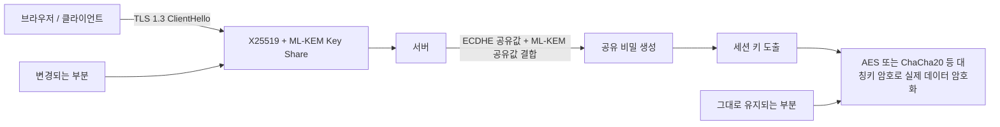

🔐 **요지**: PQC(양자내성암호)는 AES-256을 대체하는 거대한 암호 체계 교체 사업이 아닙니다.  
핵심은 RSA, DH, ECDH, ECDSA와 같은 **공개키 기반 키 교환과 전자서명 알고리즘의 전환**입니다.  
일반 웹서비스는 NIST 표준, OpenSSL, IETF TLS, 브라우저, CA/Browser Forum 생태계가 성숙하면 상당 부분 **표준 준용과 라이브러리 업그레이드**로 흡수될 수 있습니다.

문제는 PQC 자체가 아닙니다.  
문제는 이를 마치 한국이 독자적으로 거대한 암호 모델을 새로 만들어야 하거나, 모든 기업이 Y2K처럼 대규모 예산을 들여 긴급 대응해야 하는 것처럼 포장하는 **과장된 양자보안 마케팅**입니다.


<!--more-->

---

## 1) 무엇이 문제인가: PQC를 “거대한 암호 교체 사업”처럼 말하는 표현

PQC는 필요한 기술입니다.  
양자컴퓨터가 충분히 발전하면 현재 널리 쓰이는 RSA, DH, ECC 계열 공개키 암호는 구조적으로 위험해질 수 있습니다.

하지만 여기서 중요한 구분이 있습니다.

PQC는 다음을 대체하는 기술입니다.

- RSA 기반 키 교환
- DH/ECDH/ECDHE 기반 키 교환
- RSA 전자서명
- ECDSA/EdDSA 전자서명
- 공개키 인증서 체계 일부

반대로 PQC는 다음을 직접 대체하는 프로젝트가 아닙니다.

- AES-256
- 대칭키 암호 전체
- SHA-2/SHA-3 해시 전체
- TLS 전체
- 웹 보안 전체
- 데이터베이스 암호화 전체

즉, PQC는 **대칭키 암호 전체를 갈아엎는 사업**이 아니라,  
**공개키 암호 영역의 알고리즘 전환**입니다.

그런데 일부 양자보안 마케팅에서는 PQC를 마치 다음과 같이 설명합니다.

- “기존 암호체계 전체가 무너진다”
- “모든 기업이 지금 당장 양자보안 전환을 해야 한다”
- “PQC 전환은 국가적 생존 과제다”
- “독자 PQC 모델과 플랫폼이 없으면 위험하다”
- “양자보안 제품을 도입해야 안전하다”

이런 표현은 기술적 현실보다 훨씬 큰 공포를 만듭니다.

정확한 설명은 다음에 가까워야 합니다.

> PQC는 AES-256을 대체하는 사업이 아니라,  
> RSA/ECC 기반 공개키 암호의 표준 전환이다.

---

## 2) NIST 표준은 이미 방향을 제시했습니다

PQC 전환의 기준점은 이미 명확합니다.  
미국 NIST는 2024년 8월 첫 3개의 PQC 표준을 최종 발표했습니다.

| No | NIST 표준 | 알고리즘 | 성격 | 주요 용도 | 기존 대응 영역 |
|---:|---|---|---|---|---|
| 1 | FIPS 203 | ML-KEM | 키 캡슐화 메커니즘 | 키 교환 / 공유 비밀 생성 | RSA 키 교환, DH, ECDH/ECDHE |
| 2 | FIPS 204 | ML-DSA | 전자서명 | 인증, 문서·코드 서명 | RSA 서명, ECDSA |
| 3 | FIPS 205 | SLH-DSA | 해시 기반 전자서명 | 백업 성격의 전자서명 | RSA 서명, ECDSA |

여기서 핵심은 ML-KEM입니다.  
ML-KEM은 데이터를 직접 암호화하는 AES 대체물이 아니라, 공개 채널에서 안전하게 공유 비밀키를 만들기 위한 **키 캡슐화 메커니즘(KEM)** 입니다.

즉, 실제 통신에서는 다음과 같은 구조가 됩니다.

```text
공개키 기반 키 교환 또는 KEM
→ 공유 비밀키 생성
→ 대칭키 암호(AES, ChaCha20 등)로 실제 데이터 암호화
```

따라서 PQC를 “AES-256 대체”처럼 설명하는 것은 부정확합니다.

더 정확한 표현은 이것입니다.

> PQC는 실제 데이터를 암호화하는 AES를 대체하는 것이 아니라,  
> AES 같은 대칭키 암호에 사용할 공유키를 안전하게 합의하는 공개키 영역을 바꾸는 것이다.

---

## 3) OpenSSL과 웹 생태계도 이미 표준 전환 방향으로 움직이고 있습니다

웹서비스 관점에서는 더 단순합니다.

OpenSSL 3.5 계열은 ML-KEM, ML-DSA, SLH-DSA 지원과 함께 TLS 기본 key share에 X25519MLKEM768을 포함하는 방향으로 움직였습니다.  
IETF TLS 작업반도 TLS 1.3에서 ECDHE와 ML-KEM을 결합한 하이브리드 키 교환 방식, 즉 X25519MLKEM768, SecP256r1MLKEM768, SecP384r1MLKEM1024 등을 표준화 대상으로 다루고 있습니다.

이 의미는 분명합니다.

일반 웹서비스 운영자가 직접 새로운 암호 알고리즘을 설계할 필요는 없습니다.

대부분의 경우 흐름은 다음과 같습니다.

```text
NIST 표준 확정
→ IETF TLS 반영
→ OpenSSL / BoringSSL / NSS / Java / Go 등 라이브러리 반영
→ 웹서버, CDN, 브라우저 반영
→ 운영자는 버전 업그레이드와 설정 검증
```

물론 호환성 테스트는 필요합니다.  
하지만 이것은 대규모 국가 재난 대응이 아니라, 표준 생태계 변화에 따른 정상적인 업그레이드 관리에 가깝습니다.

TLS 1.2에서 TLS 1.3으로 넘어갈 때도 일부 중간 장비, 가시성, 호환성 문제가 있었습니다.  
그러나 그것이 Y2K식 대규모 국가 비상 대응 사업은 아니었습니다.

PQC의 웹 적용도 상당 부분 이 흐름과 유사하게 관리될 가능성이 높습니다.

---

## 4) 하이브리드 TLS 구조: 무엇이 실제로 바뀌는가

PQC 전환을 더 정확히 이해하려면, “무엇이 바뀌고 무엇이 그대로인지”를 봐야 합니다.

현재 웹 생태계에서 주로 논의되는 방식은 **하이브리드 키 교환**입니다.  
이는 기존 ECDHE와 ML-KEM을 함께 사용해, 고전 컴퓨터 공격과 미래 양자컴퓨터 공격을 동시에 고려하는 방식입니다.



이 다이어그램이 보여주는 핵심은 단순합니다.

- 바뀌는 것은 주로 **키 교환 영역**입니다.
- 실제 데이터 암호화에는 여전히 AES, ChaCha20 같은 **대칭키 암호**가 사용됩니다.
- 따라서 PQC는 “전체 암호체계 교체”가 아니라 “공개키 키 교환과 서명 알고리즘의 전환”입니다.

이를 한 줄로 정리하면 다음과 같습니다.

> PQC는 데이터 암호화 엔진을 바꾸는 사업이 아니라,  
> 안전한 세션 키를 만들기 위한 공개키 절차를 바꾸는 사업이다.

---

## 5) 브라우저·인증서·W3C 흐름도 “독자 모델”이 아니라 “표준 준용”입니다

PQC 전환에서 한국이 독자 모델을 만들어야 하는 영역은 제한적입니다.

브라우저와 인증서 생태계는 다음 흐름을 따릅니다.

- IETF TLS 표준
- NIST FIPS 표준
- OpenSSL/BoringSSL/NSS 같은 구현체
- CA/Browser Forum의 인증서 정책
- W3C/WICG의 Web Crypto API 확장 논의

CA/Browser Forum은 S/MIME 영역에서 ML-DSA, ML-KEM 같은 NIST 표준 알고리즘을 허용하는 방향의 논의를 진행했습니다.  
WICG의 Web Cryptography API 확장 제안도 ML-KEM, ML-DSA, SLH-DSA를 웹 애플리케이션에서 사용할 수 있는 현대 암호 알고리즘으로 추가하는 방향을 다룹니다.

이것이 보여주는 것은 하나입니다.

> PQC는 한국형 독자 암호 모델을 만드는 경쟁이 아니라,  
> 국제 표준과 웹 생태계에 맞춰 안전하게 전환하는 문제다.

따라서 “독자 PQC 모델”, “국가 고유 PQC 플랫폼”, “한국형 양자보안 체계”라는 표현은 매우 조심해서 사용해야 합니다.  
표준을 따르는 구현과 검증은 필요하지만, 독자성을 과도하게 강조하면 상호운용성 리스크가 생길 수 있습니다.

---

## 6) 공개키 사용처가 제한적이면 식별도 어렵지 않습니다

PQC 업계에서는 자주 “암호자산 식별이 어렵다”고 말합니다.  
이 말은 일부 환경에서는 맞습니다.

하지만 모든 조직에 똑같이 적용되는 말은 아닙니다.

일반 기업에서 공개키 암호를 사용하는 주요 지점은 대체로 다음 정도입니다.

| No | 공개키 사용처 | 일반적 식별 난이도 | 비고 |
|---:|---|---|---|
| 1 | 웹 TLS 인증서 | 낮음 | 인증서 스캔과 서버 설정 확인으로 파악 가능 |
| 2 | VPN / SSLVPN | 낮음~중간 | 장비 벤더 지원 여부 확인 필요 |
| 3 | SSH | 낮음 | 서버·계정 정책 확인 가능 |
| 4 | 내부 API mTLS | 중간 | 서비스 메시, API Gateway, 인증서 관리 체계 확인 필요 |
| 5 | 코드서명 | 중간 | 배포·빌드·CI/CD 체계와 연결 |
| 6 | 독자 PKI | 중간 | 내부 인증서 발급·폐기 구조 확인 필요 |
| 7 | HSM / KMS 연동 | 중간~높음 | 벤더 지원, 키 수명주기, 인증 기준 확인 필요 |
| 8 | 펌웨어·임베디드 장비 | 높음 | 교체 주기와 업데이트 경로가 느림 |
| 9 | 장기 전자서명 문서 | 높음 | 장기검증, 보존기간, 법적 효력과 연결 |

웹 관련 시스템이 대부분이고, 독자 PKI나 HSM, 임베디드 장비가 많지 않은 조직이라면 공개키 사용처는 어렵지 않게 식별될 수 있습니다.

따라서 모든 기업에 대해  
“방대한 암호자산을 자동 식별하지 않으면 큰일 난다”는 식의 표현은 과장될 수 있습니다.

더 정확한 표현은 이렇습니다.

> 공개키 사용처가 웹 TLS와 일부 표준 장비에 한정된 조직은 PQC 전환이 비교적 단순하다.  
> 반대로 독자 PKI, HSM, 장기 전자서명, 펌웨어 서명, OT·국방·우주·금융 특수 환경은 별도 점검이 필요하다.

---

## 7) 한국에서 특히 조심해야 하는 이유: ‘국산화’와 ‘예산 사업화’의 유혹

한국에서 PQC 논의가 더 조심스러운 이유는 기술 자체보다 **정책 언어** 때문입니다.

“양자”, “국가안보”, “차세대 암호”, “국산 보안”, “디지털 주권” 같은 단어는 정책 사업으로 만들기 쉽습니다.  
이런 단어들은 모두 중요하지만, 동시에 예산을 키우는 데도 매우 강한 명분이 됩니다.

문제는 여기서 발생합니다.

- 표준 전환이 독자 모델 개발처럼 포장될 수 있습니다.
- 실증 사업이 기술 검증처럼 받아들여질 수 있습니다.
- 특정 제품 도입이 국가 전략처럼 설명될 수 있습니다.
- 일반 기업까지 긴급 전환 대상처럼 과장될 수 있습니다.
- 공개키 알고리즘 전환이 전체 암호체계 붕괴처럼 설명될 수 있습니다.

정부가 해야 할 일은 한국형 독자 PQC 모델을 앞세우는 것이 아닙니다.  
오히려 다음을 분명히 해야 합니다.

```text
1. NIST 표준을 기준으로 삼는다.
2. IETF TLS와 OpenSSL·브라우저 생태계를 따른다.
3. 일반 웹서비스와 특수 인프라를 구분한다.
4. 정부 실증과 기술 검증을 구분한다.
5. 국산 구현은 표준 적합성과 상호운용성으로 평가한다.
6. 모든 기업 대상 공포 마케팅을 경계한다.
```

국산 기술이 필요 없다는 뜻이 아닙니다.  
필요한 것은 **독자 표준 경쟁**이 아니라 **표준 준수 구현, 검증 도구, 전환 가이드, 상호운용성 테스트**입니다.

---

## 8) 정부 지원 사업을 어떻게 봐야 하나

정부가 PQC 시범전환을 추진하는 것 자체가 모두 잘못된 것은 아닙니다.

예를 들어 다음 영역은 정부 실증이나 표준 준수 검증이 필요할 수 있습니다.

- 국방 특수망
- 우주·위성 통신
- 교통 인프라
- 금융 결제 인프라
- 초경량 IC 칩
- 공공 암호모듈 검증
- HSM, KMS, VPN, 보안장비 상호운용성
- 장기 전자서명·전자문서 검증 체계

이런 영역은 일반 웹서비스와 다릅니다.  
장비 수명이 길고, 교체 주기가 느리며, 장애 허용도가 낮고, 공공 인증 체계와도 연결됩니다.

따라서 제한된 범위의 실증과 전환 가이드는 필요할 수 있습니다.

문제는 그 범위를 넘어설 때입니다.

정부 지원 사업이 시장에 다음과 같은 신호를 주면 문제가 됩니다.

- “PQC 전환은 모든 기업의 긴급 과제다”
- “정부 실증을 받은 제품은 사실상 검증된 기술이다”
- “국산 PQC 플랫폼을 도입해야 안전하다”
- “표준 생태계보다 특정 업체 솔루션을 먼저 따라야 한다”
- “양자보안 제품을 도입하지 않으면 곧 위험하다”

정부 지원은 기술의 진실성을 자동으로 입증하지 않습니다.  
지원과 검증은 다른 문제입니다.

따라서 더 중요한 질문은 이것입니다.

- 무엇을 실제로 검증했는가?
- NIST 표준을 정확히 준용했는가?
- OpenSSL, IETF TLS, CA/Browser Forum 생태계와 호환되는가?
- 독자 구현이 상호운용성을 해치지 않는가?
- AES-256 대체처럼 잘못 설명하고 있지는 않은가?
- 실제로 필요한 대상이 일반 웹서비스인지, 특수 인프라인지 구분했는가?

이 질문 없이 예산만 커진다면,  
PQC는 기술 전환이 아니라 **양자보안 예산 사업화**가 될 수 있습니다.

---

## 9) “Harvest Now, Decrypt Later”도 차분히 봐야 합니다

PQC에서 자주 언급되는 위협이 HNDL, 즉 **Harvest Now, Decrypt Later**입니다.

이는 공격자가 지금 암호화된 트래픽을 저장해 두었다가,  
나중에 충분히 강력한 양자컴퓨터가 등장했을 때 복호화할 수 있다는 시나리오입니다.

이 위협은 완전히 허구가 아닙니다.  
특히 장기간 비밀성이 필요한 데이터에는 의미가 있습니다.

예를 들어:

- 국가기밀
- 군사정보
- 외교문서
- 장기 의료정보
- 장기 금융·개인정보
- 연구개발 핵심자료

이런 데이터는 지금 수집되어도 훗날 가치가 있을 수 있습니다.

하지만 모든 웹 트래픽이 같은 수준의 장기 비밀성을 갖는 것은 아닙니다.

- 일회성 로그인 세션
- 단기 API 호출
- 짧은 유효기간의 토큰
- 이미 만료된 결제 세션
- 공개성이 높은 일반 웹 요청

이런 데이터까지 모두 HNDL 위협으로 과장하면, 실제 우선순위가 흐려집니다.

정확한 접근은 다음입니다.

> HNDL은 장기 비밀성이 필요한 데이터에는 중요한 위협이다.  
> 그러나 모든 웹서비스와 모든 기업에 동일한 긴급성을 부여하는 근거로 쓰이면 과장이다.

---

## 10) 구현 난이도는 존재하지만, 그것이 공포 마케팅의 근거는 아닙니다

PQC 전환에 기술적 난이도가 전혀 없다는 뜻은 아닙니다.

다음과 같은 이슈는 실제로 관리해야 합니다.

- 키 크기와 메시지 크기 증가
- TLS 핸드셰이크 패킷 증가
- 저사양 장비 성능 영향
- HSM/KMS 지원 여부
- 인증서 체계와 장기검증 문제
- 구현체의 side-channel 대응
- 라이브러리 버전과 운영체제 배포 시차
- 레거시 장비의 호환성

그러나 이것은 “모든 기업이 지금 당장 양자보안 솔루션을 사야 한다”는 결론으로 이어지지 않습니다.

정확한 결론은 이렇습니다.

> 구현 난이도는 존재한다.  
> 그러나 그 난이도는 주로 특수 인프라, 장기 인증 체계, 저사양 장비, HSM/KMS, 펌웨어·임베디드 영역에서 커진다.  
> 일반 웹서비스는 표준 생태계 전환을 따라가며 점진적으로 관리할 수 있다.

---

## 11) PQC 업계 마케팅에서 조심해야 할 표현들

다음 표현들은 특히 신중하게 봐야 합니다.

| No | 마케팅 표현 | 점검해야 할 질문 |
|---:|---|---|
| 1 | “양자컴퓨터가 기존 암호를 모두 깬다” | 대칭키 AES까지 말하는가, 공개키 RSA/ECC를 말하는가? |
| 2 | “PQC 전면 도입” | TLS 키 교환만 바꾼 것인가, 인증서·서명·PKI까지 바꾼 것인가? |
| 3 | “독자 PQC 모델” | NIST 표준 준용인가, 독자 알고리즘인가? |
| 4 | “국가 암호체계 전환” | 실제 전환 대상이 무엇인가? |
| 5 | “양자보안 플랫폼” | 표준 구현인가, 특정 업체 종속 플랫폼인가? |
| 6 | “자동 전환” | 어떤 시스템의 어떤 알고리즘을 자동 변경하는가? |
| 7 | “양자컴퓨터로도 해독 불가능” | 수학적 안전성 가정과 구현 안전성을 구분했는가? |
| 8 | “정부 R&D 실증” | 실증과 검증을 혼동하고 있지 않은가? |

특히 “PQC 전면 도입”이라는 표현은 매우 조심해야 합니다.

TLS 키 교환에 X25519MLKEM768을 적용한 것과,  
전자서명·인증서·코드서명·PKI·HSM·장기검증 체계까지 전환한 것은 전혀 다른 수준입니다.

따라서 정확한 표현은 다음처럼 나눠야 합니다.

- TLS 하이브리드 키 교환 적용
- 인증서 알고리즘 전환
- 코드서명 전환
- 내부 PKI 전환
- HSM/KMS 지원
- 장기 전자서명 검증 체계 전환

이 구분 없이 “PQC 전면 도입”이라고 말하면, 기술 범위를 부풀릴 위험이 큽니다.

---

## 12) 구매자·투자자·정책 담당자를 위한 팩트체크 체크리스트

PQC 제품이나 정부 사업을 볼 때는 다음을 확인해야 합니다.

### 1. 무엇을 바꾸는가?

- 키 교환인가?
- 전자서명인가?
- 인증서인가?
- 코드서명인가?
- 내부 PKI인가?
- HSM/KMS인가?
- 단순 TLS 설정인가?

### 2. 어떤 표준을 따르는가?

- NIST FIPS 203
- NIST FIPS 204
- NIST FIPS 205
- IETF TLS 하이브리드 KEM
- CA/Browser Forum 정책
- W3C/WICG Web Crypto 흐름

### 3. 독자 알고리즘인가, 표준 구현인가?

독자 알고리즘은 매우 신중해야 합니다.  
암호는 독창성보다 공개 검증과 상호운용성이 중요합니다.

### 4. AES-256을 대체한다고 설명하고 있지는 않은가?

PQC는 공개키 암호 전환입니다.  
AES-256 대체처럼 설명한다면 기술 이해가 부정확하거나 마케팅 과장일 수 있습니다.

### 5. 실제 운영 범위는 어디까지인가?

- 웹서버 1대 설정 변경인가?
- CDN 레벨 적용인가?
- 결제 전 구간 적용인가?
- 모바일 앱까지 포함하는가?
- HSM과 인증서까지 포함하는가?

### 6. 성능 영향은 검증했는가?

PQC 알고리즘은 키 크기와 메시지 크기가 기존 ECC보다 커질 수 있습니다.  
따라서 다음을 확인해야 합니다.

- TLS 핸드셰이크 지연
- 패킷 크기 증가
- 모바일 환경 영향
- 저사양 장비 영향
- 장비 CPU 사용률
- 장애 발생 시 fallback 정책

### 7. 정부 실증과 기술 검증을 구분했는가?

정부 사업 선정은 시장 신호일 수는 있지만,  
그 자체가 기술의 완성도나 운영 안정성을 보증하지는 않습니다.

---

## 13) 결국 필요한 것은 ‘공포 예산’이 아니라 ‘표준 기반 전환 관리’입니다

PQC는 필요합니다.  
하지만 호들갑을 떨 문제는 아닙니다.

정확한 방향은 다음입니다.

```text
1. AES-256 대체가 아니라 공개키 전환임을 명확히 한다.
2. NIST 표준을 기준으로 삼는다.
3. OpenSSL, IETF TLS, 브라우저, CA/Browser Forum 생태계를 따른다.
4. 일반 웹서비스와 특수 인프라를 구분한다.
5. 독자 알고리즘이나 독자 플랫폼을 과도하게 강조하지 않는다.
6. HNDL 위협은 장기 비밀성 데이터 중심으로 우선순위를 정한다.
7. 정부 예산은 실증·검증·가이드·상호운용성에 집중한다.
```

특히 일반 웹서비스는 대부분 생태계 전환을 따르면 됩니다.

```text
OS / OpenSSL / 웹서버 / 프레임워크 / CDN 업데이트
→ TLS 1.3 설정 확인
→ X25519MLKEM768 등 하이브리드 KEM 지원 여부 확인
→ 인증서 정책 변화 추적
→ 호환성 테스트
```

이 정도의 문제를 Y2K처럼 포장해 모든 기업이 대규모 컨설팅과 솔루션 도입을 해야 하는 것처럼 말하는 것은 과장입니다.

---

## 14) 결론

PQC는 미래를 위해 준비해야 할 기술입니다.  
하지만 PQC를 둘러싼 일부 마케팅은 기술적 현실보다 훨씬 크게 포장되어 있습니다.

중요한 구분은 이것입니다.

- PQC는 필요하다
- 그러나 AES-256 대체 사업은 아니다
- RSA/ECC 공개키 알고리즘 전환이다
- 일반 웹서비스는 표준 생태계 전환을 따르면 된다
- 독자 모델보다 NIST 표준 준용이 중요하다
- 정부 예산은 특수 인프라, 검증, 상호운용성에 한정되어야 한다
- 모든 기업 대상 Y2K식 공포 마케팅은 경계해야 한다

결국 보안은 과장된 슬로건이 아니라  
**무엇을 실제로 바꾸는지, 어떤 표준을 따르는지, 어느 범위까지 검증했는지**의 문제입니다.

PQC는 독자 모델 경쟁이 아닙니다.  
표준 전환의 문제입니다.

그리고 표준 전환을 산업 마케팅과 공포 예산으로 부풀리는 순간,  
기술의 본질은 흐려지고 시장은 혼란스러워집니다.

따라서 이 글의 결론은 분명합니다.

> **PQC는 준비해야 하지만, 호들갑을 떨 일은 아닙니다.  
> NIST 표준과 OpenSSL·브라우저·IETF·CA/Browser Forum 생태계를 준용하면 됩니다.  
> 정부 예산은 일반 기업을 겁주는 데 쓰일 것이 아니라, 특수 인프라의 상호운용성 검증과 표준 기반 전환 가이드에 집중되어야 합니다.**

---

## 📖 함께 읽을 자료

### 표준 및 구현 자료

- [NIST: Post-Quantum Cryptography Standards](https://www.nist.gov/news-events/news/2024/08/nist-releases-first-3-finalized-post-quantum-encryption-standards)
- [NIST FIPS 203: ML-KEM](https://csrc.nist.gov/pubs/fips/203/final)
- [NIST FIPS 204: ML-DSA](https://csrc.nist.gov/pubs/fips/204/final)
- [NIST FIPS 205: SLH-DSA](https://csrc.nist.gov/pubs/fips/205/final)
- [OpenSSL 3.5 Release Notes](https://openssl-library.org/news/openssl-3.5-notes/)
- [OpenSSL 3.5 SSL_CONF_cmd Documentation](https://docs.openssl.org/3.5/man3/SSL_CONF_cmd/)
- [IETF TLS Draft: ECDHE-MLKEM for TLS 1.3](https://datatracker.ietf.org/doc/html/draft-ietf-tls-ecdhe-mlkem)
- [CA/Browser Forum: Ballot SMC013, Enable PQC Algorithms for S/MIME](https://cabforum.org/2025/07/02/ballot-smc-013/)
- [WICG: Modern Algorithms in the Web Cryptography API](https://wicg.github.io/webcrypto-modern-algos/)

### 관련 기사

- [과기정통부, 양자내성암호 PQC 지원 확대](https://zdnet.co.kr/view/?no=20260506103952)

### 관련 글

- [비복호화 탐지의 기술적 한계와 마케팅 과장](https://blog.plura.io/ko/column/limitations_of_non_decryption_detection/)
