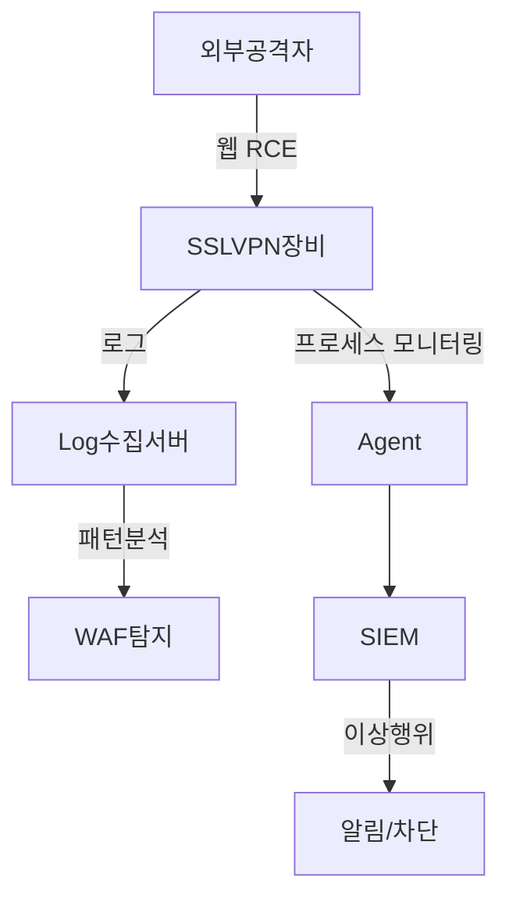

아래 내용은 **SKT 해킹 사고에서 발생한 VPN 공격**에 대한 개요와, 이를 대응하기 위한 **SSL VPN 취약점 공격 시나리오 및 Ivanti 제품군 대응 전략**을 통합하여 정리한 문서입니다.
문서는 **공격 흐름**, **탐지 포인트**, **대응 전략** 등을 종합적으로 담고 있으므로, VPN 취약점 대응 및 보안체계 수립 시 참고하시기 바랍니다.

---

# 📘 SSL VPN 취약점 공격 및 Ivanti 대응 전략 통합 문서

## ✅ 0. 배경 및 의의

최근 언론 보도에 따르면, **SKT 해킹 사고에서 VPN 공격** 정황이 확인되어 큰 이슈가 되었습니다. 국내외 주요 기업들이 사용하는 **SSL VPN 솔루션**이 지속적으로 **제로데이 공격**의 타겟이 되고 있으며, 특히 **Ivanti(구 Pulse Secure)** 제품군은 수차례 **인증 우회와 원격 코드 실행(RCE)** 취약점으로 공격을 받아왔습니다.

> **중요성**: SSL VPN은 내부망과 외부를 연결하는 **경계 지점**으로, 취약점이 악용될 경우 내부 네트워크 전반에 대한 장악이 가능합니다.
> **필요성**: 단순한 패치만으로는 최신 제로데이 공격을 완벽히 방어할 수 없으며, **웹 요청 탐지 + 시스템 행위 감시**를 결합한 **다계층 보안**이 필수적입니다.

아래에서는 이러한 배경하에, **SSL VPN 전반적인 취약점 공격 구조**와, 특히 **Ivanti(구 Pulse Secure)** 취약점에 대한 구체적인 **탐지·대응 체계**를 살펴봅니다.

---

## 🔥 1. 공격 시나리오 흐름

| 단계        | 설명                              | 예시                              |
| --------- | ------------------------------- | ------------------------------- |
| 1. 초기 접근  | HTTP(S) 기반 취약 경로 스캔             | `/dana-na/`, `/remote/fgt_lang` |
| 2. 취약점 이용 | RCE, 디렉토리 트래버설, 명령 주입           | `cmd=ping;cat+/etc/passwd`      |
| 3. 웹셸 업로드 | 취약한 업로드 경로에 `.jsp`, `.php` 등 삽입 | `/portal/uploads/shell.jsp`     |
| 4. 명령 실행  | 웹셸 또는 취약점 통해 시스템 명령 실행          | `bash -i`, `curl`, `whoami` 등   |
| 5. 백도어 설치 | BPFDoor 등 비정상 프로세스 상주화          | `nohup ./bpfd &`                |

> **적용 사례**: SKT 해킹 사건에서도 **VPN 취약점**을 통해 초기에 내부망 진입 후, **백도어 설치**와 내부 자산 스캔 등이 이루어졌을 가능성이 제기되고 있습니다.

---

## 🔍 2. 탐지 포인트 구성

### A. 웹 요청 기반 탐지 (WAF / L7 로그 필요)

| 항목               | 예시                                           | 설명                                        |
| ---------------- | -------------------------------------------- | ----------------------------------------- |
| **비정상 URL**      | `/dana-na/`, `/remote/fgt_lang?...`          | Ivanti·FortiGate 전용 경로 공격 여부 식별           |
| **POST 경로**      | 업로드 경로 + `*.jsp` 포함                          | 웹셸 업로드 시도 확인                              |
| **User-Agent**   | `curl/`, `python-requests`, `Go-http-client` | 자동화 도구(스크립트, 툴) 기반 공격 탐지                  |
| **Request Body** | `bash -i`, `wget`, `base64`, `;`, \`         | 명령 주입 패턴(쉘 명령어) 식별 및 차단( \` 포함 시 인젝션 의심 ) |

> **Tip**:
>
> * Ivanti 특정 경로(`dana-na`) 탐지 룰을 적극 활용하세요.
> * **WAF** 로그를 SIEM에 연동해, RCE 시도를 **실시간**으로 인지할 수 있습니다.

---

### B. 시스템 기반 탐지 (에이전트 or Agentless 방식)

| 항목            | 예시                                       | 설명                               |
| ------------- | ---------------------------------------- | -------------------------------- |
| **신규 프로세스**   | `ps -ef`에서 `/dev/shm/bpf*` 실행            | BPFDoor 등 백도어 실행 여부 감지           |
| **비정상 파일 생성** | `/tmp/shell.php`, `/data/runtime/tmp/tt` | 웹셸 or 임시 악성 스크립트 흔적 확인           |
| **Audit 로그**  | `execve("/bin/bash")`, `curl` 호출         | 원격 명령 실행 행위 실시간 감지               |
| **네트워크 연결**   | `netstat`, `ss`로 외부 포트 연결 확인             | 리버스 쉘, C2 연결 여부 (비정상 포트/주소 모니터링) |

> **실무 팁**:
>
> * **시스템 이벤트(Audit, Syslog 등)를 중앙화**하여 **AI/규칙 기반**으로 분석하면, 공격 흐름을 한눈에 파악할 수 있습니다.
> * Ivanti 장비는 별도 에이전트 설치가 어려울 수 있으므로, **Agentless 방식**(SSH 접근 후 스크립트 모니터링 등)도 검토해야 합니다.

---

## 🧠 3. 탐지 구성도 (Mermaid 다이어그램)

아래는 전반적인 **탐지 구성 흐름**을 간략히 표현한 Mermaid 다이어그램입니다.



---

## 🛠 4. 탐지 기술 요약

| 방식                      | 도구 예시                            | 설명                                        |
| ----------------------- | -------------------------------- | ----------------------------------------- |
| **웹 요청 분석**             | PLURA-WAF, Suricata, ModSecurity | RCE, 웹셸 업로드, 명령 주입 등 **웹 계층 공격** 실시간 탐지   |
| **시스템 행위 감시**           | auditd, osquery, Wazuh           | **파일 생성, 명령 실행, 프로세스 이상 행위** 탐지           |
| **로그 통합**               | ELK, PLURA-XDR, Splunk           | 다양한 로그를 한곳에 모아 **분석 및 시각화**               |
| **Threat Intelligence** | CVE 기반 탐지 패턴 반영                  | Ivanti, FortiGate 등 **주요 취약점 지표**(IoC) 반영 |

> **적용 요령**:
>
> 1. **웹 계층** 탐지(URI, 파라미터, User-Agent 등)
> 2. **시스템 계층** 탐지(프로세스, 파일, Audit 로그)
> 3. **로그·위협 인텔리전스 통합**을 통한 이상 징후 상관분석이 필수

---

## 🧷 5. 대표적인 SSL VPN 취약점 목록

최근 3년간 발표된 **SSL VPN** 관련 취약점 중, **SKT 해킹** 사건과 유사하게 악용된 사례가 있는 CVE를 정리했습니다.

| CVE ID             | 대상 장비        | 설명                          |
| ------------------ | ------------ | --------------------------- |
| **CVE-2018-13379** | FortiGate    | 디렉토리 트래버설 → 세션 탈취 가능        |
| **CVE-2019-11510** | Pulse Secure | 인증 우회 → 내부 파일 유출 가능         |
| **CVE-2021-22986** | F5 BIG-IP    | RCE 취약점                     |
| **CVE-2023-46805** | Ivanti       | 인증 우회 → 로그인 없이 리소스 접근 가능    |
| **CVE-2024-21887** | Ivanti       | 명령 주입 → 관리자 권한 RCE          |
| **CVE-2023-27997** | FortiGate    | Heap overflow → 임의 코드 실행 가능 |

> **참고**: Ivanti(구 Pulse Secure) 계열의 취약점(CVE-2019-11510, CVE-2023-46805 등)은 실제 **여러 해킹 그룹**이 악용 중이며, **SKT 해킹 사고**에서도 유사 기법이 사용됐을 가능성이 큽니다.

---

## 🧪 6. 탐지 룰 예시 (ELK / SIEM)

### A. URL 및 파라미터 기반 탐지

```json
{
  "query": {
    "bool": {
      "must": [
        { "wildcard": { "url.path": "*dana-na*" }},
        { "regexp": { "request.body": ".*(curl|bash|cat|wget|whoami).*" }}
      ]
    }
  }
}
```

* `url.path`에 **특정 패턴**(`dana-na`)이 포함되면 Ivanti 관련 가능성 의심.
* `request.body`에 `curl`, `bash` 등 **쉘 명령어 패턴**이 있으면 **명령 주입** 시도로 판단.

### B. User-Agent 기반 탐지

```json
{
  "query": {
    "match_phrase": {
      "http.user_agent": "python-requests"
    }
  }
}
```

* 자동화 스크립트(파이썬, Go-http-client 등)로 대량 요청을 보내는 경우 주의.

---

## 🧭 7. 대응 및 운영 전략

| 영역               | 대응 전략                                                                 |
| ---------------- | --------------------------------------------------------------------- |
| **패치 관리**        | Ivanti 포함, 모든 SSL VPN 장비의 **최신 보안 패치 적용** 필수                          |
| **접근 제어**        | GeoIP 차단, 허용된 IP 기반 제한, **2FA(다중 인증)** 도입 등                           |
| **웹 트래픽 필터링**    | WAF를 통해 `/dana-na/` 등 **공격 시그니처**가 포함된 요청 차단, 명령어 포함 패턴 검사            |
| **내부 자산 연계**     | SSL VPN 접속 이후 발생하는 **내부 시스템 로그**(AD 로그인, DB 접근, 서버 명령어 이력 등) 연계 분석 필요 |
| **침해지표(IoC) 활용** | **웹셸 파일명**, 리버스 쉘 IP, 악성 도메인 등 Threat Feed 적극 활용하여 **실시간 경고**         |

> **실무 권고**:
>
> * **패치**: 최신 보안 패치가 가장 우선순위입니다. 특히 Ivanti 제품군은 최근에도 **제로데이**가 보고되고 있으므로, **공식 패치**와 함께 임시 완화책(workaround)도 파악해야 합니다.
> * **분산 모니터링**: WAF·SIEM·시스템 로그를 **상호 연계**하여 단일 공격 징후라도 빠르게 감지하도록 **자동화 규칙** 설정이 권장됩니다.
> * **연습**: 정기적인 **침투 테스트**와 **Table-Top 시뮬레이션**을 통해 실제 공격 시나리오에 대비해야 합니다.

---

## 📌 마무리 및 권고

* **SSL VPN**은 외부와 내부를 잇는 핵심 **인증 경계**로, 공격자 입장에선 매우 매력적인 타깃입니다.
* **SKT 해킹 사고**와 같은 사례가 더 이상 반복되지 않도록, **다각도의 보안 대책**(패치·WAF·시스템 모니터링·Threat Intelligence 등)을 종합적으로 마련해야 합니다.
* **Ivanti**(구 Pulse Secure) 제품군은 2023\~2024년 지속적으로 **제로데이**가 등장하고 있으므로, **일정 주기**로 보안 공지를 확인하고 **긴급 패치**와 **대응 룰 업데이트**를 수행해야 합니다.
* **웹 기반 로그**(URL, 파라미터, User-Agent)와 **시스템 행위**(프로세스 생성, 파일 변조)를 **동시에 모니터링**해야만 **실제 침투 성공** 여부를 신속히 파악할 수 있습니다.

---

### 추가 안내

* 본 문서는 **PDF / HTML / Markdown** 등 원하는 형식으로 재가공 가능합니다.
* Ivanti VPN(구 Pulse Secure)에 특화된 **Suricata 규칙** 또는 **PLURA-XDR 룰셋**이 필요하시다면 문의해 주세요.
* **추가 질문**이나 **세부 설정 가이드**가 필요하시면 언제든지 요청 바랍니다.

---

> **문의:**
>
> * E-mail: [plura@qubitsec.com](mailto:plura@qubitsec.com)
