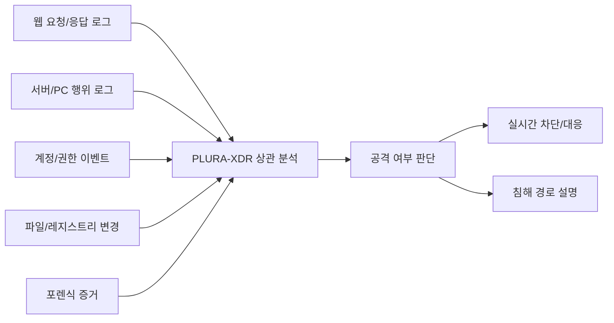

# EDR은 감시자인가, 새로운 커널 공격면인가

안티바이러스와 EDR은 현대 보안 운영에서 중요한 역할을 합니다.

악성코드 실행, 프로세스 생성, 파일 변경, 레지스트리 조작, 네트워크 연결, 권한 상승, 메모리 인젝션 같은 행위는 엔드포인트에서 발생합니다. 따라서 서버와 PC에서 일어나는 행위를 직접 관찰하지 않고는 실제 침해 여부를 판단하기 어렵습니다.

그래서 EDR은 필요합니다.

문제는 그 방식입니다.

EDR과 안티바이러스 제품은 공격을 더 깊이 보기 위해 운영체제 커널 모드에서 동작하거나, 다른 프로세스의 가상 메모리에 접근하거나, 파일·프로세스·네트워크 흐름을 가로채는 구조를 사용하기도 합니다.

이것은 보안 제품의 강력한 장점이지만 동시에 가장 위험한 지점입니다.

보안 제품은 감시자입니다.
그러나 감시자가 운영체제의 심장부에 들어가는 순간, 감시자 자신도 새로운 공격면이 됩니다.

---

## 1. EDR은 왜 운영체제 깊숙한 곳까지 들어가는가

공격자는 더 이상 단순히 악성 파일 하나를 실행하는 방식으로만 움직이지 않습니다.

공격자는 정상 프로세스를 이용하고, PowerShell이나 WMI 같은 관리 도구를 악용하며, DLL 인젝션이나 프로세스 할로잉처럼 정상 프로세스 안에 숨어들기도 합니다. 웹 취약점 공격 이후에는 웹셸 업로드, 서버 명령 실행, 권한 상승, 내부 이동, 자격 증명 탈취로 이어질 수 있습니다.

이런 공격을 탐지하려면 단순 파일 검사만으로는 부족합니다.

EDR은 다음과 같은 행위를 보려고 합니다.

| 관찰 대상       | 필요한 이유                           |
| ----------- | -------------------------------- |
| 프로세스 생성     | 악성 명령 실행, 스크립트 실행, LOLBins 악용 탐지 |
| 파일 생성·수정·삭제 | 웹셸, 랜섬웨어, 악성 도구 드롭 탐지            |
| 레지스트리 변경    | 지속성 확보, 자동 실행 등록 탐지              |
| 네트워크 연결     | C2 통신, 데이터 유출, 내부 이동 탐지          |
| 메모리 영역      | 인젝션, 은닉 실행, 자격 증명 탈취 흔적 탐지       |
| 드라이버 로드     | 커널 권한 악용, 루트킷, 보안 제품 무력화 탐지      |

이 때문에 EDR은 운영체제와 매우 가까운 위치에서 동작하려고 합니다.

사용자 모드에서 볼 수 있는 정보만으로는 부족하다고 판단되면 커널 드라이버를 사용합니다. 다른 프로세스의 메모리를 읽어야 악성 인젝션 흔적을 찾을 수 있다고 판단되면 프로세스 메모리 접근 권한을 요구합니다. 보안 제품 자신이 종료되지 않도록 자체 보호 기능도 강화합니다.

여기까지는 이해할 수 있습니다.

그러나 여기서 질문이 시작됩니다.

> 공격자를 감시하기 위해 운영체제 깊숙이 들어간 보안 제품은
> 과연 충분히 안전하게 통제되고 있는가?

---

## 2. 커널 모드는 일반 애플리케이션 영역이 아니다

운영체제는 보통 사용자 모드와 커널 모드로 나뉩니다.

일반 애플리케이션은 사용자 모드에서 동작합니다. 사용자 모드 애플리케이션은 각자 분리된 주소 공간을 갖습니다. 하나의 애플리케이션이 오류를 일으켜도 보통 다른 애플리케이션이나 운영체제 전체가 함께 멈추지는 않습니다.

반면 커널 모드는 다릅니다.

커널 모드는 운영체제 핵심이 동작하는 영역입니다. 하드웨어, 메모리, 파일 시스템, 프로세스, 네트워크 같은 핵심 자원에 접근할 수 있습니다. 커널 모드 드라이버는 일반 애플리케이션처럼 독립된 공간에 격리되어 있지 않습니다.

이 말은 곧 다음을 의미합니다.

> 커널 모드에서 동작하는 보안 제품의 오류는
> 보안 제품 하나의 오류로 끝나지 않을 수 있습니다.
> 운영체제 전체 장애로 이어질 수 있습니다.

안티바이러스나 EDR이 커널 드라이버를 설치한다는 것은 단순히 에이전트 하나를 설치하는 일이 아닙니다.

운영체제의 가장 민감한 영역에 제3자 코드를 올리는 일입니다.

---

## 3. 다른 프로세스의 메모리 접근도 매우 민감하다

프로세스 메모리는 단순한 데이터 저장 공간이 아닙니다.

그 안에는 실행 중인 코드, 세션 정보, 인증 토큰, 암호화 키, 사용자 입력, 업무 데이터, 민감 정보가 포함될 수 있습니다. 브라우저, 메신저, 업무 시스템, 데이터베이스 클라이언트, 인증 프로그램, 클라우드 도구는 모두 각자의 프로세스 메모리 안에 중요한 정보를 담고 있을 수 있습니다.

EDR이 다른 프로세스의 메모리를 읽는 이유는 분명합니다.

메모리 안에 숨어 있는 악성코드를 탐지하고, 인젝션 흔적을 확인하고, 파일 없이 실행되는 공격을 보기 위해서입니다.

그러나 이것 역시 양면성을 가집니다.

| 행위             | 보안 제품의 목적                 | 구조적 위험         |
| -------------- | ------------------------- | -------------- |
| 다른 프로세스 메모리 읽기 | 인젝션, 악성코드, 자격 증명 탈취 흔적 탐지 | 민감 정보 노출 가능성   |
| 다른 프로세스 메모리 쓰기 | 악성 행위 중단, 격리, 차단          | 정상 프로세스 손상 가능성 |
| 프로세스 후킹        | API 호출 감시, 행위 탐지          | 충돌, 우회, 오탐 가능성 |
| 커널 필터링         | 파일·네트워크·프로세스 행위 감시        | OS 안정성 저하 가능성  |

탐지를 위해 볼 수 있다는 것은, 잘못 설계되거나 침해되었을 때 그만큼 많이 노출될 수 있다는 뜻입니다.

그래서 보안 제품에는 더 높은 기준이 필요합니다.

---

## 4. CrowdStrike 사고가 남긴 교훈

2024년 7월 CrowdStrike 사고는 이 문제를 전 세계에 보여준 대표적 사례입니다.

이 사고는 해킹 공격이 아니었습니다.
보안 제품의 정상 업데이트 과정에서 발생한 장애였습니다.

CrowdStrike는 Windows 센서용 Rapid Response Content 업데이트를 배포했습니다. 그런데 센서가 기대한 입력 필드 수와 실제 업데이트가 제공한 필드 수가 맞지 않았고, 이 불일치가 out-of-bounds memory read로 이어져 Windows 시스템 크래시가 발생했습니다.

중요한 점은 이것입니다.

> 공격자가 보안 제품을 뚫은 것이 아닙니다.
> 보안 제품이 스스로 운영체제를 멈추게 만든 것입니다.

이 사건이 충격적이었던 이유는 단순히 특정 회사의 장애였기 때문이 아닙니다.

보안 제품이 운영체제 깊숙한 곳에서 동작할 때, 작은 오류 하나가 전 세계적인 장애로 확산될 수 있음을 보여주었기 때문입니다.

보안 제품은 공격을 막기 위해 설치됩니다.
그러나 보안 제품의 결함은 일반 애플리케이션 결함보다 더 큰 장애로 이어질 수 있습니다.

---

## 5. 보안 드라이버는 공격자에게도 매력적인 표적이다

커널 드라이버는 방어자에게만 유용한 것이 아닙니다.

공격자에게도 매우 유용합니다.

공격자는 직접 악성 커널 드라이버를 만들지 않아도 됩니다. 이미 합법적으로 서명된 취약 드라이버를 가져와 악용할 수 있습니다. 이를 흔히 BYOVD, Bring Your Own Vulnerable Driver라고 부릅니다.

취약한 드라이버가 커널 권한으로 로드되면 공격자는 보안 제품을 무력화하거나, 프로세스를 숨기거나, 메모리를 조작하거나, 탐지 시스템을 우회할 수 있습니다.

즉, 커널 드라이버는 다음 두 가지 얼굴을 가집니다.

| 관점     | 의미          |
| ------ | ----------- |
| 방어자 관점 | 깊은 가시성 확보   |
| 공격자 관점 | 커널 권한 확보 통로 |

그래서 커널 드라이버는 많을수록 좋은 것이 아닙니다.

필요한 경우에만, 최소한으로, 엄격하게 검증되어야 합니다.

---

## 6. OS 벤더들의 방향은 분명하다

최근 운영체제 벤더들의 방향은 점점 분명해지고 있습니다.

보안 제품이 무조건 커널 안으로 들어가는 구조를 줄이고, 가능한 한 사용자 모드 또는 제한된 시스템 확장 구조에서 동작하도록 유도하는 방향입니다.

Apple은 macOS에서 커널 확장을 줄이고, 네트워크 확장과 엔드포인트 보안 기능을 시스템 확장 방식으로 전환해 왔습니다. Microsoft 역시 CrowdStrike 사고 이후 보안 벤더가 커널 밖에서 동작할 수 있는 구조, 안전한 배포, 복구성 강화, 취약 드라이버 차단 같은 방향을 논의하고 있습니다.

이 흐름은 단순한 기술 취향의 변화가 아닙니다.

운영체제 안정성과 보안 제품의 권한을 다시 균형 있게 설계하려는 흐름입니다.

---

## 7. 그렇다면 EDR을 쓰지 말아야 하는가

아닙니다.

EDR은 필요합니다.

서버와 PC에서 실제 공격 행위를 보기 위해서는 엔드포인트 가시성이 반드시 필요합니다. 웹 공격이 서버 명령 실행으로 이어지는지, 웹셸이 업로드되는지, PowerShell이 실행되는지, 계정 탈취 이후 내부 이동이 발생하는지 확인하려면 엔드포인트 로그와 행위 분석이 필요합니다.

문제는 EDR 도입 여부가 아닙니다.

문제는 EDR을 어떤 기준으로 검증하고 운영하느냐입니다.

이제 질문은 바뀌어야 합니다.

> “EDR을 설치했는가?”
> 가 아니라,
> “EDR이 어떤 권한으로 무엇을 보고 있으며,
> 그 자체가 새로운 장애나 침투 경로가 되지 않도록 검증하고 있는가?”

EDR은 감시자여야 합니다.
운영체제 위의 절대 권력자가 되어서는 안 됩니다.

---

## 8. 실무 점검 기준

EDR과 안티바이러스 제품을 검토할 때는 탐지율만 보아서는 안 됩니다.

다음 항목을 함께 확인해야 합니다.

| 점검 항목         | 확인 질문                                            |
| ------------- | ------------------------------------------------ |
| 커널 드라이버 사용 여부 | 커널 모드 드라이버를 사용하는가? 어떤 기능에 필요한가?                  |
| 최소 권한 원칙      | 사용자 모드로 가능한 기능까지 커널에서 처리하고 있지 않은가?               |
| 프로세스 메모리 접근   | 어떤 프로세스 메모리에 접근하는가? 읽기와 쓰기 권한은 분리되어 있는가?         |
| 드라이버 검증       | 서명, WHQL, 취약 드라이버 차단, HVCI 호환성을 확인했는가?           |
| 업데이트 통제       | 전사 동시 배포가 아니라 단계적 배포, 카나리 배포, 롤백이 가능한가?          |
| 장애 시 동작       | 에이전트 장애가 OS 전체 장애로 확산되지 않도록 설계되어 있는가?            |
| 복구 가능성        | 부팅 불가 상황에서 원격 복구 또는 안전 모드 복구 절차가 있는가?            |
| 로그 투명성        | EDR 자체의 탐지·차단·오류·업데이트 로그를 중앙에서 확인할 수 있는가?        |
| 자체 보호 기능      | 자체 보호 기능이 정상 운영을 방해하거나 공격자에게 악용될 가능성은 없는가?       |
| 상관 분석         | EDR 단일 판단이 아니라 WAF, 서버 로그, 계정 로그, 포렌식 결과와 연결되는가? |

이 기준이 없다면 EDR은 강력한 보안 도구이면서 동시에 불투명한 위험 요소가 될 수 있습니다.

---

## 9. 보안 제품도 감시와 검증의 대상이다

우리는 그동안 보안 제품을 신뢰하는 데 익숙했습니다.

백신을 설치하면 안전해질 것이라고 생각했습니다.
EDR을 설치하면 침해를 막을 수 있을 것이라고 생각했습니다.
XDR을 도입하면 자동으로 상관 분석이 될 것이라고 생각했습니다.

그러나 보안 제품도 소프트웨어입니다.
보안 제품도 버그가 있습니다.
보안 제품도 취약점이 있습니다.
보안 제품도 잘못된 업데이트를 배포할 수 있습니다.
보안 제품도 공격자에게 악용될 수 있습니다.

따라서 보안 제품은 예외가 아니라 더 강하게 검증되어야 합니다.

특히 커널 모드에서 동작하거나 다른 프로세스 메모리에 접근하는 제품은 더욱 그렇습니다.

> 보안 제품은 신뢰받아야 합니다.
> 그러나 무조건 신뢰되어서는 안 됩니다.

---

## 10. PLURA-XDR 관점: 단일 감시자가 아니라 증거 기반 상관 분석

PLURA-XDR의 관점은 단순히 “EDR 하나를 더 설치하자”가 아닙니다.

공격은 한 지점에서만 발생하지 않습니다.

웹 요청에서 시작된 공격은 서버 명령 실행으로 이어질 수 있고, 서버에서 생성된 웹셸은 추가 프로세스 실행으로 이어질 수 있으며, 탈취된 계정은 내부 시스템 접근으로 이어질 수 있습니다. 이후에는 파일 접근, 데이터 다운로드, 원격 접속, 권한 상승, 내부 이동으로 확장될 수 있습니다.

따라서 보안은 단일 제품의 판단에만 의존해서는 안 됩니다.

필요한 것은 증거 기반 상관 분석입니다.

EDR은 이 구조 안에서 중요한 감시자입니다.

그러나 EDR 하나가 모든 것을 결정해서는 안 됩니다.
EDR의 탐지 결과도 WAF 로그, 서버 로그, 계정 로그, 포렌식 결과, SIEM 상관 분석과 연결되어야 합니다.

보안의 출발점은 기록입니다.
기록이 있어야 분석할 수 있고, 분석할 수 있어야 대응할 수 있으며, 대응할 수 있어야 책임을 설명할 수 있습니다.

---

## 11. 이제 평가 기준을 바꿔야 한다

지금까지 많은 보안 제품 평가는 탐지율 중심이었습니다.

“얼마나 많이 탐지하는가?”
“알려진 악성코드를 얼마나 잘 잡는가?”
“랜섬웨어를 차단하는가?”

물론 중요합니다.

그러나 이제는 더 많은 질문이 필요합니다.

| 기존 질문         | 이제 필요한 질문                       |
| ------------- | ------------------------------- |
| 탐지율이 높은가?     | 어떤 권한으로 탐지하는가?                  |
| 커널 드라이버가 있는가? | 커널 드라이버가 꼭 필요한가?                |
| 메모리 탐지를 하는가?  | 어떤 프로세스 메모리를 어떤 조건에서 접근하는가?     |
| 자체 보호가 강한가?   | 자체 보호가 운영 장애나 우회 공격면이 되지 않는가?   |
| 자동 업데이트가 빠른가? | 단계적 배포와 롤백이 가능한가?               |
| 차단 기능이 강한가?   | 오탐 시 업무 시스템을 망가뜨리지 않는가?         |
| EDR 경고가 많은가?  | 다른 로그와 상관 분석되어 실제 공격 여부를 설명하는가? |

탐지력은 중요합니다.
그러나 탐지력을 위해 운영체제 안정성과 통제 가능성을 포기해서는 안 됩니다.

---

## 12. 결론: 감시자는 감시받아야 한다

EDR은 현대 사이버보안에서 중요한 감시자입니다.

그러나 감시자가 운영체제 커널에 들어가고, 다른 프로세스의 메모리에 접근하고, 시스템 전체 동작을 가로채는 순간, 그 감시자는 더 이상 단순한 보안 도구가 아닙니다.

운영체제의 일부가 됩니다.
그리고 운영체제의 새로운 공격면이 됩니다.

이제 보안 제품을 평가하는 기준은 달라져야 합니다.

얼마나 많이 탐지하는가만 볼 것이 아니라,
얼마나 적은 권한으로 탐지하는가를 보아야 합니다.

얼마나 깊이 들어가는가만 볼 것이 아니라,
깊이 들어간 만큼 얼마나 안전하게 통제되는가를 보아야 합니다.

EDR은 필요합니다.
그러나 EDR은 검증되어야 합니다.

안티바이러스도 필요합니다.
그러나 안티바이러스도 감시되어야 합니다.

보안 제품은 예외가 아닙니다.
보안 제품도 로그를 남겨야 하고, 검증되어야 하며, 장애와 침해 가능성을 기준으로 평가되어야 합니다.

> EDR은 감시자입니다.
> 그러나 감시자 역시 감시받아야 합니다.
> 그것이 AI 해킹 시대의 실전 사이버보안입니다.

---

## 함께 읽어볼 글

* 보안의 출발점은 기록이다
* 전통적인 SOC vs PLURA-XDR 플랫폼
* WAF vs IPS vs UTM: 웹 공격 최적의 방어 솔루션 선택하기
* 웹의 전체 로그 분석은 왜 중요한가?
* PLURA-XDR을 활용한 공급망 보안 강화 방안
