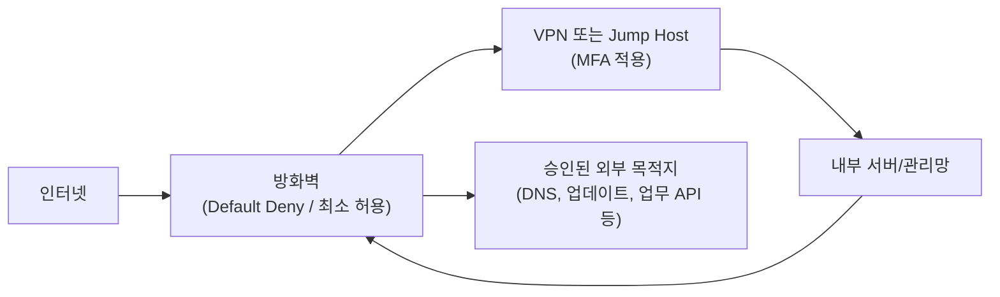

🛡️ **방화벽: 내부 보호와 트래픽 관리의 핵심**

온프레미스 환경에서 내부 네트워크를 보호하고  
**들어오고 나가는 트래픽을 관리하는 일**은  
여전히 방화벽(Firewall)이 수행해야 할 핵심 과제입니다.

하지만 방화벽은  
“설치만 하면 되는 장비”가 아닙니다.

> **어떤 트래픽을 허용하고, 어떤 트래픽을 막을 것인가**  
> 이 정책이 단순하고 명확해야  
> 방화벽은 비로소 제 역할을 합니다.

<!--more-->

---

## 먼저 요점만 정리하면

- 방화벽의 기본은 **IP/Port 통제**
- 인바운드뿐 아니라 **Outbound(내부→외부) 통제**가 매우 중요
- **Default Deny(기본 차단)** 가 출발점
- 관리 포트는 **VPN / Jump Host / MFA**를 통해서만 허용
- 룰셋이 과도하게 많아지면, 방화벽은 **보호 장비가 아니라 운영 리스크**가 됨

---

## 1. 방화벽이란 무엇인가?

방화벽은  
**네트워크 경계를 보호하는 보안 장비**로서,  
다음 역할을 수행합니다.

- **내부로 들어오는(IP/Port) 트래픽** 통제
- **내부에서 외부로 나가는 트래픽** 통제
- 네트워크 경계에서 **허용/차단 정책 적용**

### 📌 스위치 ACL(Access Control List)과 차이점은?

ACL도 IP·포트 필터링을 제공하지만,  
방화벽은 그 위에 더 많은 운영 기능을 제공합니다.

예를 들면:

- 정책 관리
- 세션 상태 추적
- 로그 및 모니터링
- 장비 수준의 관리 편의성

다만 솔직히 말하면,  
방화벽을 단순히 **IP·포트 허용/차단 용도**로만 쓰고  
다른 기능을 거의 쓰지 않는다면,  
그 일부 역할은 스위치 ACL로도 대체 가능합니다.

즉, 방화벽의 가치는  
장비 자체보다도  
**정책 운영과 관리 체계**에서 나옵니다.

---

## 2. 방화벽 운영의 핵심 원칙

### 🔹 2-1. IP/Port 정책은 가능한 단순해야 합니다

방화벽은 IP 및 포트 필터링이 기본이므로,  
정책을 단순하게 유지하는 것이 무엇보다 중요합니다.

- 룰이 너무 많으면 관리가 어려워지고
- 중복 허용이 늘어나며
- 예외가 누적되면서 보안 허점이 생깁니다

실무적으로 보면:

- **룰 100개 이상** → 관리 불가능에 가까움
- **20~30개 이내** → 이상적
- 그 이상이면 단계적으로 정리 필요

### 간단한 나쁜 예 / 좋은 예

| 구분 | 예시 |
|---|---|
| 나쁜 예 | `Any → Any → 443 허용`, `임시 허용 룰`이 계속 누적 |
| 좋은 예 | `업무 시스템별 목적 기반 룰`, `관리 포트 분리`, `예외 만료일 명시` |

즉,  
방화벽 정책은 많을수록 정교한 것이 아니라,  
**많을수록 스스로 이해할 수 없는 상태**가 되기 쉽습니다.

---

### 🔹 2-2. Outbound(내부→외부) 통제가 더 중요할 수 있습니다

많은 조직이 방화벽을  
“외부에서 내부로 들어오는 트래픽 차단 장비”로만 생각합니다.

하지만 실제 공격에서는  
**내부에서 외부로 나가는 통신**이 훨씬 중요할 수 있습니다.

왜냐하면:

- APT는 내부 악성코드가 외부 C2 서버와 통신해야 하고
- 랜섬웨어는 외부에서 키를 받거나 명령을 주고받으며
- 데이터 탈취도 결국 외부 유출 통로가 필요하기 때문입니다

따라서 Outbound 관리 없이  
Inbound만 막는 방화벽은  
**반쪽짜리 방화벽**에 가깝습니다.

### Outbound Whitelist 예시

예를 들어 내부 서버의 Outbound 허용 대상을 다음처럼 제한할 수 있습니다.

- DNS 서버
- NTP 서버
- OS/백신 업데이트 서버
- 사내 업무상 필요한 특정 API 엔드포인트
- 승인된 SaaS 서비스

반대로 다음은 기본 차단합니다.

- 임의의 해외 IP
- 불명확한 고포트 통신
- 업무상 필요 없는 직접 인터넷 접속

즉,

> **내부 시스템이 어디로 나갈 수 있는지까지 통제해야  
> 악성코드와 데이터 유출을 실질적으로 막을 수 있습니다.**

---

### 🔹 2-3. 기본 차단(Default Deny)이 출발점입니다

방화벽의 가장 중요한 원칙은  
**Default Deny** 입니다.

- 모든 인바운드 트래픽은 기본 차단
- 필요한 서비스만 예외적으로 허용
- 관리 포트는 더 엄격하게 제한

특히 SSH, RDP 같은 관리 포트는  
직접 인터넷에 노출해서는 안 됩니다.

권장되는 방식은 다음과 같습니다.

- VPN을 통해서만 접근
- 점프호스트(Jump Host)를 통해서만 접근
- MFA 적용
- 가능하면 관리자 단말 제한

즉, 관리 포트는  
“편리하게 열어두는 포트”가 아니라,  
**가장 엄격하게 다뤄야 하는 입구**입니다.

---

## 3. 기본 방화벽 흐름은 이렇게 단순해야 합니다

이 구조의 핵심은 두 가지입니다.

* 외부에서 내부로는 **최소 허용**
* 내부에서 외부로도 **승인된 목적지만 허용**

즉, 방화벽은  
들어오는 것만 막는 장비가 아니라,  
**나가는 것까지 통제하는 장비**여야 합니다.

---

## 4. 클라우드 환경에서의 방화벽 운영

🚀 방화벽 정책은  
온프레미스뿐 아니라 클라우드에서도 여전히 중요합니다.

다만 클라우드에서는  
물리 장비보다 **보안 정책의 논리 구조**가 더 중요합니다.

### ✅ 외부 서비스와 내부 서비스 분리

* 외부 서비스는 인터넷 노출 영역에서 운영
* 내부 시스템은 백엔드 API, 관리 시스템 전용 네트워크로 분리
* 외부는 WAF/CDN 앞단에서 보호
* 내부는 보안그룹/NSG/방화벽 정책으로 최소 허용

### ✅ 클라우드 네이티브 방화벽과 온프레미스 연계

예를 들어:

* AWS Security Group / NACL
* Azure NSG
* GCP Firewall Rules

은 클라우드 네이티브 방화벽 역할을 수행합니다.

하지만 중요한 것은  
클라우드에서도 여전히  
**Default Deny, 최소 허용, 세그먼트 분리** 원칙이 같다는 점입니다.

### ✅ Zero Trust 기반 접근 제어

클라우드 환경에서는 특히 다음이 중요합니다.

* NAC
* 마이크로 세그멘테이션
* 사용자/기기별 정책 적용
* 내부망도 신뢰하지 않는 구조

즉, 클라우드에서 방화벽은  
사라지는 것이 아니라,  
**더 세밀한 정책 단위로 쪼개져 적용**되는 것입니다.

---

## 5. PLURA-XDR은 여기서 어떤 역할을 하나요?

방화벽 자체는  
허용/차단 정책을 적용하는 장비입니다.

하지만 실제 운영에서는  
다음 질문이 곧바로 따라옵니다.

* 어떤 룰이 너무 넓은가?
* 어떤 Outbound 통신이 이상한가?
* 어떤 차단 로그가 실제 공격 신호인가?
* 어떤 정책이 오래되어 위험해졌는가?

이때 필요한 것이  
**로그 분석과 정책 최적화**입니다.

PLURA-XDR은 방화벽을 대체하는 것이 아니라,

* 방화벽 로그를 분석하고
* 이상한 Outbound 행위를 식별하며
* 정책 운영의 맥락을 더 잘 보게 만드는 역할

을 할 수 있습니다.

즉,  
방화벽이 **입구와 출구를 통제**한다면,  
PLURA-XDR은 그 안에서 발생하는 **행위와 로그를 해석**합니다.

---

## 6. 방화벽 관리의 핵심 원칙 요약

✔ **방화벽 룰셋 100개 이상은 관리 불가** → 20~30개 수준으로 단순화  
✔ **Outbound(내부 → 외부) 트래픽 제한** → 악성코드 외부 통신과 유출 경로 차단  
✔ **Cloud + On-prem 하이브리드 보안 체계 구축** → 내부와 외부를 구조적으로 분리  
✔ **Default Deny(기본 차단)** 원칙 유지 → 필요 서비스만 예외 허용  
✔ **Zero Trust 보안 아키텍처 기반 운영** → 내부망도 무조건 신뢰하지 않음

> 공격이 진화하면, 방어 전략도 함께 진화해야 합니다.  
> 방화벽은 여전히 가장 중요한 보안 장비이며,  
> 그 가치는 **장비 스펙이 아니라 정책 품질**에서 결정됩니다.

---

### 📖 함께 읽기

* [Zero Trust 보안 아키텍처란?](https://blog.plura.io/ko/column/zero_trust_architecture/)
* [정보보안 제품 선택 체크리스트](https://blog.plura.io/ko/column/security_product_checklist/)
* [Q06. 방화벽과 웹방화벽의 차이는 무엇인가요?](https://blog.plura.io/ko/qna/q06-firewall-vs-waf/)

---
