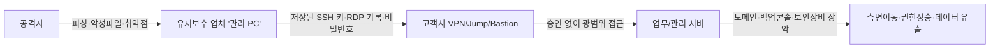

> **핵심 메시지**  
> “유지보수 **관리 PC**와 **원격 접속 절차**는 곧 **조직 내부로 통하는 문**입니다.  
> 이 문을 통제하지 않으면, **가장 약한 고리**가 **최초 침입 지점**이 됩니다.”

<!--more-->

---

## 1) 배경 — 왜 유지보수 경로가 위험한가

대부분의 기업은 규모와 관계없이 **여러 개**(소규모 2\~3개, 대기업은 수십\~수백 개)의 유지보수 업체와 계약합니다. 이들 중 상당수는 정기 점검·비상 조치 등을 이유로 **VPN, SSH, RDP, 전용 툴**을 통해 **원격 접속**을 사용합니다. 모든 유지보수 인력이 보안 숙련도가 높은 것도 아니며, **업체 관리 PC에 고객사 접근 정보(ID/비밀번호, 접속 IP 목록, 터미널 히스토리)가 저장**되는 경우가 흔합니다.  
그 결과, **관리 PC 탈취 → 저장 자격증명 도용 → 내부망 측면이동**이라는 공격이 성립합니다.

실제 역사적 사례도 이를 뒷받침합니다. 한국의 **농협(2011)** 사건에서는 **유지보수 협력사(IBM Korea) 직원 노트북**이 공격 경로로 지목되어 **핵심 시스템 실행 파일 삭제 명령**이 내려져 전산망이 마비되었고, **일부 거래 데이터가 메인·백업 서버에서 동시에 삭제**됐다는 보도도 있었습니다. 미국의 **SolarWinds(2020)** 공급망 공격에서는 **여러 미 연방 민간기관**이 영향권에 들었고, CISA가 **Emergency Directive 21-01**로 Orion 시스템의 **즉시 분리·전원차단**을 명령했습니다. ([Korea Times][1])

---

## 2) 전형적 공격 시나리오 (관리 PC → 내부망)

**취약 포인트**

| 번호 | 항목            | 내용 설명                                                   |
| -: | ------------- | ------------------------------------------------------- |
|  1 | 비밀번호/키 저장     | 터미널·RDP 클라이언트의 **자동 저장**·세션 기록으로 자격증명 노출 위험 증가          |
|  2 | 항시전원·무인 단말    | 퇴근 후에도 켜져 있는 **원격제어 가능한 단말**이 공격자에 악용될 수 있음             |
|  3 | 단일 계정·범용 권한   | 여러 고객사를 **한 계정/광범위 권한**으로 접속해 침해 시 피해가 급확산              |
|  4 | 로그 부재         | **접속 사유·세션 행위**의 **증적(log)** 미수집 → 사후분석·책임추적 불가         |
|  5 | 백업/관리 콘솔      | 침해 시 **전사 복구 지점**까지 무력화 (예: **Veeam** 취약점 악용 사례) [3][6] |
|  6 | MSP/관리 툴 연쇄위험 | **Kaseya VSA** 등 관리 플랫폼 악용 시 다수 고객 **동시 피해** 발생 [4]     |

---

## 3) 유지보수 업체의 **필수 내부 통제** (자체 준수)

아래 항목은 현장 실무 기준으로 바로 **감사·점검 항목**에 넣을 수 있도록 정돈했습니다.

1. **(베스천 PC) 자격증명 저장 금지**

   * **SSH/원격도구**: SSH 접속 **ID/Password 저장 및 자동 로그인 금지**. 세션/프로파일에 **자격증명 보존 금지**, 세션 종료 시 **캐시·클립보드·전송 파일 기록 삭제**. *(키 기반 사용 시 개인키 **평문 저장 금지**, 암호화/에이전트 **임시 보관만** 허용)*
   * **원격 데스크톱(RDP)**: **자격 증명 저장 금지**, 세션 종료 시 **캐시 삭제**.

2. **작업 종료 즉시 전원 종료(베스천 PC 포함)**

   * **데스크톱/베스천 PC**: 작업 종료 후 반드시 **완전 종료(Shutdown)**.
   * **노트북**: **절전/슬립/대기/덮개 닫기 금지**, 전원 표시등 확인 등으로 **전원 OFF 여부를 반드시 확인**.
3. **EDR 필수 (예: PLURA-EDR)**

   * 실시간 **악성코드 탐지/차단**, **무결성 보호·행위 기반 차단**, **원격지원 툴 오남용 탐지**.
4. **정기 ‘클린 이미지’ 재배포(분기 1회 이상)**

   * **목적**: 지속성(Persistence)·은닉 악성 구성 제거.
   * **기준**: 표준 골든이미지로 **재이미징/재프로비저닝**, 완료 후 **무결성 체크섬**·에이전트(EDR) 상태 확인 리포트 제출.

5. **단말 하드닝 & 패치(월 1회 이상, 긴급 패치 수시)**

   * **권한 최소화**(로컬 Admin 금지, 필요 시 임시 상승/JIT), **애플리케이션 화이트리스트** 적용.
   * OS/브라우저/원격도구 **월간 패치** + **취약점 스캔 보고** 의무.
   * **부팅·저장매체 보안**(디스크 암호화 유지, USB 실행 차단·검역) 기본.

6. **고객사·업무별 계정·권한 완전 분리**

   * **고객/환경/업무 단위**로 계정 분리, **공용 계정·공유 비밀번호 금지**.
   * **권한은 최소·기간 한정(JIT)**, **작업 종료 즉시 회수/비번 회전**.
   * 계정 발급·회수 **증적(log)** 중앙 보관.

7. **모든 원격 접속은 ‘사전 승인·한정 범위’ 원칙**

   * **티켓/작업코드 없이는 접속 불가**(승인 시간·대상 시스템·허용 명령/포트 **사전 한정**).
   * **Jump/Bastion 단일 창구** + **MFA+mTLS+디바이스 신뢰** 충족 시에만 세션 생성.
   * **세션 행위 녹화·명령/파일 이력** 중앙 저장, **세션 종료 시 캐시·클립보드 삭제** 강제.

> **권장 문구(계약·SLA 부속서 예시)**
> “유지보수 업체는 고객사 시스템 접근 시 **비밀번호·키 미보관**, **MFA 적용**, **EDR 상시 정상 동작**, **분기 1회 이상 클린 이미지 재배포**를 준수한다. **티켓 기반 승인 없이**는 접속할 수 없으며, **세션 녹화·명령/파일 이력 중앙 저장**과 **작업 종료 시 캐시/클립보드 삭제**를 이행한다. 위반 시 고객사는 **즉시 접속 중지** 및 **계약상 제재**를 적용한다.”

---

## 4) 고객사(발주사) 측 **강제·보호 통제(쉬운 버전)**

### A. 접속 창구는 하나로

* **Jump/Bastion 한 곳만 사용**(직접 VPN 접속 금지)
* **작업 승인 있어야 세션 생성**(시간/대상/범위가 티켓에 있어야 함)
* **MFA + 단말 인증서 + 사전 등록된 고정 IP**만 허용

### B. 시간과 범위를 줄이기

1. **근무·유지보수 시간 외에는 자동 차단**(캘린더/티켓과 연동)
2. **필요한 자원만 보이기**(필요한 서브넷·포트만 열기)
3. **계정은 업무·업체·고객별로 분리**, **공용 계정 금지**

### C. 도구 사용은 기록과 검증 중심

* **PAM(특권계정관리)**로 비밀번호는 **볼트에서 대여·자동회수**, **세션 녹화**
* **허용 명령/파일만 통과**(대용량 업로드는 차단 또는 검역)
* **EDR 필수**: 유지보수 PC에 **PLURA-EDR이 정상 동작**하지 않으면 **접속 불가**(장비 상태 검사)
* **모든 행위는 중앙 로그로**: 접속 승인, 세션 키, 명령 이력, 파일 전송, API 호출(**POST-body 포함**)을 수집해 **사고 시 타임라인 복원 가능**하게

### D. 운영 수칙

* **계약/보안 부속서**에 위 기준 명시, **미준수 시 접속 중지·패널티**
* **분기 1회 모의훈련**(시나리오: “업체 관리 PC 탈취”)
* **공식 가이드 채택**: CISA **원격접속 보안 가이드** 수준으로 문서화

---

## 5) 무엇을 ‘유지보수 자산’으로 보나 (예시·확장)

* **방화벽 / UTM / 게이트웨이**
  : 외부와 내부를 잇는 경계 장비 — 설정 변경이 곧 전사 리스크로 직결
* **스위치 · 라우터 · 무선 AP(네트워크 장비)**
  : 라우팅/스위칭·무선 인증 등 핵심 인프라 — 원격 관리 계정이 곧 열쇠
* **정보보안 제품 (WAF/WAAP, EDR/AV, SIEM/SOAR, DLP, IAM/PAM, 프록시 등)**
  : 보안 정책·로그·자격증명 집중 — 장악 시 탐지/차단 무력화 가능
* **백업 · DR · 스토리지 콘솔 (예: Veeam/Commvault)**
  : 복구의 최후 보루 — 콘솔 침해 시 **백업 삭제/암호화**로 전사 마비 위험 ([Group-IB][3])
* **하이퍼바이저 · 가상화 관리 (vCenter/ESXi, KVM)**
  : 다수 VM의 생명주기 제어 — 스냅샷/네트워크 변경으로 대량 피해 확산
* **데이터베이스 · 미들웨어 관리 노드**
  : 운영 데이터·자격증명 저장 — 설정/계정 변경만으로 서비스 장애·유출 가능
* **OT · 스마트팩토리 설비 원격 유지보수 단말**
  : 생산/설비 제어 — 원격 점검 채널이 위험한 초기 침입 경로

> **주의**: **백업 콘솔**과 **관리형 툴(MSP/원격관리)**이 뚫리면 피해가 **전사급으로 급확대**됩니다. **Kaseya VSA** 사례 참고. ([CISA][4])

---

## 6) 즉시 적용 체크리스트

| No | 항목                  | 기준                                    |
| -: | ------------------- | ------------------------------------- |
|  1 | **모든 3rd party 식별** | 업체·업무·접속대상·프로토콜·시간대 **전수 목록화**        |
|  2 | **접속 단일화**          | **Jump/Bastion**로만 접근, 직접 VPN 금지      |
|  3 | **승인·기간 제한**        | **티켓·JIT 승인** 없으면 접속 불가(자동 타임아웃)      |
|  4 | **디바이스 신뢰**         | **PLURA-EDR 정상 동작** + **mTLS** 없으면 차단 |
|  5 | **자격증명 금지사항**       | **비밀번호/키 저장 금지**, 세션 종료 시 캐시 삭제       |
|  6 | **권한 최소화**          | 고객·환경·업무 단위 **계정·권한 분리**              |
|  7 | **세션 녹화·로깅**        | 명령/파일/화면/POST-body **중앙 저장**          |
|  8 | **백업콘솔 보호**         | 별도 네트워크/계정/PAM, **인터넷·이중화 외부 차단**     |
|  9 | **분기 재이미징**         | 유지보수 관리 PC **분기 1회 초기화**              |
| 10 | **정책 준수 증빙**        | 분기별 **감사 리포트**와 **테이블탑 리포트** 제출       |

---

## 7) 운영팀을 위한 **로그·행위 ‘경보 신호’ 10가지**

1. 유지보수 시간 외 Jump 접속 시도(연속 인증 실패 포함)
2. 새로운 지리·ASN에서의 3rd party 로그인
3. 동일 계정의 **동시** 세션(서로 다른 IP/디바이스)
4. SSH에서 비정상 포트포워딩/PID 다중화
5. RDP 클립보드를 통한 대량 파일 반출
6. 백업콘솔에서 **보존정책 변경/삭제** 시도
7. 도메인 관리자/서비스 계정으로의 권한 상승
8. 관리 포털 API에 대한 **비정상 메서드** 호출
9. EDR 우회(드라이버 비활성, 서비스 중지)
10. 네트워크 스캔·SMB 열람 폭증(측면이동 징후)

---

## 8) 사례로 배우는 교훈

* **서드파티 자격증명/단말 = 초기 침입의 지름길**
  농협(2011) 사례처럼 **협력사 단말 경로**가 전산 마비로 이어질 수 있습니다. SolarWinds(2020)처럼 **서드파티 관리 채널**은 조직 전반으로의 **측면이동 발판**이 됩니다. ([Korea Times][1])
* **관리·백업 도구가 뚫리면 전사 피해**
  **Kaseya VSA**, **Veeam** 관련 위협처럼 관리 계층이 공격되면 **동시다발** 피해가 납니다. **Jump 단일화·PAM·망분리**가 답입니다. [4][6]
* **공식 가이드를 정책화하라**
  **CISA 원격접속 보안 가이드**와 **ED 21-01 보완지침** 수준으로 **조직 표준**을 수립하세요. ([CISA][2])

---

## 9) 결론

* **유지보수 경로는 공급망의 가장 얇은 빙판**입니다.
* **관리 PC 보안(PLURA-EDR 등), Jump 단일화, JIT 승인, mTLS/MFA, PAM, 로깅·증적화**가 **기본 방어선**입니다.
* **정책(계약) + 기술 + 운영훈련**이 함께 있어야 **지속 가능한 보안**이 됩니다.

> **한 문장 요약**: *“유지보수의 문은 **좁고 짧게**, **승인·기록·되돌림**을 기본으로.”*

---

### 📖 참고/권고 자료

* **농협 전산망 마비(2011)**: 유지보수 협력사 노트북에서 삭제 명령 → 전산 마비 / 백업 데이터 동시 삭제 보도. ([Korea Times][1])
* **SolarWinds(2020)**: CISA **Emergency Directive 21-01**로 Orion **즉시 분리·전원차단** 명령. ([CISA][3])
* **추가 참고**: 사건 개요·경과 정리(위키): 농협 전산망 마비 사태. ([위키백과][4])
* **연방 대응 종합 보고**: GAO 보고서(2022) — ED 21-01 보완지침 포함. ([정부 회계 감사국][5])
* **Veeam CVE-2023-27532**: 백업 자격증명 악용·RCE 관련 위협 동향. [3][6]
* **Kaseya VSA(2021)**: 관리 툴 악용한 공급망 랜섬웨어. [4]
* **CISA 원격접속 보안 가이드(2023)**: 정책·구성 권고. [5]

---

### 🌟 운영에 바로 쓰는 템플릿(발췌)

**[접속 표준]** “모든 유지보수 접속은 **Jump/Bastion** 1곳을 통하며, **티켓 기반 JIT 승인** 없이는 세션을 생성할 수 없다. **PLURA-EDR 정상 상태 + mTLS + MFA**가 충족되지 않으면 게이트에서 접속을 거부한다.”

**[계약 부속서]** “업체는 **비밀번호/키 미보관**, **분기 1회 재이미징**, **EDR 상시 동작**, **접속·명령·파일 이력의 중앙 저장**에 동의한다. 위반 시 접속 중지와 계약상 제재를 적용한다.”

---

[3]: https://www.group-ib.com/blog/estate-ransomware/ "Patch or Peril: A Veeam vulnerability incident"
[4]: https://www.cisa.gov/news-events/alerts/2021/07/02/kaseya-vsa-supply-chain-ransomware-attack "Kaseya VSA Supply-Chain Ransomware Attack"
[5]: https://www.cisa.gov/sites/default/files/2023-06/Guide%20to%20Securing%20Remote%20Access%20Software_clean%20Final_508c.pdf "Guide to Securing Remote Access Software"
[6]: https://www.veeam.com/kb4424 "KB4424: CVE-2023-27532"

**농협·SolarWinds 근거 링크**

* NH 사례: The Korea Times(2011) — 유지보수 노트북 → 실행파일 삭제 명령, 서비스 장애. ([Korea Times][1]) / Korea JoongAng Daily(2011) — 메인·백업 서버 동시 삭제 보도. ([Korea Joongang Daily][6])
* SolarWinds: CISA ED 21-01 본문(2020) / 보완지침 업데이트(2022). ([CISA][3])

---

[1]: https://www.koreatimes.co.kr/business/companies/20110414/nh-blames-ibm-for-network-crash?utm_source=chatgpt.com "NH blames IBM for network crash"
[2]: https://www.cisa.gov/news-events/alerts/2021/01/06/cisa-updates-emergency-directive-21-01-supplemental-guidance-and-activity-alert-solarwinds-orion?utm_source=chatgpt.com "CISA Updates Emergency Directive 21-01 Supplemental ..."
[3]: https://www.cisa.gov/news-events/directives/ed-21-01-mitigate-solarwinds-orion-code-compromise?utm_source=chatgpt.com "ED 21-01: Mitigate SolarWinds Orion Code Compromise"
[4]: https://ko.wikipedia.org/wiki/%EB%86%8D%ED%98%91_%EC%A0%84%EC%82%B0%EB%A7%9D_%EB%A7%88%EB%B9%84_%EC%82%AC%ED%83%9C?utm_source=chatgpt.com "농협 전산망 마비 사태 - 위키백과, 우리 모두의 백과사전"
[5]: https://www.gao.gov/assets/gao-22-104746.pdf?utm_source=chatgpt.com "Federal Response to SolarWinds and Microsoft Exchange ..."
[6]: https://koreajoongangdaily.joins.com/2011/04/18/finance/Server-attack-purely-destructive-Nonghyup/2935041.html?utm_source=chatgpt.com "'Server attack purely destructive': Nonghyup"
