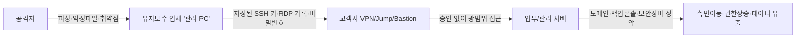

> **핵심 메시지**
> “유지보수 **관리 PC**와 **원격 접속 절차**는 곧 **조직 내부로 통하는 문**입니다.
> 이 문을 통제하지 않으면, **가장 약한 고리**가 **최초 침입 지점**이 됩니다.”

<!--more-->

---

## 1) 배경 — 왜 유지보수 경로가 위험한가

대부분의 기업은 규모와 관계없이 **여러 개**(소규모 2~3개, 대기업은 수십~수백 개)의 유지보수 업체와 계약합니다. 이들 중 상당수는 정기 점검·비상 조치 등을 이유로 **VPN, SSH, RDP, 전용 툴**을 통해 **원격 접속**을 사용합니다. 모든 유지보수 인력이 보안 숙련도가 높은 것도 아니며, **업체 관리 PC에 고객사 접근 정보(ID/비밀번호, 접속 IP 목록, 터미널 히스토리)가 저장**되는 경우가 흔합니다.
그 결과, **관리 PC 탈취 → 저장 자격증명 도용 → 내부망 측면이동**이라는 공격이 성립합니다.

실제 역사적 사례도 이를 뒷받침합니다. **Target(2013)** 침해에서 공격자는 **HVAC(냉난방) 협력업체의 자격증명**으로 초기 침입에 성공했습니다. ([상원 상업 과학 및 운송 위원회][1])
**Okta(2022)** 사건에서도 **서드파티 고객지원 업체(Sitel/Sykes)** 단말·계정이 핵심 축으로 지목되면서, Okta는 **서드파티 단말 직접 관리·제로트러스트 강화** 방침을 발표했습니다. ([okta.com][2])

---

## 2) 전형적 공격 시나리오 (관리 PC → 내부망)

**취약 포인트**

* **비밀번호/키 저장**: 터미널·RDP 클라이언트의 **자동 저장**·세션 기록.
* **항시전원·무인 단말**: 퇴근 후에도 켜져 있는 **원격제어 가능한 단말**.
* **단일 계정·범용 권한**: 여러 고객사를 **한 계정**·**광범위 권한**으로 접속.
* **로그 부재**: **접속 사유·세션 행위**의 **증적(log)** 미수집 → 사후분석 불가.
* **백업/관리 콘솔**: 침해 시 **전사 복구 지점**까지 무력화 (예: **Veeam** 취약점 악용 사례). ([Group-IB][3]; [Veeam Software][6])
* **MSP/관리 툴 연쇄위험**: **Kaseya VSA**와 같은 관리 플랫폼 악용 시 다수 고객 동시 피해. ([CISA][4])

---

## 3) 유지보수 업체의 **필수 내부 통제** (자체 준수)

아래 항목은 현장 실무 기준으로 바로 **감사·점검 항목**에 넣을 수 있도록 정돈했습니다.

1. **비밀번호·키 저장 금지**

   * SSH: `~/.ssh/config`에 `IdentitiesOnly yes`, 키는 **암호화·에이전트 잠금**.
   * RDP/원격도구: **자격 증명 저장 금지**, 세션 종료 시 **캐시 삭제**.
2. **업무 종료 즉시 전원 OFF**

   * **S3(슬립) 금지**, **디스크 암호화(Windows BitLocker / LUKS)** + **부팅 PIN** 적용.
3. **EDR 필수 (예: PLURA-EDR)**

   * 실시간 **악성코드 탐지/차단**, **무결성 보호·행위 기반 차단**, **원격지원 툴 오남용 탐지**.
4. **분기 1회 ‘클린 이미지’ 초기화**

   * **지속성(Persistence)** 제거 목적의 **정기 재이미징** 표준화.
5. **단말 하드닝 & 패치**

   * 관리자 권한 최소화, **앱 화이트리스트**, OS/브라우저/원격도구 **월간 패치**.
6. **고객사별 계정 분리**

   * **고객·환경·권한**을 나누고, **공용 계정 사용 금지**.
7. **접속은 모두 ‘승인 기반’**

   * 티켓·작업코드 없이는 **VPN/Jump 접근 불가**(JIT 승인).

> **권장 문구(계약·SLA 부속서 예시)**
> “유지보수 업체는 고객사 시스템 접근 시 **비밀번호·키 미보관**, **MFA 적용**, **EDR 상시 동작**, **분기 1회 재이미징**을 준수한다. 위반 시 고객사는 **접속 중지** 및 **계약상 제재**를 가한다.”

---

## 4) 고객사(발주사) 측 **강제·보호 통제**

사용자 요청(접근 시간 제한, EDR 강제)을 포함해 **정책·접근·증적**의 3축으로 확장했습니다.

### A. 접속 창구 자체를 바꾼다

* **Jump/Bastion 전용 게이트**: 유지보수는 **점프호스트 1곳**만 통과.
* **권한은 JIT(Just-In-Time)**: **작업 시간대·작업 대상·명령 스코프**가 없으면 **세션 불가**.
* **MFA + mTLS + 디바이스 신뢰**: **고정 IP 화이트리스트 + 단말 인증서** 필수.

### B. 시간·공간을 쪼갠다

1. **유지보수 시간 외 접근 차단** — 사용자 요청 반영

   * **캘린더/티켓 연계**로 **자동 허용/차단 스케줄링**.
2. **망·자원 최소 노출**

   * 필요한 **서브넷·포트만** (예: 특정 장비 관리포트).
3. **계정/권한 세분화**

   * **고객사 전용·업체 전용·업무 전용** 계정 **분리**. **공용 계정 금지**.

### C. 도구·행위 자체를 검증한다

* **PAM(특권계정 관리)**: 비밀번호는 **볼트에서 체크아웃/자동회수**, 세션 **레코딩**.
* **명령/콘텐트 정책**: **허용 명령·파일형식**만 통과(대용량 업로드 차단·검역).
* **EDR 강제** — 사용자 요청 2) 반영

  * **유지보수 PC는 PLURA-EDR 필수**. 미탑재·비정상 상태면 **접속 불가**(Device Posture).
* **로그 생성·증적화**

  * **접속 승인·세션 키·명령 이력·파일 전송·API 호출**을 **중앙 수집**(POST-body 포함).
  * 차후 사고 시 **타임라인 재구성** 가능해야 함.

### D. 추가 권고(요청 3))

* **계약·보안부속서**: 미준수 시 **패널티·접속정지**, 정기 **감사권** 포함.
* **테이블탑(분기별 훈련)**: “업체 관리 PC 탈취” 가정 **모의훈련**.
* **원격접속 보안 가이드 채택**: **CISA ‘원격접속 보안 가이드’** 수준으로 정책 표준화. ([CISA][5])

---

## 5) 무엇을 ‘유지보수 자산’으로 보나 (예시·확장)

* **방화벽/UTM/게이트웨이**
* **스위치·라우터·무선 AP 등 네트워크 장비**
* **정보보안 제품**: WAF/WAAP, EDR/AV, SIEM/SOAR, DLP, IAM/PAM, 프록시 등
* **백업/DR/스토리지 콘솔**: **Veeam/Commvault** 등(랜섬웨어 최우선 표적) ([Group-IB][3])
* **하이퍼바이저/가상화 관리**: vCenter/ESXi, KVM
* **데이터베이스/미들웨어 관리 노드**
* **OT/산단 설비 원격유지보수 단말**

> **주의**: **백업 콘솔**과 **관리형 툴(MSP/원격관리)** 침해 시 피해 반경이 **전사급**으로 확장됩니다. **Kaseya VSA** 사례 참고. ([CISA][4])

---

## 6) 즉시 적용 체크리스트

| No | 항목                  | 기준                                    |
| -: | ------------------- | ------------------------------------- |
|  1 | **모든 3rd party 식별** | 업체·업무·접속대상·프로토콜·시간대 **전수 목록화**        |
|  2 | **접속 단일화**          | **Jump/Bastion**로만 접근, 직접 VPN 금지      |
|  3 | **승인·기간 제한**        | **티켓·JIT 승인** 없으면 접속 불가(자동 타임아웃)      |
|  4 | **디바이스 신뢰**         | **PLURA-EDR 정상 동작** + **mTLS** 없으면 차단 |
|  5 | **자격증명 금지사항**       | **비밀번호/키 저장 금지**, 세션 종료 시 캐시 삭제       |
|  6 | **권한 최소화**          | 고객·환경·업무 단위 **계정·권한 분리**              |
|  7 | **세션 녹화·로깅**        | 명령/파일/화면/POST-body **중앙 저장**          |
|  8 | **백업콘솔 보호**         | 별도 네트워크/계정/PAM, **인터넷·이중화 외부 차단**     |
|  9 | **분기 재이미징**         | 유지보수 관리 PC **분기 1회 초기화**              |
| 10 | **정책 준수 증빙**        | 분기별 **감사 리포트**와 **테이블탑 리포트** 제출       |

---

## 7) 운영팀을 위한 **로그·행위 ‘경보 신호’ 10가지**

1. 유지보수 시간 외 Jump 접속 시도(연속 인증 실패 포함)
2. 새로운 지리·ASN에서의 3rd party 로그인
3. 동일 계정의 **동시** 세션(서로 다른 IP/디바이스)
4. SSH에서 비정상 포트포워딩/PID 다중화
5. RDP 클립보드를 통한 대량 파일 반출
6. 백업콘솔에서 **보존정책 변경/삭제** 시도
7. 도메인 관리자/서비스 계정으로의 권한 상승
8. 관리 포털 API에 대한 **비정상 메서드** 호출
9. EDR 우회(드라이버 비활성, 서비스 중지)
10. 네트워크 스캔·SMB 열람 폭증(측면이동 징후)

---

## 8) 사례로 배우는 교훈

* **서드파티 자격증명 = 초기 침입의 지름길**
  Target 침해는 **HVAC 협력사 계정**으로 시작됐습니다. **협력사 경로를 내부와 동일하게 보호**해야 합니다. ([상원 상업 과학 및 운송 위원회][1])
* **서드파티 단말의 보안 수준이 ‘당신의 보안’**
  Okta 사건 후 Okta가 **3rd party 단말을 직접 관리**하겠다고 밝힌 이유입니다. **디바이스 신뢰** 없이는 **제로트러스트**가 완성되지 않습니다. ([okta.com][2])
* **관리·백업 도구가 뚫리면 전사 피해**
  **Kaseya VSA**, **Veeam** 관련 위협처럼 관리 계층이 공격되면 **동시다발** 피해가 납니다. **Jump 단일화·PAM·망분리**가 답입니다. ([CISA][4]; [Veeam Software][6])
* **공식 가이드를 정책화하라**
  **CISA 원격접속 보안 가이드**를 참고해 **조직 표준**으로 내재화하세요. ([CISA][5])

---

## 9) 결론

* **유지보수 경로는 공급망의 가장 얇은 빙판**입니다.
* **관리 PC 보안(PLURA-EDR 등), Jump 단일화, JIT 승인, mTLS/MFA, PAM, 로깅·증적화**가 **기본 방어선**입니다.
* **정책(계약) + 기술 + 운영훈련**이 함께 있어야 **지속 가능한 보안**이 됩니다.

> **한 문장 요약**: *“유지보수의 문은 **좁고 짧게**, **승인·기록·되돌림**을 기본으로.”*

---

### 📖 참고/권고 자료

* **Target 침해(2013)**: HVAC 협력업체 계정 악용. ([상원 상업 과학 및 운송 위원회][1])
* **Okta(2022)**: 서드파티 단말·계정 이슈 → 3rd party 단말 직접 관리 선언. ([okta.com][2])
* **Veeam CVE-2023-27532**: 백업 자격증명 악용·RCE 관련 위협 동향. ([Group-IB][3]) · ([Veeam Software][6])
* **Kaseya VSA(2021)**: 관리 툴 악용한 공급망 랜섬웨어. ([CISA][4])
* **CISA 원격접속 보안 가이드(2023)**: 정책·구성 권고. ([CISA][5])

---

### 🌟 운영에 바로 쓰는 템플릿(발췌)

**[접속 표준]** “모든 유지보수 접속은 **Jump/Bastion** 1곳을 통하며, **티켓 기반 JIT 승인** 없이는 세션을 생성할 수 없다. **PLURA-EDR 정상 상태 + mTLS + MFA**가 충족되지 않으면 게이트에서 접속을 거부한다.”

**[계약 부속서]** “업체는 **비밀번호/키 미보관**, **분기 1회 재이미징**, **EDR 상시 동작**, **접속·명령·파일 이력의 중앙 저장**에 동의한다. 위반 시 접속 중지와 계약상 제재를 적용한다.”

---

[1]: https://www.commerce.senate.gov/services/files/24d3c229-4f2f-405d-b8db-a3a67f183883 "A “Kill Chain” Analysis of the 2013 Target Data Breach"
[2]: https://www.okta.com/blog/company-and-culture/okta-concludes-its-investigation-into-the-january-2022-compromise/ "Okta Concludes its Investigation Into the January 2022 ..."
[3]: https://www.group-ib.com/blog/estate-ransomware/ "Patch or Peril: A Veeam vulnerability incident"
[4]: https://www.cisa.gov/news-events/alerts/2021/07/02/kaseya-vsa-supply-chain-ransomware-attack "Kaseya VSA Supply-Chain Ransomware Attack"
[5]: https://www.cisa.gov/sites/default/files/2023-06/Guide%20to%20Securing%20Remote%20Access%20Software_clean%20Final_508c.pdf "Guide to Securing Remote Access Software"
[6]: https://www.veeam.com/kb4424 "KB4424: CVE-2023-27532"
