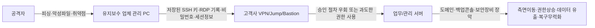

> **핵심 메시지**  
> “유지보수 **관리 PC**와 **원격 접속 절차**는 곧 **조직 내부로 통하는 문**입니다.  
> 이 문을 통제하지 않으면, **가장 약한 고리**가 **최초 침입 지점**이 됩니다.”

<!--more-->

---

## 1) 배경 — 왜 유지보수 경로가 위험한가

대부분의 기업은 규모와 관계없이 **여러 개**의 유지보수 업체와 계약합니다.  
소규모 기업도 2~3개, 대기업은 수십~수백 개의 외부 업체와 연결되어 있습니다. 이들 중 상당수는 정기 점검, 장애 조치, 긴급 대응을 이유로 **VPN, SSH, RDP, 전용 툴**을 통해 **원격 접속**을 사용합니다.

문제는 이 경로가 단지 “편의 기능”이 아니라는 점입니다.  
많은 조직에서 유지보수 업체의 **관리 PC**에는 고객사 접속 정보, 접속 IP 목록, 세션 기록, 터미널 히스토리, 임시 파일, 심지어 저장된 자격증명까지 남아 있습니다. 결국 공격자는 고객사의 서버를 바로 공격하지 않아도 됩니다. 먼저 **유지보수 업체 단말**을 장악한 뒤, 거기에 남아 있는 정보와 접속 수단을 이용해 고객사 내부망으로 들어가면 됩니다.

이 때문에 실제 공급망 공격은 종종 다음과 같은 경로를 따릅니다.

**유지보수 업체 관리 PC 탈취 → 저장된 자격증명 확보 → 고객사 원격 접속 경로 이용 → 내부망 측면 이동 → 핵심 자산 장악**

실제 사례도 이를 뒷받침합니다.  
한국의 **농협(2011)** 사건에서는 **유지보수 협력사 직원 노트북**이 공격 경로로 지목되었고, 핵심 시스템에 삭제 명령이 내려져 전산망이 마비되었습니다. 미국의 **SolarWinds(2020)** 사건은 특정 제품 업데이트를 경유한 공급망 공격이 얼마나 넓게 확산될 수 있는지를 보여주었습니다. 또 **Kaseya VSA** 사례는 관리형 도구나 원격 관리 체계 자체가 뚫릴 경우 다수 고객에게 피해가 동시에 번질 수 있음을 보여줬습니다.

즉, 유지보수 경로는 보조 채널이 아닙니다.  
그 자체가 **가장 현실적인 최초 침입 경로 중 하나**입니다.

---

## 2) 전형적 공격 시나리오 (관리 PC → 내부망)

```mermaid
flowchart LR
  A[공격자] -->|피싱·악성파일·취약점| B[유지보수 업체 관리 PC]
  B -->|저장된 SSH 키·RDP 기록·비밀번호·세션정보| C[고객사 VPN/Jump/Bastion]
  C -->|승인 절차 우회 또는 과도한 권한 사용| D[업무/관리 서버]
  D -->|도메인·백업콘솔·보안장비 장악| E[측면이동·권한상승·데이터 유출·복구무력화]
```

이 시나리오가 위험한 이유는 공격자가 악성코드를 많이 들여오지 않아도 되기 때문입니다.  
이미 열려 있는 원격 접속 경로와 이미 허용된 관리 도구를 이용하면, 정상 행위처럼 보이면서도 깊숙이 들어갈 수 있습니다.

**취약 포인트**

| 번호 | 항목            | 내용 설명                                                |
| -: | ------------- | ---------------------------------------------------- |
|  1 | 비밀번호/키 저장     | 터미널·RDP 클라이언트의 자동 저장, 세션 기록, 키 파일 보관으로 자격증명 노출 위험 증가 |
|  2 | 항시전원·무인 단말    | 퇴근 후에도 켜져 있는 관리 PC가 원격제어 거점으로 악용될 수 있음               |
|  3 | 단일 계정·범용 권한   | 여러 고객사를 한 계정 또는 넓은 권한으로 관리하면 침해 시 피해가 급확산            |
|  4 | 로그 부재         | 접속 사유, 세션 행위, 파일 전송 이력이 없으면 사후 분석과 책임 추적이 불가능        |
|  5 | 백업/관리 콘솔      | 침해 시 복구 지점까지 무력화되어 랜섬웨어 피해가 전사급으로 확대될 수 있음           |
|  6 | MSP/관리 툴 연쇄위험 | 관리 플랫폼이나 원격 관리 툴이 뚫리면 다수 고객이 동시에 피해를 볼 수 있음          |

---

## 3) 유지보수 업체의 **필수 내부 통제** (자체 준수)

아래 항목은 유지보수 업체 스스로 반드시 갖춰야 할 최소 기준입니다.  
이 수준은 더 이상 권고가 아니라, 고객사를 상대하는 업체라면 계약과 감사에서 검증받아야 할 기본선에 가깝습니다.

### 1. 관리 PC(베스천 PC)에는 자격증명을 저장하지 않는다

가장 먼저 금지해야 할 것은 **편의성 명목의 저장 기능**입니다.

* **SSH/원격 도구**

  * ID/Password 저장 및 자동 로그인 금지
  * 세션 프로파일에 자격증명 보존 금지
  * 세션 종료 시 캐시, 클립보드, 전송 파일 이력 삭제
  * 키 기반 인증을 쓰더라도 개인키 평문 저장 금지
  * 키는 암호화 저장 또는 에이전트 기반 임시 보관만 허용

* **RDP**

  * 자격 증명 저장 금지
  * 최근 접속 목록, 캐시, 드라이브 매핑 정보 최소화
  * 세션 종료 시 관련 흔적 삭제

공격자는 종종 유지보수 업체를 해킹한 뒤 별도의 추가 공격 없이 저장된 정보만 수집해 고객사로 이동합니다. 따라서 자격증명 저장 금지는 가장 기본이면서도 가장 효과적인 방어입니다.

### 2. 작업 종료 즉시 전원을 종료한다

관리 PC가 계속 켜져 있다는 것은 공격자에게 **항상 대기 중인 침투 거점**을 제공하는 것과 같습니다.

* 데스크톱, 점프 PC, 베스천 PC는 작업 종료 후 반드시 **완전 종료**
* 노트북은 절전, 슬립, 덮개 닫기 상태를 종료로 간주하지 않음
* 전원 표시등, 원격 관리 상태, 네트워크 연결 상태를 통해 실제 종료 여부 확인

특히 무인 상태로 켜진 단말은 공격자가 야간이나 휴일에 악용하기 쉬운 조건입니다.

### 3. EDR은 선택이 아니라 필수다

유지보수 관리 PC는 일반 사무용 PC가 아닙니다.  
그 PC는 고객사 내부로 연결되는 **고위험 운영 단말**입니다. 따라서 백신 수준이 아니라 **행위 기반 탐지와 운영 흔적 확보**가 가능한 EDR이 필요합니다.

여기서 중요한 것은 제품명이 아니라 기능입니다.

* 악성코드 탐지와 차단
* 프로세스 행위, 네트워크 연결, 원격지원 툴 사용 흔적 확보
* 서비스 중지, 드라이버 비활성화, 보안 우회 시도 탐지
* 이상 명령 실행, 비정상 파일 생성, 측면 이동 징후 탐지
* 사고 시 포렌식과 타임라인 복원이 가능한 로그 확보

이 지점에서 **PLURA-EDR** 같은 도구는 단순한 “에이전트 설치 여부”보다,  
**원격 지원 툴 오남용**, **행위 기반 탐지**, **증적 보존**, **관리 PC 보호 상태 확인**이라는 점에서 의미가 있습니다. 유지보수 경로 문제는 결국 “누가 접속했는가”보다 “그 접속이 실제로 무엇을 했는가”를 남겨야 해결되기 때문입니다.

### 4. 정기적으로 클린 이미지 재배포를 실시한다

유지보수 관리 PC는 오랜 기간 여러 고객사 환경을 오가며 사용되기 쉽습니다.  
이 과정에서 불필요한 도구, 설정, 세션 잔재, 악성 지속성 요소가 누적될 수 있습니다.

따라서 분기 1회 이상은 다음을 수행해야 합니다.

* 표준 골든 이미지 기반 재이미징 또는 재프로비저닝
* 재설치 후 필수 보안 에이전트 정상 동작 여부 확인
* 무결성 체크섬 또는 배포 완료 리포트 제출
* 비인가 프로그램, 저장 자격증명, 이전 고객사 접속 흔적 제거 확인

이 절차는 “감염되었는지 의심될 때만” 하는 것이 아니라,  
**감염 여부와 무관하게 정기적으로 상태를 초기화하는 운영 통제**여야 합니다.

### 5. 단말 하드닝과 패치를 운영 기준으로 관리한다

유지보수 단말이 여러 고객사에 접근한다면, 그 단말 자체가 이미 중요한 보안 자산입니다.

필수 기준은 다음과 같습니다.

* 로컬 관리자 권한 상시 부여 금지
* 필요 시에만 임시 권한 상승(JIT)
* 애플리케이션 화이트리스트 또는 실행 통제
* OS, 브라우저, 원격도구 월간 패치
* 긴급 취약점 발생 시 수시 패치
* 디스크 암호화 유지
* USB 실행 통제 및 이동식 저장매체 검역
* 취약점 스캔 결과와 개선 내역 보관

### 6. 고객사·업무·환경별 계정과 권한을 완전히 분리한다

이 항목은 실제 현장에서 가장 자주 무너지는 부분입니다.  
운영상 편의를 위해 하나의 엔지니어 계정, 하나의 공용 계정, 하나의 범용 관리자 권한으로 여러 고객사를 관리하면, 침해 한 번으로 피해가 연쇄 확산됩니다.

따라서 다음을 원칙으로 해야 합니다.

* **고객사별 계정 분리**
* **운영/개발/테스트 환경 분리**
* **업무 유형별 권한 분리**
* **공용 계정, 공유 비밀번호 사용 금지**
* **최소 권한 부여**
* **작업 종료 즉시 회수 또는 비밀번호 회전**
* **계정 발급, 승인, 회수 이력 중앙 보관**

권한은 넓을수록 편한 것이 아니라, 침해 시 피해 반경이 커지는 것입니다.

### 7. 모든 원격 접속은 사전 승인과 한정 범위를 전제로 해야 한다

“급해서 먼저 접속하고 나중에 보고한다”는 관행은 결국 통제의 부재를 의미합니다.

원칙은 분명해야 합니다.

* 티켓 또는 작업코드 없이는 접속 불가
* 승인된 시간, 대상 시스템, 허용 포트, 작업 범위를 사전에 명시
* Jump/Bastion을 통한 단일 진입 구조 사용
* MFA, mTLS, 디바이스 신뢰 조건 충족 시에만 세션 허용
* 세션 행위 녹화, 명령 이력, 파일 전송 이력 중앙 저장
* 세션 종료 후 캐시와 클립보드 정리 강제

즉, 원격 접속은 “연결”이 아니라 “승인된 작업 세션”이어야 합니다.

> **권장 문구(계약·SLA 부속서 예시)**  
> “유지보수 업체는 고객사 시스템 접근 시 비밀번호 및 키를 단말에 저장하지 않으며, MFA 적용, EDR 상시 정상 동작, 분기 1회 이상 클린 이미지 재배포를 준수해야 한다. 티켓 기반 승인 없이 접속할 수 없고, 모든 세션에 대해 녹화·명령 이력·파일 전송 이력을 중앙 저장해야 하며, 작업 종료 시 캐시·클립보드·임시 파일을 삭제해야 한다. 위반 시 고객사는 즉시 접속을 중지하고 계약상 제재를 적용할 수 있다.”

---

## 4) 고객사(발주사) 측 **강제·보호 통제**

이 글의 핵심은 여기서 완성됩니다.  
유지보수 업체가 스스로 잘하길 기대하는 것만으로는 부족합니다. 고객사는 계약, 기술, 운영 측면에서 **강제 가능한 통제 구조**를 만들어야 합니다.

### A. 접속 창구는 반드시 하나로 제한해야 한다

고객사는 원격 접속 경로를 여러 개 두면 안 됩니다.  
VPN, 개별 RDP, 장비별 SSH, 제조사 전용 툴이 제각각 열려 있으면 통제가 아니라 방치에 가깝습니다.

원칙은 단순합니다.

* **Jump/Bastion 한 곳만 사용**
* **직접 VPN 접속 금지**
* **사전 승인된 세션만 생성**
* **MFA + 단말 인증서 + 등록된 IP 또는 관리망만 허용**

즉, 유지보수 경로를 “연결 가능한 곳”이 아니라 “통제 가능한 하나의 문”으로 바꾸어야 합니다.

### B. 시간과 범위를 최대한 줄여야 한다

유지보수 접속은 상시 열려 있어서는 안 됩니다.

* 근무 시간 또는 승인된 유지보수 시간 외에는 자동 차단
* 캘린더, 티켓, 작업 승인과 연동해 세션 허용
* 필요한 자원만 접근 허용
* 필요한 서브넷, 포트, 시스템만 보이게 구성
* 고객사별, 업무별, 업체별 계정 분리
* 공용 계정 금지
* 기간 한정 권한(JIT) 적용

핵심은 “언제든 접속 가능”이 아니라 “필요할 때만, 필요한 범위만”입니다.

### C. 고객사는 계약서에 반드시 넣어야 한다

실제 많은 사고는 기술 문제가 아니라 계약과 책임 경계의 부재에서 커집니다.  
따라서 고객사는 보안 부속서나 SLA에 아래 조항을 넣어야 합니다.

**필수 계약 조항 예시**

1. 유지보수 업체는 고객사 접근용 관리 PC에 자격증명을 저장할 수 없다.
2. 유지보수 업체는 EDR이 정상 동작하는 등록 단말만 사용할 수 있다.
3. 모든 원격 작업은 사전 승인 티켓에 근거해야 한다.
4. 세션 녹화, 명령 이력, 파일 전송 로그를 보관해야 한다.
5. 작업 종료 후 접근 권한은 자동 회수되거나 즉시 비활성화되어야 한다.
6. 사고 또는 정책 위반 시 고객사는 즉시 접속 중단과 현장 점검을 요구할 수 있다.
7. 유지보수 업체는 분기별 보안 점검 결과와 단말 재이미징 이행 내역을 제출해야 한다.
8. 고객사는 필요 시 유지보수 단말 보안 상태를 검증할 수 있어야 한다.

이 조항이 없으면 사고 후 “그건 업체 책임”, “그건 고객 책임”만 남고 실제 방어는 남지 않습니다.

### D. PAM과 세션 통제를 기본으로 삼아야 한다

유지보수 계정은 일반 계정이 아닙니다.  
많은 경우 관리자 권한, 장비 제어 권한, 백업 콘솔 권한, 네트워크 변경 권한까지 연결됩니다. 따라서 특권계정은 사람이 기억하고 입력하는 방식보다 **PAM 기반의 임시 대여와 자동 회수 구조**가 적합합니다.

고객사가 적용해야 할 기준은 다음과 같습니다.

* 비밀번호는 볼트에서 대여하고 자동 회수
* 관리자 비밀번호를 사람에게 장기 제공하지 않음
* 세션 녹화 기본 적용
* 명령 실행 이력 저장
* 대용량 업로드, 외부 반출, 스크립트 실행에 대한 추가 승인 또는 검역
* 작업 종료 즉시 세션 종료 및 토큰 폐기

유지보수는 결국 “권한의 위임”입니다.  
따라서 위임은 항상 기록과 회수 기능을 동반해야 합니다.

### E. 로그는 인증 로그만이 아니라 행위 로그까지 남겨야 한다

원격 접속 보안이 실패하는 이유 중 하나는, 많은 조직이 “누가 로그인했는가”만 보고 끝나기 때문입니다.  
하지만 실제 사고 대응에 필요한 것은 “로그인 후 무엇을 했는가”입니다.

그래서 고객사는 다음 로그를 중앙에서 남겨야 합니다.

* 접속 승인 로그
* 인증 로그
* 세션 생성 및 종료 로그
* 명령 실행 이력
* 파일 업로드/다운로드 이력
* 화면 녹화 또는 세션 녹화
* 장비 설정 변경 이력
* API 호출 이력
* 웹 관리 콘솔의 요청/응답 로그
* 가능하다면 POST-body를 포함한 상세 웹 로그

이 지점에서 PLURA-EDR과 PLURA 계열 로그 체계는 의미가 있습니다.  
유지보수 단말의 프로세스 행위와 고객사 측 웹·시스템 로그를 함께 보면, 단순 로그인 기록이 아니라 **행위 기반 타임라인**으로 사고를 재구성할 수 있기 때문입니다.

### F. 유지보수 업체 단말의 상태를 검증한 뒤에만 접속을 허용해야 한다

고객사는 더 이상 “업체 직원이면 접속 허용”이라는 방식으로 운영하면 안 됩니다.

접속 전 확인해야 할 항목은 명확합니다.

* 등록된 단말인지
* EDR이 정상 동작하는지
* 보안 서비스가 중지되지 않았는지
* 디스크 암호화가 켜져 있는지
* 최근 보안 업데이트가 적용됐는지
* 금지된 원격제어 도구나 비인가 프로그램이 없는지

즉, 사람 신뢰가 아니라 **디바이스 신뢰**가 선행되어야 합니다.

### G. 백업 콘솔과 관리 콘솔은 별도 보호 구역으로 다뤄야 한다

많은 조직이 서버 접근 통제는 신경 쓰면서도, 정작 더 위험한 **백업 콘솔**, **가상화 관리 노드**, **보안 장비 관리 콘솔**은 상대적으로 느슨하게 운영합니다. 그러나 공격자 입장에서는 여기가 훨씬 가치가 큽니다.

고객사는 다음을 분리해야 합니다.

* 백업 콘솔 전용 계정
* 인터넷 직접 접근 차단
* 별도 네트워크 또는 관리망 분리
* PAM 적용
* 다중 승인
* 세션 녹화
* 변경 이력 보존

복구 체계가 뚫리면 사고는 단순 침입이 아니라 전사 마비가 됩니다.

### H. 운영 수칙과 훈련까지 포함해야 한다

문서는 있어도 훈련이 없으면 실제로 작동하지 않습니다.

고객사는 최소한 다음을 정기적으로 수행해야 합니다.

* 분기 1회 유지보수 경로 점검
* 분기 1회 업체 단말 보안 상태 검증
* 반기 또는 분기 기준 모의훈련
* 시나리오 예시: “유지보수 업체 관리 PC 탈취”, “백업 콘솔 비정상 접속”, “업무시간 외 긴급 접속 요청”
* 사고 발생 시 접속 차단, 세션 종료, 계정 회수, 로그 보존 절차 문서화

결국 고객사가 해야 할 일은 단순히 “접속을 허용하되 조심하라”가 아닙니다.  
**구조적으로 통제 가능한 유지보수 모델**을 만드는 것입니다.

---

## 5) 무엇을 ‘유지보수 자산’으로 보나

유지보수 대상은 서버 몇 대에 그치지 않습니다.  
오히려 조직 전체 운영을 좌우하는 관리 자산이 여기에 포함됩니다.

* **방화벽 / UTM / 게이트웨이**
  외부와 내부를 잇는 경계 장비입니다. 설정 변경 하나가 전사 리스크로 이어질 수 있습니다.

* **스위치 · 라우터 · 무선 AP**
  네트워크 자체의 구조를 바꾸거나 감시 지점을 우회할 수 있습니다.

* **정보보안 제품 (WAF, EDR, SIEM, IAM, PAM, 프록시 등)**
  보안 정책과 로그, 자격증명이 집중된 영역입니다. 이 계층이 장악되면 탐지와 차단이 무력화될 수 있습니다.

* **백업 · DR · 스토리지 콘솔**
  복구의 최후 보루입니다. 여기까지 침해되면 삭제, 암호화, 보존정책 변경으로 전사 복구가 어려워질 수 있습니다.

* **하이퍼바이저 · 가상화 관리 노드**
  다수 시스템의 생명주기를 한 번에 제어할 수 있습니다.

* **데이터베이스 · 미들웨어 관리 노드**
  서비스 운영 데이터와 주요 자격증명이 집중되는 영역입니다.

* **OT · 스마트팩토리 원격 유지보수 단말**
  침해 시 서비스 장애를 넘어 생산 차질과 물리적 리스크로 번질 수 있습니다.

---

## 6) 즉시 적용 체크리스트

| No | 항목              | 기준                                       |
| -: | --------------- | ---------------------------------------- |
|  1 | 모든 3rd party 식별 | 업체, 업무, 접속 대상, 프로토콜, 시간대, 담당자 전수 목록화     |
|  2 | 접속 단일화          | Jump/Bastion 1곳만 사용, 직접 VPN 금지           |
|  3 | 승인 기반 접속        | 티켓 또는 JIT 승인 없으면 접속 불가                   |
|  4 | 디바이스 신뢰         | 등록 단말 + EDR 정상 동작 + 단말 인증 조건 미충족 시 차단    |
|  5 | 자격증명 저장 금지      | SSH/RDP/전용 툴 저장 금지, 종료 시 캐시·클립보드·임시파일 정리 |
|  6 | 계정 분리           | 고객/업무/환경별 계정 분리, 공용 계정 금지                |
|  7 | 최소 권한           | 필요한 범위만, 필요한 시간만 허용                      |
|  8 | 세션 녹화·중앙 로그     | 명령, 파일 전송, 화면, API, 웹 요청 이력까지 중앙 저장      |
|  9 | 백업·관리 콘솔 보호     | 별도 계정, 별도 네트워크, PAM, 다중 승인 적용            |
| 10 | 정기 재이미징         | 분기 1회 이상 클린 이미지 재배포 및 결과 제출              |
| 11 | 계약 강제력          | 미준수 시 접속 중지, 시정 요구, 패널티 조항 명시            |
| 12 | 모의훈련            | 분기 1회 이상 유지보수 경로 사고 대응 훈련                |

---

## 7) 운영팀을 위한 **로그·행위 경보 신호 10가지**

| No | 경보 신호                  | 탐지 포인트(예시)             | 1차 대응              |
| -: | ---------------------- | ---------------------- | ------------------ |
|  1 | 유지보수 시간 외 Jump 접속 시도   | 인증 실패 횟수, 비인가 시간대 접속   | 계정 일시 잠금, 승인 티켓 확인 |
|  2 | 새로운 국가·ASN에서 로그인       | GeoIP/ASN 변화           | 추가 인증 또는 차단        |
|  3 | 동일 계정 동시 세션            | 서로 다른 IP·디바이스에서 동시 접속  | 세션 종료, 비밀번호 회전     |
|  4 | 비정상 SSH 포트포워딩          | `ssh -L/-R` 사용, 비인가 포트 | 세션 차단, 정책 점검       |
|  5 | RDP 클립보드·드라이브 매핑 통한 반출 | 대용량 전송, 가상 채널 사용       | 세션 종료, 파일 격리       |
|  6 | 백업 보존정책 변경 또는 삭제       | Retention 변경, Job 삭제   | 롤백, 콘솔 잠금          |
|  7 | 권한 상승                  | AD 그룹 추가, 관리자 권한 부여    | 상승 취소, 세션 종료       |
|  8 | 관리 포털 API 이상 호출        | 비정상 메서드, 4xx/5xx 급증    | API 키 회전, 소스 차단    |
|  9 | EDR 우회 시도              | 서비스 중지, 제거 시도, 드라이버 오류 | 호스트 격리, 재등록        |
| 10 | 측면 이동 징후               | 스캔, SMB 열람 폭증, 다수 접속   | IP 격리, 계정 잠금       |

---

## 8) 사례로 배우는 교훈

농협 사례는 협력사 단말이 어떻게 전산 마비로 이어질 수 있는지를 보여줍니다.  
SolarWinds는 서드파티 관리 경로가 얼마나 광범위한 확산 경로가 될 수 있는지를 보여줬습니다.  
Kaseya VSA는 관리 플랫폼 하나가 다수 고객의 공통 위험이 될 수 있음을 보여줬습니다.

이 사례들의 공통점은 단순합니다.

**문제는 원격 접속 자체가 아니라, 통제되지 않은 원격 접속입니다.**

접속 경로가 많고, 권한이 넓고, 기록이 부족하고, 책임 경계가 모호할수록 사고는 커집니다.

---

## 9) 결론

유지보수 업체의 원격 접속은 피할 수 없는 운영 현실입니다.  
하지만 피할 수 없다고 해서 넓게 열어둘 이유는 없습니다.

이제 핵심은 분명합니다.

* 유지보수 경로는 **하나의 통제된 문**으로 줄여야 합니다.
* 유지보수 단말은 **신뢰 검증된 관리 자산**으로 다뤄야 합니다.
* 권한은 **짧고 좁게**, 접속은 **승인 기반으로**, 행위는 **반드시 기록**되어야 합니다.
* 계약, 기술, 운영 훈련이 함께 돌아가야 실제 방어가 됩니다.

그리고 이 구조 안에서 EDR은 단순 설치 항목이 아니라,  
**관리 PC의 신뢰 상태를 검증하고, 원격 행위를 추적하며, 사고 시 증적을 남기는 핵심 통제 장치**가 됩니다.  
PLURA-EDR 역시 이 지점에서 의미가 있습니다. 공급망 보안은 결국 “누가 들어왔는가”보다 “들어온 뒤 무엇을 했는가”를 남겨야 하기 때문입니다.

유지보수는 편의의 문제가 아닙니다.  
보안 설계의 문제입니다.

> **한 문장 요약**  
> *“유지보수의 문은 넓게 열어둘 것이 아니라, 좁고 짧게 열고, 승인과 기록과 회수를 기본으로 해야 한다.”*

---

### 📖 참고/권고 자료

* **농협 전산망 마비(2011)**: 유지보수 협력사 노트북에서 삭제 명령 → 전산 마비 / 백업 데이터 동시 삭제 보도. ([Korea Times][1]; [Korea JoongAng Daily][2])
* **SolarWinds(2020)**: CISA **Emergency Directive 21-01**로 Orion **즉시 분리·전원차단** 명령 및 보완지침. ([CISA ED-21-01][3]; [CISA 보완지침][4])
* **원격접속 보안 가이드(2023)**: CISA 권고. ([CISA Guide][5])
* **Veeam CVE-2023-27532**: 백업 자격증명 악용·RCE 위협. ([Veeam KB][6]; [Group-IB][7])
* **Kaseya VSA(2021)**: 관리 툴 악용한 공급망 랜섬웨어. ([CISA][8])
* **연방 대응 종합 보고(2022)**: GAO — ED-21-01 관련 평가 포함. ([GAO][9])

[1]: https://www.koreatimes.co.kr/business/companies/20110414/nh-blames-ibm-for-network-crash "NH blames IBM for network crash"
[2]: https://koreajoongangdaily.joins.com/2011/04/18/finance/Server-attack-purely-destructive-Nonghyup/2935041.html "'Server attack purely destructive': Nonghyup"
[3]: https://www.cisa.gov/news-events/directives/ed-21-01-mitigate-solarwinds-orion-code-compromise "ED 21-01: Mitigate SolarWinds Orion Code Compromise"
[4]: https://www.cisa.gov/news-events/alerts/2021/01/06/cisa-updates-emergency-directive-21-01-supplemental-guidance-and-activity-alert-solarwinds-orion "ED 21-01 Supplemental Guidance"
[5]: https://www.cisa.gov/sites/default/files/2023-06/Guide%20to%20Securing%20Remote%20Access%20Software_clean%20Final_508c.pdf "Guide to Securing Remote Access Software"
[6]: https://www.veeam.com/kb4424 "KB4424: CVE-2023-27532"
[7]: https://www.group-ib.com/blog/estate-ransomware/ "Patch or Peril: A Veeam vulnerability incident"
[8]: https://www.cisa.gov/news-events/alerts/2021/07/02/kaseya-vsa-supply-chain-ransomware-attack "Kaseya VSA Supply-Chain Ransomware Attack"
[9]: https://www.gao.gov/assets/gao-22-104746.pdf "Federal Response to SolarWinds and Microsoft Exchange"
