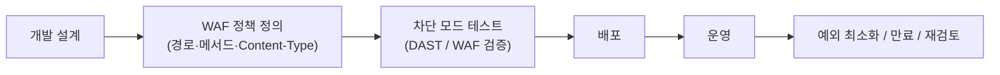

🛡️ **웹방화벽, 완벽할까요?**  
웹방화벽(WAF)은 웹 서비스 보안을 위한 핵심 수단입니다.  
그러나 현실에서는 **반복되는 예외 처리(dev exception)** 와 **우회 공격**이  
운영자와 개발자 모두에게 가장 큰 부담이 됩니다.

핵심 문제는 단순합니다.

> **예외 처리가 늘어날수록,  
> 공격자는 그 예외 경로만 집중적으로 노립니다.**

<!--more-->

---

## 먼저 요점만 정리하면

- 정상 요청도 **잘못 설계되면 WAF에 차단**될 수 있습니다
- 이때 반복되는 **예외 등록이 곧 우회 공격의 시작점**이 됩니다
- 예외 처리는 영구 해결책이 아니라 **임시 완화 수단**이어야 합니다
- 근본 해결책은 **개발 초기부터 WAF 정책을 함께 고려하는 Secure-by-Design** 입니다

---

## 1. 정상 요청인데 왜 차단될까?

웹방화벽은 SQL Injection, XSS, 파일 업로드 공격 등  
다양한 웹 공격을 탐지합니다.

하지만 다음과 같은 요청은  
공격이 아니더라도 WAF 룰셋에 의해 **공격처럼 보일 수 있습니다**.

- `GET` 요청에 IP, 토큰, 민감한 값 포함
- `POST` 본문에 SQL 구문 또는 `<script>` 문자열 포함
- 테스트용 URI, 백도어성 경로, 임시 디버그 파라미터가 남아 있는 상태
- 비표준 Content-Type 사용 (`text/plain`, `form`, 혼합 포맷 등)

결국 문제는 WAF가 “과민하다”는 데 있지 않습니다.

> **의도하지 않은 요청 구조가  
> 보안 정책과 충돌하는 것**입니다.

이 충돌이 반복되면  
운영팀은 개발팀으로부터 지속적으로 “화이트리스트 등록” 요청을 받게 됩니다.

---

## 2. 예외 처리는 우회 공격의 시작점이 될 수 있습니다

특정 URL이나 경로를 예외 처리하면  
그 요청은 검사 대상에서 제외되거나 완화된 정책으로 처리됩니다.

이 상태는 공격자에게 매우 매력적인 힌트가 됩니다.

- 공격자가 URL 패턴을 통해 우회 경로 탐색
- 예외 처리된 경로에 악성 요청 집중
- 장기 방치된 예외 경로가 사실상 백도어 역할 수행
- 보안 점검 시 가장 먼저 공격 시도되는 대상이 됨

즉, 예외는 운영 편의를 위한 설정처럼 보이지만,  
실제로는 공격자에게  
**“이쪽은 느슨하다”는 신호**가 될 수 있습니다.

> ✅ **예외는 임시 수단이어야 합니다.**  
> 예외 등록 시에는 **오탐률 기준 승인 + 자동 만료(Time-bound) + 재검토 주기**가 반드시 필요합니다.

---

## 3. 우회 경로는 개발 단계에서 이미 만들어집니다

많은 경우, 우회 공격의 씨앗은  
운영 단계가 아니라 **개발 단계**에서 만들어집니다.

| 개발 방식 예시 | 우회 공격 가능성 |
|---|---|
| IP·토큰을 `GET`으로 전달 | URL 로그 노출 → 인증 우회 가능성 |
| JSON 외 포맷 사용 (`form`, `text`) | Content-Type 혼동 → 파서 오탐 유발 |
| 테스트 경로 미삭제 상태로 운영 | 백도어 또는 인증 우회 가능성 |
| 예외 등록 후 장기 방치 | 실제 공격자가 해당 경로만 집중 시도 |

핵심은 하나입니다.

> 대부분의 WAF 예외 문제는  
> **WAF를 고려하지 않은 개발 설계**에서 시작됩니다.

즉, 예외 처리는 운영의 실패이기 전에  
설계의 부재인 경우가 많습니다.

---

## 4. 전통적 접근은 왜 계속 실패할까?

많은 조직이 아래 흐름을 반복합니다.

- 개발
- 배포
- WAF 차단 발생
- 예외 등록
- 우회 공격 위험 증가
- 또 다른 예외 요청

이 방식은 단기적으로는 편해 보이지만,  
시간이 지날수록 다음과 같은 결과를 만듭니다.

- 정책 복잡도 증가
- 예외 경로 누적
- 운영팀 피로도 상승
- 공격 표면 확대

즉, “예외로 해결하자”는 방식은  
문제를 해결하는 것이 아니라  
**문제를 뒤로 미루며 구조적으로 키우는 방식**입니다.

---

## 5. 해결책: 개발과 보안을 동시에 고려하라

현실적인 해결책은 단순합니다.

> **WAF를 배포 이후에 맞추는 것이 아니라,  
> 개발 초기부터 정책과 함께 설계해야 합니다.**

이를 위해 다음 접근이 필요합니다.

- ✅ **초기 개발부터 WAF 차단 모드로 테스트**
- ✅ **API 요청 구조를 보안 정책 안에서 설계**
- ✅ **허용 경로·메서드·Content-Type을 먼저 정의**
- ✅ **CI/CD 파이프라인에 DAST + WAF 테스트 자동화 포함**

| 전통적 접근 | 보안 중심 접근 (Secure-by-Design) |
|---|---|
| 개발 → 배포 → WAF 설정 → 예외 처리 반복 | WAF 차단 모드 먼저 설정 → 정책 기반 설계 → 배포 |

이 방식은  
우회 공격 경로 자체를 사전에 제거하고,  
운영 중 불필요한 예외 요청 없이  
**안정적인 보안 운영**을 가능하게 합니다.

---

## 6. Secure-by-Design 흐름은 이렇게 가져가야 합니다

핵심은  
배포 후 예외를 붙이는 것이 아니라,  
**정책을 먼저 정의하고 그 정책 안에서 개발하는 것**입니다.

---

## 7. PLURA는 여기서 어떤 역할을 하나요?

이 문제는 단순히 WAF 룰의 문제가 아닙니다.  
실제 운영에서는 다음이 함께 필요합니다.

* 어떤 경로에서 반복 오탐이 발생하는가
* 어떤 예외가 오래 방치되고 있는가
* 어떤 요청이 실제 공격으로 이어졌는가
* 예외 경로를 통해 어떤 이상 행위가 발생했는가

PLURA WAF / PLURA-XDR은 이 지점에서 의미를 가집니다.

* 정책 기반 예외 관리
* 예외 경로에 대한 로그 축적
* 요청·응답·행위 로그의 통합 분석
* WAF 차단/허용 이벤트와 이후 시스템 이벤트의 연계

즉, 예외 처리는 단순히 “열어둘지 말지”의 문제가 아니라,  
**열어둔 뒤 어떤 일이 벌어지는지까지 끝까지 봐야 하는 문제**입니다.

PLURA는  
WAF 차단과 로그 정밀 분석을 연결하여,  
예외 경로가 실제 우회 공격으로 이어지는지까지  
확인할 수 있도록 돕습니다.

---

## 8. 운영팀과 개발팀이 바로 적용할 체크리스트

### 운영팀 체크리스트

* 예외 등록 시 **만료일**이 있는가?
* 예외 등록 사유와 승인자가 기록되는가?
* 30일 이상 유지된 예외를 정기 재검토하는가?
* 예외 경로에 대해 별도 모니터링을 하고 있는가?

### 개발팀 체크리스트

* 민감한 값이 GET 파라미터에 포함되지 않는가?
* 비표준 Content-Type을 꼭 써야 하는가?
* 테스트 URI와 디버그 경로가 운영에 남아 있지 않은가?
* WAF 차단 모드에서 사전 테스트를 수행했는가?

---

## ✅ 결론: 웹방화벽은 개발 초기부터 함께 가야 한다

웹방화벽은 **사후 대응 도구가 아닙니다.**  
**개발 초기부터 함께 설계되어야 할 보안 파트너**입니다.

우회 공격의 핵심은  
대개 **예외 처리된 경로**에서 시작됩니다.

그리고 그 문제는  
운영 단계의 화이트리스트 남발이 아니라,

> **설계 단계에서 WAF를 고려하지 않은 개발 방식**에서 비롯됩니다.

예외 처리의 악순환을 줄이려면  
개발과 보안을 분리해서는 안 됩니다.

> **WAF는 배포 후 맞추는 장비가 아니라,  
> 개발 단계부터 함께 가야 하는 기준**입니다.

---

### 📚 함께 보면 좋은 글 PLURA-Blog

* [웹방화벽 없는 홈페이지 운영은 안전벨트 없는 운전과 같습니다](https://blog.plura.io/ko/column/web-application-firewall-is-like-a-seatbelt/)
* [웹 서비스의 취약점은 대응할 수 있을까?](https://blog.plura.io/ko/column/vulnerabilities_web/)
* [워드프레스로 만든 사이트 필수 보안 TOP 10](https://blog.plura.io/ko/column/wordpress_security_top10/)
* [웹방화벽(WAF)에 대한 이해](https://blog.plura.io/ko/column/onpremise_inline_waf/)
* [웹을 통한 데이터유출 해킹 대응 개론](https://blog.plura.io/ko/column/dlp/)
* [WEB 관리자 페이지 노출 대응](https://blog.plura.io/ko/respond/admin_page_exposure_mitigation/)
* [SQL 인젝션](https://blog.plura.io/ko/respond/sql_injection/)
* [크리덴셜 스터핑](https://blog.plura.io/ko/respond/credential_stuffing/)
* [크리덴셜 스터핑 공격 대응하기](https://blog.plura.io/ko/respond/credential-stuffing-countermeasures/)
* [웹 서비스 공격에 대응하기 against 샤오치잉(Xiaoqiying)](https://blog.plura.io/ko/respond/web-service-attack-response-against-xiaoqiying/)

---
