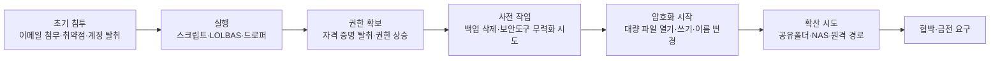
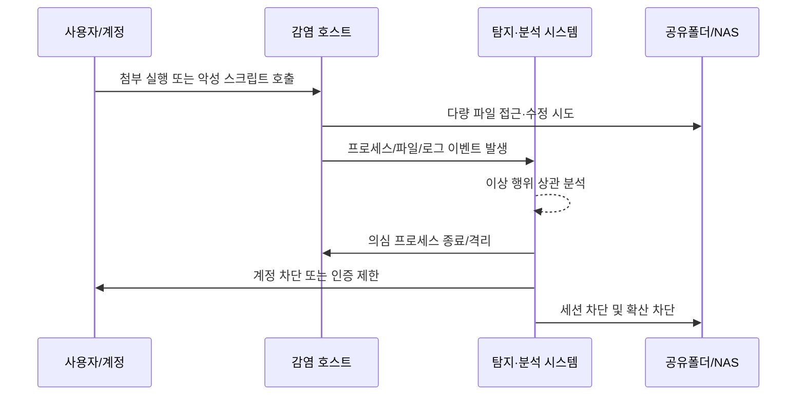

## 랜섬웨어 대응의 핵심은 “복구”가 아니라 “진행 중 탐지”입니다

랜섬웨어를 이야기할 때 많은 조직은  
백업, 복구, 보험, 복원 시간부터 떠올립니다.

물론 그것도 중요합니다.  
하지만 더 먼저 물어야 할 질문이 있습니다.

> **지금 이 순간, 랜섬웨어가 진행 중이라면 우리는 알 수 있는가?**

이 질문에 바로 답하지 못한다면,  
대부분의 대응은 이미 한 박자 늦습니다.

랜섬웨어는 보통 “파일이 모두 암호화된 뒤” 존재가 드러납니다.  
사용자는 그제야 파일 확장자가 바뀐 것을 보고,  
운영자는 공유폴더가 열리지 않는 것을 보고,  
보안팀은 경고 알림과 장애 전화를 동시에 받습니다.

그러나 실제 공격은 그보다 훨씬 앞에서 시작됩니다.  
이메일 첨부 실행, 스크립트 호출, 권한 상승, 백업 삭제 시도,  
공유폴더 접근, 대량 파일 열람, 빠른 이름 변경과 쓰기 작업.  
랜섬웨어의 본체보다 중요한 것은,  
이 **연속된 행위의 흐름**입니다.

---

## 결과를 보는 보안과, 과정을 보는 보안은 다릅니다

많은 조직이 랜섬웨어를  
“암호화 완료 후 확인되는 사고”로 받아들입니다.

이 방식의 문제는 명확합니다.

- 파일이 암호화된 뒤에야 감염 사실을 안다
- 사용자 신고나 장애 발생 이후에야 조치가 시작된다
- 최초 감염 경로와 확산 범위를 뒤늦게 추적한다
- NAS, 파일서버, 백업 저장소까지 함께 영향을 받을 수 있다

즉, **결과를 본 뒤 대응하는 구조**입니다.

하지만 랜섬웨어는 원래  
**진행 중일 때 잡아야 하는 공격**입니다.

암호화가 시작된 뒤 수 초에서 수 분 사이에  
수십 개, 수백 개, 많게는 수천 개 파일이 바뀔 수 있습니다.  
그 짧은 시간 안에 이상 징후를 식별하고,  
프로세스를 끊고, 계정을 차단하고,  
접속 세션을 종료해야 피해를 줄일 수 있습니다.

---

## 랜섬웨어는 보통 이렇게 움직입니다

아래 흐름을 보면 핵심이 더 분명해집니다.

여기서 중요한 것은 마지막 단계가 아닙니다.  
정말 중요한 것은 **D와 E 사이**,  
즉 공격자가 본격적으로 파괴를 시작하는 지점입니다.

이 구간을 포착하지 못하면  
보안은 사고 기록만 남기고 끝날 가능성이 높습니다.

---

## 실시간 탐지에서 봐야 할 것은 “악성 파일”만이 아닙니다

랜섬웨어 대응을 너무 단순하게 보면  
“악성코드 샘플을 잡는 것”만 떠올리게 됩니다.

하지만 실제 운영 환경에서는  
그보다 더 중요한 신호들이 있습니다.

### 1. 대량 파일 I/O의 급격한 변화

* 짧은 시간 안에 비정상적으로 많은 파일 열기·쓰기·이름 변경
* 특정 사용자 또는 단일 프로세스가 평소보다 훨씬 넓은 경로 접근
* 문서, 이미지, 설계도, DB 덤프 등 업무 파일 위주 집중 접근

### 2. 확장자 변경과 파일명 패턴 이상

* 다수 파일에 동일 확장자 추가
* 랜덤 문자열 기반 파일명 변화
* 원본 파일 삭제 후 새 파일 생성 패턴 반복

### 3. 프로세스 트리의 비정상성

* 문서 뷰어, 스크립트 엔진, LOLBAS에서 비정상 하위 프로세스 호출
* 사용자 문맥에서 갑작스러운 관리자 권한 작업
* 정상 관리 도구처럼 보이지만 행위가 비정상적인 실행 흐름

### 4. 방어 회피 및 복구 방해 시도

* 볼륨 섀도 복사본 삭제 시도
* 백업 경로 탐색 또는 백업 파일 삭제
* 복구 도구, 보안 에이전트, 서비스 중지 시도

### 5. 내부 확산 신호

* 공유폴더, NAS, 원격 경로에 대한 급격한 접근 증가
* 동일 계정으로 여러 호스트에서 동시성 높은 파일 변경
* 평소 사용하지 않던 서버·스토리지로 갑작스러운 연결

이것이 바로  
랜섬웨어를 **결과가 아닌 과정**으로 봐야 하는 이유입니다.

---

## 실무 관점에서 중요한 탐지 기준

랜섬웨어 대응은 “느낌”으로 하면 안 됩니다.
최소한 아래와 같은 기준이 필요합니다.

### 파일 행위 기준

* 일정 시간 내 파일 변경 수 급증
* 동일 프로세스의 연속적인 rename/write 패턴
* 특정 확장자군 문서에 대한 집중 수정
* 사용자 평소 업무 범위를 벗어난 경로 접근

### 실행 행위 기준

* Office, script host, LOLBAS, 원격 실행 도구 기반 이상 실행
* 사용자 세션에서 드물게 나타나는 부모-자식 프로세스 관계
* 암호화 도구 성격의 반복 API 호출 또는 대량 파일 처리 패턴

### 계정·권한 기준

* 비정상 시간대의 관리자 작업
* 서비스 계정 또는 일반 사용자 계정의 과도한 파일 접근
* 단기간 다수 시스템 접속 시도

### 네트워크 기준

* 내부 파일서버/NAS 집중 접속
* 외부 C2 또는 데이터 유출 의심 연결
* 동일 세션에서 파일 접근과 외부 연결이 함께 증가

### 분석 기준

* 단일 이벤트가 아니라 파일·프로세스·계정·네트워크를 함께 봐야 함
* “정상 도구 사용”과 “정상 도구의 비정상 오용”을 구분해야 함
* MITRE ATT&CK 기준으로 보면, 최종 암호화는 보통 **T1486(Data Encrypted for Impact)** 관점에서 해석할 수 있지만, 실제 대응은 그 이전 단계의 연쇄 행위까지 포함해야 함

---

## 좋은 탐지는 “빨리 알림”이 아니라 “빨리 멈춤”으로 이어져야 합니다

실시간 탐지의 목적은 경고창을 예쁘게 띄우는 것이 아닙니다.  
핵심은 **피해가 커지기 전에 멈추는 것**입니다.

가장 현실적인 대응은 아래 순서입니다.

따라서 좋은 대응 체계는 보통 다음 질문에 답할 수 있어야 합니다.

* 어느 프로세스가 암호화를 시작했는가
* 어느 사용자 계정 문맥에서 실행되었는가
* 어떤 경로와 파일군이 먼저 영향을 받았는가
* 네트워크 확산은 이미 시작되었는가
* 즉시 중단 조치를 자동 또는 반자동으로 수행할 수 있는가
* 사후 복구 이전에 증거 보존이 가능한가

---

## 실제 운영에서 자주 마주치는 두 가지 장면

### 사례 A. 이메일 첨부 실행 후 로컬 폴더부터 암호화가 시작되는 경우

처음에는 평범해 보입니다.  
사용자가 첨부 파일을 열고,  
문서 실행이나 스크립트 호출이 이어집니다.

문제는 그 직후입니다.

* 사용자 프로필 하위 문서 폴더에서 짧은 시간 안에 다수 파일 수정
* 파일명 변경과 확장자 부여가 연속적으로 발생
* 원본 삭제 후 새 파일 쓰기 패턴이 집중적으로 나타남
* 복구 방해를 위한 흔적 삭제 또는 백업 관련 명령이 뒤따를 수 있음

이 경우 핵심은  
“파일이 이미 암호화되었다”는 결과 확인이 아닙니다.  
**정상 업무와 다른 속도와 방식의 파일 조작**을  
얼마나 빨리 알아채느냐입니다.

### 사례 B. 감염 단말이 내부 공유폴더와 NAS로 확산을 시도하는 경우

더 위험한 장면은 내부 확산입니다.

* 감염 단말이 사내 공유폴더에 접속
* 단일 사용자 계정으로 여러 디렉터리 파일을 빠르게 열람
* 문서·설계 자료·공유 자산에 대한 일괄 수정 시도
* NAS 세션이 살아 있는 동안 피해 범위가 급격히 넓어짐

이 경우에는 단말 하나의 문제가 아닙니다.  
**사용자 계정, 세션, 저장소 접근 권한**이 한 번에 문제로 바뀝니다.

그래서 랜섬웨어 대응은  
단말 백신만으로 끝나지 않습니다.  
계정, 파일서버, 네트워크 세션, 포렌식까지  
모두 연결되어야 합니다.

---

## 다른 EDR/XDR과 무엇이 같고, 무엇이 달라야 하는가

이 지점에서는 솔직할 필요가 있습니다.

오늘날 주요 EDR/XDR 제품들도  
랜섬웨어 행위 탐지, 프로세스 격리, 자동 대응 기능을 제공합니다.  
따라서 “랜섬웨어를 탐지한다”는 주장만으로는  
차별점이 되기 어렵습니다.

차이를 만드는 것은 보통 아래입니다.

### 공통적으로 필요한 것

* 엔드포인트 행위 기반 탐지
* 프로세스 종료 및 호스트 격리
* 계정·권한 이상 탐지
* 사건 타임라인과 포렌식 기록

### 실제 현장에서 차이가 나는 것

* 파일 변경, 계정 행위, 네트워크, 웹 로그를 얼마나 함께 보는가
* NAS/공유폴더 확산 같은 내부 이동까지 얼마나 빨리 묶어내는가
* 단일 이벤트가 아니라 공격 흐름으로 보여주는가
* 오탐을 줄이면서 자동 조치를 어디까지 신뢰 가능하게 설계했는가
* 사후 보고서가 아니라 **진행 중 차단**을 얼마나 안정적으로 수행하는가

결국 중요한 것은 제품 이름이 아니라  
**어떤 로그를 얼마나 깊게 확보하고,  
그 로그를 얼마나 빨리 상관 분석하며,  
실제 중단 조치를 얼마나 일관되게 수행하는가**입니다.

---

## 랜섬웨어 대응에서 로그는 선택이 아니라 출발점입니다

사람은 놓칠 수 있습니다.  
하지만 로그는 흔적을 남깁니다.

* 누가 실행했는지
* 어떤 프로세스가 시작점인지
* 어느 파일부터 바뀌었는지
* 어떤 계정으로 공유폴더에 접근했는지
* 외부 연결과 내부 확산이 어떻게 이어졌는지

이 기록이 없으면  
탐지도, 차단도, 포렌식도, 재발 방지도 약해집니다.

그래서 랜섬웨어 대응은  
백신 추가 설치보다 먼저  
**기록과 분석 체계**부터 점검해야 합니다.

---

## 실무자가 바로 점검해야 할 랜섬웨어 대응 체크리스트

### 1. 탐지

* 파일 변경 이벤트를 실시간 또는 준실시간으로 볼 수 있는가
* 프로세스 트리와 사용자 계정을 함께 볼 수 있는가
* NAS/공유폴더 접근 이상을 식별할 수 있는가
* 볼륨 섀도 삭제, 백업 파괴 시도를 감지하는가

### 2. 대응

* 의심 프로세스를 즉시 종료할 수 있는가
* 감염 호스트를 네트워크에서 분리할 수 있는가
* 계정 잠금 또는 인증 제한을 자동화할 수 있는가
* 파일서버/NAS 세션 차단과 연계되는가

### 3. 포렌식

* 최초 실행 파일 경로를 확인할 수 있는가
* 최초 감염 사용자와 단말을 특정할 수 있는가
* 암호화 시작 시각과 확산 시점을 복원할 수 있는가
* 공격 전후 로그가 충분히 남아 있는가

### 4. 운영

* 오탐 시 예외 처리 기준이 정리되어 있는가
* 자동 격리 정책의 승인 체계가 준비되어 있는가
* 백업 복구 이전에 증거 보존 절차가 있는가
* 경영진에게 설명 가능한 사고 타임라인이 나오는가

---

## PLURA-XDR을 포함한 현실적인 방향

랜섬웨어 대응에서 필요한 것은  
“탐지한다”는 선언이 아니라  
**진행 중인 공격을 보게 만드는 구조**입니다.

PLURA-XDR 역시 이 관점에서 평가되어야 합니다.

즉, 단순히 제품명을 앞세우기보다 아래 질문에 답할 수 있어야 합니다.

* 파일·프로세스·계정·네트워크 로그를 함께 보게 해 주는가
* 랜섬웨어 전조와 진행 신호를 상관 분석할 수 있는가
* 단말 격리, 프로세스 종료, 계정 차단 같은 대응이 연결되는가
* 사후 보고가 아니라 실시간 중단에 실제로 도움이 되는가
* 포렌식과 재발 방지까지 이어지는가

이 기준을 만족한다면  
그 제품은 랜섬웨어 대응에서 의미가 있습니다.

---

## 맺음말

랜섬웨어는  
파일이 다 잠긴 뒤에 이해하는 공격이 아닙니다.

그보다 앞선 몇 초, 몇 분 사이에  
공격자는 이미 충분한 흔적을 남깁니다.

문제는 그것을 볼 수 있느냐입니다.

> **지금 랜섬웨어가 진행 중이라면, 우리는 알 수 있는가?**

이 질문에 답하지 못한다면  
복구 전략만으로는 부족합니다.

이제 랜섬웨어 대응의 기준은  
“감염 후 복원”이 아니라  
**진행 중 탐지와 즉시 차단**이어야 합니다.

그리고 그 출발점은 언제나 같습니다.

**사람이 아니라 로그가 먼저 알고 있어야 합니다.**
---
