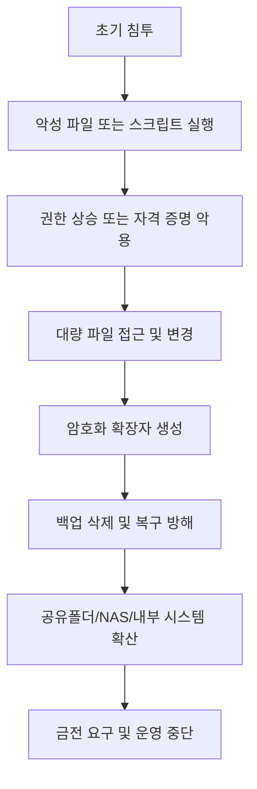

## 지금 랜섬웨어가 진행 중이라면, 당신은 알 수 있습니까?

랜섬웨어 대응을 말할 때  
많은 조직은 여전히 **복구**, **백업**, **사후 조치**부터 떠올립니다.

물론 그것도 중요합니다.  
하지만 더 먼저 확인해야 할 질문이 있습니다.

> **지금 이 순간, 랜섬웨어가 실행 중이라면 우리는 그 사실을 즉시 알 수 있는가?**

이 질문에 자신 있게 답하지 못한다면,  
현재의 보안 체계는 이미 한계를 드러내고 있는 것입니다.

랜섬웨어의 본질은  
“파일이 암호화되었다”는 결과가 아니라,  
**암호화가 진행되는 그 과정 전체**에 있습니다.

즉, 중요한 것은  
감염 이후 복구가 아니라  
**진행 중인 공격을 실시간으로 감지하고 멈출 수 있느냐**입니다.

<!--more-->

---

## 왜 기존 대응만으로는 부족한가

대부분의 조직은 랜섬웨어를  
다음과 같은 방식으로 인식합니다.

- 사용자 신고 이후 확인
- 백신 경고 이후 조사
- 암호화된 파일 발견 이후 대응
- 백업 복구 절차 시작

하지만 이 시점은 이미 늦습니다.

랜섬웨어는 보통 다음과 같은 흐름으로 진행됩니다.

- 악성 파일 유입
- 계정 탈취 또는 권한 상승
- 정상 도구나 스크립트를 이용한 실행
- 대량 파일 접근 및 암호화
- 백업 삭제 또는 복구 방해
- 내부 확산 또는 외부 유출

문제는 이 모든 과정이  
사용자가 이상하다고 느끼기 전에  
조용히, 빠르게, 자동으로 진행된다는 점입니다.

결국 실무에서 필요한 것은  
“감염되었는가”라는 질문이 아니라,

> **“지금 공격이 진행 중인가, 그리고 우리는 그것을 즉시 멈출 수 있는가?”**  
> 입니다.

---

## 랜섬웨어는 결과가 아니라 과정으로 봐야 합니다

랜섬웨어는 단일 이벤트가 아닙니다.  
하나의 파일이 실행되고 끝나는 공격이 아니라,  
여러 단계가 연결된 **행위의 흐름**입니다.

이 흐름에서 중요한 것은  
맨 마지막 결과가 아니라  
**중간 단계에서 나타나는 신호**입니다.

예를 들어,

* 평소와 다른 프로세스가 갑자기 대량 파일을 열람하거나
* 짧은 시간 안에 수많은 파일 확장자가 변경되거나
* 정상 관리 도구가 비정상적인 방식으로 호출되거나
* 백업 삭제, 볼륨 섀도 복사본 삭제 같은 방어 회피 행위가 발생한다면

그 순간은 이미  
“랜섬웨어가 실행 중일 수 있다”는 강한 경고로 봐야 합니다.

---

## 실무에서 꼭 봐야 할 탐지 신호

탐지 기준을 너무 길게 나열하면 오히려 핵심이 흐려집니다.
실무에서는 아래 네 가지 축으로 정리하는 것이 효과적입니다.

| 카테고리    | 주요 신호                            | 왜 중요한가                     |
| ------- | -------------------------------- | -------------------------- |
| 파일 행위   | 짧은 시간 내 대량 파일 열람·변경·확장자 변조       | 랜섬웨어의 가장 직접적인 실행 징후        |
| 프로세스 행위 | 비정상 프로세스 트리, 스크립트 엔진, LOLBAS 호출  | 정상 도구를 악용한 우회 실행 가능성       |
| 방어 회피   | 백업 삭제, 복구 기능 비활성화, 보안 도구 종료 시도   | 단순 실행이 아니라 공격 완성을 위한 준비 행위 |
| 확산 시도   | 공유폴더/NAS 접근 증가, 원격 시스템 접속, 내부 전파 | 단일 PC 감염을 조직 전체 피해로 키우는 단계 |

이 네 가지를 함께 봐야 하는 이유는 명확합니다.

랜섬웨어는  
단순히 “악성 파일 하나”로 탐지되는 경우보다,  
**여러 비정상 행위가 연속적으로 나타나는 방식**으로 더 자주 드러나기 때문입니다.

따라서 좋은 탐지는  
파일 하나를 맞히는 탐지가 아니라,  
**행위의 연결을 읽는 탐지**여야 합니다.

---

## 특히 놓치지 말아야 할 지점: LOLBAS와 방어 회피

최근 공격은 새 악성 파일만으로 움직이지 않습니다.  
운영체제 내부의 정상 도구를 악용하는 방식이 점점 많아지고 있습니다.

예를 들어 PowerShell, `cmd.exe`, `rundll32.exe`, `mshta.exe` 같은 도구는  
원래 정상 관리와 운영을 위해 존재하지만,  
공격자는 이를 이용해 악성 행위를 숨기거나 우회합니다.

이른바 **LOLBAS(Living Off the Land Binaries and Scripts)** 관점이 중요한 이유가 여기에 있습니다.

즉, 실무자는 다음 질문을 해야 합니다.

* 지금 실행된 프로세스가 정상 도구인가?
* 그렇다면 **왜 지금**, **어떤 부모 프로세스에 의해**, **어떤 인자와 함께** 실행되었는가?
* 그 뒤에 대량 파일 변경이나 백업 삭제가 이어졌는가?

이 연결을 보지 못하면  
정상 도구를 이용한 랜섬웨어 실행은 놓치기 쉽습니다.

MITRE ATT&CK 기준으로도  
랜섬웨어는 단순 암호화 행위(T1486)만이 아니라  
권한 상승, 스크립트 실행, 방어 회피, 내부 확산 같은 여러 기술과 함께 나타납니다.

---

## 중요한 것은 “얼마나 빨리, 얼마나 정확히” 멈추느냐입니다

랜섬웨어 대응의 핵심은  
사건 보고서를 예쁘게 만드는 것이 아닙니다.

핵심은 아래 세 가지입니다.

1. **지금 진행 중인 행위를 빠르게 식별할 것**
2. **피해가 확산되기 전에 해당 프로세스와 계정을 멈출 것**
3. **어디서 시작됐는지 근거를 남길 것**

이 기준에서 보면
실시간 로그 분석과 행위 기반 상관 분석이 왜 중요한지 분명해집니다.

웹에서 시작된 침해가  
서버 실행과 파일 암호화로 이어질 수 있고,  
한 사용자 계정 탈취가  
공유폴더 전체 피해로 번질 수 있기 때문입니다.

그래서 랜섬웨어 대응은  
백신 하나, 파일 진단 하나로 끝나는 문제가 아니라  
**웹·계정·프로세스·파일·네트워크를 연결해서 보는 문제**입니다.

---

## 실시간 XDR 관점이 필요한 이유

이 지점에서 중요한 것은  
특정 제품 이름보다 **어떤 보안 관점이 필요한가**입니다.

랜섬웨어를 제대로 막으려면  
다음 조건을 갖춘 체계가 필요합니다.

* 로그를 실시간으로 수집하고
* 파일·프로세스·계정·네트워크 행위를 함께 분석하며
* 이상 징후를 단일 이벤트가 아니라 사건 흐름으로 판단하고
* 필요 시 자동 차단 또는 격리까지 이어질 수 있는 구조

이런 의미에서  
행위 기반 실시간 XDR 접근은  
랜섬웨어 대응에 매우 현실적인 방법입니다.

PLURA-XDR 역시 이 관점에서  
진행 중인 랜섬웨어 징후를 빠르게 식별하고,  
차단·포렌식·보고까지 연결하는 구조를 제공합니다.

핵심은 제품 홍보가 아니라,  
**랜섬웨어를 결과가 아니라 진행 중 행위로 보는 시각**입니다.

---

## 결론: 랜섬웨어는 이미 실행 중일 때 잡아야 합니다

랜섬웨어는  
암호화가 끝난 뒤 발견하면 늦습니다.

복구는 필요합니다.  
백업도 중요합니다.  
하지만 그것만으로는 충분하지 않습니다.

정말 중요한 것은  
**지금 이 순간 진행 중인 공격을 볼 수 있는가**,  
그리고 **그 공격을 즉시 멈출 수 있는가**입니다.

결국 랜섬웨어 대응 수준은  
아래 세 가지 질문에 대한 답으로 드러납니다.

### 실무 체크 질문

* 지금 우리 환경에서 대량 파일 암호화가 시작되면, 몇 분 안에 알 수 있습니까?
* 정상 도구를 악용한 LOLBAS 기반 실행도 구분할 수 있습니까?
* 탐지 후 프로세스 차단, 계정 통제, 자산 격리까지 자동 또는 반자동으로 이어집니까?

이 질문에 답하지 못한다면,  
우리는 아직 랜섬웨어를 **사후 복구의 문제**로만 보고 있는 것입니다.

하지만 랜섬웨어의 본질은 다릅니다.

> **랜섬웨어는 복구의 문제가 아니라, 실행 중일 때 잡아야 하는 실시간 대응의 문제입니다.**

---

## 📚 함께 읽기

* [지금 해킹 공격이 진행 중인지 확인하려면?](https://blog.plura.io/ko/column/why-plura-xdr-merit/)
* [고급 랜섬웨어 대응 전략: 노트북 전원 차단이 왜 중요한가](https://blog.plura.io/ko/respond/ransomware-shutdown-awareness/)
* [협박성 디도스 공격, 랜섬디도스(RansomDDoS)](https://blog.plura.io/ko/threats/ransomddos/)
* [PC와 서버의 백신은 윈도우즈 디펜더만으로 충분하다](https://blog.plura.io/ko/column/why-edr-is-necessary/)

---
