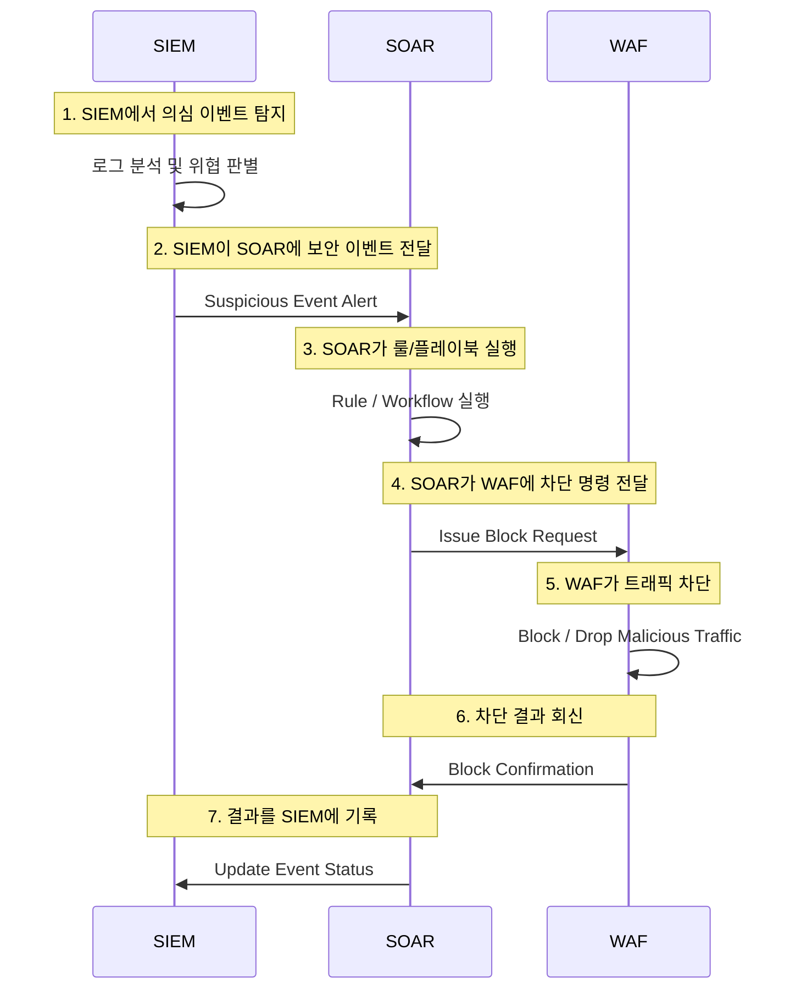

## SOAR 자동 대응이 실패하는 진짜 이유

📉 **SOAR**는 **SIEM**에서 발생한 이벤트를 받아 **자동 대응**을 수행하는 솔루션으로 알려져 있습니다.  
하지만 실제 현장에서는 여전히 이런 말이 반복됩니다.

> **“SOAR를 도입했는데도 자동 대응이 어렵다.”**

이유는 단순합니다.

> **SOAR는 단독으로 정확한 대응을 만들어내지 못하고,  
> 결국 SIEM이 만들어낸 이벤트의 품질에 크게 의존하기 때문입니다.**

즉, SIEM이 **불완전한 로그**, **낮은 정탐률**, **높은 오탐률** 상태라면  
SOAR 역시 그 위에서 **불완전한 자동화**를 수행할 수밖에 없습니다.

이번 글에서는  
[SIEM, 도입하면 뭐하나요? 로그 수집도 분석도 안 된다면](https://blog.plura.io/ko/column/why_siem_always_fails/)의 문제의식을 바탕으로,

- 왜 SOAR가 자동 대응에 실패하는지
- 왜 이 문제가 결국 SIEM 문제와 연결되는지
- SOAR를 제대로 쓰려면 무엇을 먼저 준비해야 하는지

를 정리해 보겠습니다.

- **SOAR**: Security Orchestration, Automation, and Response
- **SIEM**: Security Information and Event Management

<!--more-->

---

## 1. SOAR는 왜 SIEM에 의존할까?

### (1) SOAR의 기본 메커니즘

SOAR는 보통 **SIEM**이나 기타 탐지 시스템이 생성한 **보안 이벤트**를 받아  
사전에 정의된 **플레이북(Playbook)** 또는 **워크플로우(Workflow)** 를 실행합니다.

예를 들면,

- 공격 IP 차단
- 관련 계정 일시 중지
- 자산 정보 조회
- 티켓 발행
- 담당자 알림
- WAF/EDR 연동 조치

같은 대응을 **즉각적** 또는 **반자동**으로 수행합니다.

즉, SOAR는  
“무엇이 공격인가?”를 스스로 정의하는 시스템이라기보다,  
**들어온 이벤트를 받아 정해진 대응을 실행하는 자동화 엔진**에 가깝습니다.

---

### (2) “잘못된 이벤트”가 들어오면 어떻게 될까?

문제는 여기서 시작됩니다.

- SIEM의 **오탐(False Positive)** 이 많거나
- **정탐(True Positive)** 이 부족하거나
- 중요한 공격 이벤트를 아예 놓치고 있다면

SOAR는 결국 그 **잘못된 이벤트** 또는 **빠진 이벤트**를 바탕으로 움직이게 됩니다.

그 결과는 대체로 셋 중 하나입니다.

- **자동 대응이 아예 발동되지 않거나**
- **잘못된 대상에 차단·제재를 수행하거나**
- **실제 공격은 놓치고 정상 행위만 막는 상황**이 발생합니다

즉,

> **SOAR의 정확성은 곧 SIEM 이벤트의 정확성에 달려 있습니다.**

---

### (3) SIEM이 부실하면 자동 대응은 ‘그림의 떡’

SIEM이 불완전하면  
탐지된 이벤트 자체가 부족하거나 신뢰도가 낮아집니다.

그 상태에서 SOAR를 도입하면  
겉보기에는 자동화 구조가 생긴 것 같지만,  
실제로는 **잘못된 데이터 기반 자동화**가 됩니다.

이것은 단순 비효율의 문제가 아닙니다.  
오히려 더 위험할 수 있습니다.

- 필요 없는 곳에 차단이 걸리고
- 실제 공격은 놓치며
- 운영팀은 자동화를 신뢰하지 않게 되고
- 결국 자동 차단은 꺼지고 조회 자동화만 남습니다

그래서 현업에서는 종종 이렇게 말합니다.

> **“SIEM이 안정화되지 않은 상태에서 SOAR를 도입하는 것은 시기상조다.”**

---

## 2. SOAR가 자동 대응을 못 하는 진짜 이유

“SOAR를 도입하면 자동 대응을 할 수 있을 것”이라고 기대하지만,  
실제 현장에서는 제대로 동작하지 않는 경우가 많습니다.

그 근본 원인은 크게 세 가지입니다.

---

### (1) SIEM 자체의 로그 수집·분석 한계

많은 SIEM 환경은  
기본 이벤트 로그나 요약된 액세스 로그에 크게 의존합니다.

하지만 실제 공격 탐지에는  
이것만으로 부족한 경우가 많습니다.

예를 들어 다음 정보가 빠지면 문제가 커집니다.

- **Request Body**
- **Response Body**
- **OS 감사 로그**
- **EDR 행위 로그**
- **Execution Chain**
- **권한 상승 및 계정 행위 로그**

이런 정보가 없으면 다음과 같은 공격은 정밀하게 판단하기 어렵습니다.

- SQL 인젝션의 실제 페이로드
- 웹셸 업로드 본문
- 데이터 유출 응답 패턴
- LOLBin / Fileless 공격
- 정상 계정을 이용한 침해 확산

예를 들어, 단순 URI 로그만 보면  
`/login` 요청이 반복된 것처럼 보일 수 있습니다.  
하지만 Request Body를 보면  
대량의 계정 조합이 들어온 **Credential Stuffing**일 수 있습니다.

또, 업로드 요청이 있었다는 사실만으로는  
정상 파일 업로드인지,  
PHP 웹셸 삽입 시도인지 판단하기 어렵습니다.  
실제 본문과 응답을 봐야 정밀 탐지가 가능합니다.

즉,

> **탐지에 필요한 원본 맥락이 없으면, SOAR가 자동 차단할 근거도 약해집니다.**

---

### (2) 공격 시나리오 룰의 미비  
### 룰 없이 자동 대응은 없다

SOAR가 “이 이벤트는 위험하니 자동 대응하자”라고 판단하려면,  
그 이벤트가 **정말 악성인지 판별하는 룰**이 먼저 있어야 합니다.

하지만 현실에서는 종종 이런 상황이 벌어집니다.

- 공격 패턴 룰이 충분히 정의되지 않음
- 룰은 있어도 환경 변화에 따라 오래되어 의미를 잃음
- 오탐과 정탐 구분 기준이 약함
- 단일 이벤트 기반 룰만 많고, 시나리오 기반 룰은 부족함

결국,

> **룰이 부족하면 SOAR가 자동화할 근거도 부족합니다.**

예를 들어  
단순히 `PowerShell 실행` 하나만으로 자동 차단하는 것은 위험합니다.

하지만 다음과 같은 체인이 보이면 의미가 달라집니다.

- `WINWORD.EXE` 실행
- 직후 `powershell.exe` 호출
- 외부 URL 접근
- 인코딩 명령 실행
- 추가 프로세스 생성
- 권한 관련 후속 행위 발생

이런 **행위 흐름 기반 시나리오 룰**이 있어야  
자동 대응이 현실성을 갖게 됩니다.

---

### (3) 운영 인력·프로세스 부재  
### 자동화도 결국 사람의 구조 위에서만 작동한다

자동화라는 말은 자주 오해를 만듭니다.

많은 조직은  
SOAR를 도입하면 사람 없이 대응이 될 것처럼 기대합니다.  
하지만 실제로는 반대입니다.

SOAR가 잘 작동하려면 오히려 먼저 필요합니다.

- 어떤 이벤트를 신뢰할지
- 어떤 이벤트는 자동 차단 가능한지
- 어떤 이벤트는 사람 검토가 필요한지
- 오탐은 어떻게 조정할지
- 예외 정책은 누가 승인할지

즉, 자동화의 앞단에는 반드시  
**운영 프로세스와 판단 기준**이 있어야 합니다.

결국 다음 세 가지가 준비되지 않으면,

- **제대로 된 로그**
- **정확한 탐지 룰**
- **숙련된 운영 인력**

SOAR는 이름만 자동 대응일 뿐,  
실제로는 **자동 심부름 도구** 수준에 머무를 가능성이 큽니다.

---

## SIEM ↔︎ SOAR ↔︎ WAF 연동 구조

```mermaid
sequenceDiagram
    participant SIEM as SIEM
    participant SOAR as SOAR
    participant WAF as WAF

    Note over SIEM: 1. SIEM에서 의심 이벤트 탐지
    SIEM ->> SIEM: 로그 분석 및 위협 판별

    Note over SIEM,SOAR: 2. SIEM이 SOAR에 보안 이벤트 전달
    SIEM ->> SOAR: Suspicious Event Alert

    Note over SOAR: 3. SOAR가 룰/플레이북 실행
    SOAR ->> SOAR: Rule / Workflow 실행

    Note over SOAR,WAF: 4. SOAR가 WAF에 차단 명령 전달
    SOAR ->> WAF: Issue Block Request

    Note over WAF: 5. WAF가 트래픽 차단
    WAF ->> WAF: Block / Drop Malicious Traffic

    Note over WAF,SOAR: 6. 차단 결과 회신
    WAF ->> SOAR: Block Confirmation

    Note over SOAR,SIEM: 7. 결과를 SIEM에 기록
    SOAR ->> SIEM: Update Event Status
```

---

## 3. 왜 “SIEM 문제”가 곧 “SOAR 문제”인가?

이전 글에서도 강조했듯,  
**SIEM의 가장 큰 문제**는 대체로 다음 두 가지였습니다.

* 로그 수집이 충분하지 않다  
* 로그를 해석하고 유지할 운영 구조가 부족하다

이 문제를 그대로 옮기면 SOAR도 같은 한계를 가집니다.

### 1) 로그 수집 자체가 부실하다

→ 탐지 이벤트가 부족하다  
→ SOAR가 대응할 근거도 부족하다

### 2) 탐지 룰과 분석 역량이 약하다

→ SIEM 알림 신뢰도가 낮다  
→ SOAR가 자동 차단했다가 정상 트래픽을 막을 수 있다

### 3) 운영 인력이 부족하다

→ SIEM 오탐을 줄이기도 어렵다  
→ SOAR 플레이북도 방치된다

즉,

> **SIEM 운용이 제대로 되지 않는 상태라면,  
> SOAR 역시 자동 대응을 안정적으로 수행하기 어렵습니다.**

그래서 “SOAR 문제”는 많은 경우  
**SIEM 문제의 그림자**라고 볼 수 있습니다.

---

## 4. SOAR를 제대로 쓰기 위한 3가지 준비사항

SOAR는 나쁜 기술이 아닙니다.  
문제는 **도입 시점과 준비 수준**입니다.

실무적으로는 다음 세 가지를 먼저 점검해야 합니다.

---

### 체크 1. SIEM에서 신뢰할 수 있는 이벤트가 충분히 나오는가?

다음을 확인해야 합니다.

* 로그 수집 범위가 충분한가
* Request/Response Body 같은 원본 맥락이 확보되는가
* OS/EDR 로그까지 연계되는가
* 정탐 대비 오탐 비율이 감당 가능한 수준인가
* 운영자가 알람의 이유를 설명할 수 있는가

---

### 체크 2. 대응 프로세스가 표준화되어 있는가?

SOAR가 잘 작동하려면  
“어떤 공격에 대해 어떤 조치를 해야 하는가”가 미리 정의되어 있어야 합니다.

예를 들어:

* 이 이벤트는 즉시 차단
* 이 이벤트는 격리 후 검토
* 이 이벤트는 티켓 발행 בלבד
* 이 이벤트는 관리자 승인 후 차단

처럼 대응 수준이 나뉘어 있어야 합니다.

즉,

> **플레이북은 기술 문서이기 전에 운영 문서**입니다.

---

### 체크 3. 업무 영향에 대한 리스크 평가가 끝났는가?

자동 대응은 언제나 가용성 리스크를 동반합니다.

따라서 다음 질문이 필요합니다.

* 오탐 시 정상 사용자가 차단될 위험은 없는가?
* 업무 중단 가능성은 어느 정도인가?
* 자동 대응 후 롤백 절차가 있는가?
* 사람 검토가 필요한 단계는 어디인가?

이 검토 없이 자동화를 붙이면,  
보안 자동화가 아니라 **자동 대란**이 될 수 있습니다.

---

## 5. PLURA-XDR은 이 문제를 어떻게 다르게 접근하는가?

여기서 중요한 질문이 하나 생깁니다.

> **그렇다면 PLURA-XDR은 SOAR의 한계를 어떻게 줄이려는가?**

차이는 단순히  
“SOAR 기능이 있다”는 데 있지 않습니다.

핵심은  
**고신뢰도 이벤트를 만들 수 있는 데이터 구조**와  
**자동화를 붙일 수 있는 충분한 맥락**에 있습니다.

### (1) 본문 로그 기반 정밀 탐지

PLURA-XDR은  
단순 요약 로그가 아니라  
**Request/Response Body 기반 웹 로그**를 활용할 수 있습니다.

이것은 중요한 차이를 만듭니다.

예를 들어:

* SQL 인젝션이 실제로 어떤 페이로드로 들어왔는지
* 웹셸 업로드가 어떤 내용으로 시도되었는지
* 데이터 유출이 어떤 응답 패턴으로 발생하는지
* Credential Stuffing이 어떤 요청 조합으로 반복됐는지

를 더 정밀하게 볼 수 있습니다.

즉,

> **자동 대응의 출발점인 이벤트 품질 자체를 더 높이기 쉽습니다.**

---

### (2) Execution Chain 기반 맥락 확보

PLURA-XDR은  
단일 이벤트보다 **행위 흐름**을 더 중요하게 봅니다.

예를 들어:

* Parent Process
* Child Process
* CommandLine
* 계정 행위
* 후속 파일·네트워크 행위

를 함께 보면,  
단순 “PowerShell 실행”과  
“문서 → PowerShell → 외부 연결 → 추가 실행”은  
전혀 다른 의미가 됩니다.

이처럼 **Execution Chain**이 확보되면,  
자동 대응 여부를 결정할 때  
훨씬 더 높은 신뢰도로 판단할 수 있습니다.

---

### (3) 탐지–분석–대응이 같은 맥락 위에서 이어짐

전통적인 구조에서는

* SIEM이 이벤트를 만들고
* SOAR가 넘겨받고
* 다른 장비가 차단을 수행합니다

이 과정에서 맥락이 잘리기 쉽습니다.

반면 PLURA-XDR은
**수집–탐지–분석–대응을 하나의 흐름으로 설계**하기 때문에,
자동화가 단순 연결이 아니라
**같은 데이터 맥락 위에서 이어지는 구조**를 만들기 쉽습니다.

이 차이가

* 오탐을 줄이고
* 자동 대응의 신뢰도를 높이며
* 운영자의 판단 부담을 줄이는

핵심입니다.

---

## 6. 결론: SOAR는 만능이 아니라, 준비된 조직에서만 제대로 작동한다

정리해 보면 분명합니다.

* SOAR는 단독으로 자동 대응을 해내는 만능 솔루션이 아닙니다
* SIEM의 탐지 정확도와 로그 품질, 운영 성숙도가 먼저 확보돼야 합니다
* 그 기반이 약하면 SOAR는 자동화가 아니라 자동 혼란을 만들 수 있습니다

즉,

> **SOAR의 실패 원인은 자동화 기술 자체보다,  
> 그 자동화를 떠받치는 탐지·로그·운영 구조가 부족하기 때문입니다.**

그래서 SOAR 도입을 고민한다면  
가장 먼저 물어야 할 질문은 이것입니다.

> **우리의 SIEM과 운영 구조는  
> 자동 대응을 감당할 만큼 신뢰할 수 있는가?**

이 질문에 답하지 못한다면,  
SOAR는 아직 이른 기술일 수 있습니다.

반대로,

* 충분한 로그
* 신뢰할 수 있는 탐지
* 시나리오 기반 룰
* 성숙한 운영 체계

가 갖춰졌다면,  
그때의 SOAR는 비로소 의미를 가질 수 있습니다.

---

## 📖 함께 읽기

* [SIEM, 도입하면 뭐하나요? 로그 수집도 분석도 안 된다면](https://blog.plura.io/ko/column/why_siem_always_fails/)
* [로그 분석으로 해킹 조사하기는 신화(Myth)?](https://blog.plura.io/ko/column/myth/)
* [Splunk 에서 요청 본문(request body) 로그 분석 알아보기](https://blog.plura.io/ko/column/splunk_request_body_analysis/)
* [웹을 통한 데이터유출 해킹 대응 개론](https://blog.plura.io/ko/column/dlp/)
* [로그 분석 툴, 우리 회사는 무엇을 선택해야 할까?](https://blog.plura.io/ko/column/log-analysis-tool-selection-guide/)
* [PHP WEBSHELL 악성코드](https://blog.plura.io/ko/threats/php_webshell_malware/)

## 📖 SIEM & SOAR 도입 실패 사례

* [2025년 4월 SKT 해킹 악성코드 BPFDoor](https://blog.plura.io/ko/respond/bpfdoor/)
* [2025년 1월 GS리테일 해킹](https://blog.plura.io/ko/threats/case-gs_credential_stuffing/)
* [2018년 6월 LG유플러스 고객인증 시스템 유출](https://blog.plura.io/ko/threats/case-lg_uplus_breach/)
* [2023년 5월 법원행정처 전산망 해킹](https://blog.plura.io/ko/threats/case-court_breach/)

## 🌟 PLURA-XDR의 차별점

* [1분 안에 해킹 여부 판단, PLURA-XDR의 즉각적인 가시성](https://blog.plura.io/ko/respond/1-minute-detection/)
* [전통적인 SOC vs PLURA-XDR 플랫폼](https://blog.plura.io/ko/column/traditional_soc_vs_plura_xdr/)
* [필요할 때, 필요한 보안만 선택하세요: PLURA vs. 기존 보안 솔루션](https://blog.plura.io/ko/column/plura_vs_traditional_security/)
* [데모 : 크리덴셜 스터핑 탐지 & 차단](https://www.youtube.com/watch?v=sDssT98NCg0)

## 🌟 PLURA-XDR의 서비스

* [PLURA-XDR 소개](https://www.plura.io/platform/xdr)
* [PLURA-DOCS : Credential Stuffing](https://docs.plura.io/ko/fn/comm/sfilter/takeover)

---

> **SOAR를 통해 자동화된 보안을 달성하고 싶다면,  
> 먼저 SIEM이 정확하고 충분한 로그를 수집·분석할 수 있도록  
> 체계를 갖추는 것이 가장 중요합니다.**  
> 자동화의 기본은 **신뢰할 만한 탐지**이기 때문입니다.

> 준비 없이 SOAR만 들여놓으면,  
> 자동 대응이 아니라 **자동 대란**이 될 수도 있습니다.

---
