📉 **SOAR**는 **SIEM**에서 발생한 이벤트를 받아 **자동 대응**을 수행해주는 솔루션으로 알려져 있습니다.
하지만 막상 “**SOAR를 도입했는데도 자동 대응이 어렵다**”는 이야기가 꾸준히 나옵니다.

가장 큰 이유는 **SOAR가 단독으로 동작**하지 않으며, **SIEM의 탐지 결과에 전적으로 의존**하기 때문입니다.
그리고 현재 대부분의 SIEM 운영 환경이 “**로그 수집·분석이 불완전**”한 상태라면,
**SOAR에서도 정확한 자동 대응을 기대하기 어렵게 되는** 것이죠.

> 이번 글에서는 “[SIEM, 도입하면 뭐하나요?](https://blog.plura.io/ko/column/why_siem_always_fails/)” 문서를 참고하여,  
> **SOAR 도입에서 발생하는 어려움**과 그 **근본 원인**을 정리해 봅니다.

* SORA: Security Orchestration, Automation, and Response
* SIEM: Security Information and Event Management

<!--more-->

---

## 1. SOAR는 왜 SIEM에 의존할까?

### (1) SOAR의 기본 메커니즘

* **SOAR**는 흔히 **SIEM** 혹은 기타 모니터링 솔루션에서 발생한 **보안 이벤트**를 토대로,
* 사전에 정의된 **워크플로우**(Workflow)나 **자동화 스크립트**를 실행해,

  * 예: 공격 IP 차단, 관련 계정 일시 중지, 티켓 발행 등
* **즉각적** 혹은 **반자동**으로 **대응**을 수행하도록 해줍니다.

### (2) “잘못된 이벤트”가 들어오면?

* 문제는 **SIEM**에서 **오탐**(False Positive)이 많거나,
  정확한 탐지를 못 해서 **위협 정보를 놓치**는 상황이라면,
* **SOAR**도 “잘못된 이벤트”나 “빠진 이벤트”에 의해

  * **아예 대응이 발동되지 않거나**,
  * **잘못된 대상으로 차단·제재를 수행**하는 등의 문제를 일으킬 수 있습니다.
* 즉, **SOAR**의 정확성은 곧 **SIEM 탐지 정확도**에 달려 있습니다.

### (3) SIEM이 부실하면 자동 대응은 ‘그림의 떡’ 🍡

* **SIEM이 불완전**하면, 탐지된 이벤트가 **부족**하거나 **신뢰도**가 낮아집니다.
* 그런 상태에서 **SOAR**를 적용해도, “잘못된 데이터” 기반으로 자동화를 시도하기 때문에

  * “**오히려 더 위험**”해질 수 있습니다.
  * 필요 없는 곳에 차단이 걸리거나, 진짜 공격은 놓치는 상황이 생길 수 있습니다.

> ⚡그래서 현업에서는 “**SIEM이 안정화**되지 않은 상태에서
> **SOAR**를 도입하는 것은 **시기상조**”라는 의견이 많습니다.

---

## 2. SOAR가 자동 대응을 못 하는 이유

“**SOAR**를 도입하면 자동 대응을 할 수 있을 것”이라고 흔히 기대하지만,
막상 제대로 동작하지 않는 사례가 많은데, 그 **근본 이유**는 다음과 같습니다.

### (1) SIEM 자체의 로그 수집·분석 한계

* SIEM은 대체로 **단순 액세스 로그**나 기본 이벤트 로그에만 의존합니다.
* **요청 본문**(Request Body), **응답 본문**(Response Body) 등의 **핵심 공격 정보를 수집**하지 못하면,

  * **SQL 인젝션**이나 **데이터 유출** 같은 정밀 공격은 **탐지 자체가 불가능**합니다.
* 따라서 SIEM이 제대로 **정탐**(True Positive)을 못 해주면,
  SOAR가 **자동 차단·대응**할 근거도 얻을 수 없습니다.

### (2) 공격 시나리오 룰의 미비

* **SOAR**가 “이 이벤트는 위험하니 자동 대응하자”라고 판단하려면,

  * 그 이벤트가 **정말 악성인지** 판별할 **사전 룰**(Rule)이 필요합니다.
* 하지만 대부분의 SIEM 운영 환경에서는 **공격 패턴**에 대한 룰 정의가 부족하거나,
  완성도가 낮아 **오탐**과 **정탐** 구분이 어렵습니다.
* “**룰이나 탐지 시그니처가 제대로 없으면, SOAR가 할 일도 없다**”는 말이 나오는 이유입니다.

### (3) 운영 인력·프로세스 부재

* **자동화**라는 환상과 달리, **SOAR** 도입에도

  * **보안팀**이 **오탐 여부**를 정교하게 구분하는 작업이 필수입니다.
* SIEM 단계에서 **이미 오탐이 많으면**, SOAR 역시 오탐 이벤트를 받아 계속 불필요한 자동화 프로세스를 돌릴 뿐이죠.
* ✅ 결국 “**제대로 된 로그** + **정확한 탐지 룰** + **숙련된 운영 인력**”이 선행되지 않으면,
  **SOAR**는 그저 “자동 대응”이라는 **이름만** 가질 뿐, 실제로는 대응을 시도하기가 어렵게 됩니다.

---

### SOAR ↔︎ SIEM ↔︎ WAF 연동 구성도

```mermaid
sequenceDiagram
    participant SIEM as SIEM
    participant SOAR as SOAR
    participant WAF as WAF

    Note over SIEM: 1. SIEM에서 이벤트(의심 로그) 탐지
    SIEM ->> SIEM: 로그 분석 및 위협 판별
    
    Note over SIEM,SOAR: 2. SIEM이 SOAR에 보안 이벤트(알림) 전송
    SIEM ->> SOAR: Suspicious Event Alert

    Note over SOAR: 3. SOAR가 이벤트 분석/코릴레이션
    SOAR ->> SOAR: Rule / Workflow 실행
    
    Note over SOAR,WAF: 4. SOAR가 WAF에 차단 명령
    SOAR ->> WAF: Issue Block Request

    Note over WAF: 5. WAF가 해당 트래픽 차단
    WAF ->> WAF: Block/Drop Malicious Traffic
    
    Note over WAF,SOAR: 6. WAF가 차단 결과를 SOAR로 전달
    WAF ->> SOAR: Block Confirmation
    
    Note over SOAR,SIEM: 7. SOAR가 차단 결과를 SIEM에 기록
    SOAR ->> SIEM: Update Event Status
```

---

---

## 3. 왜 “SIEM 문제”가 곧 “SOAR 문제”인가?

아래 문서에서도 강조하듯, **SIEM의 가장 큰 문제**는 “**로그 수집도 제대로 안 되고, 분석도 할 인력이 없다**”는 점이었습니다.

> [SIEM, 도입하면 뭐하나요? 로그 수집도 분석도 안 된다면](https://blog.plura.io/ko/column/why_siem_always_fails/)

이 문제를 조금만 바꿔 보면 **SOAR**에도 똑같이 적용됩니다.

1. **로그 수집 자체**가 부실 → **탐지 이벤트 부족**
   → **SOAR**가 대응할 근거(이벤트)도 부족.

2. **탐지 룰**, **분석 역량**이 부족 → **SIEM** 알림 신뢰도 낮음
   → **SOAR**가 **자동 대응**을 걸었다가 **정상 트래픽**을 막는 일이 빈번.

3. **운영 인력 부족** → **SIEM**의 오탐 줄이기도 버거움
   → SOAR도 **오탐 처리**를 자동화하기 어려움 → 결국 방치.

✅ 결국, **SIEM** 운용이 제대로 되지 않는 상태라면,
**SOAR** 역시 **자동 대응**을 안정적으로 수행하기 어려운 것은 당연한 귀결입니다.

---

## 4. “SOAR, 도입하면 뭐하나요?”에 대한 답변

### (1) 자동 대응 이전에 “자동 탐지”부터

* **SOAR**의 핵심은 “**자동 탐지** → **자동 대응**” 순서입니다.
* 그러나 **자동 탐지** 자체가 **SIEM**에서 제대로 이루어져야,
  “**이 이벤트는 무조건 차단**” 같은 **자동 대응**이 **안전**해집니다.
* 즉, **SOAR** 이전에 **SIEM**이 **정탐 정확도**를 높이도록

  * **로그 수집 범위** 확대,
  * **탐지 룰** 고도화,
  * **분석 인력** 교육 및 배치
    등의 작업이 먼저 이루어져야 합니다.

### (2) SIEM 운영 역량을 먼저 키우자

* **SIEM 운영**이 어느 정도 숙련되고, **오탐률**이 낮아져야

  * “이벤트가 떴을 때, 자동으로 조치해도 안전하다”는 확신이 생깁니다.
* 이 과정을 건너뛰고 바로 **SOAR**를 도입하면,

  * **오탐이 많아** 기업의 **업무**가 중단되는 위험도 있고,
  * 결국 **SOAR**를 ‘자동화’가 아닌 **반자동 모드**로 쓰게 되어
  * 도입 효과가 **반감**됩니다.

### (3) “완벽하게 SIEM을 만든 뒤 SOAR로 확장해도 늦지 않다”

* 실무에서는 **SIEM**을 **운영**해 가면서, 점차 **룰**을 정교하게 다듬고,

  * **문제없는 이벤트**만 솎아내는 과정을 **길게** 가져가는 편입니다.
* 이후 “**어느 수준** 이상으로 **정탐**이 잘 된다”고 판단될 때,

  * 그 시점부터 **SOAR**를 도입해도 **결코 늦지 않습니다.**
* 💡 오히려 그 편이, **SOAR**를 가져왔을 때 **실질적인 자동화**가 구현되어
  투입 비용 대비 **효과**가 훨씬 좋아집니다.

---

## 5. 그럼 “SOAR”는 언제 도입해야 할까?

1. **SIEM에서 제대로 된 이벤트**가 충분히 나오고 있는지 확인

   * **로그 수집** 범위를 키워도 시스템이 버티는지,
   * **오탐** 대비 **정탐** 비율이 적정 수준인지,
   * **담당 인력**이 상황을 점검하고 지표를 개선할 수 있는 역량이 있는지.

2. **대응 프로세스**가 어느 정도 **표준화**되어 있는지

   * 공격 유형별로 “**어떤 조치**를 취해야 하는지”가 **정의**되어 있어야,
   * SOAR에서 해당 프로세스를 **스마트**하게 자동화할 수 있음.

3. **업무 영향**에 대한 충분한 **리스크 평가**가 되었는지

   * 오탐으로 인해 **정상 사용자**가 차단될 위험은 없는가?
   * 자동 대응 시 **모니터링**이나 **추가 검증** 프로세스가 필요한 단계는 없는가?

이 과정을 “**체크**”하고, 어느 정도 성숙해졌다고 판단될 때
**SOAR**를 도입한다면, **자동 대응**도 **실효성** 있게 작동할 수 있습니다.

---

## 6. 결론: “SOAR는 SIEM의 그림자”

* **SOAR**는 “보안 이벤트 자동 대응”을 표방하지만,
  그 **이벤트**는 결국 **SIEM**에서 온 것입니다.
* **SIEM**이 제대로 **정탐**해주지 못하면, **SOAR**의 **자동화**는 **공염불**이 됩니다.
* 따라서 SOAR 도입을 고민 중이라면,
  “**우리의 SIEM 운영 수준**이 과연 **자동 대응**을 감당할 만한가?”를
  먼저 냉정하게 진단해야 합니다.

---

## 7. “SOAR 도입하면 뭐하나요?”에 대한 최종 답변

1. **SOAR는** 결코 **단독**으로 자동 대응을 해내는 **만능 솔루션**이 아니다.
2. **SIEM의 탐지 정확도**, **운영 인력**, **룰 설계** 등이 충분히 성숙해야
   **SOAR도** 비로소 **자동 대응**을 안전하게 수행할 수 있다.
3. **SIEM** 자체가 **불완전**하면, **SOAR**는 그저 **잘못된 이벤트**를 받아
   **잘못된 자동화**를 일으킬 뿐이므로, 더 큰 **위험**이 될 수 있다.
4. 따라서 **로그 수집**부터 **분석 역량**까지 **탄탄히** 준비한 뒤,
   **SOAR**를 도입해도 **결코 늦지 않다**.

✅ 결국, “**SOAR**로 **자동 대응**을 꿈꾼다면, **그에 앞선 SIEM 운영 고도화**가 먼저”라는 결론입니다.

---

### 📖 함께 읽기

- [SIEM, 도입하면 뭐하나요? 로그 수집도 분석도 안 된다면](https://blog.plura.io/ko/column/why_siem_always_fails/)  
- [로그 분석으로 해킹 조사하기는 신화(Myth)?](https://blog.plura.io/ko/column/myth/)  
- [Splunk 에서 요청 본문(request body) 로그 분석 알아보기](https://blog.plura.io/ko/column/splunk_request_body_analysis/)  
- [웹을 통한 데이터유출 해킹 대응 개론](https://blog.plura.io/ko/column/dlp/)  
- [로그 분석 툴, 우리 회사는 무엇을 선택해야 할까?](https://blog.plura.io/ko/column/log-analysis-tool-selection-guide/)

### 📖 SIEM & SOAR 도입 실패 사례  
- [2025년 4월 SKT 해킹 악성코드 BPFDoor](https://blog.plura.io/ko/respond/bpfdoor/)
- [2025년 1월 GS리테일 해킹](https://blog.plura.io/ko/threats/case-gs_credential_stuffing/)
- [LG유플러스 고객인증 시스템 유출](https://blog.plura.io/ko/threats/case-lg_uplus_breach/)   
- [법원행정처 전산망 해킹](https://blog.plura.io/ko/threats/case-court_breach/)

### 🌟 PLURA-XDR의 차별점
- [전통적인 SOC vs PLURA-XDR 플랫폼](https://blog.plura.io/ko/column/traditional_soc_vs_plura_xdr/)   
- [필요할 때, 필요한 보안만 선택하세요: PLURA vs. 기존 보안 솔루션](https://blog.plura.io/ko/column/plura_vs_traditional_security/)  

> **SOAR**를 통해 “**자동화된 보안**”을 달성하고 싶다면,
> 먼저 **SIEM**이 “**정확하고 충분한 로그**”를 수집·분석할 수 있게
> **체계**를 갖추는 것이 **가장 중요**합니다.  
> **자동화**의 기본은 **신뢰할 만한 탐지**이기 때문입니다.
> 준비 없이 **SOAR**만 들여놓으면, **자동 대응**이 아니라 **자동 대란**이 될 수도 있습니다.
