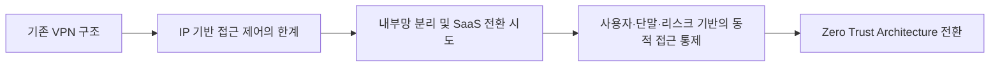

📉 많은 기업이 외부 근무자와 내부 시스템 간 안전한 연결을 위해 **SSL VPN**을 도입합니다. 하지만 정말 안전할까요?

최근 수년간 발생한 **국내외 침해 사고**를 보면, 대부분의 초기 침입 경로가 바로 **SSL VPN 장비**였습니다.

> **SSL VPN은 이제 보안의 관문이 아니라 침해의 입구**가 되고 있습니다.  
> 역설적이지만 현실입니다.

<!--more-->

---

## 1. 엣지(Edge) 장비라는 구조적 한계 🧱

SSL VPN 장비는 본질적으로 "**내부망을 인터넷에 노출시키는 출입구**"입니다. 즉:

- 외부 사용자를 위해 항상 **포트를 열어두고**,
- 내부망으로 **터널링**할 수 있게 허용하며,
- **웹 UI, SSH 등 관리 인터페이스**를 제공합니다.

> 그런데 정말로 **누구나 인터넷에서 이 장비에 접근할 수 있게 해야 할까요?**  
> **왜 방화벽에서 특정 IP만 허용하지 않았을까요?**

이 구조는 다음과 같은 **공격 노출면(Attack Surface)**을 형성합니다:

| 노출 요소      | 설명                               |
| ---------- | -------------------------------- |
| **SSL 포트** | 항상 열려 있고, 제로데이·구버전 TLS 취약점 공격 대상 |
| **Web UI** | 인증 우회, RCE, XSS 등 웹 취약점 위험       |
| **SSH 포트** | 관리자 설정 오류 시 외부 무차별 대입 공격 대상      |
| **관리자 계정** | 초기 ID/PW 사용, 다중 인증 미적용 등 설정 미비   |
| **패치 지연**  | CC 인증 장비는 검증 절차로 인해 보안 업데이트 지연   |

👉 결과적으로, **SSL VPN은 공격자 입장에서 가장 탐나는 첫 진입 지점**입니다.  
**'보안'을 위한 장비가 오히려 내부를 노출하는 출입문이 되는 셈입니다.**

---

## 2. 실제 침해 사례로 본 위험성 🚨

| 시기      | 기관(기업)                       | 침해 경로 및 원인                   | 피해 사례                 |
| ------- | ---------------------------- | ---------------------------- | --------------------- |
| 2021    | KAERI (한국원자력연구원)             | VPN 취약점으로 내부망 침투 (북한 APT 의심) | 원자력 자료 유출 가능성         |
| 2021    | KAI (한국항공우주산업)               | VPN 취약점으로 침해                 | FA-50, KF-21 관련 자료 유출 |
| 2023-24 | Ivanti/Pulse Secure/Fortinet | 인증 우회, 웹 RCE 등 다수 취약점        | 국내 통신사·공공기관 영향        |
| 2025.4  | SK텔레콤                        | Ivanti VPN 장비 제로데이 취약점 이용    | BPFDoor 백도어 침투        |
| 2025.7  | SGI 서울보증보험                   | SSL VPN 장비 SSH 무차별 대입 공격 의심  | 내부 계정 탈취 시도           |

👉 VPN 장비가 **침해의 주요 경로**라는 사실은 보안 업계에선 상식입니다.

---

## 3. OpenVPN은 괜찮은가요? 🛡️

많은 기업이 SSL VPN의 대안으로 **OpenVPN**을 고려합니다. 주요 구조적 차이는 다음과 같습니다:

| 항목       | SSL VPN            | OpenVPN         |
| -------- | ------------------ | --------------- |
| 인증 방식    | 계정 기반 (ID/PW)      | **인증서 기반(PKI)** |
| 웹 UI     | 있음 (공격 표면)         | 없음 (CLI 중심)     |
| 초기 계정 설정 | 자주 노출됨             | 개인 키 없이는 불가     |
| SSH 연결   | 가능 (설정 오류 시 외부 노출) | VPN 내부에서만 가능    |

✅ OpenVPN은 구조적으로 **무차별 대입 공격이 어렵고**,  
✅ **인증서 없이는 접속이 불가능**하며,  
✅ **신뢰된 IP로 방화벽 제한을 반드시 병행해야** 합니다.

---

## 4. VPN 침입 후에도 필요한 추가 공격 단계 🔐

VPN만 뚫는다고 끝나지 않습니다. 침해를 완성하려면 다음 단계가 필요합니다:

1. 내부 IP 자산 스캔  
2. SSH 등 접속 계정 확보  
3. 루트/관리자 권한 탈취  
4. 시스템 확산 및 lateral movement  
5. 데이터 유출 또는 랜섬웨어 실행  

👉 **VPN 침입은 시작일 뿐**이며, 내부 방어가 없으면 빠르게 확산됩니다.

---

## 5. 결론: SSL VPN은 더 이상 안전한 선택이 아니다 ❌

- SSL VPN은 **공격자가 가장 먼저 노리는 외부 노출 자산**입니다.  
- Web UI, 인증 우회, SSH 설정 오류 등 **다양한 침투 경로**가 존재합니다.  
- 실제 침해 사례들이 이를 **명확히 입증**합니다.  
- **무엇보다도, 방화벽으로 ‘신뢰된 IP에서만 접속 가능’하도록 제한해야 합니다.**  

> 단순히 인증 방식만 강화하는 것이 아니라, **‘접근 가능성 자체를 줄이는 것’이 핵심입니다.**  
> 많은 사고는 이 기본 설정만으로도 **예방 가능**했을 것입니다.

---

## 6. 원격 근무자 환경에서의 VPN 활용 원칙 🏠

원격 또는 재택 근무자 환경에선 **IP주소가 자주 바뀌거나 고정되지 않는** 경우가 많습니다.  
하지만 그렇다고 VPN 접속을 전면 개방할 수는 없습니다.

### 6-1️⃣ 운영 관리자: 고정망 + 방화벽 제한  
- 운영 서버, 배포 시스템 등 중요 인프라는  
  반드시 **고정된 사무실망 등에서만 접속 가능**하도록 구성  
- 방화벽에서 해당 IP만 허용

### 6-2️⃣ 일반 직원: VPN 후에도 네트워크 분리  
- VPN 접속만으로 전체 사내망에 접근하지 않도록 **DMZ 구조 분리**  
- 서비스별 ACL 적용, 이중 인증 병행

### 6-3️⃣ SaaS 전환 고려  
- 그룹웨어, 협업 도구 등은 사내망이 아닌 **SaaS 전환**으로 대응  
- VPN 없이도 보안 인증(MFA) 기반으로 사용 가능

| 사용자 유형       | 접속 대상              | 보안 전략 요약                              |
|----------------|---------------------|-------------------------------------------|
| 운영 관리자       | 운영 DB, 배포 시스템 등     | 고정망(IP)에서만 VPN 접속 허용 + 방화벽 접근 제한     |
| 일반 직원        | 사내 그룹웨어, 자료 공유     | VPN 접속 후 DMZ 등 일부 시스템만 접근 허용           |
| 재택·외부 협력사   | 협업 도구, 일정 관리 등       | SaaS 전환 + 단말 인증(MFA) 기반 접근                 |

> ✅ VPN 이후의 권한을 나누고,  
> ✅ SaaS 중심의 Zero Trust 구조로 전환하세요.

---

## ✅ 현실적인 대안: OpenVPN

**구조적 보안성**과 **인증서 기반 통제**를 갖춘 OpenVPN은 실현 가능한 대안입니다.

### 🔒 왜 OpenVPN 하나로도 충분할 수 있을까?

1. **공격 표면 최소화** – 웹 UI 없음  
2. **인증서 기반 접속** – 인증서 없이는 접근 불가  
3. **단순하고 투명한 구조** – 구성 및 운영이 명확  
4. **직접 보안 통제 가능** – 리눅스 도구와 연계  
5. **IP 제한 필수** – 지정된 IP만 VPN 포트 접근 허용

> 🔺 **IP 제어 없이 운영되는 VPN은 ‘내부망을 인터넷에 노출’하는 것과 같습니다.**  
> 🔺 **불특정 다수가 접속하는 구조는 VPN에 적합하지 않습니다.**

---
## 7. 그리고 궁극적으로 ZTA로 넘어가야 합니다 ⚡️

VPN은 접속을 가능하게 해주는 장치이지, ‘접속 자체의 적절성’을 판단하진 못합니다.  
보안은 단순히 접속을 허용하는 것에서 그치지 않고, **“누가, 언제, 어디서, 어떤 기기로, 무엇에 접근하려 하는가”**까지 고려한 판단이 필요합니다.  
이것이 바로 **ZTA (Zero Trust Architecture)**의 핵심 철학입니다.

### 🔄 왜 ZTA를 고려해야 할까?

| 기존 VPN 중심 모델                     | ZTA 기반 모델                                  |
|----------------------------------|--------------------------------------------|
| 내부망에 들어오면 전체 접근 가능               | 사용자·단말·행위 기반으로 **세분화된 권한 부여** 가능         |
| IP와 네트워크 기반 제어                     | **동적 정책 기반** 접근 제어 (시간, 위치, 리스크 등)       |
| 내부 자산이 한 망에 존재                        | SaaS·서비스 기반으로 **세그먼트 분리**               |
| 인증은 1차, 이후에는 자유로운 접근             | **연속적인 검증 (Continuous Verification)** 필수         |
| VPN 하나로 광범위 권한을 획득 가능               | 최소 권한 원칙 (Least Privilege) 자동 적용 가능         |
| 침해 시 내부 확산 속도가 매우 빠름                | 침해 확산 범위가 **정책 단위로 자동 차단**됨             |

> “ZTA는 단순히 VPN을 대체하는 것이 아니라, **VPN이라는 개념 자체가 불필요한 구조를 만드는 것**입니다.”

---

### 🔁 ZTA 전환 흐름 (개념도)

ZTA는 더 이상 ‘누가 접속했는가’만 보는 것이 아니라,
“**지금 이 접속이 정당한가?**”라는 맥락 중심의 보안 체계입니다.

✅ 따라서 ZTA는 **접속 자체를 줄이는 것이 아닌, 허용된 접속만 허용하는 구조**입니다.  
❌ 기존 VPN이 네트워크 자체를 통째로 개방하는 방식이었다면,  
**ZTA는 최소한의 경로만 열고, 매 접속을 검증합니다.**  

> 🔐 **VPN은 과도한 가능성을 열어두는 구조**,  
> ZTA는 **그 가능성을 ‘원천적으로 줄이는’ 보안 체계**입니다.

---

## ✅ 지금 즉시 정보보안 담당자라면 반드시 해야 할 것

| No | 점검 항목                                | 완료 여부 |
| -- | ------------------------------------ | -------- |
| 1  | VPN 장비의 제품/버전 식별 및 최신 보안 패치 적용 여부 점검 | ☐ |
| 2  | 장비 내 계정 전수 조사                        | ☐ |
| 3  | 외부 SSH 접속 가능 여부 확인                   | ☐ |
| 4  | 외부 Web GUI 접근 방화벽 정책 점검              | ☐ |
| 5  | 신뢰할 수 있는 IP주소 외 모든 외부 접근 차단 재검토      | ☐ |
| 6  | 최근 VPN 접속 로그 이상 징후 점검                | ☐ |
| 7  | VPN 접근 가능한 내부 자산 범위 점검               | ☐ |
| 8  | 계정·인증서 만료 정책 점검                      | ☐ |
| 9  | 취약점 대응 및 침해 시나리오별 대응 체계 점검           | ☐ |
| 10 | 원격 근무자 등 외부 접속 사용자를 위한 **내부 네트워크 분리 및 서비스 접근 제한이 적절한지** 점검 | ☐        |

> **SSL VPN 자체가 위협입니다.**  
> ‘정상 동작’이 아닌 ‘정상 침투’가 되는 시대입니다.

---

### 📖 함께 읽기
- 보안뉴스 기사 [SGI서울보증 랜섬웨어, 최초 침투 경로는 ‘SSL-VPN’](https://www.boannews.com/media/view.asp?idx=138214)
- KBS 뉴스 [“뚫릴 때까지 비번 넣었다”…SGI서울보증, VPN부터 해킹](https://tv.kakao.com/v/456721305)

### 🌟 PLURA-Blog
- [SGI서울보증보험 해킹 사고 분석 – 침투부터 랜섬웨어 유출까지](https://blog.plura.io/ko/threats/case-sgic_credential_stuffing/)
