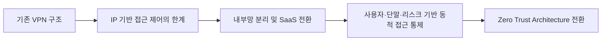

📉 많은 기업이 외부 근무자와 내부 시스템 간 안전한 연결을 위해 **SSL VPN**을 도입합니다. 하지만 정말 안전할까요?

최근 수년간 발생한 국내외 침해 사고를 보면, **많은 대규모 침해 사고에서 SSL VPN 장비가 초기 진입점으로 활용**되고 있습니다. 특히 Ivanti Connect Secure/Policy Secure와 Fortinet FortiOS SSL VPN 계열은 CISA·IPA가 별도 경보를 낼 정도로 반복적인 취약점 이슈가 이어졌습니다. :contentReference[oaicite:2]{index=2}

> **SSL VPN은 이제 보안의 관문이 아니라 침해의 입구가 될 수 있습니다.**  
> 역설적이지만, 이것이 현실입니다.

<!--more-->

---

## 1. 엣지 장비라는 구조적 한계 🧱

SSL VPN 장비는 본질적으로 **내부망을 인터넷에 노출시키는 출입구**입니다. 즉,

- 외부 사용자를 위해 항상 **포트를 열어두고**
- 내부망으로 **터널링**할 수 있게 허용하며
- **Web UI, SSH 등 관리 인터페이스**를 제공합니다

> 그런데 정말로 **누구나 인터넷에서 이 장비에 접근할 수 있게 해야 할까요?**  
> **왜 방화벽에서 특정 IP만 허용하지 않았을까요?**

이 구조는 다음과 같은 공격 노출면을 형성합니다.

| 노출 요소 | 설명 |
| --- | --- |
| **SSL 포트** | 항상 열려 있고, 제로데이·구버전 TLS 취약점 공격 대상 |
| **Web UI** | 인증 우회, RCE, XSS 등 웹 취약점 위험 |
| **SSH 포트** | 관리자 설정 오류 시 외부 무차별 대입 공격 대상 |
| **관리자 계정** | 초기 ID/PW 사용, MFA 미적용 등 설정 미비 |
| **패치 지연** | 장비 특성상 검증 절차와 운영 영향 때문에 업데이트 지연 가능 |

👉 결과적으로, **SSL VPN은 공격자 입장에서 가장 매력적인 첫 진입 지점 중 하나**입니다.  
보안을 위한 장비가 오히려 내부를 노출하는 출입문이 되는 셈입니다.

---

## 2. 실제 침해 사례로 본 위험성 🚨

| 시기 | 기관(기업) | 침해 경로 및 원인 | 피해 사례 |
| --- | --- | --- | --- |
| 2021 | KAERI (한국원자력연구원) | VPN 취약점으로 내부망 침투 의혹 | 원자력 자료 유출 우려 |
| 2021 | KAI (한국항공우주산업) | VPN 취약점 기반 침해 정황 | 방산 관련 자료 유출 논란 |
| 2023~2025 | Ivanti / Pulse Secure / Fortinet | 인증 우회, 웹 RCE 등 반복 취약점 | 국내외 통신사·공공기관·기업 영향 |
| 2025.4 | SK텔레콤 | Ivanti 계열 VPN 취약점 기반 침투 가능성 보도 | BPFDoor 관련 이슈 |
| 2025.7 | SGI 서울보증보험 | SSL VPN 계정/접속 구간 악용 정황 보도 | 내부 계정 탈취 및 운영 차질 우려 |

👉 보안 업계에서는 **VPN 장비가 주요 초기 진입 경로 중 하나**라는 점이 더 이상 낯선 이야기가 아닙니다. 특히 Ivanti와 Fortinet 계열 취약점은 2024~2025년에도 공식 기관이 적극 경고했습니다. :contentReference[oaicite:3]{index=3}

---

## 3. OpenVPN은 괜찮은가요? 🛡️

많은 기업이 SSL VPN의 대안으로 **OpenVPN**을 고려합니다. 구조적 차이는 분명합니다.

| 항목 | SSL VPN | OpenVPN |
| --- | --- | --- |
| 인증 방식 | 계정 기반 (ID/PW) | **인증서 기반(PKI)** 중심 구성 가능 |
| 웹 UI | 있음 | 보통 없음 또는 최소화 가능 |
| 초기 계정 노출 | 자주 문제됨 | 개인 키·인증서 없이는 접근 어려움 |
| SSH 노출 | 설정 오류 시 외부 노출 가능 | 별도 설계 없이는 직접 노출되지 않음 |

✅ OpenVPN은 구조적으로 **무차별 대입 공격과 관리 UI 노출 측면에서 더 유리한 선택지**가 될 수 있습니다.  
✅ 다만 이것도 **IP 제한, 방화벽 정책, 인증서 관리, MFA 병행**이 빠지면 충분하지 않습니다.

즉, OpenVPN이 더 낫다는 말은  
아무 설정 없이 안전하다는 뜻이 아닙니다.

> 핵심은 제품 이름이 아니라  
> **공격 표면을 얼마나 줄였는가**입니다.

---

## 4. VPN 침입 후에도 필요한 추가 공격 단계 🔐

VPN만 뚫는다고 침해가 완성되지는 않습니다.  
공격자는 그 다음 단계를 밟아야 합니다.

1. 내부 IP 자산 스캔  
2. SSH, RDP, SMB 등 접속 계정 확보  
3. 관리자 권한 상승  
4. 시스템 확산 및 lateral movement  
5. 데이터 유출 또는 랜섬웨어 실행  

👉 즉, **VPN 침입은 시작일 뿐**입니다.  
진짜 피해는 그 뒤의 내부 확산과 정보 유출 단계에서 커집니다.

이 지점이 매우 중요합니다.

VPN은 막는 것도 중요하지만,  
**뚫렸을 때 내부에서 무슨 일이 벌어지는지 얼마나 빨리 보는가**가 더 중요해집니다.

---

## 5. 그래서 PLURA-XDR은 어디에서 의미가 있나 🔍

VPN은 뚫릴 수 있습니다.  
제로데이, 설정 미비, 약한 비밀번호, 미적용 MFA, 외부 노출 관리 포트 등 원인은 다양합니다.

하지만 실제 피해를 키우는 것은  
**그 다음 내부 행위를 늦게 보는 것**입니다.

PLURA-XDR이 의미를 갖는 지점은 바로 여기입니다.

### 5-1. 계정 기반 이상 행위 탐지
- VPN 접속 직후 평소와 다른 시스템 접근
- 비정상 시간대 로그인
- 동일 계정의 다중 자산 접근
- 로그인 이후 곧바로 관리자 권한 행위 발생

### 5-2. 내부 실행 행위 탐지
- PowerShell, WMI, LOLBAS 기반 실행
- 비정상 프로세스 체인
- 스크립트 기반 정보 수집
- 실행 후 외부 통신 연결

### 5-3. lateral movement 탐지
- 내부망 스캔
- 다수 서버 접근 시도
- 원격 실행 도구 사용
- 계정 재사용 패턴

### 5-4. 유출·랜섬웨어 전 단계 탐지
- 대량 압축
- 외부 전송 시도
- 공유 폴더 접근 증가
- 암호화 전 정찰 행위

즉, **VPN은 침입 경로를 제공할 수 있지만**,  
PLURA-XDR은 그 이후의 **행위와 흐름**을 더 빨리 보게 하는 데 의미가 있습니다.

> VPN 보안의 핵심은  
> **VPN 장비 하나를 믿는 것이 아니라,  
> 뚫린 뒤의 내부 행위를 실시간으로 볼 수 있는가**입니다.

---

## 6. 원격 근무자 환경에서의 VPN 활용 원칙 🏠

원격 또는 재택 근무자 환경에서는 IP가 자주 바뀌거나 고정되지 않는 경우가 많습니다.  
하지만 그렇다고 VPN 접속을 전면 개방할 수는 없습니다.

### 6-1. 운영 관리자: 고정망 + 방화벽 제한
- 운영 서버, 배포 시스템 등 중요 인프라는
  반드시 **고정된 사무실망 등에서만 접속 가능**하도록 구성
- 방화벽에서 해당 IP만 허용

### 6-2. 일반 직원: VPN 후에도 네트워크 분리
- VPN 접속만으로 전체 사내망에 접근하지 않도록 **DMZ 구조 분리**
- 서비스별 ACL 적용
- MFA 병행

### 6-3. SaaS 전환 고려
- 그룹웨어, 협업 도구 등은 가능하면 **SaaS 전환**
- VPN 없이도 MFA 기반 접근 가능

| 사용자 유형 | 접속 대상 | 보안 전략 요약 |
| --- | --- | --- |
| 운영 관리자 | 운영 DB, 배포 시스템 등 | 고정망에서만 VPN 접속 허용 + 방화벽 접근 제한 |
| 일반 직원 | 사내 그룹웨어, 자료 공유 | VPN 접속 후 일부 시스템만 접근 허용 |
| 재택·외부 협력사 | 협업 도구, 일정 관리 등 | SaaS 전환 + 단말 인증(MFA) 기반 접근 |

> ✅ VPN 이후의 권한을 나누고  
> ✅ SaaS 중심 구조로 전환하는 것이 현실적입니다.

---

## 7. 현실적인 대안: OpenVPN과 최소 노출 원칙 ✅

OpenVPN은 현실적인 대안이 될 수 있습니다.  
하지만 대안의 핵심은 제품 교체가 아니라 **최소 노출 원칙**입니다.

### OpenVPN이 상대적으로 나은 이유
1. **공격 표면 최소화** – 웹 UI 의존도가 낮음  
2. **인증서 기반 통제** – 인증서 없이는 접속 어려움  
3. **단순하고 투명한 구조** – 구성과 운영이 비교적 명확  
4. **직접 보안 통제 가능** – 리눅스 방화벽, ACL, 인증서 정책과 결합 쉬움  
5. **IP 제한 병행 가능** – 지정된 IP만 VPN 포트 접근 허용 가능  

> 🔺 **IP 제어 없이 운영되는 VPN은 내부망을 인터넷에 노출하는 것과 비슷합니다.**  
> 🔺 **불특정 다수가 접속하는 구조는 VPN에 적합하지 않습니다.**

OpenVPN도 만능은 아닙니다.  
하지만 최소한 **웹 기반 관리면을 넓게 노출하는 SSL VPN보다는 공격 표면을 더 줄이기 쉬운 구조**라는 장점이 있습니다.

---

## 8. 그리고 궁극적으로는 ZTA로 넘어가야 합니다 ⚡️

VPN은 접속을 가능하게 해주는 장치이지,  
접속 자체의 적절성을 계속 판단해 주지는 못합니다.

NIST는 Zero Trust Architecture를  
기존의 정적인 네트워크 경계 신뢰 모델에서 벗어나,  
**사용자·자산·리소스 중심으로 매 요청을 검증하는 구조**로 설명합니다. :contentReference[oaicite:4]{index=4}

### 왜 ZTA를 고려해야 할까?

| 기존 VPN 중심 모델 | ZTA 기반 모델 |
| --- | --- |
| 내부망에 들어오면 광범위 접근 가능 | 사용자·단말·행위 기반 세분화 권한 부여 |
| IP와 네트워크 기반 제어 | 시간, 위치, 리스크를 반영한 동적 정책 |
| 한 번 인증 후 비교적 넓은 접근 허용 | 연속적 검증 필요 |
| 침해 시 내부 확산이 빠름 | 정책 단위로 확산 범위 축소 가능 |

> ZTA는 VPN을 조금 더 안전하게 쓰는 수준이 아니라  
> **VPN이 필요 없는 구조를 설계하려는 방향**에 가깝습니다.

### ZTA 전환 흐름

```mermaid
graph LR
A[기존 VPN 구조] --> B[IP 기반 접근 제어의 한계]
B --> C[내부망 분리 및 SaaS 전환]
C --> D[사용자·단말·리스크 기반 동적 접근 통제]
D --> E[Zero Trust Architecture 전환]
```

✅ 기존 VPN이 네트워크를 넓게 열어두는 방식이었다면  
✅ ZTA는 **허용된 접속만, 허용된 자산에, 허용된 조건으로** 접근하게 만드는 구조입니다.

---

## 9. 지금 즉시 정보보안 담당자라면 반드시 해야 할 것 ✅

| No | 점검 항목                                  | 완료 여부 |
| -- | -------------------------------------- | ----- |
| 1  | VPN 장비 제품/버전 식별 및 최신 보안 패치 적용 여부 점검    | ☐     |
| 2  | 장비 내 계정 전수 조사                          | ☐     |
| 3  | 외부 SSH 접속 가능 여부 확인                     | ☐     |
| 4  | 외부 Web GUI 접근 방화벽 정책 점검                | ☐     |
| 5  | 신뢰 가능한 IP 외 모든 외부 접근 차단 재검토            | ☐     |
| 6  | 최근 VPN 접속 로그 이상 징후 점검                  | ☐     |
| 7  | VPN 이후 접근 가능한 내부 자산 범위 점검              | ☐     |
| 8  | 계정·인증서 만료 정책 점검                        | ☐     |
| 9  | 침해 시나리오별 대응 체계 점검                      | ☐     |
| 10 | 원격 근무자용 네트워크 분리와 서비스 접근 제한 점검          | ☐     |
| 11 | VPN 이후 내부 행위를 실시간으로 볼 수 있는 로그·탐지 체계 점검 | ☐     |

> **SSL VPN 자체가 위협이 될 수 있습니다.**  
> 이제는 정상 동작과 정상 침투를 함께 구분해야 하는 시대입니다.

> 🏠 재택 근무자와 이동 근무자가 많은 환경이라면 접속 경계는 더 모호해집니다.  
> 🔐 그렇다면 이제는 VPN만으로는 부족합니다.  
> ✅ 접속 이후의 행위까지 보는 구조가 필요합니다.

---

## 마치며

SSL VPN은 여전히 많이 쓰입니다.  
하지만 지금의 현실은 분명합니다.

* 엣지 장비는 계속 노려지고 있고
* 제로데이와 설정 미비는 반복되고 있으며
* 실제 침해 사고에서 VPN 장비가 자주 초기 진입점이 되고 있습니다

그래서 질문은  
VPN을 쓸 것인가 말 것인가만이 아닙니다.

더 중요한 질문은 이것입니다.

**VPN이 뚫렸을 때, 우리는 내부에서 벌어지는 일을 얼마나 빨리 볼 수 있는가?**

OpenVPN 같은 더 나은 구조를 선택하고,  
방화벽으로 노출을 최소화하고,  
가능하면 SaaS와 ZTA 방향으로 전환하고,  
그 위에 PLURA-XDR 같은 **행위 기반 내부 탐지 체계**를 갖추는 것.

그 조합이 지금 현실에서 가장 실용적인 답에 가깝습니다.

---

### 📖 함께 읽기

* 보안뉴스 기사 [SGI서울보증 랜섬웨어, 최초 침투 경로는 SSL-VPN](https://www.boannews.com/media/view.asp?idx=138214)
* KBS 뉴스 [뚫릴 때까지 비번 넣었다… SGI서울보증, VPN부터 해킹](https://tv.kakao.com/v/456721305)

### 🌟 PLURA-Blog

* [SGI서울보증보험 해킹 사고 분석 – 침투부터 랜섬웨어 유출까지](https://blog.plura.io/ko/threats/case-sgic_credential_stuffing/)

---

[1]: https://www.cisa.gov/news-events/cybersecurity-advisories/aa24-060b?utm_source=chatgpt.com "Threat Actors Exploit Multiple Vulnerabilities in Ivanti ..."
