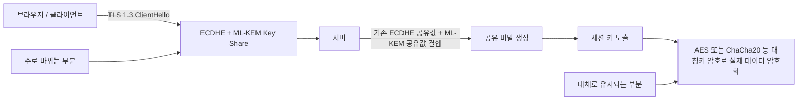

**A. 서둘러야 한다는 말은 맞습니다.  
그러나 ‘지금 당장 양자보안 제품을 도입해야 한다’는 말은 다릅니다.**

최근 PQC, 즉 양자내성암호를 둘러싼 논의에서 가장 자주 등장하는 표현은  
HNDL, Harvest Now, Decrypt Later입니다.

지금 암호화된 데이터를 수집해 두었다가,  
나중에 충분히 강력한 양자컴퓨터가 등장하면 복호화할 수 있다는 주장입니다.

이 위험은 완전히 틀린 말이 아닙니다.

장기 비밀성이 필요한 일부 데이터에는 분명히 의미가 있습니다.  
국가기밀, 군사·외교 문서, 장기 검증이 필요한 전자문서,  
장기간 가치가 유지되는 일부 연구개발 자료는  
HNDL 관점에서 검토가 필요합니다.

하지만 여기서 바로 다음 결론으로 뛰어가는 순간, 논리가 왜곡됩니다.

> “그러므로 모든 기업은 지금 당장 PQC를 도입해야 한다.”  
> “그러므로 양자보안 제품을 서둘러 구매해야 한다.”  
> “그러므로 정부와 기업은 대규모 예산을 즉시 투입해야 한다.”

이것은 기술 설명이 아니라 마케팅에 가깝습니다.

PQC는 필요합니다.  
그러나 PQC는 모든 기업이 오늘 당장 별도 제품을 사서 해결해야 하는 문제가 아닙니다.

이미 전 세계는  
NIST, IETF, OpenSSL, 브라우저, CDN 생태계를 중심으로  
표준 기반 전환을 진행하고 있습니다.

문제는 PQC 자체가 아닙니다.  
문제는 한국에서 유독 이 표준 전환 문제가  
마치 Y2K처럼 “지금 당장 전면 도입하지 않으면 큰일 난다”는 식의  
공포와 예산 언어로 바뀌고 있다는 점입니다.

PQC 전환은 해야 합니다.  
하지만 그것은 **양자보안 제품 구매**가 아니라  
**공개키 암호의 표준 전환 관리**입니다.

---

## 1부. HNDL은 사실이지만, 모든 기업의 긴급 도입 근거는 아닙니다

### 1️⃣ HNDL은 무엇을 말하는가

HNDL은 Harvest Now, Decrypt Later의 약자입니다.

공격자가 지금 암호화된 통신이나 데이터를 저장해 두었다가,  
미래에 충분히 강력한 양자컴퓨터가 등장했을 때  
이를 복호화할 수 있다는 위협 모델입니다.

이 개념 자체는 중요합니다.

특히 현재 사용 중인 RSA, DH, ECDH, ECDSA 같은 공개키 암호는  
충분히 강력한 양자컴퓨터가 등장하면 구조적으로 위험해질 수 있습니다.

따라서 장기간 비밀성이 필요한 데이터에 대해서는  
지금부터 전환 계획을 세워야 합니다.

그러나 HNDL을 말할 때 반드시 구분해야 할 것이 있습니다.

> HNDL은 미래의 복호화 위험입니다.  
> 현재 진행 중인 해킹 사고와 동일한 성격의 위험이 아닙니다.

금융권을 예로 들어 보겠습니다.

금융권에는 지금도 이미 많은 공격이 발생합니다.

- 크리덴셜 스터핑
- 계정 탈취
- 웹 취약점 공격
- API 권한 검증 오류
- 악성코드 감염
- 내부 시스템 침해
- 개인정보 유출
- 랜섬웨어
- 공급망 공격

이 공격들은 미래의 가정이 아닙니다.  
지금 실제 피해를 만들고 있습니다.

그런데 HNDL을 앞세워  
“미래 양자컴퓨터 위험 때문에 지금 당장 양자보안 제품을 도입해야 한다”고 말하면  
현재의 실전 사이버보안 우선순위가 뒤집힐 수 있습니다.

금융권이 지금 가장 먼저 해야 할 일은  
양자보안 제품을 구매하는 것이 아닙니다.

지금 발생하는 계정 탈취, 웹 공격, 내부 침해, 데이터 유출을  
실시간으로 탐지하고 차단하는 것입니다.

---

### 2️⃣ HNDL 관점의 우선순위는 이렇게 낮춰서 봐야 합니다

HNDL 위험은 분명히 존재합니다.  
그러나 모든 데이터가 같은 수준의 HNDL 위험을 갖는 것은 아닙니다.

HNDL은 기본적으로 다음 조건을 만족할 때 의미가 커집니다.

- 지금 암호화된 상태로 대량 수집될 수 있다.
- 10년 이상 지난 뒤에도 정보 가치가 유지된다.
- 한 번 노출되면 되돌리기 어렵다.
- 재발급, 폐기, 갱신으로 위험을 줄이기 어렵다.
- 국가안보, 외교, 군사, 장기 신원정보처럼 장기 비밀성이 중요하다.

반대로 일반적인 웹 로그인 세션, 단기 API 호출, 만료되는 토큰,  
일회성 결제 요청, 이미 유효기간이 지난 거래 데이터는  
HNDL 관점에서 우선순위가 상대적으로 낮습니다.

따라서 HNDL을 설명할 때도  
“위험도 매우 높음” 같은 표현을 남발해서는 안 됩니다.

그런 표현은 우리가 비판해야 할  
양자보안 공포 마케팅과 비슷하게 들릴 수 있습니다.

더 현실적인 표현은 **검토 필요성**입니다.

| No | 데이터 유형 | HNDL 관점 검토 필요성 | 설명 |
|---:|---|---|---|
| 1 | 국가기밀·군사·외교 문서 | 높음 | 장기 비밀성과 전략 가치가 있어 별도 검토가 필요함 |
| 2 | 핵심 연구개발 자료 | 중간~높음 | 기술 가치가 장기간 유지되는 경우 검토 대상이 될 수 있음 |
| 3 | 장기 신원정보·민감 개인정보 | 중간 | 장기간 악용 가능성이 있는 경우에 한해 우선 검토 필요 |
| 4 | 장기 전자문서·전자서명 | 중간~높음 | 법적 효력과 장기 검증 체계가 연결된 경우 검토 필요 |
| 5 | 일반 금융 거래 데이터 | 낮음~중간 | 대부분은 시간 경과에 따라 거래 가치가 낮아지며, 현재 해킹 대응이 더 시급함 |
| 6 | 일반 웹 세션·API 호출·만료 토큰 | 낮음 | 유효기간이 짧아 HNDL보다 현재 공격 탐지·차단이 더 중요함 |

이 표의 핵심은 단순합니다.

> HNDL은 고려해야 할 위협입니다.  
> 그러나 모든 기업과 모든 데이터를 같은 긴급성으로 묶는 것은 과장입니다.

HNDL을 이유로 모든 기업에 PQC 긴급 도입을 요구하는 것은  
현재 벌어지는 해킹 사고보다  
미래의 가정된 복호화 위험을 더 크게 포장하는 결과가 될 수 있습니다.

이것이 바로 양자보안 마케팅의 문제입니다.

---

### 3️⃣ Y2K식 접근이 왜 위험한가

최근 일부 PQC 논의는 Y2K를 떠올리게 합니다.

Y2K는 특정 시점이 다가오면  
시스템 전체가 문제를 일으킬 수 있다는 명확한 시간 기반 위험이었습니다.

그래서 모든 기업과 기관이  
일정 시점까지 시스템을 점검하고 수정해야 했습니다.

하지만 PQC 전환은 Y2K와 다릅니다.

PQC에는 아직 다음이 명확하지 않습니다.

- 실제 암호학적으로 의미 있는 양자컴퓨터가 언제 등장할지
- 어떤 수준의 시스템이 어떤 시점에 실제 위험해질지
- 일반 웹서비스의 어떤 데이터가 장기적으로 의미 있는 HNDL 대상인지
- 어느 기업이 어느 범위까지 직접 조치해야 하는지
- 표준 구현체와 브라우저·CDN 생태계가 어디까지 자동 흡수할지

물론 준비는 필요합니다.  
그러나 이것을 Y2K처럼 몰아가면 문제가 생깁니다.

Y2K식 프레임은 대체로 다음 결론으로 이어집니다.

```text
모든 기업이 위험하다
→ 지금 당장 점검해야 한다
→ 지금 당장 제품을 도입해야 한다
→ 정부 예산과 인증 사업이 필요하다
→ 도입하지 않으면 책임 문제가 된다
```

이 흐름은 기술적 우선순위보다  
공포와 책임 회피를 먼저 만듭니다.

PQC는 준비해야 합니다.  
그러나 Y2K처럼 전 기업을 긴급 동원할 사안으로 몰아가서는 안 됩니다.

정확한 접근은 다음에 가까워야 합니다.

```text
공개키 사용처를 식별한다
→ 장기 비밀성이 필요한 데이터를 구분한다
→ NIST·IETF 표준 흐름을 추적한다
→ OpenSSL·브라우저·CDN·OS 업데이트 계획을 확인한다
→ 특수 인프라는 별도 전환 계획을 세운다
→ 일반 웹서비스는 표준 생태계 전환을 따라가며 검증한다
```

즉, PQC는 **긴급 구매 사업**이 아니라  
**표준 기반 전환 관리**입니다.

---

## 2부. PQC는 전체 암호 교체가 아니라 공개키 암호 전환입니다

### 4️⃣ PQC가 바꾸는 것은 주로 공개키 영역입니다

PQC를 둘러싼 가장 큰 오해는  
마치 기존 암호체계 전체가 무너지고  
모든 암호를 새로 바꿔야 하는 것처럼 설명하는 것입니다.

그러나 정확히 보면 다릅니다.

PQC가 직접적으로 겨냥하는 영역은 주로 다음입니다.

- RSA 기반 키 교환
- DH / ECDH / ECDHE 기반 키 교환
- RSA 전자서명
- ECDSA / EdDSA 전자서명
- 공개키 인증서 체계
- 코드서명
- 내부 PKI
- 장기 전자서명 검증 체계

반대로 PQC가 직접 대체하는 것이 아닌 영역도 있습니다.

- AES-256
- 대칭키 암호 전체
- SHA-2 / SHA-3 해시 전체
- TLS 전체
- 웹 보안 전체
- 데이터베이스 암호화 전체
- 계정 보안 전체
- 침해 탐지와 대응 전체

양자컴퓨터가 대칭키 암호에 아무 영향도 없다는 뜻은 아닙니다.

Grover 알고리즘 관점에서는  
대칭키 탐색 비용이 줄어들 수 있으므로  
AES-128보다 AES-256을 사용하는 방향이 더 충분한 안전 여유를 제공합니다.

하지만 이것은 대칭키 암호 전체를 PQC로 교체한다는 뜻이 아닙니다.

대칭키 영역은 대체로  
충분한 키 길이와 안전한 운영 설정으로 대응할 수 있습니다.

따라서 핵심은 이것입니다.

> PQC는 AES-256을 대체하는 사업이 아닙니다.  
> RSA/ECC 기반 공개키 암호를 표준에 맞춰 전환하는 문제입니다.

이 구분이 흐려지면  
PQC는 쉽게 “국가 암호체계 전체 교체 사업”처럼 포장됩니다.

그때부터 기술 논의는 예산 논의로 바뀝니다.

---

### 5️⃣ NIST 표준은 이미 방향을 제시했습니다

PQC 전환의 기준점은 이미 나와 있습니다.

미국 NIST는 2024년 8월  
첫 번째 PQC 표준 3종을 최종 발표했습니다.

| No | NIST 표준 | 알고리즘 | 성격 | 주요 용도 |
|---:|---|---|---|---|
| 1 | FIPS 203 | ML-KEM | 키 캡슐화 메커니즘 | 키 교환 / 공유 비밀 생성 |
| 2 | FIPS 204 | ML-DSA | 전자서명 | 인증, 문서 서명, 코드서명 |
| 3 | FIPS 205 | SLH-DSA | 해시 기반 전자서명 | 백업 성격의 전자서명 |

여기서 특히 중요한 것은 ML-KEM입니다.

ML-KEM은 데이터를 직접 암호화하는 AES 대체물이 아닙니다.  
공개 채널에서 안전하게 공유 비밀키를 만들기 위한  
키 캡슐화 메커니즘입니다.

실제 통신 구조는 대체로 다음과 같습니다.

```text
공개키 기반 키 교환 또는 KEM
→ 공유 비밀키 생성
→ AES 또는 ChaCha20 같은 대칭키 암호로 실제 데이터 암호화
```

즉, 실제 데이터를 암호화하는 엔진이 모두 바뀌는 것이 아닙니다.

바뀌는 핵심은  
세션 키를 안전하게 만들기 위한 공개키 절차입니다.

따라서 PQC를 “전체 암호체계 교체”처럼 말하는 것은 부정확합니다.

더 정확한 표현은 이것입니다.

> PQC는 데이터 암호화 엔진을 바꾸는 사업이 아니라,  
> 안전한 세션 키를 만들기 위한 공개키 절차를 바꾸는 사업입니다.

---

### 6️⃣ TLS 하이브리드 키 교환이 실제 웹 전환의 중심입니다

일반 웹서비스 관점에서 가장 먼저 체감될 변화는  
TLS 1.3의 하이브리드 키 교환입니다.

현재 논의되는 구조는  
기존 ECDHE와 ML-KEM을 함께 사용하는 방식입니다.

이 방식은 고전 컴퓨터 공격과  
미래 양자컴퓨터 공격을 동시에 고려합니다.



이 구조가 보여주는 핵심은 분명합니다.

- 바뀌는 것은 주로 키 교환 영역입니다.
- 실제 데이터 암호화에는 여전히 AES, ChaCha20 같은 대칭키 암호가 사용됩니다.
- 따라서 일반 웹서비스의 초기 전환은 TLS 생태계 안에서 진행될 가능성이 높습니다.

이것은 독자 양자보안 제품을 사야만 가능한 문제가 아닙니다.

브라우저, CDN, OpenSSL, BoringSSL, NSS, Java, Go, 웹서버, 운영체제 배포판이  
표준을 반영하면 일반 기업은 상당 부분 그 흐름을 따라가게 됩니다.

---

## 3부. 세계의 일정은 ‘지금 전면 도입’이 아니라 단계적 전환입니다

### 7️⃣ 주요 기관과 생태계의 일정은 서로 다르지만 방향은 같습니다

PQC 전환 일정은 기관마다 다르게 표현됩니다.

그러나 큰 방향은 비슷합니다.

- 지금부터 준비한다.
- 공개키 사용처를 식별한다.
- 고위험 영역부터 우선 전환한다.
- 전체 레거시 정리는 2035년까지 길게 본다.
- 일반 웹/TLS 영역은 OpenSSL·브라우저·CDN 생태계를 통해 더 빠르게 가시화될 수 있다.

| 구분 | 일정 감각 | 의미 |
|---|---:|---|
| NIST | 2024년 표준 확정, 2030~2035년 전환 축 | FIPS 203/204/205로 표준 기준을 제시하고, 취약 공개키 알고리즘의 단계적 퇴출 방향을 제시 |
| NCSC 영국 | 2028 / 2031 / 2035 | 2028년까지 식별·계획, 2031년까지 고우선순위 전환, 2035년까지 전체 전환 완료 |
| EU | 2030 / 2035 축 | 고위험 시스템은 2030년 전후, 전체 전환은 2035년까지 보는 흐름 |
| NSA / CNSA 2.0 | 국가안보 시스템 중심으로 빠른 준비 요구 | 일반 기업 전체 기준이라기보다 국가안보·고보안 영역 기준 |
| OpenSSL / IETF / 브라우저 / CDN | 2025~2029 | 일반 웹/TLS 영역에서 가장 먼저 체감될 생태계 전환 축 |
| Google / Cloudflare | 2029 목표 | 대형 플랫폼과 CDN이 2029년 전후 PQC 전환 목표를 제시 |

여기서 중요한 것은 2035년입니다.

2035년은 “그때까지 아무것도 하지 않아도 된다”는 뜻이 아닙니다.

동시에 “모든 기업이 지금 당장 양자보안 제품을 사야 한다”는 뜻도 아닙니다.

2035년은 레거시, OT, 임베디드, 장기 전자서명, HSM/KMS, 내부 PKI,  
공공·금융·국방 특수 시스템까지 포함한  
전체 암호 생태계의 장기 마감선에 가깝습니다.

반면 일반 웹/TLS 영역은 훨씬 빠르게 움직일 수 있습니다.

---

### 8️⃣ 2029년 전후에는 웹/TLS 영역의 가시적 전환이 시작될 가능성이 높습니다

일반 웹서비스 관점에서 가장 중요한 흐름은  
OpenSSL, IETF, 브라우저, CDN입니다.

OpenSSL 3.5는 ML-KEM, ML-DSA, SLH-DSA를 지원하고,  
기본 TLS key share에 X25519MLKEM768과 X25519를 제공하는 방향으로 움직였습니다.

IETF TLS 작업반도 TLS 1.3에서  
ECDHE와 ML-KEM을 결합한 하이브리드 키 교환을 표준화하고 있습니다.

Google은 PQC 마이그레이션 목표를 2029년으로 제시했습니다.

Cloudflare도 2029년까지  
전체 제품군을 post-quantum secure 상태로 가져가겠다는 목표를 밝혔습니다.

이 흐름을 보면  
2029년 전후에는 일반 웹/TLS 영역에서  
PQC 하이브리드 키 교환의 가시적 전환이 나타날 가능성이 높습니다.

여기서 말하는 가시적 전환은 다음을 의미합니다.

- 브라우저가 하이브리드 키 교환을 지원한다.
- CDN이 기본 또는 선택 옵션으로 PQC TLS를 제공한다.
- OpenSSL과 주요 암호 라이브러리가 지원한다.
- 웹서버와 운영체제 배포판이 이를 반영한다.
- 일반 기업은 버전 업그레이드와 설정 검증으로 일부 혜택을 받는다.

이 흐름은 TLS 1.2에서 TLS 1.3으로 넘어간 과정과 유사합니다.

물론 완전히 같지는 않습니다.

PQC는 인증서, 전자서명, 코드서명, HSM/KMS, 내부 PKI, 장기검증 같은  
더 복잡한 영역을 포함합니다.

하지만 일반 웹서비스의 TLS 키 교환 영역만 놓고 보면  
표준이 정리되고, 구현체가 반영되고, 브라우저와 CDN이 먼저 움직이고,  
기업은 그 생태계 전환을 따라가는 방식이 될 가능성이 큽니다.

따라서 이렇게 말하는 것이 정확합니다.

> 일반 웹서비스의 TLS 키 교환 영역은  
> 2029년 전후 OpenSSL·IETF·브라우저·CDN 생태계를 통해  
> 가시적인 전환이 시작될 가능성이 높습니다.

이 말은  
“모든 기업이 지금 당장 양자보안 제품을 사야 한다”는 뜻이 아닙니다.

오히려 반대입니다.

표준 생태계가 이미 움직이고 있으므로  
일반 기업은 공포에 밀려 제품을 구매하기보다  
어떤 영역을 직접 관리해야 하고, 어떤 영역은 생태계 전환을 따라가면 되는지  
구분해야 합니다.

---

### 9️⃣ NCSC 일정이 느슨해 보이는 이유

NCSC의 2035년 일정은  
일반 웹서비스의 TLS 키 교환만을 말하는 일정이 아닙니다.

NCSC가 보는 범위는 훨씬 넓습니다.

- 대형 공공 시스템
- 금융·통신·에너지 같은 중요 인프라
- 내부 PKI
- 장기 전자서명
- HSM / KMS
- 레거시 시스템
- 임베디드 장비
- OT 환경
- 제품과 서비스 전체 공급망

이런 영역까지 모두 포함하면  
2035년이라는 일정은 느슨하다기보다  
현실적인 장기 마감선에 가깝습니다.

다만 이것을 한국에서 다음처럼 해석하면 곤란합니다.

> “2035년까지 해야 하니 지금 당장 모든 기업이 제품을 도입해야 한다.”

이것은 논리 비약입니다.

정확한 해석은 다음입니다.

```text
2025~2028년: 암호자산 식별, 전환 계획, 표준 추적
2028~2031년: 고위험 시스템과 장기 비밀성 데이터 우선 전환
2031~2035년: 레거시·특수 시스템까지 전체 정리
2029년 전후: 일반 웹/TLS 생태계에서 가시적 전환 본격화
```

즉, 지금 필요한 것은  
“제품 구매”가 아니라 “전환 준비”입니다.

---

## 4부. 왜 한국에서는 유독 ‘지금 도입’으로 과열되는가

### 🔟 한국식 양자보안 논의의 문제

한국에서 PQC 논의가 조심스러운 이유는  
기술 자체보다 정책 언어 때문입니다.

“양자”, “국가안보”, “차세대 암호”, “국산 보안”, “디지털 주권”,  
“미래 금융 보안”, “HNDL”, “Q-Day” 같은 단어는  
정책 사업으로 만들기 쉽습니다.

이 단어들은 모두 중요합니다.

하지만 동시에 예산을 키우는 데도 매우 강한 명분이 됩니다.

그래서 다음과 같은 흐름이 만들어질 수 있습니다.

```text
양자컴퓨터가 온다
→ 기존 암호가 깨진다
→ HNDL 위험이 있다
→ 지금 데이터를 훔치면 미래에 풀린다
→ 모든 기업이 위험하다
→ 지금 당장 PQC 제품을 도입해야 한다
→ 정부 예산과 실증 사업이 필요하다
```

이 흐름은 겉으로 보기에는 그럴듯합니다.

하지만 중간에 중요한 구분이 빠져 있습니다.

- 공개키 암호와 대칭키 암호의 구분
- 키 교환과 실제 데이터 암호화의 구분
- 장기 비밀성 데이터와 단기 웹 트래픽의 구분
- 일반 웹서비스와 특수 인프라의 구분
- 표준 전환과 제품 구매의 구분
- 실증과 검증의 구분
- 현재 해킹 대응과 미래 복호화 위험의 구분

이 구분이 빠지면  
PQC는 기술 전환이 아니라 예산 프레임이 됩니다.

---

### 1️⃣1️⃣ ‘지금 도입’이라는 표현을 의심해야 합니다

PQC 전환을 말할 때  
가장 조심해야 할 표현은 “지금 도입”입니다.

무엇을 지금 도입한다는 말입니까?

- TLS 하이브리드 키 교환입니까?
- 인증서 알고리즘 전환입니까?
- 코드서명 전환입니까?
- 내부 PKI 전환입니까?
- HSM/KMS 교체입니까?
- 장기 전자서명 검증 체계 전환입니까?
- 특정 업체의 양자보안 제품 구매입니까?

이 질문에 답하지 않은 채  
“PQC를 지금 도입해야 한다”고 말하면  
기술 범위가 흐려집니다.

특히 “전면 도입”이라는 표현은 더 조심해야 합니다.

웹 TLS 키 교환에 하이브리드 KEM을 적용한 것과  
조직 전체의 인증서, 전자서명, 코드서명, 내부 PKI, HSM/KMS까지 바꾼 것은  
전혀 다른 수준의 일입니다.

따라서 정확한 질문은 이것입니다.

> PQC를 도입해야 하는가?  
> 가 아니라,  
> 우리 조직의 어떤 공개키 사용처를 언제 어떤 표준에 맞춰 전환해야 하는가?

이 질문으로 바꾸면  
공포 마케팅이 들어설 자리가 줄어듭니다.

---

### 1️⃣2️⃣ 정부 실증과 기술 검증은 다릅니다

정부가 PQC 시범전환이나 실증 사업을 추진하는 것 자체가  
잘못된 것은 아닙니다.

필요한 영역은 분명히 있습니다.

- 국방 특수망
- 우주·위성 통신
- 교통 인프라
- 금융 결제 핵심 인프라
- 공공 암호모듈 검증
- HSM / KMS / VPN / 보안장비 상호운용성
- 장기 전자서명·전자문서 검증 체계
- 펌웨어·임베디드 장비
- OT 환경

이런 영역은 일반 웹서비스와 다릅니다.

장비 수명이 길고, 교체 주기가 느리며,  
장애 허용도가 낮고, 공공 인증 체계와도 연결됩니다.

따라서 제한된 범위의 실증과 전환 가이드는 필요합니다.

하지만 정부 실증이 곧 기술 검증을 의미하는 것은 아닙니다.

정부 사업에 선정되었다고 해서  
그 제품이 국제 표준과 완벽히 호환된다는 뜻은 아닙니다.

시범사업을 했다고 해서  
모든 기업이 같은 제품을 도입해야 한다는 뜻도 아닙니다.

따라서 정부 사업을 볼 때는 다음을 물어야 합니다.

| No | 질문 | 확인해야 할 내용 |
|---:|---|---|
| 1 | 어떤 표준을 따르는가 | NIST FIPS 203/204/205 준용 여부 |
| 2 | 어떤 영역을 전환했는가 | 키 교환, 전자서명, 인증서, 코드서명, 내부 PKI 구분 |
| 3 | 상호운용성을 검증했는가 | OpenSSL, BoringSSL, NSS, Java, Go, 웹서버, 브라우저 호환성 |
| 4 | 운영 영향을 검증했는가 | TLS 핸드셰이크 크기, MTU, 지연, 구형 장비 호환성 |
| 5 | 특수 인프라인가 일반 웹서비스인가 | 전환 긴급성과 적용 범위 구분 |
| 6 | 실증인가 검증인가 | 정부 지원과 기술 검증을 구분 |

이 질문 없이 예산만 커진다면  
PQC는 표준 전환이 아니라  
양자보안 예산 사업이 될 수 있습니다.

---

## 5부. 실제로 지금 해야 할 일

### 1️⃣3️⃣ 일반 기업이 지금 해야 할 일

일반 기업이 지금 해야 할 일은  
양자보안 제품을 서둘러 구매하는 것이 아닙니다.

우선 다음을 정리해야 합니다.

| No | 해야 할 일 | 설명 |
|---:|---|---|
| 1 | 공개키 사용처 식별 | TLS 인증서, SSH, VPN, 내부 API mTLS, 코드서명, 내부 PKI 확인 |
| 2 | TLS 1.3 적용 현황 확인 | TLS 1.2 의존, 구형 cipher suite, 구형 장비 여부 확인 |
| 3 | OpenSSL·웹서버 버전 확인 | OpenSSL, Nginx, Apache, Java, Go, Node.js 등 런타임 확인 |
| 4 | CDN 사용 여부 확인 | Cloudflare, Akamai, Fastly 등 CDN의 PQC 지원 로드맵 확인 |
| 5 | 장기 비밀성 데이터 구분 | HNDL 관점에서 장기 가치가 있는 데이터만 별도 표시 |
| 6 | HSM/KMS 사용 여부 확인 | 벤더의 PQC 지원 일정과 인증 기준 확인 |
| 7 | 내부 PKI 확인 | 사내 인증서 발급·폐기·갱신 구조 확인 |
| 8 | 코드서명·펌웨어 서명 확인 | 장기 검증과 업데이트 경로 점검 |
| 9 | 호환성 테스트 계획 | MTU, 패킷 분할, 구형 방화벽·프록시·IPS 문제 확인 |
| 10 | 현재 공격 대응 강화 | 계정 탈취, 웹 공격, 내부 침해, 데이터 유출 탐지·차단 강화 |

여기서 마지막 항목이 중요합니다.

PQC 준비는 필요하지만,  
현재 공격 대응을 뒤로 미루는 명분이 되어서는 안 됩니다.

현재 공격을 못 막는 조직이  
미래 양자컴퓨터에 대비한다는 것은  
우선순위가 맞지 않습니다.

---

### 1️⃣4️⃣ 금융권이 지금 물어야 할 질문

금융권은 HNDL 논의에서 자주 언급됩니다.

물론 금융권은 중요합니다.

그러나 금융권의 모든 데이터가  
HNDL 관점에서 같은 수준의 긴급성을 갖는 것은 아닙니다.

금융권이 지금 물어야 할 질문은 다음입니다.

#### 현재 공격 대응 관점

- 크리덴셜 스터핑을 실시간 탐지하고 차단하는가?
- 정상 계정 탈취 이후 이상 행위를 탐지하는가?
- 웹/API 요청 본문을 분석하는가?
- 대량 조회와 비정상 다운로드를 탐지하는가?
- 내부 서버에서 실행된 프로세스를 추적하는가?
- 계정·권한 변경을 실시간으로 확인하는가?
- 침해 전후 포렌식 diff를 확인할 수 있는가?

#### PQC 전환 준비 관점

- 외부 웹 TLS 인증서와 내부 mTLS 사용처를 식별했는가?
- HSM/KMS가 어떤 공개키 알고리즘을 사용하는가?
- 내부 PKI와 인증서 수명주기를 파악했는가?
- 장기 전자서명과 법적 검증이 필요한 문서가 있는가?
- 10년 이상 비밀성이 필요한 암호화 데이터가 무엇인가?
- OpenSSL·Java·Go·웹서버·CDN의 전환 로드맵을 확인했는가?

이 두 그룹의 질문 중  
현재 공격 대응 질문에 답하지 못한다면  
PQC 제품 도입을 먼저 말하는 것은 순서가 맞지 않습니다.

금융권에는 지금도 해킹이 발생합니다.

따라서 금융권의 우선순위는 다음이어야 합니다.

```text
1. 현재 발생하는 계정 탈취·웹 공격·내부 침해 대응
2. 장기 비밀성 데이터와 공개키 사용처 식별
3. 표준 생태계 전환 로드맵 추적
4. 고위험 영역부터 단계적 PQC 전환
```

---

### 1️⃣5️⃣ 특수 인프라는 예외적으로 더 빠른 준비가 필요합니다

모든 조직이 같은 속도로 움직일 필요는 없습니다.

하지만 일부 영역은 더 빠르게 준비해야 합니다.

| 영역 | 왜 별도 준비가 필요한가 |
|---|---|
| 국방·정보·외교 | 장기 비밀성과 전략 가치가 큼 |
| 우주·위성 통신 | 장비 수명과 교체 주기가 길고 접근이 어려움 |
| 금융 핵심 결제 인프라 | HSM/KMS, 인증서, 장기 검증, 규제와 연결됨 |
| 공공 PKI | 인증 체계 변경이 사회 전체에 영향을 줄 수 있음 |
| 장기 전자서명·전자문서 | 법적 효력과 장기 검증 문제가 연결됨 |
| 펌웨어·임베디드 | 업데이트가 어렵고 교체 주기가 길음 |
| OT·산업제어 | 장애 허용도가 낮고 레거시 장비가 많음 |

이 영역은 일반 웹서비스와 다릅니다.

따라서 정부 실증, 상호운용성 테스트, 전환 가이드가 필요할 수 있습니다.

하지만 이것을 일반 기업 전체에 그대로 확대해서는 안 됩니다.

특수 인프라의 긴급성과  
일반 웹서비스의 전환 속도는 구분해야 합니다.

---

## 6부. PQC 마케팅에서 조심해야 할 표현들

### 1️⃣6️⃣ 다음 표현은 반드시 질문해야 합니다

PQC 제품이나 양자보안 사업을 볼 때  
다음 표현은 특히 조심해야 합니다.

| No | 표현 | 확인해야 할 질문 |
|---:|---|---|
| 1 | 기존 암호가 모두 깨진다 | RSA/ECC 공개키를 말하는가, AES까지 말하는가? |
| 2 | 모든 기업이 지금 도입해야 한다 | 어떤 데이터와 어떤 시스템이 긴급 대상인가? |
| 3 | HNDL 때문에 금융권이 위험하다 | 현재 금융권 해킹 대응보다 우선순위가 높은 근거는 무엇인가? |
| 4 | PQC 전면 도입 | TLS 키 교환만인가, 인증서·서명·PKI·HSM까지인가? |
| 5 | 독자 양자보안 플랫폼 | NIST 표준 준용인가, 독자 알고리즘인가? |
| 6 | 정부 실증 완료 | 실증인가, 표준 적합성 검증인가? |
| 7 | 양자컴퓨터로도 해독 불가능 | 수학적 안전성과 구현 안전성을 구분했는가? |
| 8 | 자동 전환 | 어떤 알고리즘과 인증서를 자동으로 바꾸는가? |
| 9 | Q-Day 임박 | 구체적 근거와 적용 대상은 무엇인가? |

특히 “모든 기업”이라는 표현은 거의 항상 의심해야 합니다.

보안에서 모든 기업이 같은 위협과 같은 우선순위를 갖는 경우는 드뭅니다.

PQC도 마찬가지입니다.

---

### 1️⃣7️⃣ 좋은 질문은 ‘도입 여부’가 아니라 ‘전환 범위’입니다

PQC 논의를 제대로 하려면  
질문을 바꿔야 합니다.

나쁜 질문은 이것입니다.

> PQC를 지금 도입해야 하는가?

좋은 질문은 이것입니다.

> 우리 조직은 어떤 공개키 사용처를 갖고 있는가?  
> 그중 어떤 것은 장기 비밀성과 연결되는가?  
> 어떤 것은 표준 생태계 전환을 따라가면 되는가?  
> 어떤 것은 직접 전환 계획이 필요한가?

이 질문으로 바꾸면  
PQC는 공포가 아니라 관리 대상이 됩니다.

그리고 기술 범위도 명확해집니다.

```text
웹 TLS 인증서
VPN / SSLVPN
SSH
내부 API mTLS
코드서명
내부 PKI
HSM / KMS
장기 전자서명
펌웨어 서명
임베디드 장비
OT / 산업제어
```

이 목록을 기준으로  
각각의 표준 지원 여부와 전환 시점을 확인하면 됩니다.

---

## 7부. 정리하면

### 1️⃣8️⃣ PQC는 준비해야 하지만, 호들갑을 떨 일은 아닙니다

PQC는 필요합니다.

양자컴퓨터가 충분히 발전하면  
RSA, DH, ECDH, ECDSA 같은 공개키 암호는 위험해질 수 있습니다.

HNDL도 완전히 무시할 수 없습니다.

장기 비밀성이 필요한 데이터는  
지금부터 식별하고 전환 계획을 세워야 합니다.

그러나 이것이 곧  
모든 기업이 지금 당장 양자보안 제품을 도입해야 한다는 뜻은 아닙니다.

특히 일반 웹서비스의 TLS 키 교환 영역은  
NIST·IETF·OpenSSL·브라우저·CDN 생태계가 움직이면서  
2029년 전후 가시적인 전환이 시작될 가능성이 높습니다.

많은 기업은 이 흐름을 따라  
운영체제, 웹서버, 암호 라이브러리, CDN, 브라우저 업데이트를 통해  
자연스럽게 일부 전환 효과를 받게 될 것입니다.

반면 내부 PKI, HSM/KMS, 장기 전자서명, 코드서명, 펌웨어, OT, 국방·금융 핵심 인프라는  
별도의 계획이 필요합니다.

이 구분 없이  
“모든 기업이 지금 당장 PQC를 도입해야 한다”고 말하는 것은  
Y2K식 공포 마케팅에 가깝습니다.

정확한 결론은 다음입니다.

> PQC는 해야 합니다.  
> 그러나 PQC는 양자보안 제품 구매가 아니라  
> 공개키 암호의 표준 전환 관리입니다.

---

### 1️⃣9️⃣ 지금 필요한 것은 제품 구매가 아니라 우선순위입니다

지금 기업이 해야 할 일은 다음입니다.

```text
1. 공개키 사용처를 식별한다.
2. 장기 비밀성이 필요한 데이터를 구분한다.
3. TLS 1.3과 암호 라이브러리 현황을 점검한다.
4. OpenSSL·브라우저·CDN·OS·웹서버 로드맵을 추적한다.
5. HSM/KMS·내부 PKI·코드서명·장기 전자서명은 별도 계획을 세운다.
6. 현재 발생하는 계정 탈취·웹 공격·내부 침해 대응을 강화한다.
7. 특수 인프라와 일반 웹서비스를 구분한다.
8. 정부 실증과 기술 검증을 구분한다.
```

이것이 현실적인 PQC 대응입니다.

PQC는 미래를 위한 준비입니다.

하지만 보안의 우선순위는  
미래의 가능성과 현재의 피해를 함께 봐야 합니다.

현재 해킹을 막지 못하면서  
미래 양자컴퓨터만 걱정하는 것은 균형이 맞지 않습니다.

---

## 결론

PQC는 필요합니다.

그러나 PQC는 Y2K가 아닙니다.

모든 기업이 같은 날까지  
같은 제품을 도입해야 하는 문제가 아닙니다.

PQC는 AES-256을 대체하는 사업도 아니고,  
전체 암호체계를 한 번에 갈아엎는 사업도 아닙니다.

핵심은 RSA/ECC 기반 공개키 암호를  
NIST·IETF·OpenSSL·브라우저·CDN 생태계에 맞춰  
단계적으로 전환하는 것입니다.

HNDL은 고려해야 합니다.

하지만 HNDL을 이유로  
현재 벌어지는 계정 탈취, 웹 공격, 내부 침해, 데이터 유출보다  
PQC 제품 구매를 앞세워서는 안 됩니다.

특수 인프라는 빠르게 준비해야 합니다.

그러나 일반 기업과 일반 웹서비스는  
표준 생태계 전환을 따라가며  
공개키 사용처 식별, 호환성 검증, 단계적 전환 계획을 세우면 됩니다.

따라서 이 질문에 대한 답은 분명합니다.

> **PQC는 준비해야 합니다.  
> 그러나 호들갑을 떨 일은 아닙니다.  
> 지금 필요한 것은 양자보안 제품 구매가 아니라  
> 표준 기반 전환 관리입니다.**

“PQC 전환을 준비하라”는 말은 맞습니다.

그러나 “양자보안 제품을 지금 사라”는 말은 다른 이야기입니다.

전자는 표준 전환입니다.

후자는 마케팅일 수 있습니다.

---

## 📖 함께 읽기

- [PQC(양자내성암호)는 독자 모델이 아니라 표준 전환이다: 과장된 마케팅과 예산 사업화의 문제](https://blog.plura.io/ko/column/pqc_standard_model_and_marketing_hype/)
- [비복호화 탐지의 기술적 한계와 마케팅 과장](https://blog.plura.io/ko/column/limitations_of_non_decryption_detection/)
- [Q25. 제로트러스트, 도입해야 하나요?](https://blog.plura.io/ko/qna/q25-zta/)
- [AI 공격 시대, 정부 안내문은 왜 실전 대응 기준이 되지 못하는가](https://blog.plura.io/ko/column/policy-proposal-ai-cyberattack-response/)
- [PLURA-XDR은 Mythos AI 해킹 공격에 어떻게 대응하는가?](https://blog.plura.io/ko/column/plura-xdr-mythos-ai-threat-response/)

---

## 참고 자료

- [NIST: Post-Quantum Cryptography Standards](https://www.nist.gov/news-events/news/2024/08/nist-releases-first-3-finalized-post-quantum-encryption-standards)
- [NIST FIPS 203: ML-KEM](https://csrc.nist.gov/pubs/fips/203/final)
- [NIST FIPS 204: ML-DSA](https://csrc.nist.gov/pubs/fips/204/final)
- [NIST FIPS 205: SLH-DSA](https://csrc.nist.gov/pubs/fips/205/final)
- [NCSC: Timelines for migration to post-quantum cryptography](https://www.ncsc.gov.uk/guidance/pqc-migration-timelines)
- [OpenSSL 3.5 Release Notes](https://openssl-library.org/news/openssl-3.5-notes/)
- [IETF TLS Draft: Post-quantum hybrid ECDHE-MLKEM Key Agreement for TLS 1.3](https://datatracker.ietf.org/doc/draft-ietf-tls-ecdhe-mlkem/)
- [Google: Quantum frontiers may be closer than they appear](https://blog.google/innovation-and-ai/technology/safety-security/cryptography-migration-timeline/)
- [Cloudflare: Cloudflare targets 2029 for full post-quantum security](https://blog.cloudflare.com/post-quantum-roadmap/)
