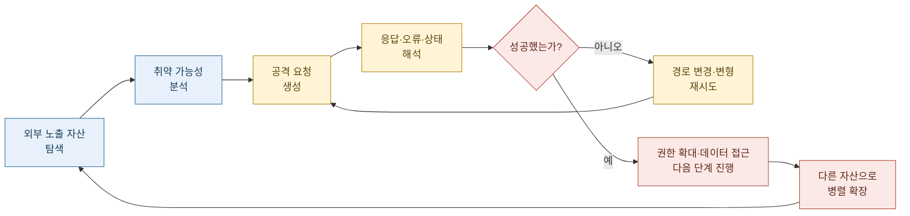
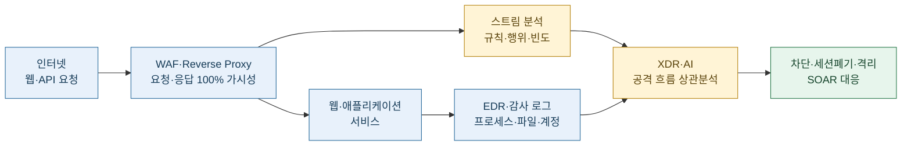
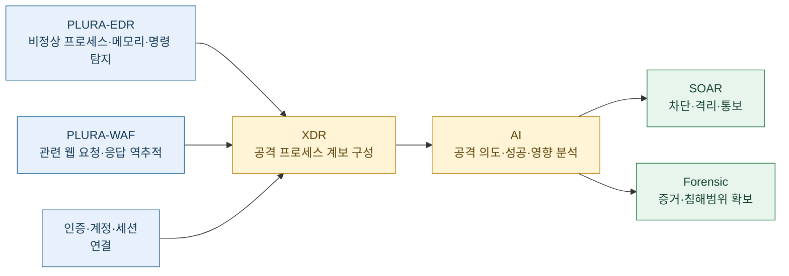

2026년 10월 초, 금융권에서 침해사고와 정보유출이 잇따르면서 ‘**AI 해킹**’이 중요한 화두로 떠올랐습니다.

금융당국도 AI를 활용한 공격 가능성을 언급했습니다. 다만 개별 사건의 AI 활용 범위와 구체적인 침투 과정은 추가 확인이 필요합니다.

이번 사건이 던지는 근본적인 질문은 이것입니다.

> **보안에 막대한 비용을 투자하는 금융회사들이 왜 실제 해킹 공격에는 뚫리고 있는가?**

AI가 공격을 얼마나 빠르고 정교하게 만드는지, 기존 보안체계의 무엇이 부족했는지, 그리고 지금 당장 무엇을 바꿔야 하는지 살펴보겠습니다.

---

## 먼저 결론부터 말씀드리면

**AI는 기존 사이버 공격의 속도·규모·반복 능력을 크게 높이고 있습니다.**

하지만 AI 공격도 웹 요청·응답, 인증, 서버 프로세스, 계정 사용, 데이터 접근 등의 흔적을 남깁니다.

따라서 핵심은 세 가지입니다.

1. **보안 투자의 우선순위** — 모든 보안 업무가 필요하지만, 실제 공격을 막는 핵심 통제부터 가장 강하게 구축해야 합니다.
2. **공격 데이터의 가시성** — 웹 요청·응답 원본과 서버 내부 행위를 확보하고 연결해야 합니다.
3. **AI 기반 실시간 대응** — 자동화된 공격을 기계와 AI로 신속하게 분석하고 차단해야 합니다.

> **공격자는 AI를 활용해 공격을 자동화하고 있습니다.**  
> **방어자도 실제 공격 데이터를 기반으로 탐지·분석·차단을 자동화해야 합니다.**

---

### 1️⃣ 은행은 다른 업권보다 보안에 많이 투자하는데도 왜 사고가 반복될까요?

#### 1.1 ISMS-P 101개 항목을 모두 준수하면 해킹을 막을 수 있을까요?

금융회사는 보안에 많은 예산을 투입합니다.

내부통제, 개인정보 보호, 망분리, 접근통제, 보안 인증, 감사 대응, 백업과 복구 등 수행해야 할 업무도 많습니다.

이러한 활동은 모두 필요합니다.

그러나 **해야 할 일이 많다는 사실과 모든 일을 같은 우선순위로 수행해야 한다는 것은 전혀 다릅니다.**

대표적인 정보보호 인증체계인 ISMS-P를 살펴보겠습니다.

| 구분 | 인증기준 | 주요 내용 |
|---|---:|---|
| 관리체계 수립 및 운영 | 16개 | 정책, 위험관리, 점검 및 개선 |
| 보호대책 요구사항 | 64개 | 접근통제, 암호화, 시스템 보안, 사고 대응 등 |
| 개인정보 처리단계별 요구사항 | 21개 | 수집·이용·제공·파기, 정보주체 권리보호 |
| **합계** | **101개** | **정보보호 및 개인정보보호 관리체계 전반** |

출처: [KISA ISMS-P 인증기준](https://isms.kisa.or.kr/sysm/intro/selectSysmCertDetail.do)

101개 항목은 조직의 정보보호 관리와 개인정보 보호에 필요한 광범위한 요구사항을 담고 있습니다.

그러나 **101개 항목의 준수 여부와 실제 해킹 공격을 탐지하고 차단하는 능력은 동일하지 않습니다.**

예를 들어 다음과 같은 질문에는 별도의 기술적 검증이 필요합니다.

- 웹방화벽이 공격을 실제로 차단하고 있는가?
- 웹방화벽을 우회한 공격까지 탐지하고 있는가?
- 공격이 서버에서 성공했는지 확인할 수 있는가?
- 공격 발견 후 즉시 차단하고 있는가?

인증을 받았다는 사실만으로 이러한 능력이 모두 검증됐다고 볼 수는 없습니다.

#### 1.2 101개 중 실제 사이버 공격 대응의 핵심은 얼마나 될까요?

ISMS-P 인증기준을 관리·예방·보호 중심이 아니라 **실제 사이버 공격의 탐지·분석·차단·대응**이라는 관점에서 다시 살펴볼 필요가 있습니다.

필자는 직접적인 공격 대응에 초점을 맞춘 항목을 엄격하게 분류하면 약 10개 수준으로 압축할 수 있다고 봅니다.

특히 외부 웹·API 공격에 집중하면 최우선 과제는 두 가지로 더욱 명확해집니다.

| 구분 | 범위 | 핵심 목적 |
|---|---|---|
| 정보보호 관리 전체 | 101개 인증기준 | 조직의 정보보호·개인정보보호 관리 |
| 실전 사이버 공격 대응 | 약 10개 관련 항목 | 공격 탐지·분석·차단·대응 |
| **웹 공격 대응 최우선 과제** | **2가지 핵심 능력** | **WAF 차단 + WAF 우회 공격 탐지·대응** |

여기서 약 10개는 필자의 실전 대응 관점에 따른 분류이며, 마지막 2가지는 공식 인증기준의 항목 수가 아닌 **기술적 대응 능력의 구분**입니다.

두 가지 능력을 구체적으로 살펴보겠습니다.

**① 웹방화벽(WAF)의 실시간 공격 차단**

웹방화벽이 설치되어 있다는 사실보다 실제 공격을 차단하고 있는지가 중요합니다.

알려진 웹 취약점 공격, 악성 요청, 반복적인 인증 공격 등을 탐지하고 적절한 정책으로 차단해야 합니다.

**② 웹방화벽을 우회한 공격의 탐지·대응**

웹방화벽도 모든 공격을 차단할 수는 없습니다.

새로운 취약점이나 변형된 공격, 정상 요청처럼 보이는 악성 행위는 웹방화벽을 통과할 수 있습니다.

따라서 웹 요청·응답 원본과 서버의 프로세스·파일·계정 행위를 함께 분석하여 우회 공격을 찾아내고, 실제 침해가 확인되면 즉시 차단·격리할 수 있어야 합니다.

이 두 가지는 서로를 보완합니다.

> **첫 번째 방어선은 공격을 차단하는 것입니다.**  
> **두 번째 방어선은 차단되지 않은 공격을 찾아내고 멈추는 것입니다.**

이것이 웹 공격 대응에서 가장 먼저 완성해야 할 핵심 능력입니다.

물론 이 두 가지가 인증, 권한관리, 개발보안 등 모든 보안 통제를 대체하는 것은 아닙니다.

핵심은 **실제 공격의 피해를 막는 능력에 가장 높은 우선순위를 부여해야 한다**는 것입니다.

#### 1.3 그렇다면 금융권의 문제는 무엇일까요?

금융권의 문제를 단순히 보안 투자 부족으로 설명하기는 어렵습니다.

보다 중요한 것은 **투자한 보안체계가 실제 공격을 얼마나 효과적으로 차단하고 있는가**입니다.

특히 다음과 같은 운영상의 공백을 살펴봐야 합니다.

- **외부 노출 자산**: 인터넷뱅킹뿐 아니라 계열사·외주·제휴·개발 시스템까지 보호하고 있는가?
- **웹방화벽 운영**: 탐지에 머무르지 않고 실제 차단하고 있는가?
- **우회 공격 대응**: WAF를 통과한 공격을 서버 행위와 연결하여 탐지하는가?
- **대응 속도**: 공격 발생 후 몇 초·몇 분 안에 차단하는가?

공격자가 AI를 활용해 수많은 시스템을 빠르게 공격하는데, 방어자는 개별 경보를 수동으로 확인하고 여러 단계의 승인을 거친다면 대응이 늦어질 수밖에 없습니다.

**보안 예산을 늘리는 것만으로는 해결할 수 없습니다.**

> **문제는 101개 인증기준을 준수해야 한다는 데 있지 않습니다.**  
> **101개를 관리하는 과정에서 정작 공격의 성패를 가르는 핵심 방어 능력이 후순위로 밀려날 수 있다는 데 있습니다.**

**모든 보안 업무를 수행하되, 실제 공격을 막는 가장 중요한 통제부터 가장 단단하게 구축해야 합니다.**

이것이 금융권 보안 투자의 우선순위를 다시 검토해야 하는 이유입니다.

### 2️⃣ AI를 활용한 해킹은 기존 해킹과 비교해 무엇이 달라졌을까요?

AI가 새로운 취약점이라는 뜻은 아닙니다.

AI는 공격자의 **탐색·분석·개발·반복·확장 비용을 낮추는 도구**입니다.

| No. | 구분 | 전통적인 사람 중심 공격 | AI 활용 공격 |
| ---: | --- | --- | --- |
| 1 | 공격 대상 탐색 | 사람이 자산과 서비스를 하나씩 조사 | 다수 자산을 병렬로 탐색·분류 |
| 2 | 취약점 가설 | 경험과 수작업에 의존 | 문서·응답·코드를 분석해 후보를 빠르게 생성 |
| 3 | 공격 요청 작성 | 제한된 수의 페이로드를 수동 제작 | 다수 변형을 자동 생성 |
| 4 | 서버 응답 해석 | 사람이 결과를 읽고 다음 시도 결정 | 응답을 분석해 다음 행동을 자동 선택 |
| 5 | 공격 시간 | 공격자의 작업시간과 인력에 영향 | 24시간 반복 실행 가능 |
| 6 | 동시 공격 규모 | 인력을 늘려야 확대 | 에이전트와 인스턴스를 늘려 병렬화 |
| 7 | 우회 시도 | 규칙이 막히면 사람이 수정 | 차단 결과를 반영해 표현·순서·경로 변경 |
| 8 | 보고와 정리 | 공격자가 수동으로 기록 | 발견한 자산·취약점·성공 결과를 자동 정리 |

AI 에이전트를 활용한 공격은 다음과 같은 반복 구조로 움직일 수 있습니다.

#### 2.1 가장 큰 변화는 ‘한 번의 천재적인 공격’보다 ‘끊임없는 반복’입니다

AI 공격을 지나치게 신비화하면 대응 방향을 놓칠 수 있습니다.

실제 위험은 AI가 마법처럼 모든 보안장비를 무력화하는 데만 있지 않습니다.

- 사람이 지나칠 외부 사이트를 찾아냅니다.
- 작은 인증 오류와 접근통제 누락을 대량으로 시험합니다.
- 동일한 취약점을 여러 금융회사에 반복 적용합니다.
- 차단 규칙을 피해 요청 형식을 계속 바꿉니다.
- 공격 성공 가능성이 낮아도 비용이 적기 때문에 계속 시도합니다.

> **AI 공격의 핵심은 지능만이 아니라 속도·규모·지속성·적응성입니다.**

#### 2.2 방어자가 어려워지는 이유는 공격 속도와 경보량이 동시에 증가하기 때문입니다

AI가 공격 요청을 대량으로 생성하면 방어자는 다음 문제를 겪습니다.

- 비슷하지만 조금씩 다른 공격이 급증합니다.
- 고정된 문자열과 단순 시그니처만으로 분류하기 어려워집니다.
- 정상 자동화와 악성 자동화를 구분해야 합니다.
- 여러 사이트에서 발생한 작은 징후를 하나의 공격자로 연결해야 합니다.
- 사람이 분석을 끝내기 전에 공격자가 다음 단계로 이동할 수 있습니다.

따라서 방어도 자동화되어야 합니다.

사람이 모든 경보를 하나씩 읽는 방식으로는 AI 공격의 속도를 따라가기 어렵습니다.

---

### 3️⃣ AI 때문에 기존 보안체계가 뚫린 것일까요, 원래 있던 빈틈을 AI가 더 빨리 찾은 것일까요?

대부분의 경우에는 **원래 존재하던 공격면과 통제 공백을 AI가 더 빠르게 찾고 반복 악용한 것**으로 보는 것이 합리적입니다.

다만 두 설명은 완전히 분리되지 않습니다.

AI가 기존 취약점을 빠르게 찾는 동시에, 사람이 발견하기 어려운 조합과 우회 경로를 만들어 기존 보안의 한계를 드러낼 수도 있기 때문입니다.

다음과 같이 이해할 수 있습니다.

> **피해 가능성 = 공격면 × 취약성 × AI의 속도·규모 × 관찰 공백 × 대응 지연**

#### 3.1 AI가 만들어내지 않은 것

AI가 다음 문제를 새로 만들어낸 것은 아닙니다.

- 외부에 방치된 오래된 웹사이트
- 인증이 없는 조회 기능
- 과도한 접근권한
- 패치되지 않은 취약점
- 탐지 모드로만 운영되는 WAF
- 수집되지 않는 웹 응답 본문
- 서버 감사 로그 부재
- 늦은 경보 확인과 차단 승인
- 분리된 보안제품과 조직

이 문제는 AI 이전에도 위험했습니다.

AI는 그 위험을 더 빠르고 경제적으로 악용할 수 있게 합니다.

#### 3.2 AI가 새롭게 확대하는 것

반면 AI는 다음 능력을 확대합니다.

- 공개자료와 오류 메시지를 결합한 취약점 추론
- 여러 작은 약점을 연결한 공격경로 구성
- 요청 형식과 인코딩을 바꾼 우회 시도
- 공격 결과를 평가한 자동 재시도
- 여러 산업·기업에 대한 동시 공격
- 탈취한 정보의 자동 분류와 2차 악용

#### 3.3 ‘AI 해킹’도 자율화 수준을 구분해야 합니다

| No. | 단계 | 의미 |
| ---: | --- | --- |
| 1 | AI 보조 공격 | 사람이 공격을 주도하고 AI가 검색·코드·문서작성을 지원 |
| 2 | AI 가속 공격 | 스캔·페이로드 생성·분류·반복을 자동화 |
| 3 | 에이전트형 공격 | 목표를 주면 AI가 계획·실행·결과평가·재시도를 반복 |
| 4 | 고도 자율 공격 | 여러 도구와 계정을 연결해 장시간 공격을 거의 독립적으로 수행 |

공개된 자료만으로 사건마다 어느 단계였는지를 모두 단정해서는 안 됩니다.

‘AI 도구 활용 정황’과 ‘완전 자율형 공격 확인’은 구분해야 합니다.

> **공격자가 사람인지 AI인지보다 더 중요한 질문은 어떤 요청이 들어왔고, 통제가 왜 막지 못했으며, 공격이 어디까지 성공했는가입니다.**

---

### 4️⃣ 같은 금융권에서도 회사별 피해 규모가 다른 이유는 무엇이고, 실제 보안 수준은 무엇으로 확인해야 할까요?

같은 공격자가 유사한 방법으로 여러 금융회사를 공격하더라도 결과는 다를 수 있습니다.

#### 4.1 피해 규모를 가르는 주요 요소

| No. | 영역 | 피해 차이를 만드는 요소 |
| ---: | --- | --- |
| 1 | 공격면 | 외부에 노출된 웹·API·관리 페이지의 수와 관리 상태 |
| 2 | 인증 | 다중인증, 세션 검증, 비정상 로그인 통제 여부 |
| 3 | 접근통제 | 인증된 사용자에게도 필요한 데이터만 허용하는지 여부 |
| 4 | 데이터 최소화 | 조회 화면과 API가 불필요한 개인정보를 반환하는지 여부 |
| 5 | WAF 운영 | 탐지에 그치는지, 검증된 공격을 실제 차단하는지 여부 |
| 6 | 웹 가시성 | 요청뿐 아니라 응답·본문까지 확인할 수 있는지 여부 |
| 7 | 서버 가시성 | 프로세스·명령·파일·권한·네트워크 행위를 수집하는지 여부 |
| 8 | 내부 확산 통제 | 한 시스템 침해가 다른 시스템으로 이어지지 않도록 분리했는지 여부 |
| 9 | 외부 전송 통제 | 비정상 데이터 조회·수집·반출을 탐지하는지 여부 |
| 10 | 대응 속도 | 탐지 후 세션·계정·IP·호스트를 얼마나 빨리 차단하는지 여부 |

핵심 시스템이 강하더라도 외부에 노출된 작은 업무서비스 하나가 약하면 사고가 시작될 수 있습니다.

반대로 취약점이 존재했더라도 인증, 최소권한, WAF 차단, EDR 탐지, 외부 전송 통제 중 하나가 제대로 작동하면 피해가 크게 줄어들 수 있습니다.

#### 4.2 보안제품의 개수와 인증서만으로는 실제 보안 수준을 알 수 없습니다

다음 질문에 근거 데이터로 답할 수 있어야 합니다.

1. 인터넷에 노출된 모든 웹사이트와 API를 식별하고 있습니까?
2. 운영 종료·외주·계열사·개발 시스템까지 포함하고 있습니까?
3. 웹 요청·응답과 본문을 분석할 수 있습니까?
4. WAF가 탐지만 합니까, 실제 차단도 합니까?
5. 크리덴셜 스터핑과 인증 우회 시도를 실시간 탐지합니까?
6. 웹서버에서 실행된 프로세스와 명령을 확인할 수 있습니까?
7. 웹 요청과 서버 내부 행위를 하나의 사건으로 연결할 수 있습니까?
8. 데이터가 조회·수집·외부 전송됐는지 판단할 수 있습니까?
9. 고위험 공격을 몇 분 안에 차단할 수 있습니까?
10. 공격자의 목표가 달성되지 않았음을 데이터로 증명할 수 있습니까?

> **실제 보안 수준은 ‘무엇을 설치했는가’보다 ‘공격이 들어왔을 때 무엇을 보았고, 어디서 막았으며, 피해가 없음을 증명할 수 있는가’로 평가해야 합니다.**

---

### 5️⃣ 웹을 통해 오가는 데이터를 얼마나 수집하고 분석하는지가 왜 중요할까요?

일반 시청자에게 가장 쉽게 설명하면 다음과 같습니다.

> **웹 요청·응답을 보지 않는 것은 은행 출입구를 지나는 사람 수만 세고, 누가 무엇을 들고 들어와 어떤 행동을 했으며 무엇을 들고 나갔는지는 촬영하지 않는 것과 같습니다.**

웹서비스에서 공격자와 시스템은 요청과 응답으로 대화합니다.

#### 5.1 웹 요청은 공격자가 무엇을 시도했는지를 보여줍니다

웹 요청에는 다음 정보가 포함됩니다.

- 접속한 주소와 기능
- 요청 메소드
- 헤더와 사용자 에이전트
- 쿠키와 세션 정보
- 입력 파라미터
- 요청 본문
- 업로드 파일
- 인증 토큰
- 호출 순서와 반복 패턴

이를 보면 공격자가 어떤 기능을 대상으로 무엇을 보냈는지 알 수 있습니다.

#### 5.2 웹 응답은 공격이 성공했는지를 판단하는 핵심 증거입니다

요청만 보면 공격 **시도**를 알 수 있습니다.

응답까지 봐야 시스템이 어떻게 처리했는지 알 수 있습니다.

| 관찰 데이터 | 알 수 있는 내용 |
| --- | --- |
| 요청 | 공격자가 무엇을 입력하고 요구했는가 |
| 응답 상태 | 차단·오류·정상 처리 중 무엇이 발생했는가 |
| 응답 본문 | 개인정보·계정정보·오류정보·토큰 등이 실제 반환됐는가 |
| 인증·세션 로그 | 누구의 권한과 세션이 사용됐는가 |
| 서버 프로세스 | 요청 이후 명령이나 악성 행위가 실행됐는가 |
| 데이터 접근 로그 | 어떤 데이터가 조회·수집됐는가 |
| 외부 통신 | 데이터가 외부로 전송됐는가 |

예를 들어 같은 악성 요청이라도 결과는 다를 수 있습니다.

> 악성 요청  
> → `403 차단`  
> → 서버 내부 프로세스 변화 없음  
> → **공격 차단 가능성이 높음**

반대로 다음과 같다면 침해 가능성이 높아집니다.

> 악성 요청  
> → `200 정상 응답`  
> → 비정상 프로세스 실행  
> → 중요 데이터 조회  
> → 외부 연결 발생  
> → **공격 성공 및 유출 여부 긴급 확인 필요**

#### 5.3 HTTPS라고 해서 분석할 수 없는 것은 아닙니다

인터넷 구간에서는 HTTPS로 암호화되어 있어도 다음 신뢰 지점에서는 복호화된 웹 데이터를 확인할 수 있습니다.

- 리버스 프록시
- 로드밸런서
- 웹방화벽
- API 게이트웨이
- 웹서버와 애플리케이션

중요한 것은 암호화를 약화하는 것이 아니라, 서비스가 요청을 처리하기 위해 복호화한 지점에서 보안 분석 데이터를 안전하게 확보하는 것입니다.

#### 5.4 원본 데이터 수집과 개인정보 보호는 함께 설계해야 합니다

웹 요청·응답에는 개인정보와 인증정보가 포함될 수 있습니다.

따라서 다음 통제가 필요합니다.

- 민감정보 마스킹과 토큰화
- 저장구간 암호화
- 최소권한 접근
- 열람 이력 감사
- 목적별 보존기간
- 원본과 분석용 데이터의 분리
- AI 전송 전 비식별·필터링

‘개인정보가 포함될 수 있으므로 수집하지 않는다’가 아니라, **보안 분석에 필요한 데이터는 확보하되 더 엄격하게 보호하는 방식**으로 접근해야 합니다.

> **요청만 보면 공격 시도를 알 수 있습니다. 응답과 서버 행위까지 봐야 공격 성공 여부를 알 수 있습니다.**

---

### 6️⃣ 은행의 방대한 데이터를 100% 실시간으로 분석하는 것이 현실적으로 가능한가요?

정의된 관리 범위에서는 가능합니다.

다만 **모든 바이트를 매번 대형 AI 모델에 넣어 동기식으로 판단한다**는 의미로 이해하면 안 됩니다.

현실적인 목표는 다음 세 가지입니다.

1. 관리 대상 웹·API의 요청·응답을 100% 관찰합니다.
2. 모든 트래픽에 빠른 1차 보안 분석을 적용합니다.
3. 고위험·미확인 이벤트는 AI와 상관분석으로 더 깊게 분석합니다.

#### 6.1 실시간 분석은 여러 계층으로 구성해야 합니다

| 계층 | 주요 분석 | 처리 방식 |
| --- | --- | --- |
| 1. 인라인 기본 통제 | 프로토콜 위반, 알려진 공격, 악성 IP, 접근정책 | 요청 처리 경로에서 즉시 차단 |
| 2. 행위·빈도 분석 | 크리덴셜 스터핑, 스크래핑, 반복 조회, 세션 이상 | 스트림 기반 실시간 분석 |
| 3. AI 심층 분석 | 알려지지 않은 요청, 우회 표현, 응답 맥락, 공격 의도 | 위험도에 따라 병렬·우선순위 분석 |
| 4. 서버 상관분석 | 프로세스·명령·파일·권한·네트워크 변화 | EDR·감사 로그와 실시간 연결 |
| 5. 자동 대응 | IP 차단, 세션 폐기, 계정 잠금, 프로세스 종료, 호스트 격리 | 위험도에 따라 자동 또는 승인 기반 실행 |

#### 6.2 대용량 본문도 ‘보지 않고 통과’하는 구조가 되어서는 안 됩니다

대용량 업로드·다운로드·스트리밍 데이터는 처리비용이 큽니다.

이 경우 다음과 같은 병렬 구조를 사용할 수 있습니다.

- 인라인에서는 헤더·세션·파일형식·크기·위험 메타데이터를 즉시 분석합니다.
- 고위험 유형은 동기식으로 차단하거나 보류합니다.
- 대용량 본문은 청크 단위로 스트리밍 분석합니다.
- 추가 심층 분석이 필요한 데이터는 안전한 메모리 큐와 별도 분석 프로세스로 전달합니다.
- 이후 악성으로 확인되면 세션 폐기, 계정 통제, 호스트 격리 등 후속 조치를 즉시 수행합니다.

핵심은 성능을 이유로 대용량 데이터를 완전히 버리는 것이 아니라, **분석 계층과 처리 시점을 나누되 관찰 공백은 만들지 않는 것**입니다.

#### 6.3 지금까지 충분히 이뤄지지 않은 이유

기술적으로 불가능해서라기보다 다음 이유가 복합적으로 작용했습니다.

- 기존 시스템의 성능과 지연 우려
- 오탐 차단으로 인한 금융서비스 장애 우려
- 웹 본문 저장에 대한 비용과 개인정보 부담
- 암호화 구간과 복호화 지점의 책임 분리
- WAF·서버·계정·네트워크 조직의 분리
- 제품 도입과 인증 취득을 중심으로 한 평가
- 탐지보다 가용성과 민원 방지를 우선하는 운영문화
- AI와 외부 분석 서비스 사용을 제한하는 망분리 규제
- 공격 성공 여부보다 경보 건수를 관리하는 관행

> **100% 가시성이 불가능한 것이 아니라, 그동안의 설계 목표와 감독 지표가 100% 가시성과 실전 대응을 최우선으로 요구하지 않았던 경우가 많습니다.**

---

### 7️⃣ ‘AI를 활용한 공격은 AI로 막아야 한다’는 말은 현재 기술로 실제 가능한가요?

가능합니다.

그리고 미래의 소버린 AI나 새로운 보안제품이 완성될 때까지 기다릴 필요도 없습니다.

현재 사용할 수 있는 상용·공개 AI 모델과 보안 분석 기술을 통제된 환경에서 연결하면 다음 업무를 수행할 수 있습니다.

#### 7.1 AI가 현재 잘할 수 있는 보안 업무

- 대량 경보의 우선순위 분류
- 서로 다른 공격 요청의 유사성 군집화
- 난독화·인코딩·변형 요청의 의미 분석
- 요청과 응답을 함께 읽은 공격 성공 가능성 판단
- WAF·EDR·인증·네트워크 로그의 사건 연결
- 공격 흐름과 MITRE ATT&CK 단계 설명
- 의심 프로세스와 명령의 위험성 분석
- 데이터 유출 가능성이 있는 응답 탐지
- 차단 규칙과 탐지 쿼리 초안 생성
- 사고 요약과 경영진 보고서 작성
- 반복 공격에 대한 자동 플레이북 추천

#### 7.2 AI가 단독으로 해결할 수 없는 것

AI도 다음 문제는 해결할 수 없습니다.

- 수집하지 않은 데이터를 만들어내는 것
- 존재하지 않는 원본 증거를 대신하는 것
- 잘못된 계정·권한 설계를 자동으로 정당화하는 것
- 모든 판단을 항상 정확하게 보장하는 것
- 핵심 서버 격리와 같은 고위험 결정을 근거 없이 수행하는 것
- 조직의 대응 책임과 승인체계를 대신하는 것

> **AI는 증거를 만들어내는 마술사가 아니라, 확보된 증거를 빠르게 연결하고 해석하는 분석가입니다.**

#### 7.3 최상의 AI 분석에는 최상의 원본 데이터가 필요합니다

AI에게 패킷 크기, 방향, 시간만 제공하고 공격자의 의도와 성공 여부를 설명하라고 요구할 수는 없습니다.

다음 데이터가 함께 필요합니다.

- 웹 Request·Response·Body
- 인증·계정·세션 로그
- 운영체제 감사 로그
- 프로세스·명령·파일 로그
- 네트워크 연결 정보
- 데이터 조회와 외부 전송 기록
- 차단·격리·대응 결과

불완전하고 모호한 데이터는 AI가 확인하지 못한 내용을 그럴듯하게 설명하는 **환각(Hallucination)** 가능성을 높입니다.

> **AI 방어의 성능은 모델 이름보다 입력되는 원본 데이터의 완전성과 품질에 더 크게 좌우됩니다.**

#### 7.4 공개·상용 AI도 보안통제 아래 지금 사용할 수 있습니다

ChatGPT, Claude, Gemini와 같은 상용 AI나 보안 특화 모델, 사내 구축 모델을 다음 방식으로 활용할 수 있습니다.

- 개인정보와 인증정보를 마스킹한 뒤 API 분석
- 기업용 계약과 데이터 처리조건 확인
- 민감도에 따른 외부 AI·프라이빗 AI 분리
- 모델이 접근할 수 있는 로그와 기능을 최소화
- 모든 프롬프트·응답·자동조치 감사
- 고위험 차단은 규칙 또는 사람의 승인과 결합
- 모델 장애 시 기존 탐지 체계로 동작하는 대체 경로 운영

소버린 AI 개발은 장기 과제로 계속 추진할 수 있습니다.

하지만 현재 발생하는 공격 대응까지 기다려서는 안 됩니다.

> **현재 사용할 수 있는 AI로 즉시 방어를 시작하고, 민감한 영역은 프라이빗·온프레미스 AI로 단계적으로 확대하는 것이 현실적인 전략입니다.**

---

### 8️⃣ 망분리·ISMS-P·제로트러스트 등 기존 보안정책과 금융당국의 감독 방향도 달라져야 할까요?

달라져야 합니다.

다만 기존 정책을 모두 무의미하다고 보는 것이 아니라, **기초 통제와 실전 사이버 방어를 구분하고 연결해야 합니다.**

| 제도·전략 | 중요한 역할 | 단독으로 보장하지 못하는 것 |
| --- | --- | --- |
| 망분리 | 내부 시스템으로의 접근 경로 축소 | 외부 웹·API 공격의 탐지와 성공 여부 판단 |
| ISMS-P | 관리체계, 책임, 위험평가, 개인정보 보호 | 24시간 실제 공격 차단과 침해 여부 증명 |
| 제로트러스트 | 사용자·기기·세션을 지속 검증 | 웹 요청·응답과 서버 행위가 없을 때의 공격 맥락 |
| 취약점 점검 | 알려진 약점과 설정 오류 확인 | 운영 중 발생하는 모든 공격의 실시간 대응 |
| 모의해킹 | 특정 시점의 방어체계 검증 | 365일 실제 공격을 계속 탐지하는 운영체계 |

이 제도는 필요합니다.

그러나 인증을 받았고, 망분리를 했고, 제로트러스트 제품을 도입했다는 사실만으로 실제 공격이 차단됐다고 볼 수는 없습니다.

101개 기준을 모두 관리하더라도 WAF가 탐지 모드에 머물러 있거나, WAF를 통과한 공격을 확인할 웹 요청·응답과 서버 행위 데이터가 없다면 핵심 공격 경로는 여전히 열려 있을 수 있습니다.

따라서 감독도 모든 항목을 동일한 비중으로 확인하는 데서 끝나서는 안 됩니다. **침해 피해를 직접 결정하는 핵심 방어 능력을 별도의 최우선 기준으로 강하게 검증해야 합니다.**

#### 8.1 감독의 중심을 ‘항목 수’에서 ‘핵심 방어 효과’로 옮겨야 합니다

금융당국은 다음을 확인해야 합니다.

- 외부 노출 웹·API 자산 식별률
- 중요 웹 구간의 요청·응답 가시성
- 웹 본문과 인증·세션 데이터 수집 여부
- WAF 실제 차단정책과 예외 현황
- 크리덴셜 스터핑 탐지·차단 성능
- 웹·애플리케이션·DB 서버의 EDR·감사 로그 적용률
- 공격 성공 여부 판단 시간
- 고위험 경보 대응 시간
- 세션 폐기·계정 잠금·호스트 격리 실행 능력
- 실전 공격 시나리오 탐지·차단 검증 결과
- 로그 수집 중단과 관제 공백 탐지 여부

> **인증서가 있는가보다 공격자의 요청과 시스템의 응답을 볼 수 있는가, 공격 성공 여부를 얼마나 빨리 판단하고 끊을 수 있는가를 감독해야 합니다.**

#### 8.2 외부 웹·API를 핵심 금융 인프라로 다뤄야 합니다

외부 웹사이트를 핵심 계정계보다 덜 중요한 부가 서비스로 취급하면 안 됩니다.

공격자는 데이터의 중요도보다 **접근하기 쉬운 경로**를 먼저 찾습니다.

따라서 다음 범위를 동일한 보안 관리대상에 포함해야 합니다.

- 본사와 계열사의 모든 공개 웹서비스
- 외주 개발·운영 사이트
- 제휴사 연계 API
- 모바일 앱 백엔드 API
- 운영 종료 예정 시스템
- 개발·검증·관리 인터페이스
- 대출·상담·모집인·채용 등 업무지원 서비스

#### 8.3 망분리는 AI 방어를 막는 규제가 되어서는 안 됩니다

공격자는 외부 AI와 자동화 도구를 자유롭게 사용합니다.

반면 방어자가 최신 AI 모델과 위협정보에 접근하지 못하면 불균형이 커집니다.

금융당국은 보안 목적 AI 사용에 대해 다음 조건을 마련해야 합니다.

- 승인된 기업용 AI와 API 목록
- 데이터 마스킹·비식별 기준
- 외부 전송 가능 데이터 등급
- 프롬프트와 응답 감사
- 모델 제공자의 데이터 처리조건 검증
- 보안 분석 전용 망연계와 프록시
- 민감 데이터용 프라이빗·온프레미스 모델
- 고위험 자동조치에 대한 승인체계

규제의 목표는 AI 사용 자체를 막는 것이 아니라 **안전하게 사용할 수 있는 구조를 만드는 것**이어야 합니다.

#### 8.4 사고정보와 공격지표를 더 빠르게 공유해야 합니다

AI 공격은 동일한 방법을 여러 기관에 빠르게 반복할 수 있습니다.

첫 번째 회사에서 확인된 다음 정보는 다른 금융회사에 즉시 전달되어야 합니다.

- 공격 IP와 도메인
- 요청 경로와 파라미터
- 사용자 에이전트와 헤더 특징
- 공격 페이로드와 변형 패턴
- 계정·세션 악용 방식
- 공격 성공 이후 서버 행위
- 데이터 조회·유출 징후
- 탐지 규칙과 차단 방법

공격자가 자동화되어 있다면 위협정보 공유도 자동화되어야 합니다.

---

### 9️⃣ 앞으로 AI 공격이 늘어난다면 금융회사와 금융당국이 지금 당장 가장 먼저 해야 할 일은 무엇일까요?

가장 먼저 해야 할 일은 한 문장으로 정리할 수 있습니다.

> **인터넷에 노출된 모든 웹·API를 전수 식별하고, 웹 요청·응답 원본과 서버 내부 행위를 하나의 타임라인으로 연결해야 합니다.**

#### 9.1 금융회사가 즉시 해야 할 일

##### 0~72시간

- 외부 노출 도메인·IP·웹·API·관리 페이지 전수 확인
- 불필요하거나 소유자가 불명확한 서비스 즉시 중단
- 인증이 없는 조회·다운로드·검색 기능 긴급 점검
- 관리자·외주·서비스 계정 권한 재검토
- 비밀번호 변경뿐 아니라 세션·토큰 폐기
- WAF 탐지 규칙과 실제 차단정책 점검
- 크리덴셜 스터핑·스크래핑·반복 조회 탐지 강화
- 공개된 공격 IP·도메인·요청 패턴 전수 검색
- 웹·애플리케이션·DB 서버의 비정상 프로세스 확인
- 외부 데이터 전송과 대량 조회 징후 확인
- 원본 로그와 포렌식 증거 보존

##### 30일 이내

- 중요 웹·API의 요청·응답 100% 가시성 확보
- 웹 본문과 응답 본문의 민감정보 보호형 수집
- 웹·애플리케이션 서버 EDR과 감사정책 적용
- 인증·세션·계정·프로세스·네트워크 데이터 통합
- 웹 공격 이후 서버 내부 행위 자동 상관분석
- AI 기반 고위험 이벤트 분류와 사건 요약 도입
- IP·세션·계정·프로세스·호스트 대응 플레이북 구축
- 외주·계열사·부가 사이트를 동일한 관제 범위에 포함

##### 90일 이내

- 실제 공격 시나리오 기반 상시 검증
- 계정 탈취·인증 우회·웹셸·권한상승·내부확산·유출 시험
- 검증 결과를 WAF·EDR·XDR·SOAR 정책에 반영
- 경영진이 보는 보안 지표를 제품 수가 아닌 탐지·차단 결과로 변경
- AI 모델의 보안 분석 성능과 환각·오탐 위험을 정기 평가
- 공격면·수집률·대응시간·관제 공백을 지속 측정

#### 9.2 금융당국이 가장 시급하게 바꿔야 할 부분

금융당국은 다음 방향으로 감독을 전환해야 합니다.

1. **전 금융권 외부 공격면 등록과 상시 갱신**
2. **중요 웹·API 요청·응답 가시성 최소 기준 마련**
3. **WAF 탐지 여부가 아니라 실제 차단·예외 운영 점검**
4. **웹·서버·계정·데이터 유출을 연결하는 XDR 수준 검증**
5. **불시·블라인드 방식의 실전 탐지·차단 시험 확대**
6. **공격지표와 탐지정책의 시간 단위 공동 공유**
7. **중소 금융회사에 공통 AI 분석·SOC 역량 지원**
8. **보안 목적 AI 사용을 위한 망분리 예외와 안전기준 정비**
9. **사고 발생 후 보고서보다 공격 중 즉시 차단할 권한과 절차 점검**
10. **인증·문서 중심 평가를 결과·증거 중심 평가로 전환**

> **금융회사가 지금 필요한 것은 새로운 구호가 아니라, 실제 공격 데이터를 전부 보고 공격자의 다음 행동보다 먼저 움직이는 체계입니다.**

---

### 1️⃣0️⃣ PLURA-XDR이 지향하는 AI 공격 대응은 무엇인가요?

PLURA-XDR이 지향하는 핵심은 AI라는 이름을 제품에 추가하는 것이 아닙니다.

AI가 판단할 수 있도록 웹·서버·계정·네트워크의 원본 데이터를 연결하고, 판단 이후 차단·격리·포렌식까지 이어지는 구조를 만드는 것입니다.

#### 10.1 웹 요청부터 서버 내부 행위까지 연결합니다

- **WAF/xWAF**: 웹 요청·응답·본문을 기반으로 공격 시도와 데이터 노출 징후 분석
- **EDR**: 서버·PC의 프로세스·명령·파일·계정·네트워크 행위 분석
- **SIEM/XDR**: 웹·시스템·계정·네트워크 데이터를 하나의 공격 흐름으로 상관분석
- **AI 분석**: 고객이 선택한 AI 모델·API와 연동하여 공격 맥락, 성공 가능성, 영향 범위 설명
- **Forensic**: 탐지 사건을 기준으로 원인·범위·증거 확보
- **SOAR**: IP 차단, 세션 폐기, 계정 통제, 프로세스 종료, 호스트 격리, 통보 자동화
- **SOC**: 고위험 사건의 실제 침해 여부 판단과 대응 지원

PLURA-XDR의 대표적인 분석 흐름은 다음과 같습니다.

예를 들어 웹서버에서 비정상 프로세스가 탐지되면 그 시점을 기준으로 관련 웹 요청·응답을 역추적합니다.

이후 다음 데이터를 하나의 계보로 연결합니다.

> 외부 공격자의 웹 요청  
> → 웹서버의 응답  
> → 비정상 프로세스·명령 실행  
> → 파일·권한·계정 변화  
> → 내부 시스템 접근  
> → 데이터 조회·외부 통신  
> → 차단·격리·포렌식 결과

이 데이터가 확보되어야 AI가 다음 질문에 답할 수 있습니다.

> **무슨 공격이 들어왔는가?**  
> **공격은 성공했는가?**  
> **어디까지 진행되었는가?**  
> **어떤 계정과 데이터가 영향을 받았는가?**  
> **무엇을 즉시 차단해야 하는가?**  
> **공격자의 목표 달성을 막았는가?**

> **PLURA-XDR에서 AI는 로그가 없는 곳을 추측하는 도구가 아니라, 확보된 원본 데이터를 연결해 공격의 의미를 설명하고 대응 우선순위를 정하는 도구입니다.**

---

## 결론

AI는 공격의 경제성을 바꾸고 있습니다.

과거에는 많은 인력과 시간이 필요했던 자산 탐색, 취약점 추론, 공격 요청 생성, 결과 분석, 우회 시도를 이제는 AI가 빠르게 보조하거나 자동화할 수 있습니다.

그러나 AI 공격도 결국 디지털 시스템과 통신하고 명령을 실행하며 데이터를 읽고 전송합니다.

따라서 흔적은 남습니다.

문제는 흔적이 없는 것이 아니라 다음에 있습니다.

- 필요한 웹 요청·응답을 수집하지 않습니다.
- 서버 내부 행위를 충분히 보지 못합니다.
- 여러 보안 데이터를 하나의 사건으로 연결하지 못합니다.
- 공격 성공 여부를 판단하는 데 시간이 걸립니다.
- 탐지 이후 차단과 격리까지 이어지지 않습니다.

AI 공격 시대의 사이버보안은 다음과 같이 바뀌어야 합니다.

- 모든 외부 웹·API를 식별합니다.
- 요청·응답 원본과 서버 행위를 빠짐없이 관찰합니다.
- 규칙·행위분석·AI를 계층적으로 적용합니다.
- 웹·계정·서버·네트워크·데이터를 하나의 공격 흐름으로 연결합니다.
- 기계는 24시간 감시하고 반복 공격을 자동 차단합니다.
- 사람은 고위험 판단과 복구·책임 결정을 담당합니다.
- 감독기관은 인증서보다 실제 탐지·차단 결과를 확인합니다.

그리고 가장 중요한 결론은 이것입니다.

> **AI 공격은 AI로 막을 수 있습니다.**  
> **그러나 AI에게 볼 수 있는 원본 데이터와 실행할 수 있는 대응 권한이 없다면 어떤 AI도 방어자가 될 수 없습니다.**

> **AI 공격의 핵심은 빠른 반복입니다.**  
> **AI 방어의 핵심은 전체 가시성과 더 빠른 대응입니다.**

현재의 공개·상용 AI로도 방어를 시작할 수 있습니다.

지금 필요한 것은 미래 기술을 기다리는 일이 아니라, 이미 보유한 웹·서버·계정 데이터를 완전하게 수집하고 연결하여 공격자의 다음 행동보다 먼저 차단하는 것입니다.

---

## 📚 참고 자료

- [금융위원회, 금융위원장 주재 금융위·금감원 합동 「全금융권 긴급 점검회의」 개최](https://www.fsc.go.kr/no010106/87873)
- [금융위원회, 全금융권이 비상한 경각심을 갖고 침해위협에 대응해 나가겠습니다](https://www.fsc.go.kr/no010101/87876)
- [금융위원회, 제2차 망분리 규제 긴급 완화 조치](https://www.fsc.go.kr/no010101/87646)
- [NIST, Cybersecurity Framework Profile for Artificial Intelligence](https://csrc.nist.gov/news/2025/nist-releases-prelim-draft-cyber-ai-profile)
- [OpenAI, Disrupting malicious uses of AI](https://openai.com/index/disrupting-malicious-ai-uses/)
- [Anthropic, Mapping AI-enabled cyber threats](https://www.anthropic.com/research/attack-navigator)

---

## 📖 함께 보기

- [금융권 해킹 공격 IOC: ARTEX AI 관련 공개 지표와 즉시 점검 항목](https://blog.plura.io/ko/respond/financial-sector-hacking-ioc-artex-1st-report/)
- [PLURA-XDR 제품 소개](https://docs.plura.io/ko/v6/video/company/product)
- [PLURA-XDR 상관분석](https://docs.plura.io/ko/v6/fn/comm/correlation)
- [PLURA-XDR MITRE ATT&CK](https://docs.plura.io/ko/v6/fn/comm/mitre)
