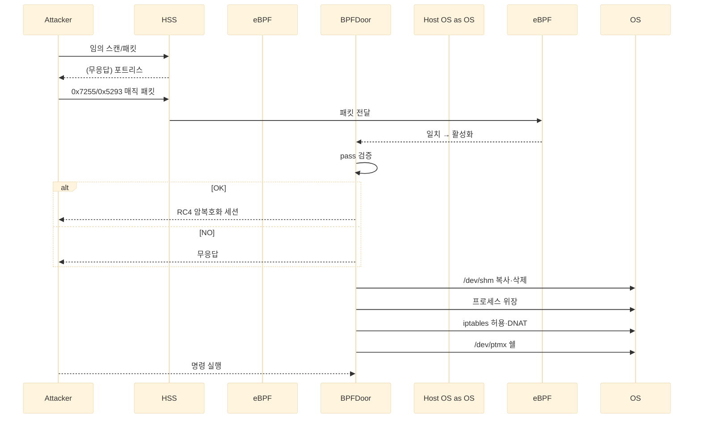

> **BPFDoor**는 eBPF 필터·매직 바이트·다중 프로토콜을 이용해 “패킷 흔적이 0”에 가까운 **포트리스(backdoor)** 상태를 구현합니다. 기존 접근 방식으로는 탐지되지 않습니다. 이러한 탐지 우회를 깨뜨리려면 **메모리 실행·AF_PACKET 소켓·iptables 변조** 같은 *행위 시그널*을 교차 분석해야 합니다.  

<!--more-->

---

## 1️⃣ BPFDoor 개요

| 항목 | 내용 |
|------|------|
| 최초 공개 | PwC 위협 인텔리전스 보고서(2021) |
| 주요 사용 조직 | 중국발 APT(스피어피싱·통신망 침투) |
| 핵심 기술 | eBPF 필터링 · 매직 바이트 인증 · RC4 암호화 |
| 탐지 난이도 | **매우 높음** – 패턴/포트 기반 IPS · NDR 무력화 |

---

## 2️⃣ 동작 메커니즘 정리

### ① 매직 바이트 & 다중 프로토콜
* **트리거** → `0x7255` (TCP/UDP) · `0x5293` (ICMP) 매직 바이트 수신 시만 활성화  
* **지원 프로토콜** → TCP · UDP · ICMP 모두 수락  
* **허용 포트** → 22/80/443 등 일반 서비스 포트를 재사용 → *포트 스캔 회피*


### ② RC4 암호화∙패스워드 인증
```c
struct magic_packet {
    unsigned int flag;
    in_addr_t    ip;
    unsigned short port;
    char pass[14];   // "justforfun" 등 하드코딩
};
````

* `pass` 값이 내부 키와 일치해야 세션 수립
* RC4 스트림으로 입·출력을 실시간 암복호화
* (아래) SKT 사고에 사용된 것으로 추정되는 패스워드 영역


### ③ 은폐·지속화 기법

| 기법              | 설명                                                       |
| --------------- | -------------------------------------------------------- |
| **프로세스 위장**     | `/sbin/udevd -d`, `avahi-daemon: chroot helper` 등 정상 데몬명 |
| **메모리 실행**      | `/dev/shm` 으로 복사 후 원본 삭제                                 |
| **iptables 변조** | 공격자 IP 허용 + NAT PREROUTING 리다이렉션                         |
| **PTY 쉘**       | `/dev/ptmx` 연결 → 기록 방지 환경변수 설정                           |

#### 📊 Sequence Diagram — 전체 흐름



---

## 3️⃣ 왜 탐지가 어려운가?

| 탐지 우회 포인트      | 상세                         |
| -------------- | -------------------------- |
| **패턴 부재**      | 매직 바이트 수신 전까지 패킷·포트·로그 ‘0’ |
| **파일 흔적 최소화**  | 실행 직후 자기 삭제, 메모리만 상주       |
| **정상 프로세스 위장** | SOC 육안·기본 모니터링으로는 구별 난항    |
| **RC4 암호화**    | 시그니처 기반 IDS/정적 분석 무력화      |

---

## 4️⃣ MITRE ATT\&CK 매핑 (Enterprise v17)

| 전술(Tactic)        | 기법 · 서브기법                                          | TID           | 설명                      |
| ----------------- | -------------------------------------------------- | ------------- | ----------------------- |
| Execution         | Command & Scripting Interpreter: Unix Shell        | **T1059.004** | RC4 인증 후 로컬/리버스 셸 실행    |
|                   | Execution Guardrails: Mutual Exclusion             | **T1480.002** | PID 파일로 중복 실행 방지        |
| Defense-Evasion   | Hide Artifacts: Ignore Process Interrupts          | **T1564.011** | 백도어 프로세스에 시그널 무시        |
|                   | Impair Defenses: Impair Command History Logging    | **T1562.003** | `HISTFILE=/dev/null` 설정 |
|                   | Impair Defenses: Disable or Modify System Firewall | **T1562.004** | `iptables` 규칙 조작        |
|                   | Indicator Removal: File Deletion                   | **T1070.004** | 원본 실행 파일 삭제             |
|                   | Indicator Removal: Timestomp                       | **T1070.006** | 실행 파일 타임스탬프 조작          |
|                   | Masquerading: Break Process Trees                  | **T1036.009** | `--init` 플래그로 PPID 끊기   |
|                   | Masquerading: Overwrite Process Arguments          | **T1036.011** | `argv[0]`을 정상 데몬명으로 변경  |
|                   | Obfuscated/Encrypted File or Information           | **T1027**     | RC4 트래픽 난독화             |
| Command & Control | Traffic Signaling: Socket Filters                  | **T1205.002** | eBPF 필터로 매직 바이트 감지      |

> **참조:** MITRE ATT\&CK 소프트웨어 항목 **S1161 (BPFDoor)**

---

## 5️⃣ 실전 PLURA-XDR 탐지: Sysmon for Linux

| Sysmon 이벤트           | 탐지 포인트                         |
| -------------------- | ------------------------------ |
| `ProcessCreate`      | `/dev/shm/*` 경로 실행 · 의심 데몬명    |
| `FileDeleteDetected` | 실행 직후 원본 삭제 이력                 |
| `NetworkConnect`     | PID = 1(daemonized) + 외부 C2 연결 |
| `RawAccessRead`(\*)  | `AF_PACKET` 소켓 생성 시도           |

> *\* Linux Sysmon 5.8+ 빌드 필요*
> **TIP** : `rule_id=BPFDoor_RawSocket` 태그로 PLURA-XDR 상관분석 자동화

(아래 ①–④ Sysmon 스크린샷 섹션 유지 – 생략)

---

## 6️⃣ PLURA-XDR 탐지 전략

| 카테고리              | 룰 예시                                              |
| ----------------- | ------------------------------------------------- |
| **메모리 실행**        | 경로 `/dev/shm` · `/tmp` + `ELF` 실행                 |
| **AF\_PACKET 사용** | `socket(PF_PACKET, SOCK_RAW, …)` 호출               |
| **iptables 변조**   | `iptables -I` · `-t nat -A PREROUTING` 행위         |
| **리버스 셸**         | `bash -i`, `nc -e`, `socat TCP4:`, `/bin/sh` 실행 등 |
| **해시·IOC**        | BPFDoor 샘플 SHA-256, C2 도메인 블록                     |

---

## 🔚 결론 & 대응 체크리스트

1. **메모리 경로 실행 감시** – `/dev/shm`, `/tmp` 실시간 모니터링
2. **Raw Socket 룰 적용** – `AF_PACKET` 생성 이벤트 즉시 알림
3. **iptables 변경 알림** – 정책·NAT 테이블 무결성 주기 검사
4. **다계층 상관 분석** – 네트워크·호스트·로그 그래프 연계
5. **주기적 IOC 업데이트** – 샘플 해시·C2 주소 블록

> **BPFDoor는 ‘보이지 않는’ 백도어를 지향합니다.**
> **PLURA-XDR**는 호스트·네트워크·로그 전 계층 관측을 통해 그 *보이지 않는 순간*을 잡아냅니다.

---

### 📖 함께 읽기

* [리눅스에서도 Sysmon을 사용해야 하는 이유!](https://blog.plura.io/ko/respond/linux_sysmon/)
* [NDR의 한계: BPFDoor 스텔스형 공격 대응의 현실적 문제](https://blog.plura.io/ko/column/limitations-ndr-bpfdoor/)
* [SKT 유심 정보 유출 사건: 원인·영향·대응 총정리](https://blog.plura.io/ko/column/leak_of_skt_usim/)
