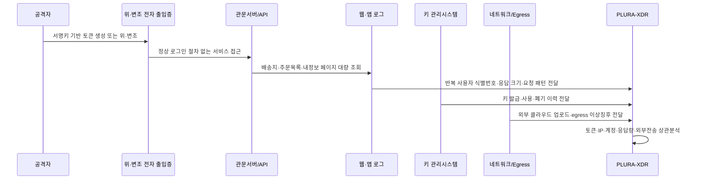

이 글의 결론은 다음과 같이 정리할 수 있습니다.

**정부 발표는 처벌의 근거이면서 동시에 국민과 기업을 위한 재발방지 안내서여야 합니다.**  
따라서 정부는 무엇이 로그로 확인된 사실인지, 무엇이 포렌식 정황인지, 무엇이 기술적 추론인지, 무엇이 기록 부재로 확인되지 않은 영역인지, 그리고 무엇이 법적 제재 사유인지 명확히 나누어 설명해야 합니다.

쿠팡의 책임을 부정하자는 것이 아닙니다. 오히려 책임을 제대로 묻기 위해서라도 사실인정은 더 정밀해야 합니다. 정부 발표가 불명확하면 기업은 실제 공격 대응 체계를 구축하기보다, 정부 발표에 맞춘 소극적 대응 문구와 대관·홍보 전략에 치우칠 수 있습니다.

그것은 재발방지가 아닙니다.

재발방지는 **로그, 탐지, 통제, 훈련, 증거보존**에서 시작됩니다.

<!--more-->

---

## 핵심만 보기

- 이 글은 쿠팡을 면책하려는 글이 아닙니다. 쿠팡의 책임을 묻기 위해서라도 정부 발표의 사실관계와 증거 수준이 더 명확해야 한다는 문제제기입니다.
- 개인정보보호위원회는 2026년 6월 11일 쿠팡의 안전조치 의무 위반 및 법적 근거 없는 개인정보 수집 등에 대해 과징금 6,246억 8,100만 원과 과태료 1,680만 원을 부과했고, 쿠팡풀필먼트서비스(CFS)에는 별도 과징금 2억 4,800만 원을 부과했습니다.  
  출처: [개인정보보호위원회 보도자료](https://pipc.go.kr/np/cop/bbs/selectBoardArticle.do?bbsId=BS074&mCode=C020010000&nttId=12171)
- 개인정보위는 쿠팡 개인정보 유출과 관련해 인증 서명키 관리 및 접근통제 소홀 등 기본적인 안전관리 체계 미흡으로 약 3,755만 명의 개인정보가 유출됐다고 결론냈습니다.
- 정부정책브리핑은 민관합동조사단이 웹·애플리케이션 접속기록, 공격자 PC 저장장치, 현직 개발자 노트북 포렌식 등을 분석했다고 설명했습니다.  
  출처: [정부정책브리핑, 쿠팡 침해사고 민관합동조사단 조사결과](https://www.korea.kr/briefing/policyBriefingView.do?newsId=156744092)
- 그러나 같은 발표는 실제 해외 클라우드 서버 전송 여부는 기록이 없어 확인할 수 없었다고 밝혔습니다.
- 배송지 목록 페이지 148,056,502회 조회는 강한 유출 정황이지만, 이 수치가 곧 고유 피해자 수나 고유 배송지 수를 뜻하는 것은 아닙니다.
- 로그가 부족하면 쿠팡의 방어도 약해지지만, 정부의 추론이 무제한으로 정당화되는 것은 아닙니다.
- 과징금과 과태료는 괘씸죄가 아닙니다. 행정제재는 법률상 요건, 증거, 비례원칙 위에 서야 합니다.  
  출처: [국가법령정보센터, 행정기본법](https://www.law.go.kr/lsInfoP.do?lsId=014041&lsiSeq=230457)
- 기업이 준비해야 할 것은 정부 발표 대응 문구가 아니라, 서명키·토큰·API·대량 조회·외부 전송·로그 보존을 연결한 실제 공격 대응 체계입니다.
- 정부 발표는 국민과 업계가 재발방지를 배울 수 있도록 **확인된 사실, 기술적 추론, 확인 불가, 법적 평가, 재발방지 권고**를 일관되게 구분해야 합니다.

---

## 이 글의 주요 독자

이 글은 1차적으로 **CISO, 개인정보보호책임자, 보안 실무자, 침해사고 대응 담당자, 법무·컴플라이언스 담당자**를 염두에 두고 작성했습니다.

동시에 정책 입안자, 감독기관, 언론, 일반 이용자에게도 같은 질문을 던지고자 합니다.

> 정부 발표를 보고 우리는 무엇을 배워야 하는가?  
> 정부 발표에 맞춘 소극적 대응을 해야 하는가, 아니면 실제 공격 대응 체계를 구축해야 하는가?

---

## 1. 문제의식: 제재 발표는 재발방지 안내서이기도 하다

개인정보 유출 사고 조사 결과는 특정 기업을 처벌하기 위한 문서에 그쳐서는 안 됩니다.

국민은 자신의 개인정보가 어떤 위험에 노출되었는지 알아야 합니다. 기업과 기관은 같은 사고를 막기 위해 어떤 로그를 남기고, 어떤 탐지 체계를 만들고, 어떤 접근통제를 강화해야 하는지 알아야 합니다.

정부 발표에는 적어도 두 가지 기능이 있습니다.

| 기능 | 설명 | 필요한 설명 |
|---|---|---|
| 처분 기능 | 법 위반에 대해 과징금, 과태료, 시정명령 등 제재를 하는 기능 | 어떤 법 조항을 어떤 사실이 충족했는지 |
| 재발방지 기능 | 국민과 업계가 같은 사고를 막도록 안내하는 기능 | 어떤 공격 경로가 확인됐고 어떤 로그·탐지 체계가 필요한지 |

문제는 이 두 기능이 섞일 때 발생합니다.

처분을 위한 발표라면 어느 법 조항을 위반했고, 어떤 사실이 그 위반을 입증하는지 설명해야 합니다. 재발방지를 위한 발표라면 어떤 공격 경로가 확인됐고, 어떤 로그와 탐지 체계가 필요하며, 어떤 부분은 아직 확인하지 못했는지 설명해야 합니다.

이번 쿠팡 사고 발표에서 아쉬운 지점은 여기에 있습니다.

정부는 쿠팡의 안전조치 미흡, 인증 서명키 관리 실패, 위·변조 전자 출입증 검증 부재, 대량 조회 탐지 실패, 로그 저장관리 부실을 지적했습니다. 이 지적들은 매우 중요합니다. 하지만 국민과 기업이 재발방지를 위해 알고 싶은 것은 더 구체적입니다.

```text
공격자는 정확히 어떤 방식으로 들어왔는가?
어떤 로그로 그것을 확인했는가?
어떤 로그가 없어서 확인하지 못했는가?
어떤 부분은 포렌식 정황인가?
어떤 부분은 조사기관의 기술적 추론인가?
어떤 부분이 과징금 산정의 직접 근거인가?
기업들은 앞으로 무엇을 준비해야 하는가?
```

이 질문에 답해야 재발방지가 가능합니다.

---

## 2. 정부 발표를 읽는 기준: 사실, 추론, 확인 불가, 법적 평가

이번 사건을 제대로 읽으려면 정부 발표를 네 층위로 나누어야 합니다.

| 구분 | 의미 | 예시 |
|---|---|---|
| 로그·포렌식으로 확인된 사실 | 실제 기록이나 저장장치 분석으로 확인된 내용 | 웹 접속기록, 공격자 PC 저장장치, 개발자 노트북 포렌식 |
| 기술적 추론 | 확인된 사실을 바탕으로 공격 흐름을 해석한 내용 | 자동화 도구 사용, 동일 공격자 귀속, 키 관리 취약점 악용 판단 |
| 확인 불가 영역 | 기록 부재 등으로 확정하지 못한 내용 | 실제 해외 클라우드 서버 전송 여부, 삭제된 로그의 실제 내용 |
| 법적 평가 | 확인된 사실과 의무 기준을 법률상 위반으로 평가한 내용 | 안전조치 의무 위반, 접근통제 미흡, 조사 방해, 신고·통지 의무 위반 |

이 네 가지가 섞이면 발표의 의미가 흐려집니다.

예를 들어 “공격 스크립트에 해외 클라우드 전송 기능이 있었다”는 것은 포렌식으로 확인된 위험 정황일 수 있습니다. 그러나 “그 스크립트가 실제 실행되어 어느 클라우드에 어떤 개인정보가 저장됐다”는 것은 별도의 증거가 필요한 사실입니다.

또한 “조회가 유출에 해당한다”는 법적 평가는 가능할 수 있습니다. 그러나 “조회 횟수”가 곧 “고유 피해자 수”나 “외부 저장 파일 수”를 뜻하지는 않습니다.

이 구분이 없으면 발표는 국민에게 공포만 주고, 기업에는 실무 가이드를 주지 못합니다.

---

## 3. 처분 사실은 중대하다. 다만 총액만으로는 구조를 알 수 없다

개인정보보호위원회는 2026년 6월 11일 쿠팡 및 계열사의 개인정보 유출 및 침해와 관련한 제재처분을 의결했습니다.

개인정보위 발표에 따르면, 쿠팡에는 과징금 6,246억 8,100만 원과 과태료 1,680만 원이 부과됐고, 쿠팡풀필먼트서비스(CFS)에는 별도 과징금 2억 4,800만 원이 부과됐습니다. 쿠팡 개인정보 유출과 관련해서는 “인증 서명키 관리 및 접근통제 소홀 등 기본적인 안전관리 체계 미흡으로 약 3,755만 명의 개인정보 유출”이라는 결론을 냈습니다. 유출통지·파기 의무, CPO 독립성 보장 위반, 조사 방해 등도 추가로 확인했다고 밝혔습니다.  
출처: [개인정보보호위원회 보도자료](https://pipc.go.kr/np/cop/bbs/selectBoardArticle.do?bbsId=BS074&mCode=C020010000&nttId=12171)

이 자체는 매우 중대한 처분입니다.

다만 주의해야 할 점이 있습니다. 개인정보위 보도자료는 쿠팡 개인정보 유출뿐 아니라 다음 사안들을 함께 다룹니다.

| 구분 | 내용 |
|---|---|
| 쿠팡 개인정보 유출 | 인증 서명키 관리 및 접근통제 소홀, 유출통지·파기 의무, CPO 독립성, 조사 방해 등 |
| 쿠팡 정보주체 권리 침해 | 타사 웹·앱에 접속한 회원 약 1,117만 명의 온라인 활동기록 무단 수집·저장 등 |
| CFS 관련 처분 | 개인정보 수집·이용 및 민감정보 처리 제한 위반 등 |

따라서 “쿠팡 해킹 사고 하나로 6,246억 원”이라고 단순화하면 안 됩니다. 어느 금액이 어떤 위반행위에 얼마만큼 배분되었는지, 유출 사고와 온라인 활동기록 무단 수집 사안이 과징금 산정에서 어떻게 구분되었는지가 더 명확히 설명되어야 합니다.

국민과 기업이 필요한 것은 총액의 충격이 아니라 산정의 구조입니다.

---

## 4. 발표 안에 이미 로그 공백이 드러난다

정부정책브리핑은 민관합동조사단이 쿠팡의 웹 및 애플리케이션 접속기록 등 관련 자료를 종합 분석했고, 공격자 PC 저장장치와 현직 개발자 노트북에 대한 포렌식도 병행했다고 설명했습니다. 또한 조사단은 명확한 판단 근거와 구체적 사실에 기반해 투명하게 공개한다는 원칙으로 조사에 임했다고 밝혔습니다.  
출처: [정부정책브리핑, 쿠팡 침해사고 조사결과](https://www.korea.kr/briefing/policyBriefingView.do?newsId=156744092)

그러나 같은 발표에는 다음 내용도 함께 등장합니다.

```text
실제 해외 클라우드 서버로 전송됐는지는 기록이 없어 확인할 수 없었다.
접속기록이 일관된 기준 없이 저장·관리되어 피해 이용자 식별과 유출 규모 산정에 어려움이 있었다.
자료보전 명령 이후에도 약 5개월 분량의 웹 접속기록과 일부 애플리케이션 접속기록이 삭제됐다.
```

이 세 문장은 매우 중요합니다.

조사단이 아무 근거 없이 추측만 했다고 단정할 수는 없습니다. 웹 접속기록 분석과 포렌식은 분명히 있었습니다. 그러나 동시에 발표 자체가 로그의 한계도 인정하고 있습니다.

그렇다면 발표는 더 정교하게 구성됐어야 합니다.

“종합 분석했다”는 표현만으로는 부족합니다. 어떤 로그가 있었고, 어떤 로그가 없었고, 어떤 기간의 로그가 삭제되었고, 어떤 판단은 포렌식 정황에 근거했으며, 어떤 판단은 법적 평가인지 나누어야 합니다.

---

## 5. 문단별로 보이는 핵심 문제

### 5-1. “종합 분석했다”는 말은 “충분한 로그가 있었다”는 뜻이 아니다

정부 발표는 웹 및 애플리케이션 접속기록 등 관련 자료를 종합 분석했다고 말합니다.

그러나 뒤에서는 접속기록이 일관된 기준 없이 저장·관리되었고, 피해 이용자 식별과 유출 규모 산정에 어려움이 있었으며, 일부 로그가 삭제됐다고 설명합니다.

따라서 “종합 분석”은 “완전한 로그 기반 분석”이 아니라, **남아 있는 자료를 바탕으로 한 제한적 분석**으로 읽어야 합니다.

> 종합 분석을 했다는 말이 곧 충분한 로그가 있었다는 뜻은 아닙니다.

---

### 5-2. 이메일 내용의 진위 검증과 전체 유출 규모 확정은 다르다

정부 발표에 따르면, 조사단은 공격자가 쿠팡 측에 보낸 이메일에 포함된 일부 정보의 진위 여부를 쿠팡 웹 접속기록으로 검증했습니다. 내정보 수정 페이지, 배송지 목록 페이지, 주문목록 페이지의 정보가 공격자 이메일에 포함되어 있었다는 설명입니다.

이것은 공격자가 실제 쿠팡 정보를 확보했음을 보여주는 강한 근거입니다.

그러나 이메일 샘플의 진위가 확인됐다는 것과, 전체 유출 규모·전체 피해자 범위·외부 저장 여부·제3자 배송지 정보의 정확한 수량까지 모두 확정됐다는 것은 별개의 문제입니다.

> 이메일 내용의 진위 확인은 출발점입니다. 전체 규모 산정은 별도의 증거 사슬이 필요합니다.

---

### 5-3. 조회는 유출일 수 있다. 그러나 조회 횟수는 고유 피해자 수가 아니다

조사단은 배송지 목록 페이지가 148,056,502회 조회되어 정보가 유출됐다고 발표했습니다. 이 페이지에는 성명, 전화번호, 배송지 주소, 특수문자로 비식별화된 공동현관 비밀번호가 포함되어 있었다고 설명했습니다.

개인정보가 쿠팡의 통제권 밖으로 나갔다면 이를 유출로 보는 법적 해석은 이해할 수 있습니다. 조사단도 질의응답에서 조회하는 순간 정보가 바깥, 즉 통제권 밖으로 나가기 때문에 조회도 유출이라고 설명했습니다.

하지만 조회가 유출이라는 말이 맞더라도, 조회 횟수가 곧 피해자 수, 고유 개인정보 건수, 외부 저장 건수, 2차 전송 건수를 의미하지는 않습니다.

조사단은 배송지 목록 페이지의 경우 한 페이지에 주소가 하나만 있는 경우도 있고 최대 20개까지 등록된 경우도 있을 수 있으며, 1억 4,800만 회라는 수치는 페이지 조회 수치라고 설명했습니다. 정확한 세부 건수는 개인정보보호위원회가 확인해 발표해야 할 영역이라고도 말했습니다.

따라서 발표는 다음처럼 구분했어야 합니다.

| 영역 | 상대적으로 명확한 부분 | 추가 설명이 필요한 부분 |
|---|---|---|
| 내정보 수정 페이지 | 성명·이메일 쌍을 기준으로 산정 가능 | 중복 제거 기준, 계정·정보주체 단위 |
| 배송지 목록 페이지 | 페이지 조회 수 확인 | 고유 배송지 수, 제3자 수, 중복 제거 기준 |
| 공동현관 비밀번호 수정 페이지 | 조회 횟수 확인 | 평문 노출 범위, 중복 여부, 실제 응답 성공 여부 |
| 주문목록 페이지 | 조회 횟수 확인 | 상품 정보의 민감성, 중복성, 식별 기준 |

> 조회 횟수는 유출 정황의 강한 지표일 수 있습니다. 그러나 조회 횟수는 곧바로 고유 피해자 수가 아닙니다.

---

### 5-4. 공격 스크립트 존재와 실제 해외 클라우드 전송은 다르다

조사단은 공격자 PC 저장장치 포렌식 결과, 정보 수집 및 외부 서버 전송이 가능한 공격 스크립트를 확인했다고 밝혔습니다. 특히 위·변조 전자 출입증을 이용해 타인의 계정으로 무단 접속한 후 유출한 정보를 해외 클라우드 서버로 전송할 수 있는 기능이 포함되어 있었다고 설명했습니다.

그러나 조사단은 실제 전송이 이루어졌는지 여부는 기록이 남아 있지 않아 확인할 수 없었다고 밝혔습니다.  
출처: [정부정책브리핑, 쿠팡 침해사고 조사결과](https://www.korea.kr/briefing/policyBriefingView.do?newsId=156744092)

이 대목은 반드시 나누어야 합니다.

```text
공격 스크립트 존재
≠
스크립트 실행 사실
≠
해외 클라우드 전송 사실
≠
전송된 개인정보 범위 확정
```

공격 스크립트가 있었다는 사실은 매우 위험한 정황입니다. 외부 클라우드 전송 기능이 있었다는 점도 중요합니다. 그러나 그것만으로 어떤 개인정보가 어느 해외 클라우드 서버에 실제 저장됐는지까지 입증되는 것은 아닙니다.

따라서 이 사건은 다음과 같이 정리하는 것이 정확합니다.

```text
쿠팡 웹 서비스에서 공격자 측으로 개인정보가 대량 응답·조회된 정황은 확인됐다.
공격 스크립트와 외부 전송 가능 기능도 확인됐다.
그러나 해외 클라우드 서버로의 실제 2차 저장·전송 경로는 로그 부재로 확인되지 않았다.
```

이 구분은 쿠팡을 면책하기 위한 것이 아닙니다. 이 구분이 있어야 무엇이 실제로 입증됐고, 무엇이 관리 소홀의 위험으로 평가됐으며, 무엇이 확인되지 않은 영역인지 분명해집니다.

---

### 5-5. 비정상 접속 탐지 실패와 로그 부족은 함께 설명되어야 한다

정부 발표는 쿠팡이 동일한 서버 사용자 식별번호를 반복적으로 사용했고, 위·변조 전자 출입증을 활용한 비정상 접속행위가 발생했음에도 정보 유출을 탐지·차단하지 못했다고 설명했습니다.

이 지적은 매우 중대합니다.

그러나 같은 발표는 접속기록이 일관된 기준 없이 저장·관리되어 피해 이용자 식별과 정보유출 규모 산정에 어려움이 있었다고도 말합니다.

그렇다면 조사단은 다음을 구분해야 했습니다.

```text
어떤 로그로 비정상 접속행위를 식별했는가?
어떤 로그가 부족해 피해 이용자 식별과 규모 산정에 어려움이 있었는가?
비정상 접속 탐지 실패는 어떤 기준으로 판단했는가?
그 판단이 과징금 산정에 어떻게 반영됐는가?
```

같은 로그 체계를 근거로 한쪽에서는 확정적 결론을 내리고, 다른 쪽에서는 산정 어려움을 말한다면 증명 구조가 불명확해집니다.

---

### 5-6. 자료보전 명령 이후 로그 삭제는 중대하다. 그러나 삭제된 내용까지 추정해서는 안 된다

정부 발표는 과기정통부가 2025년 11월 19일 자료보전 명령을 했지만, 쿠팡이 자동 로그 저장 정책을 조정하지 않아 2024년 7월부터 11월까지 약 5개월 분량의 웹 접속기록이 삭제되었고, 일부 애플리케이션 접속기록도 삭제되었다고 밝혔습니다. 자료보전 명령 위반과 관련해서는 수사기관에 수사를 의뢰했다고 설명했습니다.  
출처: [정부정책브리핑, 쿠팡 침해사고 조사결과](https://www.korea.kr/briefing/policyBriefingView.do?newsId=156744092)

이 부분은 쿠팡에게 매우 불리한 사실입니다. 침해사고 발생 후 로그 보존은 사고 원인 규명, 피해 범위 산정, 방어권 행사, 재발방지의 출발점이기 때문입니다.

그러나 구분은 필요합니다.

```text
자료보전 명령 이후 로그 삭제
→ 별도 위반 또는 수사 의뢰 대상이 될 수 있음

삭제된 로그의 실제 내용
→ 기록이 없다면 그 내용 자체는 확인할 수 없음

삭제된 로그가 쿠팡에게 불리했을 것이라는 추정
→ 무제한으로 유출 범위·고의성·2차 전송 사실을 확장하는 근거가 되어서는 안 됨
```

로그 부재는 쿠팡의 방어를 약화시킵니다. 그러나 정부의 추론을 무제한으로 허용하지도 않습니다.

---

## 6. 과징금과 과태료는 괘씸죄가 아니다

쿠팡의 초기 신고 규모가 작았다는 점, 자료 제출이 미진했다는 점, 자료보전 명령 이후에도 일부 로그가 삭제됐다는 점은 정부 입장에서 매우 불쾌하고 중대한 문제일 수 있습니다.

하지만 행정제재는 괘씸죄가 아닙니다.

과징금과 과태료는 정치적 분노의 표현이 아니라, 법률상 요건과 증거에 근거한 행정작용이어야 합니다. 행정기본법은 행정작용이 법률에 위반되어서는 안 된다는 법치행정 원칙과, 행정작용이 목적 달성에 유효·적절하고 필요한 최소한도에 그쳐야 하며 공익과 사익 사이의 균형을 갖추어야 한다는 비례원칙을 규정합니다.  
출처: [국가법령정보센터, 행정기본법](https://www.law.go.kr/lsInfoP.do?lsId=014041&lsiSeq=230457)

따라서 이번 사건에서도 제재 사유를 다음처럼 분리해야 합니다.

| 사안 | 평가 가능한 방향 | 주의할 점 |
|---|---|---|
| 신고 지연 | 신고 의무 위반 | 유출 경로 미확인 사실을 보충하는 증거가 아님 |
| 자료보전 명령 위반 | 자료보전 의무 위반 또는 수사 의뢰 대상 | 삭제된 로그 내용까지 임의 추정해서는 안 됨 |
| 서명키 관리 미흡 | 안전조치 의무 위반 | 탈취 시점·경로·사용 이력은 별도 증거 필요 |
| 위·변조 토큰 검증 부재 | 접근통제 미흡 | 실제 사용 로그와 발급 이력 대조가 중요 |
| 외부 전송 기능 스크립트 | 위험 정황 | 실제 외부 전송 사실과 구분 필요 |
| 대량 조회 탐지 실패 | 정보보호 관리체계 미흡 | 조회 횟수, 고유 정보주체, 중복 제거 기준 구분 필요 |

기업이 잘못한 부분은 명확히 처분해야 합니다. 그러나 확인되지 않은 사실까지 처분 분위기 속에 섞어서는 안 됩니다.

그것은 법의 문제가 아니라 정치의 문제가 됩니다.

---

## 7. 기업은 무엇을 준비해야 하는가

정부 발표가 명쾌하지 않으면 기업들은 잘못된 대응을 하게 됩니다.

보안 담당자가 알고 싶은 것은 다음입니다.

```text
브루트포스와 크리덴셜 스터핑을 막아야 하는가?
토큰 위·변조 탐지를 해야 하는가?
서명키 수명주기와 퇴직자 키 폐기 절차를 강화해야 하는가?
비정상 IP 분산 접근을 탐지해야 하는가?
배송지 목록 같은 민감 페이지의 대량 조회를 탐지해야 하는가?
응답 본문 또는 응답 크기 기반 유출 탐지를 해야 하는가?
외부 클라우드 업로드를 차단해야 하는가?
로그 보존 기간과 원본 무결성 관리를 강화해야 하는가?
```

이번 사건의 공개자료상 핵심은 일반적인 ID/PW 브루트포스보다 **인증 서명키 관리 실패, 위·변조 전자 출입증 검증 부재, 자동화 크롤링, 대량 조회, 로그 관리 부실**에 가깝습니다.

조사단은 공격자가 재직 당시 관리하던 인증시스템의 서명키를 탈취해 전자 출입증을 위·변조했고, 정상 로그인 절차 없이 쿠팡 서비스에 접속했다고 설명했습니다. 또한 자동화된 웹크롤링 공격 도구로 대규모 정보를 유출했고, 이 과정에서 총 2,313개 IP를 이용했다고 발표했습니다.  
출처: [정부정책브리핑, 쿠팡 침해사고 조사결과](https://www.korea.kr/briefing/policyBriefingView.do?newsId=156744092)

그렇다면 기업이 준비해야 할 것은 “정부 발표 대응 문구”가 아니라 실제 공격 대응 체계입니다.

---

## 8. PLURA-XDR 관점: 단일 로그가 아니라 공격 체인으로 봐야 한다

이번 사건을 실무 관점에서 보면 핵심은 단일 보안장비가 아닙니다. 인증, API, 웹, 단말, 네트워크, 키 관리, 로그 보존을 하나의 시간축으로 연결해야 합니다.

PLURA-XDR 같은 통합 탐지 체계에서는 다음 흐름을 하나의 공격 체인으로 봐야 합니다.



실무적으로는 다음 로그가 필요합니다.

| 영역 | 필요한 로그·증적 | 목적 |
|---|---|---|
| 서명키 관리 | 키 발급, 접근, 복사, 폐기, 갱신 이력 | 키 탈취·오남용 경로 확인 |
| 토큰 발급 | 정상 로그인 후 토큰 발급 이력 | 정상 발급 토큰과 위·변조 토큰 구분 |
| 토큰 사용 | 토큰별 사용자 식별번호, 사용 IP, 사용 시각, API 경로 | 동일 식별번호 반복 사용과 비정상 사용 탐지 |
| 관문서버 | 토큰 검증 성공·실패, 발급 이력 대조 결과 | 정상 발급 절차 없는 토큰 차단 |
| 웹/API | 요청 경로, 파라미터, 상태코드, 응답 크기, User-Agent | 대량 조회·자동화 크롤링 탐지 |
| 민감 페이지 | 배송지 목록, 주문목록, 내정보 수정 페이지 접근 이력 | 개인정보 대량 응답 탐지 |
| 네트워크 | 외부 전송량, 클라우드 업로드, 비정상 목적지 | 2차 전송 여부 확인 |
| 단말·서버 | 스크립트 실행, 파일 생성, 압축, 업로드 도구 실행 | 스크립트 실행과 외부 반출 증적 확보 |
| 로그 보존 | 원본 해시, 보존 정책 변경 이력, 자료보전 시점 | 행정조사·소송 대응 증거 보존 |

여기서 중요한 것은 “탐지 장비가 있었다”가 아닙니다.

다음 질문에 답할 수 있어야 합니다.

```text
정상 발급되지 않은 토큰이 사용되었는가?
토큰 발급 로그와 사용 로그가 불일치했는가?
동일 사용자 식별번호가 비정상적으로 반복 사용되었는가?
다수 IP가 동일한 자동화 패턴으로 민감 페이지를 호출했는가?
배송지 목록 페이지의 응답 크기가 평소보다 급증했는가?
조회 이후 외부 클라우드 업로드나 egress 급증이 있었는가?
사고 인지 후 원본 로그가 보존되었는가?
```

이 질문에 답하지 못하면 기업은 공격을 막기도 어렵고, 사고 이후 자신을 방어하기도 어렵습니다.

---

## 9. 기업 대응 체크리스트

아래 표는 실무자가 바로 점검할 수 있도록 정리한 체크리스트입니다.

| 체크 | 영역 | 해야 할 일 | 확인할 증적 |
|---|---|---|---|
| ☐ | 서명키 관리 | 운영 키를 키 관리시스템에서만 보관하고 개발자 PC 저장을 금지한다 | 키 저장 위치 점검 결과, 단말 스캔 결과 |
| ☐ | 서명키 수명주기 | 키 발급·갱신·폐기·회수 절차를 문서화하고 자동화한다 | 키 이력, 변경 승인, 폐기 기록 |
| ☐ | 퇴직자·직무변경자 | 퇴직·전보 즉시 키·계정·토큰 관련 권한을 회수한다 | IAM/PAM 권한 회수 로그 |
| ☐ | 토큰 발급 | 정상 로그인 후 발급된 토큰 이력을 보존한다 | 토큰 발급 로그, 세션 생성 로그 |
| ☐ | 토큰 검증 | 관문서버에서 토큰 발급 이력과 사용 이력을 대조한다 | 검증 성공·실패 로그, 불일치 탐지 로그 |
| ☐ | 위·변조 탐지 | 정상 발급 절차 없는 토큰 사용을 차단한다 | 위·변조 토큰 차단 이력 |
| ☐ | 사용자 식별번호 | 동일 사용자 식별번호 반복 사용과 비정상 조합을 탐지한다 | 식별번호별 요청 통계, 이상행위 알림 |
| ☐ | 민감 페이지 | 배송지·주문목록·내정보 페이지 대량 조회를 탐지한다 | 페이지별 조회량, 응답 크기, 사용자별 호출량 |
| ☐ | Rate Limit | 민감 API에 계정·토큰·IP·디바이스 기준 제한을 적용한다 | 차단 룰, 예외 승인, 차단 통계 |
| ☐ | 자동화 공격 | User-Agent, 요청 간격, 경로 반복성, IP 로테이션을 분석한다 | 봇 탐지 로그, 프록시·클라우드 IP 탐지 결과 |
| ☐ | 응답 기반 탐지 | 응답 크기 급증, 개인정보 포함 응답 패턴을 탐지한다 | 응답 크기 로그, 민감정보 마스킹·검출 로그 |
| ☐ | 외부 전송 | 클라우드 업로드와 비정상 egress 트래픽을 탐지한다 | egress 로그, DNS/Proxy/Firewall 로그 |
| ☐ | 스크립트 실행 | 서버·단말의 스크립트 실행, 파일 생성, 압축, 업로드 도구 실행을 모니터링한다 | EDR 로그, Sysmon, 프로세스 실행 로그 |
| ☐ | 로그 보존 | 웹/WAS/API/인증/토큰/키/네트워크 로그의 보존 기간을 정의한다 | 로그 보존 정책, 보존 기간 설정값 |
| ☐ | 원본 무결성 | 원본 로그 해시와 변경 이력을 보존한다 | WORM 저장소, 해시값, 접근 이력 |
| ☐ | 사고 대응 | 사고 인지 즉시 자동 삭제 정책을 중단하고 보존 모드로 전환한다 | 보존 정책 전환 기록, 사고 타임라인 |
| ☐ | 조사 대응 | 조사기관 제출 자료를 목록화하고 제출본 무결성을 관리한다 | 제출 목록, 증거 봉인, 해시값 |
| ☐ | 산정 기준 | 페이지뷰, 고유 정보주체, 고유 배송지, 제3자 정보를 분리 산정한다 | 중복 제거 기준, 분석 스크립트, 산정 결과 |
| ☐ | 모의훈련 | 토큰 위·변조, 대량 조회, 외부 전송 시나리오를 정기 훈련한다 | 훈련 결과, 개선 조치, 재점검 기록 |
| ☐ | 경영 보고 | 기술 증적과 법적 의무를 연결한 사고 보고 체계를 갖춘다 | CISO/CPO 보고서, 이사회 보고 자료 |

이 체크리스트의 핵심은 단순합니다.

**로그가 있어야 탐지할 수 있고, 탐지해야 차단할 수 있으며, 보존해야 설명할 수 있습니다.**

---

## 10. 정부 발표는 이렇게 구성됐어야 한다

정부 발표의 문제를 지적하려면 대안도 제시해야 합니다. 이번 사건에서 정부 발표는 다음과 같은 방식으로 더 명확히 구성될 수 있었습니다.

| 구분 | 발표했어야 할 내용 |
|---|---|
| 확인된 사실 | 웹 접속기록상 내정보 수정 페이지, 배송지 목록 페이지, 주문목록 페이지 접근이 확인됐다 |
| 확인된 사실 | 공격자 PC 저장장치에서 위·변조 전자 출입증과 공격 스크립트가 확인됐다 |
| 확인된 사실 | 현직 개발자 노트북에서 서명키가 부적절하게 저장된 사실이 확인됐다 |
| 확인된 사실 | 자동화 웹크롤링 공격 도구와 다수 IP 사용 정황이 확인됐다 |
| 기술적 추론 | 공격자는 재직 당시 알게 된 인증체계와 키 관리 취약점을 악용한 것으로 판단된다 |
| 기술적 추론 | 자동화 도구를 통해 대량 조회가 이루어진 것으로 판단된다 |
| 기술적 추론 | 배송지 목록 페이지 조회에는 제3자 정보가 포함되었을 가능성이 높다 |
| 확인 불가 | 해외 클라우드 서버로 실제 전송됐는지는 기록이 없어 확인하지 못했다 |
| 확인 불가 | 전송된 파일명, 저장 위치, 데이터셋은 공개자료상 확인되지 않았다 |
| 확인 불가 | 배송지 목록 페이지의 고유 제3자 수와 중복 제거 기준은 별도 산정이 필요하다 |
| 확인 불가 | 삭제된 로그의 실제 내용은 확인할 수 없다 |
| 법적 평가 | 정상 발급 절차 없는 전자 출입증 검증 체계 부재는 접근통제 미흡이다 |
| 법적 평가 | 서명키 관리 및 퇴직자 키 폐기 절차 미비는 안전조치 의무 위반이다 |
| 법적 평가 | 대량 조회 탐지·차단 실패는 정보보호 관리체계 미흡이다 |
| 법적 평가 | 자료보전 명령 이후 로그 삭제는 별도 위반 또는 수사 의뢰 대상이다 |
| 재발방지 권고 | 토큰 발급 로그와 사용 로그를 대조해야 한다 |
| 재발방지 권고 | 정상 발급 절차 없는 토큰을 관문서버에서 차단해야 한다 |
| 재발방지 권고 | 민감 페이지 대량 조회와 응답 크기 급증을 탐지해야 한다 |
| 재발방지 권고 | 키 발급·사용·폐기 이력을 보존해야 한다 |
| 재발방지 권고 | 사고 인지 즉시 로그 보존 정책을 전환해야 한다 |

이렇게 발표했다면 국민은 무엇이 확인됐고 무엇이 확인되지 않았는지 이해할 수 있었을 것입니다. 기업은 어떤 보안 통제를 강화해야 하는지 알 수 있었을 것입니다. 언론도 가능성과 사실을 섞어 자극적으로 전달할 위험이 줄어들었을 것입니다.

---

## 11. 쿠팡이 행정소송에서 소명해야 할 부분

쿠팡이 행정소송에서 과징금 감액 또는 취소를 주장하려면, 단순히 “우리는 피해를 줄이기 위해 노력했다”는 수준으로는 부족합니다.

쿠팡은 다음을 기술적으로 소명해야 합니다.

| 영역 | 소명해야 할 내용 |
|---|---|
| 일반 로그인 공격 대응 | 브루트포스 탐지 기준, 크리덴셜 스터핑 탐지 룰, 계정 잠금 정책, 비정상 로그인 차단 이력 |
| 인증 우회 대응 | 토큰 발급 로그와 사용 로그 대조, 위·변조 토큰 검증 실패 로그, 정상 발급 절차 없는 토큰 사용 탐지 |
| 자동화 대량 조회 대응 | 배송지 목록·주문목록·내정보 수정 페이지 Rate Limit, User-Agent와 요청 패턴 분석, 봇 행위 기반 탐지·차단 이력 |
| IP 귀속 기준 | 2,313개 IP를 공격자 IP로 분류한 기준, 정상 사용자 트래픽과 공격 트래픽 분리 기준 |
| 외부 전송 대응 | egress 로그, 클라우드 업로드 탐지 로그, 공격 스크립트 실행 여부 확인 결과, 실제 외부 서버 전송 여부에 대한 포렌식 결과 |
| 로그 보존 | 사고 인지 후 보존 정책 전환 시점, 삭제된 로그의 범위와 사유, 원본 로그 무결성 보장 여부 |
| 제출 자료 | 조사기관 제출 자료 목록, 제출 시점, 제출본의 원본성·무결성 |

행정소송에서 감액을 기대하려면, 쿠팡은 “우리는 노력했다”가 아니라 다음을 입증해야 합니다.

> 이 공격은 어떤 방어망을 어떻게 우회했고, 쿠팡이 보유한 로그상 어디까지가 실제 유출이며, 개인정보위가 과도하게 평가한 부분은 어디인지.

---

## 12. 문단별 검증 프레임

정부정책브리핑의 문장을 검토할 때는 다음 형식을 반복하는 것이 좋습니다.

```text
[정부 발표 문단]
조사단은 ○○을 확인하였다고 밝혔다.

[확인된 사실]
공개자료상 확인되는 것은 A이다.

[빠진 증거]
그러나 B를 입증하려면 다음 로그가 필요하다.
- 토큰 발급 로그
- 토큰 검증 로그
- API 요청·응답 로그
- 중복 제거 기준
- 외부 전송 로그
- 클라우드 업로드 로그

[문제제기]
A가 확인됐다고 해서 B까지 단정할 수는 없다.
이 부분이 과징금 산정에 반영되었다면, 개인정보위는 그 산정 근거를 더 명확히 설명해야 한다.
```

이 방식이 좋은 이유는 감정적 비판으로 보이지 않기 때문입니다.

“정부가 틀렸다”가 아니라 “**정부 발표 문장 자체를 기준으로 증거 수준을 나누자**”는 방식이 됩니다.

---

## 13. 확인하지 못한 것을 확인한 것처럼 섞어서는 안 된다

침해사고 발표에서 가장 위험한 것은 가능성과 사실이 섞이는 것입니다.

보안 사고에서는 가능성이 많습니다.

```text
스크립트가 실행됐을 수 있다.
외부 클라우드로 보냈을 수 있다.
로그가 삭제됐을 수 있다.
제3자 정보가 포함됐을 수 있다.
2차 피해가 발생할 수 있다.
```

이 가능성들은 모두 중요합니다. 그러나 과징금과 과태료의 근거로 삼으려면 가능성이 아니라 증거가 필요합니다.

특히 정부 발표는 언론을 통해 국민에게 전달됩니다. 정부가 기술적으로 불확실한 내용을 강한 표현으로 섞어 발표하면, 언론은 더 단순하고 자극적인 문장으로 바꿀 수 있습니다. 그 결과 국민은 실제 위험을 정확히 이해하지 못하고, 기업은 실제 방어 체계를 만들기보다 “어떤 표현을 해야 덜 맞을까”를 고민하게 됩니다.

이것은 보안에 도움이 되지 않습니다.

정부의 설명은 일관되어야 합니다. 명쾌해야 합니다. 그리고 확인된 사실과 확인하지 못한 사실을 같은 무게로 구분해야 합니다.

---

## 14. 결론: 행정제재는 법과 로그 위에 서야 한다

이번 쿠팡 사고에서 정부와 개인정보보호위원회가 쿠팡의 책임을 묻는 것은 당연합니다.

서명키 관리가 부실했다면 문제입니다. 위·변조 토큰을 검증하지 못했다면 문제입니다. 대량 조회를 탐지하지 못했다면 문제입니다. 자료보전 명령 이후에도 로그가 삭제됐다면 매우 심각한 문제입니다. 유출 통지, 파기 의무, CPO 독립성, 조사 협조에 문제가 있었다면 그것도 제재 대상이 될 수 있습니다.

하지만 그 모든 것에도 불구하고, 과징금과 과태료는 괘씸죄가 되어서는 안 됩니다.

정부는 처분을 하려면 사실과 증거를 구분해야 합니다. 재발방지를 말하려면 공격 경로와 방어 포인트를 명확히 설명해야 합니다. 확인하지 못한 것을 확인한 것처럼 섞어 발표해서는 안 됩니다.

국민과 기업은 정부 발표를 보고 대비해야 합니다. 그런데 발표가 불명확하면 우리는 무엇을 해야 합니까?

```text
정부 발표에 맞춘 대응 문구를 준비해야 하는가?
신고 타이밍만 계산해야 하는가?
대관과 홍보 전략을 먼저 고민해야 하는가?
아니면 실제 공격 대응 체계를 구축해야 하는가?
```

정답은 당연히 후자입니다.

기업과 기관은 실제 공격 대응 체계를 만들어야 합니다. 그러려면 정부 발표도 그 방향을 가리켜야 합니다.

이번 쿠팡 사고에서 필요한 발표는 “쿠팡이 괘씸하다”가 아니었습니다.

필요했던 발표는 이것이었습니다.

```text
이 공격은 어떤 로그로 확인됐다.
이 부분은 포렌식 정황이다.
이 부분은 기록이 없어 확인하지 못했다.
이 부분은 안전조치 의무 위반이다.
이 부분은 과징금 산정에 반영됐다.
따라서 기업들은 이런 로그와 탐지 체계를 갖춰야 한다.
```

과징금은 나왔지만, 기술적 진실이 흐리면 재발방지는 불가능합니다.

**재발방지는 분노가 아니라 증거에서 시작됩니다.**  
**행정제재는 괘씸죄가 아니라 법과 로그 위에 서야 합니다.**

---

## 참고 자료

- 정부정책브리핑, `쿠팡 침해사고 민관합동조사단 조사결과`  
  https://www.korea.kr/briefing/policyBriefingView.do?newsId=156744092
- 개인정보보호위원회, `개인정보위, 쿠팡 및 계열사의 개인정보 유출 및 침해 제재처분 의결`  
  https://pipc.go.kr/np/cop/bbs/selectBoardArticle.do?bbsId=BS074&mCode=C020010000&nttId=12171
- 국가법령정보센터, `행정기본법`  
  https://www.law.go.kr/lsInfoP.do?lsId=014041&lsiSeq=230457
