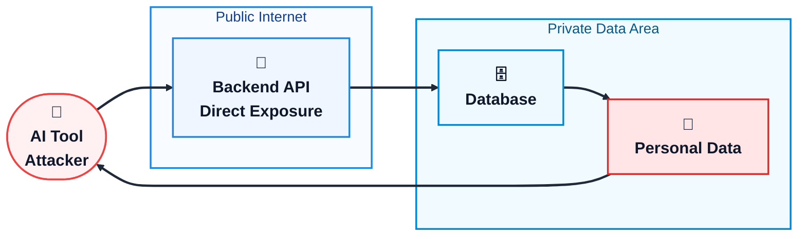
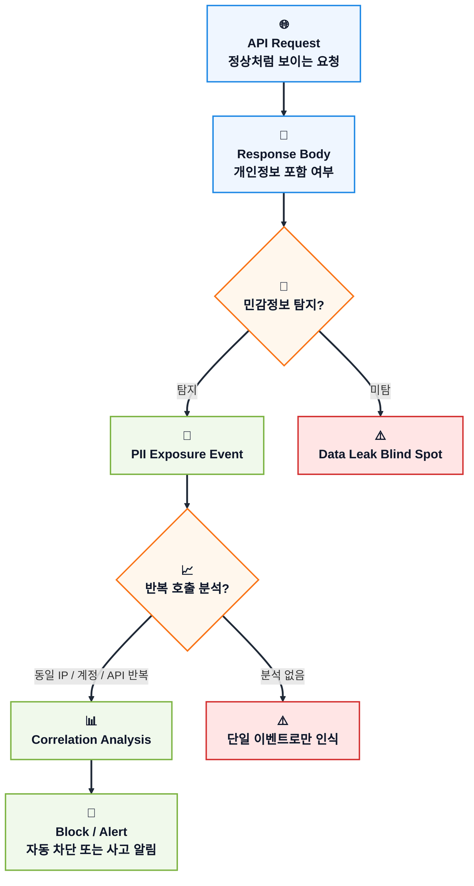
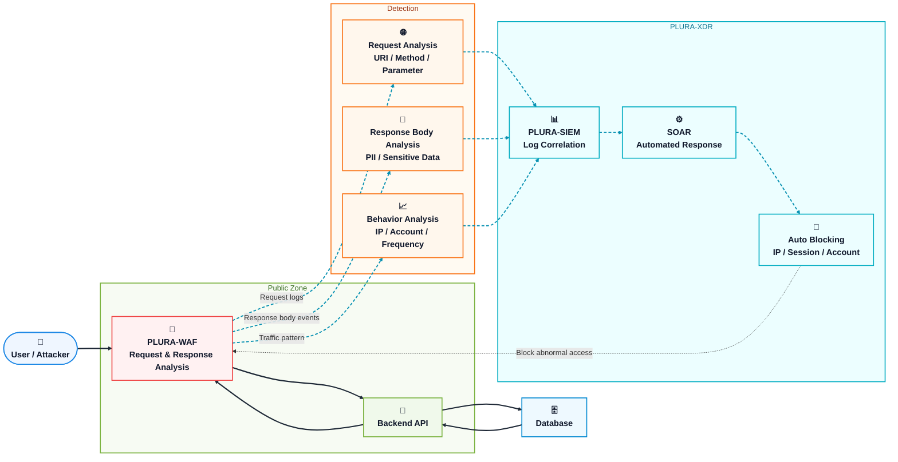

## 1) 사건 개요

바이라인네트워크 보도에 따르면, ‘모두의창업’ 정보 유출 원인은 **“AI 도구로 백엔드 API에 비정상 접근”** 한 것으로 설명됩니다.

이 표현은 매우 중요합니다.
공격자가 반드시 SQL Injection, 웹셸 업로드, 관리자 계정 탈취 같은 전통적인 웹 공격을 사용했다는 의미는 아닙니다.

오히려 이번 사건은 다음과 같은 유형에 더 가깝게 볼 수 있습니다.

> **AI 도구를 이용해 백엔드 API 구조를 탐색하고, 정상 요청처럼 보이는 API 호출을 반복하면서 개인정보가 포함된 응답을 받아낸 사고**

즉, 핵심은 “AI가 공격했다”가 아닙니다.

핵심은 다음입니다.

> **백엔드 API가 비정상적으로 호출되었고, 그 응답본문에 민감정보가 포함되어 외부로 전달되었는가?**

이 관점에서 보면 이번 사건은 단순한 웹 취약점 문제가 아니라, **API 보안, 응답본문 분석, 데이터 유출 탐지, 자동화 공격 대응**의 문제입니다.

---

## 2) 밝혀진 사실

현재 공개적으로 확인되는 핵심은 다음과 같습니다.

| 구분        | 내용                                          |
| --------- | ------------------------------------------- |
| 사고 대상     | ‘모두의창업’ 서비스                                 |
| 보도상 원인    | AI 도구를 이용한 백엔드 API 비정상 접근                   |
| 공격 대상     | 프론트엔드 화면 자체보다 백엔드 API 접근 가능성이 높음            |
| 공격 성격     | 전통적 웹 공격보다 API 자동화 접근, 대량 조회, 비정상 응답 수집 가능성 |
| 핵심 쟁점     | WAF 유무보다 백엔드 API 응답을 탐지했는가                  |
| 주요 탐지 포인트 | 응답본문의 개인정보, 반복 API 호출, 동일 IP·계정의 비정상 조회 패턴  |

단, 공개된 표현만으로 다음 내용을 단정해서는 안 됩니다.

* SQL Injection이 있었다고 단정할 수 없음
* 웹셸 업로드가 있었다고 단정할 수 없음
* 관리자 계정 탈취가 있었다고 단정할 수 없음
* 전통적인 로그인 브루트포스 공격이었다고 단정할 수 없음
* WAF가 없었다고 단정할 수 없음

더 정확한 표현은 다음과 같습니다.

> **현재 확인된 표현만 보면, 이번 사건은 “브루트포스 로그인 공격”이라기보다 “AI 도구를 활용한 백엔드 API 비정상 접근 및 응답 데이터 수집”으로 보는 것이 타당합니다.**

---

## 3) 공격 방법 설명

### 3-1. 가능한 공격 흐름

AI 도구는 취약점 자체가 아닙니다.
하지만 공격자의 작업을 빠르게 자동화할 수 있습니다.

예를 들어 공격자는 다음과 같은 작업을 AI 도구로 수행할 수 있습니다.

* 프론트엔드 JavaScript에서 API 주소 추출
* 브라우저 개발자 도구의 API 요청 분석
* API 파라미터 구조 추정
* `userId`, `companyId`, `postId` 등 식별자 변경
* 반복 호출 스크립트 작성
* 응답 JSON에서 이름, 전화번호, 이메일 등 민감정보 추출
* 호출 간격 조절로 단순 차단 우회

이 경우 요청 자체는 매우 정상처럼 보일 수 있습니다.

```http
GET /api/users/1001
Authorization: Bearer 정상토큰
```

문제는 요청 문자열이 아니라 권한입니다.

```text
이 사용자가 /api/users/1001 데이터를 볼 권한이 있는가?
```

그리고 더 중요한 문제는 응답입니다.

```json
{
  "name": "홍길동",
  "phone": "010-1234-5678",
  "email": "user@example.com",
  "company": "모두의창업"
}
```

요청에는 공격 문자열이 없더라도, 응답본문에는 개인정보가 포함될 수 있습니다.
따라서 API 정보 유출 사고에서는 **요청 탐지보다 응답본문 탐지**가 더 결정적인 증거가 될 수 있습니다.

---

### 3-2. 공격 흐름 Mermaid

```mermaid
%%{init: {
  "theme": "base",
  "themeVariables": {
    "fontFamily": "Pretendard, Noto Sans KR, Arial",
    "background": "#ffffff",
    "primaryTextColor": "#0f172a",
    "lineColor": "#1f2937"
  },
  "themeCSS": "
    .node rect, .node circle, .node ellipse, .node polygon {
      filter: drop-shadow(0px 4px 8px rgba(15, 23, 42, 0.16));
    }
    .edgePath path {
      stroke-width: 2.6px;
    }
    .edgeLabel {
      background-color: #ffffff;
      color: #0f172a;
      font-weight: 700;
    }
    .cluster rect {
      rx: 18px;
      ry: 18px;
      filter: drop-shadow(0px 6px 12px rgba(15, 23, 42, 0.14));
    }
    .cluster-label {
      font-size: 21px;
      font-weight: 800;
    }
  "
}}%%

flowchart LR

    ATTACKER(["🤖<br/><b>Attacker</b><br/>AI Tool"])
    
    subgraph INTERNET["Internet"]
        direction LR
        AUTO["⚙️<br/><b>Automation</b><br/>API Enumeration"]
    end

    subgraph SERVICE["Service Area"]
        direction LR
        API["🔌<br/><b>Backend API</b>"]
        AUTH["🔐<br/><b>Authorization Check</b><br/>Object Level"]
        DB["🗄️<br/><b>Database</b>"]
    end

    subgraph RESPONSE["Response"]
        direction LR
        DATA["📄<br/><b>Response Body</b><br/>Name / Phone / Email"]
        LEAK["🚨<br/><b>Data Exposure</b>"]
    end

    ATTACKER --> AUTO
    AUTO --> API
    API --> AUTH
    AUTH -- "검증 미흡" --> DB
    DB --> DATA
    DATA --> LEAK
    LEAK --> ATTACKER

    classDef attacker fill:#fff1f2,stroke:#ef4444,stroke-width:2px,color:#0f172a,font-size:18px,font-weight:bold;
    classDef internet fill:#eff6ff,stroke:#1e88e5,stroke-width:2px,color:#0f172a,font-size:18px,font-weight:bold;
    classDef service fill:#f0f9eb,stroke:#7cb342,stroke-width:2px,color:#0f172a,font-size:18px,font-weight:bold;
    classDef response fill:#fff7ed,stroke:#f97316,stroke-width:2px,color:#0f172a,font-size:18px,font-weight:bold;
    classDef danger fill:#ffe5e5,stroke:#d32f2f,stroke-width:2px,color:#0f172a,font-size:18px,font-weight:bold;

    class ATTACKER attacker;
    class AUTO internet;
    class API,AUTH,DB service;
    class DATA response;
    class LEAK danger;

    style INTERNET fill:#f8fbff,stroke:#1e88e5,stroke-width:2px,color:#0f3f8c;
    style SERVICE fill:#f7fbf3,stroke:#7cb342,stroke-width:2px,color:#33691e;
    style RESPONSE fill:#fffaf2,stroke:#f97316,stroke-width:2px,color:#9a3412;

    linkStyle 0,1,2,3,4,5,6 stroke:#1f2937,stroke-width:2.6px;
```



---

### 3-3. 이 공격은 브루트포스인가?

이번 유형을 곧바로 브루트포스 공격이라고 표현하는 것은 적절하지 않습니다.

브루트포스는 일반적으로 다음과 같은 공격입니다.

```text
ID/PW 반복 대입
OTP 반복 시도
인증 토큰 반복 추측
```

하지만 이번 사건의 핵심은 다음에 더 가깝습니다.

```text
API Enumeration
IDOR / BOLA
대량 조회
응답 데이터 수집
자동화된 API 탐색
```

따라서 조사 관점도 달라야 합니다.

| 잘못된 접근        | 더 정확한 접근                |
| ------------- | ----------------------- |
| 로그인 실패 횟수만 본다 | API 호출 패턴을 본다           |
| 브루트포스 여부만 본다  | 동일 IP·계정의 반복 조회를 본다     |
| 요청 URL만 본다    | 응답본문의 개인정보 포함 여부를 본다    |
| 공격 문자열만 찾는다   | 정상처럼 보이는 API 응답 유출을 찾는다 |

---

## 4) 왜 탐지하지 못했는가? 문제 제기

이번 사건에서 가장 중요한 질문은 이것입니다.

> **웹방화벽은 없었나?**

하지만 이 질문만으로는 부족합니다.

더 정확한 질문은 다음입니다.

> **백엔드 API가 WAF 뒤에 있었는가?**
> **WAF가 요청뿐 아니라 응답본문까지 분석했는가?**
> **개인정보가 응답으로 나가는 순간을 탐지했는가?**
> **동일 IP·계정의 반복 API 호출을 상관분석했는가?**

---

### 4-1. 가능성 1: WAF가 없었을 수 있다

API 서버가 인터넷에 직접 노출되어 있었다면, 공격자는 WAF를 거치지 않고 백엔드 API에 직접 접근할 수 있습니다.



---

### 4-2. 가능성 2: 웹은 WAF 뒤에 있었지만 API는 우회했을 수 있다

겉으로는 WAF를 사용 중이어도, 실제 개인정보가 나가는 API 도메인이 WAF 보호 대상이 아닐 수 있습니다.

```text
www.example.com → WAF 적용
api.example.com → WAF 미적용
```

이 경우 “WAF가 있었는가?”보다 중요한 질문은 다음입니다.

> **모든 API가 WAF 보호 경로 안에 있었는가?**

---

### 4-3. 가능성 3: WAF가 있었지만 요청만 보고 정상으로 판단했을 수 있다

일반 WAF는 SQL Injection, XSS, 웹셸 업로드처럼 요청에 포함된 악성 문자열을 찾는 데 집중합니다.

하지만 API 정보 유출 요청은 다음처럼 보일 수 있습니다.

```http
GET /api/startups/1001
Authorization: Bearer 정상토큰
```

요청만 보면 정상입니다.
하지만 응답본문에는 개인정보가 포함될 수 있습니다.

```json
{
  "name": "홍길동",
  "phone": "010-1234-5678",
  "email": "user@example.com"
}
```

따라서 요청만 보는 WAF는 이 공격을 놓칠 수 있습니다.

---

### 4-4. 가능성 4: 응답본문은 보지 않았고, 호출 횟수만 보거나 둘 다 보지 않았을 수 있다

이번 사건에서 가장 중요한 탐지 포인트는 두 가지입니다.

첫째, 응답본문입니다.

> 개인정보가 실제로 외부로 나갔는가?

둘째, 반복 호출입니다.

> 같은 IP 또는 같은 계정이 짧은 시간에 여러 API를 반복 조회했는가?

둘 중 하나만 보면 부족합니다.
정확한 탐지는 둘을 함께 봐야 합니다.



---

## 5) PLURA-XDR에서 제공하는 대응 방안

PLURA-XDR 관점에서 이번 사건의 대응 핵심은 명확합니다.

> **요청만 보지 말고, 응답본문까지 봐야 한다.**
> **공격 문자열만 보지 말고, 개인정보가 실제로 나가는 순간을 봐야 한다.**
> **단일 이벤트만 보지 말고, API 호출 패턴과 상관분석해야 한다.**

---

### 5-1. PLURA-WAF: 응답본문 기반 민감정보 탐지

PLURA-WAF의 핵심 차별점은 **응답본문 데이터를 분석해 민감정보 노출 여부를 확인할 수 있다는 점**입니다.

일반적인 WAF는 요청에 포함된 공격 문자열을 중심으로 탐지합니다.

하지만 이번 사건처럼 요청이 정상 API 호출처럼 보이는 경우에는 요청만으로는 부족합니다.

PLURA-WAF는 다음을 봐야 합니다.

```text
응답본문에 이름이 있는가?
전화번호가 있는가?
이메일이 있는가?
주소가 있는가?
주민등록번호, 계좌번호, 사업자 정보 등 민감정보가 포함되어 있는가?
```

즉, PLURA-WAF의 탐지 기준은 다음으로 확장됩니다.

| 기존 WAF 관점       | PLURA-WAF 관점          |
| --------------- | --------------------- |
| 요청에 공격 문자열이 있는가 | 응답에 민감정보가 포함되었는가      |
| SQL Injection인가 | 개인정보가 실제로 외부로 나가는가    |
| XSS 패턴인가        | API 응답이 비정상적으로 큰가     |
| 악성 요청인가         | 정상 요청처럼 보이지만 결과가 위험한가 |

---

### 5-2. API 반복 호출 및 자동화 접근 탐지

응답본문에서 개인정보가 확인되었다면, 다음 단계는 반복성 분석입니다.

PLURA-XDR은 다음 요소를 함께 분석해야 합니다.

| 분석 항목            | 의미                                           |
| ---------------- | -------------------------------------------- |
| 동일 IP의 반복 API 호출 | 자동화 도구 사용 가능성                                |
| 동일 계정의 다수 객체 조회  | 권한 없는 데이터 조회 가능성                             |
| 순차 ID 접근         | `/users/1001`, `/users/1002` 형태의 Enumeration |
| 짧은 시간 대량 응답      | 정보 수집 또는 스크래핑 가능성                            |
| 응답 크기 급증         | 대량 데이터 유출 가능성                                |
| 비정상 Page Size    | 한 번에 과도한 데이터 조회 가능성                          |
| User-Agent 변화    | 자동화 도구 또는 스크립트 가능성                           |

여기서 중요한 점은, 이것을 단순히 “브루트포스”로만 보면 안 된다는 것입니다.

더 정확한 표현은 다음입니다.

> **API Enumeration 및 자동화된 데이터 수집 행위 탐지**

---

### 5-3. PLURA-XDR 상관분석

PLURA-XDR은 WAF 이벤트만 단독으로 보지 않습니다.

다음 데이터를 함께 연결해야 합니다.

```text
PLURA-WAF 요청 로그
PLURA-WAF 응답본문 탐지 이벤트
API URI별 호출 통계
IP Reputation / TI 정보
EDR 이벤트
서버 접근 로그
계정 행위 로그
```

이를 통해 다음과 같은 판단이 가능합니다.

```text
이 IP가 짧은 시간에 여러 API를 호출했다.
각 응답에는 개인정보가 포함되어 있었다.
호출된 API의 ID 값이 순차적으로 증가했다.
동일 계정이 평소와 다른 범위의 데이터를 조회했다.
따라서 단순 정상 사용이 아니라 자동화된 정보 수집 가능성이 높다.
```

---

### 5-4. 자동 차단

탐지 이후에는 자동 대응이 필요합니다.

예를 들어 다음 조건을 만족하면 자동 차단할 수 있습니다.

```text
동일 IP에서 개인정보 포함 응답 5회 이상 발생
동일 계정에서 서로 다른 사용자 ID 10개 이상 조회
동일 API에서 짧은 시간 내 순차 ID 접근 발생
응답본문 민감정보 탐지 + 비정상 호출 빈도 동시 발생
```

대응 방식은 다음과 같습니다.

| 대응 방식    | 설명                   |
| -------- | -------------------- |
| IP 자동 차단 | 일정 시간 해당 IP 접근 차단    |
| 세션 차단    | 로그인 세션 강제 종료         |
| 계정 잠금    | 비정상 조회 계정 임시 잠금      |
| 관리자 알림   | 개인정보 응답 유출 이벤트 즉시 통보 |
| 상세 로그 보존 | 사고 조사 및 증적 확보        |

---

### 5-5. PLURA-XDR 대응 구조 Mermaid



---

## 결론

이번 사건에서 핵심은 “AI 도구를 사용했는가”가 아닙니다.

AI 도구는 공격을 자동화하고 빠르게 만드는 수단입니다.
진짜 문제는 **백엔드 API가 정상처럼 보이는 요청에 개인정보를 응답했고, 그 응답을 탐지하지 못했는가**입니다.

따라서 이번 사건은 다음 질문을 던집니다.

> **우리의 WAF는 요청만 보고 있는가?**
> **아니면 응답본문까지 보고 있는가?**
> **개인정보가 실제로 외부로 나가는 순간을 탐지할 수 있는가?**
> **동일 IP·계정의 반복 API 조회를 상관분석할 수 있는가?**
> **탐지 후 자동 차단까지 가능한가?**

PLURA-XDR의 대응 방향은 명확합니다.

> **PLURA-WAF는 요청뿐 아니라 응답본문까지 분석해 민감정보 유출을 탐지하고, PLURA-XDR은 반복 API 호출과 계정·IP 행위를 상관분석하여 자동 차단까지 수행합니다.**

AI 도구 시대의 정보 유출은 더 이상 이상한 공격 문자열로만 발생하지 않습니다.
정상처럼 보이는 API 호출이 개인정보를 가져가는 순간, 그 응답을 볼 수 있어야 합니다.

**그것이 PLURA-WAF와 PLURA-XDR이 필요한 이유입니다.**
