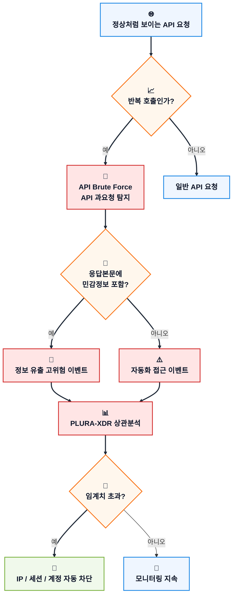
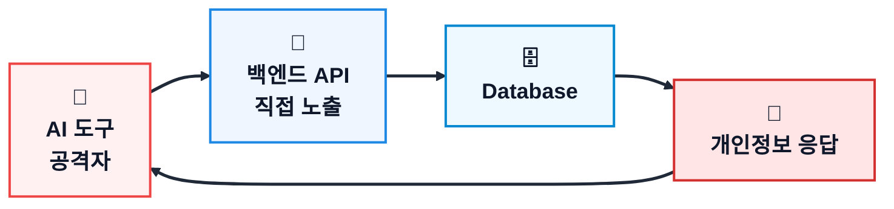
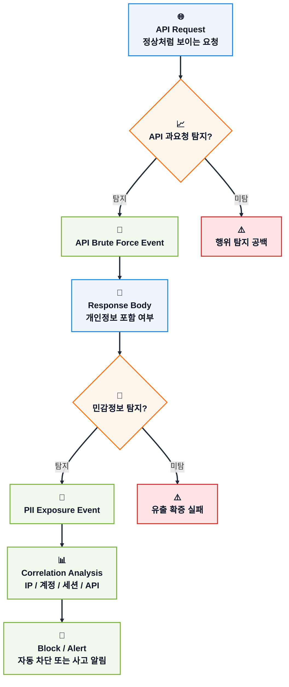
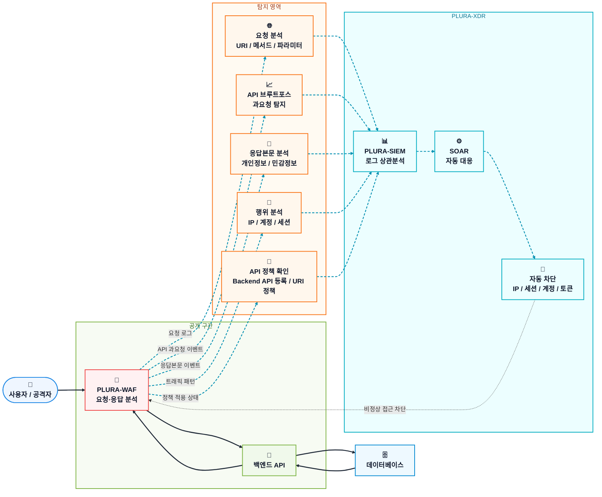

## 핵심만 보기

* 이번 사건의 본질은 “AI 도구” 자체가 아니라 **백엔드 API의 반복 호출과 응답본문 개인정보 노출**입니다.
* 전통적인 로그인 브루트포스는 아닐 수 있지만, **API 브루트포스/과요청** 관점에서는 탐지 가능했을 수 있습니다.
* WAF가 있었더라도, **Backend API가 보호 대상으로 등록되지 않았다면** 탐지 공백이 생길 수 있습니다.
* 요청이 정상처럼 보여도, 응답본문에 개인정보가 반복 포함되면 정보 유출입니다.
* BOLA/IDOR 방지를 위해 객체 단위 권한 검증이 필요합니다.
* PLURA-XDR은 API 과요청, 응답본문 민감정보, 계정·IP·세션 행위를 상관분석해 자동 차단할 수 있습니다.

---

## 1) 사건 개요

‘모두의창업’ 정보 유출 원인은 **“AI 도구로 백엔드 API에 비정상 접근”** 한 것으로 설명됩니다.

이 표현은 매우 중요합니다.

공격자가 반드시 SQL Injection, 웹셸 업로드, 관리자 계정 탈취 같은 전통적인 웹 공격을 사용했다는 의미는 아닙니다.

오히려 이번 사건은 다음과 같은 유형에 더 가깝게 볼 수 있습니다.

> **AI 도구를 이용해 백엔드 API 구조를 탐색하고, 정상 요청처럼 보이는 API 호출을 반복하면서 개인정보가 포함된 응답을 받아낸 사고**

즉, 핵심은 “AI가 공격했다”가 아닙니다.

핵심은 다음입니다.

> **백엔드 API가 비정상적으로 반복 호출되었고, 그 응답본문에 민감정보가 포함되어 외부로 전달되었는가?**

이 관점에서 보면 이번 사건은 단순한 웹 취약점 문제가 아니라, **API 보안, API 브루트포스/과요청 탐지, 응답본문 분석, 데이터 유출 탐지, 자동화 공격 대응**의 문제입니다.

---

### 참고 및 한계

본 글은 공개 보도 내용을 바탕으로 작성했습니다.

다만 공개 보도만으로는 다음 세부 사항까지 확인하기 어렵습니다.

* 공격자의 실제 IP 패턴
* User-Agent 또는 자동화 도구 흔적
* 호출 속도와 호출 횟수
* 인증 우회 여부
* 실제 API 엔드포인트 구조
* WAF 적용 여부
* WAF가 요청만 봤는지, 응답본문까지 봤는지 여부
* Backend API가 WAF 보호 대상으로 등록되어 있었는지 여부
* API 브루트포스/과요청 탐지 정책이 적용되어 있었는지 여부

따라서 본 글은 확인된 보도 내용을 기준으로, 가능한 기술적 공격 흐름과 탐지·대응 관점을 분석합니다.

---

## 2) 밝혀진 사실

현재 공개적으로 확인되는 핵심은 다음과 같습니다.

| 구분        | 내용                                                 |
| --------- | -------------------------------------------------- |
| 사고 대상     | ‘모두의창업’ 서비스                                        |
| 보도상 원인    | AI 도구를 이용한 백엔드 API 비정상 접근                          |
| 공격 대상     | 프론트엔드 화면 자체보다 백엔드 API 접근 가능성이 높음                   |
| 공격 성격     | 전통적 웹 공격보다 API 자동화 접근, 반복 호출, 대량 조회, 비정상 응답 수집 가능성 |
| 브루트포스 관점  | 로그인 브루트포스라기보다 API 브루트포스/과요청 탐지 대상일 가능성             |
| WAF 검토 관점 | WAF 유무뿐 아니라 Backend API 등록 여부와 정책 적용 범위 확인 필요      |
| 핵심 쟁점     | WAF 유무보다 백엔드 API 호출 패턴과 응답본문을 탐지했는가                |
| 주요 탐지 포인트 | API 반복 호출, 동일 IP·계정·세션의 비정상 조회, 응답본문의 개인정보         |

단, 공개된 표현만으로 다음 내용을 단정해서는 안 됩니다.

* SQL Injection이 있었다고 단정할 수 없음
* 웹셸 업로드가 있었다고 단정할 수 없음
* 관리자 계정 탈취가 있었다고 단정할 수 없음
* 전통적인 로그인 브루트포스 공격이었다고 단정할 수 없음
* WAF가 없었다고 단정할 수 없음
* WAF가 있었더라도 Backend API가 제대로 등록되어 있었는지 단정할 수 없음
* AI 도구가 어떤 방식으로 사용되었는지 단정할 수 없음

그러나 동시에, 다음 가능성도 배제해서는 안 됩니다.

> **로그인 브루트포스는 아닐 수 있다.
> 그러나 백엔드 API를 대상으로 한 반복 호출, 순차 조회, 과도한 민감 API 접근이 있었다면 API 브루트포스 또는 API 과요청 탐지로 일부 탐지 가능했을 수 있다.**

더 정확한 표현은 다음과 같습니다.

> **현재 확인된 표현만 보면, 이번 사건은 “전통적인 로그인 브루트포스 공격”이라기보다 “AI 도구를 활용한 백엔드 API 비정상 접근, API 브루트포스성 과요청, 응답 데이터 수집”으로 보는 것이 타당합니다.**

---

## 3) 공격 방법 설명

### 3-1. 가능한 공격 흐름

AI 도구는 취약점 자체가 아닙니다.

하지만 공격자의 작업을 빠르게 자동화할 수 있습니다.

예를 들어 공격자는 다음과 같은 작업을 AI 도구로 수행할 수 있습니다.

* 프론트엔드 JavaScript에서 API 주소 추출
* 브라우저 개발자 도구의 API 요청 분석
* API 파라미터 구조 추정
* `userId`, `companyId`, `postId` 등 식별자 변경
* 반복 호출 스크립트 작성
* 순차 ID 또는 조건값 변경을 통한 API Enumeration
* 응답 JSON에서 이름, 전화번호, 이메일 등 민감정보 추출
* 호출 간격 조절로 단순 차단 우회

최근의 LLM 기반 AI 도구는 난독화된 프론트엔드 JavaScript를 빠르게 분석해 숨겨진 API 엔드포인트를 찾아내고, 파라미터 구조를 추정해 맞춤형 Python 또는 curl 기반 호출 스크립트를 짧은 시간 안에 생성할 수 있습니다.

즉, AI 도구는 새로운 취약점이라기보다, **API 탐색과 반복 호출의 속도와 범위를 크게 높이는 공격 가속기** 역할을 합니다.

이 경우 요청 자체는 매우 정상처럼 보일 수 있습니다.

```http
GET /api/users/1001
Authorization: Bearer 정상토큰
```

문제는 요청 문자열이 아니라 권한과 행위입니다.

```text
이 사용자가 /api/users/1001 데이터를 볼 권한이 있는가?
이 사용자가 짧은 시간에 수십·수백 개의 사용자 데이터를 조회하는 것이 정상인가?
```

이 문제는 API 보안에서 흔히 **BOLA(Broken Object Level Authorization)** 또는 **IDOR(Insecure Direct Object Reference)** 로 설명됩니다.

즉, 사용자가 요청한 객체 ID에 대해 서버가 “이 사용자가 이 데이터를 볼 권한이 있는가?”를 매 요청마다 검증하지 않으면, 정상처럼 보이는 API 호출만으로도 다른 사용자의 데이터가 노출될 수 있습니다.

그리고 더 중요한 문제는 응답입니다.

```json
{
  "name": "홍길동",
  "phone": "010-1234-5678",
  "email": "user@example.com",
  "company": "모두의창업"
}
```

요청에는 공격 문자열이 없더라도, 응답본문에는 개인정보가 포함될 수 있습니다.

따라서 API 정보 유출 사고에서는 다음 두 가지를 함께 봐야 합니다.

> **API 브루트포스/과요청 탐지 = 비정상 행위의 조기 탐지**
> **응답본문 민감정보 탐지 = 실제 정보 유출 여부의 확증**

---

### 3-2. 공격 흐름

```mermaid
%%{init: {
  "theme": "base",
  "themeVariables": {
    "fontFamily": "Pretendard, Noto Sans KR, Arial",
    "background": "#ffffff",
    "primaryTextColor": "#0f172a",
    "lineColor": "#1f2937"
  },
  "themeCSS": "
    .node rect, .node circle, .node ellipse, .node polygon {
      filter: drop-shadow(0px 4px 8px rgba(15, 23, 42, 0.16));
    }
    .edgePath path {
      stroke-width: 2.6px;
    }
    .edgeLabel {
      background-color: #ffffff;
      color: #0f172a;
      font-weight: 700;
    }
  "
}}%%

flowchart LR

    A["🤖<br/><b>공격자</b><br/>AI 도구"] --> B["🔎<br/><b>백엔드 API 탐색</b>"]
    B --> C["🌐<br/><b>반복 API 요청</b><br/>API Enumeration"]
    C --> D{"📈<br/><b>API 과요청?</b>"}
    D -- "반복 호출" --> E{"🔐<br/><b>객체 단위<br/>권한 검증</b>"}
    E -- "검증 미흡" --> F["🗄️<br/><b>DB 조회</b>"]
    F --> G["📄<br/><b>응답본문</b><br/>개인정보 포함"]
    G --> H["🚨<br/><b>정보 유출</b>"]

    classDef attacker fill:#fff1f2,stroke:#ef4444,stroke-width:2px,color:#0f172a,font-size:18px,font-weight:bold;
    classDef normal fill:#eff6ff,stroke:#1e88e5,stroke-width:2px,color:#0f172a,font-size:18px,font-weight:bold;
    classDef warn fill:#fff7ed,stroke:#f97316,stroke-width:2px,color:#0f172a,font-size:18px,font-weight:bold;
    classDef danger fill:#ffe5e5,stroke:#d32f2f,stroke-width:2px,color:#0f172a,font-size:18px,font-weight:bold;

    class A attacker;
    class B,C,F normal;
    class D,E,G warn;
    class H danger;

    linkStyle 0,1,2,3,4,5,6 stroke:#1f2937,stroke-width:2.6px;
```



---

### 3-3. 이 공격은 브루트포스인가?

이번 유형을 전통적인 **로그인 브루트포스 공격**으로 단정하는 것은 적절하지 않습니다.

브루트포스는 일반적으로 다음과 같은 공격을 의미합니다.

```text
ID/PW 반복 대입
OTP 반복 시도
인증 토큰 반복 추측
```

하지만 API 보안 관점에서는 브루트포스의 범위를 더 넓게 봐야 합니다.

공격자가 백엔드 API를 대상으로 다음과 같은 행위를 했다면, 이는 **API 브루트포스**, **API 과요청**, 또는 **API Enumeration 기반 브루트포스**로 탐지할 수 있습니다.

```text
동일 API 반복 호출
서로 다른 객체 ID 순차 조회
동일 계정 또는 토큰의 과도한 민감 API 접근
짧은 시간 내 다수 개인정보 응답 수신
조회 조건을 바꿔가며 데이터 수집
```

따라서 이번 사건은 다음과 같이 정리하는 것이 더 정확합니다.

> **로그인 브루트포스는 아닐 수 있다.
> 그러나 API 호출 패턴 기준으로는 브루트포스성 과요청 탐지가 가능하다.**

이 관점은 쿠팡 JWT 서명키 유출 사례와도 연결됩니다.

쿠팡 사례에서도 공격자는 유효한 JWT를 이용해 정상 사용자처럼 API를 호출했지만, 탐지 관점에서는 단일 IP나 토큰보다 **과도한 요청 패턴** 자체가 중요했습니다. 이 경우 `[Brute Force] API 과요청`과 같은 고신뢰도 이벤트로 분류하고, 임계치를 초과하면 차단하는 방식이 가능합니다.

따라서 조사 관점은 다음과 같이 정리해야 합니다.

| 잘못된 접근           | 더 정확한 접근                      |
| ---------------- | ----------------------------- |
| 로그인 실패 횟수만 본다    | API 호출 패턴을 본다                 |
| 브루트포스가 아니라고 제외한다 | API 브루트포스/과요청 가능성을 본다         |
| 요청 URL만 본다       | 응답본문의 개인정보 포함 여부를 본다          |
| 공격 문자열만 찾는다      | 정상처럼 보이는 API 응답 유출을 찾는다       |
| 단일 이벤트만 본다       | 호출 횟수, 객체 ID 변화, 응답본문을 상관분석한다 |

중요한 질문은 다음입니다.

> **정상처럼 보이는 API 호출이 반복되었는가?**
> **서로 다른 객체 ID를 순차적으로 조회했는가?**
> **동일 계정·토큰·IP에서 민감 API 과요청이 발생했는가?**
> **각 응답에 개인정보가 포함되어 있었는가?**
> **그 응답이 짧은 시간에 반복적으로 외부로 전달되었는가?**

---

### 3-4. 응답본문에서 무엇을 탐지해야 하는가?

API 정보 유출 사고에서 중요한 것은 요청에 악성 문자열이 있었는지뿐만이 아닙니다.

정상처럼 보이는 API 요청이라도, 응답본문에 민감정보가 포함되어 외부로 전달된다면 정보 유출입니다.

PLURA-WAF 관점에서는 응답본문에서 다음과 같은 정보를 탐지해야 합니다.

| 탐지 유형          | 예시                           |
| -------------- | ---------------------------- |
| 정규식 기반 탐지      | 전화번호, 이메일, 주민등록번호, 계좌번호 등    |
| 키워드 기반 탐지      | 이름, 주소, 회사명, 사업자번호, 담당자 정보 등 |
| 민감정보 패턴 엔진     | 개인정보 조합, 반복 응답, 대량 노출 패턴     |
| 응답 크기·건수 분석    | 평소보다 큰 JSON, 과도한 리스트 응답      |
| API별 응답 스키마 비교 | 원래 반환되면 안 되는 필드 포함 여부        |

단순히 `GET /api/users/1001` 요청만 보면 정상처럼 보일 수 있습니다.

하지만 그 응답에 이름, 전화번호, 이메일, 주소가 포함되어 있고, 같은 IP나 계정에서 이런 응답이 반복된다면 이는 명백한 정보 유출 징후입니다.

---

### 3-5. API 브루트포스와 응답본문 탐지는 함께 봐야 한다

API 브루트포스/과요청 탐지는 “이상행위”를 빠르게 찾아내는 역할을 합니다.

응답본문 민감정보 탐지는 “그 이상행위가 실제 정보 유출로 이어졌는지”를 확인하는 역할을 합니다.

따라서 둘 중 하나만으로는 부족합니다.



---

## 4) 왜 탐지하지 못했는가? 문제 제기

이번 사건에서 가장 먼저 떠오르는 질문은 이것입니다.

> **웹방화벽은 없었나?**

하지만 이 질문만으로는 부족합니다.

더 정확한 질문은 다음입니다.

> **백엔드 API가 WAF 뒤에 있었는가?**
> **인라인 WAF 환경이라면 Backend API가 보호 대상으로 등록되어 있었는가?**
> **WAF가 요청뿐 아니라 응답본문까지 분석했는가?**
> **API 브루트포스/과요청 탐지 정책이 있었는가?**
> **개인정보가 응답으로 나가는 순간을 탐지했는가?**
> **동일 IP·계정·세션의 반복 API 호출을 상관분석했는가?**

---

### 4-1. 가능성 1: WAF가 없었을 수 있다

API 서버가 인터넷에 직접 노출되어 있었다면, 공격자는 WAF를 거치지 않고 백엔드 API에 직접 접근할 수 있습니다.



이 경우에는 WAF 유무 이전에, **외부에 직접 노출된 API 자산 관리**가 핵심 문제가 됩니다.

---

### 4-2. 가능성 2: 웹은 WAF 뒤에 있었지만 API는 우회했을 수 있다

겉으로는 WAF를 사용 중이어도, 실제 개인정보가 나가는 API 도메인이 WAF 보호 대상이 아닐 수 있습니다.

```text
www.example.com → WAF 적용
api.example.com → WAF 미적용
admin-api.example.com → 직접 노출
```

이 경우 “WAF가 있었는가?”보다 중요한 질문은 다음입니다.

> **모든 API가 WAF 보호 경로 안에 있었는가?**

웹 페이지는 WAF 뒤에 있었지만, 모바일 앱 API, 관리자 API, 내부용 API, 구버전 API가 직접 노출되어 있었다면 공격자는 그 경로를 이용할 수 있습니다.

---

### 4-3. 가능성 3: 인라인 WAF 환경이었지만 Backend API 등록을 놓쳤을 수 있다

WAF가 있었다고 해서 모든 백엔드 API가 자동으로 보호되는 것은 아닙니다.

특히 인라인 WAF 환경에서는 트래픽이 물리적 또는 논리적으로 WAF 구간을 지나더라도, 실제 보호 정책은 등록된 서비스와 정책 범위에 따라 달라질 수 있습니다.

즉, 다음과 같은 상황이 가능합니다.

```text
WAF 장비는 존재함
트래픽도 WAF 구간을 통과함
하지만 Backend API 서비스, Host, URI, 정책, 응답본문 분석 대상 등록이 누락됨
결과적으로 일반 통과 또는 제한적 탐지만 수행
```

예를 들어 아래와 같은 구조입니다.

```text
www.example.com        → WAF 정책 적용
www.example.com/api/*  → 일부 정책만 적용
api.example.com        → Backend API 등록 누락
admin-api.example.com  → 별도 보호 정책 미적용
```

이 경우 인라인 WAF가 있어도 다음과 같은 탐지 공백이 생길 수 있습니다.

| 누락 가능성                | 결과                        |
| --------------------- | ------------------------- |
| Backend API 서비스 등록 누락 | API별 정책 적용 불가             |
| API Host 또는 URI 정책 누락 | `/api/*` 요청이 일반 웹 요청처럼 처리 |
| 응답본문 분석 비활성           | 개인정보 포함 응답 탐지 불가          |
| API 과요청 정책 미적용        | 반복 호출·순차 조회 탐지 불가         |
| TLS 복호화 미적용           | 요청·응답 본문 분석 불가            |
| JSON 응답 분석 미설정        | API 응답 내 민감정보 탐지 제한       |

따라서 “WAF가 있었는가?”라는 질문만으로는 부족합니다.

더 정확한 질문은 다음입니다.

> **WAF가 해당 Backend API를 실제 보호 대상으로 등록하고 있었는가?**
> **API 요청뿐 아니라 응답본문까지 분석하도록 설정되어 있었는가?**
> **API 과요청, 순차 ID 접근, 개인정보 응답 탐지 정책이 적용되어 있었는가?**

이번 사건에서도 인라인 WAF가 있었다면, 단순히 장비 유무만 볼 것이 아니라 **Backend API 등록 상태와 정책 적용 범위**를 반드시 확인해야 합니다.

```mermaid
%%{init: {
  "theme": "base",
  "themeVariables": {
    "fontFamily": "Pretendard, Noto Sans KR, Arial",
    "background": "#ffffff",
    "primaryTextColor": "#0f172a",
    "lineColor": "#1f2937"
  },
  "themeCSS": "
    .node rect, .node circle, .node ellipse, .node polygon {
      filter: drop-shadow(0px 4px 8px rgba(15, 23, 42, 0.16));
    }
    .edgePath path {
      stroke-width: 2.6px;
    }
    .edgeLabel {
      background-color: #ffffff;
      color: #0f172a;
      font-weight: 700;
    }
  "
}}%%

flowchart LR

    A["🤖<br/><b>공격자</b><br/>AI 도구"] --> B["🧱<br/><b>인라인 WAF</b><br/>트래픽 경유"]

    B --> C{"🔎<br/><b>Backend API<br/>보호 대상 등록?</b>"}

    C -- "등록됨" --> D["✅<br/><b>API 정책 적용</b><br/>과요청 / 응답본문 분석"]
    C -- "등록 누락" --> E["⚠️<br/><b>정책 미적용</b><br/>일반 통과 또는 제한 탐지"]

    D --> F["🔌<br/><b>백엔드 API</b>"]
    E --> F

    F --> G["📄<br/><b>응답본문</b><br/>개인정보 포함"]
    G --> H{"🔎<br/><b>응답본문 분석?</b>"}

    H -- "분석됨" --> I["🚨<br/><b>민감정보 탐지</b>"]
    H -- "분석 안 됨" --> J["⚠️<br/><b>유출 탐지 공백</b>"]

    I --> K["🧱<br/><b>차단 / 알림</b>"]
    J --> L["🚨<br/><b>정보 유출 지속</b>"]

    classDef attacker fill:#fff1f2,stroke:#ef4444,stroke-width:2px,color:#0f172a,font-size:18px,font-weight:bold;
    classDef waf fill:#fff7ed,stroke:#f97316,stroke-width:2px,color:#0f172a,font-size:18px,font-weight:bold;
    classDef normal fill:#eff6ff,stroke:#1e88e5,stroke-width:2px,color:#0f172a,font-size:18px,font-weight:bold;
    classDef safe fill:#f0f9eb,stroke:#7cb342,stroke-width:2px,color:#0f172a,font-size:18px,font-weight:bold;
    classDef danger fill:#ffe5e5,stroke:#d32f2f,stroke-width:2px,color:#0f172a,font-size:18px,font-weight:bold;

    class A attacker;
    class B,C,H waf;
    class F,G normal;
    class D,I,K safe;
    class E,J,L danger;

    linkStyle 0,1,2,3,4,5,6,7,8,9,10 stroke:#1f2937,stroke-width:2.6px;
```



---

### 4-4. 가능성 4: WAF가 있었지만 요청만 보고 정상으로 판단했을 수 있다

일반 WAF는 SQL Injection, XSS, 웹셸 업로드처럼 요청에 포함된 악성 문자열을 찾는 데 집중합니다.

하지만 API 정보 유출 요청은 다음처럼 보일 수 있습니다.

```http
GET /api/startups/1001
Authorization: Bearer 정상토큰
```

요청만 보면 정상입니다.

하지만 응답본문에는 개인정보가 포함될 수 있습니다.

```json
{
  "name": "홍길동",
  "phone": "010-1234-5678",
  "email": "user@example.com"
}
```

따라서 요청만 보는 WAF는 이 공격을 놓칠 수 있습니다.

이번 사건의 본질은 요청에 악성 문자열이 있었는지가 아닙니다.

> **정상처럼 보이는 요청의 결과로, 개인정보가 포함된 응답이 외부로 나갔는가?**

이것이 더 중요한 질문입니다.

---

### 4-5. 가능성 5: API 브루트포스/과요청 탐지가 없었을 수 있다

만약 공격자가 AI 도구나 스크립트를 이용해 API를 반복 호출했다면, 첫 번째 탐지 기회는 응답본문보다 앞서 발생할 수 있습니다.

즉, 다음과 같은 행위가 먼저 보였을 가능성이 있습니다.

```text
동일 IP에서 같은 API 반복 호출
동일 계정에서 다수 객체 조회
동일 세션에서 민감 API 과요청
짧은 시간 내 서로 다른 ID 순차 조회
비정상적으로 큰 Page Size 요청
```

이런 행위는 전통적인 로그인 브루트포스는 아니지만, **API 브루트포스/과요청 탐지** 대상입니다.

따라서 단순히 “로그인 실패가 없었다”는 이유로 브루트포스 탐지 영역에서 제외하면 안 됩니다.

---

### 4-6. 가능성 6: 응답본문과 호출 횟수를 상관분석하지 못했을 수 있다

이번 사건에서 가장 중요한 탐지 포인트는 두 가지입니다.

첫째, 반복 호출입니다.

> **같은 IP, 계정, 세션, 토큰이 짧은 시간에 여러 API를 반복 조회했는가?**

둘째, 응답본문입니다.

> **그 반복 호출의 응답에 개인정보가 포함되어 있었는가?**

둘 중 하나만 보면 부족합니다.

정확한 탐지는 둘을 함께 봐야 합니다.



---

## 5) PLURA-XDR에서 제공하는 대응 방안

PLURA-XDR 관점에서 이번 사건의 대응 핵심은 명확합니다.

> **요청만 보지 말고, API 호출 패턴을 봐야 한다.**
> **공격 문자열만 보지 말고, API 브루트포스/과요청을 봐야 한다.**
> **Backend API가 보호 대상으로 등록되어 있는지 확인해야 한다.**
> **응답본문까지 분석해 개인정보가 실제로 나가는 순간을 봐야 한다.**
> **단일 이벤트만 보지 말고, API 호출 패턴과 응답본문을 상관분석해야 한다.**

---

### 5-1. PLURA-WAF: 응답본문 기반 민감정보 탐지

PLURA-WAF의 핵심 차별점은 **응답본문 데이터를 분석해 민감정보 노출 여부를 확인할 수 있다는 점**입니다.

일반적인 WAF는 요청에 포함된 공격 문자열을 중심으로 탐지합니다.

하지만 이번 사건처럼 요청이 정상 API 호출처럼 보이는 경우에는 요청만으로는 부족합니다.

PLURA-WAF는 다음을 봐야 합니다.

```text
응답본문에 이름이 있는가?
전화번호가 있는가?
이메일이 있는가?
주소가 있는가?
주민등록번호, 계좌번호, 사업자 정보 등 민감정보가 포함되어 있는가?
```

즉, PLURA-WAF의 탐지 기준은 다음으로 확장됩니다.

| 기존 WAF 관점       | PLURA-WAF 관점          |
| --------------- | --------------------- |
| 요청에 공격 문자열이 있는가 | 응답에 민감정보가 포함되었는가      |
| SQL Injection인가 | 개인정보가 실제로 외부로 나가는가    |
| XSS 패턴인가        | API 응답이 비정상적으로 큰가     |
| 악성 요청인가         | 정상 요청처럼 보이지만 결과가 위험한가 |

---

### 5-2. API 브루트포스/과요청 및 자동화 접근 탐지

응답본문에서 개인정보가 확인되었다면, 다음 단계는 반복성 분석입니다.

반대로, 응답본문 탐지 이전에도 동일 API에 대한 과도한 반복 호출이 먼저 탐지될 수 있습니다.

이 경우 PLURA-XDR은 이를 **API 브루트포스** 또는 **API 과요청** 이벤트로 분류할 수 있습니다.

PLURA-XDR은 다음 요소를 함께 분석해야 합니다.

| 분석 항목                | 의미                                               |
| -------------------- | ------------------------------------------------ |
| 동일 IP의 반복 API 호출     | 자동화 도구 사용 가능성                                    |
| 동일 계정의 다수 객체 조회      | 권한 없는 데이터 조회 가능성                                 |
| 동일 토큰·세션의 민감 API 과요청 | 쿠팡 JWT 사례와 유사한 행위 기반 탐지 대상                       |
| 순차 ID 접근             | `/users/1001`, `/users/1002` 형태의 API Enumeration |
| 짧은 시간 대량 응답          | 정보 수집 또는 스크래핑 가능성                                |
| 응답 크기 급증             | 대량 데이터 유출 가능성                                    |
| 비정상 Page Size        | 한 번에 과도한 데이터 조회 가능성                              |
| User-Agent 변화        | 자동화 도구 또는 스크립트 가능성                               |
| 응답본문 민감정보 반복         | 실제 개인정보 유출 확증                                    |

여기서 중요한 점은, 브루트포스를 로그인 공격으로만 좁게 해석하지 않는 것입니다.

더 정확한 표현은 다음입니다.

> **이번 사건은 로그인 브루트포스가 아니라, API 브루트포스/과요청 탐지와 응답본문 민감정보 탐지가 결합되어야 하는 사건입니다.**

---

### 5-3. Backend API 등록 상태 점검

WAF가 인라인으로 구성되어 있더라도, Backend API가 보호 대상으로 등록되어 있지 않으면 정밀 탐지가 제한될 수 있습니다.

따라서 PLURA-WAF 운영에서는 다음 항목을 반드시 확인해야 합니다.

| 점검 항목              | 확인 내용                                                |
| ------------------ | ---------------------------------------------------- |
| 보호 도메인 등록          | `www`, `api`, `admin-api` 등 실제 API 도메인이 모두 등록되어 있는가  |
| Backend API 서비스 등록 | 개인정보를 반환하는 API 서버가 보호 대상으로 등록되어 있는가                  |
| Host/URI 정책        | `/api/*`, `/v1/*`, `/admin/*` 등 주요 API 경로에 정책이 적용되는가 |
| TLS 복호화            | HTTPS 요청·응답 본문을 분석할 수 있는 구조인가                        |
| JSON 응답 분석         | API 응답본문의 JSON 필드 분석이 가능한가                           |
| 응답본문 민감정보 탐지       | 개인정보·민감정보 탐지 정책이 켜져 있는가                              |
| API 과요청 탐지         | 동일 IP·계정·세션의 반복 호출 탐지가 적용되어 있는가                      |
| 차단 정책              | 탐지 후 IP·세션·계정 차단이 실제 운영 상태인가                         |

이 점검은 단순 구성 확인이 아닙니다.

> **WAF가 있는가가 아니라,
> WAF가 해당 Backend API를 실제로 보고 있는가를 확인해야 합니다.**

---

### 5-4. PLURA-XDR 상관분석

PLURA-XDR은 WAF 이벤트만 단독으로 보지 않습니다.

다음 데이터를 함께 연결해야 합니다.

```text
PLURA-WAF 요청 로그
PLURA-WAF 응답본문 탐지 이벤트
API 브루트포스/과요청 이벤트
Backend API 등록 및 정책 적용 상태
API URI별 호출 통계
IP Reputation / TI 정보
EDR 이벤트
서버 접근 로그
계정 행위 로그
세션·토큰 사용 패턴
```

이를 통해 다음과 같은 판단이 가능합니다.

```text
이 IP가 짧은 시간에 여러 API를 호출했다.
동일 계정 또는 세션에서 서로 다른 객체 ID를 반복 조회했다.
각 응답에는 개인정보가 포함되어 있었다.
호출된 API의 ID 값이 순차적으로 증가했다.
정상 사용자 평균 대비 과도한 요청 밀도가 확인되었다.
해당 API가 WAF 보호 대상에 등록되어 있었는지도 확인했다.
따라서 단순 정상 사용이 아니라 자동화된 정보 수집 가능성이 높다.
```

PLURA-XDR의 상관분석은 단일 이벤트가 아니라 **흐름**을 봅니다.

```text
정상처럼 보이는 요청
→ API 과요청 탐지
→ 개인정보 포함 응답
→ Backend API 보호 정책 확인
→ 다수 객체 조회
→ 동일 IP 또는 계정의 비정상 행위
→ 자동 차단 또는 사고 알림
```

---

### 5-5. 자동 차단

탐지 이후에는 자동 대응이 필요합니다.

예를 들어 다음 조건을 만족하면 자동 차단할 수 있습니다.

```text
동일 IP에서 민감 API 10회 이상 반복 호출
동일 IP에서 개인정보 포함 응답 5회 이상 발생
동일 계정에서 서로 다른 사용자 ID 10개 이상 조회
동일 세션 또는 토큰에서 민감 API 과요청 발생
동일 API에서 짧은 시간 내 순차 ID 접근 발생
응답본문 민감정보 탐지 + 비정상 호출 빈도 동시 발생
```

대응 방식은 다음과 같습니다.

| 대응 방식    | 설명                   |
| -------- | -------------------- |
| IP 자동 차단 | 일정 시간 해당 IP 접근 차단    |
| 세션 차단    | 로그인 세션 강제 종료         |
| 계정 잠금    | 비정상 조회 계정 임시 잠금      |
| 토큰 무효화   | 의심 토큰 또는 세션 강제 폐기    |
| 관리자 알림   | 개인정보 응답 유출 이벤트 즉시 통보 |
| 상세 로그 보존 | 사고 조사 및 증적 확보        |

---

### 5-6. 어떻게 방어해야 하는가?

이번 사건의 방어는 단일 제품이나 단일 정책만으로 해결되지 않습니다.

애플리케이션의 권한 검증, Backend API 등록 상태, API 호출 통제, 응답본문 탐지, XDR 상관분석이 함께 동작해야 합니다.

| 구분     | 대응 항목                                    | 설명                                     |
| ------ | ---------------------------------------- | -------------------------------------- |
| 애플리케이션 | Object Level Authorization, BOLA/IDOR 방지 | 사용자가 요청한 객체 ID에 접근 권한이 있는지 서버에서 반드시 검증 |
| 애플리케이션 | Response Minimization                    | API 응답에 불필요한 개인정보 필드를 포함하지 않음          |
| 애플리케이션 | Response Scrubbing                       | 필요하지 않은 민감정보는 마스킹 또는 제거                |
| API 보안 | Rate Limiting                            | IP·계정·API별 호출 빈도 제한                    |
| API 보안 | Page Size 제한                             | 한 번에 과도한 데이터가 반환되지 않도록 제한              |
| API 보안 | Sequential ID 접근 탐지                      | 순차 ID 기반 API Enumeration 탐지            |
| WAF    | Backend API 보호 대상 등록                     | 실제 API 도메인·Host·URI가 WAF 정책 대상인지 확인    |
| WAF    | API 브루트포스/과요청 탐지                         | 반복 API 호출, 민감 API 과요청 탐지               |
| WAF    | 응답본문 민감정보 탐지                             | 이름, 전화번호, 이메일, 주소 등 민감정보 노출 탐지         |
| XDR    | 반복 호출 상관분석                               | 동일 IP·계정·세션의 순차 ID 접근, 대량 조회 행위 분석     |
| SOAR   | 자동 차단                                    | 위험 임계치 초과 시 IP, 세션, 계정, 토큰 단위 차단       |
| 감사/조사  | 상세 로그 보존                                 | 사고 원인 분석과 재발 방지를 위한 증적 확보              |

정리하면, API 정보 유출 방어의 핵심은 다음 여섯 가지입니다.

> **권한 검증으로 막고,
> Backend API 보호 대상을 빠짐없이 등록하고,
> API 과요청 탐지로 조기에 발견하고,
> 응답 최소화로 유출 범위를 줄이고,
> 응답본문 분석으로 유출을 확증하고,
> XDR 상관분석으로 차단해야 합니다.**

---

### 5-7. PLURA-XDR 대응 구조



---

### 5-8. 운영 기준 예시

실제 운영에서는 다음과 같은 조건을 조합해 탐지 정책을 만들 수 있습니다.

| 탐지 조건                    | 의미                  | 대응               |
| ------------------------ | ------------------- | ---------------- |
| Backend API 미등록 또는 정책 누락 | WAF 탐지 공백 가능성       | 보호 대상 등록 및 정책 적용 |
| 동일 IP에서 민감 API 반복 호출     | 자동화 접근 가능성          | 경고 또는 임시 차단      |
| 동일 계정에서 다수 객체 ID 조회      | 권한 없는 데이터 수집 가능성    | 세션 차단 또는 계정 잠금   |
| 순차 ID 접근 패턴              | API Enumeration 가능성 | API 브루트포스 이벤트 생성 |
| 개인정보 포함 응답 반복            | 실제 데이터 유출 가능성       | 고위험 이벤트 승격       |
| API 과요청 + 개인정보 응답 동시 발생  | 정보 유출 고위험           | 자동 차단            |
| 동일 토큰·세션의 비정상 조회         | 탈취 토큰 또는 내부자 악용 가능성 | 토큰 무효화 및 관리자 알림  |

여기서 중요한 것은 단일 조건이 아닙니다.

> **Backend API 보호 대상 등록, 반복 호출, 객체 ID 변화, 응답본문 민감정보, 계정·세션 행위를 함께 봐야 합니다.**

---

## 결론

이번 사건에서 핵심은 “AI 도구를 사용했는가”가 아닙니다.

AI 도구는 공격을 자동화하고 빠르게 만드는 수단입니다.

진짜 문제는 다음입니다.

> **백엔드 API가 정상처럼 보이는 요청에 반복적으로 응답했고,
> 그 응답본문에 개인정보가 포함되어 있었으며,
> 이 API 브루트포스성 과요청과 응답 유출 흐름을 탐지하지 못했는가?**

따라서 이번 사건은 다음 질문을 던집니다.

> **우리의 WAF는 요청만 보고 있는가?**
> **아니면 API 호출 패턴과 응답본문까지 보고 있는가?**
> **인라인 WAF 환경이라면 Backend API가 보호 대상으로 등록되어 있는가?**
> **API 브루트포스/과요청을 탐지할 수 있는가?**
> **개인정보가 실제로 외부로 나가는 순간을 탐지할 수 있는가?**
> **동일 IP·계정·세션의 반복 API 조회를 상관분석할 수 있는가?**
> **탐지 후 자동 차단까지 가능한가?**

PLURA-XDR의 대응 방향은 명확합니다.

> **PLURA-WAF는 Backend API 보호 대상 등록 상태를 확인하고, 요청뿐 아니라 API 과요청과 응답본문을 함께 분석해 민감정보 유출을 탐지합니다.
> PLURA-XDR은 반복 API 호출과 계정·IP·세션 행위를 상관분석하여 자동 차단까지 수행합니다.**

AI 도구 시대의 정보 유출은 더 이상 이상한 공격 문자열로만 발생하지 않습니다.

정상처럼 보이는 API 호출이 반복되고, 그 응답에 개인정보가 포함되는 순간, 이를 볼 수 있어야 합니다.

정리하면 이번 사건은 이렇게 말할 수 있습니다.

> **로그인 브루트포스는 아닐 수 있다.
> 그러나 API 브루트포스/과요청으로는 탐지할 수 있다.
> 그리고 응답본문 분석은 그 행위가 실제 정보 유출로 이어졌는지 확증하는 핵심 근거다.
> 단, 인라인 WAF 환경에서도 Backend API가 보호 대상으로 등록되어 있지 않다면 탐지 공백은 여전히 발생할 수 있다.**

**그것이 PLURA-WAF와 PLURA-XDR이 필요한 이유입니다.**

---

## 📚 함께 읽기

* [쿠팡 등 API 인증 키(JWT) 유출 사고](https://blog.plura.io/ko/threats/case-coupang_authkey/)

## 📖 관련 기사

* [‘모두의창업’ 정보 유출 원인은 “AI 도구로 백엔드 API에 비정상 접근” – 바이라인네트워크](https://byline.network/2026/06/22-573/)

