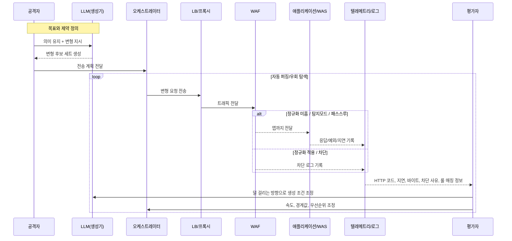

본 문서는 **LLM/에이전트 기반 WAF 우회 전술이 실제 공격 흐름에서 어떻게 작동할 수 있는지**를 설명합니다.  
다만 목적은 공격 재현이 아니라, **방어자가 어떤 지점을 기준으로 설계·탐지·대응해야 하는지**를 정리하는 데 있습니다.

> 주의: **재현 가능한 코드, 구체 페이로드, 악용 절차는 포함하지 않습니다.**  
> 목적은 **위협 모델 이해, 방어 기준 수립, 운영 점검 포인트 제시**입니다.

---

## 0) Executive Summary

오늘날 공격자는 단순히 한두 개의 우회 문자열을 수작업으로 바꾸는 수준에 머물지 않습니다.  
이제는 **LLM(생성기) + 오케스트레이터(전송 자동화) + 평가자(피드백 기반 최적화)**를 결합하여, **의미는 유지하면서 표현만 바꾸는 변형**을 대량으로 만들어 냅니다.

특히 SOAP/XML 환경에서는 다음과 같은 이유로 이런 자동화가 더 위험해집니다.

* **스키마 합치**를 유지한 채도 다양한 표현 변형이 가능함
* **네임스페이스, 인코딩, 프레이밍, 헤더 일치성** 같은 요소가 많아 변형 공간이 큼
* WAF와 애플리케이션이 **동일하게 정규화·해석하지 않으면** 우회 여지가 생김
* 차단 사유, 응답 코드, 지연, 바이트량 같은 **피드백 신호**가 존재하면 자동 튜닝이 가능해짐

즉, 공격의 핵심은 “새로운 마법”이 아니라  
**같은 의미를 유지한 채 표현만 바꾸는 변형을 대량·반복·자동으로 시험하는 것**입니다.

---

## 1) 왜 이 문서가 중요한가

이 문서를 공격자 관점으로만 읽으면 절반만 이해한 것입니다.  
더 중요한 것은, 이 시나리오가 방어자에게 다음 질문을 던진다는 점입니다.

1. **우리 WAF는 본문을 어디까지 실제로 정규화해서 보는가**
2. **WAF와 애플리케이션은 같은 의미로 요청을 해석하는가**
3. **차단 실패보다 더 위험한 탐지 전환, 예외 확대, 피드백 노출이 존재하는가**
4. **레이트 리밋과 행동 분석 없이 룰 기반 차단에만 의존하고 있지 않은가**
5. **우회된 요청이 애플리케이션·WAS·호스트 로그에서 끝까지 추적 가능한가**

결국 문제는 “LLM이 공격에 쓰인다”는 사실보다,  
**표현 변형을 대량으로 흡수할 수 있는 정규화·계약 기반 방어가 갖춰져 있는가**입니다.

---

## 2) 전체 흐름: 생성 → 전송 → 평가 → 재생성

> 핵심은 **폐루프(closed-loop)** 입니다.  
> 생성이 끝이 아니라, **전송 결과를 다시 생성 조건으로 되먹임**하여 우회 성공률을 점진적으로 높입니다.

---

## 3) 위협 모델: 공격 자동화의 4개 구성요소

### 3-1) 생성기(LLM)

생성기는 스키마를 깨지 않으면서도 **표현만 달라지는 변형 후보**를 빠르게 만듭니다.  
중요한 것은 “무작위”가 아니라 **의미 동등성(semantic equivalence)** 입니다.

예를 들어 방어자가 주의해야 할 것은 특정 문자열 하나가 아니라 다음과 같은 **변형 계층**입니다.

* 구조는 같지만 표현만 달라지는 **표기 변형**
* 같은 의미를 다른 순서나 래핑으로 표현하는 **구성 변형**
* 해석 시점에 동일하게 수렴하는 **정규화 이전 변형**
* 본문은 같지만 전송 경계나 포장을 바꾸는 **전달 계층 변형**

즉, 탐지 포인트는 문자열이 아니라 **의미, 구조, 해석 결과**여야 합니다.

### 3-2) 오케스트레이터

오케스트레이터는 생성된 후보를 실제 요청으로 바꾸고,  
전송 순서·속도·분산·재시도를 자동으로 제어합니다.

이 계층이 붙는 순간 우회는 단발성이 아니라 **운영 가능한 반복 실험**이 됩니다.

### 3-3) 평가자(Evaluator)

평가자는 응답과 차단 로그를 점수화해  
무엇이 더 잘 통과하는지를 판정합니다.

이것이 붙으면 단순 변형이 아니라 **튜닝 가능한 우회 시스템**으로 바뀝니다.

### 3-4) 텔레메트리 수집

공격자는 생각보다 적은 정보만 있어도 충분한 힌트를 얻습니다.

* 차단 여부
* HTTP 코드 변화
* 응답 시간 차이
* 응답 길이 변화
* 오류 메시지의 존재 여부
* 특정 조건에서만 나타나는 예외 패턴

방어자는 이 점을 이해해야 합니다.  
**너무 자세한 피드백은 곧 공격자의 학습 데이터**가 됩니다.

---

## 4) AI가 강화하는 4가지 우회 축

## A) 구문·시맨틱 변형

이 축의 목적은 단순합니다.  
**의미는 같게 유지하고, 탐지기가 의존하는 표면 표현만 바꾸는 것**입니다.

여기서 중요한 포인트는 특정 기법 나열이 아니라,  
방어자가 “표현 다양성”을 얼마나 흡수할 수 있느냐입니다.

대표적으로 다음 범주의 변형이 위험합니다.

* **표기 계층 변형**: 동일 의미를 다른 표기 방식으로 표현
* **구조 계층 변형**: 요소 순서, 래핑, 분리 방식만 변경
* **정규화 이전 변형**: 파서가 해석하면 같아지지만 룰 시점에는 다르게 보이는 형태
* **문자 집합/인코딩 계층 변형**: 해석 결과는 같지만 중간 장비가 다르게 보는 형태

즉, LLM의 강점은 페이로드를 “발명”하는 것이 아니라  
**동일한 의미를 수십, 수백 가지 표현으로 바꾸는 데** 있습니다.

## B) 전송·프레이밍 교란

많은 WAF는 본문 자체보다도  
**본문이 전달되는 방식**에서 약점을 드러냅니다.

공격자는 본문 내용 대신 다음을 흔듭니다.

* 압축 여부
* 청크 분할
* 멀티파트 경계
* 프로토콜별 프레이밍
* 본문 길이와 헤더의 일관성
* 검사 한도 직전의 패딩·노이즈

결국 방어자는 “무엇이 들어왔는가”뿐 아니라  
“**그 요청이 어떤 경계와 포장으로 도착했는가**”까지 봐야 합니다.

## C) 정규화 부재 표적화

가장 본질적인 약점은 여기 있습니다.

WAF가 보는 요청과 애플리케이션이 해석하는 요청이 다르면,  
공격자는 그 차이를 이용합니다.

이때 우회는 특별한 공격 기법이 아니라  
**해석 불일치**(parser differential)를 이용하는 행위가 됩니다.

따라서 방어의 핵심은 더 많은 룰이 아니라  
**정규화의 순서, 기준, 일관성**입니다.

## D) 운영 빈틈 유발·활용

공격은 기술만으로 성공하지 않습니다.  
운영팀의 피로와 예외 관리를 흔드는 순간, 우회는 더 쉬워집니다.

대표적으로 위험한 운영 징후는 다음과 같습니다.

* 차단보다 탐지를 우선시하며 **Detect-only 상태가 길어지는 환경**
* 오탐 부담 때문에 **예외 정책이 계속 누적되는 환경**
* 관리망/직결/백업 포트 등 **비경유 루트**가 존재하는 환경
* 야간·점검 시간대에 **정책 강도가 달라지는 환경**

즉, AI는 우회 문자열만 만드는 것이 아니라  
**운영 취약성까지 학습 가능한 반복 대상으로 바꿉니다.**

---

## 5) 자동 퍼징 루프의 피드백 신호

공격자가 선호하는 것은 상세한 내부 정보가 아닙니다.  
오히려 아주 작은 차이만 있어도 충분합니다.

### WAF 레벨 신호

* 차단 여부
* 차단 사유 문자열
* 매칭된 룰 ID 노출 여부
* 요청 길이 제한 또는 본문 검사 제한 도달 여부
* Detect/Block 모드 차이

### 애플리케이션 레벨 신호

* 2xx / 4xx / 5xx 분포 변화
* 예외 메시지 존재 여부
* 처리 시간의 증가 또는 감소
* 응답 길이 변화
* 특정 형태에서만 나타나는 타임아웃

### 운영 레벨 신호

* 특정 시간대 정책 차이
* 레이트 리밋 경계 반응
* 우회 시도 후 보안 장비 설정 변화
* 동일 요청군에 대한 대응 일관성

> 중요한 점은,  
> **정교한 공격자는 “성공”보다 “차이”를 먼저 수집한다는 것**입니다.  
> 그 차이가 곧 다음 세대 변형의 재료가 됩니다.

---

## 6) 2026년 기준으로 더 중요해진 변화

2025년까지는 많은 논의가 “LLM이 우회 문자열을 잘 만든다”는 수준에 머물렀다면,  
2026년에는 초점이 조금 달라졌습니다.

이제 더 중요한 것은 다음입니다.

### 6-1) AI가 공격을 ‘가속’한다

AI는 새로운 취약점을 마법처럼 만드는 것이 아니라,  
기존에 사람이 하던 변형·반복·조합·우선순위 결정을 **훨씬 빠르게 수행**합니다.

### 6-2) 최신 WAF도 단일 룰 기반만으로는 부족하다

최근 WAF는 정규화, 시맨틱 분석, 이상행위 분석을 강화하고 있습니다.  
그럼에도 불구하고, **애플리케이션 계약 검증과 전 구간 로깅 없이** WAF 단독으로 충분하다고 보기는 어렵습니다.

### 6-3) 공격 도구로서의 LLM과 방어 도구로서의 AI가 동시에 진화한다

공격자가 LLM으로 변형을 최적화하듯,  
방어자도 로그 상관분석, 이상행위 탐지, 정책 자동 생성, 예외 검증 자동화에 AI를 써야 합니다.

### 6-4) SOAP/XML 같은 레거시 인터페이스는 여전히 위험하다

REST/JSON 중심 환경으로 이동했더라도,  
기업 내부에는 여전히 SOAP/XML 기반 레거시 API가 남아 있습니다.  
이 구간은 종종 “오래된 만큼 안정적”이 아니라,  
**오래된 만큼 정규화와 검증 일관성이 약한 구간**이 되기 쉽습니다.

---

## 7) 방어자가 반드시 가져가야 할 설계 원칙

이 문서의 실질적 결론은 여기입니다.  
AI 보조 우회에 대응하려면, WAF 룰 튜닝만으로는 부족합니다.

### 7-1) Canonicalization을 먼저 하고 검사하라

검사의 출발점은 원문이 아니라 **정규화 결과**여야 합니다.

* 문자 집합
* 인코딩
* 압축 해제
* 프레이밍 해석
* 네임스페이스·엔티티·표준 표현 수렴

이 단계가 빠지면, 룰은 결국 표면 표현만 보게 됩니다.

### 7-2) WAF와 애플리케이션의 해석을 맞춰라

보안 장비가 이해한 요청과 앱이 처리한 요청이 다르면  
우회 가능성은 구조적으로 남습니다.

가장 중요한 것은 룰의 개수가 아니라  
**WAF ↔ 프록시 ↔ WAS ↔ 애플리케이션 간 해석 일관성**입니다.

### 7-3) 스키마/계약 검증을 강제하라

정상 요청의 허용 범위를 명확히 정하고,  
그 범위를 벗어나면 의미 해석 이전에 거부해야 합니다.

즉, “나쁜 것을 찾는 방식”만이 아니라  
**“허용된 것만 통과시키는 방식”**이 병행되어야 합니다.

### 7-4) 차단 사유와 응답 정보를 최소화하라

상세한 에러는 친절한 운영 정보가 아니라  
공격자의 튜닝 피드백이 될 수 있습니다.

* 룰 ID 노출 최소화
* 차단 사유 최소화
* 상세 예외 메시지 억제
* 응답 일관성 유지

### 7-5) Detect-only를 장기 운영하지 마라

탐지만 하고 차단하지 않는 기간이 길어질수록  
공격자는 더 많은 학습 데이터를 얻습니다.

### 7-6) 레이트 리밋만 보지 말고 행동을 보라

Low-and-Slow는 임계치 아래에서 움직입니다.  
따라서 건수보다 다음을 봐야 합니다.

* 의미적으로 유사한 요청군
* 실패와 성공의 교차 패턴
* 시간 분산 후 재시도
* 비정상적인 변형 다양성

### 7-7) WAF 통과 이후까지 반드시 추적하라

진짜 중요한 것은 차단 수가 아니라  
**우회된 요청이 앱, WAS, 계정, 프로세스, 시스템 이벤트로 이어졌는지**입니다.

즉, WAF 로그만이 아니라  
애플리케이션 로그, 시스템 로그, 인증 로그, 행위 로그까지 연결되어야 합니다.

---

## 8) 운영팀 체크리스트

다음 질문에 “예”라고 답하기 어렵다면,  
AI 보조 우회에 취약할 가능성이 높습니다.

* 우리는 압축, 인코딩, 프레이밍 해제 후 검사하는가
* WAF와 애플리케이션의 XML 해석 결과가 같은가
* SOAP/XML 요청에 대해 스키마 검증이 강제되는가
* 룰 ID, 차단 사유, 상세 예외가 외부에 과도하게 노출되지 않는가
* Detect-only 또는 임시 예외가 장기 방치되지 않는가
* 비경유 루트와 우회 경로가 정리되어 있는가
* WAF 통과 후 애플리케이션·호스트 로그까지 상관분석 가능한가
* Low-and-Slow를 건수 외 행위 기준으로 탐지하는가

---

## 9) 한계와 현실성

이런 자동화가 만능은 아닙니다.

* 정규화와 계약 검증이 강하면 변형 이득이 크게 줄어듭니다.
* 응답 피드백이 제한되면 튜닝 속도가 느려집니다.
* 행동 분석과 레이트 리밋이 강하면 반복 실험이 어려워집니다.
* 정책 예외에 TTL과 변경 이력 관리가 엄격하면 운영 빈틈을 악용하기 어렵습니다.

즉, 공격자는 AI로 속도를 얻지만,  
방어자는 **정규화 일관성 + 계약 검증 + 피드백 최소화 + 전 구간 추적성**으로 그 속도를 무력화할 수 있습니다.

---

## 10) 결론

AI 보조 WAF 우회의 본질은 “AI가 똑똑하다”는 데 있지 않습니다.  
본질은 **표현 변형을 대량으로 만들고, 피드백을 먹여, 점점 덜 걸리는 조합으로 수렴시키는 자동화**에 있습니다.

따라서 방어의 핵심도 분명합니다.

* 문자열이 아니라 **의미를 보아야 하고**
* 룰이 아니라 **정규화를 먼저 해야 하며**
* 차단만이 아니라 **앱과 호스트까지 추적해야 하고**
* 탐지 수가 아니라 **우회 이후 전체 흐름을 막을 수 있어야 합니다**

결국 AI 시대의 WAF 방어는  
“더 많은 룰”의 경쟁이 아니라  
**더 일관된 해석, 더 적은 피드백, 더 강한 계약 검증, 더 넓은 상관분석**의 경쟁입니다.

---

## 11) 윤리·취지

본 문서는 **악용 방지**를 위해 재현 가능한 코드, 구체 페이로드, 상세 우회 절차를 의도적으로 제외했습니다.  
목적은 **위협 모델 이해와 방어 설계 원칙 정리**이며, 모든 연구와 검증은 **합법적·책임 있는 환경**에서만 수행되어야 합니다.

