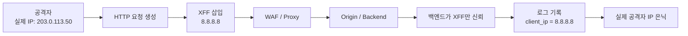
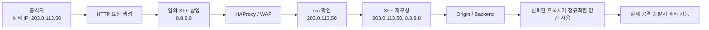

## 🛡️ 공격자는 왜 X-Forwarded-For를 조작할까

웹 서비스 앞단에  
CDN, 로드밸런서, 리버스 프록시, WAF가 놓이면  
원 서버는 더 이상 인터넷 사용자의 실제 연결 IP를 직접 보지 못합니다.

이때 업계에서는 보통  
`X-Forwarded-For(XFF)` 헤더에  
“원래 요청자의 IP”를 담아 뒤쪽 시스템에 전달합니다.

문제는 여기서 시작됩니다.

`X-Forwarded-For`는  
**보안 장비 전용 메타데이터가 아니라, HTTP 헤더**입니다.

즉,  
클라이언트도 넣을 수 있고  
공격자도 조작할 수 있습니다.

그래서 백엔드가  
“XFF에 들어 있으면 진짜 사용자 IP겠지”라고 생각하는 순간,  
공격자는 아주 손쉽게 자신의 출발지를 흐릴 수 있습니다.

---

## 📌 먼저, 지금 바로 점검해야 할 5가지

> **XFF는 받는 것보다, 무엇을 신뢰할 것인지가 더 중요합니다.**

1. **원 서버는 어떤 헤더를 실제 사용자 IP로 해석하는가**
2. **신뢰된 프록시가 다시 쓴 값과, 클라이언트가 보낸 원본 값을 구분하는가**
3. **로그에 실제 연결 IP, 원본 XFF, 최종 해석 IP를 함께 남기는가**
4. **IP 기반 차단·Rate Limit·Credential Stuffing 탐지가 헤더 조작에 흔들리지 않는가**
5. **다단 프록시 환경에서 어느 홉까지를 신뢰할지 명확히 정의했는가**

이 다섯 가지 중 하나라도 불명확하면  
XFF 우회는 언제든 다시 발생할 수 있습니다.

---

## 왜 위험한가 — 이것은 단순 헤더 문제가 아니다

많은 운영팀이  
XFF를 단순 전달 헤더 정도로 생각합니다.

하지만 실제로는 다릅니다.

XFF가 조작되면 흔들리는 것은  
단순한 로그 한 줄이 아닙니다.

- IP 기반 차단
- Brute Force / Credential Stuffing 탐지
- Geo/IP 기반 이상 행위 분석
- Bot 탐지
- 사고 대응과 포렌식
- 공격자 재추적

즉,  
**“누가 공격했는가”를 판단하는 출발점** 자체가 흔들립니다.

그래서 이 문제는  
단순한 헤더 설정 문제가 아니라  
**신뢰 경계(Trust Boundary)** 문제입니다.

> **XFF를 받는 것과, XFF를 신뢰하는 것은 완전히 다른 문제입니다.**

이 한 줄이  
이 글의 핵심입니다.

---

## 공격자는 어떻게 악용하는가

가장 전형적인 방식은 단순합니다.

공격자가 직접 HTTP 요청에  
임의의 XFF 값을 넣어 보내는 것입니다.

예를 들어 다음과 같습니다.

```http
POST /login HTTP/1.1
Host: example.com
X-Forwarded-For: 8.8.8.8
User-Agent: Mozilla/5.0
Content-Type: application/x-www-form-urlencoded

id=test&pw=guess123
```

실제 공격자의 접속 IP는  
`203.0.113.50` 이라고 가정해 보겠습니다.

그런데 원 서버가  
TCP 연결 정보가 아니라  
헤더 안의 `X-Forwarded-For: 8.8.8.8` 만 신뢰하면,  
로그에는 공격자가 아니라 **8.8.8.8** 이 남을 수 있습니다.

이제 공격자는 다음과 같은 우회를 시도할 수 있습니다.

* 요청마다 서로 다른 XFF 값을 넣는다
* 로그인 시도마다 임의의 공인 IP를 넣는다
* CDN이나 프록시 체인을 흉내 내는 형태로 XFF 값을 길게 넣는다
* 차단된 IP 대역을 피한 것처럼 보이게 만든다

결과는 분명합니다.

같은 공격자가 반복 공격을 해도  
탐지 시스템은 이를 서로 다른 IP의 정상 분산 요청처럼 오인할 수 있습니다.

---

## 모의 사례 — Credential Stuffing 탐지가 왜곡되는 방식

예를 들어 한 공격자가  
동일 계정에 대해 비밀번호 대입 공격을 한다고 가정해 보겠습니다.

실제 연결 IP는 모두 동일합니다.

```text
203.0.113.50
203.0.113.50
203.0.113.50
203.0.113.50
203.0.113.50
```

그런데 공격자는 요청마다 아래처럼 다른 XFF를 넣습니다.

```text
X-Forwarded-For: 1.1.1.1
X-Forwarded-For: 8.8.8.8
X-Forwarded-For: 9.9.9.9
X-Forwarded-For: 208.67.222.222
X-Forwarded-For: 4.2.2.2
```

이때 백엔드가 XFF를 그대로 신뢰하면  
탐지 시스템은 다음처럼 잘못 해석할 수 있습니다.

* 동일 공격자 1명이 아니라 여러 지역에서 들어온 분산 로그인 시도로 보임
* 동일 출발지 기반 Rate Limit이 동작하지 않음
* 특정 IP 차단 정책이 무력화됨
* 사고 후 “공격자 IP 목록” 자체가 오염됨

즉,  
XFF 조작은 단순 우회가 아니라  
**보안 운영자의 시야를 흐리게 만드는 공격**입니다.

---

## 한눈에 보는 흐름도

### 1. 잘못된 구조 — 백엔드가 XFF를 그대로 신뢰하는 경우



이 구조에서는  
공격자가 헤더 한 줄만 조작해도  
운영자의 기록과 분석이 쉽게 흔들릴 수 있습니다.

---

### 2. 신뢰 경계를 고려한 구조 — PLURA + HAProxy 방식



핵심은
**공격자가 쓴 문자열이 아니라, 프록시가 직접 본 연결 정보가 앞에 온다**는 점입니다.

---

### 3. 실제 운영 환경에서의 네트워크 흐름 예시

```mermaid
flowchart LR
    U[사용자 / 공격자] --> CDN[CDN]
    CDN --> WAF[WAF]
    WAF --> LB[Load Balancer]
    LB --> RP[HAProxy Reverse Proxy]
    RP --> ORIGIN[Origin Web Server]
    ORIGIN --> APP[Application / Auth]
    APP --> LOG[Log / SIEM / XDR]

    CDN -. XFF 또는 전용 Client-IP Header .-> WAF
    WAF -. 전달 헤더 재구성 .-> LB
    LB -. append 또는 overwrite 정책 .-> RP
    RP -. src 기반 재정의 .-> ORIGIN
```



이 흐름에서 진짜 중요한 것은  
장비가 몇 개 있느냐가 아니라  
**어느 구간에서 무엇을 신뢰할 것인지**입니다.

---

## PLURA는 이 문제를 어떻게 다루는가

PLURA는 기본 L4/L7 프록시로  
HAProxy를 사용합니다.

핵심은  
클라이언트가 보낸 XFF를 그대로 믿지 않고,  
**HAProxy가 직접 관측한 소스 IP를 기준으로 다시 헤더를 구성한다**는 점입니다.

설정은 다음과 같습니다.

```haproxy
#---------------------------------------------------------------------
# for security : http-request add-header X-Forwarded-For %[src]
#---------------------------------------------------------------------
http-request set-header X-Forwarded-For %[src],%[req.hdr(X-Forwarded-For)] if { req.hdr(X-Forwarded-For) -m found }
```

여기서 핵심은 `%[src]` 입니다.

`%[src]`는  
HAProxy가 **실제 TCP 연결에서 직접 본 접속 IP**입니다.

즉,  
공격자가 헤더에 무엇을 넣었든  
PLURA 앞단의 HAProxy는  
먼저 자신이 직접 관측한 주소를 확보할 수 있습니다.

이 의미는 매우 큽니다.

기존에 공격자가 아래처럼 보내더라도

```http
X-Forwarded-For: 8.8.8.8
```

HAProxy는 자신이 직접 본 연결 IP를 앞에 붙여  
적어도 체인 안에  
**프록시가 직접 관측한 값**을 남길 수 있습니다.

이 방식은  
“헤더를 믿는 구조”가 아니라  
“프록시가 직접 본 값을 기준으로 재정의하는 구조”라는 점에서 중요합니다.

---

## 설정 전 / 후 개념 비교

### 설정 전

```text
공격자 실제 IP: 203.0.113.50
공격자가 넣은 XFF: 8.8.8.8

백엔드 로그:
client_ip = 8.8.8.8
```

이 경우
운영자는 공격자를 8.8.8.8로 오인할 수 있습니다.

### 설정 후

```text
공격자 실제 IP: 203.0.113.50
공격자가 넣은 XFF: 8.8.8.8

HAProxy 재구성 후:
X-Forwarded-For: 203.0.113.50,8.8.8.8
```

이제 최소한  
프록시가 직접 본 실제 연결 정보가  
체인에 함께 남습니다.

즉,
운영자는 다음을 구분할 수 있게 됩니다.

* 공격자가 스스로 넣은 값
* 프록시가 직접 본 값
* 최종적으로 신뢰해야 할 값

---

## HAProxy 설정에서 함께 알아둘 점

위 설정은 매우 실무적이고 유효합니다.

다만 실제 운영에서는  
환경에 따라 다음 방식들도 함께 사용됩니다.

* `http-request add-header`
* `http-request set-header`
* `http-request replace-header`

핵심은 명령어 이름보다  
**클라이언트가 임의로 넣은 값을 그대로 신뢰하지 않고,  
프록시가 직접 관측한 값으로 재구성하느냐** 입니다.

즉, 구현 문법은 조금 달라도  
신뢰 모델이 같아야 합니다.

---

## 그러나 여기서 끝나면 안 된다

HAProxy 설정은 중요합니다.

하지만 이것만으로  
모든 문제가 자동으로 해결되지는 않습니다.

진짜 중요한 것은 다음입니다.

### 1. 원 서버는 누구의 헤더를 신뢰하는가

백엔드가 여전히  
인터넷에서 들어온 원본 XFF를 그대로 신뢰하면 안 됩니다.

### 2. 어느 프록시까지를 신뢰할 것인가

CDN → WAF → LB → Reverse Proxy → Origin  
구조라면  
어느 홉까지를 “신뢰된 프록시”로 볼 것인지 명확해야 합니다.

### 3. 실제 연결 IP와 최종 해석 IP를 함께 남기는가

로그에는 가능하면 다음 항목이 함께 남아야 합니다.

* 실제 TCP 연결 IP
* 원본 XFF
* 정규화한 Client IP
* 최종 해석된 사용자 IP

### 4. IP 기반 탐지가 XFF 한 줄에 과도하게 의존하지 않는가

Credential Stuffing, Bot 탐지, Geo/IP 차단, Rate Limit이  
XFF에만 기대면  
공격자는 쉽게 방향을 찾습니다.

즉,  
좋은 보안 구조는  
“XFF를 사용하느냐”가 아니라  
“XFF를 어디까지 신뢰하느냐”로 결정됩니다.

---

## 실무에서 바로 쓰는 로그 저장 권장 항목

XFF 문제를 운영 관점에서 제대로 다루려면  
가능하면 아래 네 가지를 함께 남기는 편이 좋습니다.

| 항목                     | 의미                  | 왜 필요한가           |
| ---------------------- | ------------------- | ---------------- |
| `src_ip`               | 프록시가 직접 본 TCP 연결 IP | 실제 접속 출발지 추적     |
| `raw_xff`              | 클라이언트가 보낸 원본 XFF    | 조작 여부 분석         |
| `normalized_client_ip` | 신뢰 정책으로 정규화한 IP     | 탐지·차단 기준 통일      |
| `final_client_ip_used` | 실제 룰/로그에서 사용한 최종 IP | 사고 대응 시 해석 혼선 방지 |

이 네 값이 함께 남아야  
운영, 탐지, 포렌식이 같은 기준을 공유할 수 있습니다.

---

## SaaS WAF에서는 무엇을 확인해야 할까

많은 SaaS WAF가  
원발신자 IP 전달 기능을 제공합니다.

문제는  
기능 이름이 다 다르다는 것입니다.

어떤 제품은

* `True-Client-IP`
* `CF-Connecting-IP`
* `Trusted Client IP Headers`
* `Forwarded IP configuration`
* `Restore original visitor IP`

같은 이름을 씁니다.

그래서 벤더에게  
“XFF spoofing 방지 기능 있습니까?”라고만 물으면  
대개 “됩니다”라는 답을 듣게 됩니다.

하지만 그 답만으로는 부족합니다.

확인해야 할 것은  
기능의 존재가 아니라  
**신뢰 모델의 설계 방식**입니다.

---

## ✅ SaaS WAF 점검 체크리스트 — XFF 우회 방지 중심

### 1️⃣ 원발신자 IP를 위한 전용 신뢰 헤더가 있는가

가장 좋은 구조는  
원래 XFF를 그대로 신뢰하는 것이 아니라  
WAF나 프록시가 직접 관측한 값을  
별도 신뢰 헤더로 전달하는 것입니다.

**확인할 내용**

* XFF 외에 별도 client IP 헤더가 있는가
* 그 헤더는 클라이언트가 임의로 넣을 수 없는가
* 백엔드에서 그 헤더만 신뢰하도록 가이드하는가

---

### 2️⃣ 기존 XFF를 덮어쓸 수 있는가, 아니면 append만 하는가

이 항목은 매우 중요합니다.

단순 append만 하면  
기존에 공격자가 넣은 값이 체인 앞부분에 남습니다.

**확인할 내용**

* 기존 XFF를 제거할 수 있는가
* overwrite가 가능한가
* append만 가능한 구조인가
* 정규화 후 새 헤더를 전달할 수 있는가

---

### 3️⃣ trusted proxy / trusted header / trusted hop 개념이 있는가

다단 프록시 환경에서는  
어느 홉까지를 신뢰할지 지정할 수 있어야 합니다.

**확인할 내용**

* trusted proxy 설정이 있는가
* trusted header 우선순위를 지정할 수 있는가
* 다단 프록시 환경에서 해석 순서를 문서화했는가

---

### 4️⃣ IP 기반 룰이 어느 값을 기준으로 동작하는가

이 질문은 반드시 해야 합니다.

왜냐하면  
WAF에서 보는 IP와  
원 서버에서 보는 IP가 다를 수 있기 때문입니다.

**확인할 내용**

* IP 차단은 source IP 기준인가, forwarded IP 기준인가
* Geo 차단은 어느 IP를 기준으로 계산하는가
* Rate Limit은 어느 값을 기준으로 묶는가
* header가 없거나 malformed이면 어떻게 처리하는가

---

### 5️⃣ 백엔드 로그와 WAF 로그가 같은 기준을 유지하는가

운영자는  
WAF 로그에서 본 client IP와  
원 서버 access log의 client IP가  
서로 다르면 큰 혼란을 겪게 됩니다.

**확인할 내용**

* WAF 로그와 origin 로그의 client IP 기준을 맞출 수 있는가  
* 원 서버용 header 전달 가이드가 있는가  
* 사고 조사 시 동일 사건을 하나의 IP 기준으로 추적할 수 있는가

---

### 6️⃣ 운영 가이드가 “사용 가능” 수준이 아니라 “안전한 사용법”까지 설명하는가

이 항목이 실제로 가장 중요합니다.

기능은 있어도  
운영 가이드가 부실하면  
현장에서 잘못 설정됩니다.

**확인할 내용**

* 어떤 헤더를 신뢰해야 하는지 명확히 설명하는가
* 어떤 헤더는 신뢰하면 안 되는지 안내하는가
* append와 overwrite의 차이를 설명하는가
* spoofing 가능성과 우회 위험을 명시하는가

---

### 7️⃣ 로그 파싱 규칙까지 함께 설계할 수 있는가

기능만 있어도  
분석 시스템이 제대로 해석하지 못하면 소용이 없습니다.

**확인할 내용**

* SIEM/XDR에서 최종 client IP 파싱 기준을 정의할 수 있는가
* 원본 XFF와 정규화 IP를 모두 저장할 수 있는가
* 탐지 규칙이 raw XFF가 아니라 normalized IP를 사용하도록 설계할 수 있는가

---

### 8️⃣ CDN / WAF / LB / Reverse Proxy 체인 전체에서 정책이 일관적인가

개별 제품 하나만 좋아도  
전체 체인이 일관되지 않으면 문제가 남습니다.

**확인할 내용**

* CDN과 WAF가 서로 다른 client IP 해석 방식을 쓰지 않는가
* LB와 origin이 같은 기준을 쓰는가
* 여러 계층 장비 간 header rewrite 정책이 충돌하지 않는가

---

## 벤더 확인용 요약표

> 아래 표는 제품 우열 비교표라기보다  
> **반드시 벤더에게 확인해야 할 질문의 방향**을 정리한 것입니다.

| 제품/계열                      | 확인 포인트                                                  | 운영상 해석                       |
| -------------------------- | ------------------------------------------------------- | ---------------------------- |
| Cloudflare 계열              | 전용 client IP header 제공 여부, origin에서 어떤 헤더를 신뢰해야 하는지     | 전용 신뢰 헤더 중심 설계 여부 확인 필요      |
| AWS WAF 계열                 | forwarded IP 사용 시 fallback, malformed 처리, spoofing 주의사항 | 기능보다 운영 해석 정책 확인이 중요         |
| Google Cloud Armor / LB 계열 | XFF append 구조인지, backend에서 overwrite 가능한지               | append만 신뢰하면 위험할 수 있음        |
| Azure Front Door 계열        | 기존 XFF 보존 방식, backend 해석 기준                             | raw XFF 신뢰 시 우회 가능성 검토 필요    |
| F5 / WAAP 계열               | trusted client header, trusted hop 설정 가능 여부             | 다단 프록시 환경에 유리한지 확인 필요        |
| Imperva 계열                 | reverse proxy 환경에서 원발신자 IP 전달 방식                        | origin 로그 기준과 일치 여부 확인 필요    |
| Akamai 계열                  | true client IP 전달, connecting IP / XFF 해석 기준            | 실제 로그와 정책 엔진에서 무엇을 쓰는지 확인 필요 |

---

## 벤더 미팅에서 바로 써도 되는 질문 10개

### 질문 1

귀사 제품은 원발신자 IP를  
`X-Forwarded-For` 외에 별도 신뢰 헤더로 전달합니까?

### 질문 2

기존에 클라이언트가 넣은 XFF를
보존합니까, 덮어씁니까, 아니면 재구성합니까?

### 질문 3

append만 가능합니까, overwrite도 가능합니까?

### 질문 4

trusted proxy / trusted client header / trusted hop 설정이 있습니까?

### 질문 5

IP 차단, Rate Limit, Geo rule은  
어느 값을 기준으로 동작합니까?

### 질문 6

header가 없거나, 비정상이거나, 변조된 경우  
차단 / 무시 / 우회 중 어떻게 처리합니까?

### 질문 7

원 서버 로그와 WAF 로그에서  
동일한 client IP 기준을 유지할 수 있습니까?

### 질문 8

공식 문서에 XFF spoofing 또는 trust boundary에 대한 주의사항이 있습니까?

### 질문 9

다단 프록시 환경에서  
권장 해석 순서를 제공합니까?

### 질문 10

사고 발생 시  
원본 header, 실제 연결 IP, 정규화된 client IP를 모두 확인할 수 있습니까?

---

## PLURA 관점에서 이 글의 핵심 메시지

PLURA가 강조하는 것은  
단순한 “헤더 전달”이 아닙니다.

핵심은 다음과 같습니다.

> **보안은 누가 보낸 헤더를 받았는지가 아니라,  
> 무엇을 신뢰할 것인지 정의하는 문제입니다.**

그리고 이 지점에서  
HAProxy 기반의 `%[src]` 활용은 중요합니다.

왜냐하면 이것은  
공격자가 써 넣은 문자열이 아니라  
**프록시가 직접 관측한 연결 정보**를 기준으로  
신뢰 경계를 다시 세우기 때문입니다.

PLURA의 방식은  
단순 WAF 기능 설명이 아니라  
**실제 운영 가능한 신뢰 모델 설계**라는 점에서 의미가 있습니다.

---

## 정리

XFF spoofing은  
사소한 헤더 꼼수가 아닙니다.

이것은 결국 다음 세 가지를 흔드는 문제입니다.

* **누가 공격자인가**
* **누구를 차단해야 하는가**
* **무엇을 증거로 남길 것인가**

공격자는 늘  
가장 값싸고 쉬운 우회부터 시도합니다.

그리고 XFF 조작은  
그중에서도 매우 현실적이고 흔한 방식입니다.

그래서 중요한 것은  
“XFF를 쓴다”가 아닙니다.

> **신뢰할 수 없는 XFF를 어떻게 통제하고,  
> 신뢰 가능한 client IP를 어떻게 다시 정의할 것인가**

이 질문에 답하지 못하면
IP 기반 차단도, Credential Stuffing 탐지도,  
사후 포렌식도 모두 흔들릴 수 있습니다.

PLURA는 HAProxy를 통해  
직접 관측한 소스 IP를 기준으로  
XFF를 재구성하는 방식으로  
이 위험을 줄이고 있습니다.

그리고 다른 SaaS WAF를 검토할 때도  
단순히 “원래 IP가 보입니다”라는 설명으로는 부족합니다.

반드시 확인해야 할 것은 이것입니다.

> **그 IP가 정말 신뢰 가능한가**  
> **공격자가 헤더 한 줄로 흔들 수 없는가**

보안은 결국 기록입니다.

그리고 IP 기록의 신뢰성이 무너지면  
그 뒤의 분석과 대응도 함께 흔들립니다.

X-Forwarded-For 문제의 본질은 헤더가 아니라, 
신뢰 경계다.
---
